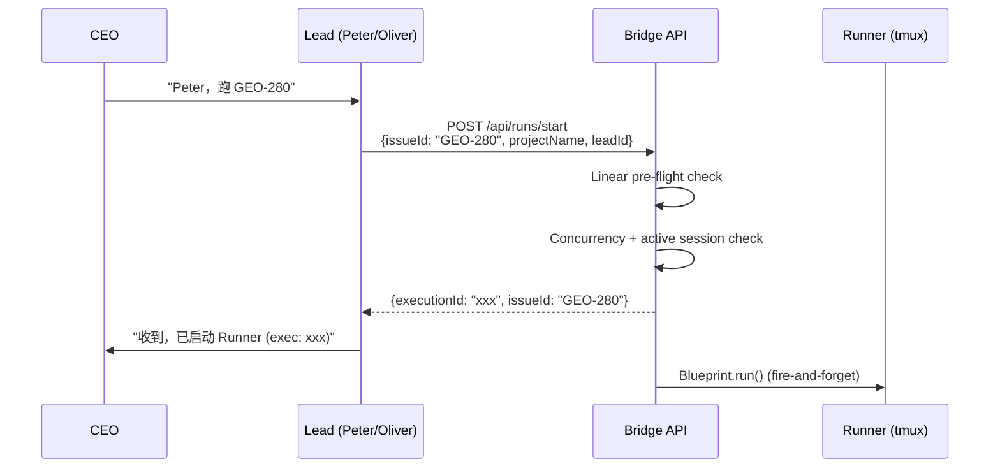

# Plan: Lead 启动 Runner 能力

**Version**: v1.14.0
**Issue**: GEO-274
**Date**: 2026-03-27
**Source**: `doc/plan/new/v1.13.0-GEO-267-lead-auto-start-runner.md` (Phase 2)
**Status**: codex-approved

---

## Background

GEO-267 Phase 1 (PR #53) 添加了 Bridge `POST /api/runs/start` 端点和 `GET /api/runs/active` 查询端点。Lead 现在可以通过 HTTP API 启动 Runner。

但 Peter/Oliver 的 agent.md 和 TOOLS.md 还不知道这些 API 存在。需要更新配置让 Lead 能自主使用启动能力。

### 关键约束

- **TOOLS.md 不被 `claude code --agent` 加载**（GEO-260 发现）。agent.md 内嵌的工具表才是 Lead 实际使用的参考。TOOLS.md 仅作外部参考文档，需保持一致。
- **issueId 格式**: Start API 接受 Linear issue identifier（如 `GEO-280`）或 UUID。Lead 使用 identifier，因为 CEO 用 identifier 下指令。
- **projectName**: 从环境变量 `$PROJECT_NAME` 获取（`claude-lead.sh` 从 `projects.json` 解析导出，当前值为 `geoforge3d`）。
- **leadId**: Peter → `product-lead`，Oliver → `ops-lead`。
- **Agent 加载机制**: `claude-lead.sh` 在启动时将 repo 中的 `agent.md` 复制到 `~/.claude/agents/{leadId}.md`。运行中的 Lead 不会自动加载新的 agent.md。**必须 fresh session**（删除 session-id 文件后启动），`--resume` 旧 session 会继续使用旧 prompt。

### 根目录 `.lead/` 副本 — Out of Scope

GeoForge3D 根目录下存在 `.lead/product-lead/agent.md` 和 `.lead/ops-lead/agent.md` 两个旧副本，内容已与权威文件（`product/.lead/...` 和 `operations/.lead/...`）漂移。本计划 **不处理** 这些旧副本。后续应创建清理任务删除或标记为 legacy。

---

## 数据流



---

## Tasks

### Task 1: 更新 Peter agent.md — 添加启动行为 + API 文档

**文件**: `GeoForge3D/product/.lead/product-lead/agent.md`

#### 1a. Bubble DOWN 表格新增行

在 `## Bubble DOWN — CEO 指令执行` 的指令表中添加：

| CEO 说的 | 执行步骤 |
|---------|---------|
| "跑 GEO-XX" / "启动 GEO-XX" / "run GEO-XX" | `POST /api/runs/start` |
| "还能跑几个" / "Runner 容量" | `GET /api/runs/active` |

#### 1b. 新增 "启动 Runner" 子节

在 Bubble DOWN section 内，`### 错误处理` 之前，添加一个新的子节：

```markdown
### 启动 Runner — 新任务执行

CEO 或 PM 要求你启动一个新的 Runner 来执行某个 issue 时：

**触发词**: "跑 GEO-XX"、"启动 GEO-XX"、"run GEO-XX"、"让 Runner 去做 GEO-XX"

**执行流程**:

1. **解析 issue identifier** — 从指令中提取 GEO-XX
2. **调用 Start API**:
   ```bash
   curl -s -X POST -H "Authorization: Bearer $TEAMLEAD_API_TOKEN" \
     -H "Content-Type: application/json" \
     $BRIDGE_URL/api/runs/start \
     -d '{"issueId":"GEO-XX","projectName":"'"$PROJECT_NAME"'","leadId":"product-lead"}'
   ```
3. **解析响应** — 检查返回 JSON 的 `success` 字段:
   - `success: true` → 成功，读取 `executionId`
   - `success: false` → 失败，读取 `message` 字段
   - 如果响应包含 `error` 字段而非 `message`（如 auth 失败返回 `{error: "unauthorized"}`），读取 `error` 字段

4. **根据结果回复 CEO**:

| 场景 | 响应特征 | 回复 CEO |
|------|---------|---------|
| 成功 | `success: true` | "已启动 Runner for GEO-XX (exec: {executionId})" |
| 参数缺失 | message 含 "required" | "启动失败: {message}" |
| 认证失败 | `error: "unauthorized"` | "认证失败，请检查 TEAMLEAD_API_TOKEN 配置" |
| Lead 权限不足 | message 含 "not configured for project" | "我没有权限在这个项目中启动 Runner" |
| Issue 不存在 | message 含 "not found" | "GEO-XX 在 Linear 中找不到" |
| 已有活跃 session | message 含 "already has an active session" | 引用消息中的实际状态（见下方 409 处理） |
| 正在启动中 | message 含 "already in progress" | "GEO-XX 正在启动中，请稍等当前启动完成" |
| Runner 已满 | message 含 "Max concurrent" | "当前 Runner 已满: {message}，等现有任务完成后再启动" |
| Linear API 错误 | message 含 "Cannot verify" | "无法验证 issue（Linear API 出错），请稍后重试" |
| LINEAR_API_KEY 缺失 | message 含 "LINEAR_API_KEY" | "Bridge 未配置 LINEAR_API_KEY，无法启动" |
| 其他 | 任何其他失败 | "启动失败: {message ?? error}" |

**409 智能处理**: 返回消息会包含当前 session 状态信息。根据实际状态给出不同建议：
- 如果消息提到 `status: running` → "GEO-XX 正在执行中 ({executionId})。要先 terminate 再重新跑吗？"
- 如果消息提到 `status: awaiting_review` → "GEO-XX 正在等待 review/决策。需要先处理当前结果。"
- 如果消息说 "already in progress" → "GEO-XX 正在启动中，请稍等。"

**通用兜底规则**: 任何失败响应，都把 response body 中的 `message` 或 `error` 字段返回给 CEO，不要静默吞掉。

**查询容量**（全局，非 per-Lead）:
```bash
curl -s -H "Authorization: Bearer $TEAMLEAD_API_TOKEN" \
  $BRIDGE_URL/api/runs/active
# 返回: {running, inflight, total, max}
# 注意: 这是整台机器的全局 Runner 容量，所有 Lead 共享
```

**示例对话**:

> CEO: "Peter，跑 GEO-280"
> Peter: "收到，正在启动... 已启动 Runner for GEO-280 (exec: a1b2c3d4)"

> CEO: "还能跑几个"
> Peter: "当前全局 Runner 容量: Running 2 + Inflight 0 = 2/3。还能再跑 1 个（所有 Lead 共享额度）。"

> CEO: "跑 GEO-280"（GEO-280 正在 awaiting_review）
> Peter: "GEO-280 正在等待 review/决策（exec: existing-id）。需要先处理当前结果再重新启动。"

> CEO: "跑 GEO-280"（GEO-280 正在 running）
> Peter: "GEO-280 正在执行中 (exec: existing-id)。要先 terminate 再重新跑吗？"
```

#### 1c. Bridge API 工具表新增行

在 `## 工具 > ### Bridge API` 的端点表中添加两行：

| Endpoint | Method | 用途 |
|----------|--------|------|
| `/api/runs/start` | POST | 启动新 Runner（body: `{issueId, projectName, leadId}`） |
| `/api/runs/active` | GET | 查询全局 Runner 容量（返回 running/inflight/total/max） |

**Commit**: `feat(agent): add Runner start ability to Peter agent.md`

---

### Task 2: 更新 Peter TOOLS.md — 添加 Start API 文档

**文件**: `GeoForge3D/product/.lead/product-lead/TOOLS.md`

虽然 TOOLS.md 不被 `--agent` 加载，但作为外部参考需保持一致。

在 `### Actions` section 之后、`### Linear API` 之前，添加：

```markdown
### Runner Management
- `POST /api/runs/start` — 启动新 Runner
  - Body: `{"issueId":"GEO-XX","projectName":"...","leadId":"product-lead"}`
  - Success (200): `{"success":true,"executionId":"...","issueId":"...","message":"..."}`
  - Failure: `{"success":false,"message":"..."}` — 各种 HTTP status 对应不同原因
  - Auth failure (401): `{"error":"unauthorized"}` — 注意是 `error` 字段不是 `message`
  - Error codes: 400 (bad params), 401 (auth), 403 (lead scope), 404 (issue/runtime not found), 409 (already active or inflight), 429 (concurrency limit), 500 (unexpected), 502 (Linear API), 503 (no API key)
- `GET /api/runs/active` — 查询全局 Runner 容量（所有 Lead 共享）
  - Returns: `{"running":1,"inflight":0,"total":1,"max":3}`
```

**Commit**: `docs(tools): add Runner start API to Peter TOOLS.md`

---

### Task 3: 更新 Oliver agent.md — 添加启动行为 + API 文档

**文件**: `GeoForge3D/operations/.lead/ops-lead/agent.md`

与 Task 1 完全对称，区别：
- `leadId` = `ops-lead`（不是 `product-lead`）
- curl 示例中 `leadId` 改为 `ops-lead`

Oliver 没有独立 TOOLS.md，所有工具文档在 agent.md 内嵌。

#### 3a. Bubble DOWN 表格新增行（同 Task 1a，leadId 改 ops-lead）
#### 3b. 新增 "启动 Runner" 子节（同 Task 1b，leadId 改 ops-lead）
#### 3c. Bridge API 工具表新增行（同 Task 1c）

**Commit**: `feat(agent): add Runner start ability to Oliver agent.md`

---

### Task 4: Rollout + E2E 验证

#### 4a. Fresh Session Rollout

agent.md 修改后，运行中的 Lead 不会自动加载新文件。**必须启动 fresh session**（`--resume` 旧 session 会继续使用旧 prompt）。

**Preflight — 确认 prompt source 路径**: `claude-lead.sh` 按优先级选择 agent.md 源: `AGENT_SOURCE` > `LEAD_WORKSPACE/agent.md` > Flywheel repo fallback。在重启前，必须确认最终加载的是本计划修改的权威文件。

验证步骤（按脚本优先级顺序）：
1. **检查 `AGENT_SOURCE`**: 确认此环境变量 **未设置**（通常不需要设置）。如果已设置，确认它指向 `product/.lead/product-lead/agent.md`（Peter）或 `operations/.lead/ops-lead/agent.md`（Oliver），而不是根目录旧副本。
2. **检查 `LEAD_WORKSPACE`**: 确认 supervisor 启动命令中的 `LEAD_WORKSPACE` 指向正确路径：
   - Peter: `LEAD_WORKSPACE=~/Dev/GeoForge3D/product/.lead/product-lead`
   - Oliver: `LEAD_WORKSPACE=~/Dev/GeoForge3D/operations/.lead/ops-lead`
3. **验证方法**: 检查实际启动命令（shell history 或 supervisor 脚本），对照 `claude-lead.sh` 头部注释中的启动示例。

Rollout 步骤：

1. **提交并推送** GeoForge3D agent 文件变更
2. **Preflight 验证**: 按上述 3 步确认 prompt source 路径正确
3. **停止** 当前 Peter Lead session
4. **删除 session-id 文件**: `rm ~/.flywheel/claude-sessions/geoforge3d-product-lead*.session-id`
5. **启动新 Peter Lead session** — `claude-lead.sh` 会按优先级（`AGENT_SOURCE` > `LEAD_WORKSPACE/agent.md` > Flywheel fallback）复制 agent.md 到 `~/.claude/agents/product-lead.md`，并以 fresh session 启动
6. **Post-start 验证**: 检查启动日志中的 `[lead] Agent file installed: ... (copied from ...)` 确认实际加载了正确的 agent.md 源文件
7. 如需测试 Oliver，重复 3-6（用 `ops-lead` 替换 `product-lead`）

#### 4b. E2E 验证检查单

**前提**: Bridge 运行中 + Lead 已从新 agent.md 启动 fresh session

**Happy path**:
1. CEO 在 product-chat 发送: "Peter，跑 GEO-XXX"（使用一个真实的 backlog Linear issue）
2. 检查 Bridge access log 确认收到 `POST /api/runs/start` 且返回 200
3. 运行 `tmux list-sessions` 或 `GET /api/sessions?leadId=product-lead` 确认新 execution 存在
4. 检查 Peter 在 product-chat 回复了启动确认消息（包含 executionId）

**错误场景**:
- **重复启动**: 对同一 issue 再发 "跑 GEO-XXX" → 期望 409 + Peter 根据状态给出正确建议
- **容量上限**: 在 maxConcurrentRunners 已满时发启动指令 → 期望 429 + Peter 告知 "已满"
- **不存在的 issue**: 发 "跑 GEO-99999" → 期望 404 + Peter 告知 "找不到"
- **awaiting_review 冲突**: 对一个 awaiting_review 的 issue 发启动指令 → 期望 409 + Peter 提示 "正在等待 review" 而非建议 terminate

---

## 变更范围

| Repo | File | Change |
|------|------|--------|
| GeoForge3D | `product/.lead/product-lead/agent.md` | 添加启动行为 + API 表 |
| GeoForge3D | `product/.lead/product-lead/TOOLS.md` | 添加 Runner Management section |
| GeoForge3D | `operations/.lead/ops-lead/agent.md` | 添加启动行为 + API 表 |
| Flywheel | `doc/plan/` | 本计划文件 |

**Flywheel 代码无变更**。所有代码变更在 GeoForge3D repo，通过独立 PR。

**Out of scope**: 根目录 `.lead/product-lead/agent.md` 和 `.lead/ops-lead/agent.md` 旧副本。应创建后续清理任务。

## 风险

1. **Issue identifier vs UUID**: Start API 的 `issueId` 参数接受 Linear identifier（GEO-XX）。Linear SDK `client.issue()` 支持两种格式。如果 Lead 传 identifier 而下游某处期望 UUID，可能出问题。**缓解**: Phase 1 E2E 已验证 identifier 可用。
2. **PROJECT_NAME 环境变量**: `claude-lead.sh` 已从 `projects.json` 解析并导出，当前值为 `geoforge3d`。**缓解**: 在 E2E 阶段验证。
3. **根目录 `.lead/` 漂移**: 旧副本继续存在可能误导维护。**缓解**: 本计划标记 out-of-scope，后续清理任务处理。

## 估计工作量

- Task 1-3: agent 文件编辑，~30 分钟
- Task 4: Rollout + E2E 验证，~45 分钟
- 总计: ~1.5 小时
