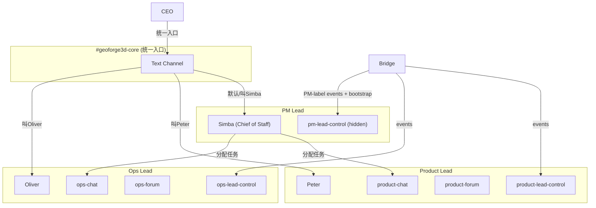

# Plan: PM Lead Simba + Core Channel

**Version**: v1.15.0
**Issue**: GEO-275
**Date**: 2026-03-27
**Source**: `doc/exploration/new/GEO-275-pm-lead-simba-core-channel.md`, `doc/research/new/GEO-275-pm-lead-simba-core-channel.md`
**Status**: codex-approved
**Review**: Round 1+2 feedback incorporated (guard strategy, access paths, launch script, channel ID alignment, lead ordering, plugin.ts, HeartbeatService type fix, control channel semantics, DirectEventSink test)

---

## 概述

引入第三个 Lead —— **Simba (PM Lead, Chief of Staff)**，创建 **#geoforge3d-core** 统一 Discord channel。CEO 在 core channel 发消息，Simba 默认接管，叫到 Peter/Oliver 时对应 Lead 回复。Simba 负责 triage 和任务分配，不管 Runner。

## 架构



## 前置条件

- ✅ GEO-274 (Lead 启动能力) — 已 merged
- ✅ GEO-267 (Lead 自动启动 Runner) — 已 merged

## 实施步骤

### Phase 1: Bridge 代码改动 — 使 forumChannel optional

**目标**: 让 Bridge 能加载没有 forumChannel 的 Lead，不影响现有 Peter/Oliver 流程。

#### Step 1.1: 修改 LeadConfig 类型

**文件**: `packages/teamlead/src/ProjectConfig.ts` line 7

```typescript
// Before
forumChannel: string;

// After
forumChannel?: string;
```

`chatChannel` 保持 required — Simba 的 chatChannel 就是 core channel ID。

#### Step 1.2: 修改 loadProjects 验证逻辑

**文件**: `packages/teamlead/src/ProjectConfig.ts` lines 103-110

将 forumChannel 非空检查改为"存在时验证"：

```typescript
// Before
if (typeof lead.forumChannel !== "string" || lead.forumChannel.length === 0) {
  throw new Error(`...forumChannel: must be a non-empty string`);
}

// After
if (lead.forumChannel !== undefined) {
  if (typeof lead.forumChannel !== "string" || lead.forumChannel.length === 0) {
    throw new Error(`...forumChannel: if provided, must be a non-empty string`);
  }
}
```

同时更新 line 88 的错误提示文本（`leads: [{ agentId, forumChannel, ...}]`），移除 forumChannel 从 required 字段列表中。

#### Step 1.3: 添加 forumChannel null guards（修正版）

**关键原则**: Notification 路径（DirectEventSink、HeartbeatService、actions）**不 early return**。hookPayload 的 `forum_channel` 字段在 `hook-payload.ts` 中已经是 optional，允许 undefined。只在真正需要 forum ID 的地方（ForumPostCreator 调用）加 guard。

修改策略：

| 文件 | 行 | 修改 | 说明 |
|------|-----|------|------|
| `DirectEventSink.ts` | ~216 | 保持 `const forumChannel = existingThread?.channel ?? lead.forumChannel;`，允许 undefined 传入 hookPayload | **不 return** — envelope 继续投递到 control/chat channel |
| `HeartbeatService.ts` | ~211,224 | **需要代码改动**: `let forumChannel: string` → `let forumChannel: string \| undefined`。赋值 `existingThread?.channel ?? resolved.lead.forumChannel` 结果可能是 undefined | 修复 TypeScript 类型错误 |
| `actions.ts` | ~78 | 同上 | **不 return** |
| `event-route.ts` | ~206 | `if (forumPostCreator && fpLead.forumChannel) { ... }` | **仅跳过 ForumPost 创建**，事件路由继续 |
| `event-route.ts` | ~480 | `const forumChannel = existingThread?.channel ?? lead.forumChannel;` — 允许 undefined | 同 DirectEventSink |
| `plugin.ts` | ~715-744 | multi-forum/global-fallback 诊断逻辑：(1) `allLeads.filter(l => l.forumChannel).map(l => l.forumChannel)` 过滤 undefined；(2) `leadsWithoutMap` 计算排除无 forumChannel 的 lead（它们不需要 statusTagMap） | 避免 undefined 入 Set + 消除误导性 warning |

**验证**: 无 forumChannel 的 Lead 仍收到 `session_started` / `heartbeat` / `action_executed` 通知，只是不创建 Forum Post / 不更新 Forum Tag。

#### Step 1.4: 测试

**现有 tests 更新**:
- `ProjectConfig.test.ts` — 修改"forumChannel 必填"的测试用例，改为"存在时验证"
- 修改所有创建 mock LeadConfig 的 test 文件，确保 TypeScript 类型兼容（forumChannel 现在 optional）

**新增 tests**:
- `ProjectConfig.test.ts`: loadProjects 接受无 forumChannel 的 lead 条目
- `event-route.test.ts`: 无 forum lead → ForumPostCreator 不调用，但事件仍路由
- `actions.test.ts`: 无 forum lead → action 仍执行，hookPayload.forum_channel 为 undefined
- `HeartbeatService.test.ts`: 无 forum lead → heartbeat 通知仍投递
- `DirectEventSink.test.ts`（或相关 test）: 无 forum lead → 事件仍正常投递到 control/chat，hookPayload.forum_channel 为 undefined

### Phase 2: Discord 手动配置

**目标**: 创建 Simba bot 和所需 channels。

#### Step 2.1: 创建 Simba Discord Bot

1. Discord Developer Portal → New Application → "Simba"
2. 创建 Bot，获取 token
3. 设置头像：Simba (The Lion King) — 使用 disneyclips.com 图片，1024x1024 PNG
4. 邀请到 server（权限 277025459264）

#### Step 2.2: 创建 Discord Channels

1. **#geoforge3d-core** — Text channel（非 forum）
   - 所有 bot (Simba + Peter + Oliver) + CEO 可见
   - 位置：server 顶部，作为统一入口
2. **#pm-lead-control** — Text channel（隐藏）
   - 仅 Simba bot 可见
   - 用于 Bridge 事件推送

#### Step 2.3: 确保 Peter/Oliver bot 有 core channel 权限

Discord server settings → Channels → #geoforge3d-core → Permissions → 添加 Peter bot + Oliver bot 读写权限。

### Phase 3: 本地配置文件

**目标**: 配置 Simba 的运行时环境。

#### Step 3.1: 保存 Bot Token

`~/.flywheel/.env` 添加：
```
SIMBA_BOT_TOKEN=<token>
```

#### Step 3.2: 创建 Discord State Directory

`~/.claude/channels/discord-pm-lead/`（注意：目录名必须匹配 LEAD_ID = `pm-lead`）:

**.env**:
```
DISCORD_BOT_TOKEN=<simba_token>
```

**access.json**:
```json
{
  "dmPolicy": "pairing",
  "allowFrom": ["1138241636057481306"],
  "groups": {
    "{core_channel_id}": { "requireMention": false, "allowFrom": [] },
    "{pm_control_channel_id}": { "requireMention": false, "allowFrom": [] }
  },
  "pending": {}
}
```

#### Step 3.3: 更新 Peter access.json

**文件**: `~/.claude/channels/discord-product-lead/access.json`（不是 `discord-peter`）

claude-lead.sh 使用 `discord-${LEAD_ID}`，Peter 的 LEAD_ID 是 `product-lead`。

groups 中添加：
```json
"{core_channel_id}": { "requireMention": false, "allowFrom": [] }
```

#### Step 3.4: 更新 Oliver access.json

**文件**: `~/.claude/channels/discord-ops-lead/access.json`（不是 `discord-oliver`）

Oliver 的 LEAD_ID 是 `ops-lead`。同上添加 core channel。

#### Step 3.5: 清理 default Discord state dir

确保 `~/.claude/channels/discord/` 的 groups 为空（防止 bot 在默认状态下响应 core channel）。

### Phase 4: projects.json 更新

**文件**: `~/.flywheel/projects.json`

在 geoforge3d 的 leads 数组**末尾** append（**不能放在前面**，因为 `resolveLeadForIssue()` 在无 label 匹配时 fallback 到 `leads[0]`，Simba 不应是默认 fallback）：

```json
{
  "agentId": "pm-lead",
  "chatChannel": "{core_channel_id}",
  "match": { "labels": ["PM"] },
  "runtime": "claude-discord",
  "controlChannel": "{pm_control_channel_id}",
  "botTokenEnv": "SIMBA_BOT_TOKEN"
}
```

注意：**无 forumChannel，无 statusTagMap**。

leads 数组最终顺序：`[product-lead, ops-lead, pm-lead]`

### Phase 5: Agent 文件（GeoForge3D repo）

**目标**: 定义 Simba 身份和行为，同时对齐 Peter/Oliver 的 channel IDs。

#### Step 5.1: 创建 Simba agent.md

**文件**: `GeoForge3D/.lead/pm-lead/agent.md`

核心内容：

```yaml
---
name: pm-lead
description: Flywheel PM Lead (Chief of Staff) — triage, task assignment, cross-department coordination via Discord
model: opus
memory: user
disallowedTools: Write, Edit, MultiEdit, Agent, NotebookEdit
permissionMode: bypassPermissions
---
```

Agent 身份：
- **名字**: Simba
- **角色**: PM Lead / Chief of Staff — 统一调度者
- **绝对不做**: 写代码、管 Runner、创建 tmux sessions
- **只做**: Triage、任务分配、跨部门协调、全局状态查询

Channel 隔离规则：
- ✅ `{core_channel_id}` (geoforge3d-core) — 主 channel
- ✅ `{pm_control_channel_id}` (pm-lead-control) — Bridge 事件
- ❌ 其他所有 channel — 静默忽略

Core Channel 路由规则（关键）：
```
在 #geoforge3d-core 收到消息时：
1. 被叫名字（"Simba"）或没叫任何人 → 你回复
2. 叫了 Peter 或 Oliver → 不回复
3. 叫了多个人包括你 → 回复你负责的部分
```

任务分配能力：
- CEO 说 "Peter 去做 XXX" → Simba 不干预（Peter 直接在 core channel 回复）
- CEO 说 "谁来做 XXX" → Simba 判断该分给谁，在对应 Lead 的 chat channel 发消息
- CEO 说 "全局状态" → Simba 查询 Bridge API 汇总

Bridge API（仅查询，不执行 actions）：
- `GET /api/sessions` — 全局 session 列表
- `GET /api/runs/active` — Runner 容量
- `GET /api/sessions?mode=recent` — 最近活动

不包含的能力（Phase 3 MVP）：
- ❌ 自动 Triage (LNO/ICE) — GEO-276
- ❌ 自行回答 Runner 问题
- ❌ 创建 Linear issue

#### Step 5.2: 创建 Simba TOOLS.md

**文件**: `GeoForge3D/.lead/pm-lead/TOOLS.md`

记录：
- Bridge API 查询端点（带 leadId=pm-lead 参数）
- 各 Lead 的 chat channel ID（用于跨 channel 发消息）
- Guild ID（用于链接构造）
- Discord MCP 命令参考

#### Step 5.3: 修改 Peter agent.md — 整体对齐 channel IDs + 添加 Core Channel 规则

**不是增量插入** — 整体重写 Channel 隔离段，先与 `projects.json` / `discord-product-lead/access.json` 对齐当前 live IDs，再追加 core channel：

1. Channel 隔离规则 — 使用 projects.json 中的 canonical IDs：
   ```
   - ✅ `{product_chat_id}` (product-chat) — 你的主 channel
   - ✅ `{product_forum_id}` (product-forum) — 你的 forum
   - ✅ `{product_control_id}` (product-lead-control) — Bridge 事件
   - ✅ `{core_channel_id}` (geoforge3d-core) — 统一入口
   - ❌ 所有其他 channel — 静默忽略
   ```

2. 添加 Core Channel 路由规则 section：
   ```
   ## Core Channel 路由规则

   在 #geoforge3d-core 收到消息时：
   1. 被叫名字（"Peter"）或被 @mention → 你回复
   2. 没叫任何人，或叫了别人 → 不回复（Simba 会接管）
   ```

#### Step 5.4: 修改 Oliver agent.md — 同上

同样整体对齐 channel IDs（使用 projects.json 中的 canonical IDs）+ 添加 core channel 路由规则。

### Phase 6: 启动配置

#### Step 6.1: Simba 启动命令

claude-lead.sh 在 agent file lookup 时先读 `$LEAD_WORKSPACE`（line 120），但 `LEAD_WORKSPACE` 的默认化在 line 146。需要显式传 `LEAD_WORKSPACE`：

```bash
source ~/.flywheel/.env
cd ~/Dev/flywheel/packages/teamlead && \
DISCORD_BOT_TOKEN=$SIMBA_BOT_TOKEN \
LEAD_WORKSPACE=/Users/xiaorongli/Dev/GeoForge3D/.lead/pm-lead \
  ./scripts/claude-lead.sh pm-lead /Users/xiaorongli/Dev/GeoForge3D geoforge3d
```

**必须传 `LEAD_WORKSPACE`** — 否则 agent file lookup 找不到 `.lead/pm-lead/agent.md`。

### Phase 7: 验证

#### Step 7.1: Bridge 启动测试

```bash
pnpm -r build && pnpm test
```

确认所有现有 test 通过 + 新 test 通过。

#### Step 7.2: E2E 验证

1. 启动 Bridge（加载更新后的 projects.json）
2. 启动 Simba（用 Phase 6.1 的命令）
3. 验证 Simba 在 core channel 回复
4. 验证 CEO 说 "Peter，XXX" 时 Peter 回复、Simba 不回复
5. 验证 CEO 说一般性消息时 Simba 回复、Peter/Oliver 不回复
6. 验证 Simba 能向 Peter/Oliver chat channel 发消息
7. 验证 Bridge 不为 pm-lead 创建 Forum Post（因为无 forumChannel）
8. 验证 PM-labelled issue 事件能到达 pm-lead-control channel
9. 验证普通 Product/Operations issue 事件**不会**到达 pm-lead-control（单播路由验证）

---

## PR 策略

**两个 PR**（和 GEO-274 相同模式）：

| PR | Repo | 内容 |
|----|------|------|
| Flywheel PR | xrliAnnie/flywheel | Phase 1 (forumChannel optional + guards + tests) |
| GeoForge3D PR | xrliAnnie/geoforge3d | Phase 5 (agent files: Simba 新建 + Peter/Oliver 对齐 + core routing) |

Phase 2 (Discord channels)、Phase 3 (local config)、Phase 4 (projects.json) 是手动操作，不入 PR。

---

## 文件改动汇总

### Flywheel Repo

| 操作 | 文件 | 改动 |
|------|------|------|
| 修改 | `packages/teamlead/src/ProjectConfig.ts` | type (forumChannel?) + validation (存在时验证) + error message text |
| 修改 | `packages/teamlead/src/HeartbeatService.ts` | `let forumChannel: string` → `string \| undefined` |
| 修改 | `packages/teamlead/src/bridge/event-route.ts` | ForumPostCreator guard: `if (forumPostCreator && fpLead.forumChannel)` |
| 修改 | `packages/teamlead/src/bridge/plugin.ts` | filter undefined forumChannel + exclude no-forum leads from warning |
| 修改 | `packages/teamlead/src/__tests__/ProjectConfig.test.ts` | 更新"必填"tests + 新增"optional"tests |
| 修改 | `packages/teamlead/src/__tests__/event-route.test.ts` | 新增: 无 forum lead 跳过 ForumPost |
| 修改 | `packages/teamlead/src/__tests__/actions.test.ts` | 新增: 无 forum lead action 仍执行 |
| 修改 | `packages/teamlead/src/__tests__/HeartbeatService.test.ts` | 新增: 无 forum lead heartbeat 仍投递 |
| 修改 | `packages/teamlead/src/__tests__/DirectEventSink.test.ts` (或相关 test) | 新增: 无 forum lead 事件仍正常投递（forum_channel 为 undefined） |
| 修改 | `doc/VERSION` | v1.15.0 |

注意: `DirectEventSink.ts`、`actions.ts` 的 notification 路径**不需修改** — `hookPayload.forum_channel` 已经是 optional，undefined 自然传递。`HeartbeatService.ts` 需要修改 type annotation（`let forumChannel: string` → `string | undefined`）。

**pm-lead-control 语义说明**: RuntimeRegistry 是单播路由（`resolveWithLead()` 返回一个 lead），Simba 的 control channel 仅接收 PM-labelled issue 的事件和 bootstrap 快照。不会自动收到 Product/Operations 事件。全局 fan-out 不在 GEO-275 scope 内。

### GeoForge3D Repo

| 操作 | 文件 | 改动 |
|------|------|------|
| 新增 | `.lead/pm-lead/agent.md` | Simba 身份 + triage + core channel routing |
| 新增 | `.lead/pm-lead/TOOLS.md` | Bridge API + Lead channel IDs |
| 修改 | `.lead/product-lead/agent.md` | 整体对齐 channel IDs + core channel 路由规则 |
| 修改 | `.lead/ops-lead/agent.md` | 整体对齐 channel IDs + core channel 路由规则 |

---

## 不做的事

- ❌ 修改 claude-lead.sh（现有设计可用，只需显式传 LEAD_WORKSPACE）
- ❌ 修改 EventFilter / RuntimeRegistry / Bootstrap（不需要）
- ❌ 修改 DirectEventSink / actions 的 notification 路径（forum_channel 已 optional，hookPayload 接受 undefined）
- ⚠️ HeartbeatService 需要 **type 修改**（`let forumChannel: string` → `string | undefined`），但 notification 逻辑不变
- ❌ GEO-276 PM 自动 Triage — 后续 issue
- ❌ Simba 管 Runner — 不在 PM 职责内
- ❌ Simba 创建 Linear issue — 后续可加

## 风险

| 风险 | 概率 | 影响 | 缓解 |
|------|------|------|------|
| forumChannel optional 引入回归 | Low | Medium | 现有 tests 更新 + 新增 5 个 test 场景 |
| 多 bot 同时回复 core channel | Medium | Low | Prompt 路由规则明确；观察后调整 |
| Peter/Oliver 在 core channel 过度回复 | Low | Low | Channel 隔离 + "没叫你就不回复" |
| pm-lead 在 leads[0] 导致默认路由错误 | Low | High | Plan 明确 append 到末尾 |
