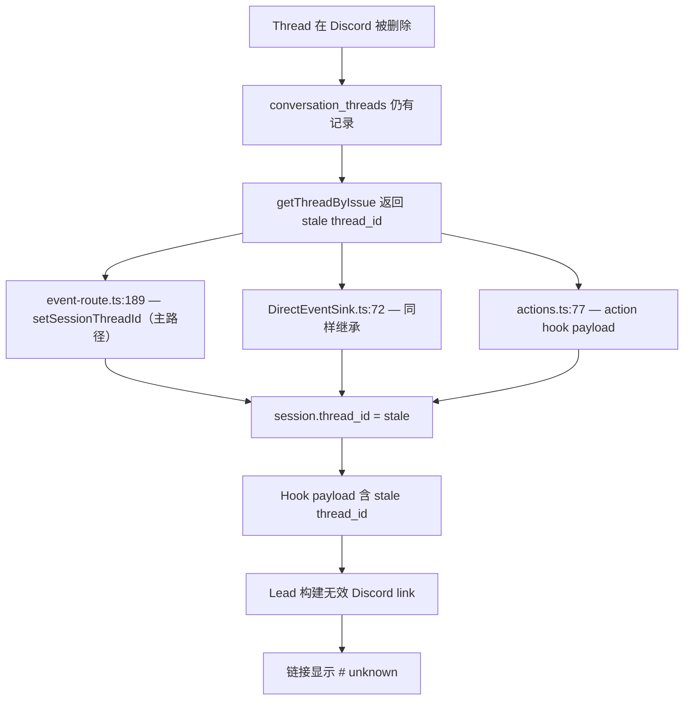
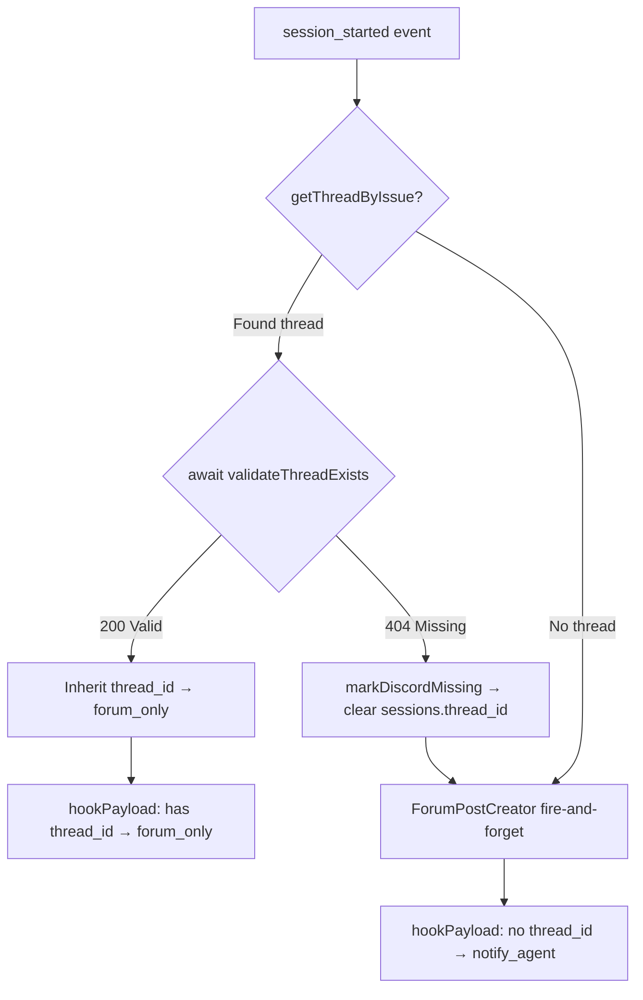
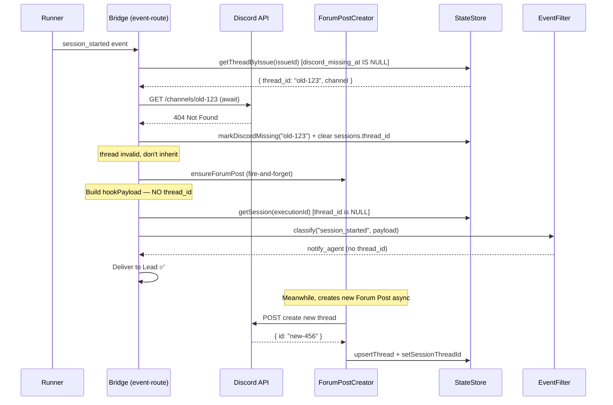

# Plan: Forum Thread Link "unknown" Fix

**Version**: v1.17.0
**Issue**: GEO-200
**Date**: 2026-03-30
**Source**: `doc/exploration/new/GEO-200-forum-thread-link-unknown.md`, `doc/research/new/GEO-200-thread-validation.md`
**Status**: codex-approved

## Summary

Agent 在 Chat channel 通知 Annie 时，Forum Thread link 显示 `# unknown`。根因是 Bridge 的 thread 继承逻辑复用了已被 Discord 删除的 thread ID，且没有在继承前验证 thread 是否仍存在于 Discord。

## Root Cause



**关键发现**：Thread 继承的主路径不在 ForumPostCreator，而在 `event-route.ts:189` 和 `DirectEventSink.ts:72`。ForumPostCreator 只在**完全没有 thread** 时才被调用。

## Fix Strategy

### 核心方案：共享 `validateThreadExists()` helper + 新字段 `discord_missing_at`

不复用 `archived_at`（它服务于 cleanup 流程，有独立的 clearArchived 复用语义），新增 `discord_missing_at` 字段标记"Discord 侧已不存在"的 thread。

### Scope 限定

本方案目标是**阻止 session_started 时继承已删除的 thread + 在检测到 missing 时清理所有引用**。

**已知限制**: 如果 Discord thread 在 session_started 之后（session 运行期间）被删除，已写入 `sessions.thread_id` 的值会保持直到下一次同 issue 的 `session_started` 触发验证。这个时间窗口内的 session 查询可能返回 stale thread_id。这是可接受的 — 运行期间删除 thread 是罕见操作，且 `markDiscordMissing()` 在下次触发时会级联清理所有 session 引用。

### 通知语义保持不变

**关键约束**: EventFilter 用 `hookPayload.thread_id` 存在与否区分通知路由：
- `session_started` + no thread_id → `notify_agent`（Lead 收到通知）
- `session_started` + has thread_id → `forum_only`（仅 Forum tag 更新）

**设计原则**:
- 验证步骤 (Discord API GET) 必须 `await`（同步），确保不写入 stale thread_id
- ForumPostCreator（新 thread 创建）**保持 fire-and-forget**，不改变通知语义
- 当 stale thread 被标记 missing 后，走 ForumPostCreator fire-and-forget 路径 → hook payload 无 thread_id → `notify_agent` → Lead 被通知，这是正确行为

### Step 1: StateStore 改动

**文件**: `packages/teamlead/src/StateStore.ts`

#### 1a. Migration: 新增 `discord_missing_at` 列

```typescript
// Follow existing try/catch pattern (same as archived_at, cleanup_notified_at):
try {
  this.db.run(
    "ALTER TABLE conversation_threads ADD COLUMN discord_missing_at TEXT"
  );
} catch { /* exists */ }
```

#### 1b. `getThreadByIssue()` 过滤 `discord_missing_at`

```typescript
// Before
"SELECT thread_id, channel FROM conversation_threads WHERE issue_id = ?"

// After
"SELECT thread_id, channel FROM conversation_threads
 WHERE issue_id = ? AND discord_missing_at IS NULL"
```

**不过滤 `archived_at`** — 保留 archived_at 现有语义。

#### 1c. 新增 `markDiscordMissing()` 方法

```typescript
markDiscordMissing(threadId: string): void {
  // Mark in conversation_threads
  this.db.run(
    "UPDATE conversation_threads SET discord_missing_at = datetime('now') WHERE thread_id = ?",
    [threadId],
  );
  // Clear stale session references (GEO-200: prevent sessions.thread_id from leaking stale values)
  this.db.run(
    "UPDATE sessions SET thread_id = NULL WHERE thread_id = ?",
    [threadId],
  );
  this.save();
}
```

**关键**: `markDiscordMissing()` 同时清理 `sessions.thread_id`，确保所有对外暴露的 session 查询不再返回 stale thread_id。这是统一 canonical thread_id 来源的最简方案 — 无需引入新的 resolver 抽象，直接在 mark 时清理。

### Step 2: 共享 thread 验证 helper

**文件**: `packages/teamlead/src/bridge/thread-validator.ts` (新文件)

```typescript
const DISCORD_API = "https://discord.com/api/v10";

export interface ThreadValidationDeps {
  markDiscordMissing: (threadId: string) => void;
}

/**
 * Validate that a Discord thread still exists.
 * Returns true if valid (or on non-404 errors — fail-open).
 * Returns false and marks thread as missing on 404.
 */
export async function validateThreadExists(
  threadId: string,
  botToken: string,
  deps: ThreadValidationDeps,
): Promise<boolean> {
  try {
    const res = await fetch(`${DISCORD_API}/channels/${threadId}`, {
      headers: { Authorization: `Bot ${botToken}` },
    });
    if (res.status === 404) {
      deps.markDiscordMissing(threadId);
      return false;
    }
    return true; // fail-open for 429, 5xx, etc.
  } catch {
    return true; // fail-open on network error
  }
}
```

### Step 3: event-route.ts — 继承前验证

**文件**: `packages/teamlead/src/bridge/event-route.ts`

只 await 验证步骤，ForumPostCreator **保持 fire-and-forget**：

```typescript
// Before (lines 187-227):
if (!transitionRejected) {
  const existingThread = store.getThreadByIssue(event.issue_id);
  if (existingThread) {
    store.setSessionThreadId(event.execution_id, existingThread.thread_id);
    store.clearArchived(existingThread.thread_id);
  } else if (forumPostCreator) {
    // fire-and-forget
    forumPostCreator.ensureForumPost({...}).catch(...)
  }
}

// After:
if (!transitionRejected) {
  const existingThread = store.getThreadByIssue(event.issue_id);
  if (existingThread) {
    // GEO-200: Validate thread still exists in Discord before inheriting
    const { lead: valLead } = resolveLeadForIssue(
      projects, event.project_name, eventLabels
    );
    const botToken = valLead.botToken ?? config.discordBotToken;
    let threadValid = true;
    if (botToken) {
      threadValid = await validateThreadExists(
        existingThread.thread_id,
        botToken,
        { markDiscordMissing: (id) => store.markDiscordMissing(id) },
      );
    }
    if (threadValid) {
      store.setSessionThreadId(event.execution_id, existingThread.thread_id);
      store.clearArchived(existingThread.thread_id);
    } else {
      console.warn(
        `[event-route] Thread ${existingThread.thread_id} missing from Discord, will create new`
      );
      // Fall through to ForumPostCreator (fire-and-forget)
    }
  }

  // ForumPostCreator: fire-and-forget (UNCHANGED from current behavior)
  // This preserves EventFilter notification semantics:
  //   session_started + no thread_id → notify_agent (Lead gets notified)
  //   session_started + has thread_id → forum_only
  if (!store.getSession(event.execution_id)?.thread_id && forumPostCreator) {
    const { lead: fpLead } = resolveLeadForIssue(
      projects, event.project_name, eventLabels
    );
    if (fpLead.forumChannel) {
      forumPostCreator
        .ensureForumPost({
          forumChannelId: fpLead.forumChannel,
          issueId: event.issue_id,
          issueIdentifier: asString(payload.issueIdentifier),
          issueTitle: asString(payload.issueTitle),
          executionId: event.execution_id,
          status: "running",
          discordBotToken: fpLead.botToken ?? config.discordBotToken,
          statusTagMap: fpLead.statusTagMap,
        })
        .catch((err) => {
          console.warn(
            `[event-route] ForumPostCreator failed: ${(err as Error).message}`
          );
        });
    }
  }
}
```

**通知语义分析**:
- **Valid existing thread**: inherit → session.thread_id set → hookPayload has thread_id → `forum_only` ✅ (same as before)
- **Deleted existing thread**: mark missing → NOT inherited → ForumPostCreator fire-and-forget → hookPayload has NO thread_id → `notify_agent` ✅ (Lead gets notified about re-created issue)
- **No existing thread**: ForumPostCreator fire-and-forget → hookPayload has NO thread_id → `notify_agent` ✅ (same as before)

### Step 4: DirectEventSink.ts — 同样验证

**文件**: `packages/teamlead/src/DirectEventSink.ts`

```typescript
// Before (lines 71-76):
const existingThread = this.store.getThreadByIssue(env.issueId);
if (existingThread) {
  this.store.setSessionThreadId(env.executionId, existingThread.thread_id);
  this.store.clearArchived(existingThread.thread_id);
}

// After:
const existingThread = this.store.getThreadByIssue(env.issueId);
if (existingThread) {
  // GEO-200: Validate + per-lead bot token (GEO-252)
  // registry is optional — guard before using
  let botToken = this.config.discordBotToken;
  if (this.registry) {
    const labels = this.store.getSessionLabels(env.executionId);
    const { lead } = this.registry.resolveWithLead(
      this.projects, env.projectName, labels
    );
    botToken = lead.botToken ?? this.config.discordBotToken;
  }
  let threadValid = true;
  if (botToken) {
    threadValid = await validateThreadExists(
      existingThread.thread_id, botToken,
      { markDiscordMissing: (id) => this.store.markDiscordMissing(id) },
    );
  }
  if (threadValid) {
    this.store.setSessionThreadId(env.executionId, existingThread.thread_id);
    this.store.clearArchived(existingThread.thread_id);
  }
}
```

**Per-lead token**: `registry` 是 optional（`DirectEventSink` 构造函数 line 39），有 registry 时用 `lead.botToken ?? config`，无 registry 时 fallback 到 `config.discordBotToken`。与现有 `pushNotification()` 的 legacy fallback 模式一致。

**`emitStarted()` 已经是 async** (line 42: `async emitStarted(env: EventEnvelope): Promise<void>`)���无需改签名。

### Step 5: tools.ts — `mode=by_identifier` 添加 thread fallback

**文件**: `packages/teamlead/src/bridge/tools.ts`

`by_identifier` 分支（line 62-77）是 Lead 实际使用的路径（SOUL.md:90），但不包含 thread fallback。

```typescript
// After (GEO-200):
case "by_identifier": {
  const identifier = req.query.identifier as string;
  if (!identifier) {
    res.status(400).json({
      error: "identifier query param required for mode=by_identifier",
    });
    return;
  }
  const session = store.getSessionByIdentifier(identifier);
  sessions = session ? [session] : [];
  // GEO-200: Thread fallback (same logic as /sessions/:id)
  const mapped = sessions.map((s) => {
    const result = omitIssueId(s);
    if (!s.thread_id) {
      const thread = store.getThreadByIssue(s.issue_id);
      if (thread) {
        (result as Record<string, unknown>).thread_id = thread.thread_id;
      }
    }
    return result;
  });
  res.json({ sessions: mapped, count: sessions.length });
  return;
}
```

**Note**: `getThreadByIssue()` 已过滤 `discord_missing_at IS NULL`，所以 stale thread 不会通过 fallback 泄漏。同样，`markDiscordMissing()` 已清理 `sessions.thread_id`，所以 `s.thread_id` 本身也不再是 stale。双重保护。

### Step 6: SOUL.md + TOOLS.md 更新

**文件**: `doc/reference/product-lead-SOUL.md`

```markdown
## Forum Thread Links

When discussing an issue in Chat, include a link to its Forum Thread
when available:

- Query: `GET /api/sessions?mode=by_identifier&identifier={ISSUE-ID}`
- If `thread_id` exists in response:
  append `https://discord.com/channels/{guild_id}/{thread_id}`
- If no `thread_id`: skip the link (thread not created yet)
- Get guild_id from `GET /api/config/discord-guild-id`
- If guild_id unavailable: skip the link entirely
```

**文件**: `doc/reference/product-lead-TOOLS.md`

在 Session API 描述中明确 thread_id 含义：
```markdown
Response includes `thread_id` (if available) — use for Forum links:
`https://discord.com/channels/{guild_id}/{thread_id}`
Note: `thread_id` is only present when a valid Forum Thread exists.
If absent, the thread has not been created yet.
```

### Step 7: ForumPostCreator — 继承前验证（defense-in-depth）

**文件**: `packages/teamlead/src/bridge/ForumPostCreator.ts`

```typescript
async ensureForumPost(ctx: ForumPostContext): Promise<ForumPostResult> {
  const existing = this.store.getThreadByIssue(ctx.issueId);
  if (existing) {
    // GEO-200: Validate thread still exists in Discord
    if (ctx.discordBotToken) {
      const valid = await validateThreadExists(
        existing.thread_id, ctx.discordBotToken,
        { markDiscordMissing: (id) => this.store.markDiscordMissing(id) },
      );
      if (!valid) {
        console.warn(
          `[ForumPostCreator] Thread ${existing.thread_id} missing`
        );
        // getThreadByIssue filters discord_missing_at, fall through to create
      } else {
        return { created: false, threadId: existing.thread_id };
      }
    } else {
      return { created: false, threadId: existing.thread_id };
    }
  }
  // ... rest unchanged (thread creation logic)
}
```

## Tests (TDD)

### 新文件: `packages/teamlead/src/__tests__/thread-validator.test.ts`

| Test | 验证 |
|------|------|
| Returns true for valid thread (200) | fetch 200 → true, no markDiscordMissing |
| Returns false for deleted thread (404) | fetch 404 → false, calls markDiscordMissing |
| Fail-open on 429 | fetch 429 → true |
| Fail-open on 500 | fetch 500 → true |
| Fail-open on network error | fetch throws → true |

### 扩展: `packages/teamlead/src/__tests__/ForumPostCreator.test.ts`

| Test | 验证 |
|------|------|
| Validates existing thread (200) → reuse | Discord API called → returns existing |
| Creates new when existing deleted (404) | markDiscordMissing → new thread created |
| Fail-open on error → reuse existing | fetch throws → returns existing |
| No bot token → skip validation, reuse | 无 token → 直接返回 |

### 扩展: `packages/teamlead/src/__tests__/StateStore.test.ts`

| Test | 验证 |
|------|------|
| getThreadByIssue skips discord_missing | markDiscordMissing → returns undefined |
| getThreadByIssue still returns archived | markArchived → still returns |
| markDiscordMissing clears sessions.thread_id | session 的 thread_id 被置为 NULL |
| markDiscordMissing writes timestamp | Column exists + value set |

### 扩展: tools/API 测试

| Test | 验证 |
|------|------|
| by_identifier includes thread_id fallback | session 无 thread_id → fallback 返回 |
| by_identifier skips discord_missing thread | missing thread → 不返回 |
| /sessions/:id skips discord_missing thread | 同上 |
| Session with stale thread_id after markDiscordMissing | thread_id 已被清除 |

### 扩展: `packages/teamlead/src/__tests__/event-route.test.ts` (关键回归测试)

| Test | 验证 |
|------|------|
| session_started + valid existing thread | 继承 thread → hookPayload 有 thread_id → EventFilter `forum_only` |
| session_started + deleted existing thread | 标记 missing → 不继承 → hookPayload 无 thread_id → EventFilter `notify_agent` |
| session_started + no existing thread | ForumPostCreator fire-and-forget → hookPayload 无 thread_id → EventFilter `notify_agent` |
| session_started + stale thread + markDiscordMissing | sessions.thread_id 被清除 → 后续查询干净 |

### DirectEventSink 回归测试

| Test | 验证 |
|------|------|
| emitStarted: valid thread → inherit | 同 event-route 语义 |
| emitStarted: deleted thread → skip inherit | markDiscordMissing called |
| emitStarted: per-lead token with registry | 有 registry → 用 lead.botToken |
| emitStarted: no registry → fallback to config token | 无 registry → 用 config.discordBotToken |

## File Changes

| File | Change | Lines |
|------|--------|-------|
| `StateStore.ts` | migration + filter + markDiscordMissing (含 sessions 清理) | ~20 |
| `thread-validator.ts` | 新文件：validateThreadExists | ~25 |
| `ForumPostCreator.ts` | 继承前验证 (defense-in-depth) | ~15 |
| `event-route.ts` | await 验证 + ForumPostCreator 保持 fire-and-forget | ~30 |
| `DirectEventSink.ts` | emitStarted 验证 + per-lead token | ~15 |
| `tools.ts` | by_identifier thread fallback | ~10 |
| `product-lead-SOUL.md` | Forum link 规则更新 | ~5 |
| `product-lead-TOOLS.md` | thread_id 说明更新 | ~3 |
| `thread-validator.test.ts` | 新测试文件 | ~60 |
| `ForumPostCreator.test.ts` | 扩展 | ~50 |
| `StateStore.test.ts` | 扩展 | ~30 |
| `tools.test.ts` / API 测试 | 扩展 | ~25 |
| `event-route.test.ts` | 回归测试（通知语义） | ~60 |

**Total**: ~350 行新增/修改

## Risks

| Risk | Mitigation |
|------|------------|
| Discord API rate limit | Fail-open + 只在 session_started 时验证（低频） |
| markDiscordMissing 清理 sessions.thread_id | 幂等操作，stale thread 本就不应在 session 中 |
| DirectEventSink.emitStarted 变 async | 检查调用方签名兼容性 |
| 新 migration 列 | SQLite ALTER TABLE ADD COLUMN 安全 |
| ForumPostCreator 保持 fire-and-forget | 通知语义不变，但 deleted thread 场景下 Forum Post 创建有轻微延迟 |

## Notification Semantics (unchanged)



## Sequence: session_started with stale thread



## Out of Scope

- **Real-time thread polling** — 不在每次 API 查询时验证 thread，只在 session_started 时验证���运行期间 thread 被删除的 stale 窗口是可接受的（见 Scope 限定）
- **Canonical thread resolver 抽象** — `markDiscordMissing()` 直接清理 sessions.thread_id 是更简单的方案，无需��的 resolver 层
- Hook payload `thread_valid` 字段 — 源头修复 + sessions.thread_id 清理��覆盖
- 定期全量 thread 扫描 — GEO-270 stale patrol 已覆盖
- `actions.ts` 中的 `getThreadByIssue` — `discord_missing_at IS NULL` 过滤 + `markDiscordMissing()` 清理 sessions.thread_id 双重保护
- event-route.ts line 482 的 `getThreadByIssue` — 同样被过滤保护
