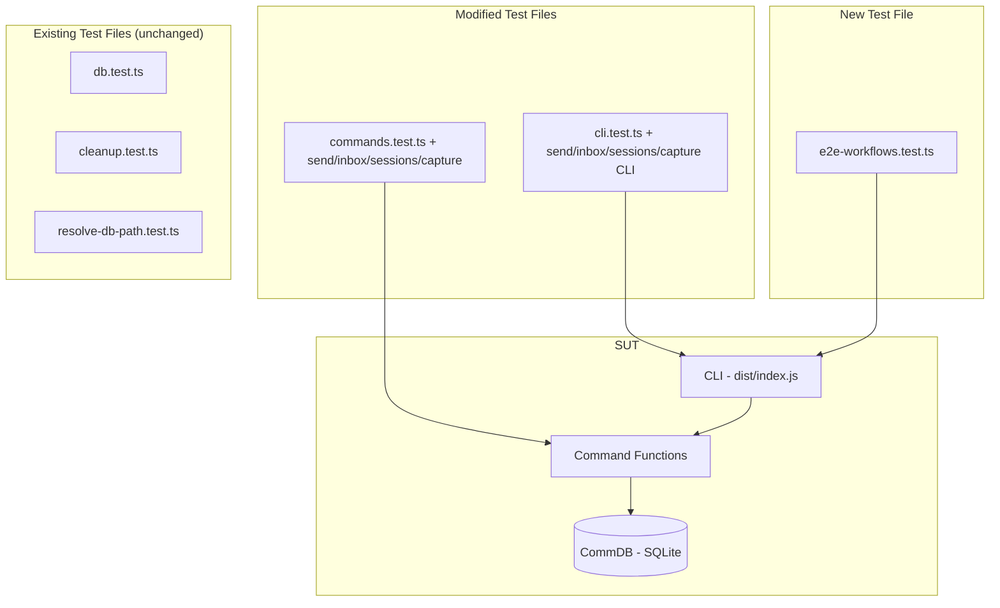

# Plan: flywheel-comm E2E Integration Tests

**Version**: v1.17.0
**Issue**: GEO-254
**Date**: 2026-03-28
**Source**: `doc/exploration/new/GEO-254-flywheel-comm-e2e.md`, `doc/research/new/GEO-254-flywheel-comm-e2e.md`
**Status**: codex-approved

## Goal

Add E2E integration tests for flywheel-comm's zero-coverage commands (send, inbox, sessions, capture) at both function-level and CLI-level, plus cross-command workflow verification.

## Design Decisions (Codex Round 1+2 feedback incorporated)

1. **Extend existing test files** — Add send/inbox/sessions/capture function tests to `commands.test.ts`, CLI tests to `cli.test.ts`. Reuse existing `runCli`/`runCliSafe` helpers in `cli.test.ts`.
2. **One new file only** — `e2e-workflows.test.ts` for cross-command CLI workflows. This file has its own minimal `runCli` helper (5 lines, justified by standalone nature).
3. **No redundant coverage** — Skip tests already covered by `db.test.ts` (WAL, session CRUD, hasPendingQuestionsFrom, expiry, readonly).
4. **capture testing** — Function-level: mock `execFileSync` for tmux (same pattern as `cleanup.test.ts`). CLI-level: fake `tmux` shell script on PATH.
5. **CLI failure paths** — Cover missing required args + invalid args for all zero-coverage commands, including `capture --lines foo`.

## Architecture



## Test Cases

### A. `commands.test.ts` additions (function-level)

| # | Test Case | Description |
|---|-----------|-------------|
| 1 | send → inbox round-trip | send instruction, inbox receives it |
| 2 | inbox marks instructions as read | Second inbox call returns empty |
| 3 | multi-runner isolation | Runner A's inbox doesn't see Runner B's instructions |
| 4 | multi-lead instructions | Instructions from different leads both arrive |
| 5 | inbox returns empty when DB missing | Graceful degradation (no crash) |
| 6 | sessions list all | Register sessions via CommDB, list all |
| 7 | sessions --active filter | Only running sessions returned |
| 8 | sessions returns empty when DB missing | Graceful degradation |
| 9 | capture returns tmux output | Register session, mock execFileSync for tmux, verify capture returns output |
| 10 | capture fails when session not found | Error thrown |
| 11 | capture fails when DB missing | Error thrown |

### B. `cli.test.ts` additions (CLI process-level)

| # | Test Case | Description |
|---|-----------|-------------|
| 1 | send → inbox CLI round-trip | send via CLI, inbox via CLI, verify output |
| 2 | send CLI --json output | Verify `{ instruction_id: ... }` format |
| 3 | inbox CLI --json output | Verify JSON array of instructions |
| 4 | inbox CLI "No instructions" when empty | Plain text output |
| 5 | send CLI fails without --from | Exit code 1 |
| 6 | send CLI fails without --to | Exit code 1 |
| 7 | inbox CLI fails without --exec-id | Exit code 1 |
| 8 | sessions CLI output format | Plain text with session details |
| 9 | sessions CLI --json output | JSON array format |
| 10 | sessions CLI --active flag | Only active sessions |
| 11 | sessions CLI "No sessions" when empty | Plain text |
| 12 | capture CLI fails without --exec-id | Exit code 1 |
| 13 | capture CLI --lines with non-numeric value | Lock down current behavior: `parseInt("foo",10)` → `NaN` → tmux receives `-S -NaN`. Test asserts capture does NOT throw a CLI validation error (exit 0 path through to tmux, which may fail). No implementation change. |
| 14 | capture CLI smoke test (fake tmux) | Register session in DB, create fake `tmux` script on PATH, run capture CLI, verify output |

### C. `e2e-workflows.test.ts` (new file — cross-command CLI workflows)

| # | Test Case | Description |
|---|-----------|-------------|
| 1 | Full Q&A workflow via CLI (JSON) | ask → pending → respond → check chain |
| 2 | Full instruction workflow via CLI (JSON) | send → inbox chain |
| 3 | Mixed workflow: Q&A + instructions | Both flows running on same DB |
| 4 | Multi-lead complete workflow | Two leads with independent Q&A chains |

**Total: ~29 test cases**

## Implementation Steps

### Step 1: Build prerequisite
```bash
cd packages/flywheel-comm && pnpm build
```

### Step 2: Add function-level tests to `commands.test.ts`

Add three new `describe` blocks:
- `describe("send/inbox round-trip")` — tests A.1-A.5
- `describe("sessions")` — tests A.6-A.8
- `describe("capture")` — tests A.9-A.11 (mock `execFileSync` for tmux, same pattern as `cleanup.test.ts`)

Uses same temp DB pattern as existing tests in the file.

```typescript
import { send } from "../commands/send.js";
import { inbox } from "../commands/inbox.js";
import { sessions } from "../commands/sessions.js";
import { capture } from "../commands/capture.js";
```

### Step 3: Add CLI tests to `cli.test.ts`

Add four new `describe` blocks:
- `describe("send")` — tests B.1-B.2, B.5-B.6
- `describe("inbox")` — tests B.3-B.4, B.7
- `describe("sessions")` — tests B.8-B.11. **Note**: CLI has no "register session" command, so these tests import `CommDB` directly to seed session rows before running CLI commands.
- `describe("capture")` — tests B.12-B.14. Same CommDB seeding pattern.

For capture smoke test (B.14): create a temp shell script `#!/bin/sh\necho "fake tmux output"` that acts as `tmux`, prepend its directory to PATH in the child process env.

```typescript
// Fake tmux for capture test
const fakeTmuxDir = join(tmpDir, "bin");
mkdirSync(fakeTmuxDir);
writeFileSync(join(fakeTmuxDir, "tmux"), '#!/bin/sh\necho "captured output"', { mode: 0o755 });

const result = runCli(
  ["capture", "--exec-id", "exec-1", "--db", dbPath],
  { PATH: `${fakeTmuxDir}:${process.env.PATH}` }
);
```

### Step 4: Create `e2e-workflows.test.ts`

Pure CLI tests using `runCli` with `--json` for deterministic parsing. This file gets its own copy of `runCli` helper (justified: it's a standalone E2E workflow file, and the helper is 5 lines).

### Step 5: Run tests
```bash
cd packages/flywheel-comm && pnpm build && pnpm test:run
```

### Step 6: Verify monorepo
```bash
cd /Users/xiaorongli/Dev/flywheel-geo-254 && pnpm test:packages:run
```

## File Changes Summary

| File | Action | Description |
|------|--------|-------------|
| `packages/flywheel-comm/src/__tests__/commands.test.ts` | MODIFY | Add send/inbox/sessions/capture function tests |
| `packages/flywheel-comm/src/__tests__/cli.test.ts` | MODIFY | Add send/inbox/sessions/capture CLI tests |
| `packages/flywheel-comm/src/__tests__/e2e-workflows.test.ts` | CREATE | Cross-command workflow tests |

## Risks & Mitigations

| Risk | Mitigation |
|------|-----------|
| CLI tests require build | Build as first step; existing cli.test.ts has same dependency |
| capture depends on tmux | Fake tmux script on PATH for CLI smoke test |
| Test isolation | Each test gets fresh temp dir + DB; afterEach cleanup |
| Extending existing files could conflict | Append-only: new describe blocks at end of file |

## Success Criteria

1. All 8 flywheel-comm commands have both function-level and CLI-level test coverage
2. send/inbox round-trip verified (from zero coverage)
3. sessions listing + filtering verified (from zero coverage)
4. capture CLI verified via fake tmux (from zero coverage)
5. CLI failure paths verified for all zero-coverage commands
6. Complete Q&A and instruction workflows verified via CLI process spawn
7. All existing tests continue to pass
8. `pnpm test:run` in flywheel-comm passes with 0 failures
