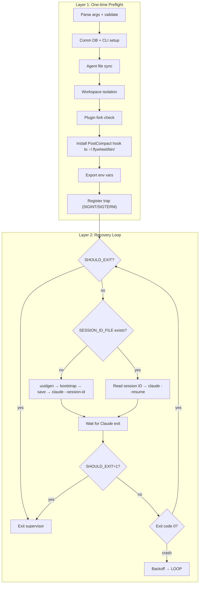

# Plan: Lead Context Window 管理 — Crash Recovery + Reactive Context Recovery

**Version**: v1.17.0
**Issue**: GEO-285
**Date**: 2026-03-29
**Source**: `doc/exploration/new/GEO-285-lead-context-window.md`, `doc/research/new/GEO-285-lead-context-window.md`
**Status**: implementing

## Summary

Lead agent（Peter, Oliver, Simba）是长期运行的 Claude Code session，context window 会随时间填满。本 plan 实现：

- **Crash Recovery Supervisor** — `claude-lead.sh` 自动 restart loop、session ID 管理、signal forwarding、exponential backoff
- **PostCompact Hook** — auto-compact 后自动重发 bootstrap，恢复 Lead 身份和状态
- **Context Hygiene 模板** — 教 Lead 用 Bridge API 查实时状态，compact 后主动恢复

核心理念：**auto-compact 是主要的 context 管理机制**（Claude Code 在 ~70% 时自动触发），PostCompact hook 确保 compact 后 Lead 自动恢复关键状态。这是 **reactive recovery**，不是 proactive rotation。

> **设计约束**: 研究阶段确认 agent 无法程序化触发 `/compact`。Context hygiene 模板中的 `/compact` 指引是最佳实践建议（如果 agent mode 支持则有效），但不是本方案的依赖路径。

## Scope

### Crash Recovery Supervisor
- `claude-lead.sh` 两层架构：one-time preflight + per-iteration recovery loop
- 自动 session ID 生成（`uuidgen` + `--session-id`）
- Crash recovery loop with exponential backoff (5/15/30/60s)
- Resume failure detection（<10s 快速退出 → 3 次后 fresh start）
- Graceful shutdown via SIGINT/SIGTERM trap + PID tracking
- Conditional bootstrap（仅 fresh start 时发送）

### PostCompact Hook
- `post-compact-bootstrap.sh` — auto-compact 后 curl Bridge bootstrap API
- 安装到稳定路径 `~/.flywheel/bin/post-compact-bootstrap.sh`（避免 worktree/clone 路径变化产生重复 entry）
- `install_post_compact_hook()` — 幂等安装到 `~/.claude/settings.json`，含旧路径清理
- 防御性设计：jq 缺失 → skip、JSON 非法 → skip、PostCompact 字段非 array → reset

### Early Auto-Compact
- `CLAUDE_AUTOCOMPACT_PCT_OVERRIDE=70`（默认值，可配置）

### Context Hygiene 模板
- `doc/reference/lead-context-hygiene-template.md`
- 核心方向：**Bridge API live state** 查询（不依赖 stale context）
- `/compact` 作为最佳实践建议（非核心依赖）
- Compact 后通过 PostCompact hook 自动恢复 + 主动查 Bridge API

### Out of Scope
- Shell 层 session rotation（~~monitor_rotation~~、~~signal file~~、~~marker file~~、~~MAX_SESSION_AGE_SECONDS~~）
- 外部 context 使用量监控
- mem0 集成到模板/bootstrap（GEO-198 scope，需要单独设计 contract）
- Agent.md 部署到 GeoForge3D Lead（follow-up PR，需要 fresh session 生效）

## Design

### Supervisor Architecture



### PostCompact Hook

```
Claude 运行中 → context 达到 70% → auto-compact
  ↓
PostCompact hook 触发 → ~/.flywheel/bin/post-compact-bootstrap.sh
  ↓
curl POST Bridge /api/bootstrap/{leadId} → Discord bootstrap 消息
  ↓
Lead 恢复身份/工具/状态信息
```

**稳定路径安装**：hook 脚本从 repo 复制到 `~/.flywheel/bin/post-compact-bootstrap.sh`，settings.json 中注册此稳定路径。安装时先清理所有旧的 `post-compact-bootstrap.sh` entry（不同路径的），再添加稳定路径 entry。这避免了 worktree、clone、repo 移动导致的重复 entry。

**防御层**：
1. `command -v jq` guard → 无 jq 时 skip
2. JSON 语法校验 → 非法 JSON 时 skip
3. PostCompact 字段 type check → `{}`/`null`/`string` → reset 为 `[]`
4. 旧路径清理 → 按文件名 `post-compact-bootstrap.sh` 匹配删除旧 entry
5. jq merge 失败 → skip + warning
6. 输出 JSON 校验 → 不合法 → skip + warning

### Context Hygiene 模板

模板放在 `doc/reference/lead-context-hygiene-template.md`。

核心内容：
- **Bridge API 查实时状态**：回答状态问题时查 Bridge API，不依赖 context 中可能过时的信息
- **Auto-compact 恢复**：compact 后 PostCompact hook 自动重发 bootstrap，Lead 主动查 Bridge API 填充缺失信息
- **`/compact` 最佳实践**：context 沉重时可以尝试 `/compact`（agent mode 支持情况待验证）
- **简洁响应**：API 返回结果只取关键信息，不 dump 全部 JSON

> **不包含 mem0 指引**：mem0 的调用 contract（user_id、project_name、请求格式）尚未设计完整（GEO-198 scope），模板暂不引用。

### send_bootstrap() HTTP Status Check

`send_bootstrap()` 和 `post-compact-bootstrap.sh` 都使用 `-w '\n%{http_code}'` 捕获 HTTP 状态码，4xx/5xx 时 log WARNING（non-fatal）。

### Rollout 说明

Agent.md 模板部署到 GeoForge3D Lead 是 **follow-up PR**（不在本 PR 范围）。部署时需要：
1. 更新 GeoForge3D 中 Peter/Oliver/Simba 的 agent.md
2. 删除 session ID 文件强制 fresh start（`--resume` 不会加载新 agent.md 规则）
3. 验证 fresh session 后 Lead 确实收到新的 context hygiene 规则

## Verification

### Automated (Smoke Tests)
`bash packages/teamlead/scripts/test-rotation.sh` covers:
- Hook install idempotency (3 cases)
- Malformed PostCompact regression (4 cases: `{}`, `null`, `string`, missing)
- Old path cleanup / worktree dedup (3 cases: old paths removed, unrelated kept, stable path present)
- `kill -0` guard under `set -e`

### Manual E2E (required before merge)
PostCompact hook chain must be verified end-to-end at least once:
1. Start a Lead via `claude-lead.sh` with Bridge running (ensures env vars are exported)
2. Verify hook is installed: `jq '.hooks.PostCompact' ~/.claude/settings.json`
3. Simulate PostCompact hook in the same env as the Lead process:
   ```bash
   source ~/.flywheel/.env  # loads TEAMLEAD_API_TOKEN
   TEAMLEAD_API_TOKEN=$TEAMLEAD_API_TOKEN \
   FLYWHEEL_LEAD_ID=<lead-id> \
   BRIDGE_URL=http://localhost:9876 \
     bash ~/.flywheel/bin/post-compact-bootstrap.sh
   ```
4. Verify Bridge received exactly one bootstrap POST with HTTP 200 (check Bridge logs)
5. Verify Lead received bootstrap message in Discord

## File Changes

| File | Action | Description |
|------|--------|-------------|
| `packages/teamlead/scripts/claude-lead.sh` | Modified | Crash recovery + PostCompact hook（稳定路径 + 旧 entry 清理） + env exports |
| `packages/teamlead/scripts/post-compact-bootstrap.sh` | Created | PostCompact hook 脚本（安装到 ~/.flywheel/bin/） |
| `packages/teamlead/scripts/test-rotation.sh` | Created | Hook 安装 + malformed input smoke test（8 cases） |
| `doc/reference/lead-context-hygiene-template.md` | Created | Bridge API 实时查询 + auto-compact 恢复模板 |

## Risks

| Risk | Mitigation |
|------|-----------|
| PostCompact hook LEAD_ID 缺失 | Hook 脚本 `exit 0`（非 Flywheel context） |
| settings.json 格式异常 | Warning + skip（不覆盖不创建） |
| Bootstrap HTTP 失败 | Warning log（non-fatal），Lead 可通过 Bridge API 自行恢复 |
| jq 未安装 | `command -v jq` guard，skip + warning |
| Hook 路径因 worktree/clone 变化 | 安装到稳定路径 `~/.flywheel/bin/`，安装时清理旧 entry |
| Agent.md 变更不生效 | Follow-up PR 中强制 fresh session（删除 session ID 文件） |
| `/compact` agent mode 不可用 | 不依赖 `/compact`，auto-compact 是主机制 |
