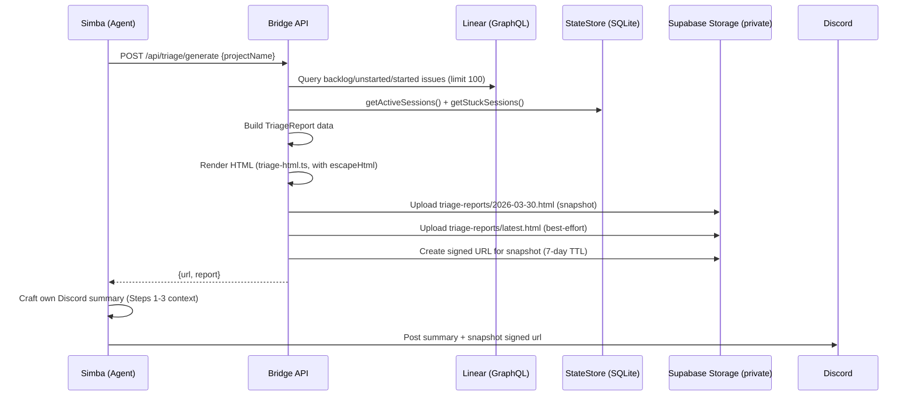

# Plan: Triage HTML Report — Supabase Storage 托管

**Version**: v1.17.0
**Issue**: GEO-294
**Date**: 2026-03-30
**Source**: `doc/exploration/new/GEO-294-triage-html-report.md`, `doc/research/new/GEO-294-supabase-storage-api.md`
**Status**: codex-approved
**Review**: Round 1 (6 items) + Round 2 (4 items) + Round 3 (3 items) feedback incorporated

## Overview

Bridge 新增 `POST /api/triage/generate` 端点：聚合 Linear issues + session 状态 + Runner 容量，渲染 HTML 报告，上传到 Supabase Storage **private** bucket（返回 signed URL），返回带 TTL 的访问链接。Simba 调用此端点后在 Discord 发自己编写的摘要 + 报告链接。

## Architecture



### 安全决策

Issue 标题、状态、labels、assignee 是团队内部数据，**不应公网暴露**。因此：
- Supabase bucket: **private**（非 public）
- 访问方式: **signed URL**，TTL 7 天（足够 Annie 查看，到期自动失效）
- 每次 `generate` 返回新的 signed URL

## Implementation Steps

### Step 1: TriageService — 数据聚合 + HTML 渲染 + 上传

**新文件**: `packages/teamlead/src/bridge/triage-service.ts`

#### 1a. TriageReport 数据结构

```typescript
export interface TriageIssue {
  identifier: string;       // GEO-123
  title: string;
  priority: number;         // 0=none, 1=urgent, 2=high, 3=medium, 4=low
  priorityLabel: string;    // "Urgent", "High", etc.
  state: string;            // "Backlog", "Todo", "In Progress"
  stateType: string;        // "backlog", "unstarted", "started"
  labels: string[];
  assignee: string | null;
  url: string;
  // Enriched by Bridge
  sessionStatus?: string;   // "running" | "awaiting_review" | undefined
}

/** Maximum issues to query from Linear. Matches Simba's current limit (agent.md:117). */
export const TRIAGE_ISSUE_LIMIT = 100;

export interface TriageReport {
  date: string;             // YYYY-MM-DD Pacific
  projectName: string;
  generatedAt: string;      // ISO timestamp
  systemStatus: {
    runningCount: number;
    awaitingReviewCount: number;
    maxRunners: number;
    stuckCount: number;
    availableSlots: number;
  };
  issues: TriageIssue[];    // Issues from Linear query
  issuesTruncated: boolean; // true if Linear returned more issues than limit
  recentCompletions: Array<{
    identifier?: string;
    title?: string;
    status: string;
    completedAt?: string;
  }>;
}
```

#### 1b. `aggregateTriage()` 函数

1. 查询 Linear issues（复用提取的共享函数 `queryLinearIssues()`，limit = `TRIAGE_ISSUE_LIMIT`）
2. 查询 active sessions（StateStore）
3. 交叉比对：为每个 issue 标注 `sessionStatus`（running/awaiting_review）
4. 查询最近 24h completions（复用 standup aggregation 逻辑）
5. 透传 `truncated` → `issuesTruncated`
6. 返回 `TriageReport`

**关键设计**: Linear 查询逻辑从 plugin.ts 的 `/api/linear/issues` handler 提取为独立函数 `queryLinearIssues()`，两者共用。

#### 1c. `renderTriageHtml()` 函数

**新文件**: `packages/teamlead/src/bridge/triage-html.ts`

纯函数：`(report: TriageReport, linearBaseUrl?: string) => string`

**安全要求**: 所有动态字符串（issue title, labels, assignee, state 等）**必须**通过 `escapeHtml()` helper 处理后再插入 HTML。参考 `dashboard-html.ts` 的转义方式。

```typescript
/** Escape HTML special characters to prevent XSS. */
function escapeHtml(str: string): string {
  return str
    .replace(/&/g, "&amp;")
    .replace(/</g, "&lt;")
    .replace(/>/g, "&gt;")
    .replace(/"/g, "&quot;")
    .replace(/'/g, "&#039;");
}
```

HTML 结构：
- 内联 CSS，暗色主题（对齐 dashboard-html.ts 风格）
- 响应式布局（viewport meta tag）
- Section 1: Header（日期 + 项目 + 生成时间）
- Section 2: System Status 卡片（running/awaiting/stuck/available，彩色指标）
- Section 3: Issues 表格（identifier, title, priority badge, state, labels, session status）
  - 按 priority 排序（urgent → high → medium → low → none）
  - Priority 用彩色 badge（red/orange/yellow/blue/gray）
  - Session status 用 badge（running=green, awaiting_review=yellow）
  - Issue identifier 链接到 Linear URL
  - **如果 `issuesTruncated`**: 表格上方显示黄色 banner "Showing first 100 issues. More issues exist in backlog."
- Section 4: Recent Completions（最近 24h，简表）
- Footer: 生成时间 + "Powered by Flywheel"

**不含**: ICE 分数、LNO 分类（那是 Simba 的 AI 判断，不在 Bridge 中）

#### 1d. `uploadToSupabaseStorage()` + `createSignedUrl()` 函数

**新文件**: `packages/teamlead/src/bridge/supabase-storage.ts`

```typescript
/** Upload content to Supabase Storage (private bucket, upsert). */
export async function uploadToSupabaseStorage(
  supabaseUrl: string,
  serviceRoleKey: string,
  bucket: string,
  path: string,
  content: string,
  contentType?: string,
): Promise<void>

/** Create a signed URL for a private bucket object. */
export async function createSignedUrl(
  supabaseUrl: string,
  serviceRoleKey: string,
  bucket: string,
  path: string,
  expiresIn: number,    // seconds, default 604800 (7 days)
): Promise<string>
```

- Plain `fetch`，无 SDK 依赖
- Upload: `POST /storage/v1/object/{bucket}/{path}` with `x-upsert: true`
- Signed URL: `POST /storage/v1/object/sign/{bucket}/{path}` with `{"expiresIn": N}`
- **10s timeout**: 使用 `AbortController` + `setTimeout`（同 Linear query 和 standup delivery pattern）

**上传策略 + URL 语义**:
- **主写入**: `{YYYY-MM-DD}.html`（日快照，同日覆盖是预期行为）
- **次写入**: `latest.html`（best-effort 覆盖，供机器入口使用，失败仅 warn）
- **Signed URL**: 基于 `{date}.html` 快照路径生成（**不是 latest.html**），确保 Discord 历史消息中的链接指向该次报告的内容，不会因后续生成而漂移
- Archive 上传失败不影响主流程，仅 console.warn

#### 1e. `TriageService` 类

```typescript
export class TriageService {
  constructor(
    private store: StateStore,
    private projects: ProjectEntry[],
    private linearApiKey: string | undefined,
    private maxConcurrentRunners: number,
    private stuckThresholdMinutes: number,
    private supabaseUrl: string | undefined,
    private supabaseServiceRoleKey: string | undefined,
    private linearBaseUrl: string | undefined,
  ) {}

  /** Check if a project name matches a configured project. */
  isKnownProject(projectName: string): boolean

  /** Return list of configured project names. */
  getProjectNames(): string[]

  async generate(projectName: string, dryRun?: boolean): Promise<{
    report: TriageReport;
    html: string;
    url: string | null;    // signed URL for snapshot; null if dryRun or upload failed
  }>
}
```

- `generate()` 聚合 → 渲染 → 上传（如非 dryRun）→ 生成 signed URL for date snapshot
- **不生成 Discord summary** — 那是 Simba 的职责，Bridge 只返回数据 + HTML + URL
- Supabase 上传失败不 throw，降级返回 `url: null`（Simba 可降级为纯文本）
- `isKnownProject()` / `getProjectNames()` 暴露给 route 层做输入校验

### Step 2: Triage Route

**新文件**: `packages/teamlead/src/bridge/triage-route.ts`

```typescript
export function createTriageRouter(
  service: TriageService | undefined,   // undefined when LINEAR_API_KEY missing → 501
  allowedProjectNames: string[],        // from projects config, for validation
): Router
```

**端点**: `POST /api/triage/generate`

**路由始终挂载**（不做 conditional mount），内部检查 `service` 是否存在。`service === undefined` → 501。这与 `/api/linear/issues` 行为一致。

**Request body**:
```json
{
  "projectName": "GeoForge3D",  // REQUIRED — must match a configured project
  "dryRun": false               // optional boolean, defaults to false
}
```

**输入校验**（route 层）:
- `projectName`: 必填，非空字符串，必须在 `allowedProjectNames` 中
- `dryRun`: 可选，如提供必须是 boolean
- 校验失败返回 `400` + 描述性错误

**Response** (200):
```json
{
  "generated": true,
  "report": { ... },
  "url": "https://xxx.supabase.co/storage/v1/object/sign/triage-reports/2026-03-30.html?token=...",
  "dryRun": false
}
```

**`url` 字段**: `string | null`。
- 正常: signed URL 字符串
- dryRun: `null`
- Supabase 上传失败: `null`（200 响应，预期降级）

**Error responses**:
- 400: Missing/invalid projectName, unknown project, invalid dryRun type
- 501: LINEAR_API_KEY not configured（路由始终挂载，内部检查）
- 502: Linear API error
- 500: Internal error

### Step 3: 提取 Linear 查询为共享函数

从 `plugin.ts` 的 `/api/linear/issues` handler 提取：

**新文件**: `packages/teamlead/src/bridge/linear-query.ts`

```typescript
export interface LinearIssue {
  id: string;
  identifier: string;
  title: string;
  description: string | null;
  priority: number;
  priorityLabel: string;
  state: string;
  stateType: string;
  labels: string[];
  assignee: string | null;
  url: string;
  createdAt: string;
  updatedAt: string;
}

export async function queryLinearIssues(
  linearApiKey: string,
  filters: { project?: string; states?: string[]; labels?: string[]; limit?: number },
  timeoutMs?: number,    // default 10_000 (10s)
): Promise<{ issues: LinearIssue[]; truncated: boolean }>
```

- 提取 GraphQL query + filter construction + response mapping
- **10s timeout**: 使用 `AbortController` + `setTimeout`（同 standup delivery 的 pattern，参考 `standup-service.ts:374-389`）。超时抛出可被 route 层捕获为 502
- plugin.ts 的 `/api/linear/issues` handler 改为调用此函数
- triage-service.ts 也调用此函数

### Step 4: Bridge 接线

**修改文件**: `packages/teamlead/src/bridge/plugin.ts`

#### 4a. createBridgeApp 参数改造

不再追加位置参数。新增 triage 依赖通过 options object 传入：

```typescript
// 新增 options 类型
interface BridgeAppOptions {
  triageService?: TriageService;    // undefined when LINEAR_API_KEY missing
  // 未来新增依赖也放这里
}

export function createBridgeApp(
  store: StateStore,
  projects: ProjectEntry[],
  config: BridgeConfig,
  broadcaster?: SseBroadcaster,
  transitionOpts?: ApplyTransitionOpts,
  retryDispatcher?: IRetryDispatcher,
  cipherWriter?: CipherWriter,
  eventFilter?: EventFilter,
  forumTagUpdater?: ForumTagUpdater,
  registry?: RuntimeRegistry,
  forumPostCreator?: ForumPostCreator,
  memoryService?: MemoryService,
  captureSessionFn?: CaptureSessionFn,
  startDispatcher?: IStartDispatcher,
  standupService?: StandupService,
  standupProjectName?: string,
  opts?: BridgeAppOptions,       // ← 新增，不破坏现有签名
): express.Application
```

#### 4b. startBridge() 中创建 TriageService

```typescript
// Triage service — uses same Supabase + Linear config
const triageService = config.linearApiKey
  ? new TriageService(
      store,
      projects,
      config.linearApiKey,
      config.maxConcurrentRunners,
      config.stuckThresholdMinutes,
      process.env.SUPABASE_URL,
      process.env.SUPABASE_SERVICE_ROLE_KEY,
      linearIssueBaseUrl,
    )
  : undefined;

if (triageService) {
  console.log("[Bridge] Triage service enabled");
} else {
  console.warn("[Bridge] Triage disabled — LINEAR_API_KEY not configured");
}

const triageProjectNames = projects.map((p) => p.projectName);
```

#### 4c. Route 挂载

**始终挂载** `/api/triage`（不做 conditional mount）。如果 TriageService 未创建，route 内部返回 501。

`triageProjectNames` 在 `createBridgeApp()` 内部从 `projects` 参数派生，不通过 opts 传入：

```typescript
// Inside createBridgeApp():
const triageProjectNames = projects.map((p) => p.projectName);
const triageRouter = createTriageRouter(
  opts?.triageService,          // may be undefined → route returns 501
  triageProjectNames,
);
if (config.apiToken) {
  app.use("/api/triage", tokenAuthMiddleware(config.apiToken), triageRouter);
} else {
  app.use("/api/triage", triageRouter);
}
```

**新增环境变量**: 无！复用现有的：
- `SUPABASE_URL` — 已有（CIPHER sync）
- `SUPABASE_SERVICE_ROLE_KEY` — 已有（CIPHER sync）
- `LINEAR_API_KEY` — 已有
- `LINEAR_WORKSPACE_SLUG` — 已有（issue link base URL）

**不复用** `STANDUP_PROJECT_NAME` — triage 的 `projectName` 由请求方（Simba）显式传入，无默认值。

**Supabase Storage bucket**: `triage-reports`（需一次性在 Dashboard 手动创建，**private**）

### Step 5: Simba Agent 更新

**修改文件**: `/Users/xiaorongli/Dev/GeoForge3D/.lead/cos-lead/agent.md`

1. Triage Step 4 更新：生成报告改为调用 `POST /api/triage/generate`
2. 新增 API 端点文档到 Bridge API section（标注为 "query + report generation"，非纯查询）
3. Triage 流程调整：
   - Step 1-3 不变（数据收集 + 验证 + 内部分析）
   - Step 4: 调用 API 生成 HTML 报告 → 获取 signed URL
   - Step 4b: 用自己的 Step 1-3 分析结果编写 Discord 摘要 + 附上报告链接
   - Step 5-6 不变（Lead 讨论 + Annie 确认）

**新的 Step 4 流程**:
```bash
# 生成 HTML 报告（获取 signed URL）
curl -s -X POST -H "Authorization: Bearer $TEAMLEAD_API_TOKEN" \
  -H "Content-Type: application/json" \
  -d '{"projectName":"GeoForge3D"}' \
  "$BRIDGE_URL/api/triage/generate"
```

Simba 自行编写 Discord 摘要（保留当前的 LNO/ICE 判断），附上报告链接：
```
📋 Triage — {date}
详细报告: {url}

🔴 马上做
1. [GEO-XX {title}](url) — {Simba 的判断理由}
...

Runner 容量: {running}/{max}

<@Peter> <@Oliver> 看一下有什么补充？
```

**Bridge API section 更新**:
```
| `/api/triage/generate` | POST | 生成 HTML triage 报告，上传 Supabase，返回 signed URL（有 side effect） |
```

### Step 6: Tests

**新文件**: `packages/teamlead/src/__tests__/triage-service.test.ts`
- `aggregateTriage()` 单元测试（mock StateStore + Linear）
- `aggregateTriage()` truncated 透传测试
- `renderTriageHtml()` 快照测试（确保 HTML 结构正确）
- `renderTriageHtml()` truncated banner 测试
- `renderTriageHtml()` XSS escaping 测试（注入 `<script>` 的 issue title 被转义）
- `uploadToSupabaseStorage()` 测试（mock fetch）
- `createSignedUrl()` 测试（mock fetch）
- `TriageService.generate()` 集成测试：
  - dryRun 模式（不上传，url=null）
  - normal 模式（上传 snapshot + latest + signed URL for snapshot）
  - upload failure 降级（url: null）
  - archive (latest.html) upload failure 不影响主流程
- `isKnownProject()` 测试
- `getProjectNames()` 测试

**新文件**: `packages/teamlead/src/__tests__/triage-route.test.ts`
- Route handler 测试：
  - 200 成功
  - 400 missing projectName
  - 400 unknown project（使用 allowedProjectNames）
  - 400 invalid dryRun type
  - 501 service undefined（LINEAR_API_KEY not configured）
  - dryRun 模式（url: null）

**新文件**: `packages/teamlead/src/__tests__/linear-query.test.ts`
- `queryLinearIssues()` 单元测试
- `queryLinearIssues()` timeout 测试（AbortController fires → throws）

**修改文件**: 确保现有 `/api/linear/issues` 测试仍通过（重构后）

## File Changes Summary

| File | Action | Description |
|------|--------|-------------|
| `packages/teamlead/src/bridge/triage-service.ts` | **New** | TriageService: 聚合 + 渲染 + 上传 |
| `packages/teamlead/src/bridge/triage-html.ts` | **New** | HTML 模板渲染（纯函数，含 escapeHtml） |
| `packages/teamlead/src/bridge/supabase-storage.ts` | **New** | Supabase Storage upload + signed URL helper |
| `packages/teamlead/src/bridge/triage-route.ts` | **New** | Express route handler（含输入校验 + 501 check） |
| `packages/teamlead/src/bridge/linear-query.ts` | **New** | 提取共享 Linear 查询函数 |
| `packages/teamlead/src/bridge/plugin.ts` | **Modify** | 接线 TriageService via opts object；重构 `/api/linear/issues` 用共享函数；始终挂载 /api/triage |
| `GeoForge3D/.lead/cos-lead/agent.md` | **Modify** | Simba triage Step 4 更新 + API section 更新 |
| `packages/teamlead/src/__tests__/triage-service.test.ts` | **New** | Service 测试（含 XSS escaping + truncated） |
| `packages/teamlead/src/__tests__/triage-route.test.ts` | **New** | Route 测试（含输入校验 + 501 cases） |
| `packages/teamlead/src/__tests__/linear-query.test.ts` | **New** | Linear 查询共享函数测试 |

## Feedback Resolution

### Round 1 (6 items)

| # | Issue | Resolution |
|---|-------|-----------|
| 1 | Public bucket 暴露数据 | 改为 private bucket + signed URL (7-day TTL) |
| 2 | STANDUP_PROJECT_NAME 耦合 | projectName 改为必填参数，无默认值 |
| 3 | createBridgeApp 参数膨胀 | 新增 `opts?: BridgeAppOptions` 对象参数 |
| 4 | 输入校验 + HTML escaping | route 层 schema 校验 + escapeHtml() + 测试 |
| 5 | Bridge 生成 summary 职责冲突 | 移除 summary，Simba 自行编写 |
| 6 | Archive 语义不完整 | latest.html best-effort，date.html 主写入 |

### Round 2 (4 items)

| # | Issue | Resolution |
|---|-------|-----------|
| 1 | Route 501 vs 404 矛盾 | 始终挂载 /api/triage，route 内部检查返回 501（对齐 /api/linear/issues） |
| 2 | Route 层无法校验 projectName | createTriageRouter 签名增加 `allowedProjectNames` 参数；TriageService 暴露 `isKnownProject()` |
| 3 | 50 issue 静默截断 | 提高到 100（TRIAGE_ISSUE_LIMIT 常量），透传 `issuesTruncated` 到 report + HTML banner |
| 4 | Signed URL 漂移到新内容 | Signed URL 基于 `{date}.html` 快照（不是 latest.html），链接内容不会漂移 |

### Round 3 (3 items)

| # | Issue | Resolution |
|---|-------|-----------|
| 1 | createTriageRouter/createBridgeApp 接线矛盾 | service 类型改 `TriageService \| undefined`；triageProjectNames 在 createBridgeApp 内部从 projects 派生，不放 opts |
| 2 | snapshotUrl 残留 | 架构图统一为只返回 `{url, report}`，无 snapshotUrl |
| 3 | 10s timeout 只在风险表不在实现 | queryLinearIssues + Supabase helpers 显式添加 AbortController 10s timeout + 测试 |

## Risks & Mitigations

| Risk | Mitigation |
|------|-----------|
| Supabase bucket 未创建 | 启动时 console.warn，generate 返回 url=null |
| Linear API 超时 | AbortController 10s timeout in queryLinearIssues → route catches → 502 |
| Supabase upload 超时 | AbortController 10s timeout in upload/signedUrl helpers → 降级 url=null |
| Signed URL 过期 | 7-day TTL，Annie 一般当天查看 |
| XSS via issue title | escapeHtml() 处理所有动态字符串 |
| 超过 100 issues 被截断 | HTML banner 显式提示 + report.issuesTruncated 字段 |

## Out of Scope

- ICE 分数可视化（Simba 的 AI 判断，Bridge 不做）
- 邮件发送 / PDF 导出
- 定时自动生成（当前由 Simba 触发）
- Supabase bucket 自动创建（一次性 Dashboard 操作）
- createBridgeApp 全量参数重构为 options object（仅新增参数走 opts）

## Manual Setup Required

1. Supabase Dashboard → Storage → New Bucket:
   - Name: `triage-reports`
   - Public: **No** (private)
   - File size limit: 10MB
2. 确认 `.env` 中 `SUPABASE_URL` 和 `SUPABASE_SERVICE_ROLE_KEY` 已配置
