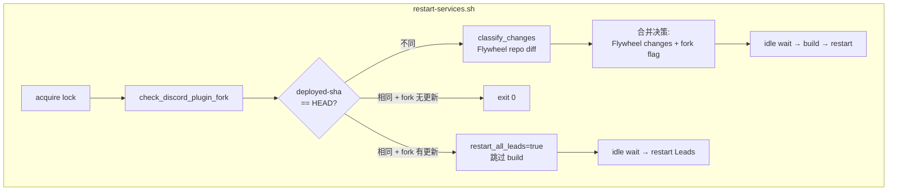

# Plan: Discord Plugin Fork Detection in restart-services.sh

**Version**: v1.18.0
**Issue**: FLY-20
**Date**: 2026-03-31
**Source**: `doc/plan/archive/v1.17.0-GEO-296-fork-claude-plugins.md`, `doc/exploration/archive/GEO-296-fork-claude-plugins.md`
**Status**: draft

---

## Summary

在 `restart-services.sh` 中新增 Discord plugin fork 检测：运行 `check-discord-plugin.sh`（runtime 完整性检查）+ git fetch 比较 fork SHA → 有更新或 runtime stale 时自动 `update-discord-plugin.sh` 并强制重启所有 Lead。

**目标**：fork 检测在每次 `restart-services.sh` 被调用时执行（包括 Flywheel 代码无变化但 deployed-sha 匹配的情况）。这覆盖两个场景：
1. Flywheel 部署时顺带检测 fork 更新
2. launchd 兜底（每天 12:00/00:00）即使 Flywheel 无新代码，也会检查 fork + runtime 完整性

**为实现目标 2**，需同步修改 `scripts/update-flywheel.sh`：去掉 "repo up to date AND deployed matches" 的早退短路，改为始终 delegate 到 `restart-services.sh`（后者自己处理 "nothing to do" 的退出逻辑）。

---

## Architecture



**关键变更**：fork 检测移到 deployed-sha 比较**之前**。这样即使 Flywheel 代码没变化，fork/runtime 状态仍会被检查。

---

## Deliverable: `check_discord_plugin_fork()` 函数

### 位置

在 `restart-services.sh` 的 lock 获取之后、deployed-sha 比较之前新增。

### 返回值语义 — 三态

| 返回值 | 含义 | 调用方行为 |
|--------|------|------------|
| `return 0` | Fork 有更新且 update 成功，或 runtime stale 已修复 | 设 `restart_all_leads=true` |
| `return 1` | 无需更新（fork 最新 + runtime 正常） | 不改变决策 |
| `return 2` | 检测跳过或 update 失败 | 不改变决策，但 Discord 通知（如果是失败） |

### 实现

```bash
# ════════════════════════════════════════════════════════════════
# Discord plugin fork detection
# ════════════════════════════════════════════════════════════════

DISCORD_FORK_DIR="${HOME}/.flywheel/repos/claude-plugins-official"
DISCORD_PLUGIN_UPDATE="${HOME}/.flywheel/bin/update-discord-plugin.sh"
DISCORD_PLUGIN_CHECK="${HOME}/.flywheel/bin/check-discord-plugin.sh"

# Returns: 0=updated, 1=no update needed, 2=skipped or failed
check_discord_plugin_fork() {
    # Guard: required scripts must exist
    if [[ ! -f "$DISCORD_PLUGIN_CHECK" ]]; then
        log "Discord plugin check script not found, skipping fork detection"
        return 2
    fi
    if [[ ! -f "$DISCORD_PLUGIN_UPDATE" ]]; then
        log "Discord plugin update script not found, skipping fork detection"
        return 2
    fi

    # Dry-run mode: only report, no side effects
    if [[ "$DRY_RUN" == "true" ]]; then
        local runtime_ok=true
        bash "$DISCORD_PLUGIN_CHECK" > /dev/null 2>&1 || runtime_ok=false
        local fork_behind=false
        if [[ -d "$DISCORD_FORK_DIR/.git" ]]; then
            git -C "$DISCORD_FORK_DIR" fetch origin main --quiet 2>/dev/null || true
            local local_sha remote_sha
            local_sha=$(git -C "$DISCORD_FORK_DIR" rev-parse HEAD 2>/dev/null || echo "?")
            remote_sha=$(git -C "$DISCORD_FORK_DIR" rev-parse origin/main 2>/dev/null || echo "?")
            [[ "$local_sha" != "$remote_sha" ]] && fork_behind=true
        fi
        log "DRY RUN: Discord plugin — runtime_ok=$runtime_ok fork_behind=$fork_behind"
        if [[ "$runtime_ok" == "false" || "$fork_behind" == "true" ]]; then
            log "DRY RUN: Would run update-discord-plugin.sh and force Lead restart"
            return 0
        fi
        return 1
    fi

    # Step 1: Check runtime integrity (canonical check)
    local runtime_ok=true
    if ! bash "$DISCORD_PLUGIN_CHECK" > /dev/null 2>&1; then
        log "Discord plugin runtime check failed — needs update"
        runtime_ok=false
    fi

    # Step 2: Check fork for new commits (if clone exists)
    local fork_updated=false
    if [[ -d "$DISCORD_FORK_DIR/.git" ]]; then
        if git -C "$DISCORD_FORK_DIR" fetch origin main --quiet 2>/dev/null; then
            local local_sha remote_sha
            local_sha=$(git -C "$DISCORD_FORK_DIR" rev-parse HEAD 2>/dev/null)
            remote_sha=$(git -C "$DISCORD_FORK_DIR" rev-parse origin/main 2>/dev/null)
            if [[ -n "$local_sha" && -n "$remote_sha" && "$local_sha" != "$remote_sha" ]]; then
                log "Discord plugin fork: ${local_sha:0:7} → ${remote_sha:0:7}"
                fork_updated=true
            fi
        else
            log "WARN: Failed to fetch Discord plugin fork (network issue?)"
        fi
    fi

    # Step 3: If nothing needs updating, we're done
    if [[ "$runtime_ok" == "true" && "$fork_updated" == "false" ]]; then
        log "Discord plugin: up to date and runtime healthy"
        return 1
    fi

    # Step 4: Run update
    log "Updating Discord plugin (runtime_ok=$runtime_ok fork_updated=$fork_updated)..."
    if ! bash "$DISCORD_PLUGIN_UPDATE"; then
        log "ERROR: Discord plugin update failed"
        notify_discord "⚠️ Discord plugin 更新失败 (runtime_ok=$runtime_ok fork_updated=$fork_updated)。Lead 启动时 preflight 会重试。"
        return 2
    fi

    # Step 5: Verify update succeeded
    if ! bash "$DISCORD_PLUGIN_CHECK" > /dev/null 2>&1; then
        log "ERROR: Discord plugin update completed but re-check still fails"
        notify_discord "⚠️ Discord plugin update 执行成功但 re-check 失败。请手动检查。"
        return 2
    fi

    log "Discord plugin updated and verified successfully"
    return 0
}
```

### 调用方集成

**在 lock 获取之后、deployed-sha 比较之前**：

```bash
acquire_lock

PLUGIN_RESTART_PENDING="${HOME}/.flywheel/plugin-restart-pending"

# ── Check for pending plugin-only restart retry ──
# If a previous plugin-only restart had Lead failures, retry now
plugin_needs_restart=false
if [[ -f "$PLUGIN_RESTART_PENDING" ]]; then
    log "Found plugin-restart-pending marker — retrying Lead restart"
    plugin_needs_restart=true
fi

# ── Discord plugin fork detection (before deployed-sha check) ──
# Run early so that even when Flywheel code is unchanged,
# fork updates / runtime drift are still detected.
fork_rc=0
check_discord_plugin_fork || fork_rc=$?
if (( fork_rc == 0 )); then
    plugin_needs_restart=true
    log "Discord plugin updated — will force Lead restart"
fi

# ── Deployed-SHA comparison ──
DEPLOYED_SHA=$(cat "$DEPLOYED_SHA_FILE" 2>/dev/null || echo "")
CURRENT_HEAD=$(git -C "$FLYWHEEL_DIR" rev-parse HEAD)

if [[ "$DEPLOYED_SHA" == "$CURRENT_HEAD" ]]; then
    if [[ "$plugin_needs_restart" == "true" ]]; then
        # ── Dry-run guard for plugin-only path ──
        if [[ "$DRY_RUN" == "true" ]]; then
            log "DRY RUN: Would restart Leads (plugin update or retry marker)"
            [[ -f "$PLUGIN_RESTART_PENDING" ]] && log "DRY RUN: Marker exists, would retry"
            exit 0
        fi

        # No Flywheel code changes, but plugin was updated (or retry pending) — restart Leads only
        log "Flywheel code unchanged, but Discord plugin updated. Restarting Leads only."
        notify_discord "🔄 Discord plugin 更新，重启 Leads..."
        
        # Reuse same result handling as deploy_and_verify()
        # Note: no `local` here — this code is at top-level, not inside a function
        lead_result=$(do_restart_all_leads)
        leads_skipped=$(echo "$lead_result" | sed 's/.*skipped:\([0-9]*\).*/\1/')
        leads_failed=$(echo "$lead_result" | sed 's/.*failed:\([0-9]*\).*/\1/')
        
        if (( leads_failed > 0 )); then
            # Write retry marker — next run will retry Lead restart
            echo "failed=$leads_failed at $(date -u +%Y-%m-%dT%H:%M:%SZ)" > "$PLUGIN_RESTART_PENDING"
            notify_discord "⚠️ Discord plugin 更新后 ${leads_failed} 个 Lead 重启失败。请检查日志。"
            exit 1
        fi
        # Success (full or partial-skip) — clear retry marker
        rm -f "$PLUGIN_RESTART_PENDING"
        if (( leads_skipped > 0 )); then
            notify_discord "⚠️ Discord plugin 更新后 ${leads_skipped} 个 Lead 跳过（无 manifest）。请手动重启。"
            exit 0
        fi
        notify_discord "✅ Discord plugin 更新完成，Leads 已重启。"
        exit 0
    else
        log "Already deployed at ${CURRENT_HEAD:0:7}, exiting."
        exit 0
    fi
fi
```

**在已有 diff 分类之后**，如果 Flywheel 代码有变化且 fork 也有更新，合并标记：

```bash
# After classify_changes
if [[ "$plugin_needs_restart" == "true" ]]; then
    restart_all_leads=true
fi
```

**在 `deploy_and_verify()` Lead restart 结果处理之后**，清理 plugin-restart-pending marker：

```bash
# Inside deploy_and_verify(), after Lead restart result handling:
# If Leads restarted successfully during full deploy, clear any stale plugin marker
rm -f "$PLUGIN_RESTART_PENDING"
```

### 和现有 preflight 的关系

| 层 | 脚本 | 触发时机 | 性质 |
|---|------|---------|------|
| **Proactive** | `restart-services.sh` → `check_discord_plugin_fork()` | 部署时 + launchd 兜底 | Best-effort，不阻塞 |
| **Defensive** | `claude-lead.sh` → `check-discord-plugin.sh` preflight | Lead 启动时 | Hard gate，阻塞启动 |

两者互补。Proactive 层减少 Lead 启动时发现 stale 的概率；Defensive 层是最后防线。

---

## 失败处理

| 场景 | 行为 | 理由 |
|------|------|------|
| check/update 脚本不存在 | return 2，跳过 | 新机器还没 setup |
| git fetch 失败（网络） | 只做 runtime check | fetch 失败不影响 runtime 检查 |
| runtime check 失败 + update 成功 + re-check 失败 | return 2 + Discord 通知 | update 脚本可能有 bug，需手动排查 |
| runtime check 通过 + fork 无新 commit | return 1 | 一切正常 |
| update 失败 | return 2 + Discord 通知 | Lead preflight 会兜底 |
| plugin-only restart + Lead 重启失败 | 写入 `plugin-restart-pending` marker + exit 1 | 下次运行时自动重试 Lead restart |
| plugin-restart-pending marker 存在 | 即使 fork/runtime 正常也触发 Lead restart | 保证 partial rollout 被自动修复 |
| plugin-only restart 成功 | 清除 marker | 正常退出 |
| `--dry-run` 模式 | 只报告状态，不执行 update/fetch | 保持 dry-run 完全无副作用（使用 cached origin/main ref） |

**设计原则**：fork 检测是 best-effort enhancement。`claude-lead.sh` preflight 是 hard gate。

---

## update-flywheel.sh 修改

**问题**：当前 `update-flywheel.sh`（launchd 入口）在 `LOCAL == REMOTE && DEPLOYED == LOCAL` 时直接退出（L34-37），不会调用 `restart-services.sh`，导致 fork 检测无法在 "Flywheel 无新代码" 时执行。

**修改**：去掉早退短路，始终 delegate 到 `restart-services.sh`。`restart-services.sh` 已有完整的 "nothing to do" 逻辑（deployed-sha 匹配 + fork 无更新 → exit 0），不会产生多余操作。

```bash
# 修改前 (update-flywheel.sh L34-37):
if [[ "$LOCAL" == "$REMOTE" && "$DEPLOYED" == "$LOCAL" ]]; then
    log "Up to date and deployed at ${LOCAL:0:7}"
    exit 0
fi

# 修改后:
# 去掉早退短路 — 始终 delegate 到 restart-services.sh
# restart-services.sh 自己处理 "nothing to do" + fork 检测
if [[ "$LOCAL" != "$REMOTE" ]]; then
    log "Local ${LOCAL:0:7} != remote ${REMOTE:0:7}. Pulling..."
    git -C "$FLYWHEEL_DIR" pull origin main --ff-only || {
        log "ERROR: git pull failed"
        notify_discord "⚠️ launchd 兜底: git pull 失败。"
        exit 1
    }
    notify_discord "⚠️ **launchd 兜底更新触发** — ..."
elif [[ "$DEPLOYED" != "$LOCAL" ]]; then
    log "Repo at ${LOCAL:0:7} but deployed at ${DEPLOYED:0:7}. Retrying failed deploy."
fi

# Always delegate (handles: code deploy, fork check, or both)
"${SCRIPT_DIR}/restart-services.sh"
```

---

## plugin-only restart 路径

**问题**：当 Flywheel 代码未变（deployed-sha 匹配）但 Discord plugin 有更新时，不应调用 `deploy_and_verify()`（它会无条件 `build_project()`，产生不必要的 build + 可能误触发 rollback）。

**解决**：在 deployed-sha 匹配 + `plugin_needs_restart=true` 的分支里，直接调用 `do_restart_all_leads()` 然后退出，完全绕过 `deploy_and_verify()`。这条路径不 touch Bridge、不 build、不改 deployed-sha。

---

## macOS 兼容性

**不使用 `timeout` 命令**（macOS 无 GNU coreutils timeout）。git fetch 自身有 network timeout 机制（默认 300s），在 restart-services.sh 的上下文中可接受。如果需要更短的超时，可以在未来通过 `git -c http.lowSpeedLimit=... -c http.lowSpeedTime=...` 参数控制。

---

## 测试

### Shell 测试（追加到 `scripts/test-restart-services.sh`）

1. **fork 检测 — check 脚本不存在时 return 2**: mock `DISCORD_PLUGIN_CHECK` 为不存在路径
2. **fork 检测 — update 脚本不存在时 return 2**: mock `DISCORD_PLUGIN_UPDATE` 为不存在路径
3. **fork 检测 — runtime OK + fork 最新 → return 1**: mock 两者均 OK
4. **fork 检测 — runtime stale → 触发 update**: mock check 失败
5. **fork 检测 — update 失败 → return 2**: mock update 脚本返回非 0
6. **fork 检测 — update 成功但 re-check 失败 → return 2**: mock re-check 失败
7. **集成 — plugin_needs_restart + deployed-sha match → restart Leads only, 跳过 build**
8. **集成 — plugin_needs_restart + deployed-sha mismatch → 合并到已有 classify 结果**
9. **集成 — plugin-only restart + leads_failed > 0 → exit 1 + 失败通知**
10. **集成 — plugin-only restart + leads_skipped > 0 → partial 通知，不发 success 文案**
11. **集成 — plugin-only restart + leads_failed > 0 → 写入 plugin-restart-pending marker**
12. **集成 — plugin-restart-pending marker 存在 + runtime healthy → 仍触发 Lead restart retry**
13. **集成 — plugin-only restart 成功 → 清除 plugin-restart-pending marker**
14. **集成 — marker 存在 + deployed-sha mismatch + full deploy 成功 → marker 被清除**
15. **dry-run — fork 检测只报告不执行 update**
16. **dry-run — plugin_needs_restart=true + deployed-sha match → 不重启 Lead，不操作 marker**
17. **dry-run — marker 存在 → 只报告，不清理不写入 marker**

### E2E 验证

1. `restart-services.sh --dry-run` 输出 Discord plugin 状态日志
2. 手动让 runtime stale（删掉 marketplace 的 allowBots patch）→ 验证 update 被触发 + re-check 通过

---

## 文件清单

| 文件 | 操作 | 说明 |
|------|------|------|
| `scripts/restart-services.sh` | 修改 | 新增 `check_discord_plugin_fork()` + 调用集成 + plugin-only restart 路径 |
| `scripts/update-flywheel.sh` | 修改 | 去掉早退短路，始终 delegate 到 restart-services.sh |
| `scripts/test-restart-services.sh` | 修改 | 追加 17 个 fork 检测测试 |

---

## Risks & Mitigations

| 风险 | 影响 | 缓解 |
|------|------|------|
| git fetch 慢/卡住 | 延迟部署 | git 自身 network timeout；未来可加 `http.lowSpeedTime` |
| check-discord-plugin.sh 误报 | 不必要的 update + Lead 重启 | re-check 验证 update 实际生效 |
| update 和 Claude Code plugin auto-update 竞争 | marketplace 目录被覆盖 | claude-lead.sh preflight 会在启动时重新检查 |
| 首次运行无 fork clone | 跳过检测 (return 2) | 需要先手动跑一次 update-discord-plugin.sh |
