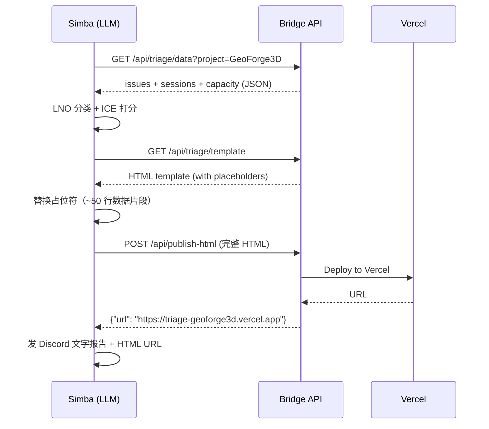

# Plan: Triage HTML Template

**Version**: v1.18.0
**Issue**: FLY-27
**Date**: 2026-03-30
**Source**: `doc/exploration/new/FLY-27-triage-deep-optimization.md`
**Status**: codex-approved

## Goal

Simba 生成 HTML triage 报告时，从"写 300 行 HTML+CSS"改为"读取模板 + 填充 ~50 行数据片段"。视觉效果对齐 pm-triage 的 Apple 风格。

## Design

### 模板位置

```
packages/teamlead/static/triage-template.html
```

- 存在 Flywheel 仓库的 teamlead package 内
- Bridge 通过新端点 `GET /api/triage/template` 提供给 Simba
- Simba 用 `curl $BRIDGE_URL/api/triage/template` 获取

**为什么不用文件路径**: Flywheel 是 installer 不是 runtime dep（memory 规则）。Simba 不应该依赖 Flywheel 仓库路径。Bridge API 是 Simba 获取所有数据的标准方式。

**为什么不放 GeoForge3D**: Annie 明确要求放 Flywheel 仓库，所有项目共享同一套模板。

### 模板文件的 Runtime 分发

teamlead package 的 build 只有 `tsc` 输出到 `dist/`，不会自动复制 `static/` 目录。需要确保模板文件在 runtime 可用。

**方案**: 在 `packages/teamlead/package.json` 的 `build` script 中添加 copy 步骤：

```json
"build": "tsc && cp -r static dist/static"
```

这样 `dist/static/triage-template.html` 始终和编译产物一起存在。Route 文件用 `__dirname` 相对路径解析：

```typescript
// __dirname resolves to either src/bridge/ (tests) or dist/bridge/ (production)
// Both are 2 levels deep from package root, so ../../static/ always works
// resolve(__dirname, "../../static/triage-template.html") → packages/teamlead/static/triage-template.html
```

**注意**: `__dirname` 相对路径为 `../../static/triage-template.html`（从 `src/bridge/` 或 `dist/bridge/` 到 package root 的 `static/`）。`cp -r static dist/static` 作为额外保障。

### 模板设计

模板是一个完整 HTML 文件，包含：
1. **完整 CSS**（从 pm-triage HTML 提取，适配 Simba 的分组结构）
2. **页面结构**（header + stats + 4 个 section 占位符 + footer）
3. **占位符标记**（`{{DATE}}`, `{{STATS}}`, `{{SECTION_CRITICAL}}`, 等）

#### CSS 设计（对齐 pm-triage）

直接复用 `/tmp/pm-triage-2026-03-30.html` 的 CSS：
- 浅色主题：`body { background: #f5f5f7; color: #1d1d1f; }`
- Apple SF 字体栈
- 品牌深蓝 `#1a365d`
- 白色圆角卡片 + 悬浮效果
- 优先级色：红/橙/蓝/灰
- 状态标签：In Progress (蓝), Todo (灰), Backlog (浅灰)
- `max-width: 960px; margin: 0 auto;` 响应式
- Issue ID 等宽字体

**注意**: Simba agent.md 当前指定暗色主题 `#1a1a2e`。Annie 说要跟 pm-triage 一样，所以改为浅色。agent.md 的暗色主题指令需要删除。

#### 占位符列表

| 占位符 | 说明 | Simba 填充内容 |
|--------|------|----------------|
| `{{DATE}}` | 日期 | e.g., `2026-03-30 (Sunday)` |
| `{{PROJECT_NAME}}` | 项目名 | e.g., `GeoForge3D` |
| `{{STATS}}` | 统计卡片 | stat div HTML |
| `{{SECTION_CRITICAL}}` | 马上做 | card div HTML |
| `{{SECTION_WEEK}}` | 本周完成 | card div HTML |
| `{{SECTION_INPROGRESS}}` | 已在进行中 | card div HTML |
| `{{SECTION_REMAINING}}` | 其余按 team | module-section div HTML |
| `{{CAPACITY}}` | Runner 容量 | 容量文字 |

#### 数据片段模式（写入 agent.md）

Simba 只需用这些 HTML 片段模式填充对应 section：

**卡片模式**（马上做/本周完成）:
```html
<div class="card card-red">
  <div class="card-header">
    <a class="issue-id" href="{url}" target="_blank">{ID}</a>
    <span class="priority-dot dot-{priority}"></span>
  </div>
  <div class="card-title">{title}</div>
  <div class="card-reason">{一句话原因}</div>
</div>
```

**进行中模式**:
```html
<div class="card card-blue">
  <div class="card-header">
    <a class="issue-id" href="{url}" target="_blank">{ID}</a>
    <span class="status-tag status-inprogress">{运行中 — stage}</span>
  </div>
  <div class="card-title">{title}</div>
</div>
```

**Team 分组模式**（`{{SECTION_REMAINING}}`）:

模板 CSS 预定义两个 team group class（对应 Simba 的 Product/Operations 分组）加一个通用 fallback：

```css
.group-product { background: #f3e5f5; color: #7b1fa2; }   /* 紫色 — Product */
.group-operations { background: #fff3e0; color: #e65100; } /* 橙色 — Operations */
.group-other { background: #f2f2f7; color: #6e6e73; }      /* 灰色 — fallback */
```

Simba 必须使用以下精确结构：

```html
<div class="module-section">
  <div class="module-header group-product">Product <span class="count">5</span></div>
  <div style="background: white; border-radius: 10px; overflow: hidden;">
    <!-- issue-row 列表 -->
  </div>
</div>
<div class="module-section">
  <div class="module-header group-operations">Operations <span class="count">3</span></div>
  <div style="background: white; border-radius: 10px; overflow: hidden;">
    <!-- issue-row 列表 -->
  </div>
</div>
```

**每个 issue-row**:
```html
<div class="issue-row">
  <span class="priority-dot dot-{priority}"></span>
  <a class="issue-id" href="{url}" target="_blank">{ID}</a>
  <span class="title">{title}</span>
  <span class="status-tag status-{type}">{status}</span>
</div>
```

`{priority}` 取值: `urgent` / `high` / `medium` / `low`
`{type}` 取值: `inprogress` / `todo` / `backlog`

### Bridge 端点

#### `GET /api/triage/template`

- 无参数
- 需要 auth token（tokenAuthMiddleware）
- 返回 `Content-Type: text/html`
- 直接从 `static/triage-template.html` 读取并返回
- 文件不存在 → 500

实现极简：`fs.readFileSync` + `res.type('html').send(content)`。不缓存（文件小，读取快）。

#### Route 文件

新建 `packages/teamlead/src/bridge/triage-template-route.ts`：
```typescript
export function createTriageTemplateRouter(templatePath: string): Router {
  const router = Router();
  router.get("/", (req, res) => {
    const content = readFileSync(templatePath, "utf-8");
    res.type("html").send(content);
  });
  return router;
}
```

#### plugin.ts 集成

```typescript
import { createTriageTemplateRouter } from "./triage-template-route.js";
import { resolve, dirname } from "node:path";
import { fileURLToPath } from "node:url";

// Resolve static dir relative to package root (works from src/ and dist/)
const __dirname = dirname(fileURLToPath(import.meta.url));
const templatePath = resolve(__dirname, "../../static/triage-template.html");

app.use("/api/triage/template",
  tokenAuthMiddleware(config.apiToken),
  createTriageTemplateRouter(templatePath)
);
```

### HTML Escaping 规则

所有动态文本（issue title, reason, status, project name）在填入模板前**必须** HTML escape：
- `&` → `&amp;`
- `<` → `&lt;`
- `>` → `&gt;`
- `"` → `&quot;`

URL 值（`href="{url}"`）来自 Linear API，已经是合法 URL，不需要额外 escape。

agent.md 中明确写入 escape 规则，作为占位符替换的前置步骤。

### Simba agent.md 更新

#### Step 4a 更新

从当前的"你自己生成 HTML"改为：

```markdown
#### 4a: 生成 HTML 报告

1. 获取模板：
   curl -s -H "Authorization: Bearer $TEAMLEAD_API_TOKEN" \
     "$BRIDGE_URL/api/triage/template"

2. 替换占位符：
   - {{DATE}} → 今天日期 (e.g., 2026-03-30 Sunday)
   - {{PROJECT_NAME}} → GeoForge3D
   - {{STATS}} → 统计卡片 HTML
   - {{SECTION_CRITICAL}} → 马上做卡片（用 card card-red 模式）
   - {{SECTION_WEEK}} → 本周完成卡片（用 card card-amber 模式）
   - {{SECTION_INPROGRESS}} → 进行中卡片（用 card card-blue 模式）
   - {{SECTION_REMAINING}} → 按 team 分组（用 module-section + issue-row 模式）
   - {{CAPACITY}} → Runner 容量: {running}/{max}

3. POST 到 /api/publish-html
```

#### 暗色主题指令删除

删除 agent.md Step 4a 中的：
```
- **暗色背景** (`#1a1a2e`)，白色文字 (`#eee`)
```
以及所有手写 CSS 指令。替换为"使用模板，不要自己写 CSS"。

### 文件变更清单

| 文件 | 操作 | 说明 |
|------|------|------|
| `packages/teamlead/static/triage-template.html` | 新建 | 完整 HTML+CSS 模板 |
| `packages/teamlead/src/bridge/triage-template-route.ts` | 新建 | GET /api/triage/template 路由 |
| `packages/teamlead/src/bridge/plugin.ts` | 修改 | 挂载 template 路由 |
| `packages/teamlead/src/__tests__/triage-template.test.ts` | 新建 | 端点测试 |
| `GeoForge3D/.lead/cos-lead/agent.md` | 修改 | Step 4a 改用模板 |

### 测试计划

1. **`triage-template.test.ts`** (单元测试):
   - 返回 200 + HTML content
   - Content-Type 是 text/html
   - 包含所有占位符标记
   - 需要 auth token（401 without token）
   - 模板文件不存在 → 500

2. **手动验证**:
   - `curl` 获取模板，浏览器打开验证视觉
   - 手动替换占位符验证渲染效果

## 不在范围内

- Scope 优化（minPriority 过滤）— Annie 明确推迟
- 模板动态定制（每项目不同 CSS）— 远期
- 服务端模板引擎（Handlebars 等）— 过度工程，LLM 做字符串替换够了

## 架构图


