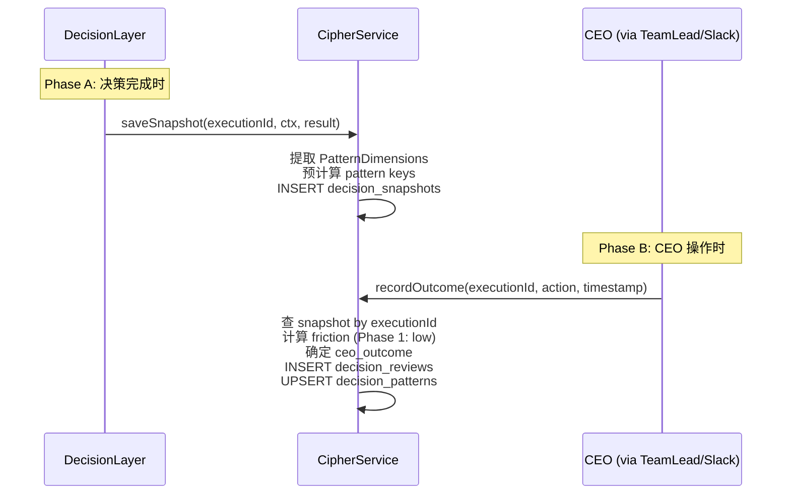
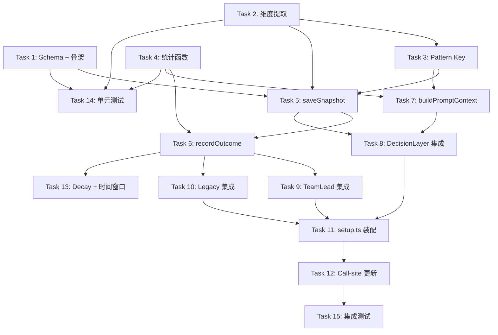

# Plan: CIPHER Phase 1 — Decision-Making Memory

**Version**: v1.2.0
**Issue**: GEO-149
**Date**: 2026-03-15
**Source**: `doc/exploration/new/GEO-149-cipher-decision-memory.md`, `doc/research/new/GEO-149-cipher-phase1-implementation.md`
**Status**: draft

---

## Context

CIPHER = Continuous Intelligent Pattern Harvesting for Execution Routing.

当前 Decision Layer 每次决策都是"从零开始"——不记得 CEO 对同类 issue 的历史反应。CIPHER Phase 1 在现有 AuditLogger SQLite 上扩展，用纯统计方法提取 CEO 的 approve/reject pattern，注入 HaikuTriageAgent prompt 作为参考信息。

### 关键设计决策

1. **Phase 1 = AuditLogger 扩展**（纯 SQLite + 统计，零新依赖）
2. **只注入 HaikuTriageAgent prompt**，不修改 HardRuleEngine，不自动决策
3. **三分类结果**: fast_approve / approve_after_review / reject_or_block
4. **Beta-Binomial 平滑** + **Wilson lower bound** 防小样本过拟合
5. **Pattern 成熟度分级**: exploratory / tentative / established / trusted
6. **两阶段数据模型**: 决策时存快照 → CEO 操作时补 outcome（Codex R1 #1, #2）
7. **双路径覆盖**: TeamLead (生产) + legacy ReactionsEngine (兼容)（Codex R1 #3）
8. **Phase 1 不抓 Slack thread**: 只记录 action + timestamp，deliberation metrics 留给 Phase 2（Codex R1 #7）

### 前置条件

- GEO-145 Memory Production ✅ (PR #18)
- GEO-155 Disable auto-approve ✅ (PR #17)
- Trial run 产生 decision 数据 — 进行中

---

## 数据链路设计

### 两阶段模型

Codex R1 指出核心问题：CEO 操作时 `ExecutionContext` 已不完整可用。解决方案是两阶段写入：



**关联键**: `executionId`。TeamLead 的 `actions.ts` 已有 `executionId` 贯穿：
- `approveExecution()` 接收 `executionId` 参数
- `transitionSession()` 接收 `executionId` 参数
- `StateStore.getSession(executionId)` 返回完整 session

### 生产路径 vs Legacy 路径

| 路径 | 覆盖 | CEO 操作入口 | executionId 来源 |
|------|------|-------------|-----------------|
| **TeamLead** (生产) | `packages/teamlead/src/bridge/actions.ts` | `approveExecution()`, `transitionSession()` | 函数参数 |
| **Legacy Slack** (兼容) | `packages/edge-worker/src/ReactionsEngine.ts` | handler `execute()` | `action.executionId` 字段 |

Phase 1 **优先覆盖 TeamLead 路径**（生产环境 `TEAMLEAD_OWNS_SLACK=true`），legacy 路径作为兼容 fallback。

---

## Package Placement

| Component | Package | Rationale |
|-----------|---------|-----------|
| CipherService | `packages/edge-worker/src/cipher/` | 与 AuditLogger 同进程，共用 SQLite |
| Pattern 维度提取 | `packages/edge-worker/src/cipher/` | 依赖 ExecutionContext types |
| 统计函数 | `packages/edge-worker/src/cipher/` | 纯数学，无 I/O |
| TeamLead 集成 | `packages/teamlead/src/bridge/` | actions.ts 是生产入口 |
| DecisionLayer 集成 | `packages/edge-worker/src/decision/` | snapshot 保存点 |
| Composition root | `scripts/lib/setup.ts` | 装配层 |

Test files: `packages/edge-worker/src/__tests__/cipher*.test.ts`

---

## Execution Order



### Waves

- **Wave 1** (Tasks 1-4): 基础层 — schema、维度提取、pattern key、统计函数（可并行）
- **Wave 2** (Tasks 5-7): 核心读写 — saveSnapshot、recordOutcome、buildPromptContext
- **Wave 3** (Tasks 8-12): 集成层 — DecisionLayer、TeamLead、Legacy、setup、call-site 更新
- **Wave 4** (Tasks 13-15): 维护 + 测试 — decay、单元测试、集成测试

---

## Task 1: Schema + CipherService 骨架

**Create**:
- `packages/edge-worker/src/cipher/CipherService.ts`
- `packages/edge-worker/src/cipher/types.ts`
- `packages/edge-worker/src/cipher/index.ts`

**Modify**:
- `packages/edge-worker/src/AuditLogger.ts` — `init()` 增加 CIPHER 表创建 + 受控 db 接口

### Schema

```sql
-- Table 1: 决策快照（Phase A — 决策完成时写入）
CREATE TABLE IF NOT EXISTS decision_snapshots (
  execution_id TEXT PRIMARY KEY,
  audit_entry_id TEXT NOT NULL,
  issue_id TEXT NOT NULL,
  issue_identifier TEXT NOT NULL,
  project_id TEXT NOT NULL,
  issue_labels TEXT NOT NULL,             -- JSON array
  size_bucket TEXT NOT NULL,              -- tiny|small|medium|large
  area_touched TEXT NOT NULL,             -- frontend|backend|auth|test|config|mixed
  system_route TEXT NOT NULL,             -- auto_approve|needs_review|blocked
  system_confidence REAL NOT NULL,
  decision_source TEXT NOT NULL,
  pattern_keys TEXT NOT NULL,             -- JSON array of generated keys
  created_at TEXT NOT NULL DEFAULT (datetime('now'))
);

-- Table 2: CEO 审核记录（Phase B — CEO 操作时写入）
CREATE TABLE IF NOT EXISTS decision_reviews (
  id TEXT PRIMARY KEY,
  execution_id TEXT NOT NULL UNIQUE,
  snapshot_id TEXT NOT NULL,
  ceo_action TEXT NOT NULL,               -- approve|reject|defer
  ceo_outcome TEXT NOT NULL,              -- fast_approve|approve_after_review|reject_or_block
  friction_score TEXT NOT NULL DEFAULT 'low',  -- Phase 1: always low (no thread data)
  ceo_action_timestamp TEXT NOT NULL,
  notification_timestamp TEXT,            -- from snapshot created_at
  time_to_decision_seconds INTEGER,
  created_at TEXT NOT NULL DEFAULT (datetime('now')),
  FOREIGN KEY (snapshot_id) REFERENCES decision_snapshots(execution_id)
);

CREATE INDEX IF NOT EXISTS idx_reviews_outcome ON decision_reviews(ceo_outcome);
CREATE INDEX IF NOT EXISTS idx_reviews_created ON decision_reviews(created_at);

-- Table 3: Pattern 统计
CREATE TABLE IF NOT EXISTS decision_patterns (
  pattern_key TEXT PRIMARY KEY,
  approve_count INTEGER NOT NULL DEFAULT 0,
  reject_count INTEGER NOT NULL DEFAULT 0,
  total_count INTEGER NOT NULL DEFAULT 0,
  maturity_level TEXT NOT NULL DEFAULT 'exploratory',
  first_seen_at TEXT NOT NULL,
  last_seen_at TEXT NOT NULL,
  last_90d_approve INTEGER DEFAULT 0,
  last_90d_total INTEGER DEFAULT 0
);

-- Table 4: Review-to-Pattern 关联（支持时间窗口刷新）
CREATE TABLE IF NOT EXISTS review_pattern_keys (
  review_id TEXT NOT NULL,
  pattern_key TEXT NOT NULL,
  is_approve INTEGER NOT NULL,            -- 1=approve, 0=reject/defer
  created_at TEXT NOT NULL,
  PRIMARY KEY (review_id, pattern_key),
  FOREIGN KEY (review_id) REFERENCES decision_reviews(id)
);

CREATE INDEX IF NOT EXISTS idx_rpk_created ON review_pattern_keys(created_at);

-- Table 5: 全局统计缓存
CREATE TABLE IF NOT EXISTS pattern_summary_cache (
  id TEXT PRIMARY KEY DEFAULT 'global',
  global_approve_count INTEGER DEFAULT 0,
  global_reject_count INTEGER DEFAULT 0,
  global_approve_rate REAL DEFAULT 0.5,
  prior_strength INTEGER DEFAULT 10,
  last_computed_at TEXT NOT NULL DEFAULT (datetime('now'))
);
```

**设计变更 (Codex R1 #1, #4)**:
- 新增 `decision_snapshots` 表：决策时写入完整上下文 + 预计算 pattern_keys
- `decision_reviews` 简化为只存 CEO 操作数据（不再冗余存 ExecutionContext 字段）
- 新增 `review_pattern_keys` 关联表：支持按时间窗口重算 pattern 统计
- Phase 1 不设 `review_events` 表（不抓 Slack thread）

### AuditLogger 改动（Codex R1 #5）

**不暴露裸 Database 句柄**。改为提供受控接口：

```typescript
// AuditLogger 新增方法
runStatements(fn: (db: Database) => void): void {
  if (!this.db) throw new Error("AuditLogger not initialized");
  fn(this.db);
  this.save();
}
```

CipherService 通过 `runStatements()` 执行 CIPHER 表操作，AuditLogger 统一管理持久化。

`AuditLogger.log()` 改为返回 `auditEntryId`（当前丢弃了 randomUUID）。

### CipherService 骨架

```typescript
export class CipherService {
  constructor(private auditLogger: AuditLogger) {}

  // Phase A: 决策完成时
  async saveSnapshot(params: SnapshotParams): Promise<void>;

  // Phase B: CEO 操作时
  async recordOutcome(params: OutcomeParams): Promise<string>;

  // 读取
  async buildPromptContext(ctx: ExecutionContext): Promise<string | null>;

  // 维护
  async refreshTemporalWindows(): Promise<void>;
  async enforceDecay(thresholdDays?: number): Promise<void>;
}
```

**所有 I/O 方法统一为 async**（Codex R1 #7）。

### Test Cases

| # | Test | Verifies |
|---|------|----------|
| 1 | AuditLogger.init() 创建 CIPHER 表 | Schema 正确 |
| 2 | runStatements() 执行后自动 save | 持久化 |
| 3 | AuditLogger.log() 返回 audit entry id | 返回值 |
| 4 | CipherService 构造函数接受 AuditLogger | 初始化 |

**Commit**: `feat(cipher): add CIPHER schema and CipherService skeleton with controlled db access`

---

## Task 2: Pattern 维度提取函数

**Create**:
- `packages/edge-worker/src/cipher/extractDimensions.ts`

### Interface

```typescript
export interface PatternDimensions {
  primaryLabel: string;     // bug|feature|refactor|test|docs|chore|other
  sizeBucket: string;       // tiny|small|medium|large
  areaTouched: string;      // frontend|backend|auth|test|config|docs|mixed
  testsOnly: boolean;
  authTouched: boolean;
  infraTouched: boolean;
  exitStatus: string;       // completed|timeout|error
  durationBucket: string;   // fast|normal|slow
  commitBucket: string;     // single|few|many
  changeDirection: string;  // add_heavy|delete_heavy|balanced
  hasPriorFailures: boolean;
  scopeBreadth: string;     // narrow|moderate|broad
}

export function extractPatternDimensions(ctx: ExecutionContext): PatternDimensions;
```

### 逻辑

| 维度 | 来源 | 规则 |
|------|------|------|
| `primaryLabel` | `ctx.labels[0]` | 取首个已知 label 或 "other" |
| `sizeBucket` | `linesAdded + linesRemoved` | tiny(<20) / small(20-100) / medium(100-500) / large(500+) |
| `areaTouched` | `changedFilePaths` 路径分析 | 含 `src/components` → frontend, `auth` → auth 等 |
| `testsOnly` | 全部文件在 `__tests__` 或 `.test.` | boolean |
| `authTouched` | 任意文件路径含 auth/secret/credential | boolean |
| `infraTouched` | 任意文件含 docker/ci/deploy/.github | boolean |
| `exitStatus` | `ctx.exitReason` | 直接映射 |
| `durationBucket` | `ctx.durationMs` | fast(<5min) / normal(5-30min) / slow(30min+) |
| `commitBucket` | `ctx.commitCount` | single(1) / few(2-5) / many(6+) |
| `changeDirection` | `linesAdded / (linesAdded + linesRemoved)` | add_heavy(>80%) / delete_heavy(<20%) / balanced |
| `hasPriorFailures` | `ctx.consecutiveFailures > 0` | boolean |
| `scopeBreadth` | `changedFilePaths` 扩展名种类数 | narrow(1) / moderate(2-3) / broad(4+) |

### Test Cases

| # | Test | Verifies |
|---|------|----------|
| 1 | small bug fix → correct dimensions | Happy path |
| 2 | large refactor with auth → auth_touched=true, large | Complex case |
| 3 | tests-only PR → testsOnly=true, area=test | Edge case |
| 4 | empty labels → primaryLabel="other" | Missing data |
| 5 | 0 lines changed → sizeBucket="tiny" | Zero case |

**Commit**: `feat(cipher): add pattern dimension extraction from ExecutionContext`

---

## Task 3: Pattern Key 生成 + 分层回退

**Create**:
- `packages/edge-worker/src/cipher/patternKeys.ts`

（内容同 Round 1，无变更。）

### Interface

```typescript
export function generatePatternKeys(dims: PatternDimensions): string[];
export function sortBySpecificity(keys: string[]): string[];
export function selectBestPattern(
  keys: string[],
  patterns: Map<string, PatternRecord>,
  minMaturity: "tentative" | "established",
): PatternRecord | null;
```

### Key 格式

```
Level 1 (12 singles): label:bug, size:small, area:backend, ...
Level 2 (5 curated pairs):
  - label+size:bug+small
  - label+area:bug+backend
  - size+area:small+backend
  - label+exit:bug+completed
  - area+auth:backend+true
Level 3 (1 triple): label+size+area:bug+small+backend
```

### Test Cases

| # | Test | Verifies |
|---|------|----------|
| 1 | generatePatternKeys returns 18 keys | Count |
| 2 | keys include all 12 singles | Singles |
| 3 | keys include 5 curated pairs | Pairs |
| 4 | keys include 1 triple | Triple |
| 5 | sortBySpecificity: triple > pair > single | Ordering |
| 6 | selectBestPattern skips exploratory | Maturity filter |

**Commit**: `feat(cipher): add pattern key generation and hierarchical fallback`

---

## Task 4: Beta-Binomial + Wilson 统计函数

**Create**:
- `packages/edge-worker/src/cipher/statistics.ts`

（内容同 Round 1，无变更。纯数学函数。）

### Interface

```typescript
export function posteriorMean(approveCount: number, totalCount: number, globalRate: number, priorStrength?: number): number;
export function wilsonLowerBound(successes: number, total: number, confidence?: number): number;
export function maturityLevel(totalCount: number): "exploratory" | "tentative" | "established" | "trusted";
export function isSignificant(approveCount: number, totalCount: number, globalRate: number): boolean;
```

### Test Cases (10 tests)

同 Round 1。

**Commit**: `feat(cipher): add Bayesian smoothing and Wilson lower bound statistics`

---

## Task 5: saveSnapshot() — 决策时写入

**Modify**:
- `packages/edge-worker/src/cipher/CipherService.ts`

### 流程

```
1. 从 ExecutionContext 提取 PatternDimensions (Task 2)
2. 生成 pattern keys (Task 3)
3. INSERT INTO decision_snapshots (execution_id, audit_entry_id, ctx 维度, pattern_keys JSON)
```

### 调用时机

在 `DecisionLayer.decide()` 末尾，`audit()` 之后调用。`AuditLogger.log()` 返回的 `auditEntryId` 传入。

```typescript
interface SnapshotParams {
  executionId: string;       // from Blueprint session
  auditEntryId: string;      // from AuditLogger.log() return value
  ctx: ExecutionContext;
  result: DecisionResult;
}
```

### Test Cases

| # | Test | Verifies |
|---|------|----------|
| 1 | saveSnapshot 存入完整快照 | 写入正确 |
| 2 | 重复 executionId → error (PRIMARY KEY) | 去重 |
| 3 | pattern_keys JSON 可正确解析 | 序列化 |

**Commit**: `feat(cipher): implement saveSnapshot for decision-time context capture`

---

## Task 6: recordOutcome() + updatePatterns()

**Modify**:
- `packages/edge-worker/src/cipher/CipherService.ts`

### 流程（Codex R1 #1 修复）

```
1. SELECT FROM decision_snapshots WHERE execution_id = ?
2. 如果 snapshot 不存在 → log warning, return（降级：不记录）
3. 计算 time_to_decision = now - snapshot.created_at
4. Phase 1 friction = "low"（不抓 thread，不计算 friction）
5. 确定 ceo_outcome = classifyOutcome(ceoAction, "low")
6. INSERT INTO decision_reviews
7. 解析 snapshot.pattern_keys → 对每个 key:
   a. UPSERT decision_patterns (approve/reject count)
   b. INSERT review_pattern_keys (关联明细)
8. 刷新 pattern_summary_cache
```

### Interface

```typescript
interface OutcomeParams {
  executionId: string;          // 关联 snapshot
  ceoAction: "approve" | "reject" | "defer";  // Phase 1 只这三个
  actionTimestamp: Date;
}
```

Phase 1 简化：不需要 `ExecutionContext`、`DecisionResult`、`threadContent`。全部从 snapshot 获取。

### Action 语义（Codex R1 #9）

Phase 1 只统计 review outcome（CEO 对 awaiting_review 的响应）：
- `approve` — CEO 批准 merge
- `reject` — CEO 拒绝
- `defer` — CEO 暂缓

`shelve`/`retry` 是 blocked-workflow 动作（不是 review decision），Phase 1 排除。

### Test Cases

| # | Test | Verifies |
|---|------|----------|
| 1 | recordOutcome 基于 snapshot 创建 review | 完整写入 |
| 2 | recordOutcome 更新 pattern 计数 | Pattern 累加 |
| 3 | 多次 approve → maturity 升级 | 成熟度升级 |
| 4 | summary_cache 全局统计正确 | 缓存更新 |
| 5 | 无 snapshot → warn + 不记录 | 降级 |
| 6 | review_pattern_keys 关联正确 | 明细记录 |

**Commit**: `feat(cipher): implement recordOutcome with two-phase snapshot lookup`

---

## Task 7: buildPromptContext()

**Modify**:
- `packages/edge-worker/src/cipher/CipherService.ts`

（逻辑同 Round 1，无变更。读取路径不受两阶段写入影响。）

### 流程

```
1. 从 ExecutionContext 提取维度 → 生成 pattern keys
2. SELECT FROM decision_patterns WHERE pattern_key IN (...)
3. 过滤 maturity < tentative → 跳过
4. 计算 posteriorMean + wilsonLowerBound
5. 选 best match
6. 格式化为 prompt 文本（或返回 null）
```

### 超时保护

500ms 内返回。超时返回 `null`。

### Test Cases

| # | Test | Verifies |
|---|------|----------|
| 1 | 有 established pattern → 返回格式化文本 | Happy path |
| 2 | 只有 exploratory → 返回 null | 不注入 |
| 3 | 多层 pattern → 选最高 specificity 且 >= tentative | 回退逻辑 |
| 4 | 空数据库 → 返回 null | 冷启动 |

**Commit**: `feat(cipher): implement buildPromptContext with hierarchical pattern lookup`

---

## Task 8: DecisionLayer 集成（snapshot 保存点）

**Modify**:
- `packages/edge-worker/src/decision/DecisionLayer.ts`
- `packages/edge-worker/src/decision/HaikuTriageAgent.ts`

### DecisionLayer 改动

构造函数增加 optional `cipherService?: CipherService`：

```typescript
constructor(
  private hardRules: HardRuleEngine,
  private triage: HaikuTriageAgent,
  private verifier: HaikuVerifier,
  private fallback: FallbackHeuristic,
  private auditLogger: AuditLogger,
  private diffProvider: FullDiffProvider,
  private cipherService?: CipherService,
) {}
```

`decide()` 改动两处：

**Step 1.5 — 注入 CIPHER context**（在 Hard Rules 之后、LLM triage 之前）:
```typescript
let cipherContext: string | undefined;
if (this.cipherService) {
  try {
    cipherContext = (await this.cipherService.buildPromptContext(ctx)) ?? undefined;
  } catch { /* non-fatal */ }
}
result = await this.triage.triage(ctx, cipherContext);
```

**末尾 — 保存 snapshot**（在 audit 之后）:
```typescript
private async audit(ctx: ExecutionContext, result: DecisionResult): Promise<string | undefined> {
  try {
    const auditEntryId = await this.auditLogger.log(ctx, result);
    // Save CIPHER snapshot (non-fatal)
    if (this.cipherService && ctx.executionId) {
      try {
        await this.cipherService.saveSnapshot({
          executionId: ctx.executionId,
          auditEntryId,
          ctx,
          result,
        });
      } catch { /* non-fatal */ }
    }
    return auditEntryId;
  } catch { /* best-effort */ }
}
```

**注意**: 需要确认 `ExecutionContext` 有 `executionId` 字段。检查 `packages/core/src/decision-types.ts`。如果没有，需要在 core 里扩展 `ExecutionContext`。

### HaikuTriageAgent 改动

`triage()` 增加 optional `cipherContext` 参数：

```typescript
async triage(ctx: ExecutionContext, cipherContext?: string): Promise<DecisionResult> {
  const prompt = this.buildPrompt(ctx);
  const fullPrompt = cipherContext ? `${prompt}\n\n${cipherContext}` : prompt;
  // ... existing LLM call
}
```

### Test Cases

| # | Test | Verifies |
|---|------|----------|
| 1 | 无 cipherService → 行为不变 | 向后兼容 |
| 2 | cipherService → buildPromptContext 被调用 + context 传给 triage | 注入 |
| 3 | cipherService → decide 末尾调用 saveSnapshot | 快照写入 |
| 4 | cipherService 抛异常 → 静默降级 | 容错 |

**Commit**: `feat(cipher): integrate CIPHER into DecisionLayer (prompt injection + snapshot save)`

---

## Task 9: TeamLead 路径集成（生产入口）

**Modify**（Codex R1 #3）:
- `packages/teamlead/src/bridge/actions.ts` — `approveExecution()` 和 `transitionSession()` 末尾调用 CIPHER

### approveExecution 改动

```typescript
export async function approveExecution(
  store: StateStore,
  projects: ProjectEntry[],
  executionId: string,
  identifier?: string,
  execFn?: ExecFn,
  cipherService?: CipherService,  // NEW optional param
): Promise<ActionResult> {
  // ... existing logic ...

  if (result.success && cipherService) {
    try {
      await cipherService.recordOutcome({
        executionId,
        ceoAction: "approve",
        actionTimestamp: new Date(),
      });
    } catch { /* non-fatal */ }
  }

  return result;
}
```

### transitionSession 改动

```typescript
export function transitionSession(
  store: StateStore,
  action: string,
  executionId: string,
  reason?: string,
  cipherService?: CipherService,  // NEW optional param
): ActionResult {
  // ... existing logic ...

  // Only record review-relevant actions (not retry/shelve)
  if (result.success && cipherService && (action === "reject" || action === "defer")) {
    try {
      cipherService.recordOutcome({
        executionId,
        ceoAction: action as "reject" | "defer",
        actionTimestamp: new Date(),
      });
    } catch { /* non-fatal */ }
  }

  return result;
}
```

### createActionRouter 改动

Router 构造函数增加 optional `cipherService`，传递给 `approveExecution()` 和 `transitionSession()`。

### Test Cases

| # | Test | Verifies |
|---|------|----------|
| 1 | approve 成功 → recordOutcome("approve") 被调用 | 数据流 |
| 2 | reject → recordOutcome("reject") 被调用 | 数据流 |
| 3 | defer → recordOutcome("defer") 被调用 | 数据流 |
| 4 | shelve → 不调用 recordOutcome | 排除 |
| 5 | retry → 不调用 recordOutcome | 排除 |
| 6 | cipherService undefined → 正常运行 | 向后兼容 |
| 7 | recordOutcome 失败 → action 仍成功 | 容错 |

**Commit**: `feat(cipher): integrate CIPHER recording into TeamLead action handlers`

---

## Task 10: Legacy ReactionsEngine 集成（兼容路径）

**Modify**:
- `packages/edge-worker/src/ReactionsEngine.ts`
- `packages/teamlead/src/ActionExecutor.ts`

### ReactionsEngine 改动

```typescript
export class ReactionsEngine {
  private processed = new Set<string>();

  constructor(
    private handlers: Record<string, ActionHandler>,
    private cipherService?: CipherService,  // NEW
  ) {}

  async dispatch(action: SlackAction): Promise<ActionResult> {
    // ... existing dedup + handler dispatch ...

    const result = await handler.execute(action);
    this.processed.add(dedupKey);

    // CIPHER recording (only for review actions, only if executionId present)
    if (result.success && this.cipherService && action.executionId) {
      const ceoAction = this.toCeoAction(action.action);
      if (ceoAction) {
        try {
          await this.cipherService.recordOutcome({
            executionId: action.executionId,
            ceoAction,
            actionTimestamp: new Date(),
          });
        } catch { /* non-fatal */ }
      }
    }

    return result;
  }

  private toCeoAction(action: string): "approve" | "reject" | "defer" | undefined {
    if (action === "approve" || action === "reject" || action === "defer") return action;
    return undefined;
  }
}
```

**设计选择**: CIPHER 记录放在 `ReactionsEngine.dispatch()` 层而不是每个 handler 内部。这样：
- 不需要修改 handler 构造函数（Codex R1 #8 简化）
- 不需要给 handler 传 cipherService
- 统一在 dispatch 层记录

### ActionExecutor (TeamLead) 改动

`createReactionsEngine()` 增加 optional `cipherService` 参数。

### Test Cases

| # | Test | Verifies |
|---|------|----------|
| 1 | dispatch approve → recordOutcome | 数据流 |
| 2 | dispatch reject → recordOutcome | 数据流 |
| 3 | dispatch shelve → 不 record | 排除 |
| 4 | 无 executionId → 不 record | 降级 |
| 5 | cipherService undefined → 正常 | 向后兼容 |

**Commit**: `feat(cipher): add CIPHER recording to legacy ReactionsEngine dispatch`

---

## Task 11: setup.ts 装配（Codex R1 #6）

**Modify**:
- `scripts/lib/setup.ts` — composition root
- `packages/teamlead/src/bridge/actions.ts` — 传入 cipherService

### 装配逻辑

**不修改 Blueprint 构造函数**（Codex R1 #6）。CIPHER 装配在 composition root：

```typescript
// scripts/lib/setup.ts

// 1. AuditLogger 先初始化（已有）
const auditLogger = new AuditLogger(join(flywheelDir, "audit.db"));
await auditLogger.init();

// 2. CipherService 通过 AuditLogger 的受控接口
const cipherService = new CipherService(auditLogger);

// 3. DecisionLayer 接收 cipherService
const decisionLayer = new DecisionLayer(
  hardRules, triage, verifier, fallback,
  auditLogger, diffProvider,
  cipherService,  // NEW
);

// 4. Legacy ReactionsEngine（非 TeamLead 路径）
reactionsEngine = new ReactionsEngine({
  approve: handler, reject: ..., defer: ...
}, cipherService);  // NEW
```

TeamLead 路径：`createActionRouter(store, projects, cipherService)` 传入。

### Test Cases

| # | Test | Verifies |
|---|------|----------|
| 1 | CipherService 与 AuditLogger 共用 db | 初始化 |
| 2 | DecisionLayer 收到 cipherService | 装配 |

**Commit**: `feat(cipher): wire CipherService in composition root (setup.ts)`

---

## Task 12: Call-site 影响面更新（Codex R1 #8）

**Modify**: 所有构造函数变更的调用点和测试。

### 影响面清单

| 变更 | 受影响文件 |
|------|-----------|
| `DecisionLayer` constructor +1 param | `scripts/lib/setup.ts`, `packages/edge-worker/src/__tests__/DecisionLayer*.test.ts` |
| `HaikuTriageAgent.triage()` +1 param | `packages/edge-worker/src/__tests__/HaikuTriageAgent.test.ts` |
| `ReactionsEngine` constructor +1 param | `scripts/lib/setup.ts`, `packages/teamlead/src/ActionExecutor.ts`, `packages/edge-worker/src/__tests__/ReactionsEngine.test.ts` |
| `AuditLogger.log()` 返回 string | `packages/edge-worker/src/__tests__/AuditLogger.test.ts` |
| `AuditLogger` +runStatements() | 新增测试 |
| `approveExecution()` +1 param | `packages/teamlead/src/__tests__/*` |
| `transitionSession()` +1 param | `packages/teamlead/src/__tests__/*` |
| `createActionRouter()` +1 param | TeamLead server startup |
| `createReactionsEngine()` +1 param | `packages/teamlead/src/ActionExecutor.ts` |

### 更新原则

- 所有新增参数都是 **optional**，现有测试不传即可编译
- 不需要在所有测试中添加 cipherService — 只在专门的 cipher 测试中测试集成
- 现有测试只需确保编译通过（不传 cipherService = undefined = 行为不变）

**Commit**: `refactor(cipher): update call sites and existing tests for CIPHER API changes`

---

## Task 13: 90 天窗口刷新 + Pattern Decay

**Modify**:
- `packages/edge-worker/src/cipher/CipherService.ts`

### refreshTemporalWindows()（Codex R1 #4 修复）

使用 `review_pattern_keys` 关联表重算：

```sql
-- 获取 90 天内每个 pattern_key 的统计
SELECT rpk.pattern_key,
       SUM(rpk.is_approve) as approve_90d,
       COUNT(*) as total_90d
FROM review_pattern_keys rpk
WHERE rpk.created_at > datetime('now', '-90 days')
GROUP BY rpk.pattern_key;
```

遍历结果更新 `decision_patterns.last_90d_approve` 和 `last_90d_total`。

### enforceDecay()

```sql
UPDATE decision_patterns
SET maturity_level = CASE
  WHEN maturity_level = 'trusted' THEN 'established'
  WHEN maturity_level = 'established' THEN 'tentative'
  WHEN maturity_level = 'tentative' THEN 'exploratory'
  ELSE 'exploratory'
END
WHERE last_seen_at < datetime('now', '-' || ? || ' days')
  AND maturity_level != 'exploratory';
```

**调用时机**: `recordOutcome()` 每 10 次触发一次。

### Test Cases

| # | Test | Verifies |
|---|------|----------|
| 1 | 90 天外的 review_pattern_keys 不计入窗口 | 时间过滤 |
| 2 | 120 天未见的 pattern → 降级 | Decay |
| 3 | 30 天前的 pattern → 不降级 | 正常范围 |

**Commit**: `feat(cipher): add temporal window refresh and pattern decay using review_pattern_keys`

---

## Task 14: 单元测试

**Create**:
- `packages/edge-worker/src/__tests__/cipher-statistics.test.ts` (10 tests)
- `packages/edge-worker/src/__tests__/cipher-dimensions.test.ts` (5 tests)
- `packages/edge-worker/src/__tests__/cipher-pattern-keys.test.ts` (6 tests)
- `packages/edge-worker/src/__tests__/cipher-friction.test.ts` (6 tests — computeFriction + classifyOutcome)

纯函数测试，无需 mock I/O。总计 27 tests。

**Commit**: `test(cipher): add unit tests for statistics, dimensions, pattern keys, and friction`

---

## Task 15: 集成测试

**Create**:
- `packages/edge-worker/src/__tests__/cipher-integration.test.ts`

### 端到端流程

```
1. 初始化 AuditLogger (in-memory) + CipherService
2. saveSnapshot × 6 (with different executionIds, same pattern)
3. recordOutcome × 5 approve + 1 reject
4. 验证 decision_patterns 计数正确
5. 验证 review_pattern_keys 关联正确
6. 再 saveSnapshot + recordOutcome × 5 approve (总计 10+1)
7. 验证 maturity 升级到 tentative
8. buildPromptContext → 验证返回格式化文本
9. DecisionLayer + CIPHER → HaikuTriageAgent 收到 context
10. enforceDecay → 验证降级
```

### Test Cases

| # | Test | Verifies |
|---|------|----------|
| 1 | 完整 snapshot → outcome → query → inject 流程 | 端到端 |
| 2 | 冷启动（0 数据）→ buildPromptContext 返回 null | 安全启动 |
| 3 | 无 snapshot 时 recordOutcome → warn + 不记录 | 降级 |
| 4 | TeamLead approve → CIPHER 记录 | 生产路径 |
| 5 | refreshTemporalWindows → 90 天窗口正确 | 时间窗口 |

**Commit**: `test(cipher): add integration tests for full CIPHER two-phase pipeline`

---

## 不在范围内

- ❌ 自动生成 hard rules（Phase 2+）
- ❌ 向量语义搜索（Phase 2: mem0 扩展）
- ❌ 信念演化 / reflect（Phase 3: Hindsight）
- ❌ MCP 集成（Phase 3）
- ❌ NLP 提取 reason codes（Phase 2）
- ❌ Slack thread 内容抓取 + deliberation metrics（Phase 2 — 需要接入 SlackMessageService）
- ❌ retry/shelve action 统计（blocked-workflow，语义不同）
- ❌ review_events 事件流表（Phase 2，配合 thread 抓取）

---

## 风险与缓解

| 风险 | 影响 | 缓解 |
|------|------|------|
| 数据太少（< 10 decisions） | Pattern 全是 exploratory，无法注入 | 可接受——系统在后台积累数据 |
| CEO approve rate 极高（95%+） | 所有 pattern 看起来差不多 | 用 lift（偏差）而非绝对 approve rate |
| CIPHER 查询延迟 | 增加 Decision Layer 延迟 | 500ms 超时 + fallback |
| 循环学习 | Pattern 自我强化 | Phase 1 只是 advisory |
| `ExecutionContext` 无 executionId | snapshot 无法关联 | 需确认 core types，必要时扩展 |
| AuditLogger.log() 不返回 id | snapshot 缺少 auditEntryId | Task 1 改为返回 UUID |
| TeamLead 路径遗漏 | 生产数据不被记录 | Task 9 优先覆盖 |

---

## Codex Review 变更日志

### Round 1 (2026-03-15)

| # | Issue | Resolution |
|---|-------|-----------|
| 1 | 缺少 executionId 关联键 | 新增 `decision_snapshots` 表，两阶段写入 |
| 2 | ExecutionContext reaction 时不可用 | Phase A saveSnapshot / Phase B recordOutcome |
| 3 | TeamLead 主路径未覆盖 | 新增 Task 9，优先覆盖 actions.ts |
| 4 | refreshTemporalWindows SQL 不成立 | 新增 `review_pattern_keys` 关联表 |
| 5 | getDb() 暴露裸 Database | 改为 `runStatements()` 受控接口 |
| 6 | Blueprint 装配层错误 | 移至 composition root (setup.ts) |
| 7 | sync/async 不一致 + thread 未明确 | 统一 async; Phase 1 不抓 thread |
| 8 | 缺少 call-site 影响面 | 新增 Task 12 |
| 9 | friction action 语义不对齐 | Phase 1 只统计 approve/reject/defer |
