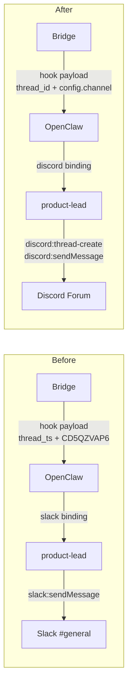
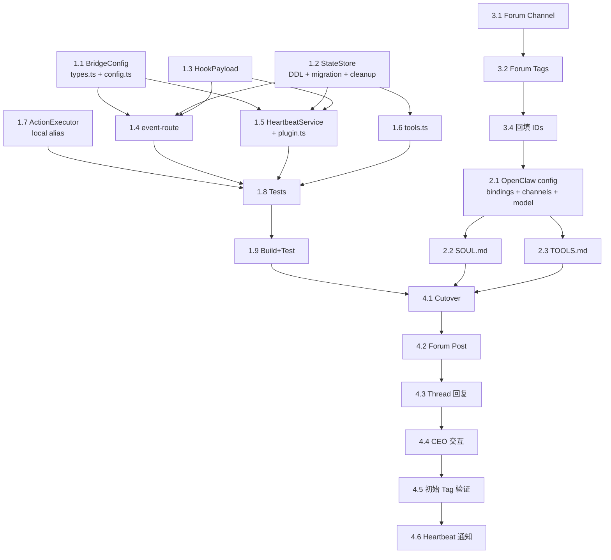

# Plan: Slack → Discord Migration + Forum Channel Architecture

**Version**: v1.2.0
**Issue**: GEO-163
**Date**: 2026-03-15
**Source**: `doc/exploration/new/GEO-163-slack-discord-migration.md`, `doc/research/new/GEO-163-discord-migration-research.md`
**Status**: codex-approved
**Codex Review**: Round 9 — APPROVED

---

## Overview

将 Flywheel 通知渠道从 Slack 全面迁移到 Discord Forum Channel。核心改动：Bridge 代码去 Slack 耦合（重命名 + config 提取）、OpenClaw 配置切换、product-lead agent 行为更新。

**不改变核心逻辑**——Bridge 仍然是 thread state 的 source of truth，Agent 仍然负责创建 thread 和回写 thread_id，决策流程不变。

### Cutover 策略

**Stop-the-world cutover**。Flywheel 是单操作员本地部署（Mac），不需要双字段兼容或滚动升级：

1. 停止 Bridge 和 OpenClaw Gateway
2. 部署所有代码改动（Wave 1）
3. 清空历史 Slack thread mapping（Wave 1 migration）
4. 更新 OpenClaw 配置 + product-lead workspace（Wave 2）
5. 创建 Discord Forum Channel（Wave 3，可提前完成）
6. 重启所有服务
7. E2E 验证（Wave 4）

全程不需要新旧系统并行。

---

## Architecture

### 迁移前后对比



### Thread Model

```
Bridge stores: thread_id (opaque string)
  ├── Slack (旧):  "1234.5678"        (message timestamp)
  └── Discord (新): "1479341196..."    (thread snowflake ID)
```

Bridge 不关心 thread_id 格式，Agent 负责创建 thread 并回写。

---

## Implementation Waves

### Wave 1: Bridge 代码去 Slack 耦合

**目标**：所有 Slack-specific 命名和硬编码改为 platform-agnostic。纯代码重构，不改变运行时行为。

**Scope 限制**：只改 teamlead 包。edge-worker 包的 `SlackAction` / `SlackInteractionServer` 不在本次范围（Cyrus 遗留，Flywheel 不直接使用 SlackInteractionServer；重命名 SlackAction 会扩大 blast radius 触及 responseUrl/interaction transport/reaction tests 等未相关路径）。teamlead 的 `ActionExecutor.ts` 用 local type alias 解耦。

#### Task 1.1: BridgeConfig 扩展

**File**: `packages/teamlead/src/bridge/types.ts`

添加 `notificationChannel` 字段：

```typescript
export interface BridgeConfig {
    // ... existing fields ...
    notificationChannel: string;  // replaces hardcoded CD5QZVAP6
}
```

**File**: `packages/teamlead/src/config.ts` (真实配置入口)

在 `loadConfig()` 返回值中添加：
```typescript
notificationChannel: process.env.TEAMLEAD_NOTIFICATION_CHANNEL ?? "CD5QZVAP6",
```

环境变量命名遵循现有 `TEAMLEAD_*` 前缀约定。默认值保持 `CD5QZVAP6` 确保向后兼容。

#### Task 1.2: StateStore schema migration

**File**: `packages/teamlead/src/StateStore.ts`

**关键：同时修改 CREATE TABLE DDL 和 migration logic。**

1. **sessions 表**：
   - `CREATE TABLE sessions` DDL：直接使用 `thread_id` 列名（新库不再创建 `slack_thread_ts`）
   - `SessionUpsert` interface (line 52): `slack_thread_ts` → `thread_id`
   - `Session` interface (line 79): `slack_thread_ts` → `thread_id`
   - `upsertSession()`: SQL column name in INSERT and ON CONFLICT (lines 263, 288, 314)
   - `setSessionThreadTs()` → `setSessionThreadId()` (lines 475-481)
   - `rowToSession()` mapping (line 558)

2. **conversation_threads 表**：
   - `CREATE TABLE conversation_threads` DDL：PK 改为 `thread_id`
   - `upsertThread()`: 参数名和 SQL (lines 430-447)
   - `getThreadIssue()`: 参数名和 SQL (lines 449-459)
   - `getThreadByIssue()`: 返回类型和 SQL (lines 461-473)

3. **Migration logic** (在 `migrate()` 方法中，建表之后添加)：

```typescript
// Migration: rename slack_thread_ts → thread_id (existing DBs)
// Three cases: (a) fresh DB → DDL already has thread_id, skip
//              (b) old DB with slack_thread_ts → rename
//              (c) legacy DB without either column → ADD COLUMN
const hasSlackThreadTs = this.db.exec(
    "SELECT 1 FROM pragma_table_info('sessions') WHERE name='slack_thread_ts'"
);
const hasThreadId = this.db.exec(
    "SELECT 1 FROM pragma_table_info('sessions') WHERE name='thread_id'"
);
if (hasSlackThreadTs.length > 0 && hasSlackThreadTs[0].values.length > 0) {
    // Case (b): old DB — rename
    this.db.run("ALTER TABLE sessions RENAME COLUMN slack_thread_ts TO thread_id");
} else if (hasThreadId.length === 0 || hasThreadId[0].values.length === 0) {
    // Case (c): legacy DB — neither column exists
    this.db.run("ALTER TABLE sessions ADD COLUMN thread_id TEXT");
}
// Case (a): fresh DB — thread_id already in DDL, nothing to do

// Same logic for conversation_threads
const hasOldThreadTs = this.db.exec(
    "SELECT 1 FROM pragma_table_info('conversation_threads') WHERE name='thread_ts'"
);
const hasNewThreadId = this.db.exec(
    "SELECT 1 FROM pragma_table_info('conversation_threads') WHERE name='thread_id'"
);
if (hasOldThreadTs.length > 0 && hasOldThreadTs[0].values.length > 0) {
    this.db.run("ALTER TABLE conversation_threads RENAME COLUMN thread_ts TO thread_id");
} else if (hasNewThreadId.length === 0 || hasNewThreadId[0].values.length === 0) {
    this.db.run("ALTER TABLE conversation_threads ADD COLUMN thread_id TEXT");
}

// Cutover: clear stale Slack thread mappings (one-time, guarded by user_version)
const versionResult = this.db.exec("PRAGMA user_version");
const currentVersion = versionResult[0]?.values[0]?.[0] as number ?? 0;
if (currentVersion < 2) {
    // Old Slack timestamps are invalid for Discord; agent will create fresh Forum Posts
    this.db.run("DELETE FROM conversation_threads");
    this.db.run("UPDATE sessions SET thread_id = NULL");
    this.db.run("PRAGMA user_version = 2");
}

// Rebuild unique index with new column name
this.db.run("DROP INDEX IF EXISTS idx_threads_issue");
this.db.run("CREATE UNIQUE INDEX IF NOT EXISTS idx_threads_issue ON conversation_threads(issue_id)");
```

**Migration 覆盖三种 DB 状态**：
- **(a) Fresh DB**：`CREATE TABLE` DDL 已经用 `thread_id`，无需 migration
- **(b) 标准旧库**：有 `slack_thread_ts` / `thread_ts`，执行 `RENAME COLUMN`
- **(c) 更早期遗留库**：既没有旧列也没有新列（`slack_thread_ts` 是后加的 migration，见 `StateStore.ts:175-177`），直接 `ADD COLUMN thread_id`

**测试要求**：
- Fresh DB bootstrap（case a）— 已在 Task 1.8
- Legacy DB rename + cleanup（case b）— 新增回归测试
- Very-legacy DB ADD COLUMN（case c）— 新增回归测试

**为什么清空 thread mapping？** 旧 Slack thread_ts 值（如 `1234.5678`）在 Discord 环境中无效。如果不清理，`event-route.ts:137-141` 的 thread 继承逻辑会把 Slack timestamp 当作 Discord thread ID 传给 agent，导致回复到不存在的 thread。一次性清空后，所有 issue 会在 Discord 中创建新的 Forum Post。`PRAGMA user_version` 防止重复清空。

#### Task 1.3: HookPayload 重命名

**File**: `packages/teamlead/src/bridge/hook-payload.ts`

- `HookPayload.thread_ts` → `HookPayload.thread_id`
- `HookPayload.channel` 保留（已经是 platform-agnostic）

#### Task 1.4: event-route 更新

**File**: `packages/teamlead/src/bridge/event-route.ts`

- Line 140: `store.setSessionThreadTs()` → `store.setSessionThreadId()`
- Line 227: `thread_ts: session.slack_thread_ts` → `thread_id: session.thread_id`
- Line 228: `channel: "CD5QZVAP6"` → `channel: config.notificationChannel`
- Line 188: 注释 "via Slack" → "via chat"
- `createEventRouter` 签名已有 `config: BridgeConfig`，直接使用

#### Task 1.5: HeartbeatService 更新

**注意**：`StuckWatcher.ts` 是 deprecated re-export alias（仅 3 行），真实逻辑在 `HeartbeatService.ts`。`plugin.ts` 已直接 import `WebhookHeartbeatNotifier` from `HeartbeatService.js`。

**File**: `packages/teamlead/src/HeartbeatService.ts`

- `WebhookHeartbeatNotifier.onSessionStuck()` (line 133): `thread_ts: session.slack_thread_ts` → `thread_id: session.thread_id`
- `WebhookHeartbeatNotifier.onSessionStuck()` (line 134): `channel: "CD5QZVAP6"` → `channel: this.notificationChannel`
- `WebhookHeartbeatNotifier.onSessionOrphaned()` (line 150-151): 同上
- `WebhookHeartbeatNotifier` constructor (line 117-121) 添加 `notificationChannel` 参数

```typescript
export class WebhookHeartbeatNotifier implements HeartbeatNotifier {
    constructor(
        private gatewayUrl: string,
        private hooksToken: string,
        private notificationChannel: string,
    ) {}
```

**File**: `packages/teamlead/src/bridge/plugin.ts` (line 207-218)

更新 `WebhookHeartbeatNotifier` 实例化，传入 `config.notificationChannel`：
```typescript
const notifier = new WebhookHeartbeatNotifier(
    config.gatewayUrl, config.hooksToken, config.notificationChannel
);
```

#### Task 1.6: tools.ts (Query API) 更新

**File**: `packages/teamlead/src/bridge/tools.ts`

- Line 69: `session.slack_thread_ts` → `session.thread_id`
- Line 72: `slack_thread_ts` → `thread_id`（API response field）
- Lines 101-137: `POST /api/threads/upsert` body field `thread_ts` → `thread_id`
- Line 139: `GET /api/thread/:thread_ts` → `GET /api/thread/:thread_id`
- 内部变量名跟随重命名

#### Task 1.7: ActionExecutor local alias

**File**: `packages/teamlead/src/ActionExecutor.ts`

不修改 edge-worker 导出。在 teamlead 内部用 local type alias 解耦命名：

```typescript
import type { SlackAction as ChatAction } from "flywheel-edge-worker";
```

所有内部使用改为 `ChatAction`，保持 import 指向不变。edge-worker 的 `SlackAction` 重命名留给后续独立 issue。

#### Task 1.8: 测试更新

所有 **teamlead** 测试文件跟随重命名：

| 测试文件 | 改动 |
|----------|------|
| `__tests__/StateStore.test.ts` | `slack_thread_ts` → `thread_id`；新增 fresh DB bootstrap 测试 |
| `__tests__/event-route.test.ts` | `CD5QZVAP6` → config channel, `slack_thread_ts` → `thread_id`, payload assertions |
| `__tests__/StuckWatcher.test.ts` (或 `HeartbeatService.test.ts`) | `slack_thread_ts` → `thread_id`, `CD5QZVAP6` → constructor param |
| `__tests__/tools.test.ts` | `slack_thread_ts` → `thread_id`, API route `:thread_ts` → `:thread_id` |
| `__tests__/hook-payload.test.ts` | `thread_ts` → `thread_id` |
| `__tests__/ActionExecutor.test.ts` | `SlackAction` → `ChatAction` (local alias) |
| `__tests__/bridge.test.ts` | 跟随 config 变更 |
| `__tests__/bridge-e2e.test.ts` | 跟随 API field 重命名 |

**新增测试**：
- `StateStore.test.ts`: "fresh DB creates thread_id column directly" — 验证新库不依赖 migration rename (case a)
- `StateStore.test.ts`: "legacy DB rename slack_thread_ts → thread_id" — 验证标准旧库 rename + 一次性清理 (case b)
- `StateStore.test.ts`: "very-legacy DB ADD COLUMN thread_id" — 验证更早期库（无 slack_thread_ts 列）正确补列 (case c)

**edge-worker 测试不动**（SlackInteractionServer.test.ts, reactions.test.ts, ReactionsEngine.test.ts, slack-reactions-e2e.test.ts）。

#### Task 1.9: Build + Test 验证

```bash
cd packages/teamlead && pnpm build && pnpm test
cd packages/edge-worker && pnpm build && pnpm test  # 确认无 break
```

所有测试必须通过。

---

### Wave 2: OpenClaw 配置 + product-lead 更新

**目标**：product-lead agent 从 Slack 切换到 Discord。

**前置**：Wave 3（Discord Forum Channel 创建）的 channel ID 需要先获取。Wave 3 可以和 Wave 1 并行进行。

#### Task 2.1: OpenClaw 配置更新

**File**: `~/.openclaw/openclaw.json`

**2.1a: bindings + hooks.mappings**

Binding **必须**使用 peer-scoped 匹配（参照 `clawdbot.json:81-111` 的 Telegram peer binding 模式），只绑定到 Forum Channel，而不是整个 Discord 平台。否则 `#ideas` (`1479341196022382622`) 等现有 Discord 用途会被 `product-lead` 接管。

OpenClaw binding DSL 支持的 peer.kind 值为 `direct|group|channel|dm`（参见 `openclaw/docs/gateway/configuration-reference.md:1341`）。Discord 频道使用 `"kind": "channel"`。Forum Channel 内创建的 thread 会自动继承父频道的 binding（`openclaw/src/routing/resolve-route.test.ts:434-465`），无需额外配置 thread-level binding。

```json
"bindings": [
    {
        "agentId": "product-lead",
        "match": {
            "channel": "discord",
            "peer": {
                "kind": "channel",
                "id": "{FORUM_CHANNEL_ID}"
            }
        }
    }
]

"hooks": {
    "mappings": [
        {
            "id": "flywheel-bridge",
            "action": "agent",
            "agentId": "product-lead",
            "messageTemplate": "{{message}}",
            "deliver": false,
            "channel": "discord",
            "to": "{FORUM_CHANNEL_ID}"
        }
    ]
}
```

**为什么不用 platform-level binding？** 当前 `openclaw.json:170-203` 已有 `#ideas` 频道配置（带独立 `skills`/`systemPrompt` 做 idea-capture）。如果 binding 只匹配 `"channel": "discord"`，所有 Discord 消息（包括 `#ideas`）都会路由到 `product-lead`，破坏现有的 idea-capture 功能。peer-scoped binding 精确到单个频道，互不干扰。

**2.1b: Discord guild channel-level 配置**

在 `channels.discord.guilds["1138242789382037545"].channels` 中新增 Forum Channel 条目：

```json
"{FORUM_CHANNEL_ID}": {
    "requireMention": false,
    "tools": {
        "allow": ["exec", "read", "write"]
    },
    "users": ["1138241636057481306"]
}
```

确保 OpenClaw Bot 在 Forum Channel 中有正确的工具权限和用户 allowlist。

**2.1c: modelByChannel（可选）**

如果 Forum Channel 需要非默认模型，在 `modelByChannel.discord` 中添加：
```json
"{FORUM_CHANNEL_ID}": "anthropic/claude-sonnet-4-6"
```

#### Task 2.2: product-lead SOUL.md 更新

**File**: `~/clawdbot-workspaces/product-lead/SOUL.md`

主要改动：
1. 所有 "Slack" → "Discord"
2. `slack:sendMessage` → `discord:sendMessage`
3. "不要用 send 工具，用 slack:sendMessage" → 更新为 Discord 工具指引
4. `thread_ts` → `thread_id`（查询参数 + 回写字段）
5. `slack_thread_ts` → `thread_id`（Bridge API response）
6. Channel `CD5QZVAP6` → Forum Channel ID
7. 新增 Forum Post 创建逻辑：首次 issue 事件 → `discord:thread-create`（带 `threadName: "[GEO-XXX] title"` + `appliedTags`）
8. Thread 反查 API：`GET /api/thread/{thread_id}`
10. **修正 auto-approve 行为说明**：当前 SOUL.md 仍写着 "auto_approve PRs are merged automatically by bridge"，但 v1.0 Phase 2 policy（`event-route.ts:199`）已禁用自动 merge。需改为："`auto_approve` 仅影响初始状态映射；除 backward-compat merged case 外，仍需 CEO approve，不存在 bridge 自动 merge 流程"
9. **Forum Tag — 初始 tag only（v1.2.0 MVP）**：
   - **创建时**：`discord:thread-create` 的 `appliedTags` 设置初始状态 tag
   - **状态映射**（与 `event-route.ts` 全部真实 status 分支对齐，包括 `auto_approve` 双分支和 `session_failed`）：

     | event type | route / condition | session status | initial tag |
     |------------|-------------------|----------------|-------------|
     | `session_started` | — | `running` | `in-progress` |
     | `session_completed` | `needs_review` | `awaiting_review` | `awaiting-review` |
     | `session_completed` | `auto_approve` + not merged | `awaiting_review` | `awaiting-review` |
     | `session_completed` | `auto_approve` + merged (backward-compat) | `approved` | `completed` |
     | `session_completed` | `blocked` | `blocked` | `blocked` |
     | `session_completed` | other | `completed` | `completed` |
     | `session_failed` | — | `failed` | `failed` |

   - Agent 根据 hook payload 中的 `status` 字段选择 tag：`running→in-progress`、`awaiting_review→awaiting-review`、`blocked→blocked`、`approved|completed→completed`、`failed→failed`
   - Agent 在首次 Forum Post 创建时 apply 对应 tag；**后续状态变更暂不更新 tag**

   **为什么不在 v1.2.0 做 runtime tag 更新？**
   1. OpenClaw 当前没有 `thread-edit` 工具（`edit` 只改消息文本，`channelEdit` 改频道级 `availableTags`，都不是 per-post tag 替换）
   2. `/api/actions/approve|reject|defer|shelve` 成功后只本地改 session 状态，不会发新 hook，agent 没有触发源
   3. 要做完整 tag 生命周期需要：(a) OpenClaw 增加 Forum Post metadata update 能力 + (b) teamlead action handlers 增加 post-action hook

   **Follow-up issue**：后续 issue 中同时解决 OpenClaw 工具缺口和 action hook 触发源，实现 tag 的 runtime 替换

#### Task 2.3: product-lead TOOLS.md 更新

**File**: `~/clawdbot-workspaces/product-lead/TOOLS.md`

```markdown
### Thread Management
- `POST /api/threads/upsert` — 回写 thread state:
  `{"thread_id":"...","channel":"{FORUM_CHANNEL_ID}","issue_id":"...","execution_id":"..."}`
- `GET /api/thread/{thread_id}` — 反查 thread → issue + execution

### Discord Tools
- `discord:thread-create` — 创建 Forum Post（threadName, content, appliedTags）
- `discord:sendMessage` — 发送消息到 channel/thread

### Forum Tag IDs (初始 tag，创建时 apply)
| Tag | ID | 用途 | Bridge status |
|-----|-----|------|---------------|
| in-progress | {ID} | 正在执行 | running |
| awaiting-review | {ID} | PR 等待 CEO review | awaiting_review |
| blocked | {ID} | 执行被阻塞 | blocked |
| completed | {ID} | 执行完成 | completed, approved |
| failed | {ID} | 执行失败 | failed |

Agent 选 tag 规则：根据 hook payload.status 映射。
注意：Runtime tag 更新（如 status 变更后替换 tag）待后续 issue 实现。
```

---

### Wave 3: Discord Server 搭建

**目标**：创建 Forum Channel 结构和 Tags。可以和 Wave 1 并行进行。

#### Task 3.1: 创建 GeoForge3D Category + Forum Channel

在 Discord Server (little piggy, `1138242789382037545`) 中：

1. 创建 Category: `GeoForge3D`
2. 在 Category 下创建 Forum Channel: `geoforge3d`
3. 设置 auto-archive: 7 days
4. 确保 OpenClaw Bot 有以下权限：
   - `SEND_MESSAGES`
   - `MANAGE_THREADS`
   - `SEND_MESSAGES_IN_THREADS`
   - `READ_MESSAGE_HISTORY`

#### Task 3.2: 创建 Forum Tags

在 `geoforge3d` Forum Channel 中创建 tags（与 `event-route.ts` 全部真实 status 对齐）：

| Tag | 颜色 | 用途 | 对应 Bridge status |
|-----|------|------|-------------------|
| `in-progress` | 蓝色 | 正在执行 | `running` |
| `awaiting-review` | 黄色 | PR 等待 CEO review | `awaiting_review` |
| `blocked` | 红色 | 执行被阻塞 | `blocked` |
| `completed` | 绿色 | 执行完成 | `completed`, `approved` |
| `failed` | 灰色 | 执行失败 | `failed` |

创建后通过 Discord API 获取 tag IDs：
```bash
curl -H "Authorization: Bot {TOKEN}" \
  "https://discord.com/api/v10/channels/{FORUM_CHANNEL_ID}" \
  | jq '.available_tags'
```

#### Task 3.3: 创建 Leadership Category（可选，MVP 后）

1. Category: `Leadership`
2. Text Channel: `cross-team`
3. Forum Channel: `standup`

**注意**：此 task 为未来扩展，v1.2.0 MVP 只需 `geoforge3d` Forum Channel。

#### Task 3.4: 回填 Channel IDs

获取 Forum Channel ID 和 Tag IDs 后：
1. 更新 `~/.openclaw/openclaw.json`：`hooks.mappings[0].to` + `channels.discord.guilds[...].channels` + 可选 `modelByChannel`
2. 更新 SOUL.md：channel ID + Forum Tag IDs
3. 更新 TOOLS.md：channel ID + Forum Tag ID 表
4. 设置环境变量 `TEAMLEAD_NOTIFICATION_CHANNEL`（在 `~/.zshrc` 中 export）

---

### Wave 4: E2E 验证

**目标**：完整走通 Bridge → OpenClaw → Discord Forum Post 链路。

#### Task 4.1: Cutover 执行

按 cutover 策略依次执行：
1. 停止 Bridge 进程
2. 停止 OpenClaw Gateway
3. 部署 Wave 1 代码（`pnpm build`）
4. 首次启动 Bridge（触发 migration：rename columns + clear Slack thread data）
5. 确认 OpenClaw 配置和 product-lead workspace 已更新（Wave 2 + Wave 3.4）
6. 重启 OpenClaw Gateway

#### Task 4.2: 验证 Forum Post 创建

用 test issue（类似 GEO-159）触发完整链路：

1. Bridge event → OpenClaw hook → product-lead 收到事件
2. product-lead 查询 Bridge API → `thread_id` 为空（已被 migration 清空）
3. product-lead 创建 Forum Post（`discord:thread-create`）
4. product-lead 回写 `thread_id` 到 Bridge
5. Forum Post 标题格式 `[GEO-XXX] {title}`
6. Forum Tag 被正确 apply

#### Task 4.3: 验证 Thread 回复

同一 issue 后续事件：

1. product-lead 查询 Bridge → 获取已有 `thread_id`
2. 在已有 Forum Post thread 内回复
3. Typing indicator 可见

#### Task 4.4: 验证 CEO 交互

1. CEO 在 Forum Post thread 内回复
2. product-lead 收到消息
3. product-lead 反查 Bridge API（`GET /api/thread/{thread_id}`）获取 issue 上下文
4. product-lead 正确回答/执行 action

#### Task 4.5: 验证 Forum Tag 初始 apply

验证分两层：真实 E2E（自然事件流）和 direct injection（覆盖全部 tag 输出）。

**E2E 验证（自然路径）**：

正常新 issue 流程中，Blueprint 先发 `session_started`，后发 `session_completed`/`session_failed`。因此首次创建 Forum Post 的事件一定是 `session_started`，initial tag 一定是 `in-progress`：

- 新 test issue → 自然 pipeline → `session_started` → product-lead 创建 Forum Post → tag = `in-progress` ✓

**Integration 验证（direct `/events` injection）**：

其余 4 个 initial tag 输出无法在自然 E2E 中产出（因为 `session_started` 总是先到），改用 direct HTTP injection 向 Bridge `/events` endpoint 发送合成事件（跳过 `session_started`）。

**注意**：Bridge `/events` endpoint 不直接读取 `status` 字段。对于 `session_completed`，`event-route.ts:154-173` 从 `payload.decision.route` 和 `payload.evidence.landingStatus.status` 推导 session status。对于 `session_failed`，status 固定为 `failed`（由 event_type 决定），`payload.error` 只记录错误详情（`event-route.ts:201-211`）。injection payload 必须使用真实的 `/events` 输入契约。每个 case 使用唯一的 `event_id`、`execution_id`、`issue_id`，避免去重或 session 污染。

| # | event_type | payload fragment | 推导出的 status | 期望 tag |
|---|-----------|------------------|----------------|---------|
| 1 | `session_completed` | `{ decision: { route: "needs_review" } }` | `awaiting_review` | `awaiting-review` |
| 2 | `session_completed` | `{ decision: { route: "blocked" } }` | `blocked` | `blocked` |
| 3 | `session_completed` | `{ decision: { route: "auto_approve" }, evidence: { landingStatus: { status: "merged" } } }` | `approved` | `completed` |
| 4 | `session_failed` | `{ error: "test error" }` | `failed` | `failed` |

**注意**：Runtime tag 更新（如 status 变更后替换 tag）不在 v1.2.0 scope。当前 tag 仅反映 Forum Post 创建时刻的状态。

#### Task 4.6: 验证 Heartbeat 通知

1. HeartbeatService（WebhookHeartbeatNotifier）发送 stuck/orphaned 通知 → Forum Post thread 内

---

## 任务依赖



**关键路径**：Wave 1 代码 + Wave 3 Discord 搭建（并行）→ Wave 2 配置 → Wave 4 Cutover + 验证

---

## 风险与缓解

| 风险 | 概率 | 影响 | 缓解 |
|------|------|------|------|
| Bot 权限不足 | 低 | 阻塞 Forum Post 创建 | 提前在 Discord Admin UI 确认权限 |
| Forum Tag ID 变更 | 极低 | Tag apply 失败 | SOUL.md 中记录 tag name→ID 映射，便于更新 |
| OpenClaw thread-create 行为与预期不符 | 低 | 需要改用 API 直调 | 已有 fallback 方案 |
| 旧 Slack thread 数据导致幽灵回复 | 中 | Agent 向不存在的 thread 发消息 | Migration 时一次性清空（PRAGMA user_version 防重复） |
| Cutover 期间服务中断 | 确定 | 几分钟不可用 | 单操作员系统，影响可忽略；选择非活跃时段 |

---

## 非目标

- edge-worker `SlackAction` → `ChatAction` 全面重命名（blast radius 大，留给独立 issue）
- SlackInteractionServer / SlackChatAdapter / SlackNotifier 重构（Cyrus 遗留）
- Multi-agent routing（GEO-152 scope）
- Voice Channel 集成（GEO-150 scope）
- Leadership channels 实际部署（仅搭建框架）

---

## 验收标准

1. **零 Slack 硬编码**：teamlead 包中不再有 `CD5QZVAP6`、`slack_thread_ts` 引用
2. **所有测试通过**：`pnpm test` 全绿（teamlead + edge-worker）
3. **Fresh DB 正常启动**：新库直接创建 `thread_id` 列，不依赖 rename migration
4. **E2E 链路通**：Bridge → OpenClaw → Discord Forum Post → Thread 回复 → CEO 交互
5. **Typing indicator**：CEO 能看到 bot 正在输入
6. **Forum Tags**：Forum Post 创建时 initial tag 正确 apply（runtime tag 更新为 follow-up issue）
7. **旧 thread 已清理**：迁移后 conversation_threads 表为空，session thread_id 为 NULL

---

## Codex Review Round 1 Feedback Addressed

| # | Codex 反馈 | 处理 |
|---|-----------|------|
| 1 | Fresh DB 建表路径缺 thread_id | Task 1.2 现在同时修改 CREATE TABLE DDL + migration |
| 2 | 跨进程兼容窗口 | 新增 stop-the-world cutover 策略，不需要双字段兼容 |
| 3 | 旧 Slack thread 数据复用问题 | Task 1.2 migration 清空历史 thread mapping，PRAGMA user_version 防重复 |
| 4 | OpenClaw Discord channel-level 配置不完整 | Task 2.1b 新增 Forum Channel 的 channel-level config |
| 5 | SlackAction→ChatAction 扩 scope | 从 GEO-163 移除；teamlead 用 local alias，edge-worker 不动 |
| 6 | 错误文件路径 + 遗漏测试 | config.ts/plugin.ts 修正；测试列表补全 |

## Codex Review Round 2 Feedback Addressed

| # | Codex 反馈 | 处理 |
|---|-----------|------|
| 1 | OpenClaw binding `"channel": "discord"` 太宽，会接管所有 Discord 流量 | Task 2.1a 改用 peer-scoped binding（`peer.kind: "channel"`），只绑 Forum Channel，不影响 `#ideas` |
| 2 | StateStore migration 缺少 ADD COLUMN fallback | Task 1.2 migration 现在用 `pragma_table_info` 探测列存在性，覆盖三种 DB 状态（fresh / 标准旧库 / 更早期遗留库）；新增 2 个回归测试 |
| 3 | Forum tag 只覆盖创建、没覆盖状态迁移 | v1.2.0 降级为 initial tag only（runtime tag 更新需要 OpenClaw 增加能力 + action hook 触发源，记录为 follow-up issue） |

## Codex Review Round 3 Feedback Addressed

| # | Codex 反馈 | 处理 |
|---|-----------|------|
| 1 | `peer.kind: "guild-channel"` 不是合法值 | 改为 `"kind": "channel"`（OpenClaw DSL 支持 `direct\|group\|channel\|dm`）；补充说明 thread 自动继承父频道 binding |
| 2 | `discord:thread-edit` 工具不存在 | 移除 `discord:thread-edit`；v1.2.0 降级为 initial tag only（创建时 apply）；runtime tag 更新记录为 follow-up issue，需要 OpenClaw 增加 Forum Post metadata update 能力 |
| 3 | Tag 状态名与 event-route.ts 真实 status 不对齐；action 没有 hook 触发源 | Tag 集合改为 `in-progress/awaiting-review/blocked/completed/failed`，完整覆盖 `event-route.ts` 全部 status 分支（包括 `auto_approve` 双分支和 `session_failed`）；action 后的 tag 更新不在 v1.2.0 scope |
| 4 | StuckWatcher.ts 是 deprecated alias，真实代码在 HeartbeatService.ts | Task 1.5 标题和文件路径全部改为 HeartbeatService.ts；保留 StuckWatcher.ts 作为兼容导出不修改 |

## Codex Review Round 4 Feedback Addressed

| # | Codex 反馈 | 处理 |
|---|-----------|------|
| 1 | 初始 tag 映射未覆盖 `auto_approve` 双分支和 `session_failed` | Task 2.2 tag 映射表现在覆盖 `event-route.ts` 全部 7 个状态分支；新增 `failed` tag；`approved` 折叠到 `completed` tag；Wave 4 Task 4.5 验证扩展到 5 个场景 |
| 2 | 文档残留旧表述（`guild-channel`、`discord:thread-edit`、`StuckWatcher`） | Round 2 feedback 表修正为 `peer.kind: "channel"` + 移除 `discord:thread-edit` 引用；依赖图改 `HeartbeatService`；Task 4.5/4.6 标签更新 |

## Codex Review Round 5 Feedback Addressed

| # | Codex 反馈 | 处理 |
|---|-----------|------|
| 1 | Task 4.5 没有 `completed` 初始 tag 验证场景 | Task 4.5 重写为 5 个独立场景表格，每个覆盖一个不同的 initial tag 输出（in-progress/awaiting-review/blocked/completed/failed），每个场景使用新 issue 确保是首次创建 |
| 2 | SOUL.md 仍有错误的 auto-approve 行为说明 | Task 2.2 新增第 10 条：显式修正 SOUL 中 auto-approve policy，对齐 v1.0 Phase 2 no-auto-merge 策略 |

## Codex Review Round 6 Feedback Addressed

| # | Codex 反馈 | 处理 |
|---|-----------|------|
| 1 | Task 4.5 把 synthetic mapping coverage 误写成 Wave 4 E2E | Task 4.5 拆成两层：E2E 只保留自然路径（`session_started` → `in-progress`）；其余 4 个 tag 改为 direct `/events` injection integration 验证 |

## Codex Review Round 7 Feedback Addressed

| # | Codex 反馈 | 处理 |
|---|-----------|------|
| 1 | Integration matrix 用了错误的 `/events` 输入契约（`status=...`） | 改为真实 payload 形状：`decision.route` + `evidence.landingStatus.status`；每个 case 标注完整的 event_type / payload / 推导出的 status / 期望 tag |

## Codex Review Round 8 Feedback Addressed

| # | Codex 反馈 | 处理 |
|---|-----------|------|
| 1 | `session_failed` case 把 error 放在 `payload.evidence` 下，应该是 `payload.error` | 表格改为统一的 `payload fragment` 列；`session_failed` 行改为 `{ error: "test error" }`；说明文字明确区分 `session_completed`（从 decision.route 推导）和 `session_failed`（event_type 固定 status，payload.error 记录详情）|
