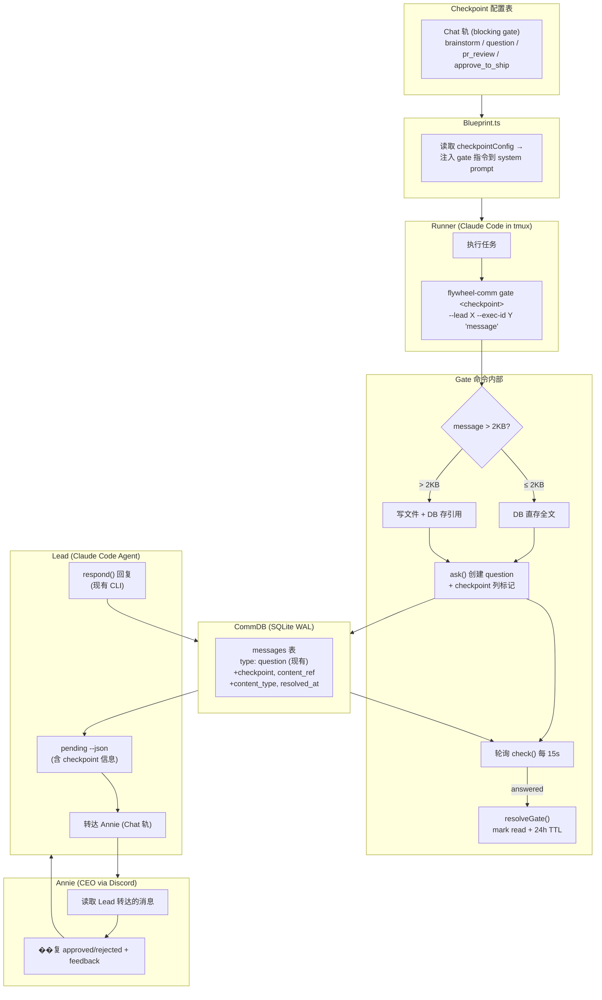
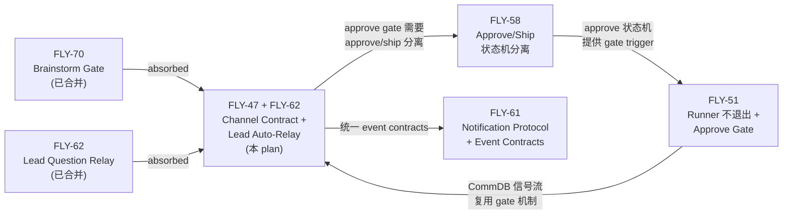

# Plan: Channel Contract + Lead Auto-Relay — 统一消息格式、路由规则和自动转发

**Version**: v1.21.0
**Issue**: FLY-47 (Channel Contract / Message Envelope) + FLY-62 (Lead Question Relay)
**Date**: 2026-04-05
**Source**: Linear FLY-47, FLY-62, `doc/architecture/product-experience-spec.md` §2.3-2.4, `doc/architecture/capability-matrix.md` §2.3-2.4, FLY-70 gate plan
**Status**: codex-approved
**Absorbs**: FLY-70 (brainstorm gate + Lead persistent context), FLY-62 (Lead auto-relay)
**Codex Review (FLY-47 only)**: Round 1 (9 issues) → Round 2 (4 issues) → Round 3 (3 issues) → Round 4 (2 issues) → Round 5 (approved)
**Codex Review (FLY-47+62 combined)**: R1 (6) -> R2 (4) -> R3 (4) -> R4 (2) -> R5 (approved)

## Background

### 打地鼠问题

多个功能需要相同的基础模式：

```
系统需要跟 Annie 传消息 → 等回复 → ���能继续
```

| Use Case | When | Issue |
|----------|------|-------|
| Brainstorm confirmation | Before implementation | FLY-70 |
| Approve to ship | After PR creation | FLY-51 |
| Question relay | Mid-implementation | FLY-62 |
| Design review confirmation | After plan generation | Future |
| PR review request | After PR creation | Future |

每个 checkpoint 单独造方案是打地鼠 —— 需要一套通用机制。

### FLY-70 Gate Plan 基础

FLY-70 已设计了通用 gate 命令（`flywheel-comm gate`）+ Checkpoint 配置 + Blueprint 注入。FLY-47 absorb FLY-70 后，在其基础上增加：

1. 统一 Message Envelope（Channel Contract）— 类型定义层，Phase 2 扩展
2. 长消息引用机制（Annie 设计要点）— Phase 1 仅 gate 消息
3. Gate 消息主动清理（Annie 设计要点）
4. 消息类型化 + 协议分离（借鉴 Claude Code Agent Team）

### Claude Code Agent Team 借鉴

研究了 Claude Code 源码（`/Users/xiaorongli/Dev/claude-code/`）中 Agent Team 的通信实现。关键借鉴：

| 借鉴项 | Claude Code 做法 | FLY-47 应用 |
|--------|----------------|------------|
| **消息类型化** | 10 种协议类型 + Zod Schema | 用 `checkpoint` 列标记 gate 语义（复用现有 question/response type） |
| **协议分离** | `isStructuredProtocolMessage()` 阻止协议消息注入 LLM 上下文 | inbox-check.sh 按 `checkpoint IS NOT NULL` 排除 gate 消息 |
| **请求-响应关联** | request_id 关联（约定级） | parent_id + UNIQUE 约束（DB 级，已有且更强） |

不借鉴的：JSON 文件存储（SQLite 更优）、proper-lockfile（WAL 已解决）、无 TTL（我们有）。（轮询频率：Runner gate 等 Annie 15s，Bridge gate-poller 检测新 question 3s — 见 Part 10a）

### 与 Product Experience Spec 的对齐

Checkpoint 配置直接映射 spec §2.3 双轨模型：

- **Chat 轨**（`track: chat`）= 阻塞等待 = spec "Annie 必须回答才能继续"
- **Forum 轨**（`track: forum`）= 仅写日志 = spec "Annie 按需看"（Phase 2 — 当前无 consumer）

Gate 协议遵守 spec §2.4 约束：Annie 永远不直接跟 Runner 对话，Lead 是唯一通道。

## Architecture Overview



## Design

### Key Decision: Gate 复用现有 question/response，不引入新 message type

**Codex Review Round 1 Issue #1/#2/#3 驱动的决策：**

现有 CommDB 的 `type` CHECK 约束（`question|response|instruction|progress`）无法通过 `ALTER TABLE` 安全扩展（sql.js 限制）。同时 `check()`/`respond()`/`pending()`/`hasPendingQuestionsFrom()` 都硬编码查 `type='question'`/`type='response'`。

**解法：gate 消息仍然用 `type='question'`/`type='response'`，通过新增 `checkpoint` 列标记 gate 语义。**

优势：
- 零 migration 风险 — 现有 CHECK 约束不变
- 完整复用 ask/check/respond/pending CLI 链路
- TmuxAdapter 的 `hasPendingQuestionsFrom()` 自动覆盖 gate 消息（因为 type 仍是 question）
- UNIQUE response 约束自动生效

`checkpoint` 列 = `NULL` 表示普通 Q&A，非 `NULL` 表示 gate 消息。

### Part 1: 通用 Gate 命令

**File**: `packages/flywheel-comm/src/commands/gate.ts` (NEW)

封装 ask + poll check + resolve 的原子操作。

**CLI signature**:
```
flywheel-comm gate <checkpoint-name> \
  --lead <leadId> \
  --exec-id <execId> \
  [--timeout <ms>] \
  [--db <path> | --project <name>] \
  "message content"
```

**Internal flow**:

1. **长消息处理**：如果 message > 2KB，��入文件 `.flywheel/comm/messages/{id}.md`，DB 存引用
2. **创建 question**：调用 `db.insertQuestion()` — 增强版，接受 `checkpoint` + `content_ref` + `content_type` 可选参数
3. **内容前缀**：自动在 content 前加 `[CHECKPOINT:<name>] ` 标记，供 Lead 识别优先级
4. **报告 stage**（仅当 checkpoint 配置了 `stage` 字段时）：HTTP POST to Bridge（fail-open on HTTP error）
5. **轮询**：每 15 秒调用 `db.getResponse(questionId)`（现有 `check()` 逻辑）
   - `answered` → 解析 response content → 调用 `resolveGate()` → exit 0
   - `pending` → continue
6. **超时**：默认 30 min（可配置），超时后根据 `timeout_behavior` 配置行为

**Error handling**（分两类 — Codex Issue #8）：

| 错误类型 | 行为 | 原因 |
|---------|------|------|
| **Timeout**（消息已发出但没人回） | 由 `timeout_behavior` 配置决定 | brainstorm/approve = fail-close, question = fail-open |
| **Infrastructure error**（DB 打不开、写入失败） | hard gate = fail-close (exit 1), soft gate = fail-open (exit 0) | 基础设施错误不能绕过强制 gate |

Hard gate = `timeout_behavior: fail-close` 的 checkpoint。

### Part 2: DB Schema 变更

**File**: `packages/flywheel-comm/src/db.ts` (MODIFY)

**仅新增 4 列，不修改现有 CHECK 约束**（Codex Issue #1 修复）：

```sql
-- 新增列（全部有默认值，向后兼容）
ALTER TABLE messages ADD COLUMN checkpoint TEXT;                    -- checkpoint 名称（NULL = 普通 Q&A）
ALTER TABLE messages ADD COLUMN content_ref TEXT;                   -- 文件引用路径
ALTER TABLE messages ADD COLUMN content_type TEXT DEFAULT 'text'    -- 'text' | 'ref'
  CHECK(content_type IN ('text', 'ref'));
ALTER TABLE messages ADD COLUMN resolved_at DATETIME;              -- gate 解除时间

-- 新增索引
CREATE INDEX IF NOT EXISTS idx_messages_checkpoint ON messages(checkpoint)
  WHERE checkpoint IS NOT NULL;
```

**Migration path**：在 `applyMigrations()` 中添加一步，使用 `ALTER TABLE ADD COLUMN`（sql.js 支持此操作）。所有新列有默认值，不影响现有数据。

**purge 调用点替换**：CommDB 构造函数（`db.ts:60`）当前调用 `this.purgeExpired()`，需替换为 `this.purgeExpiredWithRefs()`，使过期消息的 content_ref 文件一并清理。`purgeExpiredWithRefs()` 内部调用 `purgeExpired()`，是超集，向后兼容。

**注意**：不新增 `source` 列和 `priority` 列（Codex Issue #5 — Phase 1 无 consumer）。

### Part 3: CommDB API 扩展

**File**: `packages/flywheel-comm/src/db.ts` (MODIFY)

增强现有方法 + 新增 gate 专用方法：

```typescript
/** 预生成消息 ID（gate 需要先拿到 ID 再写 content_ref 文件） */
createMessageId(): string {
  return randomUUID();
}

/** 增强 insertQuestion — 接受可选 gate 参数，包含预分配 ID */
insertQuestion(
  fromAgent: string,
  toAgent: string,
  content: string,
  opts?: {
    id?: string;           // 预分配的 ID（来自 createMessageId）
    checkpoint?: string;
    content_ref?: string;
    content_type?: 'text' | 'ref';
  }
): string
// 实现：const id = opts?.id ?? randomUUID();
// 保持向后兼容 — 不传 opts 时行为不变

/** Mark gate as resolved + shorten TTL */
resolveGate(questionId: string, cleanupTTLHours: number): void {
  // 1. 找到 response
  const response = this.getResponse(questionId);
  // 2. ���记 question 和 response 为已读
  this.markRead(questionId);
  if (response) this.markRead(response.id);
  // 3. 设置 resolved_at
  this.setResolvedAt(questionId);
  // 4. 缩短 TTL
  this.shortenTTL(questionId, cleanupTTLHours);
  if (response) this.shortenTTL(response.id, cleanupTTLHours);
}

/** Set resolved_at timestamp */
setResolvedAt(messageId: string): void

/** Shorten TTL to N hours from now */
shortenTTL(messageId: string, hours: number): void

/** Mark message as read (generalize existing markInstructionRead) */
markRead(messageId: string): void

/** Purge expired messages AND their content_ref files */
purgeExpiredWithRefs(): number
```

**Lead 侧不需要新命令**（Codex Issue #2 修复）：Lead 继续用 `pending` 查看待处理问题，用 `respond` 回复。gate 消息在 `pending` 输出中通过 `[CHECKPOINT:brainstorm]` 前缀识别。

**pending 增强**：新增 `--json` flag，输出包��� `checkpoint`/`content_type`/`content_ref` 字段，让 Lead 侧脚本能识别 gate 消息。

### Part 4: 长消息处理

**Files**:
- `packages/flywheel-comm/src/commands/gate.ts` (NEW — gate 命令内部)
- `packages/flywheel-comm/src/utils/content-ref.ts` (NEW — 引用工具)

**Phase 1 范围：仅 gate 消息支持 content_ref**（Codex Issue #7 修复）。不扩展 `send()`/`insertInstruction()`。

```typescript
const CONTENT_REF_THRESHOLD = 2048; // 2KB

function writeContentRef(messageId: string, content: string, commDir: string): string {
  const refDir = join(commDir, 'messages');
  mkdirSync(refDir, { recursive: true });
  const refPath = join(refDir, `${messageId}.md`);
  writeFileSync(refPath, content, 'utf-8');
  return refPath;
}
```

**Gate 命令中的使用（两阶段 — Codex Issue #3 修复）**：

先拿 ID，再写文件，最后写 DB — 保证 ID 一致：

```typescript
// Step 1: 预分配 ID
const id = db.createMessageId();

// Step 2: 长消息 → 写文件（用预分配的 ID 命名）
if (message.length > CONTENT_REF_THRESHOLD) {
  const refPath = writeContentRef(id, message, commDir);
  const summary = message.substring(0, 200) + '...';
  // Step 3: 写 DB（传入预分配 ID）
  db.insertQuestion(fromAgent, toAgent,
    `[CHECKPOINT:${checkpointName}] ${summary}`,
    { id, checkpoint: checkpointName, content_ref: refPath, content_type: 'ref' }
  );
} else {
  db.insertQuestion(fromAgent, toAgent,
    `[CHECKPOINT:${checkpointName}] ${message}`,
    { id, checkpoint: checkpointName, content_type: 'text' }
  );
}
```

**Lead 侧读取**：Lead 通过 `pending --json` 看到 gate_request 时，如果 `content_type='ref'`，读取 `content_ref` 文件获取全文。

### Part 5: Gate 消息主动清理

**File**: `packages/flywheel-comm/src/commands/gate.ts` (gate resolve 逻辑)

**规则**：Checkpoint 通过后立即 mark read + 缩短 TTL。

```typescript
function resolveGate(db: CommDB, questionId: string, cleanupTTLHours: number): void {
  db.resolveGate(questionId, cleanupTTLHours);
}
```

**content_ref 文件清理 — 统一 helper + 两条删除路径**：

现有 CommDB 有两条消息删除路径：
1. `purgeExpired()` — 构造函数自动调用，删除 `expires_at < now` 的消息
2. `cleanupReadMessages(ttlHours)` — `flywheel-comm cleanup` 命令调用，删除已读且超龄的消息

两条路径都可能删掉带 `content_ref` 的消息，因此都需要先清理引用文件。

```typescript
/** 内部 helper — 在删除消息前清理其 content_ref 文件 */
private cleanupContentRefs(whereClause: string, params: unknown[]): void {
  const refs = this.db.prepare(
    `SELECT content_ref FROM messages WHERE ${whereClause} AND content_ref IS NOT NULL`
  ).all(...params) as Array<{ content_ref: string }>;
  for (const { content_ref } of refs) {
    try { unlinkSync(content_ref); } catch { /* file already gone */ }
  }
}

/** 替代 purgeExpired()：先清文件再删消息 */
purgeExpiredWithRefs(): number {
  this.cleanupContentRefs("expires_at < datetime('now')", []);
  return this.purgeExpired();
}

/** 替代 cleanupReadMessages()：先清文件再删消息 */
cleanupReadMessagesWithRefs(ttlHours?: number): number {
  const hours = ttlHours ?? 24; // 与现有 cleanupReadMessages() 默认值一致
  this.cleanupContentRefs(
    "read_at IS NOT NULL AND created_at < datetime('now', '-' || ? || ' hours')",
    [hours]
  );
  return this.cleanupReadMessages(ttlHours);
}
```

**调用点替换**：
- CommDB 构造函数（`db.ts:60`）：`this.purgeExpired()` → `this.purgeExpiredWithRefs()`
- `cleanup-messages.ts:21`：`db.cleanupReadMessages(args.ttlHours)` → `db.cleanupReadMessagesWithRefs(args.ttlHours)`

### Part 6: Checkpoint 配置表

**File**: `packages/config/src/types.ts` (MODIFY)

Phase 1 仅支持 `track: chat` 的 checkpoint（Codex Issue #5 — forum track 无 consumer）。

```typescript
/** Timeout behavior on expiry */
type TimeoutBehavior = 'fail-open' | 'fail-close';

/** A single checkpoint definition */
interface CheckpointConfig {
  /** Whether this checkpoint is active. Default: false */
  enabled?: boolean;
  /** Timeout in ms before timeout_behavior kicks in. Default: 1_800_000 (30 min) */
  timeout_ms?: number;
  /** What happens on timeout (no response received). Default: 'fail-open' */
  timeout_behavior?: TimeoutBehavior;
  /** TTL in hours for cleanup after gate resolves. Default: 24 */
  cleanup_ttl_hours?: number;
  /** Stage name to report to Bridge. Defaults to checkpoint name. */
  stage?: string;
}

/** Checkpoint configuration map — added to FlywheelConfig */
interface CheckpointsConfig {
  [name: string]: CheckpointConfig;
}
```

Add to `FlywheelConfig`:
```typescript
interface FlywheelConfig {
  // ... existing fields ...
  /** Checkpoint gates — human-in-the-loop confirmation points */
  checkpoints?: CheckpointsConfig;
}
```

**Example project config** (`.flywheel/config.yaml`):
```yaml
checkpoints:
  brainstorm:
    enabled: true
    timeout_ms: 1800000          # 30 min
    timeout_behavior: fail-close  # brainstorm 必须等
    cleanup_ttl_hours: 24
    stage: brainstorm             # 可选 — 恰好和 checkpoint 名一致
  question:
    enabled: true
    timeout_ms: 1800000
    timeout_behavior: fail-open
    cleanup_ttl_hours: 24
    # 无 stage — question 不代表 pipeline 阶段，不上报 stage 事件
  pr_review:
    enabled: true
    timeout_ms: 14400000         # 4 hours
    timeout_behavior: fail-open
    cleanup_ttl_hours: 24
    # 无 stage — pr_review 不上报 stage 事件
  approve_to_ship:
    enabled: true
    timeout_ms: 14400000
    timeout_behavior: fail-close  # approve 必须等
    cleanup_ttl_hours: 24
    stage: approve                # 显式映射：checkpoint 名 → stage 名
```

**Default when no checkpoints config**: No gates — backward compatible.

### Part 7: Blueprint 集成

**File**: `packages/edge-worker/src/Blueprint.ts` (MODIFY — constructor + `runInner()`)

**Codex Issue #4 修复 — 完整配置注入链：**

#### 7a. Blueprint 构造函数扩展

```typescript
// Blueprint.ts constructor 当前签名:
constructor(private skillsConfig?: SkillsConfig) { ... }

// 改为:
constructor(
  private skillsConfig?: SkillsConfig,
  private checkpointConfig?: CheckpointsConfig
) { ... }
```

#### 7b. 两个创建路径都要传 checkpointConfig

**路径 1 — `scripts/lib/setup.ts` (本地 run-issue)**:
```typescript
// setup.ts 当前: new Blueprint(flywheelConfig?.skills)
// 改为:
new Blueprint(flywheelConfig?.skills, flywheelConfig?.checkpoints)
```

**路径 2 — `packages/teamlead/src/bridge/run-infra.ts` (Bridge API)**:

当前 `setupRunInfrastructure()` 接收 `project` 参数（含 `projectRoot`）。改动：

1. `packages/teamlead/package.json` 新增依赖 `"flywheel-config": "workspace:*"` （或直接用相对 dist 导入，与 `setup.ts` 保持一致）
2. `setupRunInfrastructure()` 内部按 `ConfigLoader` 真实签名加载配置
3. 从 `flywheelConfig?.checkpoints` 提取 checkpointConfig，传入 `createRunBlueprint()`

```typescript
// run-infra.ts setupRunInfrastructure() 内部:
import { readFileSync } from "node:fs";
import { join } from "node:path";
import { ConfigLoader } from "flywheel-config"; // 或用相对 dist 路径

// ConfigLoader 构造必须注入 readFile（DI 设计，与 setup.ts 用法一致）
const loader = new ConfigLoader(async (p) => readFileSync(p, "utf-8"));
const configPath = join(project.projectRoot, ".flywheel", "config.yaml");

let checkpointConfig: CheckpointsConfig | undefined;
try {
  const flywheelConfig = await loader.load(configPath);
  checkpointConfig = flywheelConfig?.checkpoints;
} catch (err: unknown) {
  // 仅 ENOENT（配置文件不存在）时静默跳过 — 向后兼容
  // YAML 解析错误、字段校验错误等 → fail fast（与 setup.ts 对齐）
  if ((err as NodeJS.ErrnoException).code === 'ENOENT') {
    // 无配置文件，不注入 checkpoint
  } else {
    throw err;
  }
}

// createRunBlueprint() 当前: new Blueprint(undefined /* skillsConfig */)
// 改为:
function createRunBlueprint(skillsConfig?: SkillsConfig, checkpointConfig?: CheckpointsConfig) {
  return new Blueprint(skillsConfig, checkpointConfig);
}
```

**依赖说明**：`ConfigLoader` 构造函数签名为 `constructor(readFile: ReadFileFn)`，`load()` 接受配置文件完整路径（不是 project root）。参考 `scripts/lib/setup.ts:455` 的现有用法。

#### 7c. runInner() 注入 gate 指令

Blueprint 在 `runInner()` 中为每个 `enabled: true` 的 checkpoint 注入 gate 指令。

**brainstorm** — 在现有 "Lead ask 指令" 注入点之后（Blueprint.ts ~line 318）：
```
BRAINSTORM GATE (MANDATORY — do NOT skip):
Before writing any code, you MUST confirm your understanding with your Lead.
a. Read the issue and codebase. Form your understanding.
b. Run: node {commCliPath} gate brainstorm --lead {leadId} --exec-id {execId} --timeout {timeout} "Your understanding: [what] [how] [expected outcome]"
c. This command BLOCKS until your Lead confirms. Do NOT write code until it returns.
d. Read the response. If corrections were provided, adjust your approach.
```

**approve_to_ship** — 在 landing signal 相关注入点之后（Blueprint.ts ~line 277）：
```
APPROVE GATE (MANDATORY — do NOT skip):
After creating the PR, you MUST wait for approval before exiting.
a. Run: node {commCliPath} gate approve_to_ship --lead {leadId} --exec-id {execId} --timeout {timeout} "PR #{number} created: {url}. Ready for review."
b. This command BLOCKS until approval. Do NOT exit until it returns.
c. If changes were requested, address them and re-submit gate.
```

**question** — 在 "Lead ask 指令" 注入点附近：
```
QUESTION GATE (use when needed):
When you have a question that blocks your progress:
a. Run: node {commCliPath} gate question --lead {leadId} --exec-id {execId} "Your question here"
b. This command BLOCKS until your Lead responds.
```

**When `ctx.leadId` is NOT present**: Skip all checkpoint injections.

### Part 8: inbox-check.sh 协议分离

**File**: `scripts/hooks/inbox-check.sh` (MODIFY)

Gate 消息（`checkpoint IS NOT NULL` 的 question）由 gate 命令自己轮询消费，不通过 inbox-check 注入 Runner 的 additionalContext。

**修改 SQL 查询**：
```sql
-- 现有（只查 instruction）：
SELECT COUNT(*) FROM messages
  WHERE to_agent='${EXEC_ID}' AND type='instruction'
  AND read_at IS NULL AND expires_at > datetime('now');

-- 不需要改！现有查询已经只查 instruction，不查 question。
-- gate 消息是 type='question'（带 checkpoint 标记），天然被排除。
```

**实际上 inbox-check.sh 不需要修改** — 因为 gate 消息用 `type='question'`，而 inbox-check 只查 `type='instruction'`，已经天然分离。

### Part 9: Stage 常量同步

**Files**（Codex Issue #6 修复）：
- `packages/flywheel-comm/src/commands/stage.ts` (MODIFY)
- `packages/teamlead/src/bridge/stage-utils.ts` (MODIFY)

两边同步新增 checkpoint 相关 stage：

```typescript
// 两个文件的 VALID_STAGES 都改为：
const VALID_STAGES = new Set([
  "started", "brainstorm", "research", "plan", "design_review",
  "implement", "test", "code_review", "pr_created",
  "approve",  // 新增 — 对应 approve_to_ship checkpoint（config 里 stage: approve）
  "ship",
]);

// stage-utils.ts 的 STAGE_ORDER 也要同步更新：
export const STAGE_ORDER: Record<string, number> = {
  started: 0,
  brainstorm: 1,
  research: 2,
  plan: 3,
  design_review: 4,
  implement: 5,
  test: 6,
  code_review: 7,
  pr_created: 8,
  approve: 9,   // 新增
  ship: 10,     // 原 9 → 10
};
```

**Stage 上报规则**：Gate 命令**仅当 checkpoint 配置了显式 `stage` 字段时**才上报 stage 事件。即 `checkpointConfig[name].stage` 存在才调用 stage reporting，不存在则跳过。这避免了 `question`、`pr_review` 等没有合法 stage 映射的 checkpoint 上报非法 stage 名。

具体来说：`brainstorm` 的 checkpoint 名恰好匹配 `VALID_STAGES` 中的 `brainstorm`，因此无需显式 `stage` 字段（但可选配置 `stage: brainstorm`）。`approve_to_ship` 必须配 `stage: approve`。`question` 和 `pr_review` 不配 `stage` — 它们在 pipeline 中不代表一个独立阶段。

**长期方案**：抽取 `packages/core/src/stages.ts` 作为单一真理来源。Phase 1 先同步两边。

### Part 10: Lead Auto-Relay — Gate Question 自动转发 (FLY-62)

**核心目标**：Runner 通过 gate 命令写入 CommDB 的 question，Lead 应自动检测并转发给 Annie（via Discord），Annie 回复后 Lead 自动写回 CommDB response。

**架构约束**（Product Spec §2.4）：Annie 永远不直接跟 Runner 对话，Lead 是唯一通道。因此 gate → Annie 必须经过 Lead。

#### 10a. Bridge 侧 — Gate Question Poller

**File**: `packages/teamlead/src/bridge/gate-poller.ts` (NEW)

Bridge 新增定时任务，为每个活跃 session 轮询 CommDB 中的 pending gate questions。

```typescript
import { CommDB } from "flywheel-comm/db";
import { resolveLeadForIssue, type ProjectEntry } from "../ProjectConfig.js";
import type { StateStore, Session } from "../StateStore.js";
import { parseSessionLabels } from "./lead-scope.js";
import { defaultGetCommDbPath } from "./session-capture.js";
import type { RuntimeRegistry } from "./runtime-registry.js";

interface GatePollerConfig {
  pollIntervalMs: number;  // 默认 3_000 (3s) — Lead 是机器，应快速响应
  projects: ProjectEntry[];
  store: StateStore;
  runtimeRegistry: RuntimeRegistry;  // 真实 Bridge 类型，非裸 Map
}

class GatePoller {
  private timerHandle: ReturnType<typeof setInterval> | null = null;
  private polling = false;  // reentrancy guard

  start(): void {
    if (this.timerHandle) return;
    this.timerHandle = setInterval(() => this.poll(), this.config.pollIntervalMs);
  }

  stop(): void {
    if (this.timerHandle) {
      clearInterval(this.timerHandle);
      this.timerHandle = null;
    }
  }

  private async poll(): Promise<void> {
    if (this.polling) return;  // skip if previous poll still running
    this.polling = true;
    try {
      const activeSessions = this.config.store.getActiveSessions();

      // Step 1: 按 (project, lead) 分组 sessions，避免同一 lead 重复查询 CommDB
      const grouped = new Map<string, { lead: LeadConfig; dbPath: string; sessions: Session[] }>();
      for (const session of activeSessions) {
        const labels = parseSessionLabels(session);
        const { lead } = resolveLeadForIssue(
          this.config.projects, session.project_name, labels,
        );
        const key = `${session.project_name}:${lead.agentId}`;
        if (!grouped.has(key)) {
          grouped.set(key, {
            lead,
            dbPath: defaultGetCommDbPath(session.project_name),
            sessions: [],
          });
        }
        grouped.get(key)!.sessions.push(session);
      }

      // Step 2: 每个 (project, lead) 查一次 pending gate questions，
      //         用 question.from_agent 匹配正确的 session
      for (const { lead, dbPath, sessions } of grouped.values()) {
        const pending = this.getPendingGateQuestions(dbPath, lead.agentId);
        // 建立 execution_id -> session 的索引
        const sessionByExecId = new Map(sessions.map(s => [s.execution_id, s]));
        for (const question of pending) {
          // question.from_agent 是 Runner 的 execution_id — 必须匹配到正确的 session
          const session = sessionByExecId.get(question.from_agent);
          if (!session) continue;  // orphan question — session 已结束，跳过
          await this.relayToLead(lead, session, question, dbPath);
        }
      }
    } finally {
      this.polling = false;
    }
  }

  private getPendingGateQuestions(dbPath: string, leadId: string): PendingQuestion[] {
    const db = CommDB.openReadonly(dbPath);
    try {
      return db.getPendingQuestions(leadId)
        .filter(q => q.checkpoint !== null);
    } finally {
      db.close();
    }
  }
}
```

**Lead 解析**：`StateStore.Session.issue_labels` 是序列化字符串（JSON 或 CSV）。用 `parseSessionLabels(session)` 解析为 `string[]`，再传 `resolveLeadForIssue(projects, session.project_name, labels)` — 三参数签名，与 `lead-scope.ts` 和 `plugin.ts` 中的用法一致。

**DB path 解析**：复用 `session-capture.ts` 导出的 `defaultGetCommDbPath(projectName)` 函数。

**生命周期**：
- `start()` 保存 `timerHandle`，`stop()` 清理 — 集成到 `plugin.ts` 的 Bridge boot/shutdown
- `polling` flag 防止重入 — 如果一次 poll 超过 3s，不会并发启动第二次
- Bridge shutdown 时调用 `gatePoller.stop()`

**plugin.ts 集成**（`packages/teamlead/src/bridge/plugin.ts`）：
```typescript
// Bridge boot
const gatePoller = new GatePoller({
  pollIntervalMs: 3_000,
  projects,
  store,
  runtimeRegistry,
});
gatePoller.start();

// Bridge shutdown
gatePoller.stop();
```

**关键设计**：
- 使用 `CommDB.openReadonly()` — 与 TmuxAdapter 一致的轻量读取模式
- 去重：poller 先查 `lead_events` 表是否已有 `delivered_at` 非空的记录 → 已投递则跳过（见 10b `isAlreadyDelivered` 检查）
- 每个 poll cycle 遍历所有 active sessions — O(sessions × pending) 可接受
- Poll 间隔 3s — Lead 是 Claude Code session（机器），应像 Agent Team 的 1s 轮询一样快速响应。注意区分：Runner gate 的 15s 是等 Annie（人）回复的频率，gate-poller 的 3s 是 Lead（机器）检测新 gate question 的频率

#### 10b. 事件投递 — 复用现有 Lead Event Journal

**集成点**：`packages/teamlead/src/bridge/event-route.ts`（现有 `appendLeadEvent` -> `deliver` -> `markDelivered` 模式）

Gate question 包装为 `LeadEventEnvelope`，复用 `StateStore` 的 lead event journal 进行投递和失败记录。投递前先检查 journal 状态，避免重复发送。

```typescript
private async relayToLead(
  lead: { agentId: string },
  session: Session,
  question: PendingQuestion,
  dbPath: string,
): Promise<void> {
  const runtime = this.config.runtimeRegistry.getForLead(lead.agentId);
  if (!runtime) return;

  const eventId = `gate_${question.id}`;

  // Step 0: 检查 journal 状态 — 已投递成功则跳过
  if (this.config.store.isLeadEventDelivered(lead.agentId, eventId)) return;

  // 长消息：Bridge 侧解析 content_ref 文件，Lead 收到完整文本
  let fullContent = question.content;
  if (question.content_type === 'ref' && question.content_ref) {
    fullContent = readContentRef(question.content_ref) ?? question.content;
  }

  // 构造事件 — 使用真实 HookPayload snake_case 字段
  const payload: HookPayload = {
    event_type: 'gate_question',
    execution_id: session.execution_id,
    issue_id: session.issue_id,
    issue_identifier: session.issue_identifier,
    project_name: session.project_name,
    status: 'gate_pending',
    summary: fullContent,                  // 完整文本（Bridge 已解析 content_ref）
    checkpoint: question.checkpoint,       // gate-specific 扩展字段
    question_id: question.id,
    from_agent: question.from_agent,
    comm_db_path: dbPath,                  // Lead respond 时需要
  };

  // Step 1: appendLeadEvent — payload 序列化为 JSON string
  //   真实签名: appendLeadEvent(leadId, eventId, eventType, payload: string, sessionKey?)
  //   UNIQUE(lead_id, event_id) — 重复 insert 返回已有 seq（不报错）
  const seq = this.config.store.appendLeadEvent(
    lead.agentId, eventId, 'gate_question',
    JSON.stringify(payload),               // payload 参数是 string，需 JSON.stringify
    session.execution_id,
  );

  // Step 2: deliver — formatEnvelope 接受 LeadEventEnvelope（不是裸 HookPayload）
  const envelope: LeadEventEnvelope = {
    seq,
    event: payload,
    sessionKey: session.execution_id,
    leadId: lead.agentId,
    timestamp: new Date().toISOString(),
  };
  const result = await runtime.deliver(envelope);

  // Step 3: 记录结果
  if (result.delivered) {
    this.config.store.markLeadEventDelivered(seq);
  } else {
    this.config.store.recordDeliveryFailure(seq, result.error ?? 'deliver returned false');
  }
}

// isLeadEventDelivered 是 StateStore 新增的公开方法（见下方说明）
```

**StateStore 新增公开方法**（`packages/teamlead/src/StateStore.ts` MODIFY）：

```typescript
/** Check if a lead event has been successfully delivered. */
isLeadEventDelivered(leadId: string, eventId: string): boolean {
  const rows = this.db.exec(
    `SELECT 1 FROM lead_events
     WHERE lead_id = ? AND event_id = ? AND delivered_at IS NOT NULL
     LIMIT 1`,
    [leadId, eventId],
  );
  return rows.length > 0 && (rows[0]?.values?.length ?? 0) > 0;
}
```

这保持了 `StateStore.db` 的私有封装，gate-poller 通过公开 API 查询投递状态。

**投递去重流程**（解决 R1 Issue #3 和 R2 Issue #1）：

每次 poll 先通过 `store.isLeadEventDelivered(leadId, eventId)` 查询：
1. 返回 true -> 已成功投递，跳过
2. 行不存在 -> 新 gate question，`appendLeadEvent()` 插入 -> `deliver()` -> `markLeadEventDelivered()`
3. 行存在但未投递 -> 前次投递失败，`appendLeadEvent()` 返回已有 seq -> 重新 `deliver()`

这避免了每 3s 重复发送已投递的 gate question。gate question 在 CommDB 中持续 pending 直到 Annie 回复，但 Bridge 只投递一次（除非失败重试）。

**content_ref 跨包导入**：`readContentRef()` 在 `packages/flywheel-comm/src/utils/content-ref.ts`（本 plan Part 5 新增）。为让 `teamlead` 包导入，需要在 `packages/flywheel-comm/package.json` 的 `exports` 中新增 subpath：

```json
"exports": {
  ".": "./dist/index.js",
  "./db": "./dist/lib.js",
  "./utils": "./dist/utils/content-ref.js"
}
```

`teamlead` 侧导入：`import { readContentRef } from "flywheel-comm/utils";`

**content_ref 解析**：Bridge 在 poller 侧通过 `readContentRef()` 获取全文。Lead 收到的 `summary` 字段即为完整文本，不依赖 Lead 侧文件访问。

**HookPayload 扩展**（`packages/teamlead/src/bridge/hook-payload.ts`）：

```typescript
// 新增 gate_question 可选字段（所有现有字段不变）
export interface HookPayload {
  // ... 现有字段 ...
  checkpoint?: string;       // gate checkpoint 名称
  question_id?: string;      // gate question ID
  from_agent?: string;       // 发起 gate 的 agent
  comm_db_path?: string;     // CommDB 路径（Lead respond 时需要）
}
```

**ClaudeDiscordRuntime.formatEnvelope() 更新**（`packages/teamlead/src/bridge/claude-discord-runtime.ts`）：

`formatEnvelope()` 现有签名 `private formatEnvelope(env: LeadEventEnvelope): string`，通过 `env.event` 访问 payload。新增 `gate_question` 分支：

```typescript
// 现有签名不变: private formatEnvelope(env: LeadEventEnvelope): string
private formatEnvelope(env: LeadEventEnvelope): string {
  const e = env.event;
  // 新增: gate_question 特殊格式
  if (e.event_type === 'gate_question') {
    const tag = e.checkpoint?.toUpperCase() ?? 'GATE';
    const issueRef = e.issue_identifier || e.issue_id;
    const lines = [
      `**[Event #${env.seq}]** \`gate_question\``,
      `> **ID**: \`${e.execution_id || "---"}\` | **Issue**: \`${issueRef || "---"}\``,
      `**[${tag}]** Runner asks:`,
      '---',
      e.summary ?? '(no content)',
      '---',
      `Reply to approve or provide feedback. Question ID: \`${e.question_id}\``,
    ];
    return lines.join('\n');
  }
  // ... 其余 event_type 不变（现有逻辑）...
}
```

**deliver() 分片升级**（`packages/teamlead/src/bridge/claude-discord-runtime.ts`）：

现有签名: `async deliver(envelope: LeadEventEnvelope): Promise<DeliveryResult>`。升级为支持分片（复用 `sendBootstrap()` 的 `splitDiscordMessage` + `postDiscordMessage(chunk, true)` 模式）：

```typescript
async deliver(envelope: LeadEventEnvelope): Promise<DeliveryResult> {
  const content = this.formatEnvelope(envelope);
  // 新增: 复用 sendBootstrap() 的 splitDiscordMessage 逻辑
  const chunks = splitDiscordMessage(content);
  try {
    for (const chunk of chunks) {
      // postDiscordMessage(content: string, throwOnError = false): Promise<void>
      await this.postDiscordMessage(chunk, true);
    }
    this.lastDeliveryAt = new Date().toISOString();
    this.lastDeliveredSeq = envelope.seq;
    return { delivered: true };
  } catch (err) {
    const error = (err as Error).message;
    console.warn(`[claude-discord] Delivery failed for seq=${envelope.seq}:`, error);
    return { delivered: false, error };
  }
}
```

这与现有 `sendBootstrap()` 的分片模式一致：`formatBootstrap()` 返回 `string`，外层调用 `splitDiscordMessage()` 分片后逐条 `postDiscordMessage(chunk, true)`。

#### 10c. Lead Agent 侧 — 接收 gate_question 并转发 Annie

**实现载体**：Lead identity config（`~/.flywheel/leads/<leadId>/identity.md`）的 gate relay 指令 section。

Lead 是 Claude Code agent，运行在 Discord 上。`gate_question` 事件通过 `ClaudeDiscordRuntime.deliver()` 以格式化 Discord 消息投递到 Lead 的 control channel（Bridge 已解析 content_ref 并分片，Lead 收到的是完整文本）。

Lead 收到 `gate_question` 消息后：

1. **识别事件**：Lead 的 identity.md 中包含 gate relay 指令，识别 `[BRAINSTORM]` / `[QUESTION]` 等 checkpoint 标签
2. **直接转发 Annie**：消息已由 Bridge 格式化为完整可读文本，Lead 无需读取文件
3. **等待 Annie 回复**：Lead 在 Discord chat 中等待 Annie 的下一条消息
4. **写回 CommDB**：Lead 调用 `flywheel-comm respond` CLI

```bash
# 真实 CLI 签名（packages/flywheel-comm/src/index.ts）
# --db 指定 CommDB 路径（从 gate_question 消息的 comm_db_path 字段获取）
flywheel-comm respond --db <comm_db_path> --lead <leadId> <questionId> "Annie's response content"
```

**Lead identity.md 新增 section**（`~/.flywheel/leads/<leadId>/identity.md`）：

**File**: `~/.flywheel/leads/<leadId>/identity.md` (MODIFY — 追加 gate relay section)

```markdown
## Gate Relay Protocol

When you see a message with [BRAINSTORM], [QUESTION], [APPROVE_TO_SHIP], or [PR_REVIEW] tag:
1. This is a Runner gate question relayed by Bridge. The message already contains the full text.
2. Forward the question to Annie in the chat channel, keeping the checkpoint tag.
3. Wait for Annie's reply in the same channel.
4. Call: flywheel-comm respond --db {comm_db_path} --lead {your_lead_id} {question_id} "Annie's exact reply"
   The question_id and comm_db_path are shown in the Bridge message.
5. Do NOT add your own interpretation — relay Annie's words directly.
6. If multiple gate questions are pending, list them all and let Annie choose which to answer first.
```

#### 10d. 回复路由 — Annie → Lead → CommDB

**核心问题**：当 Annie 在 Discord 回复时，Lead 需要知道这个回复对应哪个 pending gate question。

**路由策略**（按复杂度递增，Phase 1 用方案 A）：

**方案 A（Phase 1）— 单 pending gate 假设**：
- 大多数时候每个 Lead 只有一个 pending gate question
- Lead 回复最新的 pending gate question
- 如果有多个 pending，Lead 在 Discord 消息中列出选项，让 Annie 选择

**方案 B（Phase 2）— Discord reply threading**：
- Lead 为每个 gate question 创建一个 Discord thread
- Annie 在 thread 中回复 → Lead 自动匹配 questionId

**Phase 1 实现**：
```typescript
// Lead 逻辑（identity.md 指令驱动，不是代码）
// 1. Bridge deliver 发送格式化 gate_question 消息到 Lead Discord channel
// 2. Lead 识别 [CHECKPOINT] tag → 转发 Annie
// 3. Annie 回复 → Lead 调用:
//    flywheel-comm respond --db <comm_db_path> --lead <leadId> <questionId> "Annie's reply"
// 4. 如果有多个 pending → 列出选择让 Annie 选
```

#### 10e. 错误处理

| 场景 | 行为 |
|------|------|
| Lead 离线 / control channel 不通 | `recordDeliveryFailure(seq, error)` 记录，下次 poll 不重复 append（UNIQUE 约束），但可由 bootstrap 恢复 |
| Discord 发送失败 | `runtime.deliver()` 返回 `{ delivered: false }` → `recordDeliveryFailure()` → 重试需手动或 bootstrap |
| Annie 不回复 | Runner 侧 gate timeout → `timeout_behavior` 决定 |
| Lead 崩溃重启 | `lead_events` 持久化在 StateStore，不丢失；Bootstrap 包含 pending gate questions |
| 多个 Runner 同时 gate | 每个 gate 独立 `question_id` → `event_id = gate_{question.id}` 唯一 → Lead 按 ID 路由 |
| content_ref 文件已删 | Bridge 解析时 `readContentRef()` 返回 null → 使用 DB 中的短 content fallback |

#### 10f. Bootstrap 集成

**Files**: `packages/teamlead/src/bridge/bootstrap-generator.ts` (MODIFY), `packages/teamlead/src/bridge/claude-discord-runtime.ts` (MODIFY)

Lead 崩溃恢复时，bootstrap snapshot 应包含 pending gate questions。

**Step 1: 类型扩展**（`lead-runtime.ts`）：

```typescript
interface LeadBootstrap {
  // ... 现有字段 ...
  pendingGateQuestions?: BootstrapGateQuestion[];  // NEW
}

interface BootstrapGateQuestion {
  questionId: string;
  checkpoint: string;
  executionId: string;
  issueIdentifier?: string;
  content: string;         // 完整文本（Bridge 解析 content_ref 后的结果）
  commDbPath: string;      // CommDB 路径 — Lead respond 时需要
  createdAt: string;
}
```

**Step 2: generateBootstrap() 数据填充**（`bootstrap-generator.ts`）：

```typescript
// 为每个 lead 收集 pending gate questions
// 按 project 分组避免重复查询，用 from_agent 匹配正确的 session
const pendingGateQuestions: BootstrapGateQuestion[] = [];
const projectsDone = new Set<string>();
for (const session of activeSessions) {
  if (projectsDone.has(session.project_name)) continue;
  projectsDone.add(session.project_name);

  const dbPath = defaultGetCommDbPath(session.project_name);
  const db = CommDB.openReadonly(dbPath);
  try {
    const pending = db.getPendingQuestions(leadId)
      .filter(q => q.checkpoint !== null);
    // 建立 execution_id -> session 索引
    const sessionByExecId = new Map(
      activeSessions
        .filter(s => s.project_name === session.project_name)
        .map(s => [s.execution_id, s]),
    );
    for (const q of pending) {
      // from_agent 匹配 session — 确保 question 绑定正确的 session
      const matchedSession = sessionByExecId.get(q.from_agent);
      if (!matchedSession) continue;  // orphan question
      let content = q.content;
      if (q.content_type === 'ref' && q.content_ref) {
        content = readContentRef(q.content_ref) ?? q.content;
      }
      pendingGateQuestions.push({
        questionId: q.id,
        checkpoint: q.checkpoint!,
        executionId: matchedSession.execution_id,
        issueIdentifier: matchedSession.issue_identifier,
        content,
        commDbPath: dbPath,  // Lead respond --db 时需要
        createdAt: q.created_at,
      });
    }
  } finally {
    db.close();
  }
}
```

**Step 3: formatBootstrap() 渲染**（`claude-discord-runtime.ts`）：

`formatBootstrap()` 现有签名返回 `string`（不是 `string[]`），分片由 `sendBootstrap()` 外层处理。在现有 sections 数组末尾追加 pending gate questions section：

```typescript
// 现有签名不变: private formatBootstrap(snapshot: LeadBootstrap): string
private formatBootstrap(snapshot: LeadBootstrap): string {
  const sections: string[] = [/* ... 现有 sections ... */];

  // NEW: pending gate questions section
  if (snapshot.pendingGateQuestions?.length) {
    sections.push('## Pending Gate Questions');
    for (const gq of snapshot.pendingGateQuestions) {
      const tag = gq.checkpoint.toUpperCase();
      const issue = gq.issueIdentifier ?? gq.executionId;
      sections.push(
        `- **[${tag}]** ${issue} (ID: \`${gq.questionId}\`, DB: \`${gq.commDbPath}\`): ${gq.content.slice(0, 200)}...`
      );
    }
    sections.push('Action: For each, relay to Annie, then: flywheel-comm respond --db <DB path above> --lead <your_id> <question_id> "reply"');
  }

  return sections.join('\n');  // 返回 string，sendBootstrap() 负责 splitDiscordMessage
}
```

这样 Lead 重启后能立即看到所有未处理的 gate questions 并开始转发，不需要等下次 poll cycle。

## 类型扩展（`packages/flywheel-comm/src/types.ts`）

**File**: `packages/flywheel-comm/src/types.ts` (MODIFY)

Phase 1 扩展现有类型以匹配新 DB 列，不引入完整 MessageEnvelope：

```typescript
/** Message — 新增 4 个可选字段（与 DB schema 一致） */
export interface Message {
  // ... 现有字段不变 ...
  checkpoint: string | null;      // NEW — gate checkpoint 名称
  content_ref: string | null;     // NEW — 长消息文件引用路径
  content_type: 'text' | 'ref';   // NEW — 内容类型
  resolved_at: string | null;     // NEW — gate 解除时间
}

/** PendingQuestion — 新增 gate 相关字段（pending --json 需要） */
export interface PendingQuestion {
  // ... 现有字段不变 ...
  checkpoint: string | null;      // NEW
  content_type: 'text' | 'ref';   // NEW
  content_ref: string | null;     // NEW
}

/** Gate response structured content (convention, not DB-enforced) */
export interface GateResponseContent {
  approved: boolean;
  feedback?: string;
  corrections?: string[];
}
```

**配置导出**（`packages/config/src/index.ts`）：新增导出 `CheckpointConfig` 和 `CheckpointsConfig`。

**ConfigLoader 校验**（`packages/config/src/ConfigLoader.ts`）：
- `checkpoints` 字段必须是 mapping（object，非 array）
- 每个 checkpoint 的 `timeout_behavior` 只接受 `'fail-open' | 'fail-close'`
- `timeout_ms` 和 `cleanup_ttl_hours` 必须是正数
- 未知字段给 warning（不报错，forward compatible）

## Files Changed

| File | Change | Description |
|------|--------|-------------|
| `packages/flywheel-comm/src/db.ts` | MODIFY | Add 4 columns migration, enhance insertQuestion, add gate methods |
| `packages/flywheel-comm/src/commands/gate.ts` | NEW | Generic gate command (ask → poll → resolve) |
| `packages/flywheel-comm/src/utils/content-ref.ts` | NEW | Long message file reference utilities |
| `packages/flywheel-comm/src/index.ts` | MODIFY | Register `gate` subcommand |
| `packages/flywheel-comm/src/commands/pending.ts` | MODIFY | Add `--json` flag, include checkpoint/content_ref in output |
| `packages/flywheel-comm/src/types.ts` | MODIFY | Extend Message + PendingQuestion with gate fields, add GateResponseContent |
| `packages/config/src/types.ts` | MODIFY | Add CheckpointConfig, CheckpointsConfig types |
| `packages/config/src/index.ts` | MODIFY | Export CheckpointConfig, CheckpointsConfig |
| `packages/config/src/ConfigLoader.ts` | MODIFY | Add checkpoints validation (mapping, per-checkpoint fields) |
| `packages/edge-worker/src/Blueprint.ts` | MODIFY | Add checkpointConfig param, inject gate instructions |
| `scripts/lib/setup.ts` | MODIFY | Pass checkpoints config to Blueprint constructor |
| `packages/teamlead/src/bridge/run-infra.ts` | MODIFY | Pass checkpoints config to Blueprint constructor |
| `packages/flywheel-comm/src/commands/cleanup-messages.ts` | MODIFY | Use cleanupReadMessagesWithRefs() for content_ref file cleanup |
| `packages/flywheel-comm/src/commands/stage.ts` | MODIFY | Add `approve` to VALID_STAGES |
| `packages/teamlead/src/bridge/stage-utils.ts` | MODIFY | Add `approve` to VALID_STAGES + STAGE_ORDER (sync) |
| `packages/teamlead/package.json` | MODIFY | Add `flywheel-config` workspace dependency |
| `packages/flywheel-comm/package.json` | MODIFY | (FLY-62) Add `"./utils"` subpath export for `readContentRef` cross-package import |
| `packages/teamlead/src/bridge/gate-poller.ts` | NEW | (FLY-62) Bridge gate question poller — uses `RuntimeRegistry.getForLead()`, `parseSessionLabels()`, `defaultGetCommDbPath()` |
| `packages/teamlead/src/StateStore.ts` | MODIFY | (FLY-62) Add `isLeadEventDelivered(leadId, eventId)` public method for gate-poller dedup |
| `packages/teamlead/src/bridge/hook-payload.ts` | MODIFY | (FLY-62) Add `gate_question` event type + gate-specific optional fields (checkpoint, question_id, from_agent, comm_db_path) |
| `packages/teamlead/src/bridge/claude-discord-runtime.ts` | MODIFY | (FLY-62) Add `gate_question` formatting in `formatEnvelope()`, upgrade `deliver()` with `splitDiscordMessage()` for long gate content, add pending gate questions rendering in `formatBootstrap()` |
| `packages/teamlead/src/bridge/bootstrap-generator.ts` | MODIFY | (FLY-62) Add pendingGateQuestions to LeadBootstrap — resolve CommDB per active session via `defaultGetCommDbPath()` |
| `packages/teamlead/src/bridge/lead-runtime.ts` | MODIFY | (FLY-62) Add BootstrapGateQuestion type |
| `packages/teamlead/src/bridge/plugin.ts` | MODIFY | (FLY-62) Start gate-poller on boot, stop on shutdown — uses `RuntimeRegistry` instance |
| `~/.flywheel/leads/<leadId>/identity.md` | MODIFY | (FLY-62) Append gate relay protocol section — Lead receives formatted text, responds via `flywheel-comm respond --db --lead` |

**Tests**:

| File | Type |
|------|------|
| `packages/flywheel-comm/src/__tests__/gate.test.ts` | NEW — gate command unit tests |
| `packages/flywheel-comm/src/__tests__/db.gate.test.ts` | NEW — CommDB gate API + migration tests |
| `packages/flywheel-comm/src/__tests__/content-ref.test.ts` | NEW — content_ref utilities tests |
| `packages/edge-worker/src/__tests__/Blueprint.gate.test.ts` | NEW — Blueprint checkpoint injection tests |
| `packages/config/src/__tests__/ConfigLoader.checkpoints.test.ts` | NEW — checkpoints validation tests |
| `packages/teamlead/src/bridge/__tests__/gate-poller.test.ts` | NEW — (FLY-62) gate poller unit tests |
| `packages/flywheel-comm/src/__tests__/e2e/gate-e2e.test.ts` | NEW — gate brainstorm E2E (FLY-47 + FLY-62 full loop) |

## Acceptance Criteria

- [ ] `flywheel-comm gate brainstorm` 阻塞并等待 Lead 回复，收到 response 后 exit 0
- [ ] Gate 消息用 `type='question'` + `checkpoint='brainstorm'`，不引入新 message type
- [ ] 消息 > 2KB 时自动写入 content_ref 文件，DB 只存引用
- [ ] Gate resolve 后立即 mark read + 缩短 TTL 到配置值
- [ ] TmuxAdapter 的 `hasPendingQuestionsFrom()` 自动覆盖 gate 消息（因为 type='question'）
- [ ] Blueprint 接收 `checkpointConfig`，两个创建路径（setup.ts + run-infra.ts）都传入
- [ ] Blueprint 根据配置动态注入 gate 指令到 system prompt
- [ ] `flywheel-comm pending --json` 输出包含 checkpoint/content_ref 字段
- [ ] Gate 超时时：brainstorm/approve = exit 1 (fail-close)，question = exit 0 (fail-open)
- [ ] Infrastructure error 时：hard gate (fail-close config) = exit 1，soft gate = exit 0
- [ ] purgeExpired 清理时同时删除 content_ref 引用文件
- [ ] Stage 常量在 flywheel-comm 和 Bridge 两侧同步
- [ ] 所有新列有默认值，现有 ask/respond/instruction 不受影响（向后兼容）
- [ ] (FLY-62) Bridge gate-poller 每 3s 轮询 active sessions 的 CommDB
- [ ] (FLY-62) Gate question (checkpoint ≠ null) 自动投递到 Lead Discord control channel
- [ ] (FLY-62) Lead 收到 gate_question 事件后自动转发 Annie（包含 content_ref 全文）
- [ ] (FLY-62) Annie 回复后 Lead 自动调用 flywheel-comm respond 写回 CommDB
- [ ] (FLY-62) gate-poller 去重 — 同一 question 不重复投递
- [ ] (FLY-62) Lead 崩溃恢复 bootstrap 包含 pending gate questions
- [ ] Unit test coverage ≥ 80%
- [ ] brainstorm gate E2E 验证（Runner → gate → Lead auto-relay → Annie → Lead → respond → Runner 继续）

## Dependency Chain



**实施顺序**：

1. **FLY-47 + FLY-62**（本 plan）：gate 命令 + DB 扩展 + 长消息 + 清理 + 配置 + Blueprint + Lead auto-relay（一个 PR）
2. **FLY-58**：Approve/Ship 状态机分离（approve gate 的前置条件）
3. **FLY-47 Phase 2**（后续 plan）：approve gate E2E + Message Envelope 扩展（source/priority/stage_report）+ FLY-61 event contracts

## Risks and Trade-offs

| Risk | Mitigation |
|------|-----------|
| content_ref 文件与 CommDB 不同步 | purgeExpiredWithRefs() + cleanupReadMessagesWithRefs() 双路径清理 |
| 2KB 阈值可能不合适 | 先硬编码，后续可配置化 |
| DB migration 安全性 | 仅 ALTER TABLE ADD COLUMN（有默认值），不改 CHECK 约束 |
| gate 命令长时间阻塞占用 Runner | TmuxAdapter hasPendingQuestionsFrom() 已覆盖（type='question'） |
| Stage 双份定义漂移 | Phase 1 同步两边，长期抽取共享模块 |
| Infrastructure error vs timeout 混淆 | 明确分两类：infra error 按 hard/soft gate 决定，timeout 按 timeout_behavior 决定 |
| Blueprint 配置注入链遗漏 | 明确列出 setup.ts + run-infra.ts 两个创建路径 |
| (FLY-62) Lead 崩溃 | `lead_events` 持久化在 StateStore，不丢失；Bootstrap 包含 pending gate questions 供 Lead 恢复 |
| (FLY-62) 多 Runner 同时 gate | 每个 gate 独立 questionId + Lead 列出选择让 Annie 选 |
| (FLY-62) Annie 回复路由到错误 question | Phase 1 单 pending 假设 + 多 pending 时列出选项 |
| (FLY-62) gate-poller 增加 Bridge 负载 | CommDB.openReadonly() 轻量 + 3s 间隔；仅遍历 active sessions（通常 1-3 个）→ 可接受 |

## What's Deferred (Phase 2+)

- `source` 列（discord/bridge 消息写回 CommDB — 当前无 producer）
- `priority` 列（当前 inbox-check ���优先级排序逻辑）
- `stage_report` message type（stage.ts 仍直接 HTTP POST）
- `track: forum` checkpoints（当前无 non-blocking gate consumer）
- Message Envelope 完整实现（跨通道统一）
- `send()`/`insertInstruction()` 的 content_ref 支持
- Lead persistent memory / context（FLY-70 Defect 1）
- Discord reply threading for multi-gate routing（FLY-62 Phase 2 方案 B）
- Multi-Runner question aggregation（复杂度高，Phase 2）

## Codex Review Changelog

### Round 4 → Round 5 Changes

| Codex Issue | Resolution | What Changed |
|-------------|-----------|--------------|
| #1 Bridge catch 吞掉坏配置 | **Accept**: 只 ENOENT 跳过 | catch 改为检查 `err.code === 'ENOENT'`，其他错误 rethrow（对齐 setup.ts fail-fast） |
| #2 cleanupReadMessagesWithRefs 默认 48h | **Accept**: 改为 24h | 默认值改成 `ttlHours ?? 24`，与现有 cleanupReadMessages() 一致 |

### Round 3 → Round 4 Changes

| Codex Issue | Resolution | What Changed |
|-------------|-----------|--------------|
| #1 ConfigLoader 签名错误 + teamlead 依赖 | **Accept**: 按真实签名重写 | Part 7b 改用 `new ConfigLoader(readFile)` + `loader.load(configPath)`，加 teamlead/package.json 到 Files Changed |
| #2 question/pr_review 上报非法 stage | **Accept**: 仅有 `stage` 字段时才上报 | gate 命令改为"有 stage 配置才报"，config 示例加注释说明哪些不报 |
| #3 cleanupReadMessages 泄漏 content_ref | **Accept**: 两条删除路径都升级 | 新增 cleanupReadMessagesWithRefs()，cleanup-messages.ts 调用点替换，加入 Files Changed |

### Round 2 → Round 3 Changes

| Codex Issue | Resolution | What Changed |
|-------------|-----------|--------------|
| #1 Bridge config 来源 | **Accept**: 写实 ConfigLoader.load() 调用链 | Part 7b run-infra.ts 路径补全 setupRunInfrastructure() 加载流程 |
| #2 approve_to_ship vs approve 命名 | **Accept**: 显式 stage 映射 | config 示例加 `stage: approve`，Part 9 加 STAGE_ORDER 更新，说明命名对齐规则 |
| #3 content_ref ID 分配 + purge 调用点 | **Accept**: 两阶段方案 | Part 3 新增 createMessageId()，Part 4 改为先拿 ID 再写文件，Part 2 明确 purgeExpiredWithRefs() 替换 |
| #4 配置/类型导出遗漏 | **Accept**: 补全 Files Changed | 新增 config/index.ts、ConfigLoader.ts、ConfigLoader.test.ts；扩展 Message/PendingQuestion 类型；新增 ConfigLoader 校验规则 |

### Round 1 → Round 2 Changes

| Codex Issue | Resolution | What Changed |
|-------------|-----------|--------------|
| #1 CHECK constraint migration | **Accept**: Gate 复用 question/response type，不新增 type | 全部 gate 相关设计改为用 checkpoint 列区分 |
| #2 CLI 闭环未打通 | **Accept**: 复用 ask/check/respond/pending | 移除所有新增 gate-specific CLI 命令 |
| #3 TmuxAdapter timeout | **Accept**: 因 type='question'���自动覆盖 | 移除"扩展 hasPendingQuestionsFrom"的需求 |
| #4 Blueprint config chain | **Accept**: 写清完整注入链 | 新增 Part 7a/7b，列出 constructor 改动和两个创建路径 |
| #5 Scope 过大 | **Accept**: 砍 stage_report/source/priority/forum track | 新增 "What's Deferred" 节，Phase 1 只做 blocking gate |
| #6 Stage 双份定义 | **Accept**: 两边同步 | 新增 Part 9，两个文件都改 |
| #7 content_ref 范围不一致 | **Accept**: Phase 1 仅 gate | 明确 "Phase 1 范围：仅 gate 消息支持 content_ref" |
| #8 错误语义矛盾 | **Accept**: 分 infra error vs timeout | Part 1 Error handling 重写为两类策略 |
| #9 文件路径不准 | **Accept**: cli.ts → index.ts | Files Changed 表已修正 |
