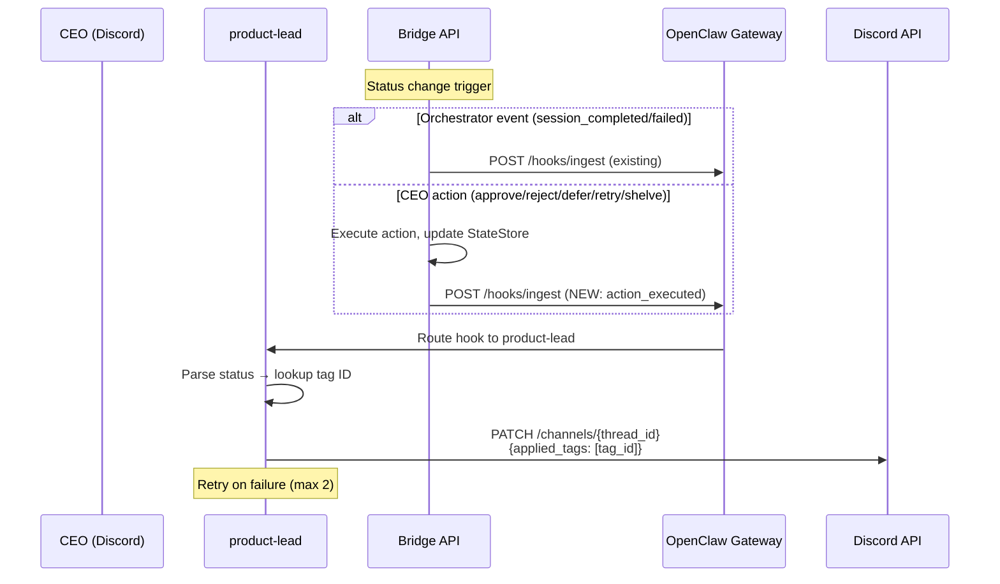

# Plan: Runtime Forum Tag 更新

**Version**: v1.3.0
**Issue**: GEO-167
**Date**: 2026-03-16
**Source**: `doc/exploration/new/GEO-167-runtime-forum-tag-update.md`, `doc/research/new/GEO-167-runtime-forum-tag-implementation.md`
**Status**: codex-approved

## Summary

Session status 变更后自动更新 Discord Forum Post 的 tag。**覆盖范围**：5 个执行态 status（`running`, `awaiting_review`, `blocked`, `completed`/`approved`, `failed`）的 tag 更新。`rejected`/`deferred`/`shelved` 为 CEO 操作中间态，保留当前 tag 不变。`retry` action 仅改 StateStore 状态（不 requeue，见 GEO-168），不更新 tag。

三个改动：
1. **Bridge** 在 action 执行成功后发 `action_executed` hook
2. **OpenClaw** `channelEdit` 工具支持 `appliedTags` 参数
3. **Agent SOUL.md** 统一逻辑：收到 hook 且 status 在映射表中 → 更新 Forum Post tag

## Architecture



## Wave 1: OpenClaw `channelEdit` 扩展

**Repo**: `~/Dev/openclaw/`
**Branch**: `feat/channel-edit-applied-tags`

### Task 1.1: Type definition

**File**: `src/discord/send.types.ts`
**Line**: 160 (after `availableTags`)

```typescript
// ADD to DiscordChannelEdit type:
/** Tag IDs to apply to a forum/media thread (Discord `applied_tags`). */
appliedTags?: string[];
```

### Task 1.2: Implementation

**File**: `src/discord/send.channels.ts`
**Insert after**: `availableTags` block (~line 81), before `rest.patch`

```typescript
if (payload.appliedTags?.length) {
  body.applied_tags = payload.appliedTags;
}
```

### Task 1.3: Agent tool dispatcher

**File**: `src/agents/tools/discord-actions-guild.ts`
**In**: `channelEdit` case (~line 329)

```typescript
// ADD after availableTags parsing:
const appliedTags = readStringArrayParam(params, "appliedTags");

// ADD to editPayload object:
appliedTags: appliedTags ?? undefined,
```

### Task 1.4: Channel plugin handler

**File**: `src/channels/plugins/actions/discord/handle-action.guild-admin.ts`
**In**: `channel-edit` case (~line 199)

```typescript
// ADD after availableTags parsing:
const appliedTags = readStringArrayParam(actionParams, "appliedTags");

// ADD to handleDiscordAction call:
appliedTags,
```

### Task 1.5: Tests（3 层覆盖）

需要覆盖完整的 `appliedTags` 透传链路，不仅是 REST body：

**Layer 1: REST body** (`send.channels.test.ts` 或新文件)
- `channelEdit` with `appliedTags: ["tag1", "tag2"]` → verify PATCH body has `applied_tags`
- `channelEdit` without `appliedTags` → verify no `applied_tags` in body

**Layer 2: Agent tool dispatcher** (`discord-actions.test.ts`)
- `channelEdit` case with `appliedTags` param → verify `editChannelDiscord` receives `appliedTags`
- 参考现有 `discord-actions.test.ts:396-468` 的 `channelEdit` dispatcher 测试模式

**Layer 3: Channel plugin handler** (`actions.test.ts`)
- `channel-edit` message action with `appliedTags` → verify forwarding to `handleDiscordAction`
- 参考现有 `actions.test.ts:420-448` 的 `channel-edit` forwarding 测试模式

**Acceptance**: OpenClaw `pnpm build && pnpm test` 通过。

---

## Wave 2: Bridge Post-Action Hook

**Repo**: `~/Dev/flywheel/`
**Branch**: `feat/v1.3.0-GEO-167-post-action-hook`

### Task 2.1: Extract `notifyAgent` to shared module

**From**: `packages/teamlead/src/bridge/event-route.ts:58-83`
**To**: `packages/teamlead/src/bridge/hook-payload.ts`

将 `notifyAgent` 函数移到 `hook-payload.ts` 并 export：

```typescript
export async function notifyAgent(
  gatewayUrl: string,
  hooksToken: string,
  body: Record<string, unknown>,
): Promise<void> {
  const controller = new AbortController();
  const timeout = setTimeout(() => controller.abort(), 3000);
  try {
    const res = await fetch(`${gatewayUrl}/hooks/ingest`, {
      method: "POST",
      headers: {
        Authorization: `Bearer ${hooksToken}`,
        "Content-Type": "application/json",
      },
      body: JSON.stringify(body),
      signal: controller.signal,
    });
    if (!res.ok) {
      console.warn(`[notify] Gateway returned ${res.status}`);
    }
  } catch (err) {
    console.warn("[notify] Failed to push to OpenClaw gateway:", (err as Error).message);
  } finally {
    clearTimeout(timeout);
  }
}
```

**event-route.ts**: 删除 local `notifyAgent`，改为 `import { notifyAgent } from "./hook-payload.js"`。

**HeartbeatService.ts**: 检查是否也有独立的 `notifyAgent` 实现。如果有（`WebhookHeartbeatNotifier`），保留原样（它有不同的 interface 约束），不做合并。

### Task 2.2: Extend HookPayload

**File**: `packages/teamlead/src/bridge/hook-payload.ts`

在 `HookPayload` interface 中 `minutes_since_activity` 之后添加：

```typescript
// action-specific fields
action?: string;
action_source_status?: string;
action_target_status?: string;
action_reason?: string;
```

### Task 2.3: Post-action hooks in `approveExecution` and `transitionSession`

**File**: `packages/teamlead/src/bridge/actions.ts`

> **设计选择**：hook 通知放在函数内部（非 router 层），这样函数级测试可以直接验证 hook 发送，无需 HTTP mock seam。

**新增 imports**：

```typescript
import type { BridgeConfig } from "./types.js";
import { buildSessionKey, buildHookBody, notifyAgent, type HookPayload } from "./hook-payload.js";
```

**新增共享 helper（模块级）**：

```typescript
/** Send post-action hook notification (best-effort, fire-and-forget). */
function sendActionHook(
  store: StateStore,
  config: BridgeConfig | undefined,
  executionId: string,
  action: string,
  sourceStatus: string,
  targetStatus: string,
  reason?: string,
): void {
  if (!config?.gatewayUrl || !config?.hooksToken) return;
  const session = store.getSession(executionId);
  if (!session) return;
  const hookPayload: HookPayload = {
    event_type: "action_executed",
    execution_id: session.execution_id,
    issue_id: session.issue_id,
    issue_identifier: session.issue_identifier,
    issue_title: session.issue_title,
    project_name: session.project_name,
    status: targetStatus,
    thread_id: session.thread_id,
    channel: config.notificationChannel,
    action,
    action_source_status: sourceStatus,
    action_target_status: targetStatus,
    action_reason: reason,
  };
  const body = buildHookBody("product-lead", hookPayload, buildSessionKey(session));
  notifyAgent(config.gatewayUrl, config.hooksToken, body).catch(() => {});
}
```

**`approveExecution` — 添加 `config` 参数 + hook 调用**：

在现有最后一个可选参数之后新增 `config?: BridgeConfig`：

```typescript
export async function approveExecution(
  store: StateStore,
  projects: ProjectEntry[],
  executionId: string,
  identifier?: string,
  execFn?: ExecFn,
  // ... existing optional params (cipherWriter, transitionOpts if present) ...
  config?: BridgeConfig,   // NEW — last param
): Promise<ActionResult> {
```

在 `result.success` 块内，两个分支（`applyTransition` FSM 路径和 legacy `store.upsertSession` 路径）都完成后、return 之前添加：

```typescript
sendActionHook(store, config, executionId, "approve", "awaiting_review", "approved");
```

**`transitionSession` — 添加 `config` 参数 + hook 调用**：

同样在最后一个可选参数之后新增 `config?: BridgeConfig`。**保持同步签名不变**（`sendActionHook` 是 fire-and-forget，不需要 async）：

```typescript
export function transitionSession(   // 保持同步，不改为 async
  store: StateStore,
  action: string,
  executionId: string,
  reason?: string,
  // ... existing optional params ...
  config?: BridgeConfig,   // NEW — last param
): ActionResult {           // 保持同步返回
```

在两个分支（`applyTransition` FSM 路径和 legacy `store.forceStatus` 路径）都完成后、return 之前添加：

```typescript
const targetStatus = actionDef.targetState;  // 复用 ACTION_DEFINITIONS 中的 canonical target
sendActionHook(store, config, executionId, action, session.status, targetStatus, reason);
```

> **注意**：
> - `targetStatus` 使用 `actionDef.targetState`（来自 `ACTION_DEFINITIONS`，已在 line 134 获取），不使用 deprecated 的本地 `ACTION_TARGET_STATUS`。
> - `transitionSession` 保持同步签名。`sendActionHook` 内部的 `notifyAgent` 返回 Promise 但以 `.catch(() => {})` fire-and-forget，不需要 await。现有所有同步调用者和测试无需修改。

### Task 2.4: Update `createActionRouter` + `plugin.ts` wiring

**`createActionRouter`**（actions.ts）— 添加 `config` 参数并传递给内部函数调用：

```typescript
// 在现有最后一个参数之后添加 config
export function createActionRouter(
  store: StateStore,
  projects: ProjectEntry[],
  // ... existing params ...
  config?: BridgeConfig,   // NEW — last param
): Router {
```

在 router handler 内，把 `config` 透传到 `approveExecution()` 和 `transitionSession()` 调用：

```typescript
// approve case:
const result = await approveExecution(store, projects, execution_id, identifier, undefined, /* existing params */, config);

// transition case:
const actionResult = await transitionSession(store, action, eid, reason, /* existing params */, config);
```

**`plugin.ts`** — 在 `createActionRouter()` 调用中传入 `config`：

```typescript
// Line 163 — dashboard actions (no auth)
app.use("/actions", createActionRouter(store, projects, /* existing params */, config));

// Line 170 — API actions (auth required)
app.use("/api/actions", tokenAuthMiddleware(config.apiToken), createActionRouter(store, projects, /* existing params */, config));
```

> **注意**：使用 `/* existing params */` 占位是因为中间参数（`cipherWriter`, `transitionOpts`）取决于当前分支状态。实现时保持现有参数不变，仅在末尾追加 `config`。

### Task 2.5: Tests

**File**: `packages/teamlead/src/__tests__/actions.test.ts` (现有测试文件)

> hook 在函数内部（非 router 层），因此所有测试都可以用函数级调用。approve 注入 `mockExec` 绕过真实 `gh pr merge`。

1. **Test: approve sends action_executed hook (函数级)**
   - 启动 mock gateway (express, `/hooks/ingest` 捕获 payload)
   - 构造 config: `{ gatewayUrl: mockUrl, hooksToken: "test", notificationChannel: "ch" }`
   - 直接调用 `approveExecution(store, projects, eid, id, mockExec, ..., config)`
   - 验证 captured payload: `event_type === "action_executed"`, `action === "approve"`, `action_target_status === "approved"`

2. **Test: reject sends action_executed hook with reason (函数级)**
   - 同上模式，直接调用 `transitionSession(store, "reject", eid, "needs rework", ..., config)`
   - 验证 `action_reason === "needs rework"`, `action_source_status === "awaiting_review"`

3. **Test: no hook when config not provided**
   - 调用 `transitionSession(...)` 不传 `config`
   - Mock gateway 未收到请求

4. **Test: hook failure does not affect action result**
   - Mock gateway 返回 500
   - `transitionSession()` 仍返回 `{ success: true }`

**Build**: `pnpm build && pnpm test` 通过。

---

## Wave 3: Agent Config 更新

**依赖**: Wave 1 (OpenClaw deployed) + Wave 2 (Bridge deployed)

### Task 3.1: SOUL.md 更新

**File**: `~/clawdbot-workspaces/product-lead/SOUL.md`

新增 section：

```markdown
## Forum Tag 更新（自动）

收到任何 hook（`session_started`, `session_completed`, `session_failed`, `action_executed`）后，
如果 payload 包含 `status` 字段且 Forum Post 已创建（`thread_id` 存在）：

1. **先检查是否需要更新 tag**：
   - 如果 `action === "retry"`，**不更新 tag**（retry 当前只改状态不 requeue，设 in-progress 会误导）
   - 如果 status 不在下表中，**不更新 tag**

2. 查 status → tag 映射（仅限以下 5 个执行态 status）：
   | status | tag ID |
   |--------|--------|
   | running | 1482926857581232310 |
   | awaiting_review | 1482927658454089912 |
   | blocked | 1482929080629329941 |
   | completed / approved | 1482929593001181214 |
   | failed | 1482930162491330783 |

3. 调用 `channelEdit`：
   - channelId = thread_id（Forum Post 的 thread ID）
   - appliedTags = [对应 tag ID]

4. 如果 channelEdit 失败，等 2 秒后重试一次。

不更新 tag 的状态：
- `rejected` / `deferred` / `shelved`：CEO 操作中间态，可能随后 retry，保留当前 tag
- `retry` action：当前仅改 StateStore 状态，不 requeue 执行（GEO-168），设 in-progress 会误导
```

删除现有的 "Runtime tag 更新待后续 issue 实现" 注释。

### Task 3.2: TOOLS.md 更新

**File**: `~/clawdbot-workspaces/product-lead/TOOLS.md`

在 Discord 工具 section 添加：

```markdown
### channelEdit — 编辑频道/帖子

用于更新 Forum Post 的 tag。

参数：
- channelId (required): Forum Post 的 thread ID
- appliedTags (optional): tag ID 数组，替换当前 tag

示例：
channelEdit channelId="1234567890" appliedTags=["1482929593001181214"]
```

删除 "Runtime tag 更新待后续 issue 实现" 注释。

---

## Wave 4: E2E 验证

### Task 4.1: Restart services

1. Rebuild + restart OpenClaw Gateway（确认 `channelEdit` + `appliedTags` 可用）
2. Rebuild + restart Bridge（确认 `action_executed` hook 发送正常）

### Task 4.2: Verify orchestrator hook → tag update

1. 发 `session_started` event（注意 `issueIdentifier`/`issueTitle` 在 `payload` 内）：
   ```bash
   curl -X POST http://localhost:9876/events \
     -H "Authorization: Bearer $TEAMLEAD_INGEST_TOKEN" \
     -H "Content-Type: application/json" \
     -d '{"event_id":"test-tag-1","execution_id":"test-exec-1","issue_id":"test-issue-1","project_name":"geoforge3d","event_type":"session_started","payload":{"issueIdentifier":"GEO-TEST","issueTitle":"Tag Test"}}'
   ```
2. 观察 Forum Post 创建，初始 tag 应为 `in-progress`
3. 发 `session_completed` event（`decision.route` 在 `payload` 内）：
   ```bash
   curl -X POST http://localhost:9876/events \
     -H "Authorization: Bearer $TEAMLEAD_INGEST_TOKEN" \
     -H "Content-Type: application/json" \
     -d '{"event_id":"test-tag-2","execution_id":"test-exec-1","issue_id":"test-issue-1","project_name":"geoforge3d","event_type":"session_completed","payload":{"issueIdentifier":"GEO-TEST","issueTitle":"Tag Test","decision":{"route":"needs_review"}}}'
   ```
4. 观察 tag 是否更新为 `awaiting-review`

### Task 4.3: Verify action hook → tag update

> **注意**：E2E 使用 `reject` 或 `defer` 验证（纯状态转移，不需要真实 PR）。`approve` 走真实 `ApproveHandler`（`gh pr merge`），不适合用 synthetic session 测试，已由 Task 2.5 单元测试覆盖。

1. 对 `awaiting_review` 状态的 session 执行 reject：
   ```bash
   curl -X POST http://localhost:9876/api/actions/reject \
     -H "Authorization: Bearer $TEAMLEAD_API_TOKEN" \
     -H "Content-Type: application/json" \
     -d '{"execution_id":"test-exec-1","reason":"E2E tag test"}'
   ```
2. 观察 agent 是否收到 `action_executed` hook（gateway 日志）
3. 观察 Forum Post tag：`rejected` 不在映射表中，tag 应保持为 `awaiting-review`（验证排除逻辑正确）
4. （可选）对真实的 `awaiting_review` session 执行 approve 验证 tag 变为 `completed`

### Task 4.4: Cleanup

删除测试 Forum Post。

---

## Risk Mitigation

| Risk | Mitigation |
|------|------------|
| Discord API 不支持 PATCH `applied_tags` | 已通过 web search + Discord 官方文档确认支持 |
| Agent 不执行 tag 更新 | SOUL.md 强制指令 + channelEdit 失败重试 |
| `notifyAgent` 提取影响 event-route | 纯提取重构，签名不变，现有测试覆盖 |
| Hook 发送阻塞 action response | Fire-and-forget（`.catch(() => {})`），不阻塞 |
| retry 设 `in-progress` tag 但无 runner | SOUL.md 显式排除 `action === "retry"` 的 tag 更新。GEO-168 修复后可移除此限制 |
| rejected/deferred/shelved 保留旧 tag | 明确设计：中间态 tag 不更新。CEO 可在 Forum 中看到最后的执行态 tag |

## Files Changed Summary

### OpenClaw repo (Wave 1)
| File | LOC | Change |
|------|-----|--------|
| `src/discord/send.types.ts` | +2 | `appliedTags` field |
| `src/discord/send.channels.ts` | +3 | `applied_tags` in PATCH body |
| `src/agents/tools/discord-actions-guild.ts` | +2 | Parse + pass `appliedTags` |
| `src/channels/plugins/actions/discord/handle-action.guild-admin.ts` | +2 | Parse + pass `appliedTags` |
| Test file (new) | +30 | `channelEdit` appliedTags test |

### Flywheel repo (Wave 2)
| File | LOC | Change |
|------|-----|--------|
| `packages/teamlead/src/bridge/hook-payload.ts` | +30 | `notifyAgent` + action fields |
| `packages/teamlead/src/bridge/event-route.ts` | -25/+1 | Remove local `notifyAgent`, import |
| `packages/teamlead/src/bridge/actions.ts` | +35 | `sendActionHook` helper + config param on functions + hook calls |
| `packages/teamlead/src/bridge/plugin.ts` | +2 | Pass config to createActionRouter |
| Test file | +60 | Post-action hook tests |

### Agent config (Wave 3)
| File | Change |
|------|--------|
| `SOUL.md` | Tag update behavior section |
| `TOOLS.md` | `channelEdit` `appliedTags` docs |

**Total**: ~160 LOC across 2 repos + agent config.
