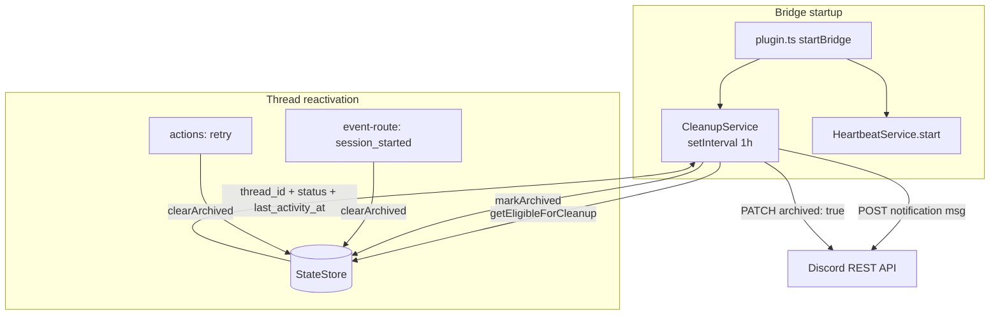

# Plan: Completed Forum Post 24h Auto-Cleanup

**Version**: v1.3.0
**Issue**: GEO-169
**Date**: 2026-03-15
**Source**: `doc/exploration/new/GEO-169-completed-post-auto-cleanup.md`, `doc/research/new/GEO-169-forum-post-cleanup.md`
**Status**: codex-approved
**Review**: 3 rounds — Round 1 (6 items), Round 2 (3 items) incorporated. Round 3 rejected (confused plan review with code review).

## Overview

Bridge 新增 `CleanupService`，每小时扫描 terminal status 的 session，对应 Discord Forum Post 在完成 24h 后自动 archive（不 lock）。复用 HeartbeatService 模式。

## Architecture



## CEO Decisions

| Decision | Choice |
|----------|--------|
| Failed 帖子 | **不清理** — 仅清理 completed/approved |
| Archive 前通知 | **是** — 发一条消息后 archive |
| 清理动作 | **Archive only**（不 lock）— retry 时 Discord 自动 unarchive |
| Discord API 调用方式 | Bridge 直接 fetch（确定性操作） |

## Status Cleanup Matrix

| Status | Cleanup | Threshold | Rationale |
|--------|---------|-----------|-----------|
| `completed` | **Yes** | 24h | CEO 需求：完成的帖子自动消失 |
| `approved` | **Yes** | 24h | 与 completed 等价（已审批通过） |
| `failed` | **No** | — | CEO 决策：保留用于复盘 |
| `blocked` | **No** | — | 需要人工介入，不应自动隐藏 |
| `rejected` | **No** | — | 需要 CEO 看到拒绝结果 |
| `deferred` | **No** | — | 暂缓但未终结，可能恢复 |
| `shelved` | **No** | — | 存档但保留可见性 |
| `running` | **No** | — | 活跃执行中 |
| `awaiting_review` | **No** | — | 等待 CEO review |

## Wave 1: Schema + Config + StateStore (Foundation)

### Task 1.1: BridgeConfig 扩展

**File**: `packages/teamlead/src/bridge/types.ts`

新增字段（3 个 optional，不破坏现有测试）:
```typescript
export interface BridgeConfig {
  // ... existing fields ...
  discordBotToken?: string;
  cleanupIntervalMs?: number;         // default 3_600_000 (1h)
  cleanupThresholdMinutes?: number;   // default 1440 (24h)
}
```

> **Round 2 fix (Issue #3)**: `cleanupIntervalMs` 和 `cleanupThresholdMinutes` 改为 optional。现有测试的 `makeConfig()` helper 不需要改动，默认值在 `loadConfig()` 和 `startBridge()` 中处理。

### Task 1.2: loadConfig 扩展

**File**: `packages/teamlead/src/config.ts`

新增环境变量读取（3 个）:
```typescript
discordBotToken: process.env.DISCORD_BOT_TOKEN,
cleanupIntervalMs: parsePositiveInt(
  process.env.TEAMLEAD_CLEANUP_INTERVAL, 3_600_000, "TEAMLEAD_CLEANUP_INTERVAL"
),
cleanupThresholdMinutes: parsePositiveInt(
  process.env.TEAMLEAD_CLEANUP_THRESHOLD, 1440, "TEAMLEAD_CLEANUP_THRESHOLD"
),
```

### Task 1.3: Schema migration — `archived_at` + `cleanup_notified_at` 列

**File**: `packages/teamlead/src/StateStore.ts`

在 `initTables()` 中加 migration:
```sql
ALTER TABLE conversation_threads ADD COLUMN archived_at TEXT;
ALTER TABLE conversation_threads ADD COLUMN cleanup_notified_at TEXT;
```

使用 try/catch 处理已存在的情况（与现有 migration pattern 一致）。

### Task 1.4: StateStore 新增方法

**File**: `packages/teamlead/src/StateStore.ts`

**`getEligibleForCleanup(thresholdMinutes: number): CleanupCandidate[]`**

```typescript
export interface CleanupCandidate {
  thread_id: string;
  issue_id: string;
  status: string;
  last_activity_at: string;
  cleanup_notified_at: string | null;
}
```

查询逻辑（Round 2 修正版 — `started_at DESC` 替代 `execution_id DESC` 作为 tie-breaker）:
```sql
SELECT ct.thread_id, ct.issue_id, latest.status, latest.last_activity_at,
       ct.cleanup_notified_at
FROM conversation_threads ct
INNER JOIN (
  SELECT issue_id, status, last_activity_at,
    ROW_NUMBER() OVER (
      PARTITION BY issue_id
      ORDER BY last_activity_at DESC, started_at DESC
    ) AS rn
  FROM sessions
) latest ON latest.issue_id = ct.issue_id AND latest.rn = 1
WHERE latest.status IN ('completed', 'approved')
  AND latest.last_activity_at < datetime('now', '-' || ? || ' minutes')
  AND ct.thread_id IS NOT NULL
  AND ct.archived_at IS NULL
ORDER BY latest.last_activity_at ASC
```

> **Round 2 fix (Issue #1)**: 将 tie-breaker 从 `execution_id DESC`（UUID，不可排序）改为 `started_at DESC`（时间戳，单调递增）。`started_at` 在 `upsertSession()` 中通过 `datetime('now')` 设置，retry 创建的新 session 一定有更晚的 `started_at`。

**`markArchived(threadId: string): void`**

```sql
UPDATE conversation_threads SET archived_at = datetime('now') WHERE thread_id = ?
```

**`markCleanupNotified(threadId: string): void`**

```sql
UPDATE conversation_threads SET cleanup_notified_at = datetime('now') WHERE thread_id = ?
```

**`clearArchived(threadId: string): void`**

```sql
UPDATE conversation_threads
SET archived_at = NULL, cleanup_notified_at = NULL
WHERE thread_id = ?
```

### Task 1.5: 测试 — StateStore cleanup methods

**File**: `packages/teamlead/src/__tests__/StateStore.test.ts`

新增 test cases:
- `getEligibleForCleanup` 返回超过阈值的 completed sessions
- `getEligibleForCleanup` 不返回 failed sessions
- `getEligibleForCleanup` 不返回未超过阈值的 sessions
- `getEligibleForCleanup` 不返回已 `archived_at` 的 threads
- `getEligibleForCleanup` 一个 issue 多条 sessions 取最新
- `getEligibleForCleanup` completed → retry → running 的 issue 不被清理
- `getEligibleForCleanup` approved → retry → running 的 issue 不被清理
- **`getEligibleForCleanup` 同秒 last_activity_at 用 started_at 区分** (Round 2)
- `markArchived` 设置 `archived_at` 且后续不再返回
- `markCleanupNotified` 设置 `cleanup_notified_at`
- `clearArchived` 重置 `archived_at` 和 `cleanup_notified_at`
- **`clearArchived` → re-complete → eligible again** (Round 2)

## Wave 2: CleanupService (Core Logic)

### Task 2.1: Discord API helper

**File**: `packages/teamlead/src/CleanupService.ts`

封装两个 Discord REST API 调用:

```typescript
export interface DiscordClient {
  sendMessage(threadId: string, content: string): Promise<void>;
  archiveThread(threadId: string): Promise<void>;
}
```

实现 `FetchDiscordClient`:
- `sendMessage`: `POST https://discord.com/api/v10/channels/{threadId}/messages`
- `archiveThread`: `PATCH https://discord.com/api/v10/channels/{threadId}` with `{ archived: true }` (**不 lock**)
- 两个调用都带 `Authorization: Bot {token}` header
- 3s timeout via `AbortController`
- Rate limit: 遇到 429 抛出 `RateLimitError`

### Task 2.2: CleanupService 类

**File**: `packages/teamlead/src/CleanupService.ts`

```typescript
export class CleanupService {
  private timer: NodeJS.Timeout | null = null;
  private archiving = new Set<string>();  // in-flight dedup

  constructor(
    private store: StateStore,
    private discord: DiscordClient,
    private thresholdMinutes: number,
    private intervalMs: number,
  ) {}

  start(): void { ... }  // setInterval
  stop(): void { ... }    // clearInterval

  async check(): Promise<void> {
    const candidates = this.store.getEligibleForCleanup(this.thresholdMinutes);
    for (const c of candidates) {
      if (this.archiving.has(c.thread_id)) continue;
      this.archiving.add(c.thread_id);
      try {
        await this.archiveOne(c);
      } catch (err) {
        if (err instanceof RateLimitError) {
          console.warn(`[CleanupService] Rate limited, stopping cycle early`);
          break;
        }
        console.warn(`[CleanupService] Failed to archive ${c.thread_id}:`, (err as Error).message);
      } finally {
        this.archiving.delete(c.thread_id);
      }
    }
  }

  private async archiveOne(candidate: CleanupCandidate): Promise<void> {
    // Step 1: Send notification (idempotent — skip if already notified)
    if (!candidate.cleanup_notified_at) {
      try {
        await this.discord.sendMessage(candidate.thread_id,
          `This post has been auto-archived (completed > 24h). Use Discord search to find it later.`
        );
        this.store.markCleanupNotified(candidate.thread_id);
      } catch (err) {
        if (!isAlreadyArchivedError(err)) throw err;
        console.log(`[CleanupService] Thread ${candidate.thread_id} already archived, skipping notification`);
      }
    }

    // Step 2: Archive (always attempt)
    await this.discord.archiveThread(candidate.thread_id);

    // Step 3: Mark in StateStore (only after archive succeeds)
    this.store.markArchived(candidate.thread_id);
    console.log(`[CleanupService] Archived thread ${candidate.thread_id} (issue: ${candidate.issue_id})`);
  }
}
```

### Task 2.3: 测试 — CleanupService

**File**: `packages/teamlead/src/__tests__/CleanupService.test.ts`

Test cases:
- `check()` 调用 `getEligibleForCleanup` 并 archive 每个 candidate
- `check()` 先 sendMessage 再 archiveThread（顺序正确）
- `check()` 成功后调用 `markArchived`
- Discord archiveThread 失败时不 markArchived
- sendMessage 失败（already archived）→ 跳过通知 → 仍然尝试 archiveThread
- `cleanup_notified_at` 已设置时跳过 sendMessage
- 空 candidates 时不调用 Discord API
- In-flight dedup 防止重复处理
- Rate limit (429) 中止 cycle，不处理后续 candidates
- start/stop 控制 timer

## Wave 3: Thread Reactivation + Integration + E2E

### Task 3.1: Thread reactivation on retry/session_started

> **Round 2 fix (Issue #2)**: 将 `clearArchived()` 接入现有 retry + session_started 路径，确保归档状态在 issue 重新激活时正确复位。

**File**: `packages/teamlead/src/bridge/event-route.ts`

在 `session_started` 处理中，当继承已有 thread 时，调用 `clearArchived()`:
```typescript
// After thread inheritance (existing thread found for issue)
const existingThread = store.getThreadByIssue(issueId);
if (existingThread?.thread_id) {
  store.clearArchived(existingThread.thread_id);
}
```

**File**: `packages/teamlead/src/bridge/actions.ts`

在 `retry` action 中，当把 session 从 terminal → running 时:
```typescript
// After status transition to running
const thread = store.getThreadByIssue(session.issue_id);
if (thread?.thread_id) {
  store.clearArchived(thread.thread_id);
}
```

### Task 3.2: 初始化 CleanupService

**File**: `packages/teamlead/src/bridge/plugin.ts`

在 `startBridge()` 中，HeartbeatService 初始化之后:

```typescript
let cleanupService: CleanupService | null = null;
if (config.discordBotToken) {
  const discord = new FetchDiscordClient(config.discordBotToken);
  cleanupService = new CleanupService(
    store, discord,
    config.cleanupThresholdMinutes ?? 1440,
    config.cleanupIntervalMs ?? 3_600_000,
  );
  cleanupService.start();
  console.log("[Bridge] CleanupService started (interval: %dms, threshold: %dm)",
    config.cleanupIntervalMs ?? 3_600_000, config.cleanupThresholdMinutes ?? 1440);
}
```

在 `close()` 中加 `cleanupService?.stop()`.

> **Round 2 fix (Issue #3)**: 使用 `??` fallback defaults，BridgeConfig 字段为 optional，不破坏现有测试。

### Task 3.3: startBridge 生命周期测试

> **Round 2 fix (Issue #3)**: 新增 bridge 级测试覆盖 CleanupService 启停。

**File**: `packages/teamlead/src/__tests__/bridge.test.ts` (追加)

Test cases:
- `startBridge` 有 `discordBotToken` 时启动 CleanupService
- `startBridge` 无 `discordBotToken` 时不启动 CleanupService
- `close()` 时 CleanupService 正确停止

### Task 3.4: Thread reactivation 测试

**File**: `packages/teamlead/src/__tests__/event-route.test.ts` (追加)

- `session_started` 继承已 archived 的 thread → `clearArchived` 被调用

**File**: `packages/teamlead/src/__tests__/actions.test.ts` (追加)

- `retry` action 重新激活已 archived 的 thread → `clearArchived` 被调用
- **Full cycle**: archived → retry → clearArchived → re-complete → eligible again (Round 2)

### Task 3.5: ENV 配置

**File**: `~/.zshrc`

新增:
```bash
export DISCORD_BOT_TOKEN="<token from ~/.openclaw/openclaw.json channels.discord.token>"
```

### Task 3.6: 集成测试

**File**: `packages/teamlead/src/__tests__/CleanupService.test.ts` (追加)

Integration test:
- 创建 StateStore → insert session (completed, 25h ago) + thread
- 创建 mock DiscordClient
- 运行 `check()`
- 验证 mock 收到正确的 threadId
- 验证 StateStore 中 `archived_at` 和 `cleanup_notified_at` 已设置

### Task 3.7: E2E 验证

手动验证:
1. 确保 `DISCORD_BOT_TOKEN` env var 已设置
2. 在 StateStore 中 insert 一条 completed + 25h ago 的测试 session + thread
3. 重启 Bridge，观察 CleanupService 日志
4. 检查 Discord Forum Channel，确认帖子被 archive（不 locked）
5. 检查帖子中有归档通知消息
6. 清理测试数据

## File Change Summary

| File | Change | LOC |
|------|--------|-----|
| `packages/teamlead/src/bridge/types.ts` | 新增 3 个 optional config 字段 | +4 |
| `packages/teamlead/src/config.ts` | 读取 3 个新 env vars | +10 |
| `packages/teamlead/src/StateStore.ts` | migration (2 cols) + 4 methods + interface | +55 |
| `packages/teamlead/src/CleanupService.ts` | **新文件** — service + discord client + error types | +130 |
| `packages/teamlead/src/bridge/plugin.ts` | 初始化 CleanupService | +15 |
| `packages/teamlead/src/bridge/event-route.ts` | clearArchived on session_started (Round 2) | +5 |
| `packages/teamlead/src/bridge/actions.ts` | clearArchived on retry (Round 2) | +5 |
| `packages/teamlead/src/__tests__/StateStore.test.ts` | cleanup method tests | +90 |
| `packages/teamlead/src/__tests__/CleanupService.test.ts` | **新文件** — unit + integration tests | +170 |
| `packages/teamlead/src/__tests__/bridge.test.ts` | CleanupService lifecycle tests (Round 2) | +30 |
| `packages/teamlead/src/__tests__/event-route.test.ts` | clearArchived test (Round 2) | +15 |
| `packages/teamlead/src/__tests__/actions.test.ts` | retry clearArchived test (Round 2) | +20 |

**Total**: ~549 LOC (including ~325 LOC tests)

## Risk Assessment

| Risk | Impact | Mitigation |
|------|--------|-----------|
| Bot Token 权限不足 | Archive 失败 | GEO-163 已配置 MANAGE_THREADS，验证即可 |
| 误 archive in-progress 帖子 | CEO 看不到活跃 issue | SQL 取最新 session（started_at tie-break），再过滤 status |
| Discord rate limit | 批量 archive 被限速 | 遇 429 中止 cycle，下次重试 |
| 已 archived 帖子发消息失败 | 通知丢失 | 跳过通知，仍然 PATCH archive |
| Retry 后 thread 被 archive | 数据不一致 | clearArchived() 接入 session_started + retry 路径 (Round 2) |
| 重复发送归档通知 | CEO 看到多条 | `cleanup_notified_at` 持久化标记防重复 |
| BridgeConfig 改动破坏测试 | 编译失败 | 新字段均为 optional (Round 2) |

## Dependencies

- `DISCORD_BOT_TOKEN` env var（from `~/.openclaw/openclaw.json`）
- Bot 需要 `MANAGE_THREADS` + `SEND_MESSAGES_IN_THREADS` 权限（GEO-163 已配置）
- 无代码级依赖其他 GEO issue

## Out of Scope

- Runtime tag 更新 (GEO-167)
- Retry requeue (GEO-168)
- Multi-channel architecture (GEO-170)
- Failed 帖子清理（CEO 决策: 不清理）
- 帖子删除（仅 archive）
- Thread locking（不 lock，保持 retry 兼容性）
