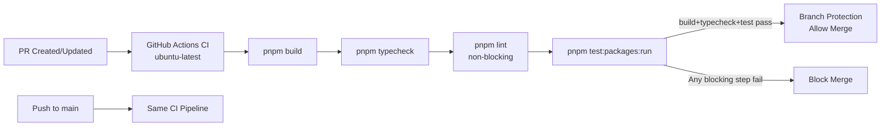

# Plan: CI/CD Pipeline — GitHub Actions + Deploy Gating

**Version**: v1.3.0
**Issue**: GEO-175
**Date**: 2026-03-16
**Source**: `doc/exploration/new/GEO-175-cicd-pipeline.md`, `doc/research/new/GEO-175-cicd-pipeline-implementation.md`
**Status**: codex-approved

## Overview

为 Flywheel 建立 CI/CD pipeline，分两个 Phase 实施：

- **Phase 1**（本 plan）：GitHub Actions CI 守门（build/typecheck/test）+ branch protection
- **Phase 2**（独立 issue）：Self-hosted runner + pm2 + emoji 部署

**Lint gate 策略**：当前 `pnpm lint` 有大量历史违规（200+），修复是独立的代码质量任务，不应阻塞 CI 上线。Phase 1 的 CI workflow 包含 lint step 但设为 `continue-on-error: true`（非阻塞），lint cleanup 完成后再改为阻塞。

## Architecture



## Assumptions

1. CI 不需要任何 secret 或外部服务（测试使用 in-memory mock，部分测试会绑定 localhost socket — GitHub-hosted Ubuntu runner 完全支持此操作）
2. Node.js 22 LTS 足够运行所有 packages（本地使用 v25 但 CI 用 LTS）
3. `pnpm test:packages:run` 是 CI 正确的 test 命令（非 watch 模式）
4. GitHub branch protection API 对 repo owner 可用
5. Phase 2（self-hosted runner + emoji deploy）将作为后续 issue
6. 当前 `pnpm lint` 有 200+ 历史违规，修复将作为独立 issue（GEO-TBD），不阻塞 CI 上线
7. CI 的 authoritative signal 是 GitHub-hosted Linux runner 的执行结果，而非本地受限环境

## Tasks

### Task 1: 创建 `.node-version` 文件 + 更新文档

**文件**: `.node-version`
**内容**: `22`

CI 使用 Node.js 22 LTS。`actions/setup-node` 自动读取此文件。

同时更新 `docs/CONTRIB.md` 第 17 行：
- 旧：`- **Node.js** >= 18 (ES2022 target)`
- 新：`- **Node.js** >= 22 (CI pins to Node 22 LTS via `.node-version`; ES2022 target)`

**说明**：`.node-version` 是 CI 的硬约束。本地开发推荐使用相同版本但不强制。

**Commit**: `chore: add .node-version and update CONTRIB.md Node.js requirement`

---

### Task 2: 创建 CI workflow

**文件**: `.github/workflows/ci.yml`

```yaml
name: CI

on:
  push:
    branches: [main]
  pull_request:
    branches: [main]

concurrency:
  group: ci-${{ github.ref }}
  cancel-in-progress: true

jobs:
  build-and-test:
    name: Build & Test
    runs-on: ubuntu-latest
    timeout-minutes: 10
    steps:
      - uses: actions/checkout@v4

      - uses: pnpm/action-setup@v4

      - uses: actions/setup-node@v4
        with:
          node-version-file: .node-version
          cache: pnpm

      - name: Install dependencies
        run: pnpm install --frozen-lockfile

      - name: Build
        run: pnpm build

      - name: Typecheck
        run: pnpm typecheck

      - name: Lint
        run: pnpm lint
        continue-on-error: true

      - name: Test
        run: pnpm test:packages:run
```

**设计决策**:
- `pnpm/action-setup@v4` 自动读 `package.json` 的 `packageManager` 字段（pnpm@10.13.1）
- `cache: pnpm` 自动缓存 pnpm store（key 基于 `pnpm-lock.yaml` hash）
- `concurrency` 取消同 branch 旧 run，节省 runner minutes
- `timeout-minutes: 10` 防止 hung job（实际预计 < 2 分钟）
- **Lint 设为 `continue-on-error: true`**：当前有 200+ 历史 lint 违规，修复是独立任务。lint step 可见但不阻塞 merge。lint cleanup 完成后移除 `continue-on-error`
- `node-version-file` 而非硬编码版本号 — single source of truth
- 单 job 顺序执行 — 简单且总时间 < 2 分钟，不值得拆分并行 job
- **Blocking gates**：build + typecheck + test 必须全部通过

**Commit**: `ci: add GitHub Actions CI workflow (build, typecheck, lint, test)`

---

### Task 3: 验证 CI 运行

通过创建 PR 验证 CI pipeline：

1. 将 Task 1-2 的改动 push 到 feature branch
2. 创建 PR → 观察 CI 是否自动触发
3. 确认 blocking steps 通过（build, typecheck, test）
4. 确认 lint step 执行但不阻塞（`continue-on-error` 生效）
5. 记录实际 CI 运行时间
6. 特别关注：socket binding 测试在 GitHub-hosted runner 上的表现。涉及 socket 的测试分布在 `edge-worker`（`HookCallbackServer`、`SlackInteractionServer`、`ExecutionEventEmitter`）和 `teamlead`（`retry-e2e`、`HeartbeatService`、bridge route 测试等）

**CI 的 authoritative signal 是 GitHub-hosted runner**。本地受限环境（如 Codex sandbox）可能因 `listen EPERM` 导致 socket 测试失败，这不是代码 bug。上述列举为 representative examples，非 exhaustive list。

**如果 CI 失败**：
- `pnpm-lock.yaml` 不一致 → 本地 `pnpm install` 后 commit lockfile
- Node.js 22 兼容问题 → 调整依赖或 `.node-version`
- socket 测试在 GitHub runner 也失败 → 隔离相关测试或调整测试配置
- 其他环境差异 → 逐个修复

**Commit**: 无（验证步骤）或 fix commits

---

### Task 4: 设置 branch protection

CI 验证通过后，配置 `main` branch 保护规则。

**方案**：仅添加 required status checks，使用窄 API 端点避免覆盖现有 protection 设置。

```bash
# Step 1: 读取现有 protection（了解当前状态）
gh api /repos/xrliAnnie/flywheel/branches/main/protection 2>/dev/null || echo "No existing protection"

# Step 2: 如果没有现有 protection，先创建基础 protection
# （仅在 Step 1 返回 404 时执行）
gh api -X PUT /repos/xrliAnnie/flywheel/branches/main/protection \
  --input - <<'EOF'
{
  "required_status_checks": {
    "strict": true,
    "contexts": ["Build & Test"]
  },
  "enforce_admins": true,
  "required_pull_request_reviews": {
    "required_approving_review_count": 0
  },
  "restrictions": null
}
EOF

# Step 3: 如果已有 protection，仅更新 required status checks（窄端点）
gh api -X PATCH /repos/xrliAnnie/flywheel/branches/main/protection/required_status_checks \
  --input - <<'EOF'
{
  "strict": true,
  "contexts": ["Build & Test"]
}
EOF
```

**配置项说明**:
- `required_status_checks.strict: true` — PR 必须与 main 同步
- `contexts: ["Build & Test"]` — 必须与 workflow 中 job `name:` 完全匹配
- `enforce_admins: true` — 管理员也不能绕过（仅在初次创建时设置）
- 使用 `PATCH /required_status_checks` 窄端点更新，不影响现有 review policy 或其他 protection 字段
- 如果 repo 当前没有任何 branch protection，则使用全量 `PUT` 初始化

**同步文档**：更新 `docs/CONTRIB.md` Pull Requests 部分（lines 155-158），使其与实际 CI 策略一致：

```markdown
### Pull Requests

- PRs target `main`
- CI checks must pass before merge: build, typecheck, test (blocking); lint (advisory, non-blocking until GEO-TBD)
- Automated code review via Codex/Gemini
- Link relevant Linear issues in the PR body
```

**验证**：
1. 尝试在 CI 未通过时 merge PR → 应被阻止
2. 确认正常 PR 流程不受影响

**Commit**: `docs: update CONTRIB.md merge policy to reflect CI gating`（文档变更；branch protection 是 GitHub API 配置）

---

## Test Requirements

| Task | 测试方式 |
|------|----------|
| Task 1 | N/A（配置文件 + 文档更新） |
| Task 2 | CI 自身就是测试 — 在 PR 上自动运行 |
| Task 3 | 手动验证：PR 创建后 CI 触发；build + typecheck + test 通过；lint 非阻塞 |
| Task 4 | 手动验证：CI 未通过的 PR 无法 merge |

## Files Changed

| File | Action | Description |
|------|--------|-------------|
| `.node-version` | add | Node.js 22 LTS |
| `docs/CONTRIB.md` | modify | 更新 Node.js 版本要求 + merge policy |
| `.github/workflows/ci.yml` | add | CI pipeline workflow |

## Risks

| 风险 | 可能性 | 影响 | 缓解 |
|------|--------|------|------|
| pnpm-lock.yaml 在 CI 中不一致 | 低 | CI 失败 | `--frozen-lockfile` 立即报错 |
| socket binding 测试在 CI 失败（edge-worker + teamlead） | 低 | 部分测试 fail | GitHub-hosted runner 支持 localhost binding；如失败则隔离 |
| Branch protection 阻止紧急 merge | 中 | 紧急修复受阻 | `enforce_admins` 可临时关闭 |
| CI 时间超过预期 | 低 | 开发体验下降 | timeout-minutes: 10 保底 |

## Out of Scope

- **Lint cleanup**（GEO-TBD）：200+ lint 违规修复，完成后移除 `continue-on-error`
- Phase 2：Self-hosted runner + emoji deploy
- pm2 进程管理器
- Docker 容器化
- E2E 测试
- Code coverage 报告

## Commit Plan

| Order | Message |
|-------|---------|
| 1 | `chore: add .node-version and update CONTRIB.md Node.js requirement` |
| 2 | `ci: add GitHub Actions CI workflow (build, typecheck, lint, test)` |
| 3 | `docs: update CONTRIB.md merge policy to reflect CI gating` |
| 4 | (如需修复) `fix: resolve CI environment issues` |

## Codex Review History

### Round 1 (4 issues → all incorporated)
1. Branch protection 关闭 review → 改为保留 review 机制
2. Lint 基线不绿（17 errors） → 加 preflight task
3. 测试非纯内存 → 收紧表述
4. `.node-version` 与 CONTRIB.md → 同步更新

### Round 2 (3 issues → all incorporated)
1. Branch protection 仍非真正保留 → 改为 read-then-write + 同步更新 CONTRIB.md merge policy
2. Lint 基线实为 200+ errors → lint step 改为 `continue-on-error: true`，lint cleanup 拆为独立 issue
3. Socket test 验证路径不清晰 → 明确 authoritative signal 是 GitHub-hosted runner，补充受限环境说明

### Round 3 (3 issues → all incorporated)
1. Branch protection 仍用全量 PUT → 改为窄端点 `PATCH /required_status_checks`（仅更新 status checks），初次创建时才用全量 PUT
2. CONTRIB.md 未同步 lint non-blocking → 更新 Pull Requests 部分，区分 blocking checks（build/typecheck/test）和 advisory checks（lint）
3. Socket test 只列 edge-worker → 扩展覆盖 teamlead 的 socket 测试，标注为 representative examples
