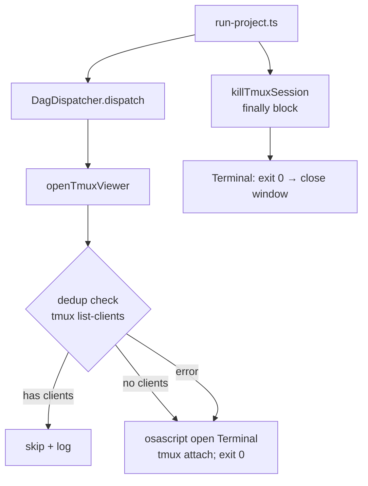

# Plan: Terminal Auto-Close Fix

**Version**: v1.3.0
**Issue**: GEO-179
**Date**: 2026-03-16
**Source**: `doc/exploration/new/GEO-179-terminal-auto-close.md`, `doc/research/new/GEO-179-terminal-auto-close.md`
**Status**: codex-approved

## Summary

修复 `DagDispatcher.openTmuxViewer()` 的两个 bug：Terminal 窗口不自动关闭 + 无去重检查。同时修复 `e2e-tmux-runner.ts` 和 `run-issue.ts` 的一致性问题。

## Architecture



## Tasks

### Task 1: Fix `DagDispatcher.openTmuxViewer()` — dedup + exit 0

**File**: `packages/edge-worker/src/DagDispatcher.ts`

**Changes**:

1. Add `execFileSync` to import (line 3):
```typescript
import { execFile, execFileSync } from "node:child_process";
```

2. Add dedup check before osascript call in `openTmuxViewer()`:
```typescript
private openTmuxViewer(): void {
    const s = this.tmuxSessionName;
    // Dedup: skip if a client is already attached
    try {
        const clients = execFileSync("tmux", ["list-clients", "-t", `=${s}`], {
            encoding: "utf-8",
            stdio: ["pipe", "pipe", "pipe"],
        });
        if (clients.trim().length > 0) {
            console.log(`[DagDispatcher] Viewer already attached to ${s}, skipping`);
            return;
        }
    } catch (err) {
        const msg = err instanceof Error ? err.message : String(err);
        if (!msg.includes("can't find session")) {
            console.warn(`[DagDispatcher] tmux list-clients failed for ${s}: ${msg}`);
        }
        // Session may not exist yet, or tmux env issue — proceed to open (best-effort)
    }

    execFile("osascript", [
        "-e",
        `tell application "Terminal" to do script "tmux attach -t '=${s}' 2>/dev/null || (echo 'Waiting for tmux session ${s}...' && sleep 2 && tmux attach -t '=${s}'); exit 0"`,
    ], (err) => {
        if (err) {
            console.warn(
                `[DagDispatcher] Could not auto-open tmux viewer: ${err.message}`,
            );
        }
    });
}
```

**Key changes**:
- `; exit 0` appended to shell command (forces clean exit → Terminal closes)
- `execFileSync` dedup check with `tmux list-clients` before osascript
- Narrowed catch: "can't find session" is expected (silent), other errors get `console.warn` with session name for diagnosis
- Still best-effort: all error paths fall through to open attempt

**Commit**: `fix: add ; exit 0 and dedup check to DagDispatcher.openTmuxViewer (GEO-179)`

### Task 2: Fix `e2e-tmux-runner.ts` — add `; exit 0`

**File**: `scripts/e2e-tmux-runner.ts`

**Change** (line 193): Append `; exit 0` to the tmux attach command:

```typescript
// Before:
`tell application "Terminal" to do script "echo 'Waiting for Claude to start...' && while ! tmux has-session -t flywheel-e2e 2>/dev/null; do sleep 1; done && tmux attach -t flywheel-e2e"`

// After:
`tell application "Terminal" to do script "echo 'Waiting for Claude to start...' && while ! tmux has-session -t flywheel-e2e 2>/dev/null; do sleep 1; done && tmux attach -t flywheel-e2e; exit 0"`
```

**Commit**: `fix: add ; exit 0 to e2e-tmux-runner viewer (GEO-179)`

### Task 3: Fix `run-issue.ts` — `; exit` → `; exit 0`

**File**: `scripts/run-issue.ts`

**Change** (line 262): Change `; exit` to `; exit 0`:

```typescript
// Before:
`  do script "echo 'Waiting for Flywheel session ${tmuxSessionName}...' && while ! tmux has-session -t '=${tmuxSessionName}' 2>/dev/null; do sleep 1; done && tmux attach -t '=${tmuxSessionName}'; exit"`,

// After:
`  do script "echo 'Waiting for Flywheel session ${tmuxSessionName}...' && while ! tmux has-session -t '=${tmuxSessionName}' 2>/dev/null; do sleep 1; done && tmux attach -t '=${tmuxSessionName}'; exit 0"`,
```

**Commit**: `fix: use exit 0 in run-issue viewer for consistent Terminal close (GEO-179)`

### Task 4: Update DagDispatcher tests — mock + dedup tests

**Files**:
- `packages/edge-worker/src/__tests__/DagDispatcher.test.ts`
- `packages/edge-worker/src/__tests__/parallel-dispatch-e2e.test.ts`

**Changes**:

1. Update `DagDispatcher.test.ts` `vi.mock` to also mock `execFileSync`, and add `beforeEach` for mock cleanup:
```typescript
vi.mock("node:child_process", async (importOriginal) => {
    const actual = await importOriginal<typeof import("node:child_process")>();
    return {
        ...actual,
        execFile: vi.fn(),
        execFileSync: vi.fn(() => ""),  // default: no clients attached
    };
});

// Inside describe block:
beforeEach(() => {
    vi.clearAllMocks();
});
```

2. Update `parallel-dispatch-e2e.test.ts` mock to also include `execFileSync`:
```typescript
vi.mock("node:child_process", async (importOriginal) => {
    const actual = await importOriginal<typeof import("node:child_process")>();
    return {
        ...actual,
        execFile: vi.fn(),
        execFileSync: vi.fn(() => ""),  // prevent real tmux calls
    };
});
```

3. Add 3 new tests in `DagDispatcher.test.ts`:

```typescript
it("openTmuxViewer skips when client already attached", async () => {
    const { execFileSync: mockExecFileSync, execFile: mockExecFile } =
        await import("node:child_process");
    (mockExecFileSync as any).mockReturnValueOnce("/dev/ttys001: ...");

    const nodes: DagNode[] = [{ id: "A", blockedBy: [] }];
    const resolver = new DagResolver(nodes);
    const blueprint = makeMockBlueprint(new Map([["A", { success: true }]]));
    const dispatcher = new DagDispatcher(resolver, blueprint, "/project", defaultContext);

    await dispatcher.dispatch();

    // execFile (osascript) should NOT have been called
    expect(mockExecFile).not.toHaveBeenCalled();
});

it("openTmuxViewer opens when no clients attached", async () => {
    const { execFile: mockExecFile } = await import("node:child_process");

    const nodes: DagNode[] = [{ id: "A", blockedBy: [] }];
    const resolver = new DagResolver(nodes);
    const blueprint = makeMockBlueprint(new Map([["A", { success: true }]]));
    const dispatcher = new DagDispatcher(resolver, blueprint, "/project", defaultContext);

    await dispatcher.dispatch();

    // execFile (osascript) SHOULD have been called (default mock returns "")
    expect(mockExecFile).toHaveBeenCalled();
    const call = (mockExecFile as any).mock.calls[0];
    expect(call[0]).toBe("osascript");
    expect(call[1][1]).toContain("; exit 0");
});

it("openTmuxViewer opens when list-clients throws (session not yet created)", async () => {
    const { execFileSync: mockExecFileSync, execFile: mockExecFile } =
        await import("node:child_process");
    (mockExecFileSync as any).mockImplementationOnce(() => {
        throw new Error("can't find session");
    });

    const nodes: DagNode[] = [{ id: "A", blockedBy: [] }];
    const resolver = new DagResolver(nodes);
    const blueprint = makeMockBlueprint(new Map([["A", { success: true }]]));
    const dispatcher = new DagDispatcher(resolver, blueprint, "/project", defaultContext);

    await dispatcher.dispatch();

    // Should still open viewer despite list-clients error
    expect(mockExecFile).toHaveBeenCalled();
});
```

**Note**: `e2e-core-loop.test.ts` does NOT mock `node:child_process` (it's an E2E test with real Blueprint). After our change, `openTmuxViewer()` will hit the real `execFileSync("tmux", ...)`, which throws (no session), hits the catch → falls through to `execFile("osascript", ...)` (fire-and-forget). Behavior is identical to current: osascript fires and silently fails in test env. No change needed.

**Commit**: `test: add DagDispatcher viewer dedup tests + mock cleanup (GEO-179)`

## Implementation Order

Tasks 1-3 可以在一个 commit 中合并（都是 `; exit 0` 修复），Task 4 单独 commit（tests）。或者按 TDD 先写 Task 4 再写 Task 1。

推荐顺序：
1. Task 4 (tests) — RED
2. Task 1 (DagDispatcher fix) — GREEN
3. Task 2 + 3 (e2e + run-issue) — 一致性修复
4. Build + test verification

## Manual Verification

实现完成后需要手动验证（unit test 无法测试 Terminal.app 行为）。

### Part A: Auto-close 验证

1. `pnpm build`
2. 运行 `npx tsx scripts/run-project.ts`（或 `run-issue.ts`）
3. 确认 Terminal viewer 窗口打开
4. 等 session 结束或手动 `tmux kill-session -t =flywheel-geoforge3d`
5. 确认 Terminal 窗口自动关闭（而非显示 "can't find session" 并保持打开）

### Part B: Dedup 验证

1. 手动创建一个 tmux session: `tmux new-session -d -s flywheel-geoforge3d`
2. 在一个 Terminal 窗口中 attach: `tmux attach -t flywheel-geoforge3d`
3. 运行 `npx tsx scripts/run-project.ts`（或触发 `DagDispatcher.dispatch()`）
4. 确认 **不会** 打开第二个 Terminal viewer 窗口
5. 确认日志中出现 `Viewer already attached to flywheel-geoforge3d, skipping`

**Note**: `run-bridge.ts` 不走 `DagDispatcher` viewer 逻辑，不在此验证范围内。

## Risk

| Risk | Mitigation |
|------|-----------|
| `execFileSync` 阻塞 | `tmux list-clients` < 10ms，只调用一次 |
| `exit 0` 掩盖错误 | 仅影响 Terminal viewer shell，不影响 Blueprint 执行 |
| catch 吞掉真实错误 | 已缩窄：只对 "can't find session" 静默，其他错误 console.warn |
| 测试 mock 干扰 | `vi.mock` 增量修改 + `vi.clearAllMocks()`，不影响现有测试 |
| `parallel-dispatch-e2e.test.ts` mock 遗漏 | 同步更新 mock，加入 `execFileSync` |
