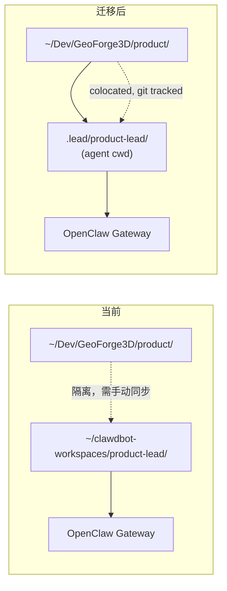
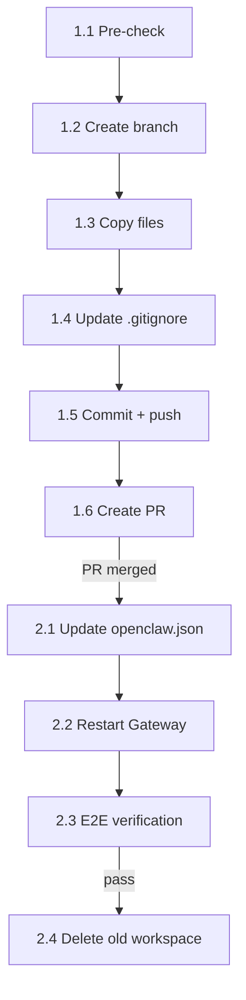

# Plan: Lead Workspace 统一 — OpenClaw Workspace 迁入产品 Repo

**Version**: v1.5.0
**Issue**: GEO-196
**Date**: 2026-03-20
**Source**: `doc/exploration/new/GEO-196-lead-workspace-unification.md`, `doc/research/new/GEO-196-lead-workspace-unification.md`
**Status**: codex-approved

---

## 1. Overview

将 product-lead agent 的 OpenClaw workspace 从独立目录 (`~/clawdbot-workspaces/product-lead/`) 迁移到产品 repo 内部 (`~/Dev/GeoForge3D/product/.lead/product-lead/`)。

**核心收益**:
1. **Config 文件进入 git** — SOUL.md, TOOLS.md 等变更可追溯，支持 PR review
2. **Workspace 与产品 repo colocate** — agent 可在同一 repo 内导航，不再需要手动同步
3. **消除手动同步** — flywheel repo 改完 SOUL.md/TOOLS.md 后不用手动复制到 workspace

**注意**: Agent 的 cwd 是 workspace 目录本身（`product/.lead/product-lead/`），不是 `product/`。Agent 可以通过相对路径 `../../` 访问产品代码和文档，但不会以 `product/` 为工作目录启动。此次迁移**不改变 Lead 的能力边界**——SOUL.md 中 "不能直接访问代码库" 的约束保持不变。



### 特殊说明: 跨 Repo 实施

| 操作 | 目标位置 |
|------|---------|
| Planning docs (exploration, research, plan) | Flywheel repo (`~/Dev/flywheel/doc/`) |
| Workspace 文件迁移 + .gitignore | GeoForge3D repo (`~/Dev/GeoForge3D/`) |
| OpenClaw config 修改 | `~/.openclaw/openclaw.json` (不在任何 repo) |
| Gateway 重启 | 本机 launchd 服务 |

GeoForge3D repo 的变更通过 branch + PR 流程。Config 修改和 Gateway 重启是本机操作。

## 2. Scope

### In Scope

| # | Task | 优先级 |
|---|------|--------|
| 1 | 创建 `.lead/product-lead/` 目录 + 复制 7 个 workspace 文件 | P0 |
| 2 | 更新 GeoForge3D `.gitignore` — 排除 runtime 数据 | P0 |
| 3 | 修改 `~/.openclaw/openclaw.json` workspace 路径 | P0 |
| 4 | 重启 OpenClaw Gateway | P0 |
| 5 | 验证: openclaw doctor + Discord E2E 测试 | P0 |
| 6 | 清理旧 workspace | P1 |

### Out of Scope

- Flywheel 代码改动（不需要，通过 agent ID 通信）
- 其他 agent (clawd) 的 workspace 迁移
- 归档文档中旧路径的更新（历史记录保持原样）
- GEO-198 活跃文档中的旧路径更新（实施 GEO-198 时处理）

## 3. Architecture

### 3.1 目标目录结构

```
~/Dev/GeoForge3D/product/
├── doc/                           ← 产品文档
├── GeoForge3D-Backend/
├── GeoForge3D-Frontend/
└── .lead/                         ← OpenClaw workspace 新位置
    └── product-lead/
        ├── SOUL.md                ← git tracked (Lead persona v1.5.0)
        ├── TOOLS.md               ← git tracked (Bridge API 手册)
        ├── AGENTS.md              ← git tracked (startup 指令)
        ├── IDENTITY.md            ← git tracked (agent 身份)
        ├── USER.md                ← git tracked (用户信息)
        ├── MEMORY.md              ← git tracked (持久化记忆)
        ├── HEARTBEAT.md           ← git tracked (定时检查)
        └── .openclaw/             ← .gitignore (runtime state)
```

### 3.2 Git Tracking 策略

| 类别 | Git Tracked | 原因 |
|------|------------|------|
| Agent config (SOUL, TOOLS, AGENTS) | ✅ | 行为规范，需要 PR review 和版本追溯 |
| Agent identity (IDENTITY, USER) | ✅ | 产品"大脑"的一部分，虽然目前是空模板 |
| Agent memory (MEMORY) | ✅ | 项目 context，手动 commit（不自动） |
| Heartbeat rules (HEARTBEAT) | ✅ | 运维配置，需要版本控制 |
| Runtime state (.openclaw/) | ❌ | 自动重建，不含有价值的持久数据 |
| Backup files (*.bak.*) | ❌ | 临时备份 |
| Sessions (sessions/) | ❌ | 防御性排除（实际存在 ~/.openclaw/ 下） |

### 3.3 .gitignore 规则

追加到 `~/Dev/GeoForge3D/.gitignore`：

```gitignore
# OpenClaw agent runtime data
product/.lead/*/.openclaw/
product/.lead/*/sessions/
product/.lead/*/*.bak.*
```

使用通配符 `*` 以支持未来多 Lead（如 `.lead/ops-lead/`）。

### 3.4 OpenClaw Config 变更

```diff
 {
   "agents": {
     "list": [
       { "id": "clawd", ... },
       {
         "id": "product-lead",
-        "workspace": "/Users/xiaorongli/clawdbot-workspaces/product-lead",
+        "workspace": "/Users/xiaorongli/Dev/GeoForge3D/product/.lead/product-lead",
         "model": "anthropic/claude-sonnet-4-6"
       }
     ]
   }
 }
```

## 4. Implementation Tasks

### Phase 1: 迁移（GeoForge3D repo）

#### Task 1.1: 迁移前检查
**Type**: Manual verification

```bash
# 确认源文件完整
ls ~/clawdbot-workspaces/product-lead/{SOUL,TOOLS,AGENTS,IDENTITY,USER,MEMORY,HEARTBEAT}.md

# 确认 Gateway 当前健康（允许预存在的无关警告）
openclaw doctor
```

**验证**: 7 个 .md 文件全部存在。`openclaw doctor` 无 product-lead 相关错误（无关警告可忽略）。

#### Task 1.2: 创建 worktree + branch（GeoForge3D repo）
**Type**: Git operation

GeoForge3D main 可能有未提交改动，**不要在主工作树上操作**。使用 worktree 隔离：

```bash
cd ~/Dev/GeoForge3D
git fetch origin main

# 从 origin/main 创建独立 worktree
git worktree add ../GeoForge3D-geo196 -b feat/GEO-196-lead-workspace origin/main
cd ../GeoForge3D-geo196
```

后续 Phase 1 操作均在 worktree (`~/Dev/GeoForge3D-geo196/`) 中进行。

#### Task 1.3: 创建目录 + 复制文件
**Type**: File operation

```bash
# 在 worktree 中操作
cd ~/Dev/GeoForge3D-geo196
mkdir -p product/.lead/product-lead

cp ~/clawdbot-workspaces/product-lead/{SOUL,TOOLS,AGENTS,IDENTITY,USER,MEMORY,HEARTBEAT}.md \
   product/.lead/product-lead/
```

**不复制**: `.openclaw/`（runtime, 自动重建）、`*.bak.*`（旧版备份）

**验证**: `diff` 确认文件内容一致。

```bash
for f in SOUL TOOLS AGENTS IDENTITY USER MEMORY HEARTBEAT; do
  diff ~/clawdbot-workspaces/product-lead/${f}.md \
       ~/Dev/GeoForge3D-geo196/product/.lead/product-lead/${f}.md
done
```

#### Task 1.4: 更新 .gitignore
**File**: `~/Dev/GeoForge3D-geo196/.gitignore` (APPEND)

在 `# Agent/tool artifacts` section 后追加：

```gitignore
# OpenClaw agent runtime data
product/.lead/*/.openclaw/
product/.lead/*/sessions/
product/.lead/*/*.bak.*
```

#### Task 1.5: Git commit + push
**Type**: Git operation

```bash
cd ~/Dev/GeoForge3D-geo196
git add product/.lead/product-lead/
git add .gitignore
git commit -m "feat: migrate product-lead workspace into product repo (GEO-196)

Move OpenClaw product-lead agent workspace from isolated directory to
product/.lead/product-lead/ for git tracking and repo colocation.

Agent config files (SOUL.md, TOOLS.md, etc.) are now version-controlled.
Runtime data (.openclaw/) is excluded via .gitignore.
This does not change the agent's capability boundary."

git push -u origin feat/GEO-196-lead-workspace
```

#### Task 1.6: 创建 PR
**Type**: GitHub operation

```bash
gh pr create --title "feat: migrate product-lead workspace into product repo (GEO-196)" \
  --body "$(cat <<'EOF'
## Summary

- Move product-lead OpenClaw workspace from `~/clawdbot-workspaces/product-lead/` to `product/.lead/product-lead/`
- Agent config files (SOUL.md, TOOLS.md, AGENTS.md, etc.) are now git tracked
- Runtime data (.openclaw/, sessions/, *.bak.*) excluded via .gitignore

## Why

Workspace colocated with product repo — agent config files (SOUL.md, TOOLS.md) are now git tracked with PR review and version history. Eliminates manual sync between flywheel repo and OpenClaw workspace.

## Linear Issue

GEO-196: Lead Workspace 统一：OpenClaw workspace 迁入产品 repo
https://linear.app/geoforge3d/issue/GEO-196

## Test Plan

- [ ] `diff -r` confirms all 7 workspace files copied correctly
- [ ] `.gitignore` excludes runtime data
- [ ] No untracked runtime files in `git status`

Note: OpenClaw config change + Gateway restart happen after PR merge (local-only operations).
EOF
)"
```

### Phase 2: Config + Gateway（本机操作，PR merge 后）

#### Task 2.1: 修改 OpenClaw config
**File**: `~/.openclaw/openclaw.json` (MODIFY)

```bash
python3 -c "
import json, os
config_path = os.path.expanduser('~/.openclaw/openclaw.json')
with open(config_path) as f:
    config = json.load(f)
for agent in config['agents']['list']:
    if agent['id'] == 'product-lead':
        agent['workspace'] = os.path.expanduser('~/Dev/GeoForge3D/product/.lead/product-lead')
with open(config_path, 'w') as f:
    json.dump(config, f, indent=2)
    f.write('\n')
print('Updated product-lead workspace path')
"
```

**验证**: 读回 config 确认路径正确。

#### Task 2.2: 重启 Gateway
**Type**: Service operation

**注意**: 这是整个 OpenClaw Gateway 的重启，影响所有经同一 Gateway 承载的 agent 和 channel（clawd、product-lead、Discord、Telegram）。建议在低流量时段操作。

```bash
launchctl kickstart -k gui/$(id -u)/ai.openclaw.gateway
sleep 3
```

#### Task 2.3: 三层验证
**Type**: Manual verification

**Layer 1: Config 验证**（确认配置文件正确）
```bash
# 读回 config 确认路径已更新
python3 -c "
import json, os
with open(os.path.expanduser('~/.openclaw/openclaw.json')) as f:
    config = json.load(f)
for a in config['agents']['list']:
    if a['id'] == 'product-lead':
        expected = os.path.expanduser('~/Dev/GeoForge3D/product/.lead/product-lead')
        actual = a['workspace']
        assert actual == expected, f'Mismatch: {actual} != {expected}'
        print(f'OK: product-lead workspace = {actual}')
"
```

**Layer 2: Gateway runtime 验证**（确认运行中的 Gateway 已切到新 workspace）
```bash
# 通过 Gateway RPC 读取 product-lead 的 runtime workspace 路径
# --json 确保纯 JSON 输出（不含 CLI 标题行）
openclaw gateway call agents.files.list \
  --json \
  --params '{"agentId":"product-lead"}' | \
  python3 -c "
import json, sys, os
data = json.load(sys.stdin)
expected = os.path.expanduser('~/Dev/GeoForge3D/product/.lead/product-lead')
actual = data.get('workspace', '')
assert actual == expected, f'Runtime workspace mismatch: {actual} != {expected}'
print(f'OK: runtime workspace = {actual}')
print(f'Files: {len(data.get(\"files\", []))} workspace files loaded')
"

# openclaw doctor 作为辅助信息（无新增 GEO-196 相关错误即可）
openclaw doctor 2>&1 | grep -E "product-lead|error|Error"
```

**Layer 3: Discord E2E 验证**（最终验收）
- 在 Discord Product Chat 发一条测试消息 — 确认 Lead 正常响应
- 确认 Flywheel Bridge 健康: `curl -s http://localhost:9876/health`

#### Task 2.4: 清理旧 workspace
**Type**: File operation（验证通过后）

```bash
rm -rf ~/clawdbot-workspaces/product-lead
```

如果 `~/clawdbot-workspaces/` 下只剩 `clawd/`，保持目录结构不变（clawd 仍在使用）。

## 5. File Change Summary

| File | Repo | Action | Lines |
|------|------|--------|-------|
| `product/.lead/product-lead/SOUL.md` | GeoForge3D | ADD | ~118 |
| `product/.lead/product-lead/TOOLS.md` | GeoForge3D | ADD | ~68 |
| `product/.lead/product-lead/AGENTS.md` | GeoForge3D | ADD | ~27 |
| `product/.lead/product-lead/IDENTITY.md` | GeoForge3D | ADD | ~20 |
| `product/.lead/product-lead/USER.md` | GeoForge3D | ADD | ~15 |
| `product/.lead/product-lead/MEMORY.md` | GeoForge3D | ADD | ~12 |
| `product/.lead/product-lead/HEARTBEAT.md` | GeoForge3D | ADD | ~5 |
| `.gitignore` | GeoForge3D | MODIFY | +4 |
| `~/.openclaw/openclaw.json` | local config | MODIFY | 1 line |

**Total**: 9 items changed (7 new workspace files + 1 .gitignore modification + 1 local config change).
**No code changes** in Flywheel or GeoForge3D application code.

## 6. Dependency Graph



Phase 1 (Tasks 1.1–1.6) 在 GeoForge3D worktree 中独立完成并提交 PR。
Phase 2 (Tasks 2.1–2.4) 在 PR merge 后执行——这些是本机操作，不涉及代码。
PR merge 后清理 worktree。

## 7. Rollback Plan

如果迁移后 agent 异常：

```bash
# 1. 恢复 config（旧路径还没删的情况下）
python3 -c "
import json, os
config_path = os.path.expanduser('~/.openclaw/openclaw.json')
with open(config_path) as f:
    config = json.load(f)
for agent in config['agents']['list']:
    if agent['id'] == 'product-lead':
        agent['workspace'] = os.path.expanduser('~/clawdbot-workspaces/product-lead')
with open(config_path, 'w') as f:
    json.dump(config, f, indent=2)
    f.write('\n')
"

# 2. 重启 Gateway
launchctl kickstart -k gui/$(id -u)/ai.openclaw.gateway

# 3. 验证
openclaw doctor
```

GeoForge3D repo 中的 `.lead/` 目录不影响 agent——只有 `openclaw.json` 中的路径决定 workspace 位置。

## 8. Risk Assessment

| 风险 | 严重度 | 概率 | 缓解措施 |
|------|--------|------|---------|
| Gateway 重启影响所有 agent/channel | **Medium** | Medium | 影响 clawd + product-lead + Discord + Telegram。KeepAlive 自动恢复（2-3 秒）。在低流量时段操作。 |
| 旧 workspace 删除后发现遗漏文件 | Low | Low | 迁移前 diff 确认；先验证后删除 |
| Agent 在新路径下行为异常 | Medium | Very Low | Rollback plan 可在 30 秒内恢复 |
| MEMORY.md git tracked 产生频繁 commit | Low | Low | Agent 不自动 commit，需手动 add |

## 9. Estimation

| Phase | 工作量 | 说明 |
|-------|--------|------|
| Phase 1 (Git 操作) | ~15 min | 创建目录、复制文件、commit、PR |
| Phase 2 (Config + 验证) | ~10 min | 改 config、restart、E2E 验证 |
| Phase 2 (清理) | ~2 min | 删除旧目录 |
| **Total** | **~30 min** | |

## 10. Post-Implementation

- [ ] 归档 GEO-196 docs (exploration, research, plan)
- [ ] Linear GEO-196 标记 Done
- [ ] 清理 worktree: `cd ~/Dev/GeoForge3D && git worktree remove ../GeoForge3D-geo196`
