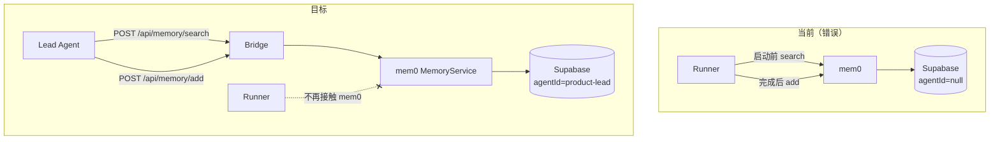
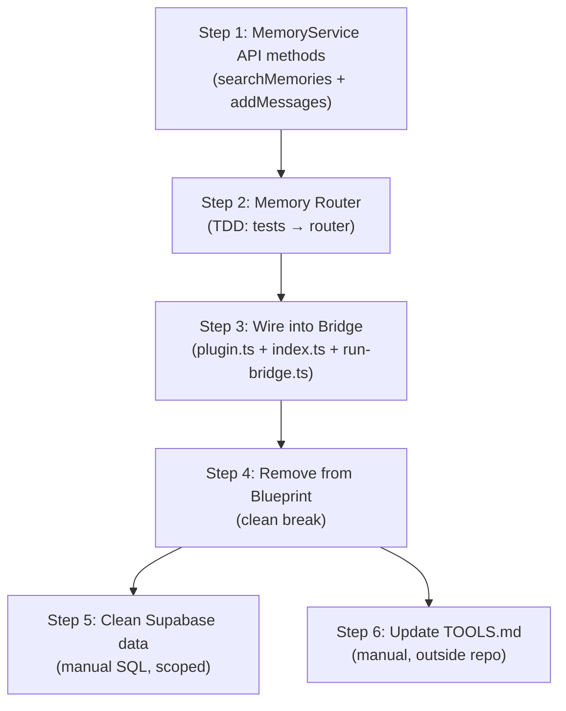

# Plan: Fix mem0 Memory Layer — Move from Runner to Lead Agents

**Version**: v1.5.0
**Issue**: GEO-198
**Date**: 2026-03-20
**Source**: `doc/exploration/new/GEO-198-fix-mem0-memory-layer.md`, `doc/research/new/GEO-198-fix-mem0-memory-layer.md`
**Status**: codex-approved
**Review**: Round 1 (6) + Round 2 (2) + Round 3 (1) + Round 4 (1) from Codex incorporated

---

## Overview

将 mem0 MemoryService 从 Blueprint (runner) 层迁移到 Bridge 层，暴露 REST API 给 Lead agent 调用。Blueprint 完全移除 memory 集成（clean break）。清理 Supabase 旧数据。

### 架构变化



---

## API Contract (Fixed — Round 1 Item 4)

统一的 HTTP 状态码契约，所有 `/api/memory/*` 端点遵守：

| Status | Meaning |
|--------|---------|
| `200` | 成功。`/search` 返回空 `[]` 也是 200（合法空结果）。 |
| `400` | 请求参数缺失或非法（缺 required field、非法 role、空 content 等）。 |
| `401` | 未提供或无效的 Bearer token（`/api` 通用 auth 中间件，先于 route 生效）。 |
| `404` | Route 不存在。已鉴权但 memoryService 未启用时，catch-all 404 生效。 |
| `504` | mem0 调用超时（30s）。 |
| `502` | mem0/Supabase 调用失败（非超时的运行时错误）。 |

**语义说明** (Round 2 Item 2): 未带 token → `401`（通用 `/api` auth 先拦截）；带 token 但 memoryService 未启用 → `404`（route 未挂载）。不使用 503。

---

## Implementation Steps

### Step 1: Add API-oriented methods to MemoryService (TDD)

**为什么先做这步**: Bridge router 和测试都依赖这些方法。

#### 1a. `searchMemories()` — 原始查询方法 (Round 1 Item 3)

在 `MemoryService` 新增不做 prompt 格式化的底层搜索方法：

```typescript
/**
 * Search memories and return raw strings (no prompt formatting).
 * Used by Bridge API. searchAndFormat() will reuse this internally.
 */
async searchMemories(params: {
  query: string;
  projectName: string;
  agentId?: string;   // optional at service layer; Bridge API enforces required
  limit?: number;
}): Promise<string[]> {
  const results = await this.memory.search(params.query, {
    userId: params.projectName,
    agentId: params.agentId,
    limit: params.limit ?? this.searchLimit,
    filters: { app_id: "flywheel" },
  });
  // STRICT: malformed response → throw (not silent degradation)
  if (!results || !Array.isArray(results.results)) {
    throw new Error(`[MemoryService] Unexpected search response shape: ${JSON.stringify(results)?.slice(0, 200)}`);
  }
  // ... filter + extract memory strings
  return memories.map(m => m.memory);
}
```

然后重构 `searchAndFormat()` 复用 `searchMemories()`，**但包裹 try/catch 保留 runner-era graceful degradation**：

```typescript
// searchAndFormat() catches and degrades to null — runner-facing helper.
// searchMemories() strict throws — API route catches → 502.
async searchAndFormat(params): Promise<string | null> {
  try {
    const memories = await this.searchMemories({
      query: params.query,
      projectName: params.projectName,
      agentId: params.agentId,
    });
    if (!memories.length) return null;
    return ["<project_memory>", "## Learned from previous sessions",
      ...memories.map(m => `- ${m}`), "</project_memory>"].join("\n");
  } catch (err) {
    console.warn(
      `[MemoryService] searchAndFormat degraded: ${err instanceof Error ? err.message : String(err)}`
    );
    return null;
  }
}
```

#### 1b. `addMessages()` — 通用写入方法 (Round 1 Item 2)

```typescript
/**
 * Add messages to memory with mandatory app_id tagging.
 * Used by Bridge API. Caller metadata is merged, app_id is enforced.
 */
async addMessages(params: {
  messages: Array<{ role: "user" | "assistant"; content: string }>;
  projectName: string;
  agentId: string;
  metadata?: Record<string, unknown>;
}): Promise<{ added: number; updated: number }> {
  const result = await this.memory.add(params.messages, {
    userId: params.projectName,
    agentId: params.agentId,
    metadata: {
      ...params.metadata,
      app_id: "flywheel",  // ENFORCED — search filters by this
    },
  });

  // STRICT: malformed response → throw (not silent degradation)
  // Unlike addSessionMemory() which warn+returns 0/0 for runner graceful degradation,
  // API-oriented methods must propagate errors so router can return 502.
  if (!result || !Array.isArray(result.results)) {
    throw new Error(`[MemoryService] Unexpected add response shape: ${JSON.stringify(result)?.slice(0, 200)}`);
  }

  const items = result.results as Array<{ event?: string }>;
  const added = items.filter(r => r.event === "ADD").length;
  const updated = items.filter(r => r.event === "UPDATE").length;
  return { added, updated };
}
```

**关键**: `app_id: "flywheel"` 在 `addMessages()` 内部强制注入，不依赖调用方传入。

#### Test cases

```
MemoryService.test.ts (新增):
  searchMemories()
    ✓ returns raw string array
    ✓ returns empty array when no results
    ✓ respects limit parameter
    ✓ passes agentId to mem0 search
    ✓ filters by app_id: "flywheel"

  addMessages()
    ✓ adds messages and returns counts
    ✓ enforces app_id: "flywheel" in metadata
    ✓ merges caller metadata with enforced app_id
    ✓ passes agentId to mem0 add
    ✓ throws on malformed mem0 add() response (Round 3)

  searchMemories() error behavior (Round 3)
    ✓ throws on malformed mem0 search() response
    ✓ throws on null/undefined search response

  searchAndFormat() (verify refactor)
    ✓ still returns <project_memory> format (existing tests pass)
    ✓ still returns null (graceful degradation) on malformed response — NOT throw
```

**Files changed**:
- `packages/edge-worker/src/memory/MemoryService.ts` — add `searchMemories()` + `addMessages()`, refactor `searchAndFormat()`
- `packages/edge-worker/src/__tests__/MemoryService.test.ts` — add new method tests

---

### Step 2: Create Bridge Memory Router (TDD)

**New file**: `packages/teamlead/src/bridge/memory-route.ts`

**Test first**: `packages/teamlead/src/__tests__/memory-route.test.ts`

实现 `createMemoryRouter(memoryService)` 返回 Express Router。

#### `POST /search`

```typescript
interface MemorySearchRequest {
  query: string;        // required, non-empty string
  project_name: string; // required, non-empty string
  agent_id: string;     // required, non-empty string
  limit?: number;       // optional, integer, 1-50, default 10
}

// Response 200
interface MemorySearchResponse {
  memories: string[];   // empty array if no results
}
```

Handler:
1. 校验 required 字段 + 类型（string、non-empty）
2. 校验 `limit`（如果提供：integer、1-50）
3. 30s `Promise.race` 超时
4. 调用 `memoryService.searchMemories({ query, projectName, agentId, limit })`
5. 返回 `200 { memories }` 或 `504`/`502`

#### `POST /add`

```typescript
interface MemoryAddRequest {
  messages: Array<{ role: "user" | "assistant"; content: string }>;
  project_name: string; // required, non-empty string
  agent_id: string;     // required, non-empty string
  metadata?: Record<string, unknown>;  // optional, must be plain object if present
}

// Response 200
interface MemoryAddResponse {
  added: number;
  updated: number;
}
```

Handler:
1. 校验 required 字段 + 类型
2. 校验 `messages`：非空数组，每项 `role` 必须是 `"user"` 或 `"assistant"`，`content` 必须是非空 string (Round 1 Item 6)
3. 校验 `metadata`：如果提供，必须是 plain object（非 array、非 null）
4. 30s `Promise.race` 超时
5. 调用 `memoryService.addMessages({ messages, projectName, agentId, metadata })`
6. 返回 `200 { added, updated }` 或 `504`/`502`

#### Test cases (Round 1 Item 6 — complete validation matrix)

```
memory-route.test.ts:
  POST /search
    ✓ returns memories when found (200)
    ✓ returns empty array when no memories (200)
    ✓ 400 when query missing
    ✓ 400 when query is not a string
    ✓ 400 when query is empty string
    ✓ 400 when project_name missing
    ✓ 400 when agent_id missing
    ✓ 400 when limit is not an integer
    ✓ 400 when limit < 1 or > 50
    ✓ 504 on timeout
    ✓ 502 on MemoryService error (thrown exception)
    ✓ 502 on malformed mem0 response (service throws, round 3)

  POST /add
    ✓ adds messages and returns counts (200)
    ✓ 400 when messages missing
    ✓ 400 when messages is empty array
    ✓ 400 when messages[].role is invalid enum
    ✓ 400 when messages[].content is empty string
    ✓ 400 when messages[].content is not a string
    ✓ 400 when project_name missing
    ✓ 400 when agent_id missing
    ✓ 400 when metadata is array (not object)
    ✓ 200 when metadata is omitted (valid)
    ✓ 504 on timeout
    ✓ 502 on MemoryService error (thrown exception)
    ✓ 502 on malformed mem0 response (service throws, round 3)
```

**Files changed**:
- `packages/teamlead/src/bridge/memory-route.ts` — **new**
- `packages/teamlead/src/__tests__/memory-route.test.ts` — **new**

---

### Step 3: Wire Memory Router into Bridge

修改 `createBridgeApp()`、`startBridge()` 签名，传入 `memoryService`。

#### `plugin.ts` changes

```typescript
export function createBridgeApp(
  store: StateStore,
  projects: ProjectEntry[],
  config: BridgeConfig,
  broadcaster?: SseBroadcaster,
  transitionOpts?: ApplyTransitionOpts,
  retryDispatcher?: IRetryDispatcher,
  cipherWriter?: CipherWriter,
  memoryService?: MemoryService,  // NEW
): express.Application {
  // ... existing routes ...

  // Register memory router (conditional)
  if (memoryService) {
    app.use(
      "/api/memory",
      tokenAuthMiddleware(config.apiToken),
      createMemoryRouter(memoryService),
    );
  }

  // ... catch-all 404 ...
}

export async function startBridge(
  config: BridgeConfig,
  projects: ProjectEntry[],
  opts?: {
    store?: StateStore;
    retryDispatcher?: IRetryDispatcher;
    cipherWriter?: CipherWriter;
    memoryService?: MemoryService;  // NEW
  },
)
```

#### `index.ts` changes (minimal bridge entry)

```typescript
import { createMemoryService, type MemoryService } from "flywheel-edge-worker";

// In main():
let memoryService: MemoryService | undefined;
try {
  memoryService = await createMemoryService({
    googleApiKey: process.env.GOOGLE_API_KEY,
    supabaseUrl: process.env.SUPABASE_URL,
    supabaseKey: process.env.SUPABASE_KEY,
    projectName: "bridge",
    llmModel: process.env.FLYWHEEL_MEMORY_MODEL,
  });
  if (memoryService) console.log("[Memory] Service enabled (Supabase pgvector)");
} catch (err) {
  console.warn("[Memory] Failed to initialize:", (err as Error).message);
}

const { close } = await startBridge(config, projects, {
  cipherWriter,
  memoryService,
});
```

#### `scripts/run-bridge.ts` changes (Round 1 Item 1 — primary entry point)

**同样需要初始化 memoryService**。抽取共享 helper 避免重复：

在 `packages/teamlead/src/bridge/` 或直接在 `run-bridge.ts` 中添加：

```typescript
import { createMemoryService, type MemoryService } from "flywheel-edge-worker";

// In main():
let memoryService: MemoryService | undefined;
try {
  memoryService = await createMemoryService({
    googleApiKey: process.env.GOOGLE_API_KEY,
    supabaseUrl: process.env.SUPABASE_URL,
    supabaseKey: process.env.SUPABASE_KEY,
    projectName: "bridge",
    llmModel: process.env.FLYWHEEL_MEMORY_MODEL,
  });
  if (memoryService) console.log("[run-bridge] Memory service enabled");
} catch (err) {
  console.warn("[run-bridge] Memory init failed:", (err as Error).message);
}

const { close } = await startBridge(config, projects, {
  store,
  retryDispatcher,
  memoryService,
});
```

**备选方案**: 将 memory 初始化抽成 `createBridgeMemoryService()` helper 放在 `packages/teamlead/src/bridge/` 中，两个入口复用。但考虑到只有 4 行初始化代码，直接复制更简单。

#### Test updates

更新 bridge 测试确认：
- `/api/memory/search` 在无 auth 时返回 401
- `/api/memory/search` 在无 memoryService 时返回 404（catch-all）
- 有 memoryService 时正常路由

**Files changed**:
- `packages/teamlead/src/bridge/plugin.ts` — modify `createBridgeApp()` + `startBridge()`
- `packages/teamlead/src/index.ts` — add MemoryService init
- `scripts/run-bridge.ts` — add MemoryService init
- `packages/teamlead/src/__tests__/bridge.test.ts` — add memory route auth/routing tests

---

### Step 4: Remove mem0 from Blueprint (clean break)

#### `Blueprint.ts` — 删除列表

| Line(s) | What | Action |
|---------|------|--------|
| L24 | `import type { MemoryService }` | Delete |
| L29 | `const MEMORY_TIMEOUT_MS = 30_000` | Delete |
| L31-43 | `function withTimeout<T>(...)` | Delete |
| L126 | `private memoryService?: MemoryService` (constructor param) | Delete |
| L254 | `let memoryBlock = ""` | Delete |
| L255-272 | `if (this.memoryService) { ... }` memory retrieval block | Delete |
| L380 | `memoryBlock` in systemPrompt array | Remove from array |
| L466-476 | `if (evidence) { await this.extractMemory(...) }` in fallback | Delete |
| L589-597 | `await this.extractMemory(...)` in runWithDecision | Delete |
| L628-681 | `private async extractMemory()` method | Delete |

#### `Blueprint.memory.test.ts`

Delete entire file (~620 lines).

#### `scripts/lib/setup.ts`

| Line(s) | What | Action |
|---------|------|--------|
| L35 | `import { createMemoryService }` | Delete |
| L480-494 | memoryService creation block | Delete |
| L508 | `, memoryService` in Blueprint constructor call | Delete |

#### Verify

```bash
pnpm -r build && pnpm test
```

**Files changed**:
- `packages/edge-worker/src/Blueprint.ts` — remove all memory code
- `packages/edge-worker/src/__tests__/Blueprint.memory.test.ts` — **delete**
- `scripts/lib/setup.ts` — remove memoryService creation + Blueprint injection

---

### Step 5: Clean up Supabase old data (Round 1 Item 5)

在 Supabase SQL Editor 中执行（不需要代码变更）。**加 app_id 过滤**防止误删非 Flywheel 数据：

```sql
-- Step 1: Verify scope (Flywheel-only, runner-written records)
SELECT COUNT(*), MIN(created_at), MAX(created_at)
FROM memories
WHERE agent_id IS NULL
  AND metadata->>'app_id' = 'flywheel';

-- Step 2: Clean up (scoped to Flywheel runner data only)
DELETE FROM memories
WHERE agent_id IS NULL
  AND metadata->>'app_id' = 'flywheel';
```

**Not a code change** — 手动在 Supabase Dashboard 执行。在 PR description 中记录。

---

### Step 6: Update product-lead TOOLS.md

在 `~/clawdbot-workspaces/product-lead/TOOLS.md` 添加：

```markdown
### Memory
- `POST /api/memory/search` — 搜索相关记忆
  - Body: `{"query":"issue 标题或描述", "project_name":"geoforge3d", "agent_id":"product-lead", "limit": 10}`
  - Returns: `{"memories": ["memory1", "memory2", ...]}` (200, 空结果也是 200 + `[]`)
  - Errors: 400 (bad params), 502 (mem0 error), 504 (timeout 30s)
- `POST /api/memory/add` — 存储新记忆
  - Body: `{"messages": [{"role":"user","content":"..."}, {"role":"assistant","content":"..."}], "project_name":"geoforge3d", "agent_id":"product-lead"}`
  - Returns: `{"added": 1, "updated": 0}` (200)
  - `app_id: "flywheel"` 自动注入，无需手动传
  - Errors: 400 (bad params), 502 (mem0 error), 504 (timeout 30s)
```

**不纳入 PR**。PR merge 后手动更新。

---

## Execution Order



---

## PR Scope

**单个 PR**，包含 Step 1-4。Step 5 (SQL) 和 Step 6 (TOOLS.md) 在 PR merge 后手动执行。

**Branch**: `feat/v1.5.0-GEO-198-fix-mem0-memory-layer`

**Estimated file changes**:

| Action | Files | Lines (est.) |
|--------|-------|-------------|
| Modified | `MemoryService.ts` (add `searchMemories` + `addMessages`, refactor `searchAndFormat`) | +60 |
| Modified | `MemoryService.test.ts` (new method tests) | +80 |
| New | `memory-route.ts` | ~120 |
| New | `memory-route.test.ts` | ~250 |
| Modified | `plugin.ts` | +10 |
| Modified | `index.ts` | +20 |
| Modified | `run-bridge.ts` | +15 |
| Modified | `Blueprint.ts` | -80 |
| Modified | `setup.ts` | -20 |
| Deleted | `Blueprint.memory.test.ts` | -620 |
| Modified | `bridge.test.ts` | +20 |
| **Net** | | **~-145** |

---

## Test Plan

### Unit Tests (TDD — write first)

- [ ] `MemoryService.test.ts`: `searchMemories()` + `addMessages()` 新方法测试
- [ ] `memory-route.test.ts`: 完整验证矩阵（见 Step 2 test cases）
- [ ] `bridge.test.ts`: memory route 注册 + auth + routing 测试

### Integration Verification

- [ ] `pnpm -r build` — 全包构建通过
- [ ] `pnpm test` — 所有测试通过
- [ ] Blueprint 相关测试无 memory 参数残留
- [ ] `searchAndFormat()` 现有测试通过（重构不破坏行为）

### Manual Verification

- [ ] 启动 Bridge (`npx tsx scripts/run-bridge.ts`)，确认 `[Memory] Service enabled` 或 `[run-bridge] Memory service enabled` 日志
- [ ] `curl -X POST http://localhost:9876/api/memory/search -H "Authorization: Bearer $TEAMLEAD_API_TOKEN" -H "Content-Type: application/json" -d '{"query":"test","project_name":"geoforge3d","agent_id":"product-lead"}'` → 200
- [ ] `curl` `/api/memory/add` with valid messages → 200
- [ ] 无 auth → 401
- [ ] 缺 required field → 400
- [ ] 非法 `messages[].role` → 400

### Post-merge

- [ ] Supabase: scoped cleanup SQL (Step 5)
- [ ] Update product-lead TOOLS.md (Step 6)

---

## Risks & Mitigations

| Risk | Mitigation |
|------|-----------|
| Blueprint constructor param 移除影响测试 | `memoryService` 是最后一个 optional 参数，不传不影响。检查显式传 `undefined` 的测试。 |
| `mem0ai/oss` 依赖在 teamlead 找不到 | `edge-worker` 的 runtime dep 在 monorepo hoisted。如果不行，加 `mem0ai` 到 `teamlead/package.json` devDeps。 |
| 两个 bridge 入口的 memory 初始化不同步 | 代码段相同（4 行），且都是 advisory init。考虑未来抽 helper，但不在本 PR 范围。 |
| `searchAndFormat()` 重构破坏现有行为 | 新增 `searchMemories()` 后，`searchAndFormat()` 复用它。现有测试全部保留验证行为不变。 |

---

## Out of Scope

- Lead agent 行为改造（GEO-187 负责）
- mem0 → CIPHER 集成
- memory search 结果的 ranking/relevance 优化
- 两个 bridge 入口抽共享 helper（可在后续 PR 做）

---

## Codex Review Resolution Log

### Round 1 (6 items — all resolved)

| # | Issue | Resolution |
|---|-------|-----------|
| 1 | `scripts/run-bridge.ts` 未纳入 | Step 3 新增 `run-bridge.ts` 修改 |
| 2 | `addMessages()` 未强制 `app_id` | Step 1b: `addMessages()` 内部强制注入 `app_id: "flywheel"` |
| 3 | `searchAndFormat()` 返回 prompt 格式不适合 API | Step 1a: 新增 `searchMemories()` 原始查询方法，`searchAndFormat()` 复用之 |
| 4 | 错误码不一致 | 新增 "API Contract" section，统一 200/400/401/404/502/504 |
| 5 | 清理 SQL 作用域过宽 | Step 5: 加 `metadata->>'app_id' = 'flywheel'` 过滤 |
| 6 | 请求校验不完整 | Step 2: 完整验证矩阵（role enum、content non-empty、metadata type、limit range） |

### Round 2 (2 items — all resolved)

| # | Issue | Resolution |
|---|-------|-----------|
| 7 | `searchMemories()` 的 `agentId` 不应在服务层强制必填 | Step 1a: `agentId` 改为 `agentId?: string`，Bridge route 在边界层强制 required |
| 8 | 401 vs 404 边界未说清 | API Contract: 补充说明未带 token → 401，带 token 但未启用 → 404 |

### Round 3 (1 item — resolved)

| # | Issue | Resolution |
|---|-------|-----------|
| 9 | API methods 对异常 mem0 response 应 throw 而非静默降级 | Step 1a/1b: `searchMemories()` 和 `addMessages()` 对 malformed response 直接 throw，router 映射到 502。`searchAndFormat()` 保留 graceful degradation（runner 场景用）。测试矩阵补充 malformed response cases。 |

### Round 4 (1 item — resolved)

| # | Issue | Resolution |
|---|-------|-----------|
| 10 | `searchAndFormat()` 示例代码缺 try/catch，与 graceful degradation 声明矛盾 | Step 1a: `searchAndFormat()` 示例代码改为显式 try/catch 包裹 `searchMemories()` 调用，catch 中 warn + return null。规则明确：`searchMemories()` strict throw 供 API route；`searchAndFormat()` catch-and-degrade 供 runner。 |
