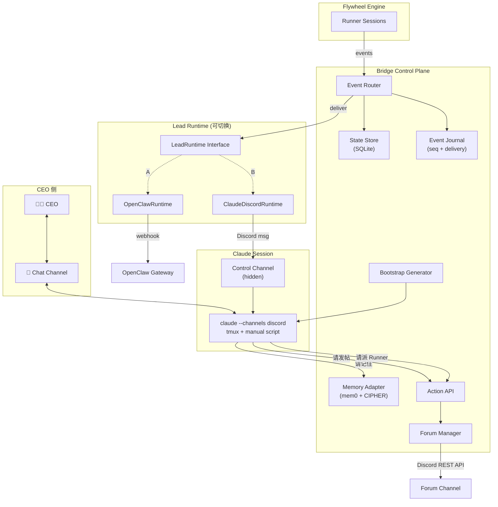

# Plan: Claude Discord Plugin Lead Runtime

**Version**: v1.6.0
**Issue**: GEO-195
**Date**: 2026-03-21
**Source**: `doc/exploration/new/GEO-195-claude-discord-plugin.md`, `doc/research/new/GEO-195-claude-discord-plugin.md`
**Status**: codex-approved
**Review**: Round 1 (7 issues) → Round 2 (3) → Round 3 (2) → Round 4 (1) → Round 5 APPROVED

---

## 目标

引入 Claude Code persistent session（`claude --channels discord`）作为 Lead Agent 的第二套 runtime，与现有 OpenClaw runtime 并行运行，允许 CEO 对比体验后选择。

**不是替换 OpenClaw，是增加一个可切换的 runtime adapter。**

### 验证假设

1. Claude persistent Lead 能稳定接收和处理 machine events
2. Lead 能把 runner output 消化成 CEO-friendly synthesis
3. Lead 能通过 Bridge API 委派/批准/重试
4. Session crash 后 1 次重启内恢复有用上下文

### 前置依赖

- **GEO-198**: mem0 记忆层从 runner 搬到 Lead（High priority）
- **GEO-187**: Lead agent behavior design（已有 plan）— GEO-195 与 187 互补，195 提供运行时，187 提供行为规范

---

## 架构

### 两层分离



### LeadRuntime Interface

```typescript
// bridge/lead-runtime.ts

export interface LeadEventEnvelope {
  seq: number;
  event: HookPayload;
  sessionKey: string;
  leadId: string;
  timestamp: string;
}

export interface LeadBootstrap {
  leadId: string;
  activeSessions: BootstrapSession[];
  pendingDecisions: BootstrapDecision[];
  recentFailures: BootstrapFailure[];
  recentEvents: LeadEventEnvelope[];   // last 5 min — may need re-processing
  memoryRecall: string | null;
}

export interface LeadRuntimeHealth {
  status: "healthy" | "degraded" | "down";
  lastDeliveryAt: string | null;
  lastDeliveredSeq: number;
}

export interface LeadRuntime {
  readonly type: "openclaw" | "claude-discord";
  /**
   * Best-effort delivery. MUST swallow errors (warn-only).
   * 3s timeout for both runtimes. Fire-and-forget semantics
   * preserved from original notifyAgent() contract.
   */
  deliver(envelope: LeadEventEnvelope): Promise<void>;
  sendBootstrap(snapshot: LeadBootstrap): Promise<void>;
  health(): Promise<LeadRuntimeHealth>;
  shutdown(): Promise<void>;
}
```

### Delivery Semantics Contract (Round 2 fix — Codex #1, #3, #6)

**`deliver()` 必须遵守以下语义，与原 `notifyAgent()` 一致**：

1. **Fire-and-forget**: 调用方 `.catch(() => {})` 包装，不影响主事件处理流程
2. **3s timeout**: AbortController 统一超时
3. **Error swallowing**: 失败只 warn，不 throw
4. **无 retry**: 与原行为一致。retry 由 event journal + bootstrap replay 保障

### Ack/Replay Protocol (Round 2 fix — Codex #1)

**Ack 不由 Claude session 主动调用。** 原因：Discord plugin 没有自定义 tool 来回调 Bridge。

**替代方案：Delivery-time ack + recent window bootstrap (Round 3 统一)**

MVP 不需要真正的 ack 协议。简化为：

```
事件投递流程：
1. Bridge 生成 event → appendLeadEvent(leadId, event) → 获得 seq
2. runtime.deliver(envelope) → 投递到 Discord/OpenClaw
3. delivered_at 立即写入（投递成功即标记已投递）
4. 无 ack — delivered_at 非 NULL 即视为"已投递"

Bootstrap 恢复流程：
1. 用户手动重启脚本 → 脚本调 POST /api/bootstrap/:leadId
2. Bootstrap generator 查询：
   a. 最近 5 分钟内投递的事件（delivered_at > now - 5min）→ 作为 recentEvents
   b. 活跃 sessions (status = running | awaiting_review)
   c. pending decisions (status = awaiting_review)
   d. recent failures (status = failed, last 10)
3. 合并为 LeadBootstrap（含 recentEvents 字段）
4. 发送到 control channel
5. Claude session 启动 → --continue → 读到 bootstrap + fetch_messages 追赶
```

**数据模型**：
- `lead_events` 表只有 `delivered_at`（无确认字段，MVP 不需要）
- 查询方法：`getRecentDeliveredEvents(leadId, windowMinutes)` — 按投递时间窗口
- Health 字段：`LeadRuntimeHealth.lastDeliveredSeq`

**幂等保障**：
- 每条 event 带 event_id（来自 IngestEvent.event_id）
- Bootstrap 消息包含 event_ids 列表
- CLAUDE.md 指令："如果看到重复 event_id，忽略"
- Bootstrap 可多次调用无副作用（查询 + 发消息，无状态变更）

**为什么不用 Claude 主动 ack？** Plugin 只有 reply/react/edit/fetch 四个 tool，无法调 Bridge HTTP API。Post-MVP 可通过自定义 MCP tool 实现。

### Runtime Registry (Round 2 fix — Codex #2)

```typescript
// bridge/runtime-registry.ts

export class RuntimeRegistry {
  private runtimes = new Map<string, LeadRuntime>();  // key: lead.agentId

  register(lead: LeadConfig, runtime: LeadRuntime): void { ... }

  /** 按 lead agentId 查找 runtime */
  getForLead(agentId: string): LeadRuntime | undefined { ... }

  /** 按 project + labels 解析 lead 再查 runtime */
  resolve(projects: ProjectEntry[], projectName: string, labels: string[]): LeadRuntime { ... }

  async shutdownAll(): Promise<void> {
    for (const rt of this.runtimes.values()) await rt.shutdown();
  }
}
```

**注入模型**：`startBridge()` 初始化时创建 registry，注入到 event-route、actions、HeartbeatService。所有 `notifyAgent()` 调用统一替换为 `registry.resolve(...).deliver()`。

### Per-Lead Ordered Delivery (Round 3 fix — Codex #6)

**Runtime 不提供顺序保证。消费者（Claude session）必须靠 seq/event_id 做幂等并接受乱序。**

明确声明：
1. `deliver()` 是 fire-and-forget，不保证投递顺序
2. 现有 `notifyAgent()` 同样不保证顺序 — 这不是新 regression
3. 每条 event 带 `seq`（单调递增）和 `event_id`（全局唯一）
4. Claude CLAUDE.md 指令："按 seq 排序理解事件时间线，忽略到达顺序"
5. Bootstrap 的 `recentEvents` 按 seq 升序排列

**Post-MVP 如需严格串行**：加 per-lead `p-queue` (concurrency=1) 在 `RuntimeRegistry.resolve().deliver()` 外层。

### 配置扩展

```typescript
// LeadConfig 扩展（projects.json）
interface LeadConfig {
  agentId: string;
  forumChannel: string;
  chatChannel: string;
  match: { labels: string[] };
  // 新增
  runtime?: "openclaw" | "claude-discord";  // default: "openclaw"
  controlChannel?: string;  // claude-discord 用的隐藏控制通道
}
```

```json
// ~/.flywheel/projects.json 示例
[{
  "projectName": "geoforge3d",
  "leads": [
    {
      "agentId": "product-lead",
      "forumChannel": "1482925814533329049",
      "chatChannel": "1484083711820435486",
      "controlChannel": "1500000000000000000",
      "match": { "labels": ["Product"] },
      "runtime": "claude-discord"
    },
    {
      "agentId": "ops-lead",
      "forumChannel": "1484696074651304186",
      "chatChannel": "1484697796966613012",
      "match": { "labels": ["Operations"] },
      "runtime": "openclaw"
    }
  ]
}]
```

这样可以 **per-lead 选择 runtime**：Product 用 Claude，Ops 用 OpenClaw。

---

## 实施步骤

### Phase 1: LeadRuntime 抽象 + OpenClaw 提取

**目标**：不改变任何行为，只提取 interface。

#### Step 1.1: 定义 LeadRuntime interface

**新文件**: `packages/teamlead/src/bridge/lead-runtime.ts`

定义 `LeadRuntime`, `LeadEventEnvelope`, `LeadBootstrap`, `LeadRuntimeHealth` interfaces。

#### Step 1.2: 提取 OpenClawRuntime

**新文件**: `packages/teamlead/src/bridge/openclaw-runtime.ts`

把 `notifyAgent()` + `buildHookBody()` 包装成 `OpenClawRuntime implements LeadRuntime`：

```typescript
export class OpenClawRuntime implements LeadRuntime {
  readonly type = "openclaw" as const;

  constructor(
    private gatewayUrl: string,
    private hooksToken: string,
  ) {}

  async deliver(envelope: LeadEventEnvelope): Promise<void> {
    const body = buildHookBody(envelope.leadId, envelope.event, envelope.sessionKey);
    await notifyAgent(this.gatewayUrl, this.hooksToken, body);
  }

  async sendBootstrap(_snapshot: LeadBootstrap): Promise<void> {
    // OpenClaw 不需要 bootstrap（persistent session 自维护）
  }

  async health(): Promise<LeadRuntimeHealth> {
    // 检查 gateway 是否可达
    // ...
  }

  async shutdown(): Promise<void> {
    // no-op
  }
}
```

#### Step 1.3: RuntimeRegistry + 替换所有 notifyAgent 调用 (Round 2: exhaustive)

**新文件**: `packages/teamlead/src/bridge/runtime-registry.ts`

**完整迁移面**（grep 验证 `notifyAgent` 所有调用点）：

| 文件 | 调用点 | 改动 |
|------|--------|------|
| `bridge/event-route.ts:463` | session 事件通知 | `registry.resolve(projects, projectName, labels).deliver()` |
| `bridge/actions.ts:97` | action 执行后通知 | `registry.resolve(...).deliver()` |
| `HeartbeatService.ts` | `WebhookHeartbeatNotifier.onSessionStuck/onSessionOrphaned` | 重构为使用 registry |
| `DirectEventSink.ts` | 如有 notifyAgent 调用 | 替换 |
| `index.ts:38` | CIPHER proposal 通知（如有） | 替换，用 `config.defaultLeadAgentId` 查 registry |

**验证步骤**：`grep -rn "notifyAgent" packages/teamlead/src/` 必须返回 0 结果（仅保留函数定义本身供 OpenClawRuntime 内部使用）。

**关键语义保障**：所有替换后的 `deliver()` 调用必须保持 `.catch(() => {})` 包装，与原 fire-and-forget 行为一致。

#### Step 1.4: Runtime 工厂 + Registry 初始化

**修改文件**: `bridge/plugin.ts` `startBridge()`

```typescript
// 初始化
const registry = new RuntimeRegistry();
for (const project of projects) {
  for (const lead of project.leads) {
    const runtime = createRuntime(lead, config);
    registry.register(lead, runtime);
  }
}

function createRuntime(lead: LeadConfig, config: BridgeConfig): LeadRuntime {
  if (lead.runtime === "claude-discord") {
    if (!lead.controlChannel) {
      throw new Error(`Lead "${lead.agentId}" has runtime=claude-discord but missing controlChannel`);
    }
    if (!config.discordBotToken) {
      throw new Error(`Lead "${lead.agentId}" has runtime=claude-discord but OPENCLAW_DISCORD_TOKEN is not set`);
    }
    return new ClaudeDiscordRuntime(lead.controlChannel, config.discordBotToken);
  }
  return new OpenClawRuntime(config.gatewayUrl!, config.hooksToken!);
}

// Graceful shutdown
process.on("SIGTERM", () => registry.shutdownAll());
```

**Config 校验**：`runtime=claude-discord` 时 `controlChannel` 必填，否则启动失败。

**测试**: 单元测试 OpenClawRuntime.deliver() 输出与原 notifyAgent 一致 + config 校验 error cases。

---

### Phase 2: ClaudeDiscordRuntime

**目标**：实现 Discord control channel 投递。

#### Step 2.1: 实现 ClaudeDiscordRuntime

**新文件**: `packages/teamlead/src/bridge/claude-discord-runtime.ts`

```typescript
export class ClaudeDiscordRuntime implements LeadRuntime {
  readonly type = "claude-discord" as const;
  private lastDeliveryAt: string | null = null;
  private lastDeliveredSeq = 0;

  constructor(
    private controlChannelId: string,
    private discordBotToken: string,
  ) {}

  async deliver(envelope: LeadEventEnvelope): Promise<void> {
    // POST /channels/{controlChannelId}/messages
    // Content: formatted event envelope as structured markdown
    const content = this.formatEnvelope(envelope);
    await this.postDiscordMessage(content);
    this.lastDeliveryAt = new Date().toISOString();
  }

  async sendBootstrap(snapshot: LeadBootstrap): Promise<void> {
    // 发送 bootstrap snapshot 到 control channel
    const content = this.formatBootstrap(snapshot);
    await this.postDiscordMessage(content);
  }

  async health(): Promise<LeadRuntimeHealth> {
    return {
      status: this.lastDeliveryAt ? "healthy" : "degraded",
      lastDeliveryAt: this.lastDeliveryAt,
      lastDeliveredSeq: this.lastDeliveredSeq,
    };
  }

  private async postDiscordMessage(content: string): Promise<void> {
    // Discord REST API: POST /channels/{id}/messages
    // 复用现有 /api/forum-tag 里的 bot token 鉴权模式
  }

  private formatEnvelope(env: LeadEventEnvelope): string {
    // 格式化为 Claude 易读的 structured markdown
    // 包含 seq number + event_id 用于幂等
  }

  private formatBootstrap(snapshot: LeadBootstrap): string {
    // 格式化 bootstrap snapshot
  }
}
```

#### Step 2.2: Event Journal + Delivery Tracking

**修改文件**: `packages/teamlead/src/StateStore.ts`

新增 migration：

```sql
CREATE TABLE IF NOT EXISTS lead_events (
  seq INTEGER PRIMARY KEY AUTOINCREMENT,
  lead_id TEXT NOT NULL,
  event_id TEXT NOT NULL,       -- from IngestEvent.event_id (dedup key)
  event_type TEXT NOT NULL,
  payload TEXT NOT NULL,         -- JSON
  session_key TEXT,
  delivered_at TEXT,             -- NULL = not yet delivered
  created_at TEXT NOT NULL DEFAULT (datetime('now'))
);

CREATE INDEX idx_lead_events_recent ON lead_events(lead_id, delivered_at);
CREATE UNIQUE INDEX idx_lead_events_dedup ON lead_events(lead_id, event_id);
```

新增方法（Round 3 统一）：
- `appendLeadEvent(leadId, eventId, event): number` — 返回 seq，event_id 去重
- `markDelivered(seq): void` — 设置 delivered_at
- `getRecentDeliveredEvents(leadId, windowMinutes): LeadEventRow[]` — bootstrap 用
- `getLastDeliveredSeq(leadId): number` — health check 用

#### Step 2.3: Control Channel 创建

在 Discord server 的 GeoForge3D category 下创建：
- `product-control`（hidden — 只有 bot 可见）
- `ops-control`（hidden — 只有 bot 可见）

Discord channel permissions: bot 可 read/write，其他人不可见。

**手动操作**，不需代码。

---

### Phase 3: Bootstrap + Supervisor

**目标**：crash recovery 和进程管理。

#### Step 3.1: Bootstrap Generator

**新文件**: `packages/teamlead/src/bridge/bootstrap-generator.ts`

```typescript
export async function generateBootstrap(
  leadId: string,
  store: StateStore,
  memoryAdapter?: MemoryAdapter,
): Promise<LeadBootstrap> {
  const activeSessions = store.getActiveSessions()
    .filter(s => /* match leadId via labels */);

  const pendingDecisions = store.getRecentSessions(20)
    .filter(s => s.status === "awaiting_review");

  const recentFailures = store.getRecentSessions(10)
    .filter(s => s.status === "failed");

  // 最近 5 分钟内投递的事件 — crash 前可能未被 Claude 处理
  const recentEvents = store.getRecentDeliveredEvents(leadId, 5)
    .map(row => ({
      seq: row.seq,
      event: JSON.parse(row.payload) as HookPayload,
      sessionKey: row.session_key ?? "",
      leadId,
      timestamp: row.created_at,
    }));

  const memoryRecall = memoryAdapter
    ? await memoryAdapter.searchForLead(leadId, "current project status and recent decisions")
    : null;

  return {
    leadId,
    activeSessions: activeSessions.map(toBootstrapSession),
    pendingDecisions: pendingDecisions.map(toBootstrapDecision),
    recentFailures: recentFailures.map(toBootstrapFailure),
    recentEvents,  // Round 3: 包含近期事件用于 replay
    memoryRecall,
  };
}
```

#### Step 3.2: Bootstrap API Endpoint

**修改文件**: `bridge/plugin.ts`

新增 endpoint：
```
POST /api/bootstrap/:leadId
→ 调 generateBootstrap()
→ 调 runtime.sendBootstrap()
→ 返回 { delivered: true, snapshot_summary }
```

#### Step 3.3: MVP Supervisor — 手动 + 脚本 (Round 2: scoped down per Codex #5)

**MVP 只运行 1 个 Claude lead（product-lead）。** 不使用自动化进程管理。

**新文件**: `packages/teamlead/scripts/claude-lead.sh`

```bash
#!/bin/bash
set -euo pipefail

LEAD_ID="${1:?Usage: claude-lead.sh <lead-id>}"
PROJECT_DIR="${2:?Usage: claude-lead.sh <lead-id> <project-dir>}"
BRIDGE_URL="${BRIDGE_URL:-http://localhost:9876}"
BRIDGE_TOKEN="${TEAMLEAD_API_TOKEN:-}"
SESSION_DIR="${HOME}/.flywheel/claude-sessions"
SESSION_ID_FILE="${SESSION_DIR}/${LEAD_ID}.session-id"

mkdir -p "$SESSION_DIR"

# Send bootstrap via Bridge API
echo "[lead] Sending bootstrap for ${LEAD_ID}..."
curl -s -X POST "${BRIDGE_URL}/api/bootstrap/${LEAD_ID}" \
  -H "Authorization: Bearer ${BRIDGE_TOKEN}" \
  -H "Content-Type: application/json" || echo "[lead] Bootstrap failed (non-fatal)"

# Wait for bootstrap message to arrive in Discord
sleep 3

# Launch Claude in the project directory
cd "$PROJECT_DIR"

# Resume if we have a session ID, otherwise start fresh
if [ -f "$SESSION_ID_FILE" ]; then
  SESSION_ID=$(cat "$SESSION_ID_FILE")
  echo "[lead] Resuming session ${SESSION_ID}..."
  exec claude --resume "$SESSION_ID" \
    --channels "plugin:discord@claude-plugins-official" \
    --dangerously-skip-permissions
else
  echo "[lead] Starting fresh session..."
  exec claude \
    --channels "plugin:discord@claude-plugins-official" \
    --dangerously-skip-permissions
fi
```

**手动操作流程**：
1. `tmux new -s product-lead` — 开一个 tmux session
2. `./scripts/claude-lead.sh product-lead /Users/xiaorongli/Dev/geoforge3d`
3. 如果 crash → 手动重跑脚本（tmux 里 up-arrow + enter）
4. Session ID 手动记录到 `~/.flywheel/claude-sessions/product-lead.session-id`

**Post-MVP 再考虑自动化进程管理（如 process supervisor）。**

---

### Phase 4: ForumManager 扩展 — DEFERRED (Round 2: Codex #8)

**本 phase 推迟到 post-MVP。**

**原因**（Codex review #8）：ForumManager 同时触及 Discord client、thread mapping、cleanup/tagging 三个子系统，风险明显高于 runtime adapter 本身。

**MVP 策略**：Claude Lead 使用 forum channel 时，复用现有 `conversation_threads` 映射。如果 OpenClaw 已经为某 issue 创建了 thread，Claude Lead 可以通过 plugin 的 `reply` tool 向该 thread 发消息。新 issue 的 thread 创建暂由 OpenClaw lead 或手动完成。

**Post-MVP ForumManager 设计见**: `doc/exploration/new/GEO-195-claude-discord-plugin.md` § Forum thread/tag 管理

---

## 测试策略 (Round 2: expanded per Codex #7)

### 单元测试 — Happy Path

| 测试 | 文件 |
|------|------|
| OpenClawRuntime.deliver() 输出与原 notifyAgent 一致 | `__tests__/openclaw-runtime.test.ts` |
| ClaudeDiscordRuntime.deliver() 发送正确 Discord API 调用 | `__tests__/claude-discord-runtime.test.ts` |
| Bootstrap generator 正确聚合 sessions | `__tests__/bootstrap-generator.test.ts` |
| Event journal append/delivery tracking/query recent delivered | `__tests__/lead-events.test.ts` |
| RuntimeRegistry 按 lead 查找 + resolve | `__tests__/runtime-registry.test.ts` |
| Runtime factory per-lead routing | `__tests__/runtime-factory.test.ts` |

### 单元测试 — Failure Modes (Round 2 新增)

| 测试 | 文件 |
|------|------|
| deliver() timeout 后 swallow error，不影响调用方 | `__tests__/claude-discord-runtime.test.ts` |
| deliver() Discord 429 rate limit → warn only | `__tests__/claude-discord-runtime.test.ts` |
| Bootstrap 重复注入幂等性（多次调 /api/bootstrap） | `__tests__/bootstrap-generator.test.ts` |
| Config 校验：`runtime=claude-discord` 缺 `controlChannel` → throw | `__tests__/runtime-factory.test.ts` |
| Config 校验：`runtime=claude-discord` 缺 `discordBotToken` → throw | `__tests__/runtime-factory.test.ts` |
| Event journal getRecentDeliveredEvents 5min 窗口 | `__tests__/lead-events.test.ts` |

### 回归测试 — 所有 notifyAgent 路径 (Round 2 新增)

| 路径 | 测试 |
|------|------|
| event-route session_started/completed/failed → deliver | `__tests__/event-route.test.ts` (已有，扩展) |
| actions sendActionHook → deliver | `__tests__/actions.test.ts` (已有，扩展) |
| HeartbeatService stuck/orphaned → deliver | `__tests__/heartbeat.test.ts` (已有，扩展) |
| CIPHER proposal 通知（如 index.ts） → deliver | `__tests__/cipher-notify.test.ts` |

### 集成测试

1. **E2E event flow**: Runner event → Bridge → ClaudeDiscordRuntime → Discord control channel → 验证消息格式
2. **Bootstrap recovery**: 模拟 crash → 调 bootstrap API → 验证 snapshot 含 recentEvents
3. **A/B routing**: 同一 project 两个 lead 用不同 runtime，验证事件路由到正确 runtime
4. **OpenClaw 无回归**: runtime=openclaw 的 lead 行为与改动前完全一致

### 手动验证

1. 启动 `claude --channels discord` session，验证收到 control channel 消息
2. CEO 在 chat channel 发消息，验证 Lead 回复
3. Kill session → 手动重启脚本 → 验证 bootstrap 注入 + fetch_messages 追赶
4. 同时运行 OpenClaw lead 和 Claude lead，验证互不干扰

---

## 文件清单

### 新文件 (Round 2: updated — Phase 4 deferred)

| 文件 | 用途 | 估算 LOC |
|------|------|----------|
| `bridge/lead-runtime.ts` | Interface + types | 80 |
| `bridge/openclaw-runtime.ts` | 现有行为提取 | 80 |
| `bridge/claude-discord-runtime.ts` | Discord control channel 投递 | 120 |
| `bridge/runtime-registry.ts` | Runtime 注册表 + 查找 | 60 |
| `bridge/bootstrap-generator.ts` | Bootstrap snapshot 生成 | 100 |
| `scripts/claude-lead.sh` | 启动脚本（手动 supervisor） | 40 |
| `__tests__/openclaw-runtime.test.ts` | 单测 | 60 |
| `__tests__/claude-discord-runtime.test.ts` | 单测（含 failure modes） | 120 |
| `__tests__/bootstrap-generator.test.ts` | 单测（含幂等性） | 100 |
| `__tests__/lead-events.test.ts` | 单测（含 delivery tracking） | 80 |
| `__tests__/runtime-registry.test.ts` | 单测 | 60 |
| `__tests__/runtime-factory.test.ts` | 单测（含 config 校验） | 60 |

### 修改文件

| 文件 | 改动 | 估算 |
|------|------|------|
| `bridge/event-route.ts` | notifyAgent → registry.resolve().deliver() | ~30 LOC |
| `bridge/actions.ts` | notifyAgent → registry.resolve().deliver() | ~20 LOC |
| `bridge/plugin.ts` | registry 初始化 + bootstrap endpoint + config 校验 | ~60 LOC |
| `HeartbeatService.ts` | WebhookHeartbeatNotifier → registry-based adapter | ~20 LOC |
| `StateStore.ts` | lead_events 表 migration + 新方法 | ~50 LOC |
| `ProjectConfig.ts` | LeadConfig 加 runtime + controlChannel 字段 + 校验 | ~20 LOC |

**总计**: ~860 LOC 新 + ~200 LOC 改 + ~480 LOC 测试 = **~1540 LOC**

---

## 时间线 (Round 2: Phase 4 deferred)

| Phase | 内容 | 估算 | 前置 |
|-------|------|------|------|
| Phase 1 | LeadRuntime 抽象 + Registry + OpenClaw 提取 | 1.5 天 | 无 |
| Phase 2 | ClaudeDiscordRuntime + Event Journal | 1.5 天 | Phase 1 |
| Phase 3 | Bootstrap + 手动 Supervisor 脚本 | 0.5 天 | Phase 2 |
| 测试 + 手动验证 | 单测 + 回归 + E2E | 1 天 | All phases |
| **总计** | | **4.5 天** | |

Phase 4（ForumManager）推迟到 post-MVP。

---

## 风险 & 缓解 (Round 2: expanded per Codex #3, #6)

| 风险 | 等级 | 缓解措施 |
|------|------|----------|
| Research preview API 变化 | 中 | adapter pattern 隔离；runtime 可一行 config 切回 openclaw |
| Permission 阻塞无人值守 session | 高 | `--dangerously-skip-permissions` + CLAUDE.md 严格约束 |
| 大 session resume freeze | 中 | 定期 `/compact`；session transcript 超 30MB 开新 session |
| notifyAgent 替换遗漏 | 低 | `grep -rn notifyAgent` 验证 + 全路径回归测试 |
| Discord API rate limiting (429) | 低 | deliver() swallow error；control channel 流量低 |
| deliver() 语义变化导致回归 | 中 | 所有 deliver() 保持 fire-and-forget + 3s timeout + catch 包装 |
| 多 lead 并发投递乱序 | 低 | 同 issue 事件串行（Express）；跨 issue 无序无业务影响 |
| CIPHER 通知路径遗漏 | 中 | grep 全量扫描 + 回归测试覆盖 CIPHER 路径 |

---

## 成功标准

### MVP 通过标准

1. ✅ Product Lead 可以通过 Claude session 接收 Flywheel events 并与 CEO 对话
2. ✅ Ops Lead 仍通过 OpenClaw 正常运行（无 regression）
3. ✅ Kill Claude session 后手动重启脚本，bootstrap 恢复上下文
4. ✅ Claude Lead 可复用已有 forum thread（reply into existing thread）
5. ✅ CEO 能通过 projects.json 一行配置切换 lead 的 runtime

### 后续方向（不在本 plan 范围）

- Shadow mode 双写对比（同一事件发两个 runtime）
- mem0 记忆层 per-lead 集成（GEO-198）
- 自主 memory 写入策略
- CLAUDE.md Lead 行为模板
- Token 消耗 metrics + alerting
