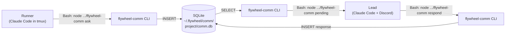
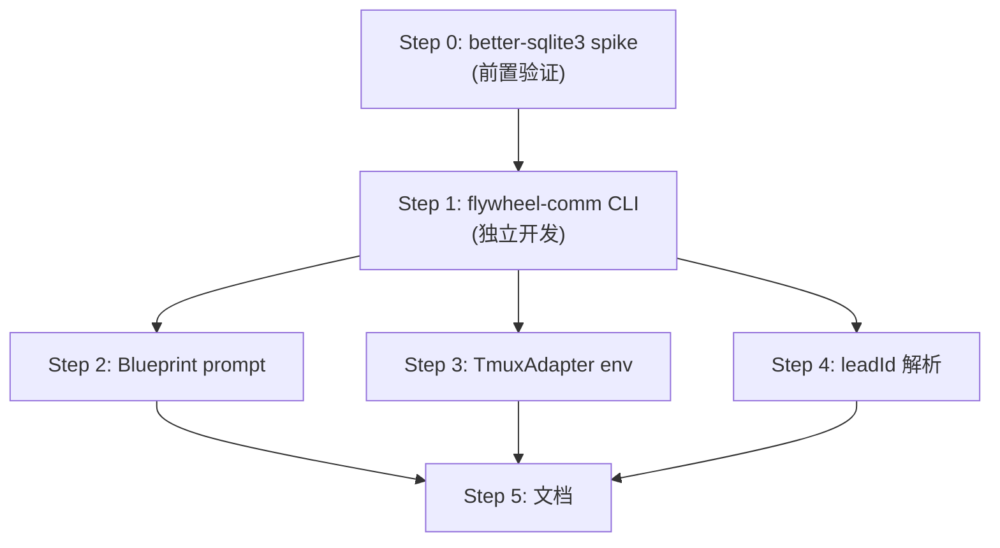

# Plan: Lead ↔ Runner 双向通信 (Phase 1)

**Version**: v1.8.0
**Issue**: GEO-206
**Date**: 2026-03-22
**Source**: `doc/exploration/new/GEO-206-lead-runner-bidirectional-comm.md`, `doc/research/new/GEO-206-lead-runner-bidirectional-comm.md`
**Status**: codex-approved (CEO override after 5 rounds — remaining issues are implementation-level variable naming)
**Review**: Codex Plan Rounds 1-5; 7 architectural issues resolved, 3 code-snippet accuracy items deferred to implementation

---

## 目标

让 Runner 能在执行过程中向 Lead 提问并获得回复，不丢失执行进度。

**核心交互**:
```
Runner 遇到歧义 → flywheel-comm ask "问题" → 继续其他工作
Lead 看到问题 → flywheel-comm respond → 答案送回
Runner → flywheel-comm check → 获得答案 → 继续
```

**Phase 1 范围**: 仅 Runner → Lead 提问 + Lead 回复。不含 Lead 主动指令、tmux 可见性、Bridge 审计。

---

## 架构



**关键决策**:
- **CLI > MCP** — token 开销低 10-32 倍，不需要改 TmuxAdapter MCP 配置
- **SQLite > JSONL** — 索引查询、WAL 并发、自动清理
- **`better-sqlite3` > `sql.js`** — 真正的 file-backed WAL 并发
- **`~/.flywheel/comm/` > worktree 目录** — 所有 worktree 共享同一个 DB
- **绝对路径调用 CLI** — 不依赖 PATH（Codex 确认 pnpm bin link 不可靠）

---

## 前置验证 (Step 0)

### 0.1 better-sqlite3 兼容性 spike

**在实施前验证**，不是作为风险备注。

```bash
# 在 flywheel monorepo 中测试
cd packages/flywheel-comm
pnpm add better-sqlite3 @types/better-sqlite3
pnpm build
pnpm test

# CI 兼容性
# 在 GitHub Actions ubuntu-latest + Node 22 上验证 install + build
```

验证项：
- [ ] macOS 本地 install + build 成功
- [ ] ubuntu CI (`pnpm install --frozen-lockfile`) 成功
- [ ] vitest 中 better-sqlite3 能正常使用
- [ ] WAL 模式在 CI 中正常工作

**如果 better-sqlite3 不兼容**: 退回 `sql.js` 单写者模式（Lead 和 Runner 串行化 DB 访问）。

---

## 实施步骤

### Step 1: `packages/flywheel-comm/` — CLI package 搭建

**TDD**: 先写测试，再实现。

#### 1.1 Package 结构

```
packages/flywheel-comm/
├── package.json
├── tsconfig.json
├── src/
│   ├── index.ts          # CLI entry point (#!/usr/bin/env node)
│   ├── db.ts             # SQLite adapter (schema + CRUD)
│   ├── commands/
│   │   ├── ask.ts
│   │   ├── check.ts
│   │   ├── pending.ts
│   │   └── respond.ts
│   └── types.ts          # Message types
└── src/__tests__/
    ├── db.test.ts
    ├── commands.test.ts   # Round-trip tests
    └── cli.test.ts        # CLI parsing + output format
```

#### 1.2 DB adapter (`db.ts`)

Schema (from research, Codex-approved):
```sql
CREATE TABLE IF NOT EXISTS messages (
  id          TEXT PRIMARY KEY,
  from_agent  TEXT NOT NULL,
  to_agent    TEXT NOT NULL,
  type        TEXT NOT NULL CHECK(type IN ('question','response','instruction','progress')),
  content     TEXT NOT NULL,
  parent_id   TEXT,
  created_at  DATETIME DEFAULT CURRENT_TIMESTAMP,
  expires_at  DATETIME NOT NULL DEFAULT (datetime('now', '+72 hours')),
  FOREIGN KEY (parent_id) REFERENCES messages(id)
);
CREATE UNIQUE INDEX IF NOT EXISTS idx_unique_response ON messages(parent_id) WHERE type = 'response';
CREATE INDEX IF NOT EXISTS idx_messages_to_agent ON messages(to_agent, type, created_at);
CREATE INDEX IF NOT EXISTS idx_messages_parent ON messages(parent_id);
CREATE INDEX IF NOT EXISTS idx_messages_expires ON messages(expires_at);
```

初始化: `PRAGMA journal_mode=WAL; PRAGMA busy_timeout=5000;`
启动时清理: `DELETE FROM messages WHERE expires_at < datetime('now')`

#### 1.3 Commands

| Command | 输入 | 输出 | Exit code |
|---------|------|------|-----------|
| `ask` | --lead, --exec-id, question text | question_id | 0=success |
| `check` | question_id | answer 或 status | **0=always** (Codex #4 修正) |
| `pending` | --lead | 未回复问题列表 | 0=success |
| `respond` | question_id, answer text | confirmation | 0=success |

**Exit code 修正** (Codex #4): `check` 无论有无回复都返回 exit 0。用输出内容区分：
- 默认: 有回复输出内容，无回复输出 `"not yet"`
- `--json`: `{"status":"answered","content":"..."}` 或 `{"status":"pending"}`
- exit 1 仅用于真正的错误（DB 不可读、参数错误等）

#### 1.4 CLI 调用方式 (Codex #1 修正)

**不依赖 PATH。** 使用绝对路径调用。

Runner 和 Lead 通过 system prompt / CLAUDE.md 中的绝对路径调用：
```bash
# Runner/Lead 调用方式
node /Users/xiaorongli/Dev/flywheel/packages/flywheel-comm/dist/index.js ask --lead product-lead "问题"
```

Blueprint 注入 CLI 路径到 system prompt (ESM-safe):
```typescript
import { fileURLToPath } from "node:url";
import path from "node:path";
const __dirname = path.dirname(fileURLToPath(import.meta.url));
const commCliPath = path.resolve(__dirname, "../../flywheel-comm/dist/index.js");
// prompt 中使用: `node ${commCliPath} ask ...`
```

> 注意: `packages/edge-worker` 是 ESM 包，不能直接用 `__dirname`。参考现有模式: `ValidationLoopController.ts:23-25`。

**为什么不用 PATH**:
- Codex 确认: pnpm workspace root 的 `node_modules/.bin` 不包含 workspace packages 的 bin
- 绝对路径 100% 可靠，不依赖环境配置
- monorepo 内部引用，路径固定

#### 1.5 DB 路径发现 (Codex #5 修正 — Lead + Runner 闭环)

**问题**: Runner 通过 TmuxAdapter 获得 `FLYWHEEL_COMM_DB` 环境变量，但 Lead 不是通过 TmuxAdapter 启动的。

**解决方案**: CLI 的 DB 路径发现规则（优先级递减）:
1. `--db /path/to/comm.db` — 显式指定
2. `FLYWHEEL_COMM_DB` 环境变量 — TmuxAdapter 注入（Runner 端）
3. `--project geoforge3d` → `~/.flywheel/comm/geoforge3d/comm.db` — 项目名推导

**Runner 端**: TmuxAdapter 注入 `FLYWHEEL_COMM_DB` env var（Step 3）
**Lead 端**: supervisor script (`claude-lead.sh`) export `FLYWHEEL_COMM_DB`；或 Lead CLAUDE.md 中指导显式用 `--project`

```bash
# Lead supervisor script 中加入
export FLYWHEEL_COMM_DB=~/.flywheel/comm/geoforge3d/comm.db
```

**两端都用同一个 DB 文件** — 这是方案能跑通的前提。

---

### Step 2: Blueprint system prompt 修改

**File**: `packages/edge-worker/src/Blueprint.ts:300-302`

**当前** (line 300-302):
```typescript
systemPromptLines.push(
  "Do not ask questions — implement your best judgment.",
);
```

**修改为**:
```typescript
import { fileURLToPath } from "node:url";
const __dirname = path.dirname(fileURLToPath(import.meta.url));
const commCliPath = path.resolve(__dirname, "../../flywheel-comm/dist/index.js");
// leadId 必须有值才注入提问指令；未解析时不注入（Runner 正常走 "best judgment"）
if (ctx.leadId) {
systemPromptLines.push(
  `Prefer independent implementation. If you encounter a major ambiguity ` +
  `(architecture choice, API design, priority conflict) that you cannot safely ` +
  `resolve alone, use \`node ${commCliPath} ask --lead ${ctx.leadId} --exec-id ${env.executionId} "your question"\` ` +
  `to ask your Lead. Then continue with other work and periodically run ` +
  `\`node ${commCliPath} check {question_id}\` to check for a response. ` +
  `If no response arrives before your session ends, use your best judgment.`,
);
} else {
  // leadId 未解析 — 退回原始行为
  systemPromptLines.push("Do not ask questions — implement your best judgment.");
}
```

**leadId 来源** (Codex #3 修正): `leadId` 保留在 `BlueprintContext`，**不加到** `AdapterExecutionContext`。只用于 prompt 插值，TmuxAdapter 不需要它。

```typescript
// BlueprintContext 新增 (Blueprint.ts 内部类型)
interface BlueprintContext {
  // ... existing fields
  leadId?: string;  // GEO-206: for system prompt interpolation
}
```

**测试** (需要更新现有 test suites):
- `Blueprint.test.ts` — system prompt 包含 flywheel-comm 指令
- `Blueprint.v0.2.integration.test.ts` — 新 prompt 不破坏现有集成
- `Blueprint.v0.6.integration.test.ts` — 同上

---

### Step 3: TmuxAdapter 环境变量注入

**File**: `packages/claude-runner/src/TmuxAdapter.ts:124-135`

**当前 envArgs 构造**:
```typescript
const envArgs = this.hookServer && callbackToken
  ? ["-e", `FLYWHEEL_CALLBACK_PORT=...`, "-e", `FLYWHEEL_CALLBACK_TOKEN=...`, "-e", `FLYWHEEL_ISSUE_ID=...`]
  : [];
```

**新增** (在 envArgs 构造之后):
```typescript
// GEO-206: Inject comm DB path for flywheel-comm CLI
if (ctx.commDbPath) {
  envArgs.push("-e", `FLYWHEEL_COMM_DB=${ctx.commDbPath}`);
}
```

**AdapterExecutionContext 新增** (`packages/core/src/adapter-types.ts`):
```typescript
export interface AdapterExecutionContext {
  // ... existing fields
  commDbPath?: string;  // GEO-206: SQLite DB path for flywheel-comm
  // NOTE: leadId 不在这里 — 只用于 Blueprint prompt，不需要传到 adapter
}
```

**Blueprint 传递 commDbPath** (在 `Blueprint.ts:344-362` 的 adapter context 内联构造处):
```typescript
// 使用 canonical project name（从 projects config 解析，不用 repo basename）
const canonicalProject = projects.find(p => p.projectRoot.endsWith(env.projectName ?? ""))?.projectName ?? env.projectName ?? "default";
commDbPath: `${process.env.HOME}/.flywheel/comm/${canonicalProject}/comm.db`,
```

**测试** (Codex #7 — 需更新 `TmuxAdapter.test.ts`):
- 当 `ctx.commDbPath` 存在时，tmux 命令包含 `-e FLYWHEEL_COMM_DB=...`
- 当 `ctx.commDbPath` 为 undefined 时，不注入（向后兼容）
- 现有 TmuxAdapter 测试 fixture 添加 `commDbPath: undefined`

---

### Step 4: leadId 解析 (Codex #2 修正)

**问题**: `run-issue.ts` 没有加载 project config；`retry-dispatcher.ts` 没有 labels 和 projects。

#### 4.1 run-issue.ts

**当前** (`scripts/run-issue.ts:368-374`):
```typescript
const ctx = {
  teamName: "eng",
  runnerName: "claude",
  projectName,
  sessionTimeoutMs: 2_700_000,
  executionId,
};
```

**修改**: 加载 projects config，解析 leadId。

> 注意: `run-issue.ts` 当前的 `projectName` 来自 repo basename (`scripts/run-issue.ts:258`)，
> 可能不等于 `projects.json` 中的配置名（如 `geoforge3d`）。需要确保匹配。
> `resolveLeadForIssue()` 在 projectName 不匹配时会 throw (`ProjectConfig.ts:184-206`)。

```typescript
import { loadProjects, resolveLeadForIssue } from "../packages/teamlead/src/ProjectConfig.js";
import { loadConfig } from "../packages/teamlead/src/config.js";

// 在 ctx 构造前
const projects = loadProjects();       // 返回 ProjectEntry[]
const bridgeConfig = loadConfig();     // 返回 BridgeConfig (有 defaultLeadAgentId)

// 从 KNOWN_ISSUES 或 Linear 获取 labels（run-issue.ts 当前: labels?: string[]）
const issueLabels: string[] = issueData?.labels ?? [];

// 解析 leadId — resolveLeadForIssue 返回 { lead, matchMethod }
let leadId: string | undefined;
try {
  const result = resolveLeadForIssue(projects, projectName, issueLabels);
  leadId = result.lead.agentId;
} catch {
  // projectName 不在 projects config 中 — 使用 defaultLeadAgentId
  leadId = bridgeConfig.defaultLeadAgentId;  // "product-lead"
}

const ctx = {
  teamName: "eng",
  runnerName: "claude",
  projectName,
  sessionTimeoutMs: 2_700_000,
  executionId,
  leadId,  // undefined 时 Blueprint 不注入提问指令
};
```

#### 4.2 retry-dispatcher.ts

**当前**: `RetryDispatcher` 没有 projects config 或 StateStore 引用。

**修改**: retry action handler (`actions.ts`) 在 dispatch 前解析 leadId:
```typescript
// actions.ts — retry handler 中
const storedLabels = store.getSessionLabels(session.execution_id);
let retryLeadId: string | undefined;
try {
  const result = resolveLeadForIssue(projects, session.project_name, storedLabels);
  retryLeadId = result.lead.agentId;
} catch {
  retryLeadId = bridgeConfig.defaultLeadAgentId;  // fallback，同 run-issue.ts
}

retryDispatcher.dispatch({
  ...existingFields,
  leadId: retryLeadId,
});
```

`RetryRequest` 接口新增 `leadId?: string`，`retry-dispatcher.ts` 透传到 BlueprintContext。

---

### Step 5: 文档更新

#### 5.1 Runner CLAUDE.md

新增 "向 Lead 提问" section，包含绝对路径的 CLI 命令。

#### 5.2 Lead CLAUDE.md / supervisor script

- `claude-lead.sh` export `FLYWHEEL_COMM_DB` 和 `FLYWHEEL_COMM_CLI`（CLI 绝对路径）
- Lead agent file 新增 "管理 Runner 问题" section
- 所有示例使用绝对路径: `node $FLYWHEEL_COMM_CLI pending --project geoforge3d`（不用裸 `flywheel-comm`）

---

## 依赖关系



---

## 改动文件清单

| 文件 | 操作 | Step |
|------|------|------|
| `packages/flywheel-comm/*` | **新增整个 package** | 0, 1 |
| `packages/core/src/adapter-types.ts` | 新增 `commDbPath?` 字段 | 3 |
| `packages/edge-worker/src/Blueprint.ts` | 修改 system prompt + 传递 commDbPath + 接受 leadId | 2, 3 |
| `packages/claude-runner/src/TmuxAdapter.ts` | 注入 `FLYWHEEL_COMM_DB` env | 3 |
| `packages/claude-runner/test/TmuxAdapter.test.ts` | 更新测试覆盖新 env | 3 |
| `packages/edge-worker/src/__tests__/Blueprint.test.ts` | 更新 prompt 断言 | 2 |
| `scripts/run-issue.ts` | 加载 projects、解析 leadId | 4 |
| `scripts/lib/retry-dispatcher.ts` | 接受 leadId、透传 | 4 |
| `packages/teamlead/src/bridge/actions.ts` | retry 时解析 leadId | 4 |
| `packages/teamlead/src/bridge/retry-dispatcher.ts` | RetryRequest 新增 leadId | 4 |
| `pnpm-workspace.yaml` | 已覆盖 `packages/*`，无需改 | - |
| `packages/teamlead/scripts/claude-lead.sh` | export FLYWHEEL_COMM_DB | 5 |
| 产品 repo CLAUDE.md | 新增 flywheel-comm 说明 | 5 |

---

## 测试策略

### 单元测试 (Step 1) — TDD

| 测试文件 | 覆盖 |
|----------|------|
| `db.test.ts` | Schema 创建、WAL、过期清理、并发 |
| `commands.test.ts` | ask/check/pending/respond round-trip |
| `cli.test.ts` | 参数解析、JSON 模式、exit codes、DB 路径优先级 |

### 回归测试 (Steps 2-4) — 必须更新

| 现有测试 | 需要更新 |
|----------|----------|
| `TmuxAdapter.test.ts` | 新增 commDbPath env 注入断言 |
| `Blueprint.test.ts` | prompt 包含 flywheel-comm (leadId 有值时)；无 leadId 时保留 "Do not ask questions" |
| `Blueprint.v0.2.integration.test.ts` | 新 prompt 不破坏集成 |
| `Blueprint.v0.6.integration.test.ts` | 同上 |
| `retry-e2e.test.ts` | RetryRequest 新增 leadId 字段断言 |

### E2E 验证

- [ ] tmux Claude Code session 中 Bash 调 `node .../flywheel-comm/dist/index.js`
- [ ] Lead 和 Runner 共享同一个 comm.db
- [ ] Round-trip Q&A < 5s
- [ ] `--json` 模式 Claude 可靠解析
- [ ] 超时无回复时 Runner 用最佳判断

---

## 风险与缓解

| 风险 | 概率 | 缓解 |
|------|------|------|
| `better-sqlite3` 编译问题 | 中 | Step 0 前置验证；备选 sql.js |
| Runner 不调 flywheel-comm | 高 | system prompt + CLAUDE.md 双重指导 |
| 绝对路径在不同机器上不同 | 低 | 路径从 `__dirname` 动态计算，不硬编码 |
| 45 分钟内无回复 | 高 | Phase 1 可接受；Phase 2 加 resume |
| Lead 和 Runner 用了不同 DB | 低 | 统一通过 env var + --project 约定 |

---

## 不做什么

- MCP server
- Bridge 新 endpoints
- JSONL 文件 / cursor / file locking
- Lead 主动指令 (inbox/send — Phase 2)
- Lead tmux visibility (Phase 3)
- 动态超时 / session resume (Phase 2)
- SQLite → Supabase (Phase 4)
- Resource monitor (独立 issue)
- `leadId` 加入 AdapterExecutionContext（只在 BlueprintContext 中）
