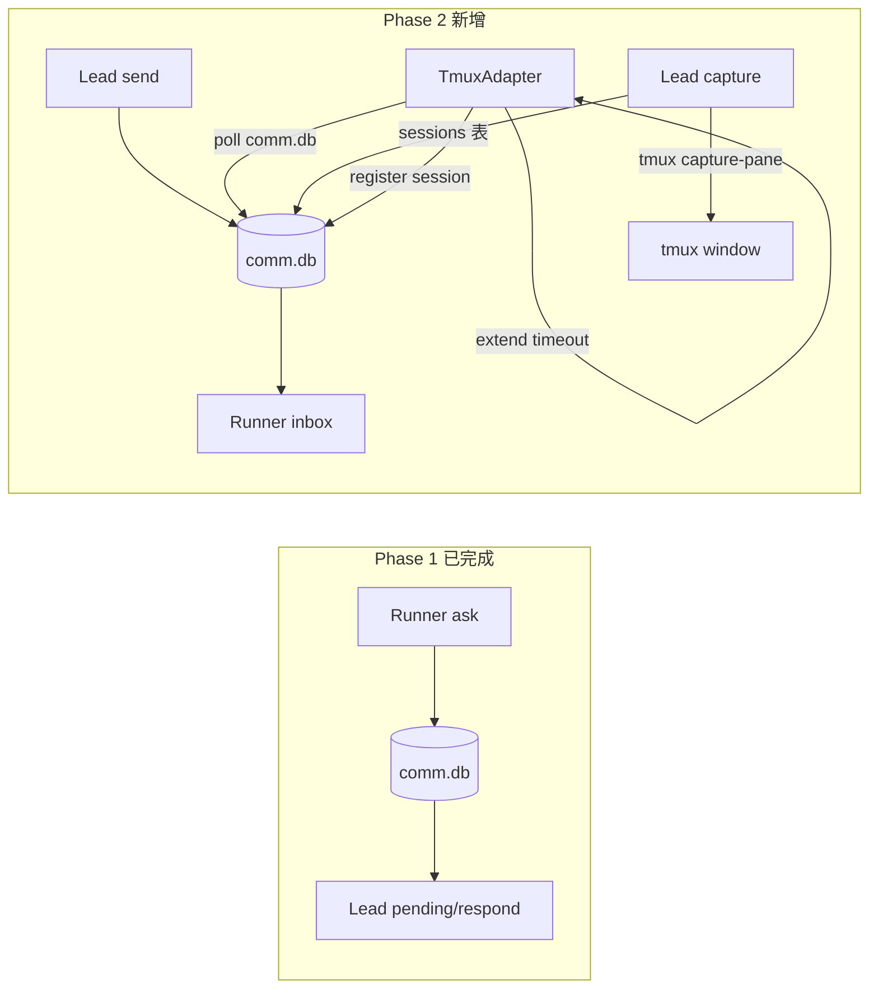
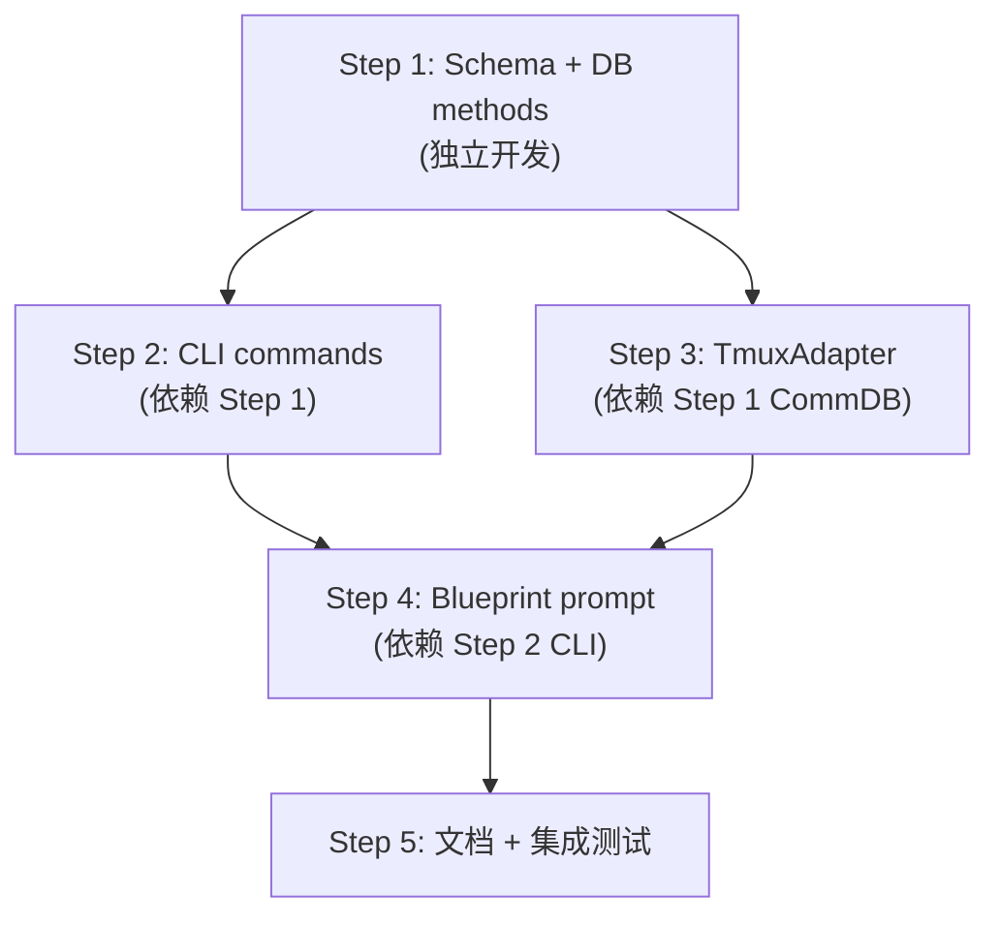

# Plan: Lead ↔ Runner 双向通信 Phase 2

**Version**: v1.9.0
**Issue**: GEO-206
**Date**: 2026-03-22
**Source**: `doc/exploration/new/GEO-206-phase2-lead-proactive-comm.md`, `doc/research/new/GEO-206-phase2-lead-proactive-comm.md`
**Status**: codex-approved
**Review**: Codex Rounds 1-6 (6+4+2+1+0+0 issues) — approved Round 6. 13 design issues resolved across 5 rounds.

---

## 目标

在 Phase 1（Runner ask → Lead respond）基础上，实现三个新能力:

1. **Lead 主动指令** — Lead 可以向 Runner 发送指令，Runner 定期检查并执行
2. **动态超时** — Runner 等待 Lead 回复时，session 超时从 45min 自动延长到 4h
3. **Lead tmux 可见性** — Lead 能查看 Runner 的 tmux 终端输出

**Phase 1 已有基础**:
- `packages/flywheel-comm/` CLI (ask, check, pending, respond)
- SQLite (better-sqlite3 WAL): `~/.flywheel/comm/{project}/comm.db`
- Schema 已有 `instruction` / `progress` type（未使用）
- Blueprint prompt injection + TmuxAdapter env injection

---

## 架构



---

## 实施步骤

### Step 1: Schema Migration + DB Methods (flywheel-comm)

**TDD**: 先写测试，再实现。

#### 1.1 Schema 变更

**SCHEMA 常量更新** (`db.ts`):
- `messages` 表新增 `read_at DATETIME` 列（新 DB 直接包含）
- 新增 `sessions` 表（`CREATE TABLE IF NOT EXISTS`，幂等）

**Sessions 表 schema**:

```sql
CREATE TABLE IF NOT EXISTS sessions (
    execution_id  TEXT PRIMARY KEY,
    tmux_window   TEXT NOT NULL,
    project_name  TEXT NOT NULL,
    issue_id      TEXT,
    lead_id       TEXT,
    started_at    DATETIME DEFAULT CURRENT_TIMESTAMP,
    ended_at      DATETIME,
    status        TEXT DEFAULT 'running'
        CHECK(status IN ('running','completed','timeout'))
);
CREATE INDEX IF NOT EXISTS idx_sessions_project ON sessions(project_name);
CREATE INDEX IF NOT EXISTS idx_sessions_status ON sessions(status);
```

**Migration 方法** (处理已有 DB):

在 constructor 中 `this.db.exec(SCHEMA)` 之后调用 `this.applyMigrations()`。
Migration 使用 `PRAGMA table_info(messages)` 检查 `read_at` 列是否存在。
如果不存在，执行 `ALTER TABLE messages ADD COLUMN read_at DATETIME`。
SQLite 不支持 `ADD COLUMN IF NOT EXISTS`，所以必须先检查。

#### 1.2 types.ts 更新

新增 `Session` interface:

```typescript
export interface Session {
    execution_id: string;
    tmux_window: string;
    project_name: string;
    issue_id: string | null;
    lead_id: string | null;
    started_at: string;
    ended_at: string | null;
    status: 'running' | 'completed' | 'timeout';
}
```

`Message` interface 新增 `read_at: string | null` 字段。

#### 1.3 Library export (Codex #2 修正)

**问题**: `flywheel-comm` 当前 `main` 指向 CLI 入口 (`src/index.ts` 底部无条件调用 `main()`)。直接 import 包根会执行 CLI。

**解决**: 新增 `src/lib.ts` 作为 library export，package.json 增加 `exports` 字段:

```json
{
  "main": "dist/index.js",
  "exports": {
    ".": "./dist/index.js",
    "./db": "./dist/lib.js"
  }
}
```

`src/lib.ts` 内容:
```typescript
export { CommDB } from "./db.js";
export type { Message, CheckResult, PendingQuestion, Session } from "./types.js";
```

TmuxAdapter 通过 `import { CommDB } from "flywheel-comm/db"` 使用。

#### 1.4 DB 新增方法 — Instruction CRUD

| 方法 | 功能 |
|------|------|
| `insertInstruction(fromAgent, toAgent, content)` | INSERT type='instruction', 返回 id |
| `getUnreadInstructions(agentId)` | SELECT WHERE to_agent=?, type='instruction', read_at IS NULL |
| `markInstructionRead(id)` | UPDATE SET read_at=datetime('now') |

#### 1.5 DB 新增方法 — Session CRUD

| 方法 | 功能 |
|------|------|
| `registerSession(executionId, tmuxWindow, projectName, issueId?, leadId?)` | INSERT into sessions |
| `updateSessionStatus(executionId, status: 'completed' \| 'timeout')` | UPDATE status + ended_at |
| `getActiveSessions(projectName?)` | SELECT WHERE status='running' |
| `getSession(executionId)` | SELECT by PK (Codex #5 修正) |
| `listSessions(projectName?, statuses?)` | SELECT with optional filters (Codex #5 修正) |

#### 1.6 Lightweight polling API (Codex #3 修正)

**问题**: 现有 `new CommDB()` 每次构造都执行 `exec(SCHEMA)` + `purgeExpired()` (写操作)，不适合 5 秒 poll。

**解决**: 新增静态方法 `CommDB.openReadonly(dbPath)`:

```typescript
static openReadonly(dbPath: string): CommDB {
    // 跳过 schema exec, migration, purge — 只做 WAL + busy_timeout
    // 用于 TmuxAdapter poll loop 的轻量只读查询
}
```

TmuxAdapter poll loop 使用 `CommDB.openReadonly()` 替代 `new CommDB()`。

#### 1.7 Pending question 按 executionId 查询 (Codex #1 修正)

**问题**: `getPendingQuestions(leadId)` 按 `to_agent=leadId` 查询，会匹配同项目所有 Runner 的问题。动态超时应该只看当前 Runner 的问题。

**解决**: 新增 `hasPendingQuestionsFrom(execId)`:

```typescript
hasPendingQuestionsFrom(execId: string): boolean {
    // SELECT COUNT(*) FROM messages
    // WHERE from_agent = ? AND type = 'question'
    // AND NOT EXISTS (SELECT 1 FROM messages r WHERE r.parent_id = messages.id AND r.type = 'response')
    // AND expires_at > datetime('now')
}
```

TmuxAdapter 使用 `hasPendingQuestionsFrom(ctx.executionId)` 而非 `getPendingQuestions(ctx.leadId)`。

#### 1.8 测试

| 测试文件 | 覆盖 |
|----------|------|
| `db.test.ts` | migration backward compat, instruction CRUD, session CRUD, openReadonly, hasPendingQuestionsFrom |
| migration 测试 | 旧 DB 无 read_at → 重新打开 → 验证存在 |
| instruction 测试 | insert → getUnread → markRead → getUnread 为空 |
| session 测试 | register → getActive → getSession → updateStatus → listSessions |
| lib export 测试 | import from "flywheel-comm/db" 不触发 CLI main() |

---

### Step 2: CLI Commands (flywheel-comm)

**TDD**: 先写测试，再实现。

#### 2.1 `send` command (`src/commands/send.ts`)

```
flywheel-comm send --from <lead-id> --to <exec-id> [--db | --project] [--json] "指令内容"
```

- `--from`: Lead agent ID (必填)
- `--to`: Runner execution ID (必填)
- Positionals: 指令文本
- 调用 `db.insertInstruction(fromAgent, toAgent, content)`
- 输出: instruction_id (plain) 或 `{"instruction_id":"..."}` (--json)

#### 2.2 `inbox` command (`src/commands/inbox.ts`)

```
flywheel-comm inbox --exec-id <id> [--db | --project] [--json]
```

- `--exec-id`: Runner execution ID (必填)
- 调用 `db.getUnreadInstructions(execId)`
- 对每条返回的指令调用 `markInstructionRead(id)` — **读取即标记已读**
- DB 不存在时: 输出 "No instructions." / `[]` (不报错，同 check 的模式)
- 输出格式:
  - Plain: `[{id}] from {from_agent}: {content}`
  - JSON: `[{"id":"...","from_agent":"...","content":"...","created_at":"..."}]`

#### 2.3 `sessions` command (`src/commands/sessions.ts`)

```
flywheel-comm sessions [--project <name>] [--db] [--json]
```

- 默认调用 `db.listSessions(projectName)` — 列出所有 session (running / completed / timeout) (Codex R2#1 修正)
- `--active` flag: 仅显示 status='running' 的 session
- Plain: `[{exec_id}] {tmux_window} {issue_id} {status} (started {relative_time})`
- JSON: Session 数组
- **为什么默认全部**: Lead 最需要检查的往往是 timeout/completed 的 session。tmux 窗口在这些状态下仍保留 (remain-on-exit)，Lead 可以用 `capture` 查看。

#### 2.4 `capture` command (`src/commands/capture.ts`)

```
flywheel-comm capture --exec-id <execution-id> [--lines 100] [--db | --project]
```

- 从 sessions 表查 execution_id → tmux_window (via `db.getSession(execId)`)
- **Best-effort capture** (Codex #4 修正): 不按 status 拒绝。直接尝试 tmux capture-pane，如果窗口不存在则报错 "tmux window not found"。这样 timeout/completed 但窗口仍保留 (remain-on-exit) 的 session 也能被 Lead 检查。
- 使用 `execFileSync("tmux", [...])` 执行 capture-pane（用 execFileSync 而非 exec，避免 shell injection）
- 输出: 终端内容（raw text）

#### 2.5 CLI 入口更新 (`src/index.ts`)

新增 send, inbox, sessions, capture 到 switch/case 和 help。

#### 2.6 测试

| 测试文件 | 覆盖 |
|----------|------|
| `commands.test.ts` | send → inbox round-trip, auto-read |
| `cli.test.ts` | 新命令参数解析, --json 输出, help 更新 |
| capture 测试 | Mock execFileSync, 验证 tmux 参数正确 |

---

### Step 3: TmuxAdapter 改造 (claude-runner)

#### 3.1 Package 依赖

`packages/claude-runner/package.json` 新增:

```json
"flywheel-comm": "workspace:*"
```

TmuxAdapter 通过 `import { CommDB } from "flywheel-comm/db"` 使用 (Step 1.3 的 library export)。
无循环依赖风险: `flywheel-comm` 只依赖 `better-sqlite3`。

#### 3.2 AdapterExecutionContext 新增字段

**File**: `packages/core/src/adapter-types.ts`

新增三个可选字段:
- `waitingTimeoutMs?: number` — 等待 Lead 回复时的超时 (默认 14_400_000 = 4h)
- `leadId?: string` — Lead agent ID (用于 session 注册)
- `projectName?: string` — 项目名 (用于 session 注册)

注意: `executionId` 已在 context 中存在，用于动态超时查询 (Codex #1)。

#### 3.3 动态超时

**File**: `TmuxAdapter.ts` — 修改 `waitForCompletion()` 方法

**核心变更**: 在 poll loop 中新增两个逻辑:

1. **Elapsed time 检查**: 跟踪 `isWaitingForLead` flag，根据状态使用不同超时阈值
2. **comm.db 查询**: 每次 poll 检查是否有 pending questions

**具体实现**:
- 在 `waitForCompletion` 开头声明 `const start = Date.now()` 和 `let isWaitingForLead = false`
- 将原始 `setTimeout` 的 timeout 改为 `Math.max(timeoutMs, ctx.waitingTimeoutMs ?? timeoutMs)` 作为硬上限
- **v0.2 mode hookServer.waitForCompletion** 也需要用同一个硬上限超时 (Codex #6 修正)，避免 45 分钟后回调监听提前失效
- 在 poll loop 的 heartbeat 之后新增 (Codex R2#2 修正 — 先查 DB，再判超时):
  1. **先查 comm.db**: 如果 ctx.commDbPath 存在，用 `CommDB.openReadonly()` 查询 `hasPendingQuestionsFrom(ctx.executionId)`，更新 `isWaitingForLead` flag
  2. **再算超时**: 根据最新的 `isWaitingForLead` 选择 currentTimeout (正常 45min 或 等待 4h)
  3. **最后判断**: elapsed > currentTimeout → settle(true)
  - **为什么这个顺序**: 避免 45 分钟边界竞态。如果 Runner 在 44:55 问了问题，poll 必须先看到 DB 状态变化，再决定用哪个超时阈值。

**作用域修正 (Codex #1)**: 动态超时按 `executionId`（当前 Runner）查询，不按 `leadId`。避免同项目其他 Runner 的未答复问题误触延长。

**两种模式都需要修改**: v0.2 mode (hookServer) 和 v0.1.1 mode (marker)。
提取共享逻辑为 private method `checkDynamicTimeout()` 避免重复。

**连接生命周期 (Codex R3#2 + R4#1 修正)**:
- **Lazy open**: poll 循环每次先检查是否已有 readonly handle。如果没有，检查 `existsSync(ctx.commDbPath)`。文件存在时 `CommDB.openReadonly()` 并缓存 handle，后续 poll 复用。
- **为什么 lazy**: DB 文件可能在 session 启动时不存在（Runner 的第一次 `ask` 才会通过 `new CommDB()` 创建）。如果启动时一次性放弃，动态超时会在整次 run 中被禁用。
- `settle()` 中: 统一 close handle（和 watcher/poller 一起清理）
- **查询失败降级**: DB 查询抛异常 → log warning → `isWaitingForLead = false`（回退到正常超时）
- **测试**: "DB 启动时不存在 → Runner ask 创建 DB → 后续 poll 成功切到 waiting timeout"

**SQLite 性能**: 使用 `CommDB.openReadonly()` (Codex #3)，跳过 schema/purge，真正只做 indexed SELECT。单次查询 ~0.5ms。

#### 3.4 Session 注册 (Codex #6 修正 — try/finally 生命周期)

**File**: `TmuxAdapter.ts` — 修改 `execute()` 方法

**启动后注册** (在 `tmux new-window` 成功获得 windowId 后):
- 如果 ctx.commDbPath 存在，open CommDB
- 调用 `db.registerSession(ctx.executionId, windowId, ctx.projectName, ctx.issueId, ctx.leadId)`
- try-catch 包裹，注册失败不阻塞执行

**Session 状态更新** — 使用 `try/finally` 保证所有退出路径都更新:

```
try {
    // ... tmux new-window, register session
    const timedOut = await this.waitForCompletion(...);
    sessionStatus = timedOut ? 'timeout' : 'completed';
} catch (err) {
    // preflight / tmux 错误 — session 可能未注册
    // 不设 status (registeredSession 为 false 时跳过 finally 更新)
    throw err;
} finally {
    if (registeredSession && ctx.commDbPath) {
        db.updateSessionStatus(ctx.executionId, sessionStatus);
    }
}
```

**Session status 语义** (Codex R2#3 修正 — 纯 session 生命周期，不含任务结果):
- `running` — TmuxAdapter 注册时设置
- `completed` — TmuxAdapter 正常结束时设置 (不代表任务成功，只表示 session 结束)
- `timeout` — TmuxAdapter 超时设置

**设计决策**: `sessions.status` 只跟踪 session/window 生命周期，**不跟踪任务成功/失败**。任务结果由 Blueprint/GitResultChecker 通过 StateStore 管理（已有机制）。这避免了跨包依赖和职责混淆。`failed` 从 CHECK constraint 中移除。

#### 3.5 测试

| 测试 | 覆盖 |
|------|------|
| 动态超时 | hasPendingQuestionsFrom(execId)=true 时使用 waitingTimeoutMs |
| 正常超时 | 无 pending questions 时使用 timeoutMs |
| 超时作用域 | 其他 Runner 的 pending question 不影响当前 session |
| Session 注册 | commDbPath 存在时注册 |
| Session try/finally | throw 前未注册时跳过更新 |
| v0.2 callback timeout | hookServer.waitForCompletion 使用硬上限超时 |
| 向后兼容 | commDbPath 为 undefined 时行为不变 |

---

### Step 4: Blueprint Prompt 扩展 (edge-worker)

#### 4.1 System Prompt 追加

**File**: `Blueprint.ts` lines 298-311

在现有 ask/check 指令之后（仍在 `if (ctx.leadId)` 块内）追加 inbox 检查指令:

```
Additionally, your Lead may send you proactive instructions.
Periodically check for instructions with:
  node <commCliPath> inbox --exec-id <executionId>
Check at task boundaries (before committing, when starting a new subtask).
If you receive instructions, evaluate their urgency: follow immediately
if the Lead explicitly demands it, otherwise incorporate at the next
natural breakpoint.
```

#### 4.2 传递新字段到 Adapter

**File**: `Blueprint.ts` lines 373-392, adapter.execute() 调用中新增:

- `waitingTimeoutMs: 14_400_000` (4 hours)
- `leadId: ctx.leadId`
- `projectName: ctx.projectName`

#### 4.3 测试

- `Blueprint.test.ts`: system prompt 包含 "inbox" 指令 (leadId 有值时)
- `Blueprint.test.ts`: adapter context 包含 waitingTimeoutMs, leadId, projectName
- 现有测试: 无 leadId 时行为不变

---

### Step 5: 文档 + 集成测试

#### 5.1 claude-lead.sh 更新

新增 Lead 端 CLI 用法说明:
- `send` — Lead 发送指令给 Runner
- `sessions` — 查看 Runner sessions (全量，含 timeout/completed)
- `capture` — 查看 Runner 终端输出

#### 5.2 集成测试

扩展 `scripts/test-geo206-integration.ts`:

- Test 6: Schema migration (旧 DB 升级)
- Test 7: Instruction round-trip (send → inbox → auto-read)
- Test 8: Session registration (register → list → update)
- Test 9: Blueprint prompt 包含 inbox 指令
- Test 10: AdapterExecutionContext 包含新字段

---

## 依赖关系



---

## 改动文件清单

| 文件 | 操作 | Step |
|------|------|------|
| `packages/flywheel-comm/src/db.ts` | modify | 1 |
| `packages/flywheel-comm/src/types.ts` | modify | 1 |
| `packages/flywheel-comm/src/lib.ts` | **新增** | 1 |
| `packages/flywheel-comm/package.json` | modify | 1 |
| `packages/flywheel-comm/src/commands/send.ts` | **新增** | 2 |
| `packages/flywheel-comm/src/commands/inbox.ts` | **新增** | 2 |
| `packages/flywheel-comm/src/commands/sessions.ts` | **新增** | 2 |
| `packages/flywheel-comm/src/commands/capture.ts` | **新增** | 2 |
| `packages/flywheel-comm/src/index.ts` | modify | 2 |
| `packages/flywheel-comm/src/__tests__/db.test.ts` | modify | 1 |
| `packages/flywheel-comm/src/__tests__/commands.test.ts` | modify | 2 |
| `packages/flywheel-comm/src/__tests__/cli.test.ts` | modify | 2 |
| `packages/core/src/adapter-types.ts` | modify | 3 |
| `packages/claude-runner/package.json` | modify | 3 |
| `packages/claude-runner/src/TmuxAdapter.ts` | modify | 3 |
| `packages/claude-runner/test/TmuxAdapter.test.ts` | modify | 3 |
| `packages/edge-worker/src/Blueprint.ts` | modify | 4 |
| `packages/edge-worker/src/__tests__/Blueprint.test.ts` | modify | 4 |
| `packages/teamlead/scripts/claude-lead.sh` | modify | 5 |
| `scripts/test-geo206-integration.ts` | modify | 5 |

---

## 测试策略

### 单元测试 (Steps 1-2) — TDD

| 测试文件 | 覆盖 |
|----------|------|
| `db.test.ts` | migration, instruction CRUD, session CRUD, WAL concurrent |
| `commands.test.ts` | send-inbox round-trip, auto-read, multi-runner |
| `cli.test.ts` | send/inbox/sessions/capture 参数, --json, help |

### 回归测试 (Steps 3-4)

| 现有测试 | 更新 |
|----------|------|
| `TmuxAdapter.test.ts` | 动态超时, session 注册, 向后兼容 |
| `Blueprint.test.ts` | inbox prompt, 新 context 字段 |

### 集成测试 (Step 5)

| 测试 | 验证 |
|------|------|
| Schema migration | 旧 DB → 新 DB 无数据丢失 |
| Instruction flow | send → inbox → auto-read |
| Session registry | register → list → update |
| Blueprint prompt | 包含 ask + check + inbox |
| Adapter context | 包含 waitingTimeoutMs + leadId + projectName |

---

## 风险与缓解

| 风险 | 概率 | 影响 | 缓解 |
|------|------|------|------|
| Runner 不检查 inbox | 高 | Medium | 系统 prompt 多处提醒 + 关键时机检查 |
| Schema migration 破坏现有 DB | 低 | High | PRAGMA table_info 检查 + 测试验证 |
| 动态超时 bug 导致永不超时 | 中 | High | 硬上限 safety timer (waitingTimeoutMs) |
| claude-runner 引入 flywheel-comm 依赖 | 低 | Medium | 无循环依赖, CI 验证 |
| capture 在 tmux 窗口关闭后调用 | 低 | Low | Best-effort: tmux 报错则返回 "window not found" |

---

## 不做什么

- Bridge 新 endpoints（Phase 2 保持纯本地通信）
- MCP server（CLI 方案已验证）
- 多轮对话（单条指令，非 chat）
- 广播消息（1:1 Lead-to-Runner）
- Runner crash recovery / session resume via --resume（留 Phase 3）
- SQLite → Supabase 迁移（Phase 4）
