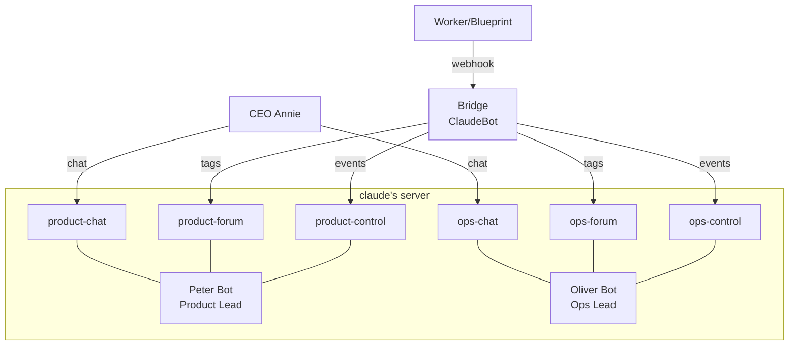

# Plan: Multi-Lead Architecture — 独立 Discord Bot + Agent + Workspace per Lead

**Version**: v1.9.0
**Issue**: GEO-246
**Date**: 2026-03-24
**Source**: `doc/exploration/new/GEO-246-multi-lead-architecture.md`, `doc/research/new/GEO-246-multi-lead-architecture.md`
**Status**: codex-approved

---

## Overview

将 Flywheel Lead 系统从单一 Product Lead 扩展为多 Lead 架构。每个 Lead 拥有独立的 Discord Bot 身份、Agent 人格、Memory 和 Workspace。

**分阶段 rollout**（Codex Round 1 feedback #5）:
1. **Phase A**: 参数化脚本 + 创建 Peter bot + 迁移 product-lead 到 claude-discord runtime → 验证
2. **Phase B**: 创建 Oliver bot + ops-lead.md + 双 Lead 同时运行 → 验证

### 前置依赖

- ✅ GEO-234 (PR #43) — Agent file + supervisor script 基础设施
- ✅ claude's server 已创建 — product/ops forum + chat channels
- ✅ projects.json multi-lead routing — `resolveLeadForIssue()`, `RuntimeRegistry`

### 交付物

| # | 交付物 | Phase | 类型 |
|---|--------|-------|------|
| 1 | `claude-lead.sh` 参数化（支持任意 agent name） | A | 代码改动 |
| 2 | `product-lead.md` 添加 `memory: user` + control channel ID | A | 代码改动 |
| 3 | Peter Discord bot 创建 + control channel | A | 手动操作 |
| 4 | `projects.json` 更新 product-lead（runtime + channel IDs） | A | 配置 |
| 5 | `access.json` 添加 product-lead-control channel | A | 配置 |
| 6 | Phase A 集成测试 — Peter 单 Lead 验证 | A | 测试 |
| 7 | `ops-lead.md` 新建（Ops Lead 人格） | B | 新文件 |
| 8 | Oliver Discord bot 创建 + control channel | B | 手动操作 |
| 9 | `projects.json` 更新 ops-lead（runtime + channel IDs） | B | 配置 |
| 10 | `access.json` 添加 ops-lead-control channel | B | 配置 |
| 11 | `geoforge3d/.gitignore` 扩展 operations/.lead/ | B | 配置 |
| 12 | Phase B 集成测试 — 双 Lead 同时运行 | B | 测试 |

---

## Architecture

### 3-Bot 架构



### Bot Token 分离

```
Bridge 进程 (teamlead daemon)
├── DISCORD_BOT_TOKEN = ClaudeBot token (CLAUDEBOT_TOKEN in ~/.flywheel/.env)
│   → config.discordBotToken
│   → ClaudeDiscordRuntime, ForumTagUpdater, CleanupService

tmux session "peter"
├── DISCORD_BOT_TOKEN = Peter token (PETER_BOT_TOKEN in ~/.flywheel/.env)
│   → Claude Code Discord plugin
│   → 连接 product channels + product-control

tmux session "oliver"
├── DISCORD_BOT_TOKEN = Oliver token (OLIVER_BOT_TOKEN in ~/.flywheel/.env)
│   → Claude Code Discord plugin
│   → 连接 ops channels + ops-control
```

### 环境变量合约

**文件**: `~/.flywheel/.env`（gitignored，secrets 集中管理）

```bash
# Bridge (ClaudeBot)
CLAUDEBOT_TOKEN=<claudebot-token>

# Lead bot tokens
PETER_BOT_TOKEN=<peter-token>
OLIVER_BOT_TOKEN=<oliver-token>

# Bridge config (existing)
TEAMLEAD_API_TOKEN=<api-token>
LINEAR_API_KEY=<linear-key>
DISCORD_GUILD_ID=1485787271192907816
```

**启动时 source**:
```bash
source ~/.flywheel/.env
```

### 路由策略

`resolveLeadForIssue()` 行为（`ProjectConfig.ts:184-207`）：

| 场景 | 路由结果 | 说明 |
|------|---------|------|
| Issue labels 包含 "Product" | → product-lead | Label match, case-insensitive |
| Issue labels 包含 "Operations" | → ops-lead | Label match, case-insensitive |
| Issue labels 同时包含两者 | → product-lead | First match wins（数组顺序） |
| Issue 无 label | → product-lead | Fallback to `leads[0]` |

**设计决策**: 当前 fallback 到 product-lead 是可接受的默认行为。所有 GeoForge3D issues 在 Linear 中必须有 label（Product 或 Operations）。如果路由错误需要更强的保障，将在未来 issue 中添加 fail-closed 模式。

---

## Phase A: Product Lead 迁移

### Step 1: Discord Bot 创建 — Peter（手动）

**操作者**: CEO (Annie)

在 [Discord Developer Portal](https://discord.com/developers/applications) 创建 Peter Application:

1. 创建 Application → Bot tab → Add Bot
2. 记录 Bot Token → 保存到 `~/.flywheel/.env` as `PETER_BOT_TOKEN`
3. 设置 Bot 头像（可选）
4. **Privileged Gateway Intents**: 开启 `Message Content Intent`、`Server Members Intent`
5. **OAuth2 → URL Generator**: scopes = `bot`, permissions = `Send Messages`, `Send Messages in Threads`, `Read Message History`, `View Channels`, `Add Reactions`, `Use Slash Commands`
6. 使用生成的 OAuth2 URL 邀请 Peter 到 claude's server (1485787271192907816)

### Step 2: Control Channel 创建

在 claude's server 的 GeoForge3D category (1485787820198199490) 下创建 1 个 **private** text channel:

| Channel 名称 | 用途 | 可见性 |
|-------------|------|--------|
| `product-lead-control` | Bridge → Product Lead 事件投递 | 隐藏 |

**权限设置**:

| Role/User | View Channel | Send Messages | Send in Threads | Read History |
|-----------|-------------|---------------|----------------|-------------|
| @everyone | ❌ deny | ❌ deny | ❌ deny | ❌ deny |
| ClaudeBot | ✅ allow | ✅ allow | ✅ allow | ✅ allow |
| Peter | ✅ allow | ❌ deny | ❌ deny | ✅ allow |

同时设置已有 channel 的 Peter 权限：
- product-forum: ✅ allow View + Send + Send in Threads + Read
- product-chat: ✅ allow View + Send + Send in Threads + Read
- ops-forum: ❌ deny View
- ops-chat: ❌ deny View

记录 `product-lead-control` 的 Channel ID。

### Step 3: 参数化 `claude-lead.sh`

**文件**: `packages/teamlead/scripts/claude-lead.sh`

#### 3.1 替换硬编码的 agent name

将所有 `product-lead` 硬编码替换为 `$LEAD_ID`（共 5 处）：

| # | 行号 | 变更 |
|---|------|------|
| 1 | 84 | `AGENT_SOURCE="${SCRIPT_DIR}/../agents/${LEAD_ID}.md"` |
| 2 | 85 | `AGENT_TARGET="${HOME}/.claude/agents/${LEAD_ID}.md"` |
| 3 | 96+ | echo msg 使用 `${LEAD_ID}.md` |
| 4 | 106 | `LEAD_WORKSPACE="${LEAD_WORKSPACE:-${HOME}/.flywheel/lead-workspace/${LEAD_ID}}"` |
| 5 | 129 | `CLAUDE_ARGS=(--agent "$LEAD_ID" --channels "plugin:discord@claude-plugins-official")` |

#### 3.2 更新脚本头部注释

```bash
#!/bin/bash
# GEO-195: Manual supervisor script for Claude Lead session.
# GEO-234: Agent file + workspace isolation + flywheel-comm integration.
# GEO-246: Parameterized for multi-lead — supports any agent name.
#
# Usage: ./scripts/claude-lead.sh <lead-id> <project-dir> [project-name]
#
# lead-id: Must match an agent file in packages/teamlead/agents/<lead-id>.md
#   and an agentId in projects.json leads[].
#
# Environment variables:
#   DISCORD_BOT_TOKEN  — Bot token for this Lead's Discord identity (required for Discord)
#   LEAD_WORKSPACE     — Custom workspace directory (optional, default: ~/.flywheel/lead-workspace/<lead-id>)
#   BRIDGE_URL         — Bridge API URL (default: http://localhost:9876)
#   TEAMLEAD_API_TOKEN — Bridge API auth token
#
# Examples:
#   # Product Lead (Peter)
#   source ~/.flywheel/.env
#   DISCORD_BOT_TOKEN=$PETER_BOT_TOKEN \
#   LEAD_WORKSPACE=/Users/xiaorongli/Dev/geoforge3d/product/.lead/product-lead \
#     ./scripts/claude-lead.sh product-lead /Users/xiaorongli/Dev/geoforge3d geoforge3d
#
#   # Ops Lead (Oliver)
#   source ~/.flywheel/.env
#   DISCORD_BOT_TOKEN=$OLIVER_BOT_TOKEN \
#   LEAD_WORKSPACE=/Users/xiaorongli/Dev/geoforge3d/operations/.lead/ops-lead \
#     ./scripts/claude-lead.sh ops-lead /Users/xiaorongli/Dev/geoforge3d geoforge3d
```

#### 3.3 不改的部分

- Session ID 管理（`$SESSION_DIR/${LEAD_ID}.session-id`）— 已使用 `$LEAD_ID`
- Comm DB 路径（`$FLYWHEEL_COMM_DB`）— 按 project 隔离，与 lead 无关
- Bootstrap 调用（`/api/bootstrap/${LEAD_ID}`）— 已使用 `$LEAD_ID`

### Step 4: Agent 文件 — product-lead.md

**文件**: `packages/teamlead/agents/product-lead.md`

#### 4.1 添加 `memory: user` 到 frontmatter

```yaml
---
name: product-lead
description: Flywheel Product Department Lead — manages AI runners, monitors execution, communicates with CEO via Discord
model: opus
memory: user
disallowedTools: Write, Edit, MultiEdit, Agent, NotebookEdit
permissionMode: bypassPermissions
---
```

**Memory scope 选择说明** (Codex Round 1 feedback #3):
- 选用 `memory: user`（`~/.claude/agent-memory/product-lead/`），而非 `memory: project`
- 理由：当前只有 geoforge3d 一个项目，无跨项目冲突。Lead 学到的管理模式（沟通风格、escalation 判断）适合跨项目复用
- mem0 已处理项目级知识隔离（按 project_name + agentId 分区）
- 如果未来同名 agent 跨项目出现 memory 干扰，改为 `memory: project` 或命名空间化 agent name（如 `geoforge3d-product-lead`）

#### 4.2 添加 control channel ID

在 Discord Channel IDs 表中添加：

```markdown
| Product Lead Control | `<control-channel-id>` | Bridge 事件投递（隐藏） |
```

### Step 5: 更新 projects.json — product-lead only

**文件**: `~/.flywheel/projects.json`

**仅更新 product-lead**，保留 ops-lead 在 OpenClaw 配置（Phase B 再切）：

```json
[
  {
    "projectName": "geoforge3d",
    "projectRoot": "/Users/xiaorongli/Dev/geoforge3d",
    "projectRepo": "xrliAnnie/geoforge3d",
    "memoryAllowedUsers": ["annie"],
    "leads": [
      {
        "agentId": "product-lead",
        "forumChannel": "1485787822119194755",
        "chatChannel": "1485787822894878955",
        "match": { "labels": ["Product"] },
        "runtime": "claude-discord",
        "controlChannel": "<product-lead-control-id>"
      },
      {
        "agentId": "ops-lead",
        "forumChannel": "1484696074651304186",
        "chatChannel": "1484697796966613012",
        "match": { "labels": ["Operations"] }
      }
    ]
  }
]
```

### Step 6: 更新 access.json

**文件**: `~/.claude/channels/discord/access.json`

**操作**: 在现有 `groups` 对象中**追加** product-lead-control channel。**保留所有现有顶层字段**（`dmPolicy`、`allowFrom`、`pending`）不变。

仅在 `groups` 中追加一行：
```json
"<product-lead-control-id>": { "requireMention": false, "allowFrom": [] }
```

更新后完整文件应为：
```json
{
  "dmPolicy": "pairing",
  "allowFrom": ["1138241636057481306"],
  "groups": {
    "1485787822894878955": { "requireMention": false, "allowFrom": [] },
    "1485787822119194755": { "requireMention": false, "allowFrom": [] },
    "1485789342541680661": { "requireMention": false, "allowFrom": [] },
    "1485789340989915266": { "requireMention": false, "allowFrom": [] },
    "<product-lead-control-id>": { "requireMention": false, "allowFrom": [] }
  },
  "pending": {}
}
```

### Step 7: Phase A 集成测试

**重要**: Bridge 必须在 Lead 之前启动，因为 `claude-lead.sh` 在启动时会立即调用 `/api/bootstrap/{leadId}`。

#### 7.1 启动 Bridge

```bash
source ~/.flywheel/.env
cd ~/Dev/flywheel/packages/teamlead && DISCORD_BOT_TOKEN=$CLAUDEBOT_TOKEN node dist/index.js
```

验证项：
- [ ] Bridge 注册 product-lead 为 claude-discord runtime
- [ ] Bridge 日志显示 `RuntimeRegistry: N lead runtime(s) registered`

#### 7.2 启动 Product Lead

```bash
source ~/.flywheel/.env
cd ~/Dev/flywheel/packages/teamlead && \
DISCORD_BOT_TOKEN=$PETER_BOT_TOKEN \
LEAD_WORKSPACE=/Users/xiaorongli/Dev/geoforge3d/product/.lead/product-lead \
  ./scripts/claude-lead.sh product-lead /Users/xiaorongli/Dev/geoforge3d geoforge3d
```

验证项：
- [ ] Agent file 正确复制到 `~/.claude/agents/product-lead.md`
- [ ] Workspace 使用 `$LEAD_WORKSPACE` 而非默认路径
- [ ] Bootstrap 发送成功（Bridge 已在运行）
- [ ] Claude Code 启动并连接 Discord（Peter 身份）

#### 7.3 验证跨 bot 消息投递（关键风险项）

- [ ] Bridge bootstrap 消息（ClaudeBot 身份）到达 product-lead-control channel
- [ ] Peter 的 Claude Code Discord plugin 收到该消息并响应
- [ ] CEO 在 product-chat 发消息 → Peter 回复
- 如果跨 bot 投递失败 → Fallback: 在 projects.json 中增加 per-lead bot token 字段，Bridge 用 Lead 的 token 投递

**Phase A 通过后方可进入 Phase B。**

---

## Phase B: Ops Lead 上线

### Step 8: Discord Bot 创建 — Oliver（手动）

同 Step 1 流程，创建 Oliver Application:
1. 创建 → 获取 token → 保存到 `~/.flywheel/.env` as `OLIVER_BOT_TOKEN`
2. 开启 Intents
3. 邀请到 claude's server

### Step 9: Ops Control Channel 创建

在 GeoForge3D category 下创建 `ops-lead-control`，权限：

| Role/User | View Channel | Send Messages | Send in Threads | Read History |
|-----------|-------------|---------------|----------------|-------------|
| @everyone | ❌ deny | ❌ deny | ❌ deny | ❌ deny |
| ClaudeBot | ✅ allow | ✅ allow | ✅ allow | ✅ allow |
| Oliver | ✅ allow | ❌ deny | ❌ deny | ✅ allow |

设置 Oliver 的 channel 权限：
- ops-forum: ✅ allow View + Send + Send in Threads + Read
- ops-chat: ✅ allow View + Send + Send in Threads + Read
- product-forum: ❌ deny View
- product-chat: ❌ deny View

### Step 10: 创建 `ops-lead.md`

**文件**: `packages/teamlead/agents/ops-lead.md`（新建）

**Frontmatter**:
```yaml
---
name: ops-lead
description: Flywheel Operations Department Lead — manages 3D printing operations, order processing, customer service via Discord
model: opus
memory: user
disallowedTools: Write, Edit, MultiEdit, Agent, NotebookEdit
permissionMode: bypassPermissions
---
```

**v1 行为契约** (Codex Round 1 feedback #6):

ops-lead v1 **保留**与 product-lead 相同的 Bridge 交互能力：
- ✅ 事件处理流程（读取事件 → 查询详情 → Forum reply → Chat 通知）
- ✅ CEO 指令执行（approve, retry, reject, shelve, terminate）
- ✅ Runner 通信（flywheel-comm 检查 pending、respond、send）
- ✅ Bridge API 访问（sessions 查询、action 执行）

**不同的部分（v1 delta）**:

| 维度 | product-lead | ops-lead |
|------|-------------|----------|
| 核心身份 | 产品开发负责人 | **运营负责人** |
| 管理对象 | Engineer, PM, Designer | **3D 打印运营, 订单处理, 客服** |
| 关注指标 | PR merges, feature delivery | **订单完成率, 打印成功率, 客户响应** |
| Issue 类型 | Feature dev, bug fixes | **运营流程优化, 自动化脚本** |
| Channel IDs | product-forum/chat/control | **ops-forum/chat/control** |
| Guild ID | 同 | 同 |

**推迟到未来版本**:
- MBTI/性格差异化
- 非代码运营 workflow（订单管理系统集成）
- Ops-specific Bridge actions（如果需要）

### Step 11: 更新 projects.json — ops-lead

将 ops-lead 切换到 claude-discord runtime:

```json
{
  "agentId": "ops-lead",
  "forumChannel": "1485789340989915266",
  "chatChannel": "1485789342541680661",
  "match": { "labels": ["Operations"] },
  "runtime": "claude-discord",
  "controlChannel": "<ops-lead-control-id>"
}
```

### Step 12: 更新 access.json + .gitignore

**access.json**: 在现有 `groups` 对象中追加 ops-lead-control channel group（保留所有其他顶层字段不变）。

**geoforge3d/.gitignore** (Codex Round 1 feedback #2):

**保留**现有的窄模式，扩展 operations/.lead/:

```gitignore
# OpenClaw agent runtime data (product)
product/.lead/*/.openclaw/
product/.lead/*/sessions/
product/.lead/*/memory/
product/.lead/*/*.bak.*

# Lead workspace runtime data (operations)
operations/.lead/*/.openclaw/
operations/.lead/*/sessions/
operations/.lead/*/memory/
operations/.lead/*/*.bak.*
```

这样保留对 `product/.lead/product-lead/SOUL.md` 等已 tracked 文件的兼容性。

### Step 13: Phase B 集成测试

#### 13.1 双 Lead 同时运行

**顺序**: Bridge → Lead 1 → Lead 2（Bridge 必须先启动，Lead 启动时发 bootstrap）

```bash
source ~/.flywheel/.env

# Terminal 1: Bridge (必须先启动)
cd ~/Dev/flywheel/packages/teamlead && DISCORD_BOT_TOKEN=$CLAUDEBOT_TOKEN node dist/index.js

# Terminal 2: Product Lead (Peter)
tmux new -s peter
source ~/.flywheel/.env && cd ~/Dev/flywheel/packages/teamlead && \
DISCORD_BOT_TOKEN=$PETER_BOT_TOKEN \
LEAD_WORKSPACE=/Users/xiaorongli/Dev/geoforge3d/product/.lead/product-lead \
  ./scripts/claude-lead.sh product-lead /Users/xiaorongli/Dev/geoforge3d geoforge3d

# Terminal 3: Ops Lead (Oliver)
tmux new -s oliver
source ~/.flywheel/.env && cd ~/Dev/flywheel/packages/teamlead && \
DISCORD_BOT_TOKEN=$OLIVER_BOT_TOKEN \
LEAD_WORKSPACE=/Users/xiaorongli/Dev/geoforge3d/operations/.lead/ops-lead \
  ./scripts/claude-lead.sh ops-lead /Users/xiaorongli/Dev/geoforge3d geoforge3d
```

#### 13.2 验证项

- [ ] Peter 和 Oliver 同时在线
- [ ] CEO 在 product-chat 发消息 → 仅 Peter 回复
- [ ] CEO 在 ops-chat 发消息 → 仅 Oliver 回复
- [ ] Bridge event with "Product" label → 投递到 product-control → Peter 处理
- [ ] Bridge event with "Operations" label → 投递到 ops-control → Oliver 处理
- [ ] Peter 不收到 ops channels 的消息
- [ ] Oliver 不收到 product channels 的消息
- [ ] CEO 不看到 control channels

---

## Risk Mitigation

| 风险 | 概率 | 缓解 |
|------|------|------|
| Discord plugin 过滤其他 bot 消息 | 中 | Phase A 先验证；Fallback: Bridge 使用 Lead token 投递 |
| 两个 Claude Code 实例共享 `~/.claude/` | 低 | CWD 不同 → session 目录自动隔离 |
| Bot token 泄露 | 低 | env var only, `~/.flywheel/.env` gitignored |
| Workspace 在项目内 → 意外修改代码 | 低 | `disallowedTools` 缓解；GEO-234 已接受 |
| `memory: user` 跨项目共享 | 低 | 当前单项目；mem0 处理项目隔离；可改 `memory: project` |
| Rollout 破坏现有 product-lead | 中 | 分阶段：Phase A 仅迁移 product-lead，验证后再加 ops-lead |

---

## Rollback Plan

### Phase A rollback
1. `claude-lead.sh` — `git revert`（参数化改动向后兼容，不影响 product-lead 启动）
2. `projects.json` — 恢复 product-lead 到 OpenClaw channel IDs，移除 runtime/controlChannel
3. `access.json` — 移除 control channel

### Phase B rollback
1. `projects.json` — 恢复 ops-lead 到 OpenClaw channel IDs
2. `access.json` — 移除 ops-lead-control
3. 停止 Oliver tmux session
