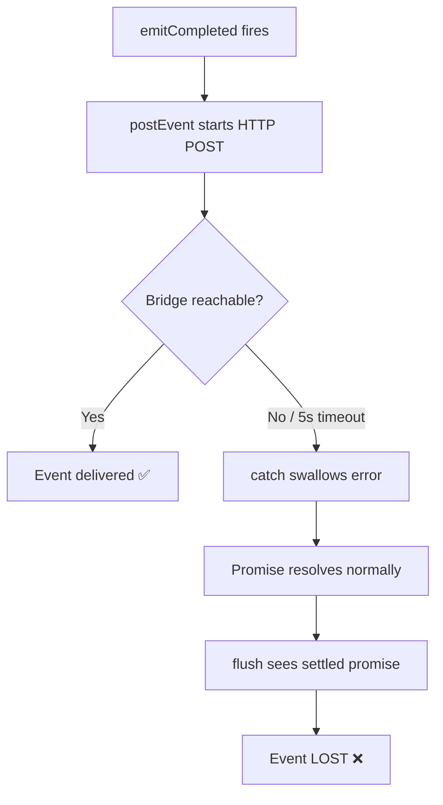

# Plan: Fix session_completed Event Delivery

**Version**: v1.9.1
**Issue**: GEO-261
**Date**: 2026-03-25
**Source**: `doc/exploration/new/GEO-261-session-completed-missing.md`, `doc/research/new/GEO-261-session-completed-missing.md`
**Status**: codex-approved

## Problem

Runner 成功完成但 Bridge 未收到 `session_completed` 事件。根因：`postEvent()` HTTP 请求失败时错误被静默吞掉，无重试，事件丢失。

## Root Cause



## Fix Strategy

**核心思路**: Terminal events（session_completed / session_failed）是关键事件，必须确保投递。对它们添加重试 + 直接 await。Non-terminal events（started / heartbeat）保持 fire-and-forget。

**Contract**: `postEventReliable()` 完全自包含 — 内部处理所有重试、超时、日志。调用者只需 `await`，无需额外 timeout/catch。（Codex Round 1 Issue #3: 选方案 B）

## Changes

### Change 1: `ExecutionEventEmitter.ts` — 添加 `postEventReliable()` + `buildHeaders()`

新增 private 方法，对 terminal events 提供 1 次重试（仅 transient failure）：

```typescript
/** Shared header construction for postEvent/postEventReliable. */
private buildHeaders(): Record<string, string> {
    const headers: Record<string, string> = {
        "Content-Type": "application/json",
    };
    if (this.authToken) {
        headers.Authorization = `Bearer ${this.authToken}`;
    }
    return headers;
}

/**
 * Post a terminal event with retry on transient failures.
 * Fully self-contained: handles retry, timeout, and logging internally.
 * Never throws — logs console.error on final failure.
 */
private async postEventReliable(
    body: Record<string, unknown>,
    maxRetries = 1,
): Promise<void> {
    const eventType = body.event_type as string;
    for (let attempt = 0; attempt <= maxRetries; attempt++) {
        const controller = new AbortController();
        const timeout = setTimeout(() => controller.abort(), 5_000);
        try {
            const res = await fetch(`${this.baseUrl}/events`, {
                method: "POST",
                headers: this.buildHeaders(),
                body: JSON.stringify(body),
                signal: controller.signal,
            });
            if (res.ok) return;  // Success — done

            // 4xx = permanent failure, don't retry (except 429)
            if (res.status >= 400 && res.status < 500 && res.status !== 429) {
                console.error(
                    `[TeamLeadClient] ${eventType} permanently rejected: ${res.status} ${res.statusText}`,
                );
                return;
            }

            // 5xx or 429 = transient, retry if possible
            const msg = `[TeamLeadClient] ${eventType} rejected: ${res.status} ${res.statusText}`;
            if (attempt < maxRetries) {
                console.warn(`${msg} (retrying in 1s...)`);
                await new Promise(r => setTimeout(r, 1000));
            } else {
                console.error(`${msg} (no retries left)`);
            }
        } catch (err) {
            // Network error or abort timeout = transient, retry if possible
            const msg = `[TeamLeadClient] ${eventType} failed: ${err instanceof Error ? err.message : String(err)}`;
            if (attempt < maxRetries) {
                console.warn(`${msg} (retrying in 1s...)`);
                await new Promise(r => setTimeout(r, 1000));
            } else {
                console.error(`${msg} (no retries left)`);
            }
        } finally {
            clearTimeout(timeout);
        }
    }
}
```

**设计决策**（合并 Codex Round 1 Issue #1, #3, #4 反馈）:
- `maxRetries = 1`（默认重试 1 次，总共 2 次尝试）
- 退避 1 秒（简单，够用）
- **只对 transient failure 重试**：5xx、429、网络错误、abort timeout。4xx 永久失败立即返回
- **clearTimeout 放在 finally**：修复 timer 泄漏
- **完全自包含**：永不 throw，内部处理所有日志。调用者无需 catch
- 从 `postEvent()` 提取 `buildHeaders()` 减少重复
- `postEvent()` 保持不变（供 emitStarted 等 best-effort 方法使用）

### Change 2: `ExecutionEventEmitter.ts` — 改造 `emitCompleted()` 和 `emitFailed()`

Terminal events 直接 await `postEventReliable()`，不再 fire-and-forget：

```typescript
async emitCompleted(env, result, summary): Promise<void> {
    await this.postEventReliable({
        event_id: randomUUID(),
        execution_id: env.executionId,
        issue_id: env.issueId,
        project_name: env.projectName,
        event_type: "session_completed",
        payload: {
            issueIdentifier: env.issueIdentifier,
            issueTitle: env.issueTitle,
            evidence: result.evidence,
            decision: result.decision,
            summary,
            labels: result.labels,
            projectId: result.projectId,
            exitReason: result.exitReason,
            consecutiveFailures: result.consecutiveFailures,
        },
    });
}

async emitFailed(env, error, lastActivity): Promise<void> {
    await this.postEventReliable({
        event_id: randomUUID(),
        execution_id: env.executionId,
        issue_id: env.issueId,
        project_name: env.projectName,
        event_type: "session_failed",
        payload: {
            issueIdentifier: env.issueIdentifier,
            issueTitle: env.issueTitle,
            error,
            lastActivity,
            labels: env.labels,
        },
    });
}
```

**重要**: 不再调用 `this.track(p)`，因为 promise 已直接 await。`flush()` 不需要管这些。

`emitStarted()` 和 `emitHeartbeat()` 保持不变（fire-and-forget via `track()`）。

### Change 3: `Blueprint.ts` — 简化 `emitTerminal()`

删除 `Promise.race` 超时 — 所有超时逻辑已收敛到 `postEventReliable()` 内部（Codex Round 1 Issue #1）：

```typescript
private async emitTerminal(
    env: EventEnvelope,
    result: BlueprintResult,
): Promise<void> {
    if (!this.eventEmitter) return;
    try {
        if (result.success || result.decision) {
            const summary = this.buildSummary(result);
            await this.eventEmitter.emitCompleted(env, result, summary);
        } else {
            await this.eventEmitter.emitFailed(env, result.error ?? "unknown");
        }
    } catch (err) {
        // postEventReliable never throws, but defensive catch for interface changes
        console.error(
            `[Blueprint] emitTerminal failed: ${err instanceof Error ? err.message : String(err)}`,
        );
    }
}
```

**关键改动**:
- 删除 `Promise.race` — 不再有 orphaned promise 风险
- `emitCompleted()` / `emitFailed()` 现在真正 await HTTP POST + retry
- 保留 try-catch 作为防御性保护（interface contract 可能变化）
- 日志从 `warn` 改为 `error`

### ~~Change 4: `run-issue.ts` — 添加 SIGTERM handler~~ **DEFERRED**

SIGTERM graceful shutdown 涉及更广的生命周期重构（需要 hoist 可变状态、复用 teardownComponents、添加 reentrancy guard），不适合在 bugfix 中半做。拆到单独 issue。（Codex Round 1 Issue #2）

当前 bugfix 通过 Change 1-3 已充分解决正常路径的事件丢失。SIGTERM 路径需要单独的 "graceful termination" 计划。

## Files Modified

| File | Change |
|------|--------|
| `packages/edge-worker/src/ExecutionEventEmitter.ts` | 添加 `postEventReliable()` + `buildHeaders()`, 改造 `emitCompleted()` / `emitFailed()` |
| `packages/edge-worker/src/Blueprint.ts` | `emitTerminal()` 删除 Promise.race, warn → error |
| `packages/edge-worker/src/__tests__/ExecutionEventEmitter.test.ts` | 新增重试测试 |
| `packages/edge-worker/src/__tests__/Blueprint.test.ts` | 新增 emitTerminal await 测试 |

## Test Plan

### Unit Tests — ExecutionEventEmitter.test.ts

1. **[NEW] terminal event retries on 500 then succeeds**: 第一次 500, 第二次 200 → 两次 POST, 事件最终送达
2. **[NEW] terminal event retries on network error then succeeds**: 第一次连接失败, 第二次 200 → 事件送达
3. **[NEW] terminal event does NOT retry on 400**: 立即 console.error, 只一次 POST
4. **[NEW] terminal event fails after max retries**: 两次都 5xx → console.error, 不抛异常
5. **[NEW] terminal event succeeds on first try**: 不触发重试 → 一次 POST
6. **[NEW] emitStarted still uses fire-and-forget**: emitStarted 不 await postEventReliable
7. **[EXISTING] emitStarted POSTs to /events**: 不变
8. **[EXISTING] emitCompleted includes evidence**: 更新为 await 语义
9. **[EXISTING] emitFailed includes error**: 更新为 await 语义
10. **[EXISTING] silently catches HTTP errors**: 更新 — 对 started 仍静默, 对 terminal 改为 error
11. **[EXISTING] flush() drains pending**: 更新 — completed/failed 不再走 track/flush 路径

### Unit Tests — Blueprint.test.ts（Codex Round 1 Issue #5）

12. **[NEW] emitTerminal awaits emitCompleted**: 用 stubbed emitter 验证 emitCompleted 被 await
13. **[NEW] emitTerminal awaits emitFailed on failure path**: 同上，failure path
14. **[NEW] emitTerminal handles emitter exception defensively**: emitter throws → console.error, 不影响 Blueprint.run()

### Integration Test (Manual)

- [ ] 启动 Bridge, 跑 `run-issue.ts`, 确认 session_completed 到达
- [ ] 停 Bridge, 跑 `run-issue.ts`, 确认 retry log 输出, 最终 error log

## Acceptance Criteria

- [ ] Runner 成功完成时 Bridge 收到 `session_completed`（transient failure 重试 1 次）
- [ ] Runner 失败时 Bridge 收到 `session_failed`（transient failure 重试 1 次）
- [ ] 4xx 永久失败不重试，立即 error log
- [ ] HTTP 失败日志 terminal events 用 error level
- [ ] clearTimeout 在 finally 中清理
- [ ] 现有测试不 break
- [ ] 新测试覆盖重试逻辑 + Blueprint emitTerminal await

## Risk Assessment

| Risk | Mitigation |
|------|------------|
| 重试增加 session 完成延迟 | 最坏约 +11s（5s timeout + 1s backoff + 5s timeout），可接受 |
| 重复事件（重试成功但首次也成功） | Bridge 已有 `event_id` 幂等处理 |
| SIGTERM 路径仍未覆盖 | 已 defer 到单独 issue；正常路径已修复 |

## Out of Scope

- **SIGTERM graceful shutdown**（复杂，涉及生命周期重构，单独 issue）
- Bridge 端 orphan session 超时检测（单独 issue）
- `emitStarted` / `emitHeartbeat` 重试（non-critical events）
- Connection pooling / keep-alive（过度优化）

## Codex Review History

| Round | Verdict | Key Changes |
|-------|---------|-------------|
| 1 | CHANGES REQUESTED | 5 issues: Promise.race orphan, SIGTERM scope, contract inconsistency, retry conditions, test gaps |
| 2 | APPROVED | Addressed all 5: removed Promise.race, deferred SIGTERM, chose Option B contract, added transient-only retry, added Blueprint tests |
