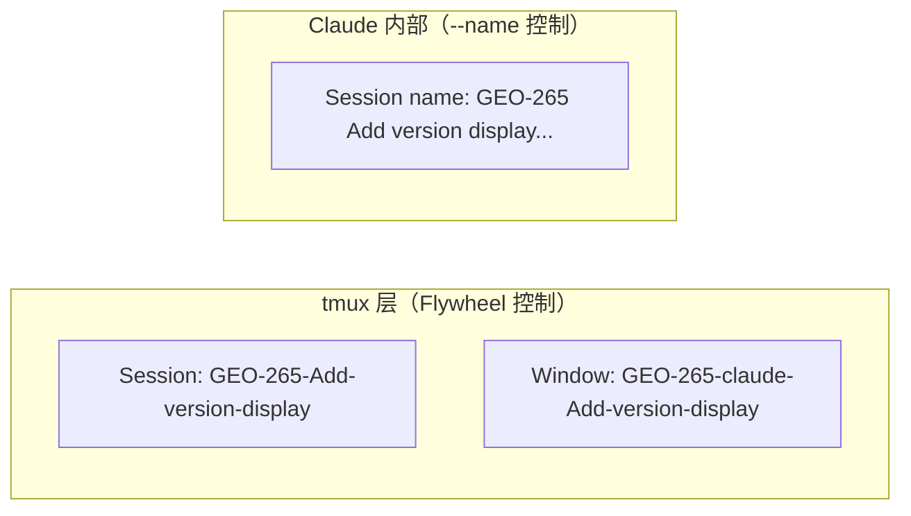
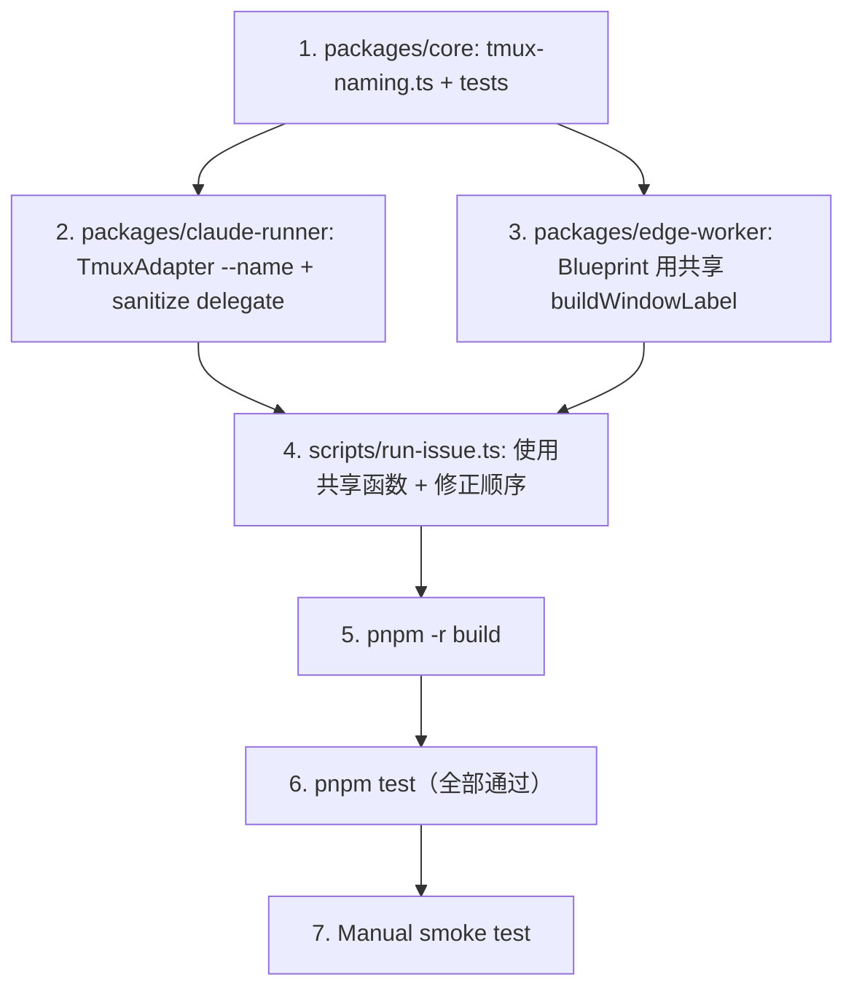

# Plan: Runner tmux session 用 issue ID + title 命名

**Version**: v1.9.1
**Issue**: GEO-269
**Date**: 2026-03-27
**Source**: `doc/exploration/new/GEO-269-tmux-session-naming.md`, `doc/research/new/GEO-269-tmux-session-naming.md`
**Status**: codex-approved

## Background

当前 Runner tmux session/window 命名不够直观：

| 层级 | 当前 | 示例 | 问题 |
|------|------|------|------|
| tmux session | `issueId` | `GEO-265` | `tmux ls` 看不出内容 |
| tmux window | `{runner}:{title}` | `claude:Add-version-display...` | 没有 issue ID，无法反查 |
| Claude session | 无 display name | — | `/resume` 列表无法区分 |

**Research 关键发现**：
1. Claude CLI `--name` 可设 session display name，但 `allow-rename off` 阻止其修改 tmux 窗口标题
2. `sessionDisplayName` 字段已存在（GEO-157 引入）但**从未被消费**
3. `run-issue.ts:352-360` 有 `buildWindowLabel()` 的**硬编码副本**，改命名逻辑会导致不同步

## Design

### 方案：混合命名（Research F6 方案 C）



| 层级 | 新格式 | 示例 | 最大长度 |
|------|--------|------|---------|
| tmux session | `{issueId}-{sanitizedTitle}` | `GEO-95-OSM-attribution-add-OpenStreetMap-license` | 50 chars |
| tmux window | `{issueId}-{runner}-{cleanTitle}` | `GEO-95-claude-OSM-attribution-add-OpenStreetMap` | 50 chars（TmuxAdapter sanitize 后） |
| Claude `--name` | `{issueId} {cleanTitle}` | `GEO-95 OSM attribution-add OpenStreetMap license notice in UI` | 无限制 |

> **注意**：`cleanIssueTitle()` 的 `.replace(/\s*—\s*/g, "-")` 会将 em-dash 及其两侧空格替换为单个 hyphen（如 `attribution — add` → `attribution-add`），并 strip `[P0]` 等 priority tag。三层命名共享同一个 `cleanIssueTitle()` 输出，保持单一真相。

### 共享命名模块

将命名逻辑提取到 `packages/core/src/tmux-naming.ts`，让 `Blueprint.ts` 和 `run-issue.ts` 共享同一份实现，消除两处硬编码命名逻辑各自漂移的风险。

```typescript
// packages/core/src/tmux-naming.ts

/** Strip priority tags [P0], [P1], etc. and normalize dashes */
export function cleanIssueTitle(title: string): string {
  return title
    .replace(/\[P\d+\]\s*/gi, "")
    .replace(/\s*—\s*/g, "-")
    .trim();
}

/** Sanitize string for tmux session/window name */
export function sanitizeTmuxName(name: string, maxLen = 50): string {
  return name
    .replace(/[^a-zA-Z0-9-]/g, "-")
    .replace(/-{2,}/g, "-")
    .replace(/-$/, "")
    .slice(0, maxLen);
}

/** Build tmux session name: sanitized "{issueId}-{cleanTitle}" */
export function buildSessionName(issueId: string, title: string): string {
  return sanitizeTmuxName(`${issueId}-${cleanIssueTitle(title)}`);
}

/**
 * Build tmux window label: "{issueId}-{runner}-{cleanTitle}"
 *
 * NOTE: 返回值未 sanitize — TmuxAdapter.sanitizeWindowName() 会在
 * tmux new-window 前做最终 sanitize（和当前行为一致）。
 */
export function buildWindowLabel(issueId: string, runner: string, title: string): string {
  return `${issueId}-${runner}-${cleanIssueTitle(title)}`;
}
```

### Label 层级说明

```
buildWindowLabel()  →  未 sanitize 的 label（含空格等）
        ↓
TmuxAdapter.execute()  →  sanitizeWindowName() → 最终 tmux window name
```

`buildWindowLabel` 返回的是 **pre-sanitize** label，TmuxAdapter 在 `tmux new-window -n` 时做最终 sanitize。这和当前行为一致 — `Blueprint.test.ts` 断言的是传给 adapter 的 raw label，不是最终 tmux window 名。

## Changes

### 1. 新增共享命名模块

**文件**: `packages/core/src/tmux-naming.ts`（新建）

Export 4 个纯函数：`cleanIssueTitle`、`sanitizeTmuxName`、`buildSessionName`、`buildWindowLabel`。

**文件**: `packages/core/src/index.ts`

添加 re-export：`export * from "./tmux-naming.js";`

### 2. TmuxAdapter — 委托共享 sanitize + `--name` 支持

**文件**: `packages/claude-runner/src/TmuxAdapter.ts`

**2a. `sanitizeWindowName` 委托共享函数**：

```typescript
import { sanitizeTmuxName } from "flywheel-core";

// 保留方法（测试和内部调用处有引用），内部委托共享函数
sanitizeWindowName(name: string): string {
  return sanitizeTmuxName(name);
}
```

**2b. `buildClaudeArgs` 传 `--name`**：

利用已有的 `sessionDisplayName` 字段：

```typescript
if (ctx.sessionDisplayName) args.push("--name", ctx.sessionDisplayName);
```

插入位置：在 `--model` 之后、prompt 之前。

### 3. Blueprint — 使用共享 `buildWindowLabel` + 清洗 `sessionDisplayName`

**文件**: `packages/edge-worker/src/Blueprint.ts`

- 删除私有 `buildWindowLabel` 函数（lines 659-674）
- 从 `flywheel-core` 导入 `buildWindowLabel` 和 `cleanIssueTitle`
- 调用处（line 387-391）不变 — 函数签名相同
- **`sessionDisplayName`**（line 395）改用 `cleanIssueTitle`，和 tmux 层保持一致：

```typescript
import { buildWindowLabel, cleanIssueTitle } from "flywheel-core";

// Line 395 — strip [P0] 等 priority tag，三层命名一致
sessionDisplayName: `${hydrated.issueId} ${cleanIssueTitle(hydrated.issueTitle)}`,
```

### 4. run-issue.ts — 使用共享函数 + 修正执行顺序

**文件**: `scripts/run-issue.ts`

**4a. 导入方式**：

沿用现有脚本导入模式 — 通过相对路径引用 `src/`（`run-issue.ts` 本身就是通过 `npx tsx` 运行，可以直接引 `.ts` 源码）：

```typescript
import {
  buildSessionName,
  buildWindowLabel,
  sanitizeTmuxName,
} from "../packages/core/src/tmux-naming.js";
```

> 这和现有 `import { loadConfig } from "../packages/teamlead/src/config.js"` 模式一致（line 32）。

**4b. 修正执行顺序**：

当前 `tmuxSessionName` 在 line 198 计算（此时 `issueData` 尚不可用）。改为先声明临时值，issue 解析后再计算最终值：

```typescript
// line 198（改为 let）
let tmuxSessionName = issueId; // 临时值，用于早期 log

// ... (prerequisites + git checks) ...

// line 271 之后（issueData 已解析）：
tmuxSessionName = buildSessionName(issueId, issueData.title);
```

**4c. 统一 auto-interaction window label**（line 352-360）：

使用共享函数替代硬编码：

```typescript
const windowLabel = sanitizeTmuxName(
  buildWindowLabel(issueId, "claude", issueData.title),
);
const tmuxTarget = `${tmuxSessionName}:${windowLabel}`;
```

### 5. 更新类型注释

**文件**: `packages/core/src/adapter-types.ts` (line 177-178)

```typescript
// Before
/** Display name for the Claude session (sent via /rename after startup) */

// After
/** Display name for the Claude session (passed as --name to CLI) */
```

**文件**: `packages/core/src/flywheel-runner-types.ts` (line 39-40)

同步更新注释。

### 6. Test Updates

**6a. `packages/core/src/__tests__/tmux-naming.test.ts`**（新建）：

共享命名模块的完整单测 — 这是消除命名漂移的核心 contract test：

```typescript
describe("cleanIssueTitle", () => {
  it("strips [P0], [P1] priority tags");
  it("converts em-dash to hyphen");
  it("trims whitespace");
  it("handles title with no priority tag");
});

describe("sanitizeTmuxName", () => {
  it("replaces special chars with dash");
  it("collapses consecutive dashes: 'a--b---c' → 'a-b-c'");
  it("strips trailing dash: 'abc-' → 'abc'");
  it("truncates to 50 chars by default");
  it("accepts custom maxLen");
});

describe("buildSessionName", () => {
  it("produces sanitized '{issueId}-{cleanTitle}'");
  it("handles long titles (truncate to 50)");
});

describe("buildWindowLabel", () => {
  it("produces '{issueId}-{runner}-{cleanTitle}' (unsanitized)");
  it("strips priority tags from title");
  it("preserves spaces (sanitize is caller's responsibility)");
});
```

**6b. `TmuxAdapter.test.ts`** — 新增测试：

```typescript
it("passes --name when sessionDisplayName is set", async () => {
  // makeCtx with sessionDisplayName → verify --name in claude args
});

it("does NOT pass --name when sessionDisplayName is absent", async () => {
  // makeCtx without sessionDisplayName → verify no --name
});
```

**6c. `Blueprint.test.ts`** — 更新现有断言 + 新增断言：

Line 238 当前断言：`expect(execCall.label).toBe("claude:Issue GEO-101 title")`

更新为（`buildWindowLabel` 返回 unsanitized）：
```typescript
expect(execCall.label).toBe("GEO-101-claude-Issue GEO-101 title");
```

新增 `sessionDisplayName` 断言：
```typescript
expect(execCall.sessionDisplayName).toBe("GEO-101 Issue GEO-101 title");
```

## Implementation Order



## Not Changed（有意保持不变）

| 项目 | 原因 |
|------|------|
| CommDB `registerSession` | 已存储 `session:windowId`，format-agnostic |
| `session-capture.ts` | 从 CommDB 读取完整 tmux target |
| `allow-rename off` 设置 | 保持关闭 — Flywheel 控制 tmux 命名 |
| `DagDispatcher.ts` AppleScript | session name 通过变量传入 |

## Risks

| Risk | Impact | Mitigation |
|------|--------|-----------|
| 共享模块新依赖路径 | `run-issue.ts` 导入 | 沿用现有 `../packages/*/src/` 模式，`npx tsx` 支持 |
| 50 chars 截断丢信息 | 看不到完整 title | Issue ID ~8 chars + ~42 chars title，够用 |
| `--name` 旧版 CLI 不支持 | Claude 启动失败 | 2026-01 已支持，当前 CLI 远超 |

## Out of Scope

- GEO-270（自动清理 tmux session）
- 移除 `allow-rename off`
- 将 auto-interaction trust prompt 移入 TmuxAdapter

## Test Plan

- [ ] Unit: `tmux-naming.test.ts` — 4 个函数全覆盖（contract test）
- [ ] Unit: `TmuxAdapter.test.ts` — `--name` 传参 / 缺省
- [ ] Unit: `Blueprint.test.ts` — label 断言 + sessionDisplayName 断言
- [ ] Build: `pnpm -r build` 通过
- [ ] All tests: `pnpm test` 全部通过
- [ ] Manual smoke test:
  1. `pnpm -r build`
  2. `npx tsx scripts/run-issue.ts GEO-95 ~/Dev/GeoForge3D`
     - GEO-95 已在 `KNOWN_ISSUES` fixture 中
  3. 验证 `tmux ls` 显示含 title 的 session name（如 `GEO-95-OSM-attribution-add-OpenStreetMap-licens`）
  4. 验证 `tmux list-windows` 显示含 issue ID 的 window name
  5. 验证 auto-interaction（trust prompt 确认）正常工作

## Codex Review History

### Round 1 — CHANGES REQUESTED (5 issues)
1. **session name 执行顺序** → 接受：延迟计算
2. **命名逻辑重复** → 接受：提取 `tmux-naming.ts`
3. **build 步骤缺失** → 接受：加入 `pnpm -r build`
4. **sessionDisplayName 语义/注释** → 接受：用 `cleanIssueTitle` + 更新注释
5. **测试接缝** → 接受：测试共享模块 + 更新 Blueprint 断言

### Round 2 — CHANGES REQUESTED (3 issues)
1. **run-issue.ts 导入模式** → 接受：改用 `../packages/core/src/tmux-naming.js` 相对路径
2. **Blueprint.test.ts 断言值** → 接受：label 是 unsanitized 值 + 新增 `sessionDisplayName` 断言
3. **smoke test fixture** → 接受：改用 GEO-95

### Round 3 — CHANGES REQUESTED (1 issue)
1. **sessionDisplayName 示例不一致** → 接受：更新示例

### Round 4 — CHANGES REQUESTED (1 issue, Round 3 续)
1. **示例仍不匹配 regex 实际输出** → 接受：regex `\s*—\s*` 会消除 em-dash 两侧空格，示例从 `attribution - add` 修正为 `attribution-add`，并在注释中明确说明 regex 行为
