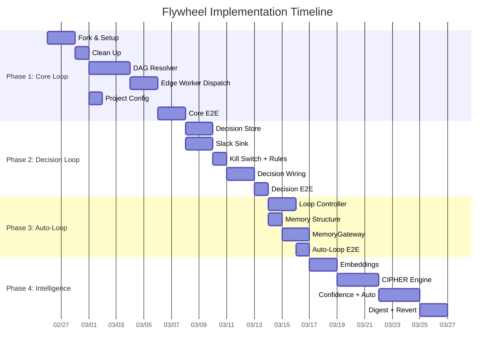

# Flywheel Orchestrator Implementation Plan

> **For Claude:** Use /implement to execute this plan.

**Goal:** 构建 TypeScript orchestrator（fork Cyrus），实现 Linear issues → DAG → Claude Code → auto PR → Decision Layer → Slack 的全自动开发工作流。

**Architecture:** Fork Cyrus monorepo (~80% 复用)，新增 4 个 package：`dag-resolver`（Kahn 算法拓扑排序）、`decision-layer`（SQLite + sqlite-vec + Haiku 的 progressive autonomy engine）、`memory-gateway`（统一存储抽象）、`config`（项目配置 loader）。通过 Cyrus 已有的 `IActivitySink` 接口接入 Slack 通知，修改 `edge-worker` 的 dispatch 逻辑以支持 DAG ordering。

**Domain:** backend
**Research doc:** doc/research/new/001-flywheel-orchestrator.md, 002, 003
**Status:** draft

---

## Phase Overview



---

## Phase 1: Core Loop (Week 1-2)

**目标**: 一个 issue 从 Linear → Claude Code → PR 能跑通，基于 dependency DAG 自动选择下一个 issue。

### Task 1: Fork Cyrus & Dev Environment Setup

**Files:**
- Create: `README.md` (update from Cyrus)
- Modify: `package.json` (rename to @flywheel)
- Modify: `pnpm-workspace.yaml`

**Step 1: Fork and clone**
```bash
gh repo fork ceedaragents/cyrus --clone --fork-name flywheel
cd flywheel
```

**Step 2: Rename package scope**
Update root `package.json`:
```json
{
  "name": "@flywheel/root",
  "private": true
}
```

Update all `packages/*/package.json` — change `@cyrus/` scope to `@flywheel/`:
```bash
# In each package.json under packages/
# Change: "@cyrus/core" -> "@flywheel/core"
# Change: "@cyrus/claude-runner" -> "@flywheel/claude-runner"
# etc.
```

**Step 3: Install and verify**
```bash
pnpm install && pnpm build && pnpm test
```

**Step 4: Commit**
```bash
git add -A
git commit -m "chore: fork Cyrus, rename to @flywheel scope"
```

**Verification:**
- Run: `pnpm build`
- Expected: BUILD SUCCESS (all packages compile)
- Run: `pnpm test`
- Expected: existing Cyrus tests pass

---

### Task 2: Clean Up Unused Packages

**Files:**
- Delete: `packages/codex-runner/`
- Delete: `packages/cursor-runner/`
- Delete: `packages/gemini-runner/`
- Delete: `packages/simple-agent-runner/`
- Delete: `packages/cloudflare-tunnel-client/`
- Delete: `apps/f1/`
- Modify: `pnpm-workspace.yaml` (remove references)
- Modify: `packages/edge-worker/package.json` (remove unused deps)
- Modify: `packages/edge-worker/src/RunnerSelectionService.ts` (keep only claude-runner)

**Step 1: Remove unused packages**
```bash
rm -rf packages/codex-runner packages/cursor-runner packages/gemini-runner
rm -rf packages/simple-agent-runner packages/cloudflare-tunnel-client
rm -rf apps/f1
```

**Step 2: Update workspace config**
Remove deleted packages from `pnpm-workspace.yaml`.

**Step 3: Update RunnerSelectionService**
Simplify to only support `claude-runner`. Remove imports and switch cases for other runners.

**Step 4: Update edge-worker dependencies**
Remove `@flywheel/codex-runner`, `@flywheel/cursor-runner`, `@flywheel/gemini-runner` from `packages/edge-worker/package.json`.

**Step 5: Verify and commit**
```bash
pnpm install && pnpm build && pnpm test
git add -A
git commit -m "chore: remove unused runners (codex, cursor, gemini) and f1 app"
```

**Verification:**
- Run: `pnpm build`
- Expected: BUILD SUCCESS
- Run: `pnpm test`
- Expected: PASS (remaining tests still pass)

---

### Task 3: DAG Resolver — Core Algorithm

**Files:**
- Create: `packages/dag-resolver/package.json`
- Create: `packages/dag-resolver/tsconfig.json`
- Create: `packages/dag-resolver/src/index.ts`
- Create: `packages/dag-resolver/src/DagResolver.ts`
- Create: `packages/dag-resolver/src/types.ts`
- Test: `packages/dag-resolver/src/__tests__/DagResolver.test.ts`

**Step 1: Write the failing test**

```typescript
// packages/dag-resolver/src/__tests__/DagResolver.test.ts
import { describe, it, expect } from "vitest";
import { DagResolver } from "../DagResolver";
import type { DagNode } from "../types";

describe("DagResolver", () => {
  it("returns empty array for empty input", () => {
    const resolver = new DagResolver([]);
    expect(resolver.getReady()).toEqual([]);
  });

  it("returns all nodes when no dependencies", () => {
    const nodes: DagNode[] = [
      { id: "A", blockedBy: [] },
      { id: "B", blockedBy: [] },
      { id: "C", blockedBy: [] },
    ];
    const resolver = new DagResolver(nodes);
    const ready = resolver.getReady();
    expect(ready.map((n) => n.id).sort()).toEqual(["A", "B", "C"]);
  });

  it("respects blocking relations (linear chain)", () => {
    const nodes: DagNode[] = [
      { id: "A", blockedBy: [] },
      { id: "B", blockedBy: ["A"] },
      { id: "C", blockedBy: ["B"] },
    ];
    const resolver = new DagResolver(nodes);

    // Only A is ready
    expect(resolver.getReady().map((n) => n.id)).toEqual(["A"]);

    // Complete A -> B becomes ready
    resolver.markDone("A");
    expect(resolver.getReady().map((n) => n.id)).toEqual(["B"]);

    // Complete B -> C becomes ready
    resolver.markDone("B");
    expect(resolver.getReady().map((n) => n.id)).toEqual(["C"]);

    resolver.markDone("C");
    expect(resolver.getReady()).toEqual([]);
  });

  it("handles diamond dependency", () => {
    // A -> B, A -> C, B+C -> D
    const nodes: DagNode[] = [
      { id: "A", blockedBy: [] },
      { id: "B", blockedBy: ["A"] },
      { id: "C", blockedBy: ["A"] },
      { id: "D", blockedBy: ["B", "C"] },
    ];
    const resolver = new DagResolver(nodes);

    expect(resolver.getReady().map((n) => n.id)).toEqual(["A"]);

    resolver.markDone("A");
    expect(resolver.getReady().map((n) => n.id).sort()).toEqual(["B", "C"]);

    resolver.markDone("B");
    expect(resolver.getReady().map((n) => n.id)).toEqual(["C"]);

    resolver.markDone("C");
    expect(resolver.getReady().map((n) => n.id)).toEqual(["D"]);
  });

  it("detects cycles", () => {
    const nodes: DagNode[] = [
      { id: "A", blockedBy: ["C"] },
      { id: "B", blockedBy: ["A"] },
      { id: "C", blockedBy: ["B"] },
    ];
    expect(() => new DagResolver(nodes)).toThrow(/cycle/i);
  });

  it("ignores unknown blockers (issue not in graph)", () => {
    const nodes: DagNode[] = [
      { id: "A", blockedBy: ["UNKNOWN"] },
      { id: "B", blockedBy: [] },
    ];
    const resolver = new DagResolver(nodes);
    // A's blocker doesn't exist in graph -> treat as satisfied
    expect(resolver.getReady().map((n) => n.id).sort()).toEqual(["A", "B"]);
  });

  it("shelve removes node from graph", () => {
    const nodes: DagNode[] = [
      { id: "A", blockedBy: [] },
      { id: "B", blockedBy: ["A"] },
    ];
    const resolver = new DagResolver(nodes);

    resolver.shelve("A");
    // B's blocker is shelved -> B becomes ready
    expect(resolver.getReady().map((n) => n.id)).toEqual(["B"]);
  });

  it("provides remaining count", () => {
    const nodes: DagNode[] = [
      { id: "A", blockedBy: [] },
      { id: "B", blockedBy: ["A"] },
    ];
    const resolver = new DagResolver(nodes);
    expect(resolver.remaining()).toBe(2);

    resolver.markDone("A");
    expect(resolver.remaining()).toBe(1);

    resolver.markDone("B");
    expect(resolver.remaining()).toBe(0);
  });
});
```

**Step 2: Run test to verify it fails**
```bash
pnpm --filter @flywheel/dag-resolver test
```
Expected: FAIL (module not found)

**Step 3: Write minimal implementation**

```typescript
// packages/dag-resolver/src/types.ts
export interface DagNode {
  id: string;
  blockedBy: string[];
}

export type NodeStatus = "pending" | "done" | "shelved";
```

```typescript
// packages/dag-resolver/src/DagResolver.ts
import type { DagNode, NodeStatus } from "./types";

export class DagResolver {
  private nodes: Map<string, DagNode>;
  private status: Map<string, NodeStatus>;
  private inDegree: Map<string, number>;

  constructor(nodes: DagNode[]) {
    this.nodes = new Map(nodes.map((n) => [n.id, n]));
    this.status = new Map(nodes.map((n) => [n.id, "pending"]));
    this.inDegree = new Map();

    // Compute in-degrees (only count blockers that exist in graph)
    for (const node of nodes) {
      const validBlockers = node.blockedBy.filter((id) => this.nodes.has(id));
      this.inDegree.set(node.id, validBlockers.length);
    }

    // Validate: detect cycles via Kahn's algorithm dry-run
    this.validateNoCycles(nodes);
  }

  private validateNoCycles(nodes: DagNode[]): void {
    const tempInDegree = new Map(this.inDegree);
    const queue: string[] = [];
    let visited = 0;

    for (const [id, degree] of tempInDegree) {
      if (degree === 0) queue.push(id);
    }

    while (queue.length > 0) {
      const current = queue.shift()!;
      visited++;

      for (const node of nodes) {
        if (node.blockedBy.includes(current) && this.nodes.has(node.id)) {
          const newDegree = tempInDegree.get(node.id)! - 1;
          tempInDegree.set(node.id, newDegree);
          if (newDegree === 0) queue.push(node.id);
        }
      }
    }

    if (visited < nodes.length) {
      throw new Error(
        `Cycle detected in dependency graph. ` +
        `${nodes.length - visited} nodes are part of a cycle.`
      );
    }
  }

  /** Get all nodes with in-degree 0 and status "pending" */
  getReady(): DagNode[] {
    const ready: DagNode[] = [];
    for (const [id, degree] of this.inDegree) {
      if (degree === 0 && this.status.get(id) === "pending") {
        ready.push(this.nodes.get(id)!);
      }
    }
    return ready;
  }

  /** Mark node as done, decrement in-degree of dependents */
  markDone(id: string): void {
    this.status.set(id, "done");
    this.decrementDependents(id);
  }

  /** Shelve node (failed/abandoned), unblock dependents */
  shelve(id: string): void {
    this.status.set(id, "shelved");
    this.decrementDependents(id);
  }

  private decrementDependents(completedId: string): void {
    for (const [nodeId, node] of this.nodes) {
      if (
        node.blockedBy.includes(completedId) &&
        this.status.get(nodeId) === "pending"
      ) {
        this.inDegree.set(
          nodeId,
          Math.max(0, this.inDegree.get(nodeId)! - 1)
        );
      }
    }
  }

  /** Count of pending nodes */
  remaining(): number {
    let count = 0;
    for (const status of this.status.values()) {
      if (status === "pending") count++;
    }
    return count;
  }
}
```

```typescript
// packages/dag-resolver/src/index.ts
export { DagResolver } from "./DagResolver";
export type { DagNode, NodeStatus } from "./types";
```

```json
// packages/dag-resolver/package.json
{
  "name": "@flywheel/dag-resolver",
  "version": "0.1.0",
  "private": true,
  "type": "module",
  "main": "dist/index.js",
  "types": "dist/index.d.ts",
  "scripts": {
    "build": "tsc",
    "test": "vitest run",
    "test:watch": "vitest"
  },
  "devDependencies": {
    "typescript": "^5.4.0",
    "vitest": "^3.0.0"
  }
}
```

**Step 4: Run test to verify it passes**
```bash
pnpm --filter @flywheel/dag-resolver test
```
Expected: PASS (8 tests)

**Step 5: Commit**
```bash
git add packages/dag-resolver/
git commit -m "feat: DAG resolver with Kahn's algorithm (topological sort)"
```

---

### Task 4: DAG Resolver — Linear Integration

**Files:**
- Create: `packages/dag-resolver/src/LinearGraphBuilder.ts`
- Test: `packages/dag-resolver/src/__tests__/LinearGraphBuilder.test.ts`

**Step 1: Write the failing test**

```typescript
// packages/dag-resolver/src/__tests__/LinearGraphBuilder.test.ts
import { describe, it, expect } from "vitest";
import { LinearGraphBuilder } from "../LinearGraphBuilder";

interface MockIssue {
  id: string;
  identifier: string;
  title: string;
  state: { name: string };
  relations: {
    nodes: Array<{ type: string; relatedIssue: { id: string } }>;
  };
}

describe("LinearGraphBuilder", () => {
  const mockIssues: MockIssue[] = [
    {
      id: "issue-1",
      identifier: "GEO-1",
      title: "Setup project",
      state: { name: "Todo" },
      relations: { nodes: [] },
    },
    {
      id: "issue-2",
      identifier: "GEO-2",
      title: "Add login",
      state: { name: "Todo" },
      relations: {
        nodes: [
          { type: "blocks", relatedIssue: { id: "issue-3" } },
        ],
      },
    },
    {
      id: "issue-3",
      identifier: "GEO-3",
      title: "Add dashboard",
      state: { name: "Todo" },
      relations: {
        nodes: [
          { type: "is-blocked-by", relatedIssue: { id: "issue-2" } },
        ],
      },
    },
  ];

  it("builds DagNodes from Linear issues", () => {
    const builder = new LinearGraphBuilder();
    const nodes = builder.build(mockIssues);

    expect(nodes).toHaveLength(3);
    expect(nodes.find((n) => n.id === "issue-1")?.blockedBy).toEqual([]);
    expect(nodes.find((n) => n.id === "issue-3")?.blockedBy).toEqual([
      "issue-2",
    ]);
  });

  it("filters out completed issues", () => {
    const issuesWithDone = [
      ...mockIssues,
      {
        id: "issue-4",
        identifier: "GEO-4",
        title: "Done task",
        state: { name: "Done" },
        relations: { nodes: [] },
      },
    ];
    const builder = new LinearGraphBuilder();
    const nodes = builder.build(issuesWithDone);

    expect(nodes).toHaveLength(3);
    expect(nodes.find((n) => n.id === "issue-4")).toBeUndefined();
  });

  it("filters out cancelled issues", () => {
    const issuesWithCancelled = [
      {
        id: "issue-1",
        identifier: "GEO-1",
        title: "Cancelled",
        state: { name: "Canceled" },
        relations: { nodes: [] },
      },
    ];
    const builder = new LinearGraphBuilder();
    const nodes = builder.build(issuesWithCancelled);

    expect(nodes).toHaveLength(0);
  });
});
```

**Step 2: Run test to verify it fails**
```bash
pnpm --filter @flywheel/dag-resolver test
```
Expected: FAIL (LinearGraphBuilder not found)

**Step 3: Write minimal implementation**

```typescript
// packages/dag-resolver/src/LinearGraphBuilder.ts
import type { DagNode } from "./types";

/** States that mean the issue is done and should be excluded */
const TERMINAL_STATES = new Set([
  "Done",
  "Canceled",
  "Cancelled",
  "Duplicate",
]);

interface LinearIssue {
  id: string;
  identifier: string;
  title: string;
  state: { name: string };
  relations: {
    nodes: Array<{
      type: string;
      relatedIssue: { id: string };
    }>;
  };
}

export class LinearGraphBuilder {
  build(issues: LinearIssue[]): DagNode[] {
    const activeIssues = issues.filter(
      (issue) => !TERMINAL_STATES.has(issue.state.name)
    );
    const activeIds = new Set(activeIssues.map((i) => i.id));

    return activeIssues.map((issue) => ({
      id: issue.id,
      blockedBy: issue.relations.nodes
        .filter(
          (rel) =>
            rel.type === "is-blocked-by" &&
            activeIds.has(rel.relatedIssue.id)
        )
        .map((rel) => rel.relatedIssue.id),
    }));
  }
}
```

Update `packages/dag-resolver/src/index.ts`:
```typescript
export { DagResolver } from "./DagResolver";
export { LinearGraphBuilder } from "./LinearGraphBuilder";
export type { DagNode, NodeStatus } from "./types";
```

**Step 4: Run test to verify it passes**
```bash
pnpm --filter @flywheel/dag-resolver test
```
Expected: PASS

**Step 5: Commit**
```bash
git add packages/dag-resolver/
git commit -m "feat: LinearGraphBuilder — converts Linear issues to DAG nodes"
```

---

### Task 5: Edge Worker DAG Dispatch

**Files:**
- Create: `packages/edge-worker/src/DagDispatcher.ts`
- Modify: `packages/edge-worker/package.json` (add @flywheel/dag-resolver dep)
- Test: `packages/edge-worker/src/__tests__/dag-dispatch.test.ts`

**Step 1: Write the failing test**

```typescript
// packages/edge-worker/src/__tests__/dag-dispatch.test.ts
import { describe, it, expect, vi } from "vitest";
import { DagDispatcher } from "../DagDispatcher";
import type { DagNode } from "@flywheel/dag-resolver";

describe("DagDispatcher", () => {
  it("dispatches next ready issue from DAG", async () => {
    const mockRunner = {
      run: vi.fn().mockResolvedValue({
        success: true,
        prUrl: "https://github.com/...",
      }),
    };

    const dispatcher = new DagDispatcher({
      runner: mockRunner,
      onComplete: vi.fn(),
      onFailed: vi.fn(),
    });

    const node: DagNode = { id: "issue-1", blockedBy: [] };
    await dispatcher.dispatch(node);

    expect(mockRunner.run).toHaveBeenCalledWith(
      expect.objectContaining({ issueId: "issue-1" })
    );
  });

  it("calls onComplete when issue succeeds", async () => {
    const onComplete = vi.fn();
    const mockRunner = {
      run: vi.fn().mockResolvedValue({ success: true }),
    };

    const dispatcher = new DagDispatcher({
      runner: mockRunner,
      onComplete,
      onFailed: vi.fn(),
    });

    await dispatcher.dispatch({ id: "issue-1", blockedBy: [] });
    expect(onComplete).toHaveBeenCalledWith("issue-1");
  });

  it("calls onFailed when issue fails", async () => {
    const onFailed = vi.fn();
    const mockRunner = {
      run: vi.fn().mockResolvedValue({
        success: false,
        error: "timeout",
      }),
    };

    const dispatcher = new DagDispatcher({
      runner: mockRunner,
      onComplete: vi.fn(),
      onFailed,
    });

    await dispatcher.dispatch({ id: "issue-1", blockedBy: [] });
    expect(onFailed).toHaveBeenCalledWith("issue-1", "timeout");
  });
});
```

**Step 2: Write implementation**

DagDispatcher 是对 EdgeWorker 现有 dispatch 逻辑的封装，新增 DAG 感知能力。具体修改：
1. 在 `EdgeWorker.ts` 中引入 `DagResolver` 替代原有的线性 issue 队列
2. 创建 `DagDispatcher.ts` 封装 issue -> runner -> result 流程
3. 在 session 完成时回调 `resolver.markDone()` 更新 DAG 状态

**注意**: 具体 import paths 和现有代码结构需要在 fork 后根据实际 Cyrus 代码调整。上面的 test 定义了接口契约。

**Step 3: Verify**
```bash
pnpm --filter @flywheel/edge-worker test
```
Expected: PASS

**Step 4: Commit**
```bash
git add packages/edge-worker/
git commit -m "feat: DAG-aware dispatch in edge-worker"
```

---

### Task 6: Project Config Schema (.flywheel/)

**Files:**
- Create: `packages/config/src/types.ts`
- Create: `packages/config/src/ConfigLoader.ts`
- Create: `packages/config/package.json`
- Test: `packages/config/src/__tests__/ConfigLoader.test.ts`
- Create: `templates/flywheel-config.yaml` (template for projects)

**Step 1: Write the failing test**

```typescript
// packages/config/src/__tests__/ConfigLoader.test.ts
import { describe, it, expect, beforeEach, afterEach } from "vitest";
import { ConfigLoader } from "../ConfigLoader";
import { writeFileSync, mkdirSync, rmSync } from "fs";
import { join } from "path";
import { tmpdir } from "os";

describe("ConfigLoader", () => {
  const testDir = join(tmpdir(), "flywheel-config-test");

  beforeEach(() => {
    mkdirSync(join(testDir, ".flywheel"), { recursive: true });
  });

  afterEach(() => {
    rmSync(testDir, { recursive: true, force: true });
  });

  it("loads minimal config", () => {
    writeFileSync(
      join(testDir, ".flywheel", "config.yaml"),
      `
project: test-project
linear:
  team_id: "TEAM_xxx"
teams:
  - name: product
    orchestrators:
      - type: dev
        runner: claude-code
        budget_per_issue: 5.00
decision_layer:
  autonomy_level: observer
  escalation_channel: slack
`
    );

    const loader = new ConfigLoader(testDir);
    const config = loader.load();

    expect(config.project).toBe("test-project");
    expect(config.teams).toHaveLength(1);
    expect(config.teams[0].name).toBe("product");
    expect(config.teams[0].orchestrators[0].budget_per_issue).toBe(5.0);
    expect(config.decision_layer.autonomy_level).toBe("observer");
  });

  it("throws on missing config file", () => {
    rmSync(join(testDir, ".flywheel"), { recursive: true, force: true });
    const loader = new ConfigLoader(testDir);
    expect(() => loader.load()).toThrow(/config.yaml not found/i);
  });

  it("validates required fields", () => {
    writeFileSync(
      join(testDir, ".flywheel", "config.yaml"),
      `project: test\n`
    );
    const loader = new ConfigLoader(testDir);
    expect(() => loader.load()).toThrow(/teams.*required/i);
  });

  it("supports kill switch flag", () => {
    writeFileSync(
      join(testDir, ".flywheel", "config.yaml"),
      `
project: test-project
linear:
  team_id: "TEAM_xxx"
teams:
  - name: product
    orchestrators:
      - type: dev
        runner: claude-code
        budget_per_issue: 5.00
decision_layer:
  autonomy_level: manual_only
  escalation_channel: slack
`
    );

    const loader = new ConfigLoader(testDir);
    const config = loader.load();
    expect(config.decision_layer.autonomy_level).toBe("manual_only");
  });
});
```

**Step 2: Write implementation**

```typescript
// packages/config/src/types.ts
export type AutonomyLevel =
  | "manual_only"
  | "observer"
  | "advisor"
  | "autonomous";

export interface OrchestratorConfig {
  type: string;            // "dev" | "qa" | "writing"
  runner: string;          // "claude-code"
  budget_per_issue: number;
}

export interface TeamConfig {
  name: string;
  orchestrators: OrchestratorConfig[];
}

export interface DecisionLayerConfig {
  autonomy_level: AutonomyLevel;
  escalation_channel: string;  // "slack"
  digest_interval?: number;    // minutes, default 60
}

export interface LinearConfig {
  team_id: string;
  labels?: string[];
}

export interface FlywheelConfig {
  project: string;
  linear: LinearConfig;
  teams: TeamConfig[];
  decision_layer: DecisionLayerConfig;
}
```

```typescript
// packages/config/src/ConfigLoader.ts
import { readFileSync, existsSync } from "fs";
import { join } from "path";
import { parse as parseYaml } from "yaml";
import type { FlywheelConfig } from "./types";

export class ConfigLoader {
  private projectRoot: string;

  constructor(projectRoot: string) {
    this.projectRoot = projectRoot;
  }

  load(): FlywheelConfig {
    const configPath = join(
      this.projectRoot,
      ".flywheel",
      "config.yaml"
    );
    if (!existsSync(configPath)) {
      throw new Error(`config.yaml not found at ${configPath}`);
    }

    const raw = readFileSync(configPath, "utf-8");
    const parsed = parseYaml(raw) as Record<string, unknown>;

    this.validate(parsed);
    return parsed as unknown as FlywheelConfig;
  }

  private validate(config: Record<string, unknown>): void {
    if (
      !config.teams ||
      !Array.isArray(config.teams) ||
      config.teams.length === 0
    ) {
      throw new Error(
        "'teams' is required and must be a non-empty array"
      );
    }
  }
}
```

**Step 3: Verify**
```bash
pnpm --filter @flywheel/config test
```
Expected: PASS

**Step 4: Commit**
```bash
git add packages/config/ templates/
git commit -m "feat: project config loader (.flywheel/config.yaml)"
```

---

### Task 7: Core Loop E2E Test

**Files:**
- Create: `tests/e2e/core-loop.test.ts`

**Manual integration test checklist** (Phase 1 结束时验证):

- [ ] `LINEAR_API_KEY` 设置正确，能 fetch GeoForge3D issues
- [ ] `LinearGraphBuilder` 正确解析 issue relations
- [ ] `DagResolver` 输出正确的 ready queue
- [ ] Claude Code session 成功执行一个 simple issue
- [ ] PR 自动创建在 GitHub 上
- [ ] Issue status 在 Linear 中更新为 Done

**Commit**
```bash
git add tests/
git commit -m "test: core loop E2E test skeleton + manual checklist"
```

---

## Phase 2: Decision Loop (Week 3)

**目标**: Claude Code 遇到 blocked/question 时 → Decision Layer 记录 + 通知 CEO via Slack → CEO 响应 → 恢复执行。

### Task 8: Decision Store (SQLite + Schema)

**Files:**
- Create: `packages/decision-layer/package.json`
- Create: `packages/decision-layer/src/DecisionStore.ts`
- Create: `packages/decision-layer/src/types.ts`
- Test: `packages/decision-layer/src/__tests__/DecisionStore.test.ts`

**Step 1: Write the failing test**

```typescript
// packages/decision-layer/src/__tests__/DecisionStore.test.ts
import { describe, it, expect, beforeEach, afterEach } from "vitest";
import { DecisionStore } from "../DecisionStore";
import { join } from "path";
import { mkdirSync, rmSync } from "fs";
import { tmpdir } from "os";

describe("DecisionStore", () => {
  let store: DecisionStore;
  const testDir = join(tmpdir(), "decision-store-test");

  beforeEach(() => {
    mkdirSync(testDir, { recursive: true });
    store = new DecisionStore(join(testDir, "decisions.db"));
  });

  afterEach(() => {
    store.close();
    rmSync(testDir, { recursive: true, force: true });
  });

  it("appends and retrieves a decision event", () => {
    const event = {
      issue_id: "GEO-42",
      category: "pr_approval" as const,
      context_summary: "All 24 tests pass. No auth changes.",
      ai_proposal: "Merge PR #12",
      options: ["Approve", "Request changes", "Skip"],
    };

    const id = store.append(event);
    const retrieved = store.get(id);

    expect(retrieved).toBeDefined();
    expect(retrieved!.issue_id).toBe("GEO-42");
    expect(retrieved!.category).toBe("pr_approval");
    expect(retrieved!.human_choice).toBeNull();
  });

  it("records human choice", () => {
    const id = store.append({
      issue_id: "GEO-42",
      category: "pr_approval" as const,
      context_summary: "Tests pass",
      ai_proposal: "Merge",
      options: ["Approve", "Reject"],
    });

    store.recordChoice(id, "Approve", "Looks good");
    const retrieved = store.get(id);

    expect(retrieved!.human_choice).toBe("Approve");
    expect(retrieved!.reasoning).toBe("Looks good");
    expect(retrieved!.auto_decided).toBe(false);
  });

  it("records auto-decision with confidence", () => {
    const id = store.append({
      issue_id: "GEO-42",
      category: "pr_approval" as const,
      context_summary: "Tests pass, no auth",
      ai_proposal: "Merge",
      options: ["Approve"],
    });

    store.recordAutoDecision(id, "Approve", 0.95);
    const retrieved = store.get(id);

    expect(retrieved!.auto_decided).toBe(true);
    expect(retrieved!.confidence).toBe(0.95);
  });

  it("marks outcome (success/reverted)", () => {
    const id = store.append({
      issue_id: "GEO-42",
      category: "pr_approval" as const,
      context_summary: "Tests pass",
      ai_proposal: "Merge",
      options: ["Approve"],
    });

    store.recordChoice(id, "Approve");
    store.recordOutcome(id, "SUCCESS");
    expect(store.get(id)!.outcome).toBe("SUCCESS");
  });

  it("lists pending decisions (no human_choice yet)", () => {
    store.append({
      issue_id: "GEO-1",
      category: "pr_approval" as const,
      context_summary: "a",
      ai_proposal: "b",
      options: [],
    });
    const id2 = store.append({
      issue_id: "GEO-2",
      category: "error_triage" as const,
      context_summary: "c",
      ai_proposal: "d",
      options: [],
    });
    store.recordChoice(id2, "Retry");

    const pending = store.listPending();
    expect(pending).toHaveLength(1);
    expect(pending[0].issue_id).toBe("GEO-1");
  });
});
```

**Step 2: Write implementation**

```typescript
// packages/decision-layer/src/types.ts
export type DecisionCategory =
  | "pr_approval"
  | "architecture_choice"
  | "scope_adjustment"
  | "error_triage"
  | "dependency_resolution"
  | "security_review"
  | "test_failure";

export type DecisionOutcome = "SUCCESS" | "REVERTED" | "MODIFIED";

export interface DecisionEvent {
  issue_id: string;
  category: DecisionCategory;
  context_summary: string;
  ai_proposal: string;
  options: string[];
}

export interface DecisionRecord extends DecisionEvent {
  id: string;
  created_at: string;
  human_choice: string | null;
  reasoning: string | null;
  auto_decided: boolean;
  confidence: number | null;
  outcome: DecisionOutcome | null;
  inferred_rule: string | null;
}
```

```typescript
// packages/decision-layer/src/DecisionStore.ts
import Database from "better-sqlite3";
import { randomUUID } from "crypto";
import type { DecisionEvent, DecisionRecord } from "./types";

export class DecisionStore {
  private db: Database.Database;

  constructor(dbPath: string) {
    this.db = new Database(dbPath);
    this.db.pragma("journal_mode = WAL");
    this.migrate();
  }

  private migrate(): void {
    this.db.exec(`
      CREATE TABLE IF NOT EXISTS decisions (
        id TEXT PRIMARY KEY,
        created_at TEXT NOT NULL DEFAULT (datetime('now')),
        issue_id TEXT NOT NULL,
        category TEXT NOT NULL,
        context_summary TEXT NOT NULL,
        ai_proposal TEXT NOT NULL,
        options TEXT NOT NULL DEFAULT '[]',
        human_choice TEXT,
        reasoning TEXT,
        auto_decided INTEGER NOT NULL DEFAULT 0,
        confidence REAL,
        outcome TEXT,
        inferred_rule TEXT
      )
    `);
  }

  append(event: DecisionEvent): string {
    const id = randomUUID();
    this.db
      .prepare(
        `INSERT INTO decisions
         (id, issue_id, category, context_summary, ai_proposal, options)
         VALUES (?, ?, ?, ?, ?, ?)`
      )
      .run(
        id,
        event.issue_id,
        event.category,
        event.context_summary,
        event.ai_proposal,
        JSON.stringify(event.options)
      );
    return id;
  }

  get(id: string): DecisionRecord | undefined {
    const row = this.db
      .prepare("SELECT * FROM decisions WHERE id = ?")
      .get(id) as any;
    if (!row) return undefined;
    return {
      ...row,
      options: JSON.parse(row.options),
      auto_decided: Boolean(row.auto_decided),
    };
  }

  recordChoice(id: string, choice: string, reasoning?: string): void {
    this.db
      .prepare(
        `UPDATE decisions
         SET human_choice = ?, reasoning = ?, auto_decided = 0
         WHERE id = ?`
      )
      .run(choice, reasoning ?? null, id);
  }

  recordAutoDecision(
    id: string,
    choice: string,
    confidence: number
  ): void {
    this.db
      .prepare(
        `UPDATE decisions
         SET human_choice = ?, auto_decided = 1, confidence = ?
         WHERE id = ?`
      )
      .run(choice, confidence, id);
  }

  recordOutcome(id: string, outcome: string): void {
    this.db
      .prepare("UPDATE decisions SET outcome = ? WHERE id = ?")
      .run(outcome, id);
  }

  listPending(): DecisionRecord[] {
    const rows = this.db
      .prepare(
        `SELECT * FROM decisions
         WHERE human_choice IS NULL
         ORDER BY created_at ASC`
      )
      .all() as any[];
    return rows.map((row) => ({
      ...row,
      options: JSON.parse(row.options),
      auto_decided: Boolean(row.auto_decided),
    }));
  }

  close(): void {
    this.db.close();
  }
}
```

**Step 3: Verify**
```bash
pnpm --filter @flywheel/decision-layer test
```
Expected: PASS

**Step 4: Commit**
```bash
git add packages/decision-layer/
git commit -m "feat: DecisionStore — append-only SQLite decision log"
```

---

### Task 9: Slack Activity Sink

**Files:**
- Create: `packages/edge-worker/src/sinks/SlackActivitySink.ts`
- Test: `packages/edge-worker/src/__tests__/SlackActivitySink.test.ts`

**Step 1: Write the failing test**

```typescript
// packages/edge-worker/src/__tests__/SlackActivitySink.test.ts
import { describe, it, expect, vi } from "vitest";
import { SlackActivitySink } from "../sinks/SlackActivitySink";

describe("SlackActivitySink", () => {
  it("sends decision request to Slack with buttons", async () => {
    const mockSlack = {
      postMessage: vi.fn().mockResolvedValue({
        ts: "1234567890.123456",
      }),
    };

    const sink = new SlackActivitySink({
      slack: mockSlack as any,
      channel: "#flywheel",
    });

    await sink.requestDecision({
      decisionId: "dec-1",
      issueId: "GEO-42",
      summary: "All tests pass. No auth changes detected.",
      proposal: "Merge PR #12",
      options: ["Approve", "Request Changes", "Skip"],
    });

    expect(mockSlack.postMessage).toHaveBeenCalledWith(
      expect.objectContaining({
        channel: "#flywheel",
        blocks: expect.any(Array),
      })
    );
  });

  it("sends status update (FYI, no buttons)", async () => {
    const mockSlack = {
      postMessage: vi.fn().mockResolvedValue({
        ts: "1234567890.123456",
      }),
    };

    const sink = new SlackActivitySink({
      slack: mockSlack as any,
      channel: "#flywheel",
    });

    await sink.notifyStatus({
      issueId: "GEO-42",
      status: "completed",
      message: "PR #12 created and merged.",
    });

    expect(mockSlack.postMessage).toHaveBeenCalled();
  });

  it("sends failure alert", async () => {
    const mockSlack = {
      postMessage: vi.fn().mockResolvedValue({
        ts: "1234567890.123456",
      }),
    };

    const sink = new SlackActivitySink({
      slack: mockSlack as any,
      channel: "#flywheel",
    });

    await sink.notifyFailure({
      issueId: "GEO-42",
      error: "Claude Code session timed out after 30 minutes",
      options: ["Retry", "Shelve"],
    });

    expect(mockSlack.postMessage).toHaveBeenCalled();
  });
});
```

**Step 2: Implement**

SlackActivitySink 实现 `IActivitySink` 接口（Cyrus 已有），使用 Cyrus 的 `slack-event-transport` package 发送 Slack 消息。

消息格式：
- **Decision request**: 摘要 + 建议 + Interactive buttons
- **Status update**: 简短 embed（issue link + PR link）
- **Failure alert**: 错误详情 + Retry/Shelve buttons

**Step 3: Verify + Commit**
```bash
pnpm --filter @flywheel/edge-worker test
git add packages/edge-worker/src/sinks/
git commit -m "feat: SlackActivitySink — decisions + status + failures via Slack"
```

---

### Task 10: Kill Switch + Hard Rules

**Files:**
- Create: `packages/decision-layer/src/HardRules.ts`
- Create: `packages/decision-layer/src/KillSwitch.ts`
- Test: `packages/decision-layer/src/__tests__/HardRules.test.ts`
- Test: `packages/decision-layer/src/__tests__/KillSwitch.test.ts`

**Step 1: Write the failing tests**

```typescript
// packages/decision-layer/src/__tests__/KillSwitch.test.ts
import { describe, it, expect } from "vitest";
import { KillSwitch } from "../KillSwitch";

describe("KillSwitch", () => {
  it("defaults to normal mode", () => {
    const ks = new KillSwitch();
    expect(ks.isManualOnly()).toBe(false);
  });

  it("can be set to manual-only mode", () => {
    const ks = new KillSwitch();
    ks.engage();
    expect(ks.isManualOnly()).toBe(true);
  });

  it("can be disengaged", () => {
    const ks = new KillSwitch();
    ks.engage();
    ks.disengage();
    expect(ks.isManualOnly()).toBe(false);
  });
});
```

```typescript
// packages/decision-layer/src/__tests__/HardRules.test.ts
import { describe, it, expect } from "vitest";
import { HardRules } from "../HardRules";

describe("HardRules", () => {
  const rules = new HardRules();

  it("forces escalation for auth path changes", () => {
    const result = rules.evaluate({
      category: "pr_approval",
      files_changed: ["src/auth/login.ts", "src/utils/format.ts"],
    });
    expect(result.must_escalate).toBe(true);
    expect(result.reason).toMatch(/auth/i);
  });

  it("forces escalation for billing/payment changes", () => {
    const result = rules.evaluate({
      category: "pr_approval",
      files_changed: ["src/billing/stripe.ts"],
    });
    expect(result.must_escalate).toBe(true);
    expect(result.reason).toMatch(/billing|payment/i);
  });

  it("forces escalation for secrets/env changes", () => {
    const result = rules.evaluate({
      category: "pr_approval",
      files_changed: [".env.production", "src/config/secrets.ts"],
    });
    expect(result.must_escalate).toBe(true);
  });

  it("allows non-sensitive changes to proceed", () => {
    const result = rules.evaluate({
      category: "pr_approval",
      files_changed: [
        "src/components/Button.tsx",
        "tests/button.test.ts",
      ],
    });
    expect(result.must_escalate).toBe(false);
  });

  it("forces escalation for DB migration files", () => {
    const result = rules.evaluate({
      category: "pr_approval",
      files_changed: ["migrations/20260225_add_users.sql"],
    });
    expect(result.must_escalate).toBe(true);
    expect(result.reason).toMatch(/migration|database/i);
  });
});
```

**Step 2: Write implementations**

```typescript
// packages/decision-layer/src/KillSwitch.ts
export class KillSwitch {
  private manualOnly = false;

  engage(): void {
    this.manualOnly = true;
  }

  disengage(): void {
    this.manualOnly = false;
  }

  isManualOnly(): boolean {
    return this.manualOnly;
  }
}
```

```typescript
// packages/decision-layer/src/HardRules.ts
interface RuleInput {
  category: string;
  files_changed?: string[];
}

interface RuleResult {
  must_escalate: boolean;
  reason: string | null;
}

const SENSITIVE_PATTERNS = [
  { pattern: /\bauth\b/i, reason: "Changes touch auth code" },
  {
    pattern: /\bbilling\b|\bpayment\b|\bstripe\b/i,
    reason: "Changes touch billing/payment code",
  },
  {
    pattern: /\.env\b|secrets?\b|credential/i,
    reason: "Changes touch secrets/env configuration",
  },
  {
    pattern: /migration/i,
    reason: "Changes include database migrations",
  },
  {
    pattern: /\bsecurity\b/i,
    reason: "Changes touch security-sensitive code",
  },
];

export class HardRules {
  evaluate(input: RuleInput): RuleResult {
    if (!input.files_changed) {
      return { must_escalate: false, reason: null };
    }

    for (const file of input.files_changed) {
      for (const rule of SENSITIVE_PATTERNS) {
        if (rule.pattern.test(file)) {
          return { must_escalate: true, reason: rule.reason };
        }
      }
    }

    return { must_escalate: false, reason: null };
  }
}
```

**Step 3: Verify + Commit**
```bash
pnpm --filter @flywheel/decision-layer test
git add packages/decision-layer/
git commit -m "feat: kill switch + hard rules (auth/billing/secrets -> escalate)"
```

---

### Task 11: Decision Flow Wiring (DecisionRouter)

**Files:**
- Create: `packages/decision-layer/src/DecisionRouter.ts`
- Test: `packages/decision-layer/src/__tests__/DecisionRouter.test.ts`
- Modify: `packages/edge-worker/src/EdgeWorker.ts` (hook into session events)

**Step 1: Write the failing test**

```typescript
// packages/decision-layer/src/__tests__/DecisionRouter.test.ts
import { describe, it, expect, vi, beforeEach, afterEach } from "vitest";
import { DecisionRouter } from "../DecisionRouter";
import { DecisionStore } from "../DecisionStore";
import { HardRules } from "../HardRules";
import { KillSwitch } from "../KillSwitch";
import { join } from "path";
import { mkdirSync, rmSync } from "fs";
import { tmpdir } from "os";

describe("DecisionRouter", () => {
  let store: DecisionStore;
  const testDir = join(tmpdir(), "decision-router-test");
  const mockSink = {
    requestDecision: vi.fn().mockResolvedValue(undefined),
    notifyAutoDecision: vi.fn().mockResolvedValue(undefined),
  };

  beforeEach(() => {
    mkdirSync(testDir, { recursive: true });
    store = new DecisionStore(join(testDir, "test.db"));
    vi.clearAllMocks();
  });

  afterEach(() => {
    store.close();
    rmSync(testDir, { recursive: true, force: true });
  });

  it("escalates when kill switch is engaged", async () => {
    const killSwitch = new KillSwitch();
    killSwitch.engage();
    const router = new DecisionRouter(
      store,
      new HardRules(),
      killSwitch,
      mockSink
    );

    const result = await router.route({
      issue_id: "GEO-42",
      category: "pr_approval",
      context_summary: "Tests pass",
      ai_proposal: "Merge",
      options: ["Approve", "Reject"],
    });

    expect(result.action).toBe("escalate");
    expect(result.reason).toMatch(/kill switch/i);
    expect(mockSink.requestDecision).toHaveBeenCalled();
  });

  it("escalates when hard rules match", async () => {
    const router = new DecisionRouter(
      store,
      new HardRules(),
      new KillSwitch(),
      mockSink
    );

    const result = await router.route(
      {
        issue_id: "GEO-42",
        category: "pr_approval",
        context_summary: "Auth refactor",
        ai_proposal: "Merge",
        options: ["Approve"],
      },
      ["src/auth/login.ts"]
    );

    expect(result.action).toBe("escalate");
    expect(result.reason).toMatch(/auth/i);
  });

  it("escalates in observer mode (Phase 1 default)", async () => {
    const router = new DecisionRouter(
      store,
      new HardRules(),
      new KillSwitch(),
      mockSink
    );

    const result = await router.route({
      issue_id: "GEO-42",
      category: "pr_approval",
      context_summary: "Tests pass, no sensitive files",
      ai_proposal: "Merge",
      options: ["Approve"],
    });

    expect(result.action).toBe("escalate");
    expect(mockSink.requestDecision).toHaveBeenCalled();
  });

  it("stores decision in DB regardless of route", async () => {
    const router = new DecisionRouter(
      store,
      new HardRules(),
      new KillSwitch(),
      mockSink
    );

    const result = await router.route({
      issue_id: "GEO-42",
      category: "pr_approval",
      context_summary: "Tests pass",
      ai_proposal: "Merge",
      options: ["Approve"],
    });

    const record = store.get(result.decisionId);
    expect(record).toBeDefined();
    expect(record!.issue_id).toBe("GEO-42");
  });
});
```

**Step 2: Write implementation**

```typescript
// packages/decision-layer/src/DecisionRouter.ts
import { DecisionStore } from "./DecisionStore";
import { HardRules } from "./HardRules";
import { KillSwitch } from "./KillSwitch";
import type { DecisionEvent } from "./types";

export interface DecisionSink {
  requestDecision(params: {
    decisionId: string;
    issueId: string;
    summary: string;
    proposal: string;
    options: string[];
  }): Promise<void>;
  notifyAutoDecision(params: {
    decisionId: string;
    issueId: string;
    choice: string;
    confidence: number;
  }): Promise<void>;
}

interface RouteResult {
  action: "escalate" | "auto_decide" | "pending";
  decisionId: string;
  reason?: string;
}

export class DecisionRouter {
  constructor(
    private store: DecisionStore,
    private hardRules: HardRules,
    private killSwitch: KillSwitch,
    private sink: DecisionSink
  ) {}

  async route(
    event: DecisionEvent,
    filesChanged?: string[]
  ): Promise<RouteResult> {
    const decisionId = this.store.append(event);

    // Gate 1: Kill switch -> always escalate
    if (this.killSwitch.isManualOnly()) {
      await this.sink.requestDecision({
        decisionId,
        issueId: event.issue_id,
        summary: event.context_summary,
        proposal: event.ai_proposal,
        options: event.options,
      });
      return {
        action: "escalate",
        decisionId,
        reason: "Kill switch engaged",
      };
    }

    // Gate 2: Hard rules -> force escalate
    const ruleResult = this.hardRules.evaluate({
      category: event.category,
      files_changed: filesChanged,
    });
    if (ruleResult.must_escalate) {
      await this.sink.requestDecision({
        decisionId,
        issueId: event.issue_id,
        summary: `${event.context_summary}\n[!] ${ruleResult.reason}`,
        proposal: event.ai_proposal,
        options: event.options,
      });
      return {
        action: "escalate",
        decisionId,
        reason: ruleResult.reason!,
      };
    }

    // Phase 1: Observer mode -> all decisions escalate
    // Phase 4 will add confidence scoring here
    await this.sink.requestDecision({
      decisionId,
      issueId: event.issue_id,
      summary: event.context_summary,
      proposal: event.ai_proposal,
      options: event.options,
    });
    return {
      action: "escalate",
      decisionId,
      reason: "Observer mode: all decisions escalate",
    };
  }
}
```

**Step 3: Verify + Commit**
```bash
pnpm --filter @flywheel/decision-layer test
git add packages/decision-layer/
git commit -m "feat: DecisionRouter — kill switch -> hard rules -> observer escalation"
```

---

### Task 12: Decision Loop E2E Test

**Manual verification checklist:**

- [ ] Claude Code session 遇到 blocked 时，edge-worker 捕获 Notification event
- [ ] DecisionRouter 正确 route 到 SlackActivitySink
- [ ] Slack 频道收到消息，含 interactive buttons
- [ ] CEO 点击 button 后，response 回传到 orchestrator
- [ ] Orchestrator 恢复 Claude Code session 或 shelve issue
- [ ] Decision 记录在 SQLite 中，含 human_choice 和 timestamp

---

## Phase 3: Auto-Loop + Memory (Week 4)

**目标**: 连续处理多个 issues（自动循环），加上 per-project memory 结构。

### Task 13: Auto-Loop Controller

**Files:**
- Create: `packages/edge-worker/src/AutoLoopController.ts`
- Test: `packages/edge-worker/src/__tests__/AutoLoopController.test.ts`

**Step 1: Write the failing test**

```typescript
// packages/edge-worker/src/__tests__/AutoLoopController.test.ts
import { describe, it, expect, vi } from "vitest";
import { AutoLoopController } from "../AutoLoopController";

describe("AutoLoopController", () => {
  it("processes issues sequentially from DAG", async () => {
    const processedIds: string[] = [];
    const mockDispatcher = {
      dispatch: vi.fn().mockImplementation(async (node) => {
        processedIds.push(node.id);
        return { success: true };
      }),
    };

    const controller = new AutoLoopController({
      dispatcher: mockDispatcher as any,
      pollIntervalMs: 100,
    });

    await controller.run([
      { id: "A", blockedBy: [] },
      { id: "B", blockedBy: ["A"] },
    ]);

    expect(processedIds).toEqual(["A", "B"]);
  });

  it("stops when all issues are done or shelved", async () => {
    const mockDispatcher = {
      dispatch: vi.fn().mockResolvedValue({ success: true }),
    };

    const controller = new AutoLoopController({
      dispatcher: mockDispatcher as any,
      pollIntervalMs: 100,
    });

    await controller.run([{ id: "A", blockedBy: [] }]);
    expect(mockDispatcher.dispatch).toHaveBeenCalledTimes(1);
  });

  it("shelves issue after max retries and continues", async () => {
    let attempts = 0;
    const mockDispatcher = {
      dispatch: vi.fn().mockImplementation(async () => {
        attempts++;
        return { success: false, error: "timeout" };
      }),
    };

    const controller = new AutoLoopController({
      dispatcher: mockDispatcher as any,
      maxRetries: 2,
      pollIntervalMs: 100,
    });

    await controller.run([
      { id: "A", blockedBy: [] },
      { id: "B", blockedBy: [] },
    ]);

    // A: 3 attempts (initial + 2 retries), then B: 3 attempts
    expect(attempts).toBe(6);
  });

  it("pauses when daily budget exceeded", async () => {
    const mockDispatcher = {
      dispatch: vi.fn().mockResolvedValue({
        success: true,
        costUsd: 6.0,
      }),
    };

    const controller = new AutoLoopController({
      dispatcher: mockDispatcher as any,
      dailyBudgetUsd: 10.0,
      pollIntervalMs: 100,
    });

    await controller.run([
      { id: "A", blockedBy: [] },
      { id: "B", blockedBy: [] },
      { id: "C", blockedBy: [] },
    ]);

    // A=$6, B=$6 -> total $12 > $10 -> C not processed
    expect(mockDispatcher.dispatch).toHaveBeenCalledTimes(2);
  });
});
```

**Step 2: Write implementation**

AutoLoopController 核心逻辑:

```
while (resolver.remaining() > 0 && withinBudget()) {
  const ready = resolver.getReady();
  if (ready.length === 0) break; // deadlock or waiting on human

  const next = ready[0]; // sequential: pick first ready
  const result = await dispatcher.dispatch(next);

  if (result.success) {
    resolver.markDone(next.id);
    totalCost += result.costUsd ?? 0;
  } else {
    retries[next.id] = (retries[next.id] ?? 0) + 1;
    if (retries[next.id] > maxRetries) {
      resolver.shelve(next.id);
    }
  }
}
```

**Step 3: Verify + Commit**
```bash
pnpm --filter @flywheel/edge-worker test
git add packages/edge-worker/
git commit -m "feat: AutoLoopController — sequential DAG traversal with retry + budget"
```

---

### Task 14: Per-Project Memory Structure

**Files:**
- Modify: `packages/config/src/types.ts` (add memory paths)
- Create: `packages/config/src/MemoryPaths.ts`
- Test: `packages/config/src/__tests__/MemoryPaths.test.ts`
- Create: `templates/flywheel-init.sh` (initialize .flywheel/ in a project)

**Step 1: Write test**

```typescript
// packages/config/src/__tests__/MemoryPaths.test.ts
import { describe, it, expect } from "vitest";
import { MemoryPaths } from "../MemoryPaths";

describe("MemoryPaths", () => {
  const paths = new MemoryPaths("/home/user/GeoForge3D");

  it("returns config path", () => {
    expect(paths.config()).toBe(
      "/home/user/GeoForge3D/.flywheel/config.yaml"
    );
  });

  it("returns team memory path", () => {
    expect(paths.teamMemory("product")).toBe(
      "/home/user/GeoForge3D/.flywheel/teams/product/memory"
    );
  });

  it("returns decision DB path", () => {
    expect(paths.decisionDb("product")).toBe(
      "/home/user/GeoForge3D/.flywheel/teams/product/memory/decision.db"
    );
  });

  it("returns shared memory path", () => {
    expect(paths.shared()).toBe(
      "/home/user/GeoForge3D/.flywheel/shared"
    );
  });
});
```

**Step 2: Implement + Commit**
```bash
git add packages/config/
git commit -m "feat: MemoryPaths — per-project .flywheel/ directory layout"
```

---

### Task 15: MemoryGateway Interface + Adapters

**Files:**
- Create: `packages/memory-gateway/package.json`
- Create: `packages/memory-gateway/src/MemoryGateway.ts`
- Create: `packages/memory-gateway/src/adapters/SqliteAdapter.ts`
- Create: `packages/memory-gateway/src/adapters/FilesystemAdapter.ts`
- Test: `packages/memory-gateway/src/__tests__/MemoryGateway.test.ts`

**Step 1: Define interface (from Codex recommendation)**

```typescript
// packages/memory-gateway/src/MemoryGateway.ts
import type {
  DecisionEvent,
  DecisionRecord,
} from "@flywheel/decision-layer";

export interface ProjectContext {
  config: Record<string, unknown>;
  teamMemory: Record<string, unknown>;
}

export interface MemoryGateway {
  /** Append decision event -> SQLite */
  appendDecisionEvent(event: DecisionEvent): string;

  /** Search similar past decisions -> sqlite-vec (Phase 4) */
  searchDecisionCases(
    query: string,
    limit?: number
  ): DecisionRecord[];

  /** Read project context -> Filesystem */
  readProjectContext(projectRoot: string): ProjectContext;

  /** Publish digest -> Mem0 (Phase 4+) */
  publishConversationDigest?(digest: {
    summary: string;
    decisions: string[];
  }): Promise<void>;
}
```

Phase 3 实现 SqliteAdapter + FilesystemAdapter。
Phase 4 加 sqlite-vec 搜索。
Phase 5+ 加 Mem0 adapter。

**Step 2: Verify + Commit**
```bash
pnpm --filter @flywheel/memory-gateway test
git add packages/memory-gateway/
git commit -m "feat: MemoryGateway interface + SQLite/Filesystem adapters"
```

---

### Task 16: Auto-Loop E2E Test

**Manual verification checklist:**

- [ ] 3-5 个 GeoForge3D issues 有正确的 dependency 关系
- [ ] AutoLoopController 按 DAG 顺序连续执行
- [ ] 每个 issue 完成后自动拿下一个
- [ ] 失败的 issue 重试 2 次后 shelve
- [ ] 被 shelve 的 issue 不阻塞后续 issues
- [ ] Daily budget cap 正确生效
- [ ] Decision 记录在 per-project SQLite 中

---

## Phase 4: Decision Intelligence (Week 5-6)

**目标**: Decision Layer 开始学习 CEO 的 decision pattern，自动处理高 confidence 决策。

### Task 17: sqlite-vec + Local Embeddings

**Files:**
- Modify: `packages/decision-layer/package.json` (add sqlite-vec, @xenova/transformers)
- Create: `packages/decision-layer/src/EmbeddingService.ts`
- Create: `packages/decision-layer/src/VectorStore.ts`
- Test: `packages/decision-layer/src/__tests__/EmbeddingService.test.ts`
- Test: `packages/decision-layer/src/__tests__/VectorStore.test.ts`

**核心设计**:

```typescript
// packages/decision-layer/src/EmbeddingService.ts
// @xenova/transformers (transformers.js) for local embedding
// Model: all-MiniLM-L6-v2 — 384 dims, ~23MB, zero API cost

export class EmbeddingService {
  private pipeline: any;

  async init(): Promise<void> {
    const { pipeline } = await import("@xenova/transformers");
    this.pipeline = await pipeline(
      "feature-extraction",
      "Xenova/all-MiniLM-L6-v2"
    );
  }

  async embed(text: string): Promise<Float32Array> {
    const output = await this.pipeline(text, {
      pooling: "mean",
      normalize: true,
    });
    return output.data;
  }

  cosineSimilarity(a: Float32Array, b: Float32Array): number {
    let dot = 0;
    for (let i = 0; i < a.length; i++) dot += a[i] * b[i];
    return dot; // Normalized vectors: dot product = cosine similarity
  }
}
```

```typescript
// packages/decision-layer/src/VectorStore.ts
// SQLite + sqlite-vec: vector similarity search on decision embeddings

export class VectorStore {
  constructor(private db: Database.Database) {
    this.db.loadExtension("vec0");
    this.migrate();
  }

  private migrate(): void {
    this.db.exec(`
      CREATE VIRTUAL TABLE IF NOT EXISTS decision_embeddings
      USING vec0(embedding float[384])
    `);
  }

  insert(decisionId: string, embedding: Float32Array): void {
    // Insert embedding linked to decision ID
  }

  search(
    queryEmbedding: Float32Array,
    limit: number = 3
  ): Array<{ decisionId: string; distance: number }> {
    // sqlite-vec cosine distance search
    return [];
  }
}
```

**验证**: embedding 生成 < 100ms, 向量搜索 < 10ms (本地 SQLite)

---

### Task 18: CIPHER Engine (Preference Rule Extraction)

**Files:**
- Create: `packages/decision-layer/src/CipherEngine.ts`
- Test: `packages/decision-layer/src/__tests__/CipherEngine.test.ts`

**核心逻辑**: 每当 CEO 做了一个 manual decision 后，调用 Haiku 分析 delta（AI proposal vs CEO choice），提取一条 natural language preference rule。

```
Prompt template for Haiku:
---
You are analyzing a developer's decision to extract a reusable rule.

Context: {context_summary}
AI proposed: {ai_proposal}
CEO chose: {human_choice}
CEO reasoning: {reasoning}

Extract a single, concise preference rule.
Format: "When [condition], prefer [action] because [reason]."
---
```

提取的 rule 存入 `decisions.inferred_rule`，同时生成 embedding 存入 `decision_embeddings`。

**验证**: 对 10 个 mock decisions 提取 rules，检查 rules 是自然语言且可检索。

---

### Task 19: Dual-Gate Confidence Scoring

**Files:**
- Modify: `packages/decision-layer/src/DecisionRouter.ts` (add confidence path)
- Test: `packages/decision-layer/src/__tests__/confidence.test.ts`

**核心逻辑 (from Gemini research)**:

```
Gate 1 — Vector Distance:
  embedding = embed("[category] context_summary")
  matches = vectorStore.search(embedding, top_3)
  if matches.length === 0 OR matches[0].distance > 0.35:
    -> escalate (novel situation, no precedent)

Gate 2 — Haiku Confidence Score:
  score = haiku.evaluate(newDecision, precedents)
  if score > 85:
    -> auto_decide (high confidence)
  else:
    -> escalate (uncertain)
```

**验证**: mock "similar context -> auto-decide" 和 "novel context -> escalate"。

---

### Task 20: Auto-Approve + Digest Mode

**Files:**
- Modify: `packages/decision-layer/src/DecisionRouter.ts`
- Create: `packages/decision-layer/src/DigestCollector.ts`
- Test: `packages/decision-layer/src/__tests__/DigestCollector.test.ts`

**Auto-Approve**: confidence > 85 且非 hard-rule-blocked 时：
1. 自动执行 predicted choice
2. FYI 通知 Slack（含 `[Revert]` button）
3. 记录 `auto_decided = true` + confidence

**Digest Mode**: 非紧急 decisions 累积后批量发送：
1. DigestCollector 按 `digest_interval` 累积
2. Haiku 合成 digest message
3. Slack 发送带 `[Approve All]` `[Review Each]` buttons

---

### Task 21: Revert + Negative Feedback

**Files:**
- Create: `packages/decision-layer/src/RevertHandler.ts`
- Test: `packages/decision-layer/src/__tests__/RevertHandler.test.ts`

**核心逻辑**:

1. Auto-decision FYI 含 `[Revert]` button
2. CEO 点击 -> `git revert` + 标记 `outcome = REVERTED`
3. CIPHER Engine 生成 Negative Constraint Rule
4. Negative rule 权重 2x（衰减更慢）

---

## Phase 5: Multi-Team (Week 7-8, Optional)

**目标**: 支持多 team（Content, Marketing），每 team 独立 memory + orchestrator。

### Task 22: Team Config + Memory Isolation

在 `.flywheel/config.yaml` 中定义多 team。每 team 独立的 `decision.db`。ConfigLoader 按 team 分发配置给对应 orchestrator 实例。

### Task 23: Cross-Team Shared Memory

`.flywheel/shared/` 目录存放跨 team 共享资源（brand guidelines, roadmap）。Team Leads 可读写 shared memory，Workers 只能读。

### Task 24: Standup Room

Slack channel (#standup) 中 Team Leads 自动同步：每日 progress 汇总、跨 team dependency alerts、CEO digest。

---

## Risk Assessment

| Risk | Probability | Impact | Mitigation |
|------|-------------|--------|------------|
| Cyrus fork 结构与预期不符 | Medium | High | Task 1-2 先验证 build，不匹配就退回 Option B |
| Claude Code session 频繁超时 | Medium | Medium | maxBudgetUsd cap + maxTurns + retry 2x |
| sqlite-vec extension 兼容性 | Low | Medium | Fallback: brute-force cosine on <1000 records |
| Haiku confidence scoring 不准 | Medium | Low | Observer mode 先积累数据再开 auto-decide |
| Slack rate limit | Very Low | Low | 50 req/sec 远超需求 |
| Daily cost 超预算 | Medium | Medium | dailyBudgetUsd hard cap + alert at 80% |

---

## Appendix: File Tree (New + Modified)

```
flywheel/                          # Cyrus fork
packages/
  dag-resolver/                    [NEW]
    src/
      DagResolver.ts
      LinearGraphBuilder.ts
      types.ts
      __tests__/
    package.json

  decision-layer/                  [NEW]
    src/
      DecisionStore.ts
      DecisionRouter.ts
      HardRules.ts
      KillSwitch.ts
      CipherEngine.ts              (Phase 4)
      EmbeddingService.ts           (Phase 4)
      VectorStore.ts                (Phase 4)
      DigestCollector.ts            (Phase 4)
      RevertHandler.ts              (Phase 4)
      types.ts
      __tests__/
    package.json

  memory-gateway/                  [NEW]
    src/
      MemoryGateway.ts
      adapters/
        SqliteAdapter.ts
        FilesystemAdapter.ts
      __tests__/
    package.json

  config/                          [NEW]
    src/
      ConfigLoader.ts
      MemoryPaths.ts
      types.ts
      __tests__/
    package.json

  edge-worker/                     [MODIFIED]
    src/
      DagDispatcher.ts              [NEW]
      AutoLoopController.ts         [NEW]
      sinks/
        SlackActivitySink.ts        [NEW]
      EdgeWorker.ts                 [MODIFIED]
    package.json                    [MODIFIED]

  core/                            (unchanged)
  claude-runner/                   (unchanged)
  linear-event-transport/          (unchanged)
  github-event-transport/          (unchanged)
  slack-event-transport/           (unchanged)

templates/
  flywheel-config.yaml             [NEW]

tests/
  e2e/
    core-loop.test.ts              [NEW]
    decision-loop.test.ts          [NEW]

doc/VERSION                        [NEW]
```

**新代码总量**: ~1500-2000 LOC (4 个新 package + edge-worker 修改)
**复用 Cyrus 代码**: ~80% (core, claude-runner, transports, GitHub integration)
