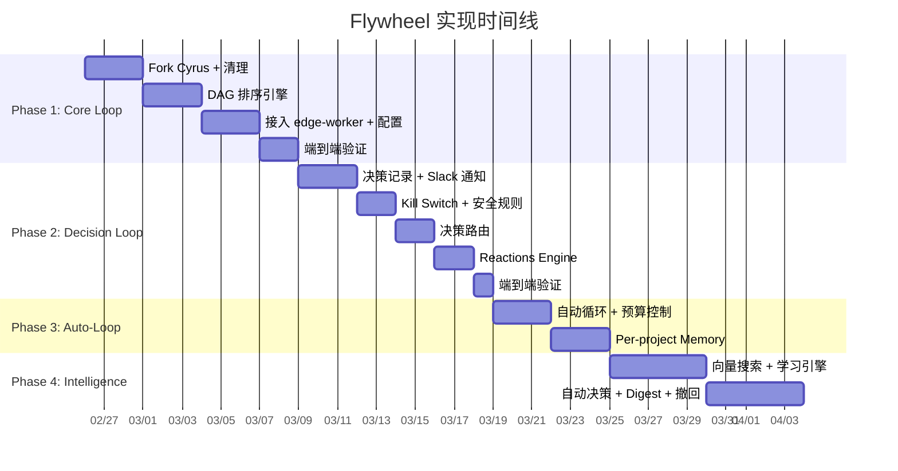
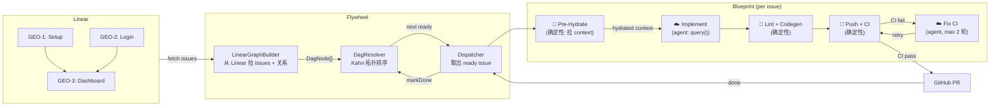
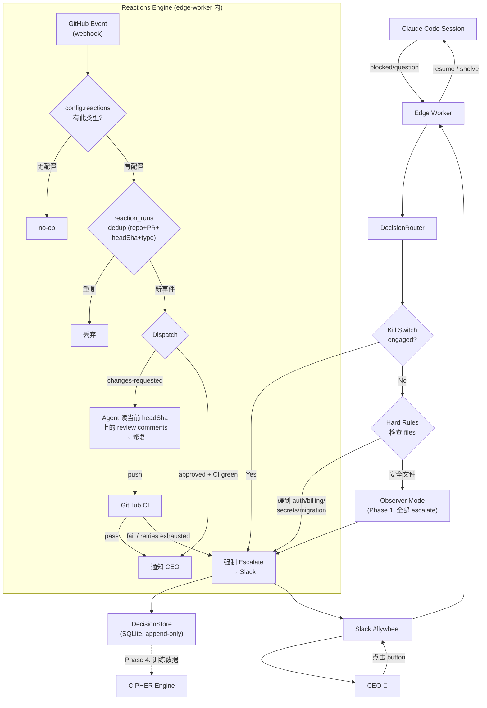
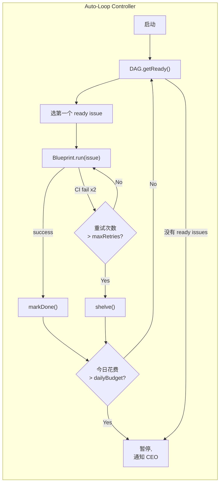
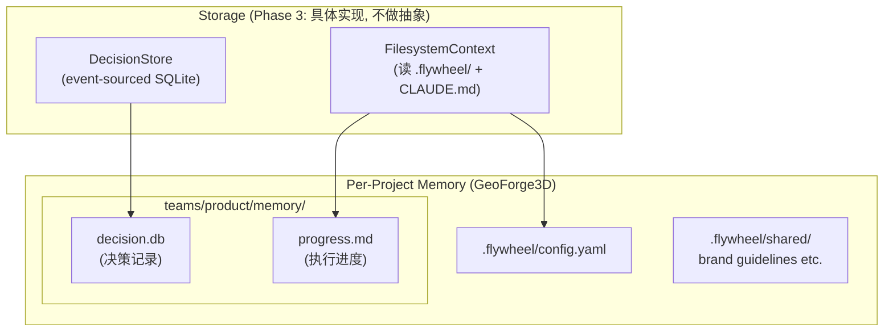
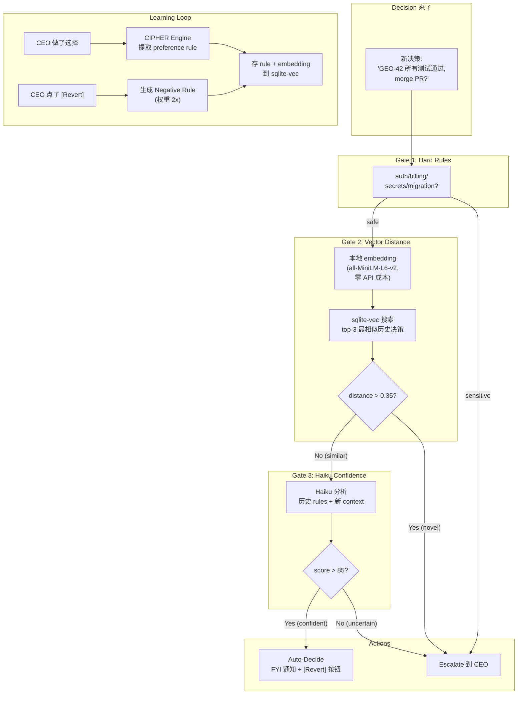

# Flywheel Orchestrator Implementation Plan

**Goal:** 构建全自动开发工作流 — Linear issue 自动变成 PR，只有真正需要人的时候才打扰你。

**Architecture:** Fork Cyrus (开源 TypeScript monorepo，预估 ~80% 可复用 — Phase 1 含 24-48h 兼容性 spike 验证实际复用比例)，新增 DAG 排序、Decision Layer (学习决策模式的智能中间层)、项目级 memory。通过 Slack 通知 CEO，只在必要时 escalate。

**Agent Teams 调研结论:** 评估了 Claude Code 内置的 Agent Teams 功能，结论是 **不采用**。Agent Teams 是实验性功能（需 env var），无法程序化调度、无 session 恢复、无外部 API、token 成本 ~7x。改用 Agent SDK `query()` + **subagents** 做 per-issue 执行 — 当前可用 API，完全可控（model/tools/prompt per subagent），session resume 机制以 Task 1 契约快照验证为准。

**Blueprint 模式 (借鉴 Stripe Minions):** 每个 issue 的执行不是纯 agent loop，而是 **确定性节点 + agent 节点的混合编排**。lint/codegen/push/CI 走确定性代码（零 token 成本、100% 可靠），只有 implement 和 fix 走 LLM。Agent 启动前 **pre-hydrate** context（Linear issue 详情、相关代码、项目 rules），减少 agent 浪费 token 去"发现"已知信息。CI 迭代轮次可配置（默认 2 轮，和 Stripe 一致），避免 diminishing returns。

**Model Agnosticity (架构约束):** Blueprint 的 agent 节点 **不直接 import 任何 LLM SDK**。所有 agent 调用走 `IAgentRunner` 接口，由 `RunnerSelectionService` 在运行时选择具体 runner。**注意：`IAgentRunner` 接口以 Task 1 fork 后的实际 Cyrus 签名为准** — 文档中的接口定义是目标契约，需在 fork 阶段验证并适配（可能需要 adapter 层）。Phase 1 只实现 `ClaudeRunner`，但接口保持开放 — 未来可插入 OpenAI Codex agent、Gemini coding agent、local models 等。Agent 节点配置声明式 (model/tools/prompt 在 `.flywheel/config.yaml`，不 hardcode)。**原则: "The product is the model" (Boris Cherny) — 模型快速迭代，编排层必须 model-agnostic。**

**Reactions 系统 (借鉴 Agent Orchestrator):** Blueprint 目前只处理 issue → PR 的正向流程。但 PR 创建后的生命周期同样需要自动化。Reactions 是事件驱动的自动响应引擎：监听 GitHub 事件，根据配置自动触发动作（send-to-agent / notify / escalate）。Phase 2 实现两个核心 Reaction — **PR review → agent auto-fix**（reviewer 提 changes-requested → agent 读当前 head SHA 上的 review comments → 修复 → push → CI）和 **approved+green → notify**。每个 reaction 有 `escalateAfter` 超时和 `retries` 上限，超过则 escalate 给人。**Agent-stuck 检测延迟到 Phase 3**（依赖 JSONL introspection 或 IAgentRunner activity events，当前 `run(): Promise<RunResult>` 无法提供中间活动信号）。Reactions 状态持久化到 `reaction_runs` 表（dedup key: repo+prNumber+headSha+reactionType），防止 webhook 重投或进程重启导致重复 agent run。Reactions 代码放在 `packages/edge-worker/` 内（非独立包），直接复用 Blueprint 的 git push / CI wait 设施。

**Research doc:** doc/research/new/001, 002, 003
**Industry reference:** doc/deep-research/003-stripe-minions-part1.md, 004-stripe-minions-part2.md, 006-boris-cherny-claude-code-future.md, 007-parallel-ai-agents-pkarnal.md, 008-agent-orchestrator-ao.md, 009-ramp-inspect-background-agent.md, 010-gastown-steve-yegge.md
**Status:** draft

---

## Phase Overview



---

# Part 1: CEO Overview

## Phase 1: Core Loop (Week 1-2)

### What We're Building

把 Cyrus (一个开源的 "Linear issue → Claude Code → PR" 工具) fork 过来，在它的基础上加 **依赖排序能力**。结果：你在 Linear 里标好 issue 之间的 blocking 关系，Flywheel 会自动按正确顺序执行它们。

Phase 1 结束后，你可以给 Flywheel 指一个 GeoForge3D 的 issue，它会自己写代码、跑测试、创建 PR。

### Data Flow



> **🔲 = 确定性节点** (零 token, 100% 可靠) | **☁️ = Agent 节点** (LLM, 按 token 计费)
>
> 借鉴 Stripe Minions 的 Blueprint 模式: 只有 implement 和 CI fix 需要 LLM，其余步骤走确定性代码。

### Tasks

| # | Task | What It Does | Deliverable |
|---|------|-------------|-------------|
| 1 | Fork & Setup | 把 Cyrus 克隆过来，改名为 @flywheel，确认能 build + **24-48h 兼容性 spike 验证实际复用比例** | 可编译的 monorepo + 复用率报告 |
| 2 | Clean Up | 删掉我们不需要的 runners (Codex/Cursor/Gemini) 和 F1 app | 精简后的代码库 |
| 3 | DAG Resolver — 核心算法 | 实现 Kahn 算法，`shelve()` 默认阻断下游（需显式 `allow_bypass_blockers` 才放行）。未知 blocker 记录 warning 而非静默忽略 | 10+ 个单元测试覆盖：线性链、钻石依赖、循环检测、shelve 阻断、未知 blocker |
| 4 | DAG Resolver — Linear 集成 | 使用 Linear SDK typed 字段（非硬编码字符串）转换依赖关系，支持自定义 workflow 状态名 | 自动过滤已完成/已取消 issues + 自定义状态名测试 |
| 5 | 项目配置 | `.flywheel/config.yaml` — 定义项目、team、budget、autonomy level、CI 轮次等 | GeoForge3D 的配置模板 |
| 6 | Blueprint Dispatcher | 每个 issue 按 Blueprint 执行: pre-hydrate → agent implement → lint → push → CI → agent fix (轮次由 config 控制) | 确定性 + agent 混合编排 |
| 7 | 端到端验证 | 一个 GeoForge3D issue 跑完全流程。验证 shelve 阻断、budget cap、session resume | Linear issue → Claude Code → GitHub PR |

### Phase Deliverables

- **Demo**: 从 Linear 选一个 GeoForge3D issue，运行 Flywheel，看到 PR 自动出现在 GitHub
- **Verification**: CEO 可以检查:
  - PR 的代码是 Claude Code 写的
  - Linear issue 状态变为 Done
  - DAG 正确跳过了已完成的 issues
- **Artifacts**: `packages/dag-resolver/`, `packages/config/`, 修改后的 `edge-worker/`

---

## Phase 2: Decision Loop (Week 3)

### What We're Building

Claude Code 执行过程中不是所有事情都能自己搞定 — 遇到 merge conflict、测试失败、架构选择时需要人做决定。Phase 2 让这些 **决策请求** 通过 Slack 到达 CEO，CEO 点按钮回复，Flywheel 继续执行。

同时建立 **决策记录数据库** (SQLite)，每一个决策都 append-only 存档 — 这是未来学习 CEO 决策模式的数据基础。

还有两个 Day 1 的安全机制：**Kill Switch** (一键停止所有自动决策) 和 **Hard Rules** (碰到 auth/billing/secrets 代码永远 escalate)。

新增 **Reactions 引擎** (借鉴 Agent Orchestrator 的 Reactions 系统): PR 创建后的生命周期也自动化 — reviewer 提 changes-requested 时，agent 自动读当前 head SHA 上的 review comments 并修复；PR approved + CI green 时通知你。每个 reaction 有超时和重试上限，超过则 escalate 给人。（Agent-stuck 检测延迟到 Phase 3，依赖 JSONL introspection。）

### Data Flow



### Tasks

| # | Task | What It Does | Deliverable |
|---|------|-------------|-------------|
| 8 | Decision Store | SQLite 数据库，拆分为 `decision_events`（严格 append-only 事件流）+ `decision_snapshots`（物化视图），含 repo/branch/sha、evidence refs 等审计字段 | append-only 事件流 + 可查询快照 |
| 9 | Slack Activity Sink | 把决策请求发到 Slack，带 interactive buttons (Approve/Reject/Skip) | CEO 在 Slack 上看到带按钮的消息 |
| 10 | Kill Switch + Hard Rules | Kill switch: 一个 flag 让所有决策必须人工。Hard rules: auth/billing/secrets 文件改动永远 escalate | 安全保底机制 |
| 11 | Decision Router | 把上面的组件串起来: session blocked → 检查 kill switch → 检查 hard rules → 发 Slack → 等响应 | 决策请求完整流转 |
| 11b | Reactions Engine | 事件驱动自动响应: config match → dedup → dispatch。changes-requested → agent auto-fix (dedup by repo+PR+headSha+type); approved+green → notify。`reaction_runs` 表持久化状态，防 webhook 重投。escalation 走 DecisionRouter 统一路径 (issueId + audit trail)。代码在 edge-worker/ 内 | PR review comment 自动修复 + approved 通知 |
| 12 | 端到端验证 | 故意让一个 issue blocked，验证 Slack 通知 + 按钮响应 + session 恢复 + **review comment auto-fix** | Slack 通知 → CEO 回复 → 继续执行; review → auto-fix → CI |

### Phase Deliverables

- **Demo**: Claude Code 执行 issue 时遇到问题 → CEO 手机上收到 Slack 通知 (带摘要和按钮) → 点 Approve → 执行继续。PR 收到 review comments → agent 自动修复 → push → CI pass
- **Verification**: CEO 可以检查:
  - Slack 消息包含有意义的摘要 (不是原始 log dump)
  - 点 button 后 Claude Code 真的继续了
  - SQLite 数据库里有完整的决策记录 (`decisions.db`)
  - Kill switch 生效时所有决策都到 Slack (不自动处理)
  - 改 auth 文件的 PR 永远需要人确认
  - **PR review changes-requested → agent 自动读当前 headSha 上的 comments → 修复 → push → CI**
  - **Webhook 重投同一 repo+PR+headSha+reactionType → 不重复触发 agent run (dedup)**
  - **Reaction 超时/超重试 → escalate 给 CEO**
  - **approved + CI green → 通知 CEO**
- **Artifacts**: `packages/decision-layer/`, Slack #flywheel 频道

---

## Phase 3: Auto-Loop + Memory (Week 4)

### What We're Building

Phase 1-2 能跑一个 issue。Phase 3 让 Flywheel **连续自动执行多个 issues** — issue A 完成后自动拿 issue B，B 完成后拿 C，直到所有 issue 做完或预算用完。

同时建立 **per-project memory 结构** — 每个项目 repo 有自己的 `.flywheel/` 目录，存配置、决策记录、团队 memory。Flywheel 不集中存其他项目的数据。

### Data Flow





### Tasks

| # | Task | What It Does | Deliverable |
|---|------|-------------|-------------|
| 13 | Auto-Loop Controller | issue 完成后自动执行下一个，支持 retry (max 2次)、daily budget cap、**持久化运行状态** (current issue, attempt, session_id) 用于崩溃恢复、ready 队列按 priority+createdAt 排序 + **Agent-stuck 检测** (JSONL introspection 或 IAgentRunner activity events，从 Phase 2 延迟到此) | 连续自动执行多个 issues + 幂等重启 + stuck detection |
| 14 | Per-Project Memory | `.flywheel/` 目录结构 + MemoryPaths 工具类 | GeoForge3D 的 `.flywheel/` 结构 |
| 15 | DecisionStore + FS Context | 最小存储接口: DecisionStore (SQLite) + FilesystemContext (读 `.flywheel/` + `CLAUDE.md`)。MemoryGateway 抽象延迟到 Phase 5+ (Mem0 bridge 时再引入) | 两个具体 adapter，不做过早抽象 |
| 16 | 端到端验证 | 3-5 个有依赖关系的 GeoForge3D issues 连续执行 | 全自动从头跑到尾 |

### Phase Deliverables

- **Demo**: 启动 Flywheel，去做别的事情。回来时看到 3-5 个 PR 自动创建，Linear issues 全部 Done
- **Verification**: CEO 可以检查:
  - Issues 按依赖顺序执行 (A→B→C, 不是乱序)
  - 失败的 issue 重试了 2 次后 shelved (下游保持阻塞，需 CEO 手动解除或设置 `allow_bypass_blockers`)
  - Daily budget cap 到了以后 Flywheel 自动停止
  - 每个项目的 `.flywheel/` 目录只存该项目的数据
- **Artifacts**: 多个自动创建的 PR, `.flywheel/teams/product/memory/decision.db`

---

## Phase 4: Decision Intelligence (Week 5-6)

### What We're Building

从 Observer (全部问 CEO) 升级为 **Advisor** — Decision Layer 开始学习 CEO 的决策模式。

核心机制: 每次 CEO 做了一个 manual decision，Haiku 分析 "为什么 CEO 这么选"，提取一条 **preference rule** (如: "当所有测试通过且没改 auth 文件，直接 merge")。下次遇到类似情况，用向量搜索找到最相似的历史决策，如果 confidence 够高就自动处理。

自动处理的决策会发 FYI 通知到 Slack (带 Revert 按钮)。CEO 如果点 Revert，系统学到一条 **负面规则** — 以后类似情况不会再自动处理。

### Data Flow



### Tasks

| # | Task | What It Does | Deliverable |
|---|------|-------------|-------------|
| 17 | sqlite-vec + Embeddings | 本地向量搜索，用 transformers.js 生成 embedding (零 API 成本) | "这个决策和哪些历史决策最像？" |
| 18 | CIPHER Engine | 每次 CEO 做决策后，Haiku 提取一条 preference rule 存入数据库 | 可搜索的 CEO preference 知识库 |
| 19 | Dual-Gate Confidence | 向量距离 + Haiku 评分双重检验，只有两关都过才 auto-decide | 安全的自动决策门槛 |
| 20 | Auto-Approve + Digest | 高 confidence 决策自动处理 + FYI 通知；非紧急决策攒起来批量发 | 减少打扰频率 |
| 21 | Revert + 负反馈 | CEO 点 Revert → git revert + 生成负面约束规则 | 从错误中学习 |

### Phase Deliverables

- **Demo**: Flywheel 运行 10 个 issues，其中 6 个 "测试全过+无敏感文件" 的 PR 自动 merge 了 (FYI 通知发到 Slack)，4 个涉及架构选择的 escalate 给 CEO
- **Verification**: CEO 可以检查:
  - 自动决策的逻辑合理 (FYI 消息里能看到 "基于哪些历史决策" 和 confidence)
  - Revert 按钮真的能 git revert + 学到教训
  - Kill switch 随时能切回全手动
  - Decision Layer 的成本: ~$0.001-0.003/decision (月底看账单验证)
  - Digest 消息把多个非紧急决策合成一条 (不刷屏)
- **Artifacts**: sqlite-vec 数据库里的 preference rules, FYI Slack 消息

---

## Phase 5: Multi-Team (Week 7-8, Optional)

### What We're Building

支持在一个项目里配置多个 team (Product, Content, Marketing)，每个 team 有独立的 memory 和 orchestrator。Team Leads 在 #standup 频道自动同步。

### Tasks

| # | Task | What It Does | Deliverable |
|---|------|-------------|-------------|
| 22 | Team Config + Isolation | 多 team 配置，每 team 独立 decision.db | 互不干扰的 team memory |
| 23 | Shared Memory | `.flywheel/shared/` — 跨 team 共享资源 (brand, roadmap) | Team Lead 可读写, Worker 只读 |
| 24 | Standup Room | Slack #standup — 每日自动汇总各 team progress | CEO 的全局视图 |

---

## Risk Assessment

| Risk | Probability | Impact | Mitigation |
|------|-------------|--------|------------|
| Cyrus fork 后结构和预期不符 | Medium | High | Phase 1 Task 1-2 先验证 build，不匹配就从零开始 |
| Claude Code 频繁超时 | Medium | Medium | maxBudgetUsd + maxTurns + retry 2 次 + shelve |
| Agent SDK query() API 签名不匹配 | Medium | High | Task 1 契约快照验证实际签名（可能是 AsyncGenerator 流式）；确认 session resume 机制；验证通过后下调为 Low |
| sqlite-vec 兼容性问题 | Low | Medium | Fallback: brute-force cosine (<1000 条记录无压力) |
| 自动决策做错了 | Medium | Low | Observer mode 先积累数据；Revert 按钮随时纠正 |
| 每日成本超预算 | Medium | Medium | dailyBudgetUsd 硬上限 + 80% alert |
| Model lock-in (只能用 Claude) | Low | High | `IAgentRunner` 接口 + `RunnerSelectionService` 保持 model-agnostic；Blueprint 不直接 import 任何 SDK；config 声明式指定 runner |
| Review auto-fix 无限循环 | Medium | Medium | `retries` 上限 (default 2) + `escalateAfter` 超时 (default 30m)；超过任一条件 → 停止重试 → escalate 给 CEO |

---

## File Impact Summary

```
flywheel/ (Cyrus fork)
├── packages/
│   ├── dag-resolver/          [NEW] DAG 排序引擎
│   ├── decision-layer/        [NEW] 决策记录 + 路由 + 学习 + reaction_runs 表
│   ├── memory-gateway/        [DEFERRED to Phase 5+] MemoryGateway 抽象
│   ├── config/                [NEW] 项目配置 loader
│   ├── edge-worker/           [MODIFIED] DAG dispatch + auto-loop + Slack sink + ReactionsEngine + ReviewFixHandler
│   ├── core/                  [MAY MODIFY] IAgentRunner 接口适配 (Task 1 契约快照后确定)
│   ├── claude-runner/         [MODIFIED] ClaudeRunner 实现 IAgentRunner + config-driven model
│   └── *-event-transport/     (unchanged)
└── templates/                 [NEW] 项目初始化模板
```

**新代码**: ~1700-2200 LOC | **复用 Cyrus**: ~80%

---
---

# Part 2: Technical Appendix

> **For Claude:** Use /implement to execute tasks from this section.
> **For Codex:** Review interfaces, data schemas, test coverage, and architectural decisions.

---

## Task 1: Fork Cyrus & Dev Environment Setup

**Files:**
- Modify: `package.json` (rename to @flywheel)
- Modify: `pnpm-workspace.yaml`
- Modify: all `packages/*/package.json` (scope @cyrus → @flywheel)

**Steps:**
```bash
gh repo fork ceedaragents/cyrus --clone --fork-name flywheel
cd flywheel
# Rename @cyrus scope to @flywheel in all package.json files
pnpm install && pnpm build && pnpm test
```

**契约快照子任务 (fork 后第一时间):**
- 锁定 `packages/core/` 的 `IAgentRunner` 真实接口签名（含 session lifecycle: spawn/monitor/kill）
- 验证 `query()` 返回类型（同步 `Promise` 还是 `AsyncGenerator` 流式）
- 确认 session resume 机制（`resume` 字段 vs `sessionId`）
- 若接口与文档中目标契约不匹配，在此记录差异并设计 adapter
- 输出: `doc/reference/cyrus-contract-snapshot.md`

**Commit:** `chore: fork Cyrus, rename to @flywheel scope + contract snapshot`

---

## Task 2: Clean Up Unused Packages

**Files:**
- Delete: `packages/codex-runner/`, `packages/cursor-runner/`, `packages/gemini-runner/`, `packages/simple-agent-runner/`, `packages/cloudflare-tunnel-client/`, `apps/f1/`
- Modify: `pnpm-workspace.yaml`, `packages/edge-worker/package.json`, `packages/edge-worker/src/RunnerSelectionService.ts`

**Steps:**
1. Remove unused packages (codex-runner, cursor-runner, gemini-runner, simple-agent-runner, cloudflare-tunnel-client, f1 app)
2. Update workspace config
3. **保留 `IAgentRunner` 接口和 `RunnerSelectionService`** — 只删具体 runner 实现，不简化接口。Phase 1 仅注册 `ClaudeRunner`，但接口保持 model-agnostic（未来可插入 OpenAI/Gemini/local runners）
4. 补充 `RunnerSelectionService` 单 runner 模式契约测试:
   - only claude registered → returns claude runner
   - unknown runner name → throws descriptive error
   - default fallback → returns config.runners.default
5. `pnpm install && pnpm build && pnpm test`

**Commit:** `chore: remove unused runners, preserve IAgentRunner interface for model agnosticity`

---

## Task 3: DAG Resolver — Core Algorithm

**Files:**
- Create: `packages/dag-resolver/src/DagResolver.ts`
- Create: `packages/dag-resolver/src/types.ts`
- Create: `packages/dag-resolver/src/index.ts`
- Create: `packages/dag-resolver/package.json`
- Test: `packages/dag-resolver/src/__tests__/DagResolver.test.ts`

**Step 1: Write the failing test**

```typescript
// packages/dag-resolver/src/__tests__/DagResolver.test.ts
import { describe, it, expect } from "vitest";
import { DagResolver } from "../DagResolver";
import type { DagNode } from "../types";

describe("DagResolver", () => {
  it("returns empty array for empty input", () => {
    const resolver = new DagResolver([]);
    expect(resolver.getReady()).toEqual([]);
  });

  it("returns all nodes when no dependencies", () => {
    const nodes: DagNode[] = [
      { id: "A", blockedBy: [] },
      { id: "B", blockedBy: [] },
      { id: "C", blockedBy: [] },
    ];
    const resolver = new DagResolver(nodes);
    expect(resolver.getReady().map((n) => n.id).sort()).toEqual(["A", "B", "C"]);
  });

  it("respects blocking relations (linear chain)", () => {
    const nodes: DagNode[] = [
      { id: "A", blockedBy: [] },
      { id: "B", blockedBy: ["A"] },
      { id: "C", blockedBy: ["B"] },
    ];
    const resolver = new DagResolver(nodes);
    expect(resolver.getReady().map((n) => n.id)).toEqual(["A"]);

    resolver.markDone("A");
    expect(resolver.getReady().map((n) => n.id)).toEqual(["B"]);

    resolver.markDone("B");
    expect(resolver.getReady().map((n) => n.id)).toEqual(["C"]);
  });

  it("handles diamond dependency", () => {
    const nodes: DagNode[] = [
      { id: "A", blockedBy: [] },
      { id: "B", blockedBy: ["A"] },
      { id: "C", blockedBy: ["A"] },
      { id: "D", blockedBy: ["B", "C"] },
    ];
    const resolver = new DagResolver(nodes);
    expect(resolver.getReady().map((n) => n.id)).toEqual(["A"]);

    resolver.markDone("A");
    expect(resolver.getReady().map((n) => n.id).sort()).toEqual(["B", "C"]);

    resolver.markDone("B");
    resolver.markDone("C");
    expect(resolver.getReady().map((n) => n.id)).toEqual(["D"]);
  });

  it("detects cycles", () => {
    const nodes: DagNode[] = [
      { id: "A", blockedBy: ["C"] },
      { id: "B", blockedBy: ["A"] },
      { id: "C", blockedBy: ["B"] },
    ];
    expect(() => new DagResolver(nodes)).toThrow(/cycle/i);
  });

  it("blocks nodes with unknown blockers by default", () => {
    const nodes: DagNode[] = [
      { id: "A", blockedBy: ["UNKNOWN"] },
      { id: "B", blockedBy: [] },
    ];
    const resolver = new DagResolver(nodes);
    // A stays blocked (unknown blocker = assume still pending), only B is ready
    expect(resolver.getReady().map((n) => n.id)).toEqual(["B"]);
    expect(resolver.getWarnings()).toContainEqual(
      expect.objectContaining({ type: "unknown_blocker", nodeId: "A", blockerId: "UNKNOWN" })
    );
  });

  it("unknown blockers can be explicitly resolved", () => {
    const nodes: DagNode[] = [
      { id: "A", blockedBy: ["UNKNOWN"] },
    ];
    const resolver = new DagResolver(nodes);
    expect(resolver.getReady()).toEqual([]);
    resolver.resolveExternalBlocker("A", "UNKNOWN");  // CEO/system confirms blocker is done
    expect(resolver.getReady().map((n) => n.id)).toEqual(["A"]);
  });

  it("shelve blocks downstream by default", () => {
    const nodes: DagNode[] = [
      { id: "A", blockedBy: [] },
      { id: "B", blockedBy: ["A"] },
    ];
    const resolver = new DagResolver(nodes);
    resolver.shelve("A");
    // B stays blocked — shelve does NOT release downstream
    expect(resolver.getReady()).toEqual([]);
  });

  it("shelve with bypass releases downstream", () => {
    const nodes: DagNode[] = [
      { id: "A", blockedBy: [] },
      { id: "B", blockedBy: ["A"] },
    ];
    const resolver = new DagResolver(nodes, { allowBypassBlockers: true });
    resolver.shelve("A");
    expect(resolver.getReady().map((n) => n.id)).toEqual(["B"]);
  });

  it("tracks remaining count", () => {
    const resolver = new DagResolver([
      { id: "A", blockedBy: [] },
      { id: "B", blockedBy: ["A"] },
    ]);
    expect(resolver.remaining()).toBe(2);
    resolver.markDone("A");
    expect(resolver.remaining()).toBe(1);
  });
});
```

**Step 2: Run test** → Expected: FAIL (module not found)

**Step 3: Write implementation**

```typescript
// packages/dag-resolver/src/types.ts
export interface DagNode {
  id: string;
  blockedBy: string[];
}
export type NodeStatus = "pending" | "done" | "shelved";
export interface DagResolverOptions {
  allowBypassBlockers?: boolean;  // default false — shelve blocks downstream
}
export interface DagWarning {
  type: "unknown_blocker";
  nodeId: string;
  blockerId: string;
}
```

```typescript
// packages/dag-resolver/src/DagResolver.ts
import type { DagNode, NodeStatus, DagResolverOptions, DagWarning } from "./types";

export class DagResolver {
  private nodes: Map<string, DagNode>;
  private status: Map<string, NodeStatus>;
  private inDegree: Map<string, number>;
  private warnings: DagWarning[] = [];
  private options: DagResolverOptions;

  constructor(nodes: DagNode[], options: DagResolverOptions = {}) {
    this.options = { allowBypassBlockers: false, ...options };
    this.nodes = new Map(nodes.map((n) => [n.id, n]));
    this.status = new Map(nodes.map((n) => [n.id, "pending"]));
    this.inDegree = new Map();

    // First pass: compute known-only in-degrees for cycle detection
    const knownInDegree = new Map<string, number>();
    for (const node of nodes) {
      const unknown = node.blockedBy.filter((id) => !this.nodes.has(id));
      for (const blockerId of unknown) {
        this.warnings.push({ type: "unknown_blocker", nodeId: node.id, blockerId });
      }
      const knownCount = node.blockedBy.filter((id) => this.nodes.has(id)).length;
      knownInDegree.set(node.id, knownCount);
    }
    // Validate cycles using ONLY known blockers (unknown blockers can't form cycles)
    this.validateNoCycles(nodes, knownInDegree);

    // Second pass: runtime in-degrees include unknown blockers (block by default)
    for (const node of nodes) {
      const unknown = node.blockedBy.filter((id) => !this.nodes.has(id));
      const knownCount = knownInDegree.get(node.id)!;
      this.inDegree.set(node.id, knownCount + unknown.length);
    }
  }

  getWarnings(): DagWarning[] { return this.warnings; }

  private validateNoCycles(nodes: DagNode[], knownInDegree: Map<string, number>): void {
    const temp = new Map(knownInDegree);  // Only known blockers — unknown can't form cycles
    const queue: string[] = [];
    let visited = 0;

    for (const [id, deg] of temp) {
      if (deg === 0) queue.push(id);
    }
    while (queue.length > 0) {
      const cur = queue.shift()!;
      visited++;
      for (const node of nodes) {
        if (node.blockedBy.includes(cur) && this.nodes.has(node.id)) {
          const d = temp.get(node.id)! - 1;
          temp.set(node.id, d);
          if (d === 0) queue.push(node.id);
        }
      }
    }
    if (visited < nodes.length) {
      throw new Error(
        `Cycle detected in dependency graph. ` +
        `${nodes.length - visited} nodes in cycle.`
      );
    }
  }

  getReady(): DagNode[] {
    const ready: DagNode[] = [];
    for (const [id, deg] of this.inDegree) {
      if (deg === 0 && this.status.get(id) === "pending") {
        ready.push(this.nodes.get(id)!);
      }
    }
    return ready;
  }

  markDone(id: string): void {
    this.status.set(id, "done");
    this.decrementDependents(id);
  }

  shelve(id: string): void {
    this.status.set(id, "shelved");
    // Only release downstream if explicitly configured
    if (this.options.allowBypassBlockers) {
      this.decrementDependents(id);
    }
  }

  private decrementDependents(completedId: string): void {
    for (const [nodeId, node] of this.nodes) {
      if (
        node.blockedBy.includes(completedId) &&
        this.status.get(nodeId) === "pending"
      ) {
        this.inDegree.set(nodeId, Math.max(0, this.inDegree.get(nodeId)! - 1));
      }
    }
  }

  resolveExternalBlocker(nodeId: string, blockerId: string): void {
    if (this.status.get(nodeId) === "pending") {
      this.inDegree.set(nodeId, Math.max(0, this.inDegree.get(nodeId)! - 1));
    }
  }

  remaining(): number {
    let c = 0;
    for (const s of this.status.values()) if (s === "pending") c++;
    return c;
  }
}
```

**Step 4: Run test** → Expected: PASS (10 tests)
**Commit:** `feat: DAG resolver with Kahn's algorithm (topological sort)`

---

## Task 4: DAG Resolver — Linear Integration

**Files:**
- Create: `packages/dag-resolver/src/LinearGraphBuilder.ts`
- Test: `packages/dag-resolver/src/__tests__/LinearGraphBuilder.test.ts`

**Step 1: Write the failing test**

```typescript
// packages/dag-resolver/src/__tests__/LinearGraphBuilder.test.ts
import { describe, it, expect } from "vitest";
import { LinearGraphBuilder } from "../LinearGraphBuilder";

describe("LinearGraphBuilder", () => {
  // Uses state.type (Linear SDK enum) not state.name (user-customizable)
  const mockIssues = [
    {
      id: "issue-1", identifier: "GEO-1", title: "Setup",
      state: { type: "unstarted", name: "Todo" }, relations: { nodes: [] },
    },
    {
      id: "issue-2", identifier: "GEO-2", title: "Login",
      state: { type: "started", name: "In Progress" },
      relations: { nodes: [{ type: "blocks", relatedIssue: { id: "issue-3" } }] },
    },
    {
      id: "issue-3", identifier: "GEO-3", title: "Dashboard",
      state: { type: "unstarted", name: "Todo" },
      relations: { nodes: [{ type: "blocks", relatedIssue: { id: "issue-2" } }] },
    },
  ] as any;  // cast for mock

  it("builds DagNodes from Linear issues", () => {
    const nodes = new LinearGraphBuilder().build(mockIssues);
    expect(nodes).toHaveLength(3);
  });

  it("filters out completed issues (by state.type, not state.name)", () => {
    const withDone = [...mockIssues, {
      id: "issue-4", identifier: "GEO-4", title: "Done",
      state: { type: "completed", name: "My Custom Done State" }, relations: { nodes: [] },
    }] as any;
    expect(new LinearGraphBuilder().build(withDone)).toHaveLength(3);
  });

  it("filters out canceled issues", () => {
    const cancelled = [{
      id: "issue-1", identifier: "GEO-1", title: "X",
      state: { type: "canceled", name: "Rejected" }, relations: { nodes: [] },
    }] as any;
    expect(new LinearGraphBuilder().build(cancelled)).toHaveLength(0);
  });

  it("supports custom terminal types", () => {
    const custom = new LinearGraphBuilder(new Set(["completed", "canceled", "triage"]));
    const withTriage = [{
      id: "issue-1", state: { type: "triage", name: "Needs Review" }, relations: { nodes: [] },
    }] as any;
    expect(custom.build(withTriage)).toHaveLength(0);
  });
});
```

**Step 3: Write implementation**

```typescript
// packages/dag-resolver/src/LinearGraphBuilder.ts
import type { DagNode } from "./types";
import type { Issue, IssueRelation } from "@linear/sdk";

// Use Linear SDK typed enum instead of hardcoded strings
// Linear state.type is a stable enum: "started" | "unstarted" | "completed" | "canceled" | "backlog" | "triage"
const TERMINAL_TYPES = new Set(["completed", "canceled"]);

// Relation type is also a typed enum in @linear/sdk
const BLOCKED_BY_TYPE = "blocks"; // relatedIssue blocks this issue

export class LinearGraphBuilder {
  // Optional: custom state mapping for workflows with non-standard states
  constructor(private terminalTypes: Set<string> = TERMINAL_TYPES) {}

  build(issues: Issue[]): DagNode[] {
    const active = issues.filter((i) => !this.terminalTypes.has(i.state?.type ?? ""));
    const ids = new Set(active.map((i) => i.id));

    return active.map((issue) => ({
      id: issue.id,
      blockedBy: (issue.relations?.nodes ?? [])
        .filter((r: IssueRelation) =>
          r.type === BLOCKED_BY_TYPE && ids.has(r.relatedIssue?.id ?? "")
        )
        .map((r: IssueRelation) => r.relatedIssue!.id),
    }));
  }
}
```

**注意**: 使用 `state.type` (Linear SDK 稳定枚举) 而非 `state.name` (用户可自定义)。支持通过构造函数注入自定义 terminal types 以适配非标 workflow。

**Commit:** `feat: LinearGraphBuilder — Linear issues to DAG nodes`

---

## Task 5: Project Config Schema (moved before Blueprint — Blueprint depends on config)

**Files:**
- Create: `packages/config/src/types.ts`, `ConfigLoader.ts`, `package.json`
- Test: `packages/config/src/__tests__/ConfigLoader.test.ts`

**Types:**

```typescript
// packages/config/src/types.ts
export type AutonomyLevel = "manual_only" | "observer" | "advisor" | "autonomous";

export interface FlywheelConfig {
  project: string;
  linear: { team_id: string; labels?: string[] };
  runners: {
    default: string;              // runner name, e.g. "claude"
    available: Record<string, {   // model-agnostic runner registry
      type: string;               // "claude" | "openai" | "gemini" | "local" | ...
      model?: string;             // model ID (e.g. "sonnet", "gpt-4o", "gemini-2.5-pro")
      max_budget_usd?: number;    // per-session budget cap
    }>;
  };
  agent_nodes?: {                 // declarative agent node config (model-agnostic)
    implement?: {
      tools?: string[];           // default: ["Read", "Edit", "Write", "Bash", "Grep", "Glob"]
      subagents?: Record<string, { description: string; prompt: string; tools?: string[] }>;
    };
    fix?: {
      budget_usd?: number;        // per-fix budget, default 2.0
      tools?: string[];
    };
  };
  teams: Array<{
    name: string;
    orchestrators: Array<{
      type: string;
      runner: string;             // references runners.available key
      budget_per_issue: number;
    }>;
  }>;
  decision_layer: {
    autonomy_level: AutonomyLevel;
    escalation_channel: string;
    digest_interval?: number;
  };
  ci?: {
    max_rounds?: number;        // default 2 (Stripe Minions 也是 2)
    retry_on?: string[];        // CI failure patterns to retry on
  };
  reactions?: {                 // 事件驱动自动响应 (借鉴 Agent Orchestrator)
    'changes-requested'?: {     // discriminated union: action 决定行为
      action: 'send-to-agent';  // Phase 2 唯一支持的 action
      retries?: number;         // max fix attempts, default 2
      escalateAfter?: string;   // timeout e.g. "30m" — 超时则 escalate 给人
    };
    'approved-and-green'?: {
      action: 'notify';         // Phase 2: 只通知。auto-merge 需 branch protection + merge queue，延迟到 Phase 4+
    };
    // 'agent-stuck' — Phase 3 (依赖 JSONL introspection 或 IAgentRunner activity events)
  };
}
```

**ConfigLoader:** 读 `.flywheel/config.yaml`, 验证必填字段, 返回 typed config。

**Commit:** `feat: project config loader (.flywheel/config.yaml)`

---

## Task 6: Blueprint Dispatcher

**Files:**
- Create: `packages/edge-worker/src/Blueprint.ts`
- Create: `packages/edge-worker/src/PreHydrator.ts`
- Create: `packages/edge-worker/src/DagDispatcher.ts`
- Modify: `packages/edge-worker/package.json` (add @flywheel/dag-resolver, @flywheel/config)
- Test: `packages/edge-worker/src/__tests__/Blueprint.test.ts`

**Architecture Decisions:**

1. **Agent SDK `query()` + subagents**, 不用 Agent Teams (实验性, 无编程控制, 无 session resume, ~7x token 成本)
2. **Blueprint 混合编排** (借鉴 Stripe Minions): 确定性节点 + agent 节点交替执行，只在 implement/fix 时消耗 token
3. **Model-agnostic**: Blueprint 通过 `IAgentRunner` 接口调用 agent，不直接 import 任何 LLM SDK。`RunnerSelectionService` 根据 config 选择 runner。Phase 1 仅 `ClaudeRunner`，但接口可扩展

**Blueprint 执行流程:**

```
Pre-Hydrate (确定性)     — 拉 Linear issue 详情 + 相关代码 + 项目 rules
    ↓
Implement (agent)        — query() + subagents, hydrated context 注入 prompt
    ↓
Lint + Codegen (确定性)  — 跑 eslint/prettier/codegen, 自动修复
    ↓
Push + CI (确定性)       — git push, 触发 CI
    ↓
CI Pass?
  ├─ Yes → Done (create PR)
  └─ No  → Fix (agent, 拿 CI output) → Push + CI → 第 2 轮失败则 shelve
```

**Pre-Hydrator — 确定性 context 准备:**

```typescript
// packages/edge-worker/src/PreHydrator.ts
import type { DagNode } from "@flywheel/dag-resolver";

export interface HydratedContext {
  issueTitle: string;
  issueDescription: string;
  linkedPRs: string[];
  relatedFiles: string[];       // from Linear attachments or code search
  projectRules: string;         // .flywheel/ + CLAUDE.md content
  recentDecisions: string[];    // from DecisionStore (Phase 2+)
}

export class PreHydrator {
  constructor(
    private linearClient: any,   // @linear/sdk
    private projectRoot: string,
  ) {}

  async hydrate(node: DagNode): Promise<HydratedContext> {
    // All deterministic — zero token cost
    const issue = await this.linearClient.issue(node.id);
    const rules = await this.readProjectRules();
    const relatedFiles = await this.findRelatedFiles(issue);

    return {
      issueTitle: issue.title,
      issueDescription: issue.description ?? "",
      linkedPRs: [],
      relatedFiles,
      projectRules: rules,
      recentDecisions: [],
    };
  }

  private async readProjectRules(): Promise<string> {
    // Read CLAUDE.md + .flywheel/config.yaml
    // Scoped rules: only load rules relevant to this issue's file paths
    // (借鉴 Stripe: scoped rules per subdirectory)
  }

  private async findRelatedFiles(issue: any): Promise<string[]> {
    // Parse issue description for file paths, grep for keywords
  }
}
```

**Blueprint — 混合编排引擎:**

```typescript
// packages/edge-worker/src/Blueprint.ts
import type { IAgentRunner, RunResult } from "@flywheel/core";  // Cyrus 接口, NOT a specific SDK
import { RunnerSelectionService } from "./RunnerSelectionService";
import { PreHydrator, type HydratedContext } from "./PreHydrator";
import type { DagNode } from "@flywheel/dag-resolver";
import type { FlywheelConfig } from "@flywheel/config";

export interface BlueprintResult {
  success: boolean;
  costUsd: number;
  sessionId?: string;
  ciRounds: number;
}

export interface BlueprintContext {
  teamName: string;
  runnerName: string;       // resolved from orchestrator config, fallback to runners.default
  budgetPerIssue: number;   // from orchestrator config
  fixBudgetUsd: number;     // from agent_nodes.fix.budget_usd or default 2.0
  resumeSessionId?: string; // for crash recovery — resume a previously interrupted session
}

export class Blueprint {
  private maxCIRounds: number;  // configurable, default 2 (Stripe Minions)

  // Callback for session checkpoint — AutoLoopController persists sessionId for crash recovery
  onSessionCreated?: (nodeId: string, sessionId: string) => Promise<void>;

  constructor(
    private config: FlywheelConfig,
    private hydrator: PreHydrator,
    private runnerService: RunnerSelectionService,
  ) {
    this.maxCIRounds = config.ci?.max_rounds ?? 2;
  }

  async run(node: DagNode, projectRoot: string, bpCtx: BlueprintContext): Promise<BlueprintResult> {
    let totalCost = 0;

    // Runner resolved from context (not hardcoded array index)
    const runner = this.runnerService.getRunner(bpCtx.runnerName);

    // Tools and subagents from config (model-agnostic, not hardcoded)
    const implTools = this.config.agent_nodes?.implement?.tools
      ?? ["Read", "Edit", "Write", "Bash", "Grep", "Glob"];
    const implSubagents = this.config.agent_nodes?.implement?.subagents ?? {};

    // === Step 1: Pre-Hydrate (确定性, 零 token) ===
    const ctx = await this.hydrator.hydrate(node);

    // === Step 2: Implement (agent via IAgentRunner — model-agnostic) ===
    const implResult = await runner.run({
      prompt: this.buildPrompt(ctx),
      cwd: projectRoot,
      tools: implTools,
      subagents: implSubagents,
      maxBudgetUsd: bpCtx.budgetPerIssue,
      sessionId: bpCtx.resumeSessionId,  // crash recovery: resume interrupted session
    });
    // Checkpoint sessionId immediately for crash recovery
    if (implResult.sessionId && this.onSessionCreated) {
      await this.onSessionCreated(node.id, implResult.sessionId);
    }
    totalCost += implResult.costUsd ?? 0;

    // === Step 3: Lint + Codegen (确定性) ===
    await this.runLintAndCodegen(projectRoot);

    // === Step 4-5: Push + CI loop (max configurable rounds) ===
    for (let round = 1; round <= this.maxCIRounds; round++) {
      await this.gitPush(projectRoot);
      const ciResult = await this.waitForCI(projectRoot);

      if (ciResult.passed) {
        return { success: true, costUsd: totalCost, sessionId: implResult.sessionId, ciRounds: round };
      }

      if (round < this.maxCIRounds) {
        // Fix CI failures (agent via IAgentRunner — resume same session)
        const fixResult = await runner.run({
          prompt: `CI failed. Fix these errors:\n${ciResult.output}`,
          cwd: projectRoot,
          tools: this.config.agent_nodes?.fix?.tools ?? implTools,
          sessionId: implResult.sessionId,  // resume same session
          maxBudgetUsd: bpCtx.fixBudgetUsd,
        });
        totalCost += fixResult.costUsd ?? 0;
        await this.runLintAndCodegen(projectRoot);  // re-lint after fix
      }
    }

    return { success: false, costUsd: totalCost, ciRounds: this.maxCIRounds };
  }

  private buildPrompt(ctx: HydratedContext): string {
    return [
      `# Task: ${ctx.issueTitle}`,
      `\n## Description\n${ctx.issueDescription}`,
      ctx.relatedFiles.length > 0 ? `\n## Related Files\n${ctx.relatedFiles.join("\n")}` : "",
      `\n## Project Rules\n${ctx.projectRules}`,
      `\n## Instructions`,
      `Follow TDD. Create PR when done. Do not ask questions — implement your best judgment.`,
    ].filter(Boolean).join("\n");
  }

  private async runLintAndCodegen(root: string): Promise<void> { /* deterministic */ }
  private async gitPush(root: string): Promise<void> { /* deterministic */ }
  private async waitForCI(root: string): Promise<{ passed: boolean; output: string }> { /* deterministic */ }
}
```

**IAgentRunner 目标接口 (待 Task 1 契约快照验证，可能需 adapter):**

```typescript
// packages/core/src/IAgentRunner.ts — 目标契约 (以 Task 1 fork 后实际签名为准，可能需 adapter)
export interface AgentRunRequest {
  prompt: string;
  cwd: string;
  tools?: string[];
  subagents?: Record<string, { description: string; prompt: string; tools?: string[] }>;
  maxBudgetUsd?: number;
  sessionId?: string;     // for session resume
}

export interface RunResult {
  success: boolean;
  costUsd: number;
  sessionId?: string;
  output?: string;
}

export interface IAgentRunner {
  readonly name: string;  // "claude" | "openai" | "gemini" | ...
  run(request: AgentRunRequest): Promise<RunResult>;
}
```

**Phase 1 唯一实现 — ClaudeRunner (包装 Agent SDK `query()`):**

```typescript
// packages/claude-runner/src/ClaudeRunner.ts
import { query } from "@anthropic-ai/claude-agent-sdk";
import type { IAgentRunner, AgentRunRequest, RunResult } from "@flywheel/core";

export class ClaudeRunner implements IAgentRunner {
  readonly name = "claude";

  constructor(private runnerConfig: { model?: string }) {}

  async run(request: AgentRunRequest): Promise<RunResult> {
    // Translate AgentRunRequest → Agent SDK query() params
    // Model comes from config (runners.available.claude.model), not hardcoded
    const result = await query(request.prompt, {
      cwd: request.cwd,
      allowedTools: request.tools,
      agents: request.subagents ? Object.fromEntries(
        Object.entries(request.subagents).map(([k, v]) => [k, {
          ...v,
          model: this.runnerConfig.model ?? "haiku",  // from config, not hardcoded
        }])
      ) : undefined,
      maxBudgetUsd: request.maxBudgetUsd,
      ...(request.sessionId ? { resume: request.sessionId } : {}),
    });
    return { success: true, costUsd: result.costUsd ?? 0, sessionId: result.sessionId };
  }
}
```

**注意 (Codex review feedback + model agnosticity)**:
- `query()` API 签名需在 fork 阶段验证。上面的代码是伪代码 — 实际 API 可能是 `AsyncGenerator` (streaming)，需要 `for await` 消费 + 解析 `type: result` 消息 + 显式记录 `session_id`。
- 会话恢复可能使用 `resume` 字段而非直接传 `sessionId`。
- Blueprint 的确定性节点 (lint, push, CI) 需要适配目标项目的工具链。
- **Blueprint 通过 `IAgentRunner` 接口调用 agent**，不直接 import `@anthropic-ai/claude-agent-sdk`。SDK-specific 逻辑封装在 `ClaudeRunner` 中。未来新增 runner 只需实现 `IAgentRunner` 并注册到 `RunnerSelectionService`。

**必须交付的契约测试:**
- `Blueprint.test.ts: "interrupts and resumes session"` — kill agent mid-run → resume via saved session_id → verify it picks up from last state
- `Blueprint.test.ts: "respects configurable CI rounds"` — set `ci.max_rounds: 1` → verify only 1 CI attempt

**Commit:** `feat: Blueprint dispatcher — hybrid deterministic + agent orchestration`

---

## Task 7: End-to-End Verification (Core Loop)

**Files:**
- Create: `tests/e2e/core-loop.test.ts`

**输入:** 一个 GeoForge3D Linear issue (real or mock)
**输出:** GitHub PR created, Linear issue status updated

**Verification checklist:**
- [ ] Linear issue fetched and converted to DagNode
- [ ] Blueprint executed: pre-hydrate → implement → lint → push → CI
- [ ] PR created on GitHub with correct branch naming
- [ ] `shelve()` correctly blocks downstream (test with 2-issue chain)
- [ ] Budget cap stops execution when reached
- [ ] Session ID recorded for potential resume
- [ ] Unknown blockers logged as warnings

**Rollback:** Delete created branch + close PR if test fails.

**Commit:** `test: core loop end-to-end verification`

---

## Task 8: Decision Store (SQLite)

**Files:**
- Create: `packages/decision-layer/src/DecisionStore.ts`, `types.ts`, `package.json`
- Test: `packages/decision-layer/src/__tests__/DecisionStore.test.ts`

**Schema (event-sourced — Codex review feedback):**

```sql
-- Strict append-only event stream (no UPDATE/DELETE)
CREATE TABLE decision_events (
  id TEXT PRIMARY KEY,
  created_at TEXT NOT NULL DEFAULT (datetime('now')),
  decision_id TEXT NOT NULL,   -- groups events for same decision (correlation key)
  event_type TEXT NOT NULL,    -- CREATED | CHOICE_MADE | AUTO_DECIDED | OUTCOME | REVERTED
  issue_id TEXT NOT NULL,
  repo TEXT,                   -- project repo
  branch TEXT,                 -- working branch
  commit_sha TEXT,             -- relevant commit
  category TEXT NOT NULL,      -- pr_approval | architecture_choice | error_triage | ...
  payload TEXT NOT NULL,       -- JSON: context, proposal, options, choice, reasoning, confidence, etc.
  evidence_refs TEXT,          -- JSON array of file paths, PR URLs, CI links
  hard_rule_hit TEXT           -- which hard rule triggered (if any)
);
CREATE INDEX idx_decision_events_decision_id ON decision_events(decision_id);
CREATE INDEX idx_decision_events_issue_id ON decision_events(issue_id);

-- Materialized view for easy querying (rebuilt from events)
CREATE TABLE decision_snapshots (
  decision_id TEXT PRIMARY KEY,
  issue_id TEXT NOT NULL,
  category TEXT NOT NULL,
  context_summary TEXT NOT NULL,
  ai_proposal TEXT NOT NULL,
  human_choice TEXT,
  auto_decided INTEGER NOT NULL DEFAULT 0,
  confidence REAL,
  outcome TEXT,                -- SUCCESS | REVERTED | MODIFIED
  inferred_rule TEXT,          -- CIPHER-generated (Phase 4)
  created_at TEXT NOT NULL,
  updated_at TEXT NOT NULL
);
```

**API:** `appendEvent()`, `getSnapshot()`, `listPending()`, `rebuildSnapshots()`, `close()`.

True append-only: `decision_events` has no UPDATE/DELETE. `decision_snapshots` is rebuilt from events (可重建 "系统当时看到了什么").

**Commit:** `feat: DecisionStore — append-only SQLite decision log`

---

## Task 9: Slack Activity Sink

**Files:**
- Create: `packages/edge-worker/src/sinks/SlackActivitySink.ts`
- Test: `packages/edge-worker/src/__tests__/SlackActivitySink.test.ts`

实现 `IActivitySink` (Cyrus 已有接口)。三种消息类型:
- `requestDecision()`: 摘要 + proposal + interactive buttons
- `notifyStatus()`: FYI embed (issue link + PR link)
- `notifyFailure()`: 错误详情 + Retry/Shelve buttons

使用 Cyrus 的 `slack-event-transport` package。

**Commit:** `feat: SlackActivitySink — decisions + status + failures via Slack`

---

## Task 10: Kill Switch + Hard Rules

**Files:**
- Create: `packages/decision-layer/src/KillSwitch.ts`, `HardRules.ts`
- Test: `packages/decision-layer/src/__tests__/KillSwitch.test.ts`, `HardRules.test.ts`

**KillSwitch:** `engage()`, `disengage()`, `isManualOnly()`.

**HardRules:** 检查 `files_changed` 是否匹配敏感 pattern:
- `/auth/` → "Changes touch auth code"
- `/billing/`, `/payment/`, `/stripe/` → "Changes touch billing/payment"
- `.env`, `/secrets/`, `/credential/` → "Changes touch secrets"
- `/migration/` → "Database migrations"

**Commit:** `feat: kill switch + hard rules (auth/billing/secrets -> escalate)`

---

## Task 11: Decision Router

**Files:**
- Create: `packages/decision-layer/src/DecisionRouter.ts`
- Test: `packages/decision-layer/src/__tests__/DecisionRouter.test.ts`

**路由逻辑 (Phase 1-2):**

```
route(event, filesChanged?) → RouteResult
  1. Kill switch engaged? → escalate
  2. Hard rules match? → escalate
  3. Observer mode (default) → escalate
  4. (Phase 4: confidence scoring → auto_decide / escalate)
```

每个路由都先 `store.append(event)` 存记录，确保无论走哪条路都有 audit trail。

**Commit:** `feat: DecisionRouter — kill switch -> hard rules -> observer escalation`

---

## Task 11b: Reactions Engine (PR Review Auto-Fix + Approved Notify)

**Files:**
- Create: `packages/edge-worker/src/ReactionsEngine.ts`
- Create: `packages/edge-worker/src/ReviewFixHandler.ts`
- Modify: `packages/decision-layer/src/DecisionStore.ts` (add `reaction_runs` table)
- Test: `packages/edge-worker/src/__tests__/ReactionsEngine.test.ts`

**Architecture (借鉴 Agent Orchestrator 的 Reactions 系统):**

Blueprint 处理 issue → PR 的正向流程。ReactionsEngine 处理 PR 创建后的生命周期事件。**Reactions 代码放在 `packages/edge-worker/` 内**（非独立包），直接复用 Blueprint 的 `gitPush()`、`waitForCI()`、`runLintAndCodegen()` 设施。

```
GitHub Event (webhook via github-event-transport)
    ↓
ReactionsEngine.handle(event)
    ↓
1. Config match: config.reactions[event.type] 存在？
    ├── 不存在 → no-op (丢弃，不写 DB)
    └── 存在 → 继续
        ↓
2. Dedup: reaction_runs 表查 (repo, prNumber, headSha, reactionType)
    ├── 已存在 → 丢弃 (webhook 重投)
    └── 新事件 → insert reaction_run (status: running)
        ↓
3. Dispatch:
    ├── changes-requested → ReviewFixHandler
    │     1. 拉当前 headSha 上的 review comments (GitHub REST API)
    │     2. runner.run({ prompt, cwd: projectRoot, sessionId? })
    │     3. Blueprint.gitPush() → Blueprint.waitForCI()
    │     4. 超过 retries 或 escalateAfter → escalate (走 DecisionRouter 统一路径)
    └── approved-and-green → SlackActivitySink.notifyStatus()
```

**Persistence — `reaction_runs` 表 (防重入 + 审计):**

```sql
-- 加入 DecisionStore 的 migration
CREATE TABLE reaction_runs (
  id TEXT PRIMARY KEY,
  repo TEXT NOT NULL,
  pr_number INTEGER NOT NULL,
  head_sha TEXT NOT NULL,
  reaction_type TEXT NOT NULL,     -- 'changes-requested' | 'approved-and-green'
  delivery_id TEXT,                -- GitHub webhook delivery ID
  status TEXT NOT NULL DEFAULT 'running',  -- running | completed | failed | escalated
  attempts INTEGER NOT NULL DEFAULT 0,
  started_at TEXT NOT NULL DEFAULT (datetime('now')),
  last_attempt_at TEXT,
  session_id TEXT,                 -- agent session for resume
  cost_usd REAL DEFAULT 0,
  UNIQUE(repo, pr_number, head_sha, reaction_type)  -- dedup key
);
```

**ReviewFixHandler — PR Review Comment Auto-Fix:**

```typescript
// packages/edge-worker/src/ReviewFixHandler.ts
import type { IAgentRunner } from "@flywheel/core";
import type { Blueprint } from "./Blueprint";

export interface ReviewFixContext {
  repo: string;         // "owner/repo"
  prNumber: number;
  headSha: string;
  projectRoot: string;
  runnerName: string;
  fixBudgetUsd: number;
  resumeSessionId?: string;
  issueId: string;      // Linear issue ID — 用于 DecisionStore audit trail
  branch: string;       // PR branch name
}

export class ReviewFixHandler {
  constructor(
    private runnerService: RunnerSelectionService,
    private blueprint: Blueprint,          // 复用 git/CI 设施
    private githubClient: any,             // Octokit
    private decisionStore: DecisionStore,  // reaction_runs 读写
    private decisionRouter: DecisionRouter, // escalation 统一路径
    private config: { retries?: number; escalateAfter?: string },
  ) {}

  async handle(ctx: ReviewFixContext): Promise<void> {
    const maxRetries = this.config.retries ?? 2;
    const timeoutMs = parseTimeout(this.config.escalateAfter ?? "30m");
    const runner = this.runnerService.getRunner(ctx.runnerName);
    const [owner, repo] = ctx.repo.split('/');

    // Crash-safe: 用 DB 中持久化的 started_at，而非进程内时间
    const reactionRow = await this.decisionStore.getReactionRun(
      ctx.repo, ctx.prNumber, ctx.headSha, "changes-requested",
    );
    const startTime = reactionRow ? new Date(reactionRow.started_at).getTime() : Date.now();

    for (let attempt = 1; attempt <= maxRetries; attempt++) {
      // Check escalateAfter timeout
      if (Date.now() - startTime > timeoutMs) {
        await this.escalateViaDecisionRouter(ctx, "timeout");
        return;
      }

      // 1. Fetch review comments targeting current headSha (top-level only)
      // Phase 2: REST API — filters by commit_id, skips reply threads
      // Phase 2+: 可升级为 GraphQL reviewThreads 获取 resolved/unresolved 状态
      const allComments = await this.githubClient.pulls.listReviewComments({
        owner, repo, pull_number: ctx.prNumber,
      });
      const relevant = allComments.data.filter(
        (c: any) => c.commit_id === ctx.headSha && !c.in_reply_to_id
      );
      if (relevant.length === 0) {
        // 无当前 head 评论 → 显式终态，避免 running 僵尸记录
        await this.decisionStore.updateReactionRunStatus(
          ctx.repo, ctx.prNumber, ctx.headSha, "changes-requested", "completed",
        );
        return;
      }

      const commentText = relevant
        .map((c: any) => `${c.path}:${c.line}: ${c.body}`)
        .join('\n');

      // 2. Agent fixes (via IAgentRunner)
      const result = await runner.run({
        prompt: `Fix these PR review comments:\n${commentText}\n\nDo not ask questions. Fix each comment. Do NOT push — push is handled by the orchestrator.`,
        cwd: ctx.projectRoot,
        tools: ["Read", "Edit", "Write", "Bash", "Grep", "Glob"],
        maxBudgetUsd: ctx.fixBudgetUsd,
        sessionId: ctx.resumeSessionId,
      });

      // Update reaction_run (four-part key: repo + prNumber + headSha + reactionType)
      await this.decisionStore.updateReactionRun(
        ctx.repo, ctx.prNumber, ctx.headSha, "changes-requested",
        { attempts: attempt, lastAttemptAt: new Date().toISOString(),
          sessionId: result.sessionId, costUsd: result.costUsd },
      );

      // 3. Push + CI (复用 Blueprint 的确定性设施)
      await this.blueprint.runLintAndCodegen(ctx.projectRoot);
      await this.blueprint.gitPush(ctx.projectRoot);
      const ciResult = await this.blueprint.waitForCI(ctx.projectRoot);
      if (ciResult.passed) {
        await this.decisionStore.updateReactionRunStatus(ctx.repo, ctx.prNumber, ctx.headSha, "changes-requested", "completed");
        return;
      }
    }
    // Exhausted retries → escalate (走 DecisionRouter 统一路径，有 audit trail)
    await this.escalateViaDecisionRouter(ctx, "retries_exhausted");
  }

  private async escalateViaDecisionRouter(ctx: ReviewFixContext, reason: string): Promise<void> {
    // 通过 DecisionRouter.route() 统一 escalate，确保 DecisionStore 有完整 audit trail
    await this.decisionStore.updateReactionRunStatus(ctx.repo, ctx.prNumber, ctx.headSha, "changes-requested", "escalated");
    // 构造 decision event (满足 DecisionStore 契约: issue_id NOT NULL, category, payload)
    await this.decisionRouter.route({
      issueId: ctx.issueId,
      category: "review_fix_escalation",
      context: `PR #${ctx.prNumber} review fix ${reason}`,
      repo: ctx.repo,
      branch: ctx.branch,
      commitSha: ctx.headSha,
      evidenceRefs: [`https://github.com/${ctx.repo}/pull/${ctx.prNumber}`],
    });
  }
}
```

**注意:**
- Blueprint 的 `gitPush()`、`waitForCI()`、`runLintAndCodegen()` 需从 private 改为 package-internal (或提取到共享的 `GitCiService`)
- Escalation 走 DecisionRouter 统一路径（不是 ReviewFixHandler 私有 escalate），确保 DecisionStore audit trail 完整
- Review comments 只取当前 headSha 上的顶层 comments (REST API `commit_id` 过滤)。Phase 2+: 可升级为 GraphQL `reviewThreads` 获取 resolved/unresolved 状态，进一步减少不必要的修复
- **Agent-stuck 检测延迟到 Phase 3**（依赖 JSONL introspection — 当前 `IAgentRunner.run(): Promise<RunResult>` 无法提供中间活动信号，ao 文档也确认可靠检测需要 JSONL）

**必须交付的测试:**
- `ReactionsEngine.test.ts: "changes-requested triggers ReviewFixHandler"` — mock GitHub event → verify runner.run() called with review comments on current headSha
- `ReactionsEngine.test.ts: "duplicate webhook (same repo+PR+headSha+type) is no-op"` — insert reaction_run → same event → verify no second agent run
- `ReactionsEngine.test.ts: "exhausted retries escalates via DecisionRouter"` — 2 failed fix attempts → verify DecisionRouter.route() called
- `ReactionsEngine.test.ts: "escalateAfter timeout stops retries (crash-safe: uses persisted started_at)"` — mock clock > 30m → verify escalate even if retries remain; also: simulate process restart after 25 min → 6 more min triggers timeout escalation based on DB started_at, not process uptime
- `ReactionsEngine.test.ts: "approved-and-green sends Slack notification"` — verify SlackActivitySink.notifyStatus() called
- `ReactionsEngine.test.ts: "unconfigured reaction type is no-op"` — event with no matching config → no action
- `ReactionsEngine.test.ts: "reaction_run records cost and session"` — verify DB row updated with costUsd + sessionId

**Commit:** `feat: ReactionsEngine — PR review auto-fix + approved notify (with dedup persistence)`

---

## Task 12: End-to-End Verification (Decision Loop)

**Files:**
- Create: `tests/e2e/decision-loop.test.ts`

**Setup:** Create a GeoForge3D issue that will trigger a block (e.g., modify auth file).

**Verification checklist:**
- [ ] Claude Code session hits a decision point
- [ ] DecisionRouter routes through Kill Switch → Hard Rules → Observer
- [ ] Hard rule triggers for auth file change → escalate
- [ ] Slack message sent with summary + interactive buttons
- [ ] CEO clicks Approve → session resumes
- [ ] Decision event appended to `decision_events` table
- [ ] Decision snapshot updated
- [ ] Kill switch test: engage → all decisions escalate regardless
- [ ] **Reactions: PR review changes-requested → agent reads comments on current headSha → fixes → pushes**
- [ ] **Reactions: duplicate webhook (same repo+PR+headSha+reactionType) → no second agent run (dedup)**
- [ ] **Reactions: fix retries exhausted → escalate via DecisionRouter (audit trail in DecisionStore)**
- [ ] **Reactions: escalateAfter timeout → escalate even with retries remaining**
- [ ] **Reactions: approved + CI green → Slack notification sent**
- [ ] **Reactions: reaction_runs table records cost, session, attempts**

**Rollback:** Revert any test-created PRs.

**Commit:** `test: decision loop end-to-end verification`

---

## Task 13: Auto-Loop Controller

**Files:**
- Create: `packages/edge-worker/src/AutoLoopController.ts`
- Test: `packages/edge-worker/src/__tests__/AutoLoopController.test.ts`

**核心逻辑:**

```
// Load or create persistent run state (crash recovery)
state = await RunState.loadOrCreate(projectRoot)

// Resolve BlueprintContext from config (team/orchestrator → runner/budget)
bpCtx = resolveBlueprintContext(config, teamName)
// {
//   teamName: "product",
//   runnerName: config.teams[i].orchestrators[j].runner ?? config.runners.default,
//   budgetPerIssue: config.teams[i].orchestrators[j].budget_per_issue,
//   fixBudgetUsd: config.agent_nodes?.fix?.budget_usd ?? 2.0,
// }

while (resolver.remaining() > 0 && state.totalCost < dailyBudgetUsd) {
  ready = resolver.getReady()
  if (ready.length === 0) break

  // Stable priority: priority desc → createdAt asc → id asc (deterministic)
  issue = ready.sort(byPriorityThenAge)[0]

  // Persist before starting (idempotent restart)
  state.currentIssue = issue.id
  state.attempt = (state.retries[issue.id] ?? 0) + 1
  await state.save()

  result = await blueprint.run(issue, projectRoot, bpCtx)
  handleResult(issue.id, result)  // shared with crash recovery path

  state.currentIssue = null
  await state.save()
}
```

**RunState 持久化:** `.flywheel/teams/{team}/run-state.json` — 包含 currentIssue, attempt, retries, totalCost, sessionIds。进程重启后自动恢复。

**崩溃恢复分支 (进程重启时):**
```
if (state.currentIssue != null) {
  // In-flight issue — process died mid-execution
  const issueId = state.currentIssue
  const savedSessionId = state.sessionIds[issueId]

  if (savedSessionId) {
    // Has saved session → resume via same blueprint.run() path
    result = await blueprint.run(
      { id: issueId, blockedBy: [] },
      projectRoot,
      { ...bpCtx, resumeSessionId: savedSessionId },
    )
    // Reuse same handleResult logic as main loop (no dual-path divergence)
    handleResult(issueId, result)
  } else {
    // No session → count as failed attempt
    state.retries[issueId] = (state.retries[issueId] ?? 0) + 1
    if (state.retries[issueId] > maxRetries) resolver.shelve(issueId)
  }
  state.currentIssue = null
  await state.save()
}

// Shared result handler (used by both main loop and crash recovery)
function handleResult(issueId, result) {
  // Always accumulate cost — failed runs still consume budget
  state.totalCost += result.costUsd ?? 0

  if (result.success) {
    resolver.markDone(issueId)
    state.sessionIds[issueId] = result.sessionId
  } else {
    state.retries[issueId] = (state.retries[issueId] ?? 0) + 1
    if (state.retries[issueId] > maxRetries) resolver.shelve(issueId)
  }
}

// Continue normal loop (also uses handleResult)...
```

**Session checkpoint 机制:** Blueprint 通过 `onSessionCreated` 回调在拿到 sessionId 后立即通知 AutoLoopController 落盘。AutoLoopController 注册:
```
blueprint.onSessionCreated = async (nodeId, sessionId) => {
  state.sessionIds[nodeId] = sessionId
  await state.save()  // 立即持久化，避免进程崩溃丢失 sessionId
}
```

**测试覆盖:** 顺序执行、retry + shelve、budget cap、**failed runs still consume daily budget**、**all-failure scenario eventually hits budget cap**、**崩溃恢复 (kill + restart → resume from saved state，验证 `runner.run({ sessionId: savedId })` 被调用)**、**resume success 不重跑同一 issue**、**resume failure 走 retry+shelve 路径 + counts cost toward budget**、**未初始化 retries 计数不变 NaN**、**session checkpoint 在 implement 后立即落盘**、**多 team runner 选择正确**、优先级排序。

**Commit:** `feat: AutoLoopController — sequential DAG traversal with retry + budget`

---

## Task 14-15: Memory Structure + Context

**MemoryPaths:** 计算 `.flywheel/` 下各路径 (config, teamMemory, decisionDb, shared)。

**Phase 3 最小接口 (Codex review: 避免过早 MemoryGateway 抽象):**

```typescript
// DecisionStore — 已在 Task 8 定义 (event-sourced SQLite)
// 这里只加 FilesystemContext:

interface FilesystemContext {
  readProjectConfig(projectRoot: string): FlywheelConfig;
  readCLAUDEMD(projectRoot: string): string;
  readTeamMemory(projectRoot: string, team: string): string;
  listRecentProgress(projectRoot: string): ProgressEntry[];
}
```

Phase 3: DecisionStore + FilesystemContext (两个具体实现)。
Phase 5+: 引入 MemoryGateway 统一抽象 + Mem0 bridge (当需要 cross-storage 查询时)。

---

## Task 16: End-to-End Verification (Auto-Loop)

**Files:**
- Create: `tests/e2e/auto-loop.test.ts`

**Setup:** 3-5 GeoForge3D issues with blocking relations (A→B→C, D independent).

**Verification checklist:**
- [ ] Issues execute in dependency order (A before B before C, D can run anytime)
- [ ] Failed issue retries 2x then shelves (downstream stays blocked)
- [ ] Budget cap stops execution + notifies CEO
- [ ] Process kill + restart resumes from saved `run-state.json`
- [ ] `.flywheel/teams/product/memory/` contains correct `decision.db` and `progress.md`
- [ ] Multiple PRs created on GitHub in correct order

**Commit:** `test: auto-loop end-to-end verification with crash recovery`

---

## Task 17-21: Decision Intelligence (Phase 4)

**EmbeddingService:** `@xenova/transformers` + `all-MiniLM-L6-v2` (384 dims, ~23MB, local)。

**VectorStore:** sqlite-vec extension, `decision_embeddings` virtual table.

**CipherEngine:** Haiku prompt 从 CEO decision 中提取 preference rule → store embedding.

**Dual-Gate:** vector distance > 0.35 → escalate (novel); else Haiku score > 85 → auto-decide.

**DigestCollector:** 按 `digest_interval` 累积非紧急决策，Haiku 合成 digest。

**RevertHandler:** git revert + `outcome = REVERTED` + negative constraint rule (2x weight).

---

## Appendix: Full File Tree

```
flywheel/ (Cyrus fork)
packages/
  dag-resolver/           [NEW]  ~200 LOC
  decision-layer/         [NEW]  ~600 LOC (Phase 2-4) + reaction_runs 表
  memory-gateway/         [DEFERRED Phase 5+]
  config/                 [NEW]  ~150 LOC
  edge-worker/            [MOD]  +Blueprint, +PreHydrator, +DagDispatcher, +AutoLoopController, +SlackActivitySink, +ReactionsEngine, +ReviewFixHandler (~250 LOC)
  core/                   [MAY MODIFY] IAgentRunner 接口适配 (Task 1 契约快照后确定)
  claude-runner/          [MODIFIED] ClaudeRunner 实现 IAgentRunner + config-driven model
  linear-event-transport/ (unchanged)
  github-event-transport/ (unchanged — ReactionsEngine 消费其 webhook events)
  slack-event-transport/  (unchanged)
templates/                [NEW]  config template + init script
tests/e2e/                [NEW]  core-loop + decision-loop + auto-loop
```

**Total new code:** ~1800-2300 LOC | **Cyrus reuse:** ~80%
