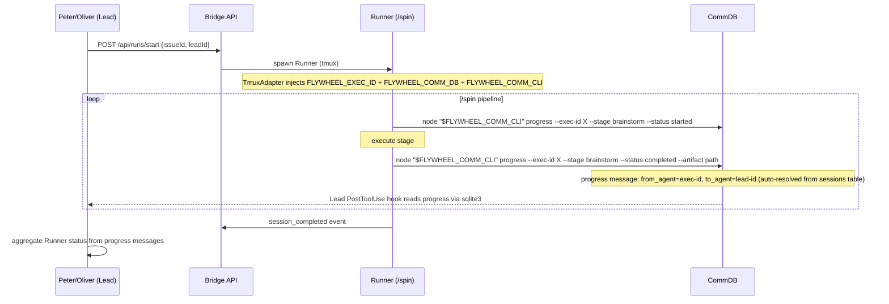
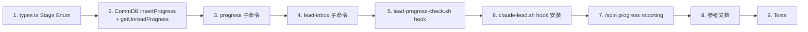

# Plan: Flywheel Orchestrator 模式 — Lead 智能编排 Phase 1

**Version**: v1.17.0
**Issue**: GEO-292
**Date**: 2026-03-30
**Source**: `doc/exploration/new/GEO-292-orchestrator-patterns.md`, `doc/research/new/GEO-292-orchestrator-patterns.md`
**Status**: codex-approved

---

## 目标

让 Flywheel Lead（Peter/Oliver/Simba）获得 orchestrator 级别的 **进度可见性**：
1. Runner 主动报告 pipeline 进度（progress 消息）
2. Lead 可见 Runner 当前步骤（通过 Lead 侧 hook 消费 progress）
3. /spin 自动发送进度更新（条件性，仅 Runner 模式）
4. Lead 编排行为参考文档

**Scope**: Phase 1 只做 **progress reporting 基建 + Lead 侧消费链路 + 编排参考文档**。
- **不包括**: Ship Protocol（推迟到 Phase 2，与 post-merge 责任归属一起设计）
- **不包括**: Bridge Sprint Model（Phase 2）
- **不包括**: Gate Enforcement（Phase 3）

## 架构



### 关键路由设计

Progress 消息的 **发送方向是 Runner → Lead**（不是 Runner → Runner）：

```
Runner 发送: node "$FLYWHEEL_COMM_CLI" progress --exec-id <FLYWHEEL_EXEC_ID> --stage X --status Y --db $FLYWHEEL_COMM_DB
  ↓
progress 命令内部:
  1. 从 CommDB sessions 表查 lead_id (WHERE execution_id = exec-id)
  2. 插入 messages: from_agent = exec-id, to_agent = lead_id, type = 'progress'
  ↓
Lead 侧 PostToolUse hook (lead-progress-check.sh):
  1. 用 sqlite3 直接读取 CommDB: WHERE to_agent = <FLYWHEEL_LEAD_ID> AND type = 'progress' AND read_at IS NULL
  2. 标记已读
  3. 通过 additionalContext 注入 Lead 上下文（静默更新，不触发"有指令"提示）
```

## Canonical Stage Enum

**一次性冻结完整 enum**，对齐 orchestrator 9 步 template（`.claude/orchestrator/state.sh`）。Phase 1 只上报前 5 个。

| Stage Literal | Step Key | Display Label | /spin 对应 | Phase 1 |
|--------------|----------|---------------|------------|---------|
| `verify_env` | `1` | Verify Environment | Step 0 (Parse & Onboard) | Yes |
| `brainstorm` | `2` | Brainstorm | /brainstorm | Yes |
| `research` | `3` | Research | /research | Yes |
| `plan_review` | `4` | Plan + Design Review | /write-plan + /codex-design-review | Yes |
| `implement` | `5` | Implement | /implement | Yes |
| `code_review` | `5a` | Code Review | codex-code-review / gemini-code-review | No (Phase 2) |
| `user_approval` | `5b` | User Approval | Annie 审批 | No (Phase 2) |
| `ship` | `6` | Ship | PR merge | No (Phase 2) |
| `post_ship` | `7` | Post-Ship | Archive + cleanup | No (Phase 2) |

**Stage status 枚举**: `started` | `completed` | `failed`

**Serialized enum** (machine-readable, 一次性定义完整，Phase 2 不再改):
```
verify_env | brainstorm | research | plan_review | implement | code_review | user_approval | ship | post_ship
```

此 enum 定义在 `packages/flywheel-comm/src/types.ts` 中作为 TypeScript union type，同时在 `progress` 子命令中做 validation。

## 改动清单

### 1. CommDB: `insertProgress()` 方法

**文件**: `packages/flywheel-comm/src/db.ts`

**改动**: 新增 `insertProgress(fromAgent, toAgent, content)` 方法，插入 `type='progress'` 消息。与 `insertInstruction` 完全对称，只是 type 不同。

```typescript
insertProgress(fromAgent: string, toAgent: string, content: string): string {
  const id = randomUUID();
  this.db.prepare(
    `INSERT INTO messages (id, from_agent, to_agent, type, content)
     VALUES (?, ?, ?, 'progress', ?)`
  ).run(id, fromAgent, toAgent, content);
  return id;
}
```

**新增查询方法**: `getUnreadProgress(leadId)` — 按 `to_agent = leadId AND type = 'progress' AND read_at IS NULL` 查询。复用 `markInstructionRead()` 标记已读（该方法不检查 type，只 UPDATE WHERE id=?）。

**测试**: Unit test `insertProgress` 插入正确 type，`getUnreadProgress` 返回正确消息。

### 2. types.ts: Stage Enum 定义

**文件**: `packages/flywheel-comm/src/types.ts`

**新增**:
```typescript
export const PIPELINE_STAGES = [
  'verify_env', 'brainstorm', 'research', 'plan_review', 'implement',
  'code_review', 'user_approval', 'ship', 'post_ship',
] as const;
export type PipelineStage = typeof PIPELINE_STAGES[number];

export const PROGRESS_STATUSES = ['started', 'completed', 'failed'] as const;
export type ProgressStatus = typeof PROGRESS_STATUSES[number];

export interface ProgressPayload {
  stage: PipelineStage;
  status: ProgressStatus;
  executionId: string;
  issueId?: string;
  artifact?: string;
  timestamp: string;
}
```

### 3. flywheel-comm: 新增 `progress` 子命令

**文件**: `packages/flywheel-comm/src/commands/progress.ts`（新增）
**文件**: `packages/flywheel-comm/src/index.ts`（注册新命令）

**CLI**:
```bash
flywheel-comm progress --exec-id <exec-id> --stage brainstorm --status completed \
  --artifact "doc/exploration/new/GEO-292.md"
```

**内部逻辑**:
1. 打开 CommDB
2. Validate `--stage` against `PIPELINE_STAGES`，`--status` against `PROGRESS_STATUSES`
3. 从 `sessions` 表查 `lead_id` 和 `issue_id` WHERE `execution_id = exec-id`
   - 找不到 → 静默退出 (exit 0)，兼容非 Flywheel 场景
4. 构造 JSON content (`ProgressPayload`):
   ```json
   {
     "stage": "brainstorm",
     "status": "completed",
     "artifact": "doc/exploration/new/GEO-292.md",
     "executionId": "<exec-id>",
     "issueId": "<from sessions table>",
     "timestamp": "2026-03-30T04:30:00Z"
   }
   ```
5. 调用 `db.insertProgress(execId, leadId, JSON.stringify(payload))`

**必填参数**: `--exec-id`, `--stage`, `--status`
**可选参数**: `--artifact`, `--db`, `--project`

**不改动 `send` 和 `inbox`**: 保持现有 CLI surface 不变。

**测试**:
- Unit: progress 子命令生成正确 JSON
- Unit: `--stage` 校验（无效 stage 报错）
- Unit: `--status` 校验（无效 status 报错）
- Unit: sessions 表无记录时静默退出
- Integration: progress → getUnreadProgress round-trip

### 4. flywheel-comm: 新增 `lead-inbox` 子命令

**文件**: `packages/flywheel-comm/src/commands/lead-inbox.ts`（新增）
**文件**: `packages/flywheel-comm/src/index.ts`（注册）

**CLI**:
```bash
flywheel-comm lead-inbox --lead <lead-id> [--type progress] [--db <path>] [--json]
```

**内部逻辑**:
1. 调用 `db.getUnreadProgress(leadId)` (type 固定为 progress)
2. 标记已读
3. 输出消息列表

**不修改现有 `inbox` 命令**: `inbox` 保持为 Runner → instruction only。

**测试**:
- Unit: lead-inbox 返回 progress 消息并标记已读
- Unit: lead-inbox 输出格式正确（text + JSON modes）

### 5. Lead 侧 PostToolUse hook: `lead-progress-check.sh`

**文件**: `packages/teamlead/scripts/lead-progress-check.sh`（新增，与 `claude-lead.sh` 同目录）

这是 **Lead 专用** 的 PostToolUse hook（与 Runner 侧 `scripts/hooks/inbox-check.sh` 对称但独立）。

**部署路径**: `~/.flywheel/hooks/lead-progress-check.sh`（stable path，由 `claude-lead.sh` 复制部署）

**依赖**: `sqlite3`（macOS 内置）+ `jq`（brew）。**不依赖 `flywheel-comm` CLI**——延续 Runner hook 模式，直接用 sqlite3 读取 CommDB，确保 hook 复制到 `~/.flywheel/hooks/` 后无需 repo 路径。

**逻辑**（对称 `inbox-check.sh` 模式）:
```bash
#!/bin/bash
# Lead Progress Check — PostToolUse Hook (GEO-292)
# Dependencies: sqlite3, jq
# Env vars: FLYWHEEL_LEAD_ID (set by claude-lead.sh)
#           FLYWHEEL_COMM_DB (set by claude-lead.sh)

set -euo pipefail

LEAD_ID="${FLYWHEEL_LEAD_ID:-}"
DB_PATH="${FLYWHEEL_COMM_DB:-}"

# Quick exit for non-Lead sessions
if [ -z "$LEAD_ID" ] || [ -z "$DB_PATH" ] || [ ! -f "$DB_PATH" ]; then
  exit 0
fi

sq_ro() { sqlite3 -readonly -cmd ".timeout 5000" "$DB_PATH" "$1" 2>/dev/null; }
sq()    { sqlite3 -cmd ".timeout 5000" "$DB_PATH" "$1" 2>/dev/null; }

COUNT=$(sq_ro "SELECT COUNT(*) FROM messages WHERE to_agent='${LEAD_ID}' AND type='progress' AND read_at IS NULL AND expires_at > datetime('now');" || echo "0")

if [ "$COUNT" -eq "0" ] 2>/dev/null; then exit 0; fi

# Read progress as JSON
JSON_ROWS=$(sq "SELECT json_group_array(json_object('id', id, 'from_agent', from_agent, 'content', content)) FROM (SELECT id, from_agent, content FROM messages WHERE to_agent='${LEAD_ID}' AND type='progress' AND read_at IS NULL AND expires_at > datetime('now') ORDER BY created_at ASC, rowid ASC);") || exit 0

if [ -z "$JSON_ROWS" ] || [ "$JSON_ROWS" = "[[]]" ] || [ "$JSON_ROWS" = "[null]" ]; then exit 0; fi

IDS=$(echo "$JSON_ROWS" | jq -r '.[] | .id' 2>/dev/null | sed "s/.*/'&'/" | paste -sd, -)
if [ -z "$IDS" ]; then exit 0; fi

# Mark as read BEFORE outputting
if ! sq "UPDATE messages SET read_at=datetime('now') WHERE id IN (${IDS});"; then exit 0; fi

# Format progress messages (parse JSON content from each message)
DISPLAY_MSGS=$(echo "$JSON_ROWS" | jq -r '.[] |
  (.content | fromjson?) as $p |
  if $p then "[Runner Progress] " + ($p.issueId // "unknown") + " " + $p.stage + " " + $p.status + (if $p.artifact then " (artifact: " + $p.artifact + ")" else "" end)
  else "[Runner Progress] " + .content
  end' 2>/dev/null)

if [ -z "$DISPLAY_MSGS" ]; then exit 0; fi

jq -n --arg msgs "$DISPLAY_MSGS" '{
  hookSpecificOutput: {
    hookEventName: "PostToolUse",
    additionalContext: ("RUNNER PROGRESS UPDATE — For your awareness, no action needed unless stuck\n\n" + $msgs)
  }
}'
```

**与 inbox-check.sh 的区别**:
- `inbox-check.sh`: Runner 侧，检查 `instruction` 类型，env `FLYWHEEL_EXEC_ID`
- `lead-progress-check.sh`: Lead 侧，检查 `progress` 类型，env `FLYWHEEL_LEAD_ID`
- 两者都用 sqlite3 + jq，都不依赖 `flywheel-comm` CLI

### 6. `claude-lead.sh`: 安装 Lead progress hook

**文件**: `packages/teamlead/scripts/claude-lead.sh`

**改动**:

**6a. 部署 hook 脚本**: 复用 `install_post_compact_hook` 的部署模式——从 `$SCRIPT_DIR/lead-progress-check.sh` 复制到 `~/.flywheel/hooks/lead-progress-check.sh`。

**6b. 注册到 settings.json PostToolUse**: 使用与 PostCompact 相同的 jq 幂等 merge 方案：

```bash
install_lead_progress_hook() {
  local src_script
  src_script="$(cd "$SCRIPT_DIR" && pwd)/lead-progress-check.sh"
  if [ ! -f "$src_script" ]; then
    log "WARNING: lead-progress-check.sh source not found: $src_script"
    return
  fi

  local hook_script="${HOME}/.flywheel/hooks/lead-progress-check.sh"
  mkdir -p "$(dirname "$hook_script")"
  cp "$src_script" "$hook_script"
  chmod +x "$hook_script"

  local settings_file="${HOME}/.claude/settings.json"
  mkdir -p "$(dirname "$settings_file")"

  local existing
  if [ -f "$settings_file" ]; then
    if ! jq empty "$settings_file" 2>/dev/null; then
      log "WARNING: $settings_file is not valid JSON. Skipping hook install."
      return
    fi
    existing=$(cat "$settings_file")
  else
    existing="{}"
  fi

  local tmpfile
  tmpfile=$(mktemp "${settings_file}.XXXXXX")

  if ! echo "$existing" | jq --arg cmd "$hook_script" '
    .hooks.PostToolUse = (if .hooks.PostToolUse | type == "array" then .hooks.PostToolUse else [] end) |
    .hooks.PostToolUse = [.hooks.PostToolUse[] | select(any(.hooks[]?.command // ""; endswith("lead-progress-check.sh")) | not)] |
    if (.hooks.PostToolUse | map(select(any(.hooks[]?.command // ""; . == $cmd))) | length) == 0
    then .hooks.PostToolUse += [{"hooks": [{"type": "command", "command": $cmd}]}]
    else .
    end
  ' > "$tmpfile" 2>/dev/null; then
    log "WARNING: Failed to merge PostToolUse hook into settings. Skipping."
    rm -f "$tmpfile"
    return
  fi

  if ! jq empty "$tmpfile" 2>/dev/null; then
    log "WARNING: Generated settings JSON is invalid. Skipping hook install."
    rm -f "$tmpfile"
    return
  fi

  mv "$tmpfile" "$settings_file"
  log "Lead progress hook installed: $hook_script"
}
```

**6c. 环境变量确认**: 当前 `claude-lead.sh` 已导出 `FLYWHEEL_LEAD_ID`（line 370）和 `FLYWHEEL_COMM_CLI`（line 177）以及 `FLYWHEEL_COMM_DB`（line 171-185）。Lead 侧 hook 依赖的三个环境变量均已在 Lead 启动脚本中导出，无需额外改动。

**6d. 共存验证**: 需要验证三方共存——Lead progress hook 安装到 global `~/.claude/settings.json` PostToolUse 时，必须：
- **保留 Runner inbox-check.sh**: Runner 的 `inbox-check.sh` 也注册在全局 `~/.claude/settings.json` 的 `PostToolUse` 数组中（由 `/setup-flywheel-hooks` 安装，`.claude/commands/setup-flywheel-hooks.md:61-124`）。jq filter 只移除旧的 `lead-progress-check.sh` entries，不触碰其他 PostToolUse entries。
- **保留 PostCompact hook**: PostCompact 是不同 hook 类型，PostToolUse 操作不影响它。
- **幂等**: 多次执行 `install_lead_progress_hook()` 不产生重复 entries。

**Coexistence test** (新增):
- 预置 `~/.claude/settings.json` 包含: `inbox-check.sh` in PostToolUse + `post-compact-bootstrap.sh` in PostCompact + 一个无关的 PostToolUse hook
- 执行 `install_lead_progress_hook()`
- 断言: `lead-progress-check.sh` 被添加，`inbox-check.sh` 保留，无关 hook 保留，PostCompact 不变
- 再次执行 → 断言不产生重复

### 7. /spin skill: 插入 progress reporting

**文件**: `.claude/commands/spin.md`

**改动**: 在 Step 2 的每个 sub-skill 执行前后插入 progress 报告。条件性：只在 `FLYWHEEL_EXEC_ID` 环境变量存在时发送。

```markdown
## Progress Reporting (Runner Mode)

If environment variables FLYWHEEL_EXEC_ID, FLYWHEEL_COMM_DB, and FLYWHEEL_COMM_CLI all exist, report progress:
  Before each stage:
    node "$FLYWHEEL_COMM_CLI" progress --exec-id $FLYWHEEL_EXEC_ID --stage <stage> --status started --db $FLYWHEEL_COMM_DB
  After successful completion:
    node "$FLYWHEEL_COMM_CLI" progress --exec-id $FLYWHEEL_EXEC_ID --stage <stage> --status completed --artifact <path> --db $FLYWHEEL_COMM_DB
  On error:
    node "$FLYWHEEL_COMM_CLI" progress --exec-id $FLYWHEEL_EXEC_ID --stage <stage> --status failed --db $FLYWHEEL_COMM_DB
```

**CLI 调用方式**: Runner 中 `flywheel-comm` 的稳定调用约定是通过绝对路径。TmuxAdapter 注入 `FLYWHEEL_EXEC_ID` + `FLYWHEEL_COMM_DB`，但不保证 `flywheel-comm` 在 PATH 上。现有 Blueprint 已采用绝对 `dist/index.js` 路径注入 prompt 的方式（`packages/edge-worker/src/Blueprint.ts:298-319`）。

/spin 中应使用 `FLYWHEEL_COMM_CLI` 环境变量（需要在 TmuxAdapter 中新增导出，或由 Blueprint prompt 注入绝对路径）：

```markdown
If FLYWHEEL_EXEC_ID and FLYWHEEL_COMM_DB and FLYWHEEL_COMM_CLI exist:
  node "$FLYWHEEL_COMM_CLI" progress --exec-id $FLYWHEEL_EXEC_ID --stage <stage> --status started --db $FLYWHEEL_COMM_DB
```

**实现细节**: TmuxAdapter 已注入 `FLYWHEEL_EXEC_ID` 和 `FLYWHEEL_COMM_DB`。需要额外注入 `FLYWHEEL_COMM_CLI` 指向 `packages/flywheel-comm/dist/index.js` 的绝对路径。这与 Lead 侧 `claude-lead.sh` 导出 `FLYWHEEL_COMM_CLI` 的模式一致（`packages/teamlead/scripts/claude-lead.sh:177`）。

**Phase 1 上报的阶段**（对齐 Canonical Stage Enum）:
- Step 0 完成后: `--stage verify_env --status completed`
- /brainstorm 前后: `--stage brainstorm --status started/completed`
- /research 前后: `--stage research --status started/completed`
- /write-plan + /codex-design-review 前后: `--stage plan_review --status started/completed`
- /implement 前后: `--stage implement --status started/completed`

**本地开发不受影响**: `FLYWHEEL_EXEC_ID` 不存在时，所有 progress 行都被跳过。

### 8. Lead 编排行为参考文档

**文件**: `doc/reference/lead-orchestration-patterns.md`（新增）

这是 **参考文档**，不是可执行模板。供 Lead agent.md 更新时引用。

内容包括：
- **Reconcile 行为**: 查询 Bridge `GET /api/runs/active` + `GET /api/linear/issues` → 识别可 dispatch 的 issue → 调用 `POST /api/runs/start`
- **Monitor 行为**: 从 progress hook 注入的上下文中汇总 Runner 状态 → 多 Runner 进度一览
- **Progress 消息处理规范**: 收到 progress 时更新内部跟踪，批量汇报（不逐条打扰 Annie）

**消费方式**: 本文档由人类或 Lead agent 手动引用。不自动同步到产品 repo。后续 Lead agent.md 更新（GeoForge3D PR）时从此文档提取相关章节。

**不包括 Ship Protocol**: 推迟到 Phase 2。

## 测试策略

### Unit Tests
- `db.insertProgress()` → 正确 DB 记录（type='progress'）
- `db.getUnreadProgress(leadId)` → 按 to_agent 过滤
- `progress` 子命令: 生成正确 JSON content (ProgressPayload 格式)
- `progress` 子命令: stage enum 校验（无效 stage 报错）
- `progress` 子命令: status enum 校验（无效 status 报错）
- `progress` 子命令: sessions 表无记录时静默退出
- `lead-inbox` 子命令: 返回 progress 消息并标记已读
- 现有 `send`/`inbox` 行为不变（regression test）

### Integration Tests
- Runner → CommDB → Lead lead-inbox round-trip（progress 类型）
- progress 命令 → sessions 表 lead_id 解析 → 正确 to_agent

### Hook Smoke Tests
- `lead-progress-check.sh`: 仅靠 `FLYWHEEL_LEAD_ID` + `FLYWHEEL_COMM_DB` env vars 在 `~/.flywheel/hooks/` 中运行
- `lead-progress-check.sh`: 无 env vars 时 exit 0（no-op）
- `lead-progress-check.sh`: DB 不存在时 exit 0
- `lead-progress-check.sh`: 与现有 PostCompact hook 共存不冲突

### E2E Verification
- 手动启动 Runner → /spin 发送 progress → Lead hook 注入上下文
- 验证 Lead 收到格式化的 progress 摘要

## 文件变更汇总

| 文件 | 类型 | 改动描述 |
|------|------|----------|
| `packages/flywheel-comm/src/db.ts` | 修改 | 新增 `insertProgress()` + `getUnreadProgress()` |
| `packages/flywheel-comm/src/types.ts` | 修改 | 新增 `PIPELINE_STAGES`, `ProgressPayload` 等类型 |
| `packages/flywheel-comm/src/commands/progress.ts` | **新增** | progress 子命令（Runner → Lead progress 报告） |
| `packages/flywheel-comm/src/commands/lead-inbox.ts` | **新增** | lead-inbox 子命令（Lead 读取 progress） |
| `packages/flywheel-comm/src/index.ts` | 修改 | 注册 `progress` + `lead-inbox` 子命令 |
| `.claude/commands/spin.md` | 修改 | 插入条件性 progress reporting |
| `packages/teamlead/scripts/lead-progress-check.sh` | **新增** | Lead PostToolUse hook（sqlite3-based，无 CLI 依赖） |
| `packages/teamlead/scripts/claude-lead.sh` | 修改 | 安装 progress hook（jq merge 到 PostToolUse） |
| `packages/claude-runner/src/TmuxAdapter.ts` | 修改 | 注入 `FLYWHEEL_COMM_CLI` 环境变量 |
| `doc/reference/lead-orchestration-patterns.md` | **新增** | Lead 编排行为参考文档 |
| Tests | **新增** | ~14-17 个测试用例（含 hook coexistence test） |

**不改动的文件**:
- `packages/flywheel-comm/src/commands/send.ts` — 保持现状
- `packages/flywheel-comm/src/commands/inbox.ts` — 保持现状
- `scripts/hooks/inbox-check.sh` — 保持现状（Runner 侧 instruction hook，全局 settings.json 注册由 /setup-flywheel-hooks 管理）
- Bridge API — 无新端点

## 实施顺序



## 兼容性

- **向后兼容**: 所有改动都是 additive。`send`/`inbox` 不变。
- **Runner 无 flywheel-comm**: /spin 检查三个环境变量（`FLYWHEEL_EXEC_ID` + `FLYWHEEL_COMM_DB` + `FLYWHEEL_COMM_CLI`），任一不存在则跳过 progress reporting。
- **旧版 Lead 无 progress hook**: 不影响现有 Lead 行为。Progress 消息在 DB 中自然过期（72h TTL）。
- **Hook 共存**: PostToolUse hook (progress) 与 PostCompact hook 互不干扰（不同 hook 类型）。
- **CLI `--json` 输出**: 新命令 `progress` 和 `lead-inbox` 有独立的 JSON 格式，不影响现有命令。

## Phase 2 待解决事项（本 PR 不涉及）

1. **Ship Protocol 责任归属**: bridge `post-merge.ts` vs Lead vs /spin Archive → 需要统一 owner
2. **Phase 2 stage 上报**: `code_review | user_approval | ship | post_ship`（enum 已冻结，只需在对应流程埋点）
3. **Bridge Sprint Model**: 持久化 sprint 状态，支持 dashboard
4. **Gate Enforcement**: Bridge 校验 step 前置条件
