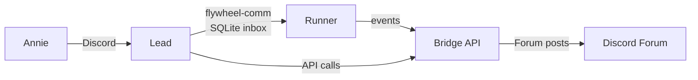
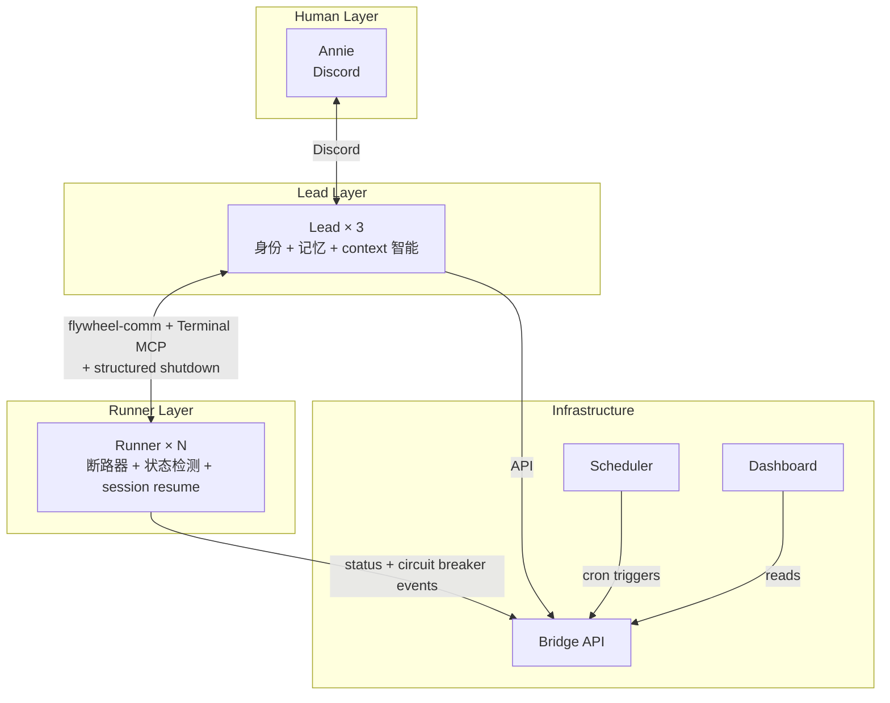
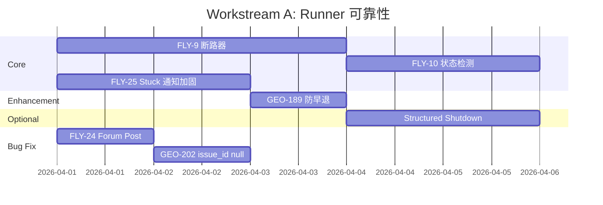
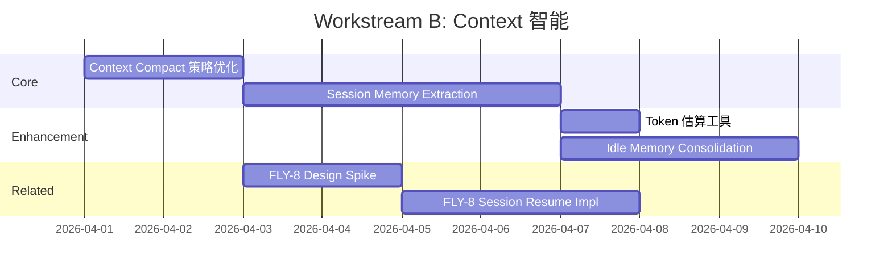
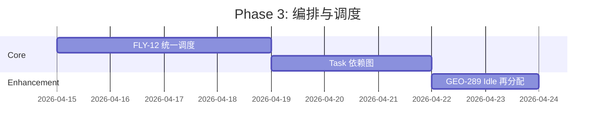
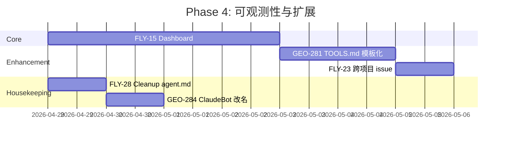

# Plan: Flywheel 新一代架构

**Version**: v2.0
**Issue**: FLY-31
**Date**: 2026-03-31
**Source**: `doc/exploration/new/FLY-31-flywheel-next-gen-architecture.md` (worktree), `doc/research/new/FLY-3-agentsmesh-deep-dive.md`, `doc/research/new/FLY-31-claude-code-source-analysis.md`
**Status**: codex-approved

---

## Executive Summary

综合 AgentsMesh（FLY-3）和 Claude Code 源码分析（FLY-31）的研究成果，本 plan 定义 Flywheel v2.0 的架构升级路线图。核心目标：**智能 Runner + 智慧 Lead + 透明系统**。分 4 个 phase 实施，每个 phase 可独立交付价值。

---

## 1. 架构 Delta：从 v1.x 到 v2.0

### 1.1 当前架构 (v1.x)



**痛点**：
1. Runner 是"哑执行器"——卡住了不知道通知，重复错误不知道停止
2. Lead context window 管理粗糙——70% PostCompact hook 是临时方案
3. Runner session 中断后无法恢复——从头开始浪费时间
4. 定时任务管理分散（目前确认 2 个 launchd plist: daily-standup + updater，加上多个手动/cron 触发的 Bridge 端点），缺乏统一视图
5. 系统状态可见性差——要查状态得问 Lead 或看 Bridge API

### 1.2 目标架构 (v2.0)



---

## 2. Issue 清理：去重、合并、废弃

在实施 plan 之前，先清理 Linear backlog。

### 2.1 关闭/合并（重复）

| 关闭 | 保留 | 原因 |
|------|------|------|
| FLY-4 (Autopilot 断路器) | FLY-9 (Runner 断路器) | 同一功能，FLY-9 更清晰 |
| FLY-5 (Agent 状态检测) | FLY-10 (Agent 状态检测) | 完全重复 |
| FLY-16 (Sandbox Resume) | FLY-8 (Session Resume) | 同一功能 |
| FLY-7 (Remote Runner) | FLY-17 (Remote Runner) | 合并，FLY-17 更完整 |
| GEO-271 (多机部署) | FLY-17 (Remote Runner) | 纳入 FLY-17 scope |
| GEO-190 (Pluggable sandbox) | FLY-17 (Remote Runner) | 纳入 FLY-17 scope |

### 2.2 废弃

| Issue | 原因 |
|-------|------|
| GEO-154 (CmuxRunner) | cmux 评估不适用，Lead 直接管理 Runner |
| GEO-220 (learn-claude-code patterns) | 已被 FLY-31 源码分析替代 |
| FLY-19 (200 行文件限制) | 硬 CI 阻断不现实，改为**软阈值 + hotspot review**：新文件超过 400 行须写 justification，现有 hotspot（plugin.ts 1461L, StateStore.ts 1276L）纳入技术债跟踪 |

### 2.3 不创建 FLY-32~38

FLY-31 Claude Code 分析建议的 FLY-32~38 **不作为独立 issue 创建**。它们的内容已被本 plan 的各 phase 吸收：

| 建议 | 归属 |
|------|------|
| FLY-32 Task 依赖图 | Phase 3 (Orchestrator 升级) |
| FLY-33 Context Compact 策略 | Workstream B (Context 智能) |
| FLY-34 Session Memory Extraction | Workstream B (Context 智能) |
| FLY-35 Structured Shutdown | Workstream A (Runner 可靠性) |
| FLY-36 Idle Memory Consolidation | Workstream B (Context 智能) |
| FLY-37 AgentId 统一格式 | 不做——当前格式够用，改动影响大 |
| FLY-38 Token 估算 | Workstream B (Context 智能的辅助) |

---

## 3. 实施路线图（两条并行 Workstream）

> **结构说明**：v2.0 的工作分为两条可并行的 workstream，而非线性 phase。Workstream A（Runner 可靠性）和 Workstream B（Lead Context 智能）没有相互依赖，可同时启动。Phase 3/4 保持线性排列是因为它们确实依赖前两条 workstream 的基础设施。

### Workstream A: Runner 可靠性（智能 Runner）

**目标**：Runner 从"哑执行器"升级为有自主判断能力的智能执行者。

**Duration**: 2-3 周（可与 Workstream B 并行）



#### FLY-9: Runner 断路器 (Circuit Breaker)

**来源**: AgentsMesh Autopilot 断路器 + Claude Code auto-compact circuit breaker

**设计**：
- 在 Runner 侧增加 PostToolUse hook `circuit-breaker.sh`
- 追踪两个信号：
  1. **No-progress**: 连续 N 次 tool call 无文件变更 → 累计 no-progress 计数
  2. **Repeated error**: 相同错误模式出现 N 次 → 触发断路器
- **两层保护（local hard-stop + Lead escalation）**：
  1. **Local hard-stop（Runner 自主）**: 达到硬阈值（no-progress = 20 次, repeated-error = 5 次）时，hook 通过 **`tmux kill-pane -t "$TMUX_PANE"`** 终止 Runner pane，**无需等待 Lead 响应**。这确保即使 Lead 不可达、version skew 导致 instruction 被忽略、或 rollout 窗口期间 Lead 规则未更新，Runner 也能自行停止烧钱。`pane_dead` 是 `TmuxAdapter` 已有的可靠退出信号（`TmuxAdapter.ts:438-479`），E2E 脚本也使用 `kill-pane` 而非 `/exit`（`scripts/e2e-tmux-runner.ts:234-275`）
     - **前置条件**：Runner 启动时由 `TmuxAdapter` 注入 `TMUX_PANE` 环境变量（当前已有 `FLYWHEEL_EXEC_ID` 和 `FLYWHEEL_COMM_DB` 注入，同理扩展），hook 通过该环境变量定位目标 pane
     - **Prerequisite spike**（实现前验证）：确认 PostToolUse hook 能成功执行 `tmux kill-pane` 并触发 `pane_dead`，而非被 Claude Code 的 hook 沙箱限制
  2. **Lead escalation（可选增强）**: 达到软阈值（no-progress = 15 次, repeated-error = 3 次）时，通过 flywheel-comm `send` 发送 `instruction` 给 Lead（content 为 JSON `{"type":"circuit_breaker","reason":"...","counts":{"no_progress":N,"repeated_error":N}}`），Lead 通过 inbox-check hook 获取后决定：继续/重试/终止/通知 Annie
- 终止路径使用现有 Bridge `POST /api/actions/terminate`（`packages/teamlead/src/bridge/actions.ts:590-660`），不引入新的 terminate 机制
- **参考**: Claude Code 的 auto-compact circuit breaker（3 次连续失败停止）

**实现要点**：
- Hook 脚本源码在 `scripts/hooks/circuit-breaker.sh`（与现有 `inbox-check.sh` 同目录），部署至 `~/.flywheel/bin/circuit-breaker.sh`（由 `install-hooks.sh` 安装）
- 状态文件在 Runner 工作目录下 `.circuit-breaker-state`（通过 `$PWD` 或 TmuxAdapter 注入的 `FLYWHEEL_EXEC_ID` 推导路径——Runner 启动时已有 `FLYWHEEL_EXEC_ID` 和 `FLYWHEEL_COMM_DB` 环境变量注入，见 GEO-266）
- TmuxAdapter 新增 `TMUX_PANE` 环境变量注入（用于 local hard-stop 的 `tmux kill-pane -t "$TMUX_PANE"`）
- 不新增 flywheel-comm message type——复用现有 `instruction` type + structured JSON content

**文件影响**: `scripts/hooks/circuit-breaker.sh` (新 hook), `scripts/install-hooks.sh` (注册), `packages/claude-runner/src/TmuxAdapter.ts` (TMUX_PANE 注入), `packages/flywheel-comm/` (可选 helper), Lead identity.md (行为规则, 在项目 repo `.lead/` 下)

#### FLY-10: Agent 状态检测

**来源**: AgentsMesh agent_status (executing/waiting/idle)

**现状**：Terminal MCP 已有 `runner_terminal_status` tool（`packages/terminal-mcp/src/index.ts:278-331`），基于终端输出 heuristics 判断 Runner 状态（`packages/terminal-mcp/src/status.ts:1-75`）。这是**按需查询**，不是持久化采样。

**设计（按需模式，不做持久化采样）**：
- **不让 `teamlead` 依赖 `terminal-mcp`**（避免 Bridge 反向依赖工具服务包，破坏包层次）。改为在 `packages/teamlead/src/bridge/` 中**复制** `status.ts` 的核心 heuristic 逻辑（~75 行纯逻辑，不含 MCP server 依赖）。等语义稳定后再考虑抽取到 `flywheel-comm` 或独立共享模块
- 扩展返回值为**四态**（比原三态增加 `unknown` 以区分不可达场景）：
  - `executing`: tmux 有 Claude Code 进程且终端输出显示活跃
  - `waiting`: tmux 有 Claude Code 进程但终端显示等待用户输入或 tool 完成
  - `idle`: tmux session 存在但无 Claude Code 进程
  - `unknown`: tmux session 不存在或不可达（区别于 `idle`——无法判断是正常结束还是异常消失）
- **两个消费面**：
  - **Lead**: 通过 Terminal MCP tool（已有 MCP 配置注入，`claude-lead.sh:495-531`）按需查询
  - **Bridge**: 新增 `GET /api/sessions/:id/status` 端点，**直接调用复制过来的 status 逻辑**（本地 tmux + CommDB 查询），不走 MCP——Bridge 和 Terminal MCP 运行在同一台机器，无需 IPC
- Bridge 已有类似模式：`session-capture.ts` 直接调用 `tmux capture-pane`（`packages/teamlead/src/bridge/session-capture.ts:1-130`），status 查询同理
- **不做持久化状态采样**：避免引入采样频率、存储、失真容忍度等复杂度。状态是实时查询结果

**文件影响**: `packages/teamlead/src/bridge/` (复制 status heuristic + Bridge route), `packages/terminal-mcp/src/status.ts` (保持不变，Terminal MCP 继续自用)

#### FLY-25: Stuck Escalation 加固（原 "Runner Stuck 通知"）

**来源**: 现有 bug report + AgentsMesh Autopilot

**现状**：核心检测**已存在**——`StateStore.getStuckSessions()` 基于 `running + last_activity_at` 查询（`packages/teamlead/src/StateStore.ts:768-780`），`HeartbeatService.checkStuck()` 已发送 `session_stuck` 事件（`packages/teamlead/src/HeartbeatService.ts:71-99, 239-252`）。**真正缺失的是通知可靠送达和 Annie-facing 的 escalation 体验，不是基础检测本身。**

**前置改动：`LeadRuntime.deliver()` 合约升级**：
当前 `deliver()` 是 fire-and-forget（`lead-runtime.ts:66-74`），transport failure 被吞掉后仍无条件 `markLeadEventDelivered(seq)`（`HeartbeatService.ts:346-348`）。这意味着消息没送达，事件却被标记成 delivered——假阳性健康状态。

对 guardrail 事件（stuck/orphan/stale），`deliver()` 必须改为**可观测结果**：
- 方案：`deliver()` 返回 `{ delivered: boolean; error?: string }`，替代 void
- `ClaudeDiscordRuntime.deliver()` 捕获 transport failure 后返回 `{ delivered: false, error }` 而非静默 warn
- `RegistryHeartbeatNotifier.deliverHook()` 只在 `result.delivered === true` 时调用 `markLeadEventDelivered(seq)`
- 对 advisory 事件（如 session_completed）保持 best-effort 行为——`deliver()` 返回 false 时仍标记 delivered（现有行为不变）
- **影响范围**：`LeadRuntime` interface, `ClaudeDiscordRuntime`, `OpenClawRuntime`, `HeartbeatService`

**设计（聚焦 alert delivery + escalation，非基础检测）**：
- **Checked delivery for guardrail events**：stuck/orphan/stale 事件使用升级后的 `deliver()` 合约——仅在 `delivered: true` 时标记已送达
- **Retry undelivered**：未送达的 guardrail event 在下一个 heartbeat cycle 重发（最多 3 次），超过 3 次 → 在 dashboard 标记 "alert delivery failed"
- **Dashboard 暴露**：在 `buildDashboardPayload()` 中增加 stuck sessions 列表（复用 `getStuckSessions()` 现有查询）
- **Lead 行为规则**：Lead 收到 stuck 通知后可用 Terminal MCP `runner_terminal_status` 按需确认 Runner 实际状态，再决策（继续等待/终止/通知 Annie）
- Lead 在 Discord 通知 Annie，附带 Runner 状态和卡住时长
- 与现有 stale session patrol (GEO-270) 集成：stale patrol 处理 completed/failed >24h 的 session，stuck 通知处理 running 且 inactive >30min 的 session
- **不依赖 FLY-10 的实时状态**：stuck 检测用已有 `last_activity_at`，Lead 确认时才按需查状态

**文件影响**: `packages/teamlead/src/bridge/lead-runtime.ts` (deliver() 返回值), `packages/teamlead/src/bridge/claude-discord-runtime.ts` (transport error 暴露), `packages/teamlead/src/HeartbeatService.ts` (checked delivery + retry), `packages/teamlead/src/bridge/dashboard-data.ts` (stuck sessions + delivery failures), Lead identity.md (escalation 行为规则)

#### Structured Shutdown Protocol — Optional

**优先级**: Optional（降级自 High）。现有 `handleTerminate()` 直接 kill tmux session（`packages/teamlead/src/bridge/actions.ts:590-660`）已相当可靠。在没有强制 kill 造成高频 repo 损坏、工作丢失或 Claude 状态损坏的数据之前，此协议的复杂度可能不值。

**来源**: Claude Code 的 shutdown_request/shutdown_response

**前置条件**: 在实现前需先确认——现有 `ask/respond` CLI 是按 "Runner → Lead" 方向命名设计的（`ask` 帮助文本为 `Ask your Lead a question`，`pending` 为 `List unanswered questions for a lead`），反向使用（Lead → Runner）需要先验证 CLI 语义/agent id 约定是否支持双向协议，或者改用 `instruction{type:shutdown}` + 显式 ACK event 作为更简单的替代方案。

**设计（两个可选方案，实现时二选一）**：

**方案 A（简单）**: `instruction{type:shutdown}` + ACK
- Lead 通过 `flywheel-comm send` 发送 instruction（content 为 JSON `{"type":"shutdown","reason":"...","deadline_ms":30000}`）
- Runner inbox-check hook 检测到 shutdown instruction → 完成当前 tool call → stage set `shutting_down` → 通过 `flywheel-comm send` 发送 ACK event → 退出
- Lead 轮询 CommDB 检查 ACK；超时 → 调用 Bridge terminate 强制 kill

**方案 B（复用 question/respond）**: 原始设计，但需先解决 CLI 双向语义问题
- 使用现有 `question/response` 协议，Lead 发 shutdown question，Runner respond ACK
- 需要验证 `ask`/`pending` 在反向（Lead→Runner）方向的行为

**超时升级**（两方案共用）：Lead 发送 shutdown 后启动 30s 计时器；超时未收到 ACK → 调用 Bridge `POST /api/actions/terminate` 强制 kill tmux（现有路径）

**文件影响**: Runner inbox-check hook (shutdown 检测逻辑), Lead identity.md (shutdown 行为规则, 在项目 repo `.lead/` 下)

#### FLY-24 + GEO-202: Bug Fixes

- FLY-24: Lead 启动 Runner 后补发 Forum Post + 发 link 给 Annie
- GEO-202: 修复 session issue_identifier 为 null 的 bug

---

### Workstream B: Context 智能（智慧 Lead）

**目标**：Lead 从被动管理 context 升级为主动管理，延长有效工作时间。

**Duration**: 2-3 周（可与 Workstream A 并行）

**Dependencies**: 无（与 Workstream A 无相互依赖）



#### Context Compact 策略优化

**来源**: Claude Code auto-compact 阈值（13K buffer, 20K warning）

**设计**：
- 优化 Lead 的 PostCompact hook，参考 Claude Code 精确数值：
  - 当前：70% 触发 early auto-compact（粗糙）
  - 目标：计算精确的 token 剩余量，分级处理
- PostCompact hook 增加 context hygiene：
  - 重新加载 Bridge API live state（当前已有）
  - 清理缓存的 stale 状态信息
  - 注入 "recent work summary" 而非完整历史

**文件影响**: `~/.flywheel/bin/post-compact-bootstrap.sh` (现有 hook 增量扩展), Lead identity.md (context hygiene section, 在项目 repo `.lead/` 下)

#### Session Memory Extraction

**来源**: Claude Code Session Memory Compaction

**现状**：PostCompact hook 是一个 15s 超时的 fail-open bootstrap curl（`packages/teamlead/scripts/post-compact-bootstrap.sh:17-34`）。现有 memory API 有 30s timeout、dual-bucket 约束和 502/504 失败路径（`packages/teamlead/src/bridge/memory-route.ts:68-87, 194-218`）。

**设计（带运行时护栏）**：
- 在 Lead 的 PostCompact hook 中增加 session memory 提取：
  - Compact 发生时，提取当前 session 的关键信息写入 mem0
  - 类别：正在处理的 issue、做了什么决策、pending 的 Runner 状态
  - 下次 compact 后通过 mem0 recall 恢复上下文
- 与现有 dual-bucket memory model (GEO-203) 集成

**运行时护栏**：
- **提取阈值**: 只在 compact 发生时提取，每次 compact 最多一次 mem0 write 调用
- **去重 key**: 使用 `session_id + hash(summary_content)` 作为 dedup key（幂等键，无需额外全局计数器）。hook 在 `$LEAD_WORKSPACE/.compact-memory-state` 中记录已写入的 hash（`LEAD_WORKSPACE` 由 `claude-lead.sh:203-205` 导出），下次 compact 时跳过相同 hash
- **mem0 超时策略**: 复用现有 memory API 的 30s timeout（`memory-route.ts`）；超时即跳过，不重试，不阻塞 PostCompact 主流程
- **fail-open**: mem0 API 返回 502/504/timeout → log warning + 继续，绝不阻塞 compact 后的 bootstrap 流程
- **不实现 Claude Code 的 full session memory compaction**——Lead 的 auto-compact 是 Claude Code 内置功能，我们只在 hook 层面优化

**文件影响**: `~/.flywheel/bin/post-compact-bootstrap.sh` (现有 hook 增量扩展), mem0 API calls (via Bridge `POST /api/memory`)

#### Token 估算

**来源**: Claude Code tokenEstimation.ts

**设计**：
- 在 flywheel-comm 中增加简单的 token 估算函数
- 用途：预估消息大小，避免向 Runner 发送过大的指令
- 公式：`text.length / 4`（默认），JSON 用 `/ 2`
- 不追求精确——只是辅助工具

**文件影响**: `packages/flywheel-comm/`

#### FLY-8: Session Resume — Design Spike

**来源**: AgentsMesh Pod Resume + Claude Code `--session-id`

**现状分析（Codex 验证）**：
- `TmuxAdapter` 每次生成新 `sessionId` 并明确写了 `previousSession intentionally ignored — no resume in interactive tmux mode`（`packages/claude-runner/src/TmuxAdapter.ts:247`）
- 只有 `ClaudeCodeAdapter`/`ClaudeAdapter`（`--print` headless 模式）才支持真正 resume（`packages/core/src/adapter-types.ts:163-169`）
- StateStore 已有 `session_params` 字段和 `getLatestSessionParams()`（`packages/teamlead/src/StateStore.ts:263-280, 1020-1087`）——不需要新增 `claude_session_id` 字段
- `Blueprint` 当前不把 `previousSession` 传给 adapter，`ExecutionEventEmitter` 也无 `session_params` 事件通路
- **结论**: 这不是"给 TmuxAdapter 加个参数"的 3 天任务，需要先做 design spike

**Design Spike 内容（2d）**：
1. 确定 interactive tmux mode 是否真的支持 `claude --resume` / `--session-id`（需实验验证 Claude Code CLI 行为）
2. 如果支持：设计 `sessionParams` 的持久化→回放链路（StateStore 已有字段 → TmuxAdapter 传参 → Blueprint 注入）
3. 如果不支持：FLY-8 改为"context carry-over via prompt injection"（把上次 session 的 summary 注入新 session 的 system prompt）
4. 定义 resume eligibility policy：同一 issue + 距上次 < 24h + 非显式重试

**实现（spike 结论后 3d）**：
- 根据 spike 结论选择路径，写详细 sub-plan
- 预期两条路径都可行，但工作量和效果不同

**文件影响**: `packages/claude-runner/src/TmuxAdapter.ts`, `packages/edge-worker/src/Blueprint.ts`, `packages/teamlead/src/StateStore.ts` (已有字段), Lead identity.md
**跨 repo**: 项目 repo `.lead/*/identity.md` (resume 行为规则)

#### Idle Memory Consolidation

**来源**: Claude Code DreamTask

**设计**：
- Lead 在 idle 时（无 pending Runner、无 Annie 消息 > 5 min）自动整理 memory
- 流程：
  1. 检查 mem0 中本 Lead 的 recent memories
  2. 合并重复/过时的 entries
  3. 更新 project-wide shared bucket
- 通过 Lead identity.md 的行为规则触发，不需要新的 hook
- **轻量级实现**：不引入 DreamTask 的 4 阶段复杂流程

**运行时护栏**：
- **最小空闲窗口**: Lead 必须连续 idle ≥ 5 min 才触发 consolidation
- **最大处理批次**: 每次 consolidation 最多处理 20 条 memory entries
- **中断条件**: 收到新 Annie 消息或 Runner 事件 → 立即停止 consolidation，转处理新任务
- **mem0 超时**: 单次 API 调用 30s timeout，超时跳过该 entry

**文件影响**: Lead identity.md (idle behavior section, 在项目 repo `.lead/` 下)

---

### Phase 3: 编排与调度

**目标**：统一定时任务管理，增强 Orchestrator 能力。

**Duration**: 2 周

**Dependencies**: Workstream A 完成（断路器和 stuck 通知为 Runner 提供基础可靠性保障后，再扩展调度能力）



#### FLY-12: Loop/Cron 统一调度

**来源**: AgentsMesh Loop

**Step 1: 现有 cron/launchd/调度 全面盘点（1d）**：
- 盘点现有定时任务（目前已确认 2 个显式 plist: `scripts/com.flywheel.daily-standup.plist` + `scripts/com.flywheel.updater.plist`）
- 盘点通过 Bridge API 手动/cron 触发的端点（`POST /api/patrol/scan-stale` 等）
- 盘点 `.claude/orchestrator/` 的调度控制面
- 盘点通过 Orchestrator 手动触发的任务
- 确定哪些任务值得统一调度（门槛：≥3 个定时任务才值得引入 scheduler）
- **回答调度 ownership 问题**：谁是调度 owner？如果答案不是 `teamlead`，那就不在 `teamlead` 里发明 scheduler。很多情况下只做统一可视化（dashboard 汇总），不做统一执行，可能更符合 Flywheel 的简洁边界

**Step 2: 决定实现方案（基于盘点结果和 ownership 决策）**：
- **如果 ≥3 个定时任务 + teamlead 是 owner**: 在 `packages/teamlead/` 中增加 scheduler 模块（不创建新 package），单个 launchd plist 每分钟触发 scheduler check
- **如果 <3 个定时任务 或 owner 不是 teamlead**: 不做 scheduler，各任务保持独立 plist/cron，只在 Orchestrator dashboard 中统一展示（避免 launchd + Bridge + orchestrator 三套调度责任并存）
- 配置格式（如果做 scheduler）：
  ```typescript
  type ScheduledTask = {
    name: string
    cron: string              // cron 表达式
    endpoint: string          // Bridge API endpoint to call
    concurrency: 'skip' | 'queue' | 'replace'
    enabled: boolean
  }
  ```

**文件影响**: `packages/teamlead/` (scheduler 模块, 如果做的话), launchd plist 整合

#### Task 依赖图 — Design Spike

**来源**: Claude Code Task.blocks / Task.blockedBy

**现状**：Orchestrator 的行为分散在 `schema.sql`、`state.sh`、`track.sh`、`dashboard.py`、`cleanup-agent.sh`、`test.sh` 六个文件中。`track.sh` 的 gate 逻辑已硬编码 step 顺序（`.claude/orchestrator/track.sh:38-52`）。真正支持动态 blocks/blockedBy 至少需要改 schema、状态 API、dashboard 展示、gate 计算、测试脚本——不是两个文件的改动。

**Spike 内容（1d）**：
1. 先决定这是 "编排能力"（gate 计算 + 自动 unblock）还是 "展示能力"（只在 dashboard 显示依赖关系）
2. 如果是编排能力：写详细 sub-plan，覆盖所有受影响文件
3. 如果是展示能力：只改 schema + dashboard，gate 逻辑不动

**实现（spike 结论后 2-3d）**：
- 根据 spike 结论选择路径
- **scope 限制**：只在 Orchestrator 内部使用，不影响 Bridge StateStore

**文件影响（预估，spike 后确认）**: `.claude/orchestrator/schema.sql`, `.claude/orchestrator/state.sh`, `.claude/orchestrator/track.sh`, `.claude/orchestrator/dashboard.py`, `.claude/orchestrator/test.sh`

#### GEO-289: Lead Idle 再分配

**来源**: 现有 backlog + AgentsMesh Autopilot 理念

**设计**：
- Lead 完成当前 Runner 的 issue 后，主动向 Simba 请求新工作
- Simba 查询 Linear backlog，按优先级分配
- 通过 Discord core channel 协调

**文件影响**: Lead agent.md (idle behavior), Simba agent.md (assignment behavior)

---

### Phase 4: 可观测性与扩展

**目标**：提供系统全景视图，为未来扩展打基础。

**Duration**: 2 周

**Dependencies**: Workstream A 完成（状态查询能力）, Phase 3 完成（调度数据, 如果做了 scheduler）



#### FLY-15: System Dashboard

**来源**: AgentsMesh Mesh 拓扑可视化

**现状**：Bridge 已有 `GET /` HTML dashboard、`GET /sse` 状态流和 `buildDashboardPayload()` 聚合（`packages/teamlead/src/bridge/plugin.ts:247-275`, `packages/teamlead/src/bridge/dashboard-data.ts:62-91`）。Orchestrator 有 `dashboard.py` CLI。

**设计（扩充现有，非从零开始）**：
- **扩充** `buildDashboardPayload()` 增加字段：
  - Lead 状态（online/offline, last activity）
  - Runner 实时状态（通过共享 status 模块本地查询，同 FLY-10）
  - 调度任务状态（如果 Phase 3 做了 scheduler）
- 升级 Orchestrator CLI dashboard（`dashboard.py`）：增加 Runner 状态和 issue 进展的彩色输出
- Future iteration: 在现有 Bridge HTML dashboard 基础上增加 Lead/Runner 卡片（复用 triage HTML template 模式）
- **不做**: ReactFlow 拓扑图、WebSocket 实时更新、新的 `/api/dashboard` 端点——复用现有 `GET /`

**文件影响**: `packages/teamlead/src/bridge/dashboard-data.ts`, `.claude/orchestrator/dashboard.py`

#### GEO-281: TOOLS.md 模板化

**设计**：
- 把 TOOLS.md 从静态文件改为模板 + 动态生成
- Bridge API 端点列表从 Bridge 代码自动提取（不手动维护）
- 新项目 onboard 时自动生成 TOOLS.md

**文件影响**: Flywheel setup scripts, Bridge

#### FLY-23: 跨项目 Issue 创建

**设计**：
- 允许 Simba（cos-lead）为 FLY team 创建 issue
- 已有 `POST /api/linear/create-issue` 支持 team 参数
- 只需更新 Simba agent.md 允许创建 FLY issue

**文件影响**: Simba agent.md / identity.md

---

## 4. 不在本 Plan 范围内的 Issue

以下 issue 明确排除出 v2.0 scope，保留在 backlog：

| Issue | 原因 |
|-------|------|
| FLY-17 (Remote Runner) | 需要明确的多机需求驱动，当前单机够用 |
| FLY-18 (Multi-Agent Type) | 仅支持 Claude Code 的当前策略够用 |
| FLY-14 (Skill Marketplace) | 静态 agent.md 配置足够，过早抽象 |
| FLY-6 (Pod Binding) | FLY-11 Terminal MCP 已部分实现，不需要完整 binding 协议 |
| GEO-150 (Voice Interface) | 非核心功能 |
| GEO-151 (Remote Screenshot) | 非核心功能 |
| GEO-299 (Deep-Live-Cam) | 远期探索 |
| GEO-282 (Skill Evolution) | 需要更多实践经验 |
| GEO-222 (Runner 迭代执行) | 需要先完成 FLY-9 断路器 |
| GEO-223 (Runner 安全边界) | 当前 disallowedTools 够用 |
| GEO-164 (mem0 extraction prompt) | 非阻塞性优化 |
| GEO-153 (Reporting Sink) | Discord Forum 够用 |

---

## 5. 优先级排序总结

### Immediate (做完后立即显著提升系统可靠性)

| Workstream | Issue | 描述 | 复杂度 |
|------------|-------|------|--------|
| A | FLY-24 | Forum Post bug fix | 小 (1d) |
| A | GEO-202 | issue_identifier null fix | 小 (1d) |
| A | FLY-9 | Runner 断路器 | 中 (3d) |
| A | FLY-10 | Agent 状态检测（四态 + 复制逻辑） | 中 (2d) |
| A | FLY-25 | Stuck escalation 加固（alert delivery + dashboard） | 小 (2d) |

### High (显著提升 Lead 效率)

| Workstream | Issue | 描述 | 复杂度 |
|------------|-------|------|--------|
| B | Context Compact 优化 | Lead context 精确管理 | 小 (2d) |
| B | FLY-8 | Session Resume (design spike 2d + 实现 3d) | 中 (5d) |

### Medium (系统可维护性)

| Phase | Issue | 描述 | 复杂度 |
|-------|-------|------|--------|
| B | Session Memory Extraction | Compact 时保存上下文 | 中 (4d) |
| 3 | FLY-12 | 统一调度 | 中 (4d) |
| 3 | Task 依赖图 | Orchestrator 升级（spike 1d + 实现 2-3d） | 中 (3-4d) |
| 4 | FLY-15 | Dashboard | 中 (4d) |

### Low / Optional

| Phase | Issue | 描述 | 复杂度 |
|-------|-------|------|--------|
| A | Structured Shutdown | 优雅关闭协议（等有 kill 损害数据再做） | 小 (2d) |
| B | Token 估算 | 辅助工具 | 小 (1d) |
| B | Idle Memory Consolidation | Lead idle 行为 | 小 (3d) |
| 3 | GEO-289 | Idle 再分配 | 小 (2d) |
| 4 | FLY-28/GEO-284 | Housekeeping | 小 (1d each) |

---

## 6. 风险与约束

### 6.1 风险

| 风险 | 影响 | 缓解 |
|------|------|------|
| Runner hook 增多影响性能 | 每次 tool call 多跑一个 hook | 合并 circuit-breaker + inbox-check 为单个 hook |
| Session Resume 需要 design spike | TmuxAdapter 当前明确不支持 resume，可能需要改架构 | Design spike 先行，验证 CLI 行为再决策；不在主 plan 承诺具体收益数字 |
| 统一调度器可能过早 | 现有定时任务数量可能不够 justify 新组件 | 先做盘点，≥3 个任务才引入 scheduler |
| Workstream B Session Memory 依赖 mem0 可靠性 | mem0 API 不可用时影响 compact | Advisory fail-open：每次 compact 最多一次 mem0 write，超时即跳过不重试 |
| **控制面版本漂移** | 半升级系统链路静默失效（表面可用但 circuit breaker/stuck alert 等保护层不工作） | Section 8 兼容矩阵 + rollout 顺序 + feature flag |
| **监控器自身失效** | HeartbeatService deliver() 失败被吞，关键告警丢失 | Section 9 monitor health 指标 + 降级告警 |

### 6.2 约束

- **不引入新的常驻进程**（Scheduler 如果做，用 launchd 触发，不做 daemon）
- **不引入新的数据库**（继续用 SQLite + Supabase pgvector）
- **不改变 Lead 的运行方式**（继续用 Claude Code --agent）
- **不改变通信总线**（Discord + flywheel-comm + Bridge API）
- **每个 Workstream/Phase 独立可交付**——Workstream A 完成后系统立即更可靠，Workstream B 可并行提升 Lead 效率

### 6.3 成功指标

| 指标 | 当前 | Workstream A 后 | Workstream B 后 |
|------|------|-----------|-----------|
| Runner stuck 无通知 | 常见 | 消除（断路器 + 通知） | — |
| Lead compact 后丢失上下文 | 偶发 | — | 减少（memory extraction） |
| Runner 中断后重做比例 | ~100% | — | 待 spike 观测确认（先加埋点：crash/restart 频率、resume-eligible 比例、resume-would-have-saved-work 比例） |
| 定时任务统一管理 | 分散（2 plist + N 手动端点） | — | 统一视图（Phase 3, 基于盘点结果） |

---

## 7. 实施原则

1. **每个 issue 独立 PR**——不搞大 PR，每个功能一个 branch + PR
2. **TDD**——断路器、状态检测等核心逻辑必须先写测试
3. **Fail 策略分级**（替代一刀切 fail-open）：
   - **Advisory 能力**（Session Memory Extraction, Token 估算, Idle Memory Consolidation）→ **fail-open**：出错不阻塞主流程
   - **Guardrail 能力**（Circuit Breaker, Stuck Alert, Shutdown）→ **loud-open**：不阻塞主流程，但必须留下持久、可见、可追踪的失败信号（log + dashboard metric + Discord fallback 通知）
   - **Budget 保护能力**（Circuit Breaker 的终止路径）→ **fail-safe**：在无法确认是否该继续时，默认停止 Runner，而非默认继续
4. **渐进替换**——新调度器先运行一周并行期，确认稳定后再删除旧 launchd plist
5. **Agent file 变更走 PR**——Lead 行为变更和代码变更同等对待
6. **跨 repo 交付显式标注**——Lead identity.md/agent.md 文件在项目 repo（如 GeoForge3D）的 `.lead/` 目录下，不在 Flywheel 仓库内。涉及 agent 行为变更的 issue 需要在 Flywheel PR + 项目 repo PR 两边提交

## 8. Migration & Version Skew

v2.0 同时碰 Bridge、TmuxAdapter、Runner hooks、Lead 行为规则以及项目 repo 的 `.lead/*/identity.md`。半升级系统最容易出现"表面可用，链路静默失效"的坏状态。

### 8.1 Rollout 顺序

```
1. Flywheel infra (Bridge + flywheel-comm) — 先部署基础设施
2. Runner hooks (circuit-breaker, inbox-check 增强) — Runner 侧部署
3. Lead identity.md 更新 — 最后部署行为规则（确保基础设施已就绪）
```

### 8.2 兼容矩阵

| 场景 | 行为 | 风险 |
|------|------|------|
| Old Lead + New Runner (有 circuit-breaker hook) | Runner 软阈值发 instruction → Old Lead 忽略；**硬阈值时 Runner 本地 hard-stop 自行退出** | **低**：Lead 不响应不影响预算保护——local hard-stop 不依赖 Lead |
| New Lead + Old Runner (无 circuit-breaker hook) | Lead 的 circuit-breaker 行为规则不触发（因为没有 instruction 进来）| **无影响**：等同于 v1.x 行为 |
| New Bridge + Old Lead | Bridge 提供新 API 端点，Old Lead 不调用 | **无影响**：新端点闲置 |
| Shutdown 半部署（Lead 有规则，Runner 无 hook） | Lead 发 shutdown → Runner 不响应 → 30s 超时 → fallback 到 terminate | **低**：等同于现有 terminate 行为 |

### 8.3 Feature Flag / Capability Probe

- 协议型特性（Structured Shutdown）在 Runner inbox-check hook 中通过检查 `FLYWHEEL_SHUTDOWN_ENABLED` 环境变量启用，默认 disabled
- Circuit Breaker hook 独立部署，无需 feature flag——因为有 local hard-stop fallback，即使 Lead 不识别 instruction，Runner 仍会在硬阈值时自行停止

## 9. Monitor Health（监控器自身健康）

**前提**：FLY-25 会将 `LeadRuntime.deliver()` 从 fire-and-forget 升级为返回 `{ delivered: boolean; error?: string }`（见 FLY-25 "前置改动"）。本 section 的所有指标**建立在升级后的 delivery contract 之上**——不再依赖会吞错误的旧契约。

**最小可接受版本**：
- **未送达的 guardrail event 计数**：`HeartbeatService` 基于 `deliver()` 返回的 `delivered: false` 计数（而非 `markLeadEventDelivered()` 失败），暴露到 dashboard
- **最近一次 delivery failure 时间**：HeartbeatService 记录最近一次 `deliver()` 返回 `delivered: false` 的时间戳和错误信息
- **Dashboard monitor health 指标**：`buildDashboardPayload()` 增加 `monitorHealth` 字段（pending delivery count, last failure time, heartbeat cycle count, delivery success rate）
- **降级告警**：如果 HeartbeatService 连续 3 个 cycle 未成功 deliver 任何 guardrail event → 在 Bridge dashboard 显示 "Monitor degraded" 状态
