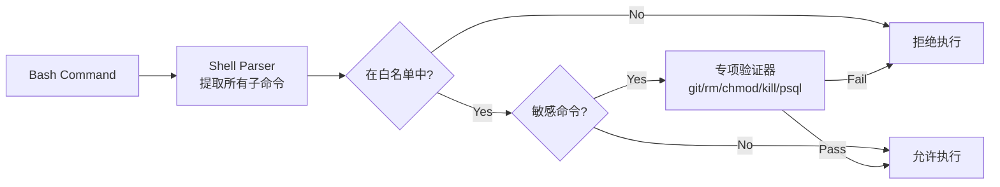
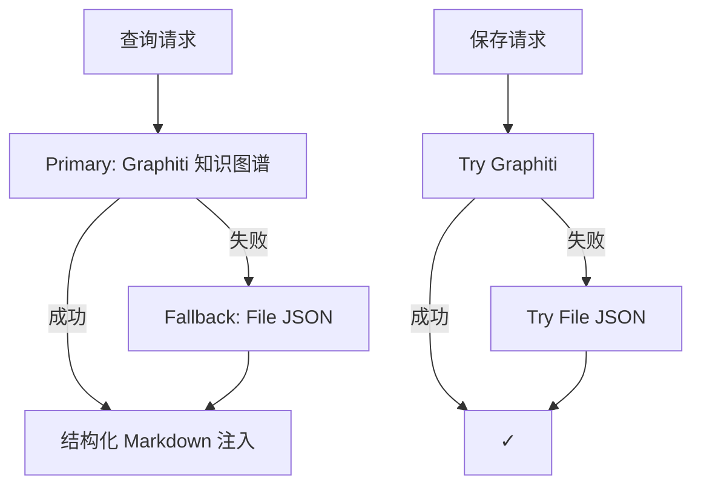
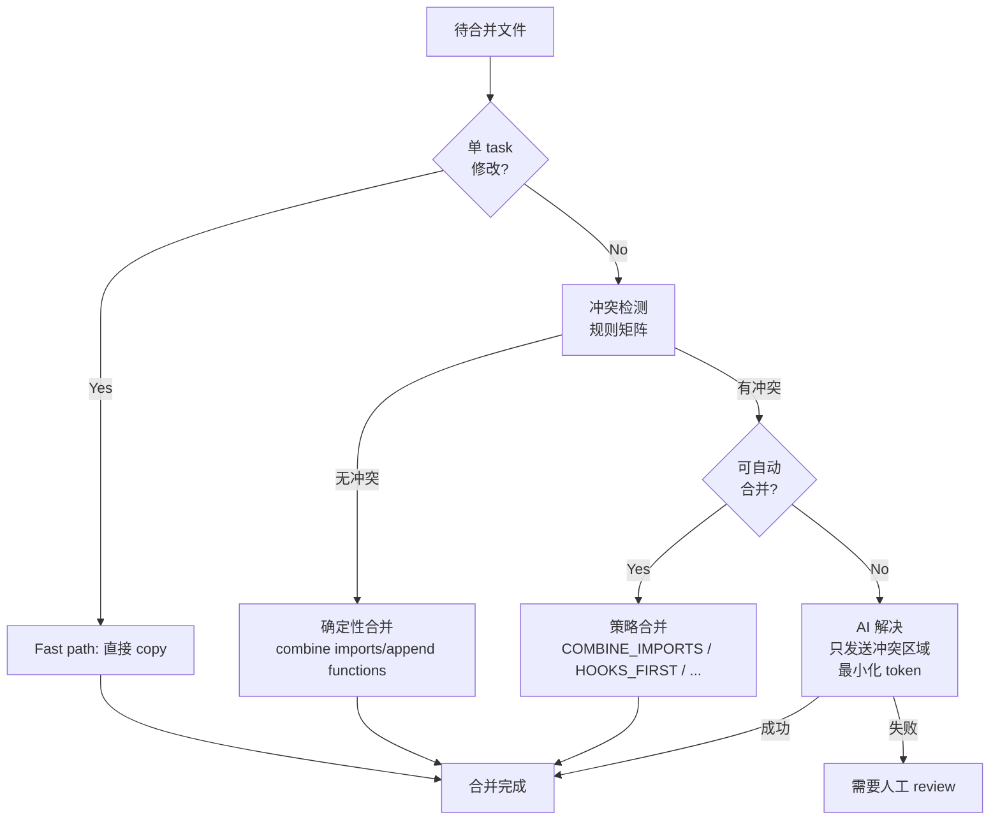
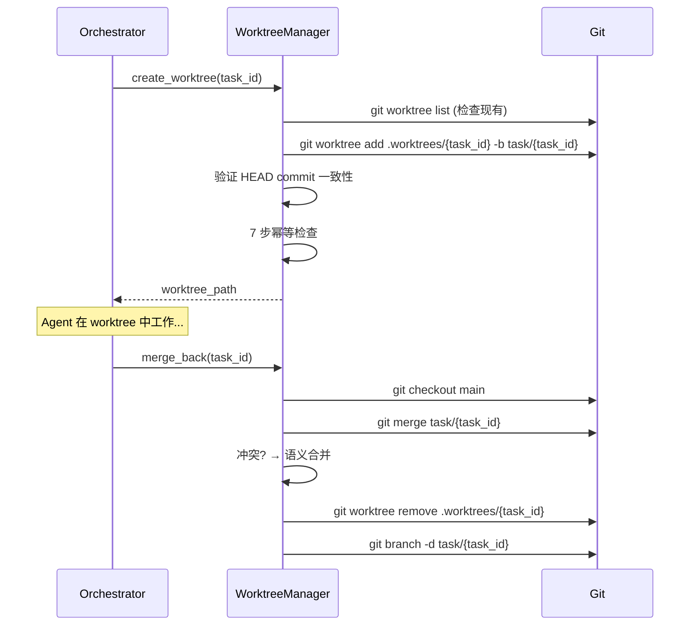

# Auto-Claude 可复用模式参考

> 来源: [AndyMik90/Auto-Claude](https://github.com/AndyMik90/Auto-Claude)
> 日期: 2026-02-27

## 概述

Auto-Claude 是一个基于 Claude Agent SDK 的自动化开发系统。它和 Flywheel 的核心目标相似——自动化代码实现，但采用了不同的架构（subtask 分解 + worktree 隔离 + 语义合并 vs Flywheel 的 Linear issue → DAG → CLI spawn）。

以下提取了 **可直接复用或参考** 的模式，按优先级排列。

---

## 1. 循环修复检测（Jaccard 相似度）⭐ 高优先级

**问题**: Agent 可能反复尝试相同的修复方式，导致死循环。

**算法**: 对最近 N 次尝试的 approach 描述做 Jaccard 相似度计算。

```typescript
// TypeScript 适配

const STOP_WORDS = new Set([
  "with", "using", "the", "a", "an", "and", "or", "but",
  "in", "on", "at", "to", "for", "trying",
]);

function extractKeywords(text: string): Set<string> {
  return new Set(
    text.toLowerCase().split(/\s+/).filter(w => !STOP_WORDS.has(w) && w.length > 1)
  );
}

function jaccardSimilarity(a: Set<string>, b: Set<string>): number {
  const intersection = new Set([...a].filter(x => b.has(x)));
  const union = new Set([...a, ...b]);
  return union.size > 0 ? intersection.size / union.size : 0;
}

function isCircularFix(
  currentApproach: string,
  recentAttempts: { approach: string }[],
  opts = { threshold: 0.3, windowSize: 3, minSimilar: 2 },
): boolean {
  if (recentAttempts.length < 2) return false;

  const window = recentAttempts.slice(-opts.windowSize);
  const currentKw = extractKeywords(currentApproach);

  let similarCount = 0;
  for (const attempt of window) {
    const attemptKw = extractKeywords(attempt.approach);
    if (jaccardSimilarity(currentKw, attemptKw) > opts.threshold) {
      similarCount++;
    }
  }

  return similarCount >= opts.minSimilar;
}
```

**关键常量**:
| 参数 | 值 | 含义 |
|------|-----|------|
| `threshold` | 0.3 | 30% Jaccard 重叠 = "相似" |
| `windowSize` | 3 | 只看最近 3 次尝试 |
| `minSimilar` | 2 | 2+ 次相似 = 循环 |

**Flywheel 映射**: Blueprint CI fix 循环中使用。如果 fix agent 连续提交相似的 fix approach，触发 shelve 而非继续重试。

---

## 2. 失败分类 + 恢复决策树 ⭐ 高优先级

**问题**: 不同类型的失败需要不同的恢复策略。

### 2a. 失败分类（关键字匹配）

```typescript
enum FailureType {
  BrokenBuild = "broken_build",
  VerificationFailed = "verification_failed",
  CircularFix = "circular_fix",
  ContextExhausted = "context_exhausted",
  Unknown = "unknown",
}

const BUILD_ERRORS = [
  "syntax error", "compilation error", "module not found",
  "import error", "cannot find module", "unexpected token",
  "parse error",
];

const VERIFICATION_ERRORS = [
  "verification failed", "expected", "assertion",
  "test failed", "status code",
];

const CONTEXT_ERRORS = ["context", "token limit", "maximum length"];

function classifyFailure(error: string, isCircular: boolean): FailureType {
  const lower = error.toLowerCase();
  if (BUILD_ERRORS.some(e => lower.includes(e))) return FailureType.BrokenBuild;
  if (VERIFICATION_ERRORS.some(e => lower.includes(e))) return FailureType.VerificationFailed;
  if (CONTEXT_ERRORS.some(e => lower.includes(e))) return FailureType.ContextExhausted;
  if (isCircular) return FailureType.CircularFix;
  return FailureType.Unknown;
}
```

### 2b. 恢复决策树

```typescript
type RecoveryAction = "rollback" | "retry" | "skip" | "escalate" | "continue";

function determineRecovery(
  type: FailureType,
  attemptCount: number,
  hasGoodCommit: boolean,
): { action: RecoveryAction; reason: string } {
  switch (type) {
    case FailureType.BrokenBuild:
      return hasGoodCommit
        ? { action: "rollback", reason: "rollback to last good commit" }
        : { action: "escalate", reason: "no good commit to rollback to" };

    case FailureType.VerificationFailed:
      return attemptCount < 3
        ? { action: "retry", reason: `attempt ${attemptCount + 1}/3` }
        : { action: "skip", reason: "marking as stuck after 3 attempts" };

    case FailureType.CircularFix:
      return { action: "skip", reason: "circular fix detected" };

    case FailureType.ContextExhausted:
      return { action: "continue", reason: "commit progress, new session" };

    case FailureType.Unknown:
      return attemptCount < 2
        ? { action: "retry", reason: `attempt ${attemptCount + 1}/2` }
        : { action: "escalate", reason: "unknown error persists" };
  }
}
```

**决策矩阵**:

| 失败类型 | 条件 | 动作 |
|----------|------|------|
| 构建错误 | 有 good commit | rollback |
| 构建错误 | 无 good commit | escalate → Slack |
| 测试失败 | < 3 次 | retry |
| 测试失败 | ≥ 3 次 | skip (shelve) |
| 循环修复 | 任何 | skip |
| 上下文耗尽 | 任何 | continue (新 session) |
| 未知错误 | < 2 次 | retry |
| 未知错误 | ≥ 2 次 | escalate → Slack |

**Flywheel 映射**: Blueprint `run()` 方法中，CI 失败后根据此决策树选择 retry/shelve/escalate，替代当前简单的 round 计数。

---

## 3. 重复问题检测（字符串相似度）⭐ 高优先级

**问题**: QA 循环中同一个 issue 反复出现，说明 fixer 无法解决。

```typescript
// 使用 npm: string-similarity 或简单实现
function normalizeIssueKey(issue: { title: string; file?: string; line?: number }): string {
  let title = (issue.title || "").toLowerCase().trim();
  for (const prefix of ["error:", "issue:", "bug:", "fix:"]) {
    if (title.startsWith(prefix)) title = title.slice(prefix.length).trim();
  }
  return `${title}|${issue.file || ""}|${issue.line || ""}`;
}

function hasRecurringIssues(
  currentIssues: Array<{ title: string; file?: string; line?: number }>,
  history: Array<{ issues: Array<{ title: string; file?: string; line?: number }> }>,
  threshold = 3,
): { recurring: boolean; issues: Array<{ title: string; count: number }> } {
  const historicalIssues = history.flatMap(h => h.issues || []);
  if (!historicalIssues.length) return { recurring: false, issues: [] };

  const recurring: Array<{ title: string; count: number }> = [];

  for (const current of currentIssues) {
    const currentKey = normalizeIssueKey(current);
    let count = 1; // include current
    for (const historical of historicalIssues) {
      const histKey = normalizeIssueKey(historical);
      // SequenceMatcher ratio ≈ 简单的编辑距离相似度
      if (stringSimilarity(currentKey, histKey) >= 0.8) {
        count++;
      }
    }
    if (count >= threshold) {
      recurring.push({ title: current.title, count });
    }
  }

  return { recurring: recurring.length > 0, issues: recurring };
}
```

**Flywheel 映射**: CI fix 循环中，如果同一个 CI error 在 3+ 个 round 中反复出现 → 触发 Slack 通知 CEO。

---

## 4. 尝试追踪 + 滑动时间窗口 ⭐ 中优先级

**问题**: 重启/崩溃后，旧的尝试计数不应影响当前决策。

```typescript
interface Attempt {
  timestamp: string;  // ISO 8601
  approach: string;
  success: boolean;
  error?: string;
}

const ATTEMPT_WINDOW_MS = 2 * 60 * 60 * 1000; // 2 hours
const MAX_HISTORY = 50;

function getRecentAttemptCount(attempts: Attempt[]): number {
  const cutoff = Date.now() - ATTEMPT_WINDOW_MS;
  return attempts.filter(a => new Date(a.timestamp).getTime() >= cutoff).length;
}

function recordAttempt(
  attempts: Attempt[],
  attempt: Attempt,
): Attempt[] {
  attempts.push(attempt);
  // 硬上限: 保留最新 50 条
  return attempts.length > MAX_HISTORY
    ? attempts.slice(-MAX_HISTORY)
    : attempts;
}
```

**Flywheel 映射**: DecisionStore 中存储 attempt 事件，用 `ATTEMPT_WINDOW_MS` 过滤。

---

## 5. 恢复提示注入 ⭐ 中优先级

**问题**: 重试时需要告诉 Agent 之前试过什么，避免重蹈覆辙。

```typescript
function buildRecoveryHints(attempts: Attempt[]): string[] {
  if (!attempts.length) return ["This is the first attempt at this task"];

  const hints = [`Previous attempts: ${attempts.length}`];
  const recent = attempts.slice(-3);

  for (let i = 0; i < recent.length; i++) {
    const a = recent[i];
    hints.push(
      `Attempt ${i + 1}: ${a.approach} - ${a.success ? "SUCCESS" : "FAILED"}`
    );
    if (a.error) hints.push(`  Error: ${a.error.slice(0, 100)}`);
  }

  if (attempts.length >= 2) {
    hints.push("");
    hints.push("⚠️  IMPORTANT: Try a DIFFERENT approach than previous attempts");
    hints.push("Consider: different library, different pattern, or simpler implementation");
  }

  return hints;
}
```

**Flywheel 映射**: Blueprint fix prompt 中注入 recovery hints，从 `CI failed. Fix these errors:` 扩展为包含历史尝试信息。

---

## 6. 安全钩子（命令白名单） 中优先级

**问题**: Agent 可能执行危险命令（`rm -rf /`, `git push --force`, `DROP DATABASE`）。

### 架构



**两层验证**:
1. **白名单检查**: 命令必须在 allowlist 中
2. **专项验证**: 敏感命令（git, rm, chmod, kill, psql 等）有专门的 validator

**关键设计**:
- **Fail-closed**: 解析失败 → 拒绝
- **Profile 缓存**: mtime-based invalidation，避免每次都重新分析
- **Per-project 配置**: `.auto-claude-security.json` + `.auto-claude-allowlist`

**Flywheel 映射**: Claude Code 本身有 permission mode，但我们可以在 Blueprint 层加一层白名单（特别是对 `shell.execFile` 调用的命令做校验）。Phase 2+ 考虑。

---

## 7. 双层记忆系统 中优先级

**问题**: 跨 session 保留学到的 patterns、gotchas、file insights。

### 架构



**三类并行查询**:
1. `get_relevant_context(query, num_results=5)` — 相关知识
2. `get_patterns_and_gotchas(query, min_score=0.5)` — 已学 patterns + gotchas
3. `get_session_history(limit=3)` — 最近 session 的建议

**Session Insights 结构** (直接可用):

```typescript
interface SessionInsights {
  subtasksCompleted: string[];
  discoveries: {
    filesUnderstood: Record<string, string>;  // path → 理解摘要
    patternsFound: string[];
    gotchasEncountered: string[];
  };
  whatWorked: string[];
  whatFailed: string[];
  recommendationsForNextSession: string[];
}
```

**Flywheel 映射**:
- Primary = DecisionStore (SQLite + sqlite-vec)
- Fallback = `.flywheel/memory.json`
- Session insights 结构直接采用
- 注入方式: 在 PreHydrator 中把 memory context 加入 hydrated prompt

---

## 8. 语义合并（两层冲突解决）🔮 Phase 3+

**问题**: 多个并行 worktree 修改同一文件时需要智能合并。

### 两层流水线



**冲突规则矩阵**: 基于 `(ChangeTypeA, ChangeTypeB)` 的兼容性查表。例如:
- `(ADD_IMPORT, ADD_IMPORT)` → 兼容，自动 COMBINE_IMPORTS
- `(MODIFY_FUNCTION, MODIFY_FUNCTION)` 同一函数 → 冲突，需要 AI 解决

**Flywheel 映射**: Phase 1 是顺序执行（无并行），不需要合并。Phase 3+ 并行化时参考此方案。

---

## 9. Git Worktree 隔离 🔮 Phase 3+

**问题**: 并行 task 需要隔离的代码环境。



**7 步幂等创建**:
1. 检查 worktree 是否已存在
2. 如果存在但目录缺失 → prune + 重建
3. 如果存在且正常 → 复用
4. 创建新 worktree + branch
5. 验证 HEAD commit
6. 验证 `.git` 文件存在
7. 验证 worktree 在 `git worktree list` 中

**Flywheel 映射**: Phase 1 顺序执行不需要。Phase 3+ 并行化时，每个 DAG node 分配一个 worktree。

---

## 复用优先级总结

| 优先级 | 模式 | Phase | 预估 LOC |
|--------|------|-------|----------|
| ⭐ 高 | 循环修复检测 (Jaccard) | Phase 1 enhancement | ~30 |
| ⭐ 高 | 失败分类 + 恢复决策树 | Phase 2 | ~60 |
| ⭐ 高 | 重复问题检测 (string similarity) | Phase 2 | ~40 |
| 中 | 尝试追踪 + 滑动时间窗口 | Phase 2 | ~20 |
| 中 | 恢复提示注入 | Phase 2 | ~15 |
| 中 | 安全钩子 (命令白名单) | Phase 2+ | ~100 |
| 中 | 双层记忆系统 | Phase 3 | ~150 |
| 🔮 后期 | 语义合并 (两层冲突解决) | Phase 3+ | ~300 |
| 🔮 后期 | Git Worktree 隔离 | Phase 3+ | ~80 |

**Phase 1 immediate win**: 在 Blueprint CI fix 循环中加入循环修复检测 (~30 LOC)，防止 Agent 无限重试相同的 fix。

**Phase 2 重点**: 失败分类 + 恢复决策树 + 重复问题检测，这三个组合形成完整的 "智能恢复" 模块，替代简单的 round 计数。
