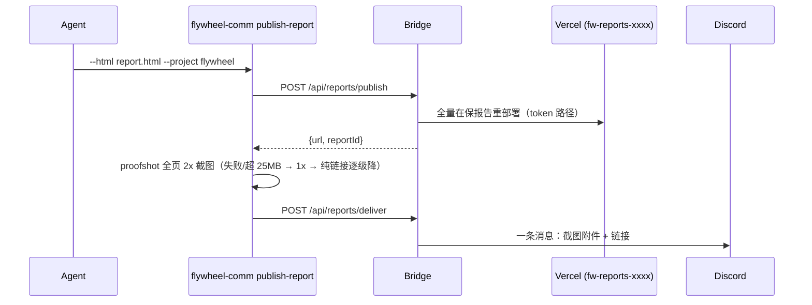

# Remote Report Pipeline — `flywheel-comm publish-report` (FLY-203)

**Issue**: FLY-203
**Since**: v1.32.0
**Plan**: `doc/engineer/plan/inprogress/v1.32.0-FLY-203-remote-report-pipeline.md`

## 这是什么

Agent 生成的 HTML 报告（ship-review / triage / 改动清单等）本地 `open` 之外的**远程送达通道**：一条命令把报告发布到不可猜 URL，并向项目 Discord 频道发一条「关键区截图 + 完整报告链接」消息。Annie 在手机上一点即看完整版。

**本地流程零改动** —— 照旧生成 HTML + `open`，远程管线是增量叠加的一条命令。

## 用法

```bash
flywheel-comm publish-report \
  --html /tmp/fly-ship-review.html \
  --project flywheel \
  --title "Ship Review 06-03" \
  [--channel <discord-channel-id>] \
  [--no-screenshot]
```

| Flag | 说明 |
|------|------|
| `--html` | 本地报告文件（必须是带 `<head>` 的完整 HTML 文档，≤512KB；fragment 会被 400 拒绝） |
| `--project` | projects.json 里的 projectName（频道解析用） |
| `--title` | 消息标题（≤200 字符，默认 "Report"） |
| `--channel` | 显式 Discord 频道 id；缺省用该项目的 `generalChannel`，两者都没有则报错（不猜） |
| `--no-screenshot` | 跳过截图，纯链接送达 |

**stdout 永远是一行 JSON envelope**（agent-facing）：

```json
{"url":"https://fw-reports-xxxxxx.vercel.app/r/<32hex>/","reportId":"<32hex>","messageId":"...","screenshot":"...","delivered":true}
```

- publish 成功但 deliver 失败：envelope 仍带 `url`（exit 1）——报告已发布，可手动转发链接
- 截图失败自动降级为纯链接消息（exit 0，`screenshot: null`）
- 人读诊断信息全在 stderr

## 环境变量

| 变量 | 说明 |
|------|------|
| `FLYWHEEL_BRIDGE_URL` / `BRIDGE_URL` | Bridge 地址（必需） |
| `TEAMLEAD_API_TOKEN` | Bridge bearer token（`/api/reports/*` 必须有 token 才会服务） |
| `FLYWHEEL_REPORTS_DIR` | registry/previews 根目录（默认 `~/.flywheel/reports`） |
| `FLYWHEEL_REPORT_SHOT_WIDTH` | 截图 viewport 宽度 px（默认 860 ≈ 报告内容宽；320-3840）。截图 = **全页 @ 2x**（Annie 拍板形态:图扫结构+链接细读）;2x 失败或 >25MB 自动降 1x 重试,再失败降纯链接 |
| `VERCEL_TOKEN` | Bridge 侧托管凭证（未配 → publish 501） |

报告链接固定保留 7 天；到期后在下一次发布时清理。保留期没有环境变量旁路。

## 工作原理（一图）



## 隐私模型（Annie 拍板）

- "Anyone with link"：URL 路径含 128-bit 随机 token，不可猜（等价 signed URL 强度）；域名带随机后缀
- 根路径/错误 token 404，无目录列表；`robots.txt` Disallow all + `noindex` meta 注入
- CSP meta 注入（`default-src 'none'; style-src 'unsafe-inline'; img-src data:`）—— 防报告内意外 `<script>`/外链跑起来
- Retention：**链接 7 天后自动失效**(Annie 拍的隐私要求;在下一次发布的重部署中摘除 —— 无新增定时器,挂在 publish 动作上)+ 最多 100 份 / 8.5 MiB 滚动上限,谁先到谁生效

## 注意

- **每次发布 = 全量重部署**：Vercel production deploy 会替换文件集合，旧报告靠 registry 累积保活；`~/.flywheel/reports/registry.json` 损坏时管线会拒绝发布（防止把在保报告全杀），按报错提示手动处理
- 报告频率远低于 Vercel Hobby 部署额度（~100/天）；撞额度 = 502，不要循环重试
- Simba triage 仍走老的 `/api/publish-html`（固定 URL，byte-compat 未动）；迁移是后续 issue
