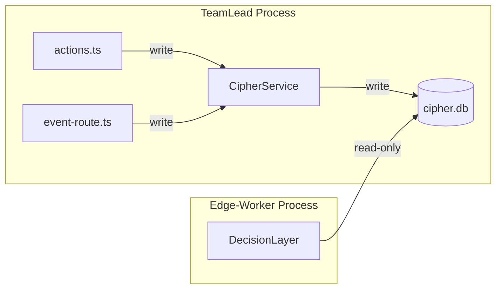
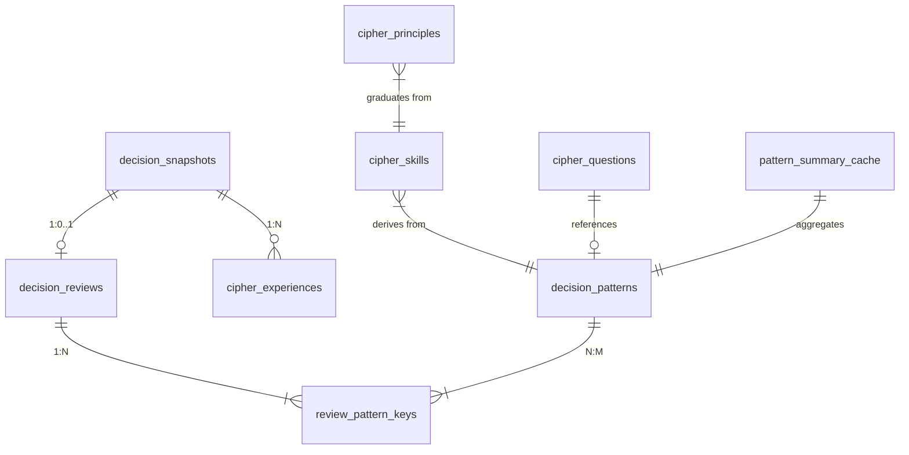
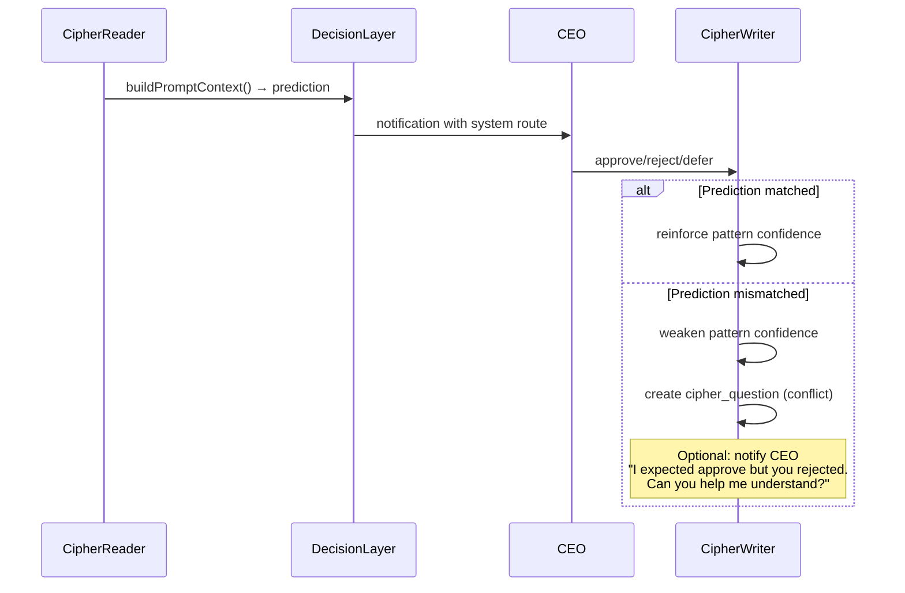

# Research: CIPHER Full-Scope Knowledge Architecture — GEO-149

**Issue**: GEO-149
**Date**: 2026-03-15
**Source**: `doc/exploration/new/GEO-149-cipher-decision-memory.md` (Section 8-9 updated)
**Supersedes**: `doc/research/new/GEO-149-cipher-phase1-implementation.md` (Phase 1 only)

---

## 1. 设计目标

将 CIPHER 从"Phase 1 统计引擎"扩展为完整的五层知识系统，参考 agent-knowledge-framework 的分类体系：

| 层 | 职责 | 实现优先级 |
|----|------|-----------|
| **Experience** | 保存每次 CEO 决策的完整上下文 | Wave 1 |
| **Insight** | Beta-Binomial 统计 + Wilson bound | Wave 1 |
| **Skill** | 从 experience 中提炼可复用的决策模式 | Wave 2 |
| **Principle** | 高置信度 pattern → HardRuleEngine 自动生成 rule | Wave 3 |
| **Question** | 低置信度区域的显式标记 + CEO 澄清请求 | Wave 2 |

---

## 2. 存储架构决策

### 现状分析

| 组件 | 技术 | DB 文件 | 进程 |
|------|------|---------|------|
| AuditLogger | sql.js (in-memory + file) | `~/.flywheel/audit.db` | edge-worker |
| StateStore | sql.js (in-memory + file) | `.flywheel/state.db` (per project) | teamlead |
| MemoryService | Supabase pgvector (via mem0) | 远程 | edge-worker |

**关键发现**：AuditLogger 和 StateStore 是**分开的 sql.js 实例和 db 文件**。Codex R2 担心的"跨进程写同一文件"只有在 CIPHER 同时被 edge-worker 和 teamlead 进程写入同一 db 时才会发生。

### 方案评估

#### 方案 A: 独立 SQLite 文件（CIPHER 专用）

```
~/.flywheel/cipher.db  ←  CipherService 独占写入
```

- CipherService 有自己的 sql.js 实例和独立 db 文件
- 不扩展 AuditLogger，不共享 `audit.db`
- 避免 Codex R2 #1 的跨进程写入问题

**单写者模型**：
- **写入方**：只有 TeamLead 进程（生产路径）写 CIPHER
- **读取方**：DecisionLayer（edge-worker 进程）只读 CIPHER 数据
- **解决方案**：DecisionLayer 在每次 `decide()` 调用时重新打开 db 文件读取（或定期刷新 cache）

优点：零外部依赖、最简单、跨进程安全
缺点：无向量搜索、无语义检索、experience 层受限

#### 方案 B: Supabase pgvector（复用 GEO-145 基础设施）

- 所有 CIPHER 数据存 Supabase（已有 `SUPABASE_URL` + `SUPABASE_KEY`）
- 结构化数据用常规 Postgres 表
- Experience 层用 pgvector embedding 做语义检索

优点：多进程安全、语义检索、已有基础设施
缺点：网络延迟（每次 decide() 都要远程查询）、外部依赖、需要管理 embedding

#### 方案 C: 混合（结构化本地 + 语义远程）

```
~/.flywheel/cipher.db   ← 结构化数据：snapshots, patterns, statistics
Supabase pgvector        ← 语义数据：experience embeddings, skill descriptions
```

- 高频读（pattern 统计查询）走本地 SQLite，零延迟
- 低频读（experience 语义检索）走 Supabase，容忍延迟
- 写入统一由 TeamLead 进程完成

优点：兼顾性能和能力
缺点：复杂度最高、两个存储的一致性

### 推荐：方案 A（独立 SQLite）+ 方案 B 的 experience embedding 延后

**理由**：
1. Wave 1-2 不需要语义检索——结构化 pattern matching 足够
2. 独立 SQLite 彻底解决跨进程问题
3. Experience 层先用结构化存储，Wave 3 时按需加 Supabase embedding
4. 避免引入网络延迟到 DecisionLayer 关键路径

**单写者架构**：



**跨进程读取方案**：
- DecisionLayer 在 `buildPromptContext()` 时打开 cipher.db 的**只读连接**
- sql.js `OPEN_READONLY` flag 或直接读文件
- 写入只发生在 TeamLead 进程，不存在写冲突
- 读取可能看到几秒延迟的数据（acceptable：pattern 统计不需要实时一致）

---

## 3. Schema Design（全范围）

### ER 关系



### Table 1: decision_snapshots（Experience 原始数据 — Phase A）

决策完成时写入，保存完整上下文。

```sql
CREATE TABLE IF NOT EXISTS decision_snapshots (
  execution_id TEXT PRIMARY KEY,
  issue_id TEXT NOT NULL,
  issue_identifier TEXT NOT NULL,
  issue_title TEXT NOT NULL,
  project_id TEXT NOT NULL,
  -- 维度（预计算）
  issue_labels TEXT NOT NULL,             -- JSON array
  size_bucket TEXT NOT NULL,              -- tiny|small|medium|large
  area_touched TEXT NOT NULL,             -- frontend|backend|auth|test|config|mixed
  system_route TEXT NOT NULL,             -- auto_approve|needs_review|blocked
  system_confidence REAL NOT NULL,
  decision_source TEXT NOT NULL,
  decision_reasoning TEXT,                -- HaikuTriageAgent 的 reasoning
  -- 完整上下文快照（experience 层核心）
  commit_count INTEGER NOT NULL,
  files_changed INTEGER NOT NULL,
  lines_added INTEGER NOT NULL,
  lines_removed INTEGER NOT NULL,
  diff_summary TEXT,
  commit_messages TEXT,                   -- JSON array
  changed_file_paths TEXT,               -- JSON array
  exit_reason TEXT NOT NULL,
  duration_ms INTEGER NOT NULL,
  consecutive_failures INTEGER NOT NULL DEFAULT 0,
  -- Pattern keys（预计算）
  pattern_keys TEXT NOT NULL,             -- JSON array
  -- Metadata
  created_at TEXT NOT NULL DEFAULT (datetime('now'))
);
```

### Table 2: decision_reviews（Experience 结果 — Phase B）

CEO 操作时写入。

```sql
CREATE TABLE IF NOT EXISTS decision_reviews (
  id TEXT PRIMARY KEY,
  execution_id TEXT NOT NULL UNIQUE,
  ceo_action TEXT NOT NULL,               -- approve|reject|defer
  ceo_outcome TEXT NOT NULL,              -- fast_approve|approve_after_review|reject_or_block
  friction_score TEXT NOT NULL DEFAULT 'low',
  ceo_action_timestamp TEXT NOT NULL,
  notification_timestamp TEXT,            -- from snapshot created_at
  time_to_decision_seconds INTEGER,
  -- Slack thread context（Wave 2+）
  thread_ts TEXT,
  thread_message_count INTEGER,
  ceo_message_count INTEGER,
  -- Metadata
  source_status TEXT,                     -- awaiting_review|blocked (状态门控用)
  created_at TEXT NOT NULL DEFAULT (datetime('now')),
  FOREIGN KEY (execution_id) REFERENCES decision_snapshots(execution_id)
);

CREATE INDEX IF NOT EXISTS idx_reviews_outcome ON decision_reviews(ceo_outcome);
CREATE INDEX IF NOT EXISTS idx_reviews_created ON decision_reviews(created_at);
```

### Table 3: decision_patterns（Insight 层）

统计聚合表。

```sql
CREATE TABLE IF NOT EXISTS decision_patterns (
  pattern_key TEXT PRIMARY KEY,
  approve_count INTEGER NOT NULL DEFAULT 0,
  reject_count INTEGER NOT NULL DEFAULT 0,
  total_count INTEGER NOT NULL DEFAULT 0,
  maturity_level TEXT NOT NULL DEFAULT 'exploratory',
  first_seen_at TEXT NOT NULL,
  last_seen_at TEXT NOT NULL,
  last_90d_approve INTEGER DEFAULT 0,
  last_90d_total INTEGER DEFAULT 0
);
```

### Table 4: review_pattern_keys（关联明细）

支持时间窗口重算。

```sql
CREATE TABLE IF NOT EXISTS review_pattern_keys (
  review_id TEXT NOT NULL,
  pattern_key TEXT NOT NULL,
  is_approve INTEGER NOT NULL,
  created_at TEXT NOT NULL,
  PRIMARY KEY (review_id, pattern_key),
  FOREIGN KEY (review_id) REFERENCES decision_reviews(id)
);

CREATE INDEX IF NOT EXISTS idx_rpk_pattern ON review_pattern_keys(pattern_key);
CREATE INDEX IF NOT EXISTS idx_rpk_created ON review_pattern_keys(created_at);
```

### Table 5: pattern_summary_cache（全局统计缓存）

```sql
CREATE TABLE IF NOT EXISTS pattern_summary_cache (
  id TEXT PRIMARY KEY DEFAULT 'global',
  global_approve_count INTEGER DEFAULT 0,
  global_reject_count INTEGER DEFAULT 0,
  global_approve_rate REAL DEFAULT 0.5,
  prior_strength INTEGER DEFAULT 10,
  last_computed_at TEXT NOT NULL DEFAULT (datetime('now'))
);
```

### Table 6: cipher_skills（Skill 层 — Wave 2）

从多次 experience 中提炼的可复用模式。

```sql
CREATE TABLE IF NOT EXISTS cipher_skills (
  id TEXT PRIMARY KEY,
  name TEXT NOT NULL,                     -- e.g., "small-bugfix-approval-pattern"
  description TEXT NOT NULL,              -- 人类可读描述
  source_pattern_key TEXT,                -- 关联的 decision_pattern
  trigger_conditions TEXT NOT NULL,       -- JSON: 什么条件下触发这个 skill
  recommended_action TEXT NOT NULL,       -- approve|review|block
  confidence REAL NOT NULL,
  sample_count INTEGER NOT NULL,
  -- 提炼来源
  derived_from_reviews TEXT,              -- JSON array of review IDs
  derived_by TEXT NOT NULL DEFAULT 'statistical', -- statistical|llm
  -- Lifecycle
  status TEXT NOT NULL DEFAULT 'draft',   -- draft|active|deprecated
  created_at TEXT NOT NULL DEFAULT (datetime('now')),
  updated_at TEXT NOT NULL DEFAULT (datetime('now'))
);
```

### Table 7: cipher_principles（Principle 层 — Wave 3）

高置信度 skill 毕业为 principle，可自动生成 hard rule。

```sql
CREATE TABLE IF NOT EXISTS cipher_principles (
  id TEXT PRIMARY KEY,
  skill_id TEXT NOT NULL,                 -- 来源 skill
  rule_type TEXT NOT NULL,                -- hard_rule|soft_guideline
  rule_definition TEXT NOT NULL,          -- JSON: HardRuleEngine 兼容格式
  confidence REAL NOT NULL,
  -- 毕业条件
  graduation_criteria TEXT NOT NULL,      -- JSON: 什么条件下从 skill 升级
  -- Lifecycle
  status TEXT NOT NULL DEFAULT 'proposed', -- proposed|active|retired
  activated_at TEXT,
  retired_at TEXT,
  retired_reason TEXT,
  created_at TEXT NOT NULL DEFAULT (datetime('now')),
  FOREIGN KEY (skill_id) REFERENCES cipher_skills(id)
);
```

### Table 8: cipher_questions（Question 层 — Wave 2）

Known unknowns — 低置信度区域。

```sql
CREATE TABLE IF NOT EXISTS cipher_questions (
  id TEXT PRIMARY KEY,
  question_type TEXT NOT NULL,            -- pattern_conflict|low_confidence|new_territory|drift_detected
  description TEXT NOT NULL,
  related_pattern_key TEXT,               -- 关联的 pattern
  -- 上下文
  evidence TEXT NOT NULL,                 -- JSON: 支持这个 question 的数据
  -- CEO 澄清
  asked_at TEXT,                          -- 什么时候问了 CEO
  resolved_at TEXT,
  resolution TEXT,                        -- CEO 的回答
  -- Lifecycle
  status TEXT NOT NULL DEFAULT 'open',    -- open|asked|resolved|dismissed
  created_at TEXT NOT NULL DEFAULT (datetime('now'))
);
```

---

## 4. 五层实现方案

### 4.1 Experience 层

**写入时机**：两阶段模型（沿用 Phase 1 设计）
- Phase A: DecisionLayer.decide() 完成后 → `saveSnapshot()`
- Phase B: CEO 操作时 → `recordOutcome()`

**完整上下文保存**：`decision_snapshots` 存储了比原 Phase 1 更多的字段：
- `issue_title`：用于语义匹配（Wave 3 的 embedding 基础）
- `diff_summary`：决策上下文的核心
- `commit_messages`：理解改动意图
- `changed_file_paths`：维度提取基础
- `decision_reasoning`：HaikuTriageAgent 的推理过程

**检索方式**：
- Wave 1-2：结构化查询（by pattern_key, by issue_id, by date range）
- Wave 3+：可选 Supabase pgvector embedding（by semantic similarity）

### 4.2 Insight 层（统计引擎）

沿用原 Phase 1 研究成果（`GEO-149-cipher-phase1-implementation.md`），核心不变：

- **Pattern 维度**：12 singles + 5 curated pairs + 1 triple = 18 keys
- **Beta-Binomial 平滑**：`posteriorMean = (approve + α) / (total + α + β)`，prior 锚定全局 approve rate
- **Wilson lower bound**：90% confidence (z=1.645)
- **Maturity levels**：exploratory (<10) → tentative (10-19) → established (20-49) → trusted (50+)
- **3-class outcome**：fast_approve / approve_after_review / reject_or_block
- **时间窗口**：90 天滑动窗口，`review_pattern_keys` 关联表支持重算
- **Decay**：60-90 天未见的 pattern 降级 maturity

**改进（基于 Codex R2 反馈）**：
- 90 天窗口刷新时**先清零所有 last_90d_\* 再批量更新**（解决 Codex R2 #7）
- Pattern 统计只计入 `source_status = 'awaiting_review'` 的 review（解决 Codex R2 #6）

### 4.3 Skill 层（模式提炼）

**触发时机**：
- `recordOutcome()` 每 20 次触发一次 skill extraction
- 或手动触发（admin endpoint）

**提炼方式**：

**方式 A（统计）**：当 pattern 达到 `established` maturity 时自动生成 skill
```typescript
// 伪代码
if (pattern.maturity === 'established' && pattern.total >= 20) {
  createSkill({
    name: `auto-${pattern.pattern_key}`,
    description: `Based on ${pattern.total} decisions: ${approveRate}% approved`,
    trigger_conditions: parsePatterKeyToConditions(pattern.pattern_key),
    recommended_action: approveRate > 0.85 ? 'approve' : 'review',
    confidence: wilsonLowerBound(pattern.approve, pattern.total),
    derived_by: 'statistical',
  });
}
```

**方式 B（LLM 辅助 — Wave 3+）**：把一批 experience 交给 LLM 归纳
```typescript
// 用 Haiku 分析一批 experience，提取人类可读的 pattern
const experiences = await getRecentExperiences(50);
const prompt = `Based on these ${experiences.length} CEO decisions, what patterns do you see?
Focus on: what types of PRs get approved quickly, what gets rejected, what requires extra review.
${formatExperiences(experiences)}`;
const skills = await extractSkills(prompt);
```

**推荐**：Wave 2 先做统计方式，Wave 3 加 LLM 辅助。

### 4.4 Principle 层（规则生成）

**毕业条件**：Skill → Principle 需要满足：
- Skill 的 confidence > 0.90
- Sample count > 50 (trusted maturity)
- 最近 30 天没有矛盾决策（CEO 的行为一致）
- CEO 确认（通过 Slack 问一次 "Should I make this a rule?"）

**生成格式**：兼容现有 HardRuleEngine

```typescript
// HardRuleEngine 的 rule 格式
interface HardRule {
  name: string;
  priority: number;
  evaluate: (ctx: ExecutionContext) => { triggered: boolean; route: string; reasoning: string } | null;
}

// CIPHER 生成的 principle → hard rule
const generatedRule: HardRule = {
  name: `cipher-${principle.id}`,
  priority: 50,  // 低于手写 rules (10-40)
  evaluate: (ctx) => {
    if (matchesTriggerConditions(ctx, principle.trigger_conditions)) {
      return {
        triggered: true,
        route: principle.recommended_action,
        reasoning: `CIPHER principle: ${principle.description} (confidence: ${principle.confidence})`,
      };
    }
    return null;
  },
};
```

**安全机制**：
- CIPHER 生成的 rules priority 永远低于手写 rules
- CEO 可以通过 Slack 禁用任何 CIPHER rule
- Principle 有 `retired` 状态，不是永久的

### 4.5 Question 层（Known Unknowns）

**触发条件**：

| Question 类型 | 触发条件 | 示例 |
|--------------|---------|------|
| `pattern_conflict` | 同 pattern key 的最近 5 次决策中 approve/reject 比例 40-60% | "bug+small 最近 approve 率不稳定" |
| `low_confidence` | Wilson lower bound < 0.3 且 sample >= 10 | "auth+large 数据太少，无法判断" |
| `new_territory` | 新的 pattern key 首次出现 | "从未见过 infra+large 类型的 PR" |
| `drift_detected` | 最近 30 天 approve rate vs 全时间 approve rate 差异 > 20% | "CEO 最近开始 reject 更多 test-only PR" |

**呈现方式**：
- 在 `buildPromptContext()` 的 prompt 中标记为 `⚠️ Low confidence` 或 `❓ Conflicting signals`
- 可选：通过 Slack 通知 CEO "I'm uncertain about this type of PR. Your feedback will help me learn."

---

## 5. 集成架构

### 5.1 executionId 传递方案

**现状**：`ExecutionContext` 没有 `executionId` 字段。`executionId` 在 Blueprint 中生成，传给 StateStore，但不进入 DecisionLayer。

**方案 A：扩展 ExecutionContext**（推荐）

```typescript
// packages/core/src/decision-types.ts
export interface ExecutionContext {
  executionId: string;  // NEW — from Blueprint session
  // ... existing fields
}
```

影响面：
- `packages/core/src/decision-types.ts` — 加字段
- `packages/edge-worker/src/Blueprint.ts:520-542` — 构造时传入
- `packages/edge-worker/src/__tests__/` — 测试 fixture 加字段
- `packages/teamlead/src/bridge/event-route.ts` — 已有 `execution_id`，映射

优点：简洁，executionId 随 ctx 自然流动
缺点：改 core interface 影响面大

**方案 B：独立参数**

```typescript
// DecisionLayer.decide() 加 executionId 参数
async decide(ctx: ExecutionContext, cwd: string, executionId?: string): Promise<DecisionResult>
```

优点：不改 core types
缺点：参数传递链变长，容易遗漏

**推荐方案 A**：`executionId` 是每次执行的唯一标识，逻辑上属于 ExecutionContext。

### 5.2 transitionSession async 改造

**现状**：`transitionSession()` 是同步函数（`packages/teamlead/src/bridge/actions.ts:100-119`），内部只调用 `store.forceStatus()`。

**方案 A：改为 async**（推荐）

```typescript
export async function transitionSession(
  store: StateStore,
  action: string,
  executionId: string,
  reason?: string,
  cipherService?: CipherService,
): Promise<ActionResult> {
  // ... existing sync logic ...

  // CIPHER recording (async, non-fatal)
  if (result.success && cipherService && (action === 'reject' || action === 'defer')) {
    try {
      await cipherService.recordOutcome({ executionId, ceoAction: action, ... });
    } catch { /* non-fatal */ }
  }

  return result;
}
```

影响面：
- `packages/teamlead/src/bridge/actions.ts` — 函数签名
- Router handler — 已经是 async，无需改
- 测试 — 加 await

**方案 B：Fire-and-forget**

```typescript
// 保持 sync，显式 fire-and-forget
if (cipherService) {
  cipherService.recordOutcome({ ... }).catch(() => {});
}
```

优点：不改函数签名
缺点：错误处理更弱，测试更难

**推荐方案 A**：改为 async，Router 端已经是 async 不受影响。

### 5.3 TeamLead 装配路径

**当前调用链**：
```
startBridge(config, projects)
  → createBridgeApp(store, projects, config, broadcaster)
    → createActionRouter(store, projects)  // ← CipherService 注入点
    → createEventRouter(store, config)     // ← CipherService 注入点
```

**需要改动**：

```typescript
// plugin.ts
export async function startBridge(config, projects, cipherService?) {
  const store = await StateStore.create(config.dbPath);
  const app = createBridgeApp(store, projects, config, broadcaster, cipherService);
  // ...
}

function createBridgeApp(store, projects, config, broadcaster, cipherService?) {
  // ...
  app.use("/actions", createActionRouter(store, projects, cipherService));
  app.use("/events", ..., createEventRouter(store, config, cipherService));
  // ...
}
```

**CipherService 初始化位置**：TeamLead 进程启动时（`packages/teamlead/src/index.ts` 或 `scripts/lib/setup.ts`）

### 5.4 DecisionLayer 集成（读取路径）

**跨进程读取**：DecisionLayer 在 edge-worker 进程，CIPHER db 由 TeamLead 写入。

```typescript
// CipherReader — 只读接口，edge-worker 进程使用
export class CipherReader {
  constructor(private dbPath: string) {}

  async buildPromptContext(ctx: ExecutionContext): Promise<string | null> {
    // 每次调用时打开 db → 读取 → 关闭
    // 保证读到 TeamLead 最新写入的数据
    const db = await openReadOnly(this.dbPath);
    try {
      // ... pattern lookup + statistics ...
    } finally {
      db.close();
    }
  }
}

// CipherWriter — 写入接口，TeamLead 进程使用
export class CipherWriter {
  private db: Database;

  async saveSnapshot(params): Promise<void> { ... }
  async recordOutcome(params): Promise<void> { ... }
  async refreshWindows(): Promise<void> { ... }
}
```

**分离读写**解决了：
- 跨进程安全：只有 TeamLead 写，edge-worker 只读
- 生命周期清晰：CipherWriter 在 TeamLead 进程中管理 db 生命周期
- 事务安全：CipherWriter 可以用 BEGIN/COMMIT/ROLLBACK

### 5.5 状态门控（defer 语义）

**问题**：`defer` 可从 `awaiting_review` 和 `blocked` 两种状态发起。只有前者是 CEO review outcome。

**解决方案**：在 `recordOutcome()` 中检查 source status

```typescript
async recordOutcome(params: OutcomeParams): Promise<void> {
  // 只记录 awaiting_review 状态的 review outcome
  const session = this.store.getSession(params.executionId);
  if (!session || session.status !== 'awaiting_review') {
    // blocked → defer 是运营动作，不是 review decision
    return;
  }
  // ... proceed with recording
}
```

**但更好的方案**：在 actions.ts 的调用点就过滤

```typescript
// actions.ts transitionSession
if (cipherService && (action === 'reject' || action === 'defer')) {
  const session = store.getSession(executionId);
  // 只在 awaiting_review 状态下记录
  if (session?.status === 'awaiting_review') {
    await cipherService.recordOutcome({ ... });
  }
}
```

### 5.6 事务语义

**问题**：`recordOutcome()` 写多张表（reviews, patterns, review_pattern_keys, summary_cache），中途失败会导致半成品落盘。

**解决方案**：`runInTransaction()`

```typescript
class CipherWriter {
  private runInTransaction<T>(fn: (db: Database) => T): T {
    this.db.run('BEGIN TRANSACTION');
    try {
      const result = fn(this.db);
      this.db.run('COMMIT');
      this.save(); // 只在 commit 成功后持久化
      return result;
    } catch (err) {
      this.db.run('ROLLBACK');
      throw err;
    }
  }

  async recordOutcome(params: OutcomeParams): Promise<void> {
    this.runInTransaction((db) => {
      // INSERT decision_reviews
      // UPSERT decision_patterns (multiple)
      // INSERT review_pattern_keys (multiple)
      // UPDATE pattern_summary_cache
    });
  }
}
```

---

## 6. Slack Thread 内容捕获（Wave 2+）

### 现状

- `StateStore.conversation_threads` 存了 thread_ts → issue_id 映射
- 但**没有保存 thread 消息内容**
- OpenClaw hooks 只发结构化 JSON，不带原始 Slack 消息

### 可行方案

**方案 A：Slack Web API 直接调用**

```typescript
import { WebClient } from '@slack/web-api';

const slack = new WebClient(process.env.SLACK_BOT_TOKEN);

async function fetchThreadMessages(channel: string, threadTs: string) {
  const result = await slack.conversations.replies({
    channel,
    ts: threadTs,
    limit: 50,
  });
  return result.messages;
}
```

依赖：`@slack/web-api`（新依赖）+ `SLACK_BOT_TOKEN`（已有，用于 Socket Mode）

**方案 B：OpenClaw 转发**

让 product-lead agent 在 CEO 操作后把 thread 内容通过 bridge API 回传。

优点：不需要新的 Slack SDK
缺点：依赖 OpenClaw agent 行为，不可靠

**方案 C：延后到 Wave 3**

Phase 1-2 先不抓 thread。friction_score 默认 "low"。等基础数据链路跑通后再加。

**推荐：方案 C 先，方案 A 预留接口**。Schema 已预留 `thread_ts`、`thread_message_count`、`ceo_message_count` 字段。

---

## 7. 反馈闭环 + 巡检机制

### Dreaming（定期巡检）

**触发**：每 24 小时或每 50 次 recordOutcome

**巡检项**：

| 检查 | SQL 查询 | 产出 |
|------|---------|------|
| **矛盾决策** | 同 pattern_key 最近 10 次 approve rate 40-60% | → cipher_questions (pattern_conflict) |
| **偏好漂移** | last_90d_approve_rate vs all_time_approve_rate 差异 > 20% | → cipher_questions (drift_detected) |
| **新领域** | pattern_key 首次出现（total_count = 1） | → cipher_questions (new_territory) |
| **陈旧 pattern** | last_seen_at > 90 天 | → maturity 降级 |
| **Skill 候选** | established maturity + total >= 20 + 无现有 skill | → cipher_skills (draft) |
| **Principle 候选** | trusted maturity + confidence > 0.90 + 无矛盾 | → cipher_principles (proposed) |

### 预测-反馈循环



---

## 8. 实现波次（分波交付）

### Wave 1: 数据基础（~1 week）

**目标**：全部表创建 + 两阶段快照 + 统计引擎

| Task | 内容 |
|------|------|
| 1 | Schema 创建（8 tables）+ CipherWriter/CipherReader 骨架 |
| 2 | `ExecutionContext` 加 `executionId` + Blueprint 适配 |
| 3 | Pattern 维度提取 (`extractDimensions`) |
| 4 | Pattern key 生成 + 分层回退 (`patternKeys`) |
| 5 | Beta-Binomial + Wilson 统计函数 (`statistics`) |
| 6 | `saveSnapshot()` — Phase A 写入 |
| 7 | `recordOutcome()` — Phase B 写入 + pattern 更新 + 事务 |
| 8 | `buildPromptContext()` — 读取路径 |
| 9 | DecisionLayer 集成（prompt injection + snapshot save） |
| 10 | TeamLead actions.ts 集成（outcome recording） |
| 11 | TeamLead plugin.ts 装配路径 |
| 12 | setup.ts composition root |
| 13 | Call-site 影响面更新 |
| 14 | 时间窗口刷新 + pattern decay |
| 15 | 单元测试（statistics, dimensions, pattern keys）|
| 16 | 集成测试（full pipeline） |

### Wave 2: Question + Skill 层（~1 week）

**目标**：低置信度标记 + 统计型 skill 自动提炼

| Task | 内容 |
|------|------|
| 17 | cipher_questions CRUD + 触发条件检测 |
| 18 | Question 在 prompt 中的呈现格式 |
| 19 | 统计型 cipher_skills 自动生成 |
| 20 | Skill 在 prompt 中的呈现格式 |
| 21 | Dreaming 巡检逻辑 |
| 22 | 预测-反馈循环（mismatch detection） |
| 23 | 测试 |

### Wave 3: Principle 层 + 高级功能（~1 week）

**目标**：规则自动生成 + LLM 辅助 skill 提炼 + 可选 thread 捕获

| Task | 内容 |
|------|------|
| 24 | cipher_principles 毕业逻辑 |
| 25 | HardRuleEngine 集成（CIPHER 生成的 rules） |
| 26 | CEO 确认流程（Slack 问询） |
| 27 | LLM 辅助 skill 提炼（可选） |
| 28 | Slack thread 内容捕获（可选） |
| 29 | Supabase embedding 集成（可选） |
| 30 | 测试 + E2E |

---

## 9. Codex 发现解决方案汇总

| Codex Issue | 解决方案 | 在哪解决 |
|-------------|---------|---------|
| R1 #1: 缺少 executionId | 扩展 ExecutionContext + 两阶段模型 | Section 5.1, Schema Table 1-2 |
| R1 #2: ExecutionContext 不可用 | Phase A snapshot 保存完整上下文 | Section 4.1 |
| R1 #3: TeamLead 路径 | plugin.ts 装配 + actions.ts 集成 | Section 5.3 |
| R1 #4: refreshWindows SQL | review_pattern_keys + 先清零再更新 | Schema Table 4, Section 4.2 |
| R1 #5: getDb() 暴露 | CipherWriter/CipherReader 分离 | Section 5.4 |
| R1 #6: Blueprint 装配 | composition root only | Section 5.3 |
| R1 #7: sync/async | 统一 async + transitionSession 改造 | Section 5.2 |
| R1 #8: call-site 影响 | 完整影响面清单 | Wave 1 Task 13 |
| R1 #9: action 语义 | 只统计 approve/reject/defer from awaiting_review | Section 5.5 |
| R2 #1: sql.js 跨进程 | 独立 cipher.db + 单写者模型 | Section 2 |
| R2 #2: TeamLead 装配 | startBridge + createBridgeApp 传 cipher | Section 5.3 |
| R2 #3: transitionSession sync | 改为 async | Section 5.2 |
| R2 #4: executionId 不在 ctx | 扩展 ExecutionContext | Section 5.1 |
| R2 #5: 事务语义 | runInTransaction + BEGIN/COMMIT/ROLLBACK | Section 5.6 |
| R2 #6: defer 语义污染 | source_status 门控 | Section 5.5 |
| R2 #7: 90 天清零 | 先清零再批量更新 | Section 4.2 |
| R2 #8: legacy 无 executionId | best-effort，明确降级 | Section 8 Wave 1 |
| R2 #9: Task 12 不完整 | 完整文件清单 | Wave 1 Task 13 |

---

## 10. 风险与缓解

| 风险 | 影响 | 缓解 |
|------|------|------|
| 数据太少 | Pattern 全是 exploratory | 系统后台积累，不影响现有决策 |
| Skill 自动提炼质量差 | 误导 HaikuTriageAgent | Skill 默认 draft 状态，不注入 prompt 直到 active |
| Principle → hard rule 错误 | 自动生成的 rule 导致错误决策 | CEO 确认 + priority 低于手写 rules + retired 机制 |
| 跨进程读延迟 | buildPromptContext 读到旧数据 | acceptable：pattern 统计不需要实时 |
| cipher.db 文件损坏 | 丢失决策记忆 | 定期备份 + 降级到无 CIPHER 模式 |
| LLM skill 提炼成本 | 额外 API 调用 | 低频触发（每 20 次 outcome）+ 可配置关闭 |
