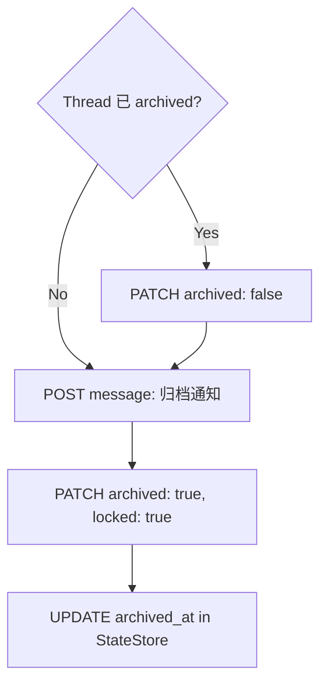
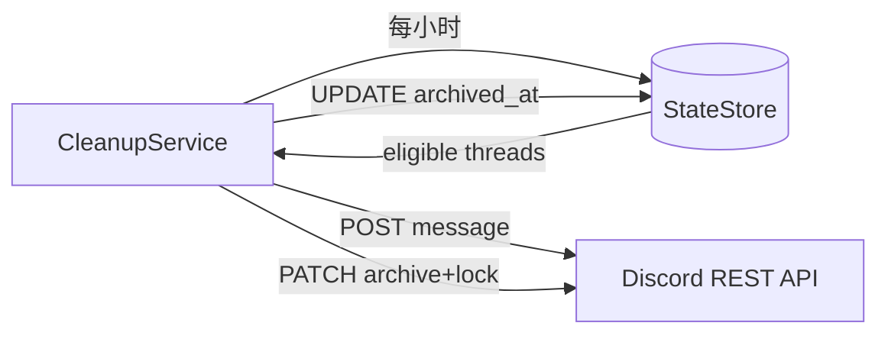

# Research: Forum Post Auto-Cleanup 技术方案 — GEO-169

**Issue**: GEO-169
**Date**: 2026-03-15
**Source**: `doc/exploration/new/GEO-169-completed-post-auto-cleanup.md`

## 1. Discord Bot Token 获取

### 当前位置

Token 存储在 `~/.openclaw/openclaw.json` → `channels.discord.token`。Bridge 目前不持有此 token，所有 Discord 通信通过 OpenClaw agent 中转。

### 方案选择

| 方案 | 描述 | 优缺点 |
|------|------|--------|
| A. ENV VAR | `~/.zshrc` 加 `DISCORD_BOT_TOKEN` | 与现有 pattern 一致（LINEAR_API_KEY 等），简单 |
| B. 读 openclaw.json | Bridge 启动时读取 | 单一 source of truth，但耦合 OpenClaw config 格式 |
| C. OpenClaw API | 新增 token 查询端点 | 过度工程 |

**决策: A (ENV VAR)**。与 `TEAMLEAD_NOTIFICATION_CHANNEL` 等现有变量一致，Bridge config 加一个字段即可。

### 架构考量：Bridge 直接调 Discord API vs 通过 Agent

当前架构: Bridge → Hook → OpenClaw Agent → Discord。所有消息都经过 agent。

但 archive 操作是**确定性动作**（不需要 LLM 判断），通过 agent 反而增加不可靠性。类比 HeartbeatService 的 `reapOrphans()` —— 也是 Bridge 直接执行确定性操作。

**决策: Bridge 直接调 Discord REST API**（仅限 archive/lock/send-notification），用 `fetch` 即可，不引入 discord.js。

## 2. `last_updated` 准确性验证

### 现状（有 Gap）

`conversation_threads.last_updated` 定义:
```sql
last_updated TEXT NOT NULL DEFAULT (datetime('now'))
```

**更新时机**: 仅在 `StateStore.upsertThread()` 中更新（INSERT 或 ON CONFLICT UPDATE）。

**关键发现: Session status 变化不会更新 `last_updated`。**

| 事件 | 调用方法 | 更新 last_updated? |
|------|----------|-------------------|
| Thread 创建/绑定 | `upsertThread()` | Yes |
| session_started | `upsertSession()` | **No** |
| session_completed | `upsertSession()` | **No** |
| session_failed | `upsertSession()` | **No** |
| approve/reject action | `forceStatus()` | **No** |

这意味着 `last_updated` 反映的是**线程创建时间**，而非**最后一次状态变更时间**。

### 解决方案

| 方案 | 描述 | 评估 |
|------|------|------|
| A. 修复 last_updated | 在 status change 时更新 conversation_threads | 需要改多个 code path |
| B. 用 sessions.last_activity_at JOIN | 查询时 JOIN sessions 表 | 最简单，无需修改写入逻辑 |
| C. 新增列 | `conversation_threads.status_changed_at` | 新增字段 + 写入逻辑 |

**决策: B (JOIN sessions 表)**。

原因:
- `sessions.last_activity_at` 已经在每次 `upsertSession()` 时正确更新
- 无需修改任何现有写入逻辑
- 清理查询只需正确的 JOIN

### 清理查询

```sql
SELECT ct.thread_id, ct.issue_id, s.status, s.last_activity_at
FROM conversation_threads ct
INNER JOIN sessions s ON s.issue_id = ct.issue_id
WHERE s.status IN ('completed', 'approved')
  AND s.last_activity_at < datetime('now', '-24 hours')
  AND ct.thread_id IS NOT NULL
  AND ct.archived_at IS NULL
ORDER BY s.last_activity_at ASC
```

注意:
- **不包含 failed** (CEO 决策: failed 不清理)
- `archived_at IS NULL` 防止重复处理
- 一个 issue 可能有多条 sessions，取最新的（需要 GROUP BY 或 subquery）

### 修正后的查询（处理多条 sessions）

```sql
SELECT ct.thread_id, ct.issue_id, latest.status, latest.last_activity_at
FROM conversation_threads ct
INNER JOIN (
  SELECT issue_id, status, last_activity_at,
    ROW_NUMBER() OVER (PARTITION BY issue_id ORDER BY last_activity_at DESC) AS rn
  FROM sessions
  WHERE status IN ('completed', 'approved')
) latest ON latest.issue_id = ct.issue_id AND latest.rn = 1
WHERE latest.last_activity_at < datetime('now', '-24 hours')
  AND ct.thread_id IS NOT NULL
  AND ct.archived_at IS NULL
ORDER BY latest.last_activity_at ASC
```

**sql.js 兼容性**: `ROW_NUMBER() OVER (PARTITION BY ...)` 在 SQLite 3.25+ 支持。sql.js 基于 SQLite 3.40+，兼容。

## 3. Discord Archive API

### 核心 API

**Archive + Lock（单次调用）**:
```http
PATCH /channels/{thread_id}
Authorization: Bot {token}
Content-Type: application/json

{
  "archived": true,
  "locked": true
}
```

**发送通知消息**:
```http
POST /channels/{thread_id}/messages
Authorization: Bot {token}
Content-Type: application/json

{
  "content": "This post has been auto-archived after 24h of completion."
}
```

### 关键约束

1. **不能向已 archived 的 thread 发消息** —— 必须先发消息，再 archive
2. 如果 thread 已被 Discord auto-archive，需要先 unarchive → 发消息 → 再 archive+lock
3. `locked: true` 防止用户发消息导致自动 unarchive

### 操作序列



每个 thread 需要 2-3 个 API 调用。

### 权限要求

| Permission | 用途 |
|------------|------|
| `MANAGE_THREADS` (1 << 34) | Archive + Lock |
| `SEND_MESSAGES_IN_THREADS` (1 << 38) | 发送归档通知 |
| `VIEW_CHANNEL` (1 << 10) | 基础：可见 Forum Channel |

**当前状态**: Bot role (`1473080947204423777`) 已有 Forum Channel 的 `MANAGE_THREADS` + `SEND_MESSAGES_IN_THREADS`（GEO-163 cutover 时配置）。

### Rate Limits

| 类型 | 限制 |
|------|------|
| Global | 50 req/s |
| PATCH /channels | ~10 per 10s per bucket |
| Archive/lock 操作 | 标准 bucket（不触发 name/topic 的 2/10min 限制） |

**实际影响**: 保守策略 5 req/s，10 个 thread 的 cleanup cycle（20-30 个 API 调用）约 6 秒。完全够用。

## 4. 实现方案总结

### 架构



### 技术决策

| 决策 | 选择 | 理由 |
|------|------|------|
| Token 来源 | ENV VAR `DISCORD_BOT_TOKEN` | 与现有 pattern 一致 |
| 时间判断基准 | `sessions.last_activity_at` (JOIN) | 已有数据，无需修改写入逻辑 |
| Archive 动作 | Archive + Lock | 可恢复，防意外 unarchive |
| Discord 调用方式 | Bridge 直接 fetch | 确定性操作，不需要 LLM |
| 清理目标 status | completed, approved | CEO 决策: failed 不清理 |
| 阈值 | 24h（可配置） | CEO 需求 |
| 扫描间隔 | 1h（可配置） | 平衡及时性和 API 调用量 |
| 通知消息 | 发送后 archive | 让 CEO 知道帖子被自动归档 |

### 新增代码估算

| 文件 | 描述 | LOC |
|------|------|-----|
| `CleanupService.ts` | 主逻辑 + Discord API 调用 | ~120 |
| `CleanupService.test.ts` | 单元测试 | ~150 |
| `StateStore.ts` 修改 | `getEligibleForCleanup()` + `markArchived()` + schema migration | ~40 |
| `config.ts` 修改 | 新增 `DISCORD_BOT_TOKEN` + cleanup config | ~15 |
| `server.ts` 修改 | 初始化 CleanupService | ~10 |

**总计**: ~335 LOC（含测试）

### Schema 变更

`conversation_threads` 新增列:
```sql
ALTER TABLE conversation_threads ADD COLUMN archived_at TEXT;
```

用于 dedup（跳过已 archive 的 thread）和审计。

### Open Questions (已解决)

| Question | Resolution |
|----------|-----------|
| Bot Token 如何获取 | ENV VAR `DISCORD_BOT_TOKEN` |
| Failed 帖子是否清理 | 不清理 (CEO 决策) |
| Archive 前发通知 | 是 |
| last_updated 准确性 | 用 sessions.last_activity_at JOIN 代替 |
