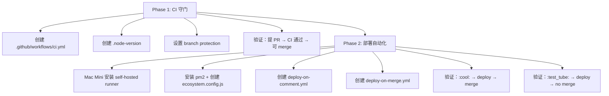

# Research: CI/CD Pipeline Implementation — GEO-175

**Issue**: GEO-175
**Date**: 2026-03-16
**Source**: `doc/exploration/new/GEO-175-cicd-pipeline.md`

## 1. 研究范围

基于 exploration 确定的 Option B（CI + Self-Hosted Runner，分两阶段实施），本研究深入调查：

1. GitHub Actions + pnpm monorepo CI 最佳实践
2. Self-hosted runner macOS 配置
3. Emoji-comment 触发部署机制
4. 进程管理器选择（pm2 vs launchctl）
5. Branch protection 配置
6. GeoForge3D workflow 适配方案

## 2. Flywheel 构建工具链详情

### 2.1 Package 结构

| Package | Build | Test | 外部依赖 |
|---------|-------|------|----------|
| core | tsc | vitest | 无 |
| claude-runner | tsc | vitest | 无 |
| edge-worker | tsc + copy-prompts | vitest (30s timeout) | 无（mock Linear/Claude） |
| teamlead | tsc | vitest | 无（sql.js in-memory） |
| config | tsc | vitest | 无 |
| dag-resolver | tsc | vitest | 无 |
| github-event-transport | tsc | vitest | 无 |
| linear-event-transport | tsc | vitest | 无 |
| slack-event-transport | tsc | vitest | 无 |

**关键发现**：
- 所有测试都在内存中运行，**无需外部服务、API key 或数据库**
- CI 环境无需任何 secret 即可运行 build + test
- 测试框架：Vitest 3.1.4（v8 coverage provider）
- Linter：Biome（非 ESLint）
- Pre-commit hook：husky + lint-staged（`biome check --write --unsafe`）

### 2.2 CI 命令

```bash
pnpm install --frozen-lockfile   # 安装依赖（lockfile 不可变）
pnpm build                       # tsc 编译所有 packages（~30s）
pnpm typecheck                   # tsc --noEmit 全量类型检查
pnpm lint                        # biome check
pnpm test:packages:run           # vitest run（非 watch 模式，~30-45s）
```

**总 CI 时间预估**：< 2 分钟（冷启动含 pnpm install）

### 2.3 Node.js 版本

- 本地运行：v25.6.1
- `@types/node`: ^20.0.0（所有 packages）
- **CI 推荐**：Node.js 22 LTS（稳定、GitHub Actions 默认支持）
- 无 `.node-version` 或 `.nvmrc` 文件（需要创建）

## 3. Phase 1：纯 CI 守门

### 3.1 Workflow 设计

**文件**：`.github/workflows/ci.yml`

```yaml
name: CI

on:
  push:
    branches: [main]
  pull_request:
    branches: [main]

concurrency:
  group: ci-${{ github.ref }}
  cancel-in-progress: true

jobs:
  build-and-test:
    name: Build & Test
    runs-on: ubuntu-latest
    steps:
      - uses: actions/checkout@v4

      - uses: pnpm/action-setup@v4

      - uses: actions/setup-node@v4
        with:
          node-version: 22
          cache: pnpm

      - run: pnpm install --frozen-lockfile

      - run: pnpm build

      - run: pnpm typecheck

      - run: pnpm lint

      - run: pnpm test:packages:run
```

**要点**：
- `pnpm/action-setup@v4` 自动读取 `package.json` 的 `packageManager` 字段，无需显式指定版本
- `actions/setup-node@v4` 的 `cache: pnpm` 自动处理 pnpm store 缓存（基于 `pnpm-lock.yaml` hash）
- `concurrency` 设置确保同一 branch/PR 的旧 CI run 被取消
- 不需要 path filter（Flywheel 不是 monorepo with multiple apps，所有代码都相关）
- **不需要任何 secret** — 测试全部 in-memory

### 3.2 Branch Protection

设置 `main` branch 保护规则：

```bash
gh api -X PUT /repos/xrliAnnie/flywheel/branches/main/protection \
  --input - <<'EOF'
{
  "required_status_checks": {
    "strict": true,
    "contexts": ["Build & Test"]
  },
  "enforce_admins": true,
  "required_pull_request_reviews": null,
  "restrictions": null
}
EOF
```

- `strict: true`：PR 必须与 main 同步才能 merge
- `contexts`：job name 必须与 workflow 中的 `name:` 完全匹配
- `required_pull_request_reviews: null`：不要求 human review（Codex review 已在 workflow 中覆盖）
- `enforce_admins: true`：管理员也不能绕过

## 4. Phase 2：Self-Hosted Runner + Emoji 部署

### 4.1 Self-Hosted Runner 配置

**安装步骤（Mac Mini）**：

```bash
# 1. 创建 runner 目录
mkdir ~/actions-runner && cd ~/actions-runner

# 2. 下载 runner（从 GitHub Settings > Actions > Runners 获取 URL 和 token）
curl -o actions-runner-osx-arm64-2.x.x.tar.gz -L <DOWNLOAD_URL>
tar xzf actions-runner-osx-arm64-2.x.x.tar.gz

# 3. 配置（token 1 小时有效）
./config.sh --url https://github.com/xrliAnnie/flywheel --token <TOKEN>

# 4. 安装为 launchd 服务（开机自启）
sudo ./svc.sh install
sudo ./svc.sh start
sudo ./svc.sh status
```

**安全性**：
- Flywheel 是 private repo → self-hosted runner 安全风险低
- 只有 collaborator 能触发 workflow
- 不要在 runner 环境变量里存 secret → 用 GitHub Actions secrets

**Runner 标签**：`self-hosted, macOS, ARM64`

### 4.2 进程管理器：pm2（推荐）

| 方面 | pm2 | launchctl |
|------|-----|-----------|
| 崩溃自重启 | 内建 | 内建（KeepAlive） |
| 开机启动 | `pm2 startup` 生成 plist | 手写 XML plist |
| 日志管理 | `pm2 logs`，内建 rotation | 需配 newsyslog |
| 监控 | `pm2 monit`, `pm2 status` | 仅 `launchctl list` |
| 零停机重载 | `pm2 reload`（graceful） | 无 |
| 配置 | `ecosystem.config.js` | XML plist（繁琐） |
| 依赖 | `npm i -g pm2` | 系统内置 |

**推荐 pm2**：
- 与 Node.js 生态一致
- `pm2 logs` / `pm2 monit` 对调试 daemon 很有价值
- `pm2 startup` 自动生成 launchd plist
- 未来如需 clustering 或 zero-downtime reload，pm2 直接支持

**ecosystem.config.js**：

```javascript
module.exports = {
  apps: [{
    name: 'flywheel-bridge',
    script: './packages/teamlead/dist/index.js',
    cwd: '/Users/xiaorongli/Dev/flywheel',
    env: {
      NODE_ENV: 'production',
      TEAMLEAD_PORT: 9876,
    },
    // 从 .env 文件加载其他环境变量
    env_file: './packages/teamlead/.env',
    max_restarts: 10,
    restart_delay: 3000,
    watch: false,
    log_date_format: 'YYYY-MM-DD HH:mm:ss',
  }],
};
```

### 4.3 Deploy Workflow：Emoji Comment 触发

**文件**：`.github/workflows/deploy-on-comment.yml`

基于 GeoForge3D 的 `backend-deploy-on-comment.yml` 适配：

```yaml
name: Deploy

on:
  issue_comment:
    types: [created]

permissions:
  contents: write
  issues: write
  pull-requests: write
  actions: write
  checks: read

jobs:
  deploy-and-merge:
    name: "Deploy PR"
    if: |
      github.event.issue.pull_request &&
      github.event.issue.state == 'open' &&
      (contains(github.event.comment.body, ':cool:') ||
       contains(github.event.comment.body, '😎') ||
       contains(github.event.comment.body, ':test_tube:') ||
       contains(github.event.comment.body, '🧪'))
    runs-on: self-hosted
    outputs:
      head_ref: ${{ steps.pr-info.outputs.head_ref }}
      pr_title: ${{ steps.pr-info.outputs.pr_title }}
      is_testtube: ${{ steps.detect-mode.outputs.is_testtube }}
    steps:
      # 1. 获取 PR 信息
      - name: Get PR info
        id: pr-info
        uses: actions/github-script@v7
        with:
          script: |
            const { data: pr } = await github.rest.pulls.get({
              owner: context.repo.owner,
              repo: context.repo.repo,
              pull_number: context.issue.number
            });
            core.setOutput('head_ref', pr.head.ref);
            core.setOutput('head_sha', pr.head.sha);
            core.setOutput('pr_title', pr.title);

      # 2. 检测 testtube vs queue
      - name: Detect mode
        id: detect-mode
        run: |
          COMMENT='${{ github.event.comment.body }}'
          if echo "$COMMENT" | grep -qE '(:test_tube:|🧪)'; then
            echo "is_testtube=true" >> $GITHUB_OUTPUT
          else
            echo "is_testtube=false" >> $GITHUB_OUTPUT
          fi

      # 3. 添加 reaction 确认收到
      - name: React to comment
        uses: actions/github-script@v7
        with:
          script: |
            await github.rest.reactions.createForIssueComment({
              owner: context.repo.owner,
              repo: context.repo.repo,
              comment_id: context.payload.comment.id,
              content: 'rocket'
            });

      # 4. Checkout PR branch
      - uses: actions/checkout@v4
        with:
          ref: ${{ steps.pr-info.outputs.head_ref }}

      # 5. Setup + Build + Test
      - uses: pnpm/action-setup@v4
      - uses: actions/setup-node@v4
        with:
          node-version: 22
          cache: pnpm
      - run: pnpm install --frozen-lockfile
      - run: pnpm build
      - run: pnpm test:packages:run

      # 6. Deploy (重启 Bridge)
      - name: Deploy Bridge
        run: |
          cd /Users/xiaorongli/Dev/flywheel
          git fetch origin
          git checkout ${{ steps.pr-info.outputs.head_ref }}
          git pull origin ${{ steps.pr-info.outputs.head_ref }}
          pnpm install --frozen-lockfile
          pnpm build
          pm2 restart flywheel-bridge || pm2 start ecosystem.config.js

      # 7. Health check
      - name: Verify deployment
        run: |
          sleep 3
          curl -sf --max-time 5 http://localhost:9876/health || exit 1

  # Auto-merge (仅 :cool: 模式)
  merge-pr:
    name: "Merge PR"
    needs: deploy-and-merge
    if: |
      needs.deploy-and-merge.result == 'success' &&
      needs.deploy-and-merge.outputs.is_testtube == 'false'
    runs-on: ubuntu-latest
    steps:
      - name: Squash merge
        uses: actions/github-script@v7
        with:
          script: |
            await github.rest.pulls.merge({
              owner: context.repo.owner,
              repo: context.repo.repo,
              pull_number: context.issue.number,
              merge_method: 'squash',
              commit_title: `🚀 Deployed and merged: ${{ needs.deploy-and-merge.outputs.pr_title }}`,
              commit_message: 'Auto-merged after successful deployment via :cool: comment'
            });
            await github.rest.issues.createComment({
              owner: context.repo.owner,
              repo: context.repo.repo,
              issue_number: context.issue.number,
              body: '✅ Deployment successful! PR has been automatically merged to main.'
            });
            try {
              await github.rest.git.deleteRef({
                owner: context.repo.owner,
                repo: context.repo.repo,
                ref: 'heads/${{ needs.deploy-and-merge.outputs.head_ref }}'
              });
            } catch (e) { /* best-effort branch cleanup */ }

  # Testtube 模式 — 通知但不 merge
  notify-testtube:
    name: "Notify Testtube"
    needs: deploy-and-merge
    if: |
      needs.deploy-and-merge.result == 'success' &&
      needs.deploy-and-merge.outputs.is_testtube == 'true'
    runs-on: ubuntu-latest
    steps:
      - name: Comment result
        uses: actions/github-script@v7
        with:
          script: |
            await github.rest.issues.createComment({
              owner: context.repo.owner,
              repo: context.repo.repo,
              issue_number: context.issue.number,
              body: '🧪 Testtube deployment successful! PR will NOT be auto-merged. Use :cool: to deploy and merge.'
            });
```

### 4.4 Auto-Deploy on Push to Main

**文件**：`.github/workflows/deploy-on-merge.yml`

```yaml
name: Auto-Deploy

on:
  push:
    branches: [main]

jobs:
  deploy:
    name: Deploy to production
    # 跳过 auto-merge commit（防循环）
    if: "!contains(github.event.head_commit.message, '🚀 Deployed and merged:')"
    runs-on: self-hosted
    steps:
      - uses: actions/checkout@v4

      - uses: pnpm/action-setup@v4
      - uses: actions/setup-node@v4
        with:
          node-version: 22
          cache: pnpm

      - run: pnpm install --frozen-lockfile
      - run: pnpm build
      - run: pm2 restart flywheel-bridge || pm2 start ecosystem.config.js

      - name: Health check
        run: |
          sleep 3
          curl -sf --max-time 5 http://localhost:9876/health || exit 1
```

**关键**：`if` 条件检测 commit message 是否包含 sentinel 字符串 `🚀 Deployed and merged:`，防止 `:cool:` auto-merge 后重复部署。

### 4.5 Deploy 流程中的关键问题

**问题 1：Self-hosted runner 与主项目目录冲突**

Runner checkout 的代码和 `/Users/xiaorongli/Dev/flywheel` 是不同目录。Deploy 步骤需要操作**主项目目录**（因为 Bridge 从那里运行）。

**方案**：Deploy 步骤在 runner workspace 中 build + test，然后在主目录中 `git pull` + `pnpm build` + `pm2 restart`。

**问题 2：部署期间 Bridge 短暂不可用**

`pm2 restart` 会有短暂停机（~1-3s）。对于 Flywheel 这类非用户面向的内部服务，可接受。

如果需要 zero-downtime：`pm2 reload`（graceful reload）。

**问题 3：OpenClaw Gateway 是否需要一起重启？**

Bridge 部署不影响 OpenClaw Gateway（独立进程）。除非代码改动涉及 Gateway 配置变更，否则不需要重启 Gateway。

## 5. 实施路径



### Phase 1 任务清单

| # | 任务 | 文件 |
|---|------|------|
| 1 | 创建 CI workflow | `.github/workflows/ci.yml` |
| 2 | 创建 `.node-version` | `.node-version`（内容：`22`） |
| 3 | 验证 CI 运行 | 提 test PR |
| 4 | 设置 branch protection | `gh api` command |

### Phase 2 任务清单

| # | 任务 | 位置 |
|---|------|------|
| 1 | Mac Mini 安装 self-hosted runner | `~/actions-runner/` |
| 2 | 安装 pm2 + 创建 ecosystem.config.js | 项目根目录 |
| 3 | 迁移 Bridge 到 pm2 管理 | Mac Mini |
| 4 | 创建 deploy-on-comment.yml | `.github/workflows/` |
| 5 | 创建 deploy-on-merge.yml | `.github/workflows/` |
| 6 | E2E 验证 testtube 模式 | `:test_tube:` comment |
| 7 | E2E 验证 queue 模式 | `:cool:` comment |

## 6. 待决定事项（需用户确认）

1. **部署目标**：Deploy 只重启 Bridge 即可？还是也需要 pull + rebuild OpenClaw 相关内容？
   - **建议**：只 Bridge。OpenClaw 是独立项目，有自己的部署流程。

2. **Testtube 行为**：部署到同端口（替换当前服务），还是不同端口（预览）？
   - **建议**：同端口替换。Flywheel 只有一个环境（Mac Mini），不同端口增加复杂度但价值不大。

3. **是否需要手动 workflow_dispatch 入口？**
   - **建议**：Phase 2 的 `deploy-on-merge.yml` 加 `workflow_dispatch` 输入，方便手动触发。

## 7. 风险

| 风险 | 影响 | 缓解 |
|------|------|------|
| Self-hosted runner 离线 | 无法 emoji 部署 | 手动 SSH 部署作为 fallback |
| pm2 startup plist 问题 | Mac Mini 重启后 Bridge 不自动启动 | 手动创建 LaunchDaemon plist |
| Runner 与主目录 git 冲突 | Deploy 时 checkout 冲突 | Deploy 脚本用 `git -C` 指定目录 |
| CI 时间过长 | 开发体验下降 | 当前 < 2 分钟，可接受 |
