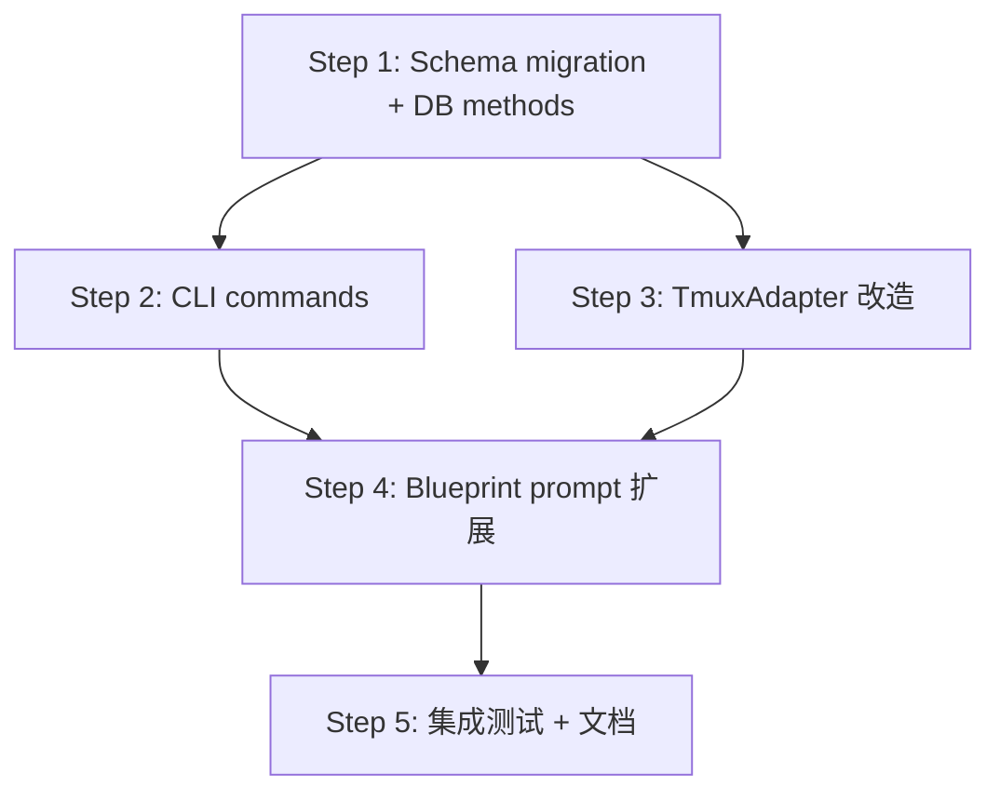

# Research: Lead ↔ Runner 双向通信 Phase 2 — GEO-206

**Issue**: GEO-206
**Date**: 2026-03-22
**Source**: `doc/exploration/new/GEO-206-phase2-lead-proactive-comm.md`
**Status**: Complete

---

## 1. Feature 1: Lead 主动指令 (send + inbox)

### 1.1 Schema 变更

现有 `messages` 表已支持 `instruction` type（CHECK constraint）。需要新增 `read_at` 列标记已读。

**Migration 策略**: `PRAGMA table_info` 检查 + 条件 ALTER TABLE

```typescript
private applyMigrations(): void {
    const columns = this.db
        .prepare("PRAGMA table_info(messages)")
        .all() as Array<{ name: string }>;

    if (!columns.some(c => c.name === 'read_at')) {
        this.db.exec("ALTER TABLE messages ADD COLUMN read_at DATETIME");
    }
}
```

**理由**: SQLite 不支持 `ALTER TABLE ADD COLUMN IF NOT EXISTS`。必须先检查再 ALTER。新数据库通过 `SCHEMA` 常量直接创建带 `read_at` 的表。

### 1.2 DB 新增方法

```typescript
// db.ts
insertInstruction(fromAgent: string, toAgent: string, content: string): string
getUnreadInstructions(agentId: string): Message[]
markInstructionRead(id: string): void
```

- `insertInstruction`: INSERT with type='instruction'
- `getUnreadInstructions`: SELECT WHERE to_agent=? AND type='instruction' AND read_at IS NULL
- `markInstructionRead`: UPDATE SET read_at=datetime('now') WHERE id=?

### 1.3 CLI Commands

**`send` command** (Lead to Runner):
```bash
flywheel-comm send --from <lead-id> --to <exec-id> "指令内容"
```

**`inbox` command** (Runner 检查):
```bash
flywheel-comm inbox --exec-id <id> [--json]
# 返回未读指令列表，同时自动标记为已读
```

**CLI 实现要点**:
- `send`: 调用 `db.insertInstruction(fromAgent, toAgent, content)`
- `inbox`: 调用 `db.getUnreadInstructions(execId)`，对每条调用 `markInstructionRead(id)`
- `inbox` 的 `--exec-id` 参数映射到 `to_agent` 字段

### 1.4 System Prompt 扩展

Blueprint.ts lines 298-311 当前注入 ask/check 指令。需要追加 inbox 检查指令:

```
Additionally, your Lead may send you proactive instructions.
Periodically check for instructions with:
  node <commCliPath> inbox --exec-id <executionId>
Check at task boundaries (before committing, when starting a new subtask).
If you receive instructions, evaluate them: follow immediately if urgent,
otherwise incorporate at the next natural breakpoint.
```

---

## 2. Feature 2: 动态超时

### 2.1 TmuxAdapter 超时机制分析

**现状** (`TmuxAdapter.ts`):
- Line 73: `effectiveTimeoutMs = ctx.timeoutMs ?? 2_700_000` — 一次计算，不可变
- Line 236: `setTimeout(() => settle(true), timeoutMs)` — 无法延长
- Lines 254-319: poll loop 每 5 秒执行一次

**关键发现**: `setTimeout` 一旦设置无法修改。必须在 poll loop 中手动跟踪超时。

### 2.2 推荐方案: 基于 elapsed time 的动态超时

在 poll loop 中手动检查 elapsed time + comm.db 状态:

```typescript
const start = Date.now();
let isWaitingForLead = false;

// 硬上限 timer 作为 safety net
const hardTimer = setTimeout(() => settle(true),
    ctx.waitingTimeoutMs ?? timeoutMs);

poller = setInterval(() => {
    if (settled) return;
    ctx.onHeartbeat?.(ctx.executionId);

    // 动态超时检查
    const elapsed = Date.now() - start;
    const currentTimeout = isWaitingForLead
        ? (ctx.waitingTimeoutMs ?? 14_400_000)  // 4h when waiting
        : timeoutMs;                              // 45min normal

    if (elapsed > currentTimeout) {
        settle(true);
        return;
    }

    // 检查 comm.db 是否有 pending questions
    if (ctx.commDbPath && ctx.leadId) {
        try {
            if (existsSync(ctx.commDbPath)) {
                const db = new CommDB(ctx.commDbPath, false);
                try {
                    const pending = db.getPendingQuestions(ctx.leadId);
                    isWaitingForLead = pending.length > 0;
                } finally {
                    db.close();
                }
            }
        } catch {
            // DB 读取失败 — 忽略，使用正常超时
        }
    }

    // ... 原有 sentinel + pane_dead 检查逻辑
}, this.pollIntervalMs);
```

### 2.3 AdapterExecutionContext 新增字段

```typescript
// packages/core/src/adapter-types.ts
export interface AdapterExecutionContext {
    // ... existing fields
    waitingTimeoutMs?: number;  // Default: 14_400_000 (4h)
    leadId?: string;            // For dynamic timeout check
    projectName?: string;       // For session registration
}
```

### 2.4 Blueprint 传递新字段

```typescript
// Blueprint.ts adapter.execute() 调用中新增:
waitingTimeoutMs: 14_400_000,  // 4 hours
leadId: ctx.leadId,
projectName: ctx.projectName,
```

### 2.5 Package 依赖

`claude-runner` 需要新增对 `flywheel-comm` 的依赖:

```json
// packages/claude-runner/package.json
"flywheel-comm": "workspace:*"
```

**无循环依赖风险**: `flywheel-comm` 只依赖 `better-sqlite3`。

### 2.6 SQLite Poll 性能

- better-sqlite3 本地查询: <1ms（indexed SELECT）
- 连接开关: ~0.5ms
- 总开销: ~1.5ms / 5000ms = 0.03% CPU
- WAL 模式保证 Runner 写入和 TmuxAdapter 读取不互相阻塞

---

## 3. Feature 3: Session 注册 + Lead tmux 可见性

### 3.1 Sessions 表

```sql
CREATE TABLE IF NOT EXISTS sessions (
    execution_id  TEXT PRIMARY KEY,
    tmux_window   TEXT NOT NULL,
    project_name  TEXT NOT NULL,
    issue_id      TEXT,
    lead_id       TEXT,
    started_at    DATETIME DEFAULT CURRENT_TIMESTAMP,
    ended_at      DATETIME,
    status        TEXT DEFAULT 'running'
        CHECK(status IN ('running','completed','failed','timeout'))
);
CREATE INDEX IF NOT EXISTS idx_sessions_project ON sessions(project_name);
CREATE INDEX IF NOT EXISTS idx_sessions_status ON sessions(status);
```

### 3.2 DB 新增方法

```typescript
registerSession(executionId, tmuxWindow, projectName, issueId?, leadId?): void
updateSessionStatus(executionId, status): void
getActiveSessions(projectName?): Session[]
```

### 3.3 Session 注册时机

**TmuxAdapter.execute()** — `tmux new-window` 成功后 (line 158):

```typescript
if (ctx.commDbPath) {
    try {
        const db = new CommDB(ctx.commDbPath);
        db.registerSession(ctx.executionId, windowId,
            ctx.projectName ?? "unknown", ctx.issueId, ctx.leadId);
        db.close();
    } catch { /* 注册失败不阻塞执行 */ }
}
```

**Session 结束时** — `waitForCompletion` resolve 后:

```typescript
if (ctx.commDbPath) {
    try {
        const db = new CommDB(ctx.commDbPath);
        db.updateSessionStatus(ctx.executionId,
            timedOut ? 'timeout' : 'completed');
        db.close();
    } catch { /* ignore */ }
}
```

### 3.4 capture CLI Command

```bash
flywheel-comm capture --exec-id <execution-id> [--lines 100]
```

实现流程:
1. 从 sessions 表查 execution_id → tmux_window
2. 用 `execFileSync("tmux", ["capture-pane", ...])` 捕获输出
3. 返回终端内容

### 3.5 sessions CLI Command

```bash
flywheel-comm sessions [--project <name>] [--json]
# 列出所有活跃 Runner sessions
```

---

## 4. 改动文件汇总

### flywheel-comm package

| 文件 | 操作 | 内容 |
|------|------|------|
| `src/db.ts` | modify | applyMigrations(), instruction CRUD, session CRUD |
| `src/types.ts` | modify | Session interface, read_at field |
| `src/index.ts` | modify | 新增 send, inbox, sessions, capture |
| `src/commands/send.ts` | 新增 | Lead → Runner 指令 |
| `src/commands/inbox.ts` | 新增 | Runner 检查指令 |
| `src/commands/sessions.ts` | 新增 | 列出活跃 sessions |
| `src/commands/capture.ts` | 新增 | 捕获 tmux 输出 |
| `src/__tests__/*.test.ts` | modify | 新功能测试 |

### 其他 packages

| 文件 | 操作 | 内容 |
|------|------|------|
| `packages/core/src/adapter-types.ts` | modify | waitingTimeoutMs?, leadId?, projectName? |
| `packages/edge-worker/src/Blueprint.ts` | modify | prompt 追加 inbox; 传递新字段 |
| `packages/claude-runner/src/TmuxAdapter.ts` | modify | 动态超时 + session 注册 |
| `packages/claude-runner/package.json` | modify | 新增 flywheel-comm 依赖 |
| `packages/teamlead/scripts/claude-lead.sh` | modify | send 用法文档 |

---

## 5. 依赖关系



---

## 6. 测试策略

| 类别 | 测试 | 方法 |
|------|------|------|
| Schema | migration backward compat | 旧 DB 重新打开 → 验证 read_at 存在 |
| Instruction | send → inbox → auto-read | TDD round-trip |
| Dynamic timeout | pending question 延长超时 | Mock poll loop |
| Session | register → list → update | TDD |
| Capture | tmux capture-pane | Mock execFileSync |
| CLI | 新 commands 参数解析 | TDD |

---

## 7. 风险与缓解

| 风险 | 概率 | 缓解 |
|------|------|------|
| Runner 不检查 inbox | 高 | 系统 prompt 多处提醒 |
| Schema migration 失败 | 低 | PRAGMA table_info 检查 |
| 动态超时永不超时 | 中 | 硬上限 timer 作为 safety net |
| capture 在 session 结束后调用 | 低 | 检查 session status |

---

## 8. 已解决的决策

| 决策 | 结果 | 来源 |
|------|------|------|
| F3 scope | 全部纳入 Phase 2 | CEO |
| Runner 指令处理 | 自行判断，除非明确要求停止 | CEO |
| 已读标记 | 读取即标记 | CEO |
| Version | v1.9.0 | 惯例 |
