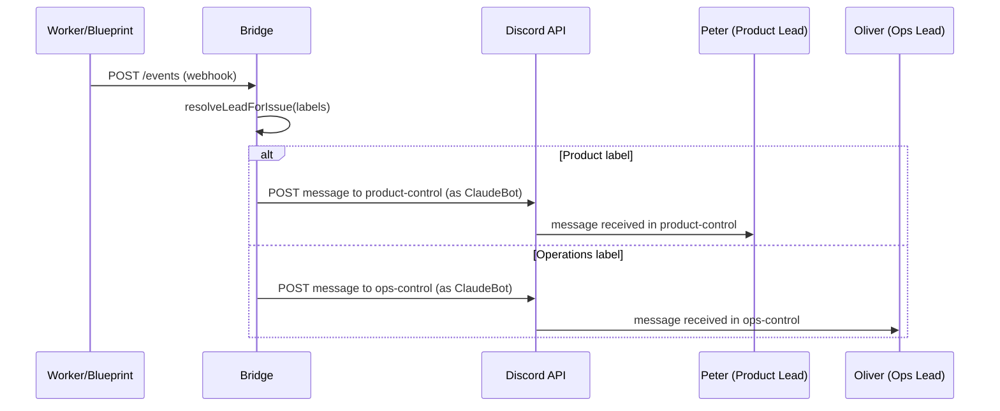

# Research: Multi-Lead Architecture — GEO-246

**Issue**: GEO-246
**Date**: 2026-03-24
**Source**: `doc/exploration/new/GEO-246-multi-lead-architecture.md`

---

## 1. Supervisor Script (`claude-lead.sh`) — 5 个硬编码点

当前脚本硬编码了 `product-lead`，无法启动其他 agent。以下是需要参数化的 5 个位置：

| # | 行号 | 当前代码 | 修改为 |
|---|------|---------|--------|
| 1 | 84 | `AGENT_SOURCE="${SCRIPT_DIR}/../agents/product-lead.md"` | `"${SCRIPT_DIR}/../agents/${LEAD_ID}.md"` |
| 2 | 85 | `AGENT_TARGET="${HOME}/.claude/agents/product-lead.md"` | `"${HOME}/.claude/agents/${LEAD_ID}.md"` |
| 3 | 106 | `LEAD_WORKSPACE="${HOME}/.flywheel/lead-workspace/${LEAD_ID}"` | `"${WORKSPACE_DIR:-${HOME}/.flywheel/lead-workspace/${LEAD_ID}}"` |
| 4 | 129 | `CLAUDE_ARGS=(--agent product-lead ...)` | `(--agent "$LEAD_ID" ...)` |
| 5 | 96 | echo msg 引用 `product-lead.md` | 使用 `${LEAD_ID}.md` |

**关键发现**: `$LEAD_ID` 已经是 agent 名称（`product-lead`、`ops-lead`）。只需将所有硬编码的 `product-lead` 替换为 `$LEAD_ID`，自然就支持多 agent。

### Workspace 路径

用户要求 workspace 放在 org 目录下：
```
geoforge3d/product/.lead/product-lead/     ← 已存在
geoforge3d/operations/.lead/ops-lead/       ← 需创建
```

由于 org 目录名 ≠ lead-id（`product` vs `product-lead`、`operations` vs `ops-lead`），不能自动推导。方案：

- **新增环境变量 `LEAD_WORKSPACE`** — 显式指定 workspace 路径
- 默认值 fallback: `${HOME}/.flywheel/lead-workspace/${LEAD_ID}`（保持向后兼容）
- 启动命令示例：
  ```bash
  LEAD_WORKSPACE=/path/to/geoforge3d/product/.lead/product-lead \
  DISCORD_BOT_TOKEN=xxx \
    ./scripts/claude-lead.sh product-lead /path/to/geoforge3d geoforge3d
  ```

---

## 2. Bridge 兼容性分析 — 无需改代码

### 已就绪的基础设施

| 组件 | 状态 | 说明 |
|------|------|------|
| `LeadConfig.runtime` | ✅ 已有 | 支持 `"openclaw" \| "claude-discord"` |
| `LeadConfig.controlChannel` | ✅ 已有 | per-lead control channel ID |
| `createLeadRuntime()` | ✅ 已有 | 根据 runtime 类型创建对应 runtime |
| `ClaudeDiscordRuntime` | ✅ 已有 | 通过 Discord REST API 投递事件到 control channel |
| `RuntimeRegistry` | ✅ 已有 | 注册 N 个 lead runtime |
| `resolveLeadForIssue()` | ✅ 已有 | label-based routing（case-insensitive） |
| `generateBootstrap()` | ✅ 已有 | 按 leadId 过滤 sessions |

### Bot Token 分离

**关键发现**：Bridge 的 `discordBotToken` 和 Lead 的 `DISCORD_BOT_TOKEN` 是两个不同的 token：

```
Bridge (config.ts)
├── config.discordBotToken → ClaudeBot token
│   用于: ClaudeDiscordRuntime 投递事件、ForumTagUpdater、CleanupService
│
Lead tmux session (claude-lead.sh)
├── $DISCORD_BOT_TOKEN → Peter/Oliver token
│   用于: Claude Code Discord plugin 连接
```

两者通过不同路径加载：
- Bridge: `process.env.DISCORD_BOT_TOKEN` → `loadConfig()` → `config.discordBotToken`
- Lead: `$DISCORD_BOT_TOKEN` → Claude Code Discord plugin 在 Lead 进程中读取

互不干扰。Bridge 用 ClaudeBot 发事件，Lead 用各自的 bot 接收。

### 事件投递流程



---

## 3. Discord 架构 — 3 个 Bot

### Bot 角色

| Bot | 用途 | Token 使用者 | 需要访问的 channels |
|-----|------|-------------|-------------------|
| **ClaudeBot** (已有) | Bridge 基础设施 | Bridge 进程 | 所有 control channels（写）、forum channels（tag 更新） |
| **Peter** (新建) | Product Lead 身份 | product-lead tmux | product-control（读）、product-forum/chat（读写） |
| **Oliver** (新建) | Ops Lead 身份 | ops-lead tmux | ops-control（读）、ops-forum/chat（读写） |

### Channel 架构

```
claude's server (1485787271192907816)
├── GeoForge3D (category)
│   ├── geoforge3d-product-forum (1485787822119194755) — CEO 可见
│   ├── geoforge3d-product-chat  (1485787822894878955) — CEO 可见
│   ├── geoforge3d-ops-forum     (1485789340989915266) — CEO 可见
│   ├── geoforge3d-ops-chat      (1485789342541680661) — CEO 可见
│   ├── product-lead-control     (新建) — 隐藏, ClaudeBot 写, Peter 读
│   └── ops-lead-control         (新建) — 隐藏, ClaudeBot 写, Oliver 读
```

### Channel 权限矩阵

| Channel | CEO | ClaudeBot | Peter | Oliver |
|---------|-----|-----------|-------|--------|
| product-forum | ✅ RW | ✅ RW | ✅ RW | ❌ |
| product-chat | ✅ RW | ✅ RW | ✅ RW | ❌ |
| ops-forum | ✅ RW | ✅ RW | ❌ | ✅ RW |
| ops-chat | ✅ RW | ✅ RW | ❌ | ✅ RW |
| product-lead-control | ❌ | ✅ W | ✅ R | ❌ |
| ops-lead-control | ❌ | ✅ W | ❌ | ✅ R |

### Discord 权限实现

1. **创建 bot-specific roles**: `Peter-Bot`, `Oliver-Bot`
2. **Category-level**: deny `View Channel` for both bot roles
3. **Channel-level override**: allow `View Channel` + `Send Messages` for对应 bot
4. **Control channels**: 设为 private，仅 allow 相关 bot

---

## 4. projects.json 更新

当前配置（使用 OpenClaw server channel IDs + 无 runtime）:
```json
{
  "leads": [
    {
      "agentId": "product-lead",
      "forumChannel": "1482925814533329049",  // OpenClaw server
      "chatChannel": "1484083711820435486",   // OpenClaw server
      "match": { "labels": ["Product"] }
      // runtime 默认 "openclaw"，无 controlChannel
    },
    {
      "agentId": "ops-lead",
      "forumChannel": "1484696074651304186",  // OpenClaw server
      "chatChannel": "1484697796966613012",   // OpenClaw server
      "match": { "labels": ["Operations"] }
    }
  ]
}
```

需要更新为：
```json
{
  "leads": [
    {
      "agentId": "product-lead",
      "forumChannel": "1485787822119194755",  // claude's server
      "chatChannel": "1485787822894878955",   // claude's server
      "match": { "labels": ["Product"] },
      "runtime": "claude-discord",
      "controlChannel": "<新建的 product-lead-control ID>"
    },
    {
      "agentId": "ops-lead",
      "forumChannel": "1485789340989915266",  // claude's server
      "chatChannel": "1485789342541680661",   // claude's server
      "match": { "labels": ["Operations"] },
      "runtime": "claude-discord",
      "controlChannel": "<新建的 ops-lead-control ID>"
    }
  ]
}
```

---

## 5. Claude Code Discord Plugin — access.json

### 共享机制

`~/.claude/channels/discord/access.json` 是全局共享的。所有 Claude Code 实例（Peter、Oliver）读取同一个文件。

**这不是问题**，因为：
- access.json 控制的是 plugin 订阅哪些 channels
- 即使两个 Lead 都订阅了所有 channels，Discord 只会向有权限的 bot 投递消息
- Peter 的 bot token 只有 product channels 的权限 → 只收到 product 消息
- Oliver 的 bot token 只有 ops channels 的权限 → 只收到 ops 消息

### 需要添加的 channels

Control channels 需要加入 `access.json` 的 `groups`：
```json
{
  "groups": {
    // 已有 4 个...
    "<product-lead-control-id>": { "requireMention": false, "allowFrom": [] },
    "<ops-lead-control-id>": { "requireMention": false, "allowFrom": [] }
  }
}
```

---

## 6. Agent Memory Frontmatter

### 语法确认

```yaml
---
name: product-lead
memory: user
# ...其他字段
---
```

- `memory: user` → `~/.claude/agent-memory/product-lead/MEMORY.md`
- `memory: project` → `.claude/agent-memory/product-lead/MEMORY.md`（相对于 CWD）

### 隔离机制

每个 agent name 自动创建独立的 memory 目录。`product-lead` 和 `ops-lead` 的 memory 完全分离，无需额外配置。

### 与 mem0 的关系

| 维度 | mem0 | Claude Code memory |
|------|------|-------------------|
| 存储 | Supabase pgvector | 本地 MEMORY.md |
| 查询 | 语义搜索 (embedding) | 注入 system prompt（前 200 行） |
| 写入 | Bridge Memory API | Agent 自己写文件 |
| 用途 | 项目知识库 | Agent 行为/风格/学习笔记 |
| 跨项目 | 按 project_name 隔离 | `user` scope 跨项目 |

两者互补，不冲突。

---

## 7. Agent 文件

### product-lead.md 改动

仅添加 `memory: user` 到 frontmatter：

```yaml
---
name: product-lead
description: Flywheel Product Department Lead
model: opus
memory: user
disallowedTools: Write, Edit, MultiEdit, Agent, NotebookEdit
permissionMode: bypassPermissions
---
```

### ops-lead.md 创建

结构与 product-lead.md 相同，但：
- `name: ops-lead`
- 人格: 产品运营（3D 打印运营、订单处理、客户服务）
- Channel IDs: ops-forum, ops-chat, ops-lead-control
- 职责: 关注运营指标、订单状态、客户反馈，而非代码开发

---

## 8. .gitignore 更新

当前 `geoforge3d/.gitignore` 部分覆盖 `product/.lead/`：
```gitignore
product/.lead/*/.openclaw/
product/.lead/*/sessions/
product/.lead/*/memory/
product/.lead/*/*.bak.*
```

建议通配化：
```gitignore
# Lead workspace runtime data (all orgs)
*/.lead/
```

这样自动覆盖 `product/.lead/`、`operations/.lead/`、以及未来的任何 org 目录。

---

## 9. 风险和注意事项

### 9.1 Discord Plugin 收到其他 bot 消息

ClaudeBot 在 control channel 发的事件消息，Lead 的 Discord plugin 是否能收到？

- Discord 默认向 channel 中所有有权限的 bot 投递所有消息（包括其他 bot 的消息）
- Claude Code Discord plugin 可能过滤 bot 消息（self-messages 一定会过滤）
- **需要实际测试**确认跨 bot 消息投递是否工作

**缓解**: 如果不工作，可以改为让 Bridge 使用 Lead 自己的 bot token 投递到 control channel（需要在 projects.json 中增加 per-lead bot token 字段）。

### 9.2 同时启动多个 Claude Code 实例

- 每个 Lead 是独立的 Claude Code 进程
- 共享 `~/.claude/` 配置目录
- Session 数据在 `~/.claude/projects/<hash>/sessions/` — 按 CWD 哈希隔离
- 不同 CWD（product/.lead/product-lead/ vs operations/.lead/ops-lead/）→ 不同 session 目录
- **无冲突**

### 9.3 手动步骤

以下步骤无法自动化，需用户手动操作：

1. 在 Discord Developer Portal 创建 Peter 和 Oliver Application
2. 获取 bot tokens
3. 设置 bot 头像
4. 邀请 bots 到 claude's server

---

## 10. Implementation Checklist

| # | 步骤 | 类型 | 预估 |
|---|------|------|------|
| 1 | 创建 Discord bots (Peter + Oliver) | 手动 | 15 min |
| 2 | 创建 control channels + 设权限 | 手动/API | 15 min |
| 3 | 参数化 `claude-lead.sh` | 代码 | 30 min |
| 4 | 添加 `memory: user` 到 product-lead.md | 代码 | 5 min |
| 5 | 创建 `ops-lead.md` | 代码 | 30 min |
| 6 | 更新 projects.json | 配置 | 10 min |
| 7 | 更新 access.json | 配置 | 5 min |
| 8 | 更新 geoforge3d .gitignore | 配置 | 5 min |
| 9 | 测试: 两个 Lead 同时启动 | 测试 | 30 min |

**总计**: ~2.5 hours
