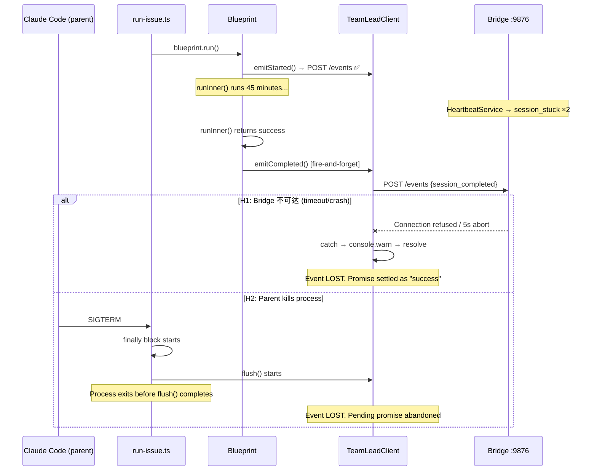

# Research: Runner session_completed Event Missing — GEO-261

**Issue**: GEO-261
**Date**: 2026-03-25
**Source**: `doc/exploration/new/GEO-261-session-completed-missing.md`

## Confirmed Root Cause

**Primary**: `postEvent()` HTTP 请求失败（5s abort timeout 或 Bridge 不可达），错误被 try-catch 静默吞掉，promise resolved（非 rejected），`flush()` 正常完成 — 事件丢失。

**Contributing**: `run-issue.ts` 无 SIGTERM handler，从 Claude Code session 内运行时父进程可能随时终止子进程。

## Evidence Chain

### 1. Fire-and-Forget Architecture（已确认）

`emitCompleted()` (`ExecutionEventEmitter.ts:58-82`) 不 await `postEvent()`：

```typescript
async emitCompleted(...): Promise<void> {
    const p = this.postEvent({...});  // HTTP POST starts
    this.track(p);                     // Promise tracked but NOT awaited
    // Returns immediately!
}
```

### 2. Silent Error Swallowing（已确认）

`postEvent()` (`ExecutionEventEmitter.ts:155-181`) 的 try-catch 吞掉所有错误：

```typescript
private async postEvent(body): Promise<void> {
    try {
        const controller = new AbortController();
        const timeout = setTimeout(() => controller.abort(), 5_000);
        const res = await fetch(url, { signal: controller.signal });
        // ...
    } catch (err) {
        console.warn(`Failed to post event: ...`);  // SILENTLY CAUGHT
        // Promise resolves normally — flush() sees it as "done"
    }
}
```

**关键**: catch 块不 rethrow → promise 总是 resolve → `flush()` 的 `Promise.allSettled()` 看到它已 settled → 认为事件已发送 → 事件丢失。

### 3. No SIGTERM Protection（已确认）

`run-issue.ts` 搜索结果：
- ❌ 无 `process.on('SIGTERM')` handler
- ❌ 无 `process.on('SIGINT')` handler
- ❌ 无 `process.on('beforeExit')` handler
- ✅ `run-bridge.ts` 有 SIGTERM/SIGINT handler（对比参考）

### 4. Bridge URL 单次读取（已确认）

- `TEAMLEAD_URL` 在 `setupComponents()` 时读取一次 (`setup.ts:124`)
- 构造 `TeamLeadClient(teamleadUrl, teamleadToken)` (`setup.ts:388-392`)
- 整个 45 分钟 session 使用同一个 URL，无健康检查

### 5. Promise.race 无实际效果（已确认）

`emitTerminal()` (`Blueprint.ts:489-492`) 的 1s timeout race 无意义：

```typescript
await Promise.race([
    this.eventEmitter.emitCompleted(env, result, summary),  // Resolves instantly
    new Promise<void>((r) => setTimeout(r, 1000)),           // Never wins
]);
```

## Bug 复现路径



## Fix Requirements

| # | Requirement | Priority |
|---|-------------|----------|
| F1 | Terminal events (completed/failed) MUST retry on failure | **Must** |
| F2 | `emitTerminal()` MUST await the actual HTTP POST completion | **Must** |
| F3 | `run-issue.ts` MUST handle SIGTERM gracefully | **Should** |
| F4 | Terminal event failure MUST log at ERROR level (not warn) | **Should** |
| F5 | Remove misleading Promise.race timeout in emitTerminal() | **Nice** |

## Scope

**In scope**: `packages/edge-worker/src/` (Blueprint, ExecutionEventEmitter)
**In scope**: `scripts/run-issue.ts` (signal handling)
**Out of scope**: Bridge 端接收逻辑（工作正常）
**Out of scope**: HeartbeatService（advisory，不影响 completion）
