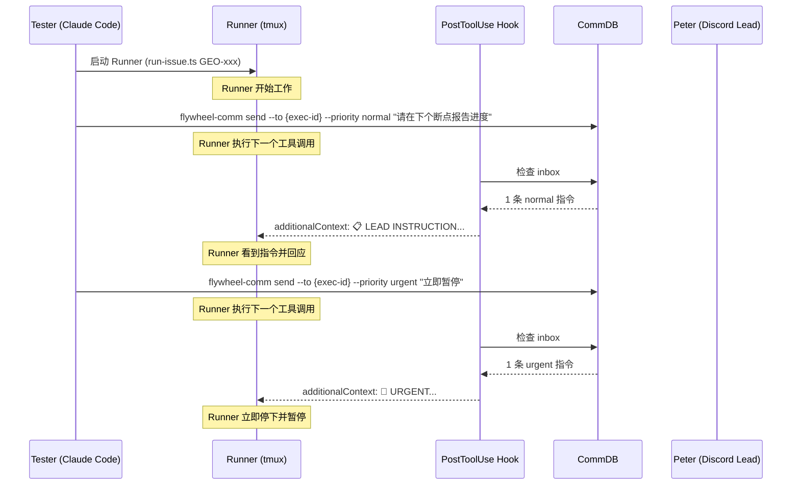

# Research: Runner Inbox PostToolUse Hook — GEO-266

**Issue**: GEO-266
**Date**: 2026-03-26
**Source**: `doc/exploration/new/GEO-266-runner-inbox-polling.md`

## 1. sqlite3 CLI 可用性

### macOS 内置
- **路径**: `/usr/bin/sqlite3`
- **版本**: 3.43.2 (2023-10-10)
- **WAL 支持**: 完全支持，`-readonly` flag 可用
- **并发安全**: WAL 模式专为并发读取设计。sqlite3 CLI 可以安全读取 better-sqlite3 正在写入的数据库

### Hook 脚本的 SQL 查询

**检查未读指令数量**:
```bash
sqlite3 -readonly "$DB_PATH" \
  "SELECT COUNT(*) FROM messages WHERE to_agent='$EXEC_ID' AND type='instruction' AND read_at IS NULL AND expires_at > datetime('now');"
```

**读取未读指令（含 priority）**:
```bash
sqlite3 -readonly "$DB_PATH" -json \
  "SELECT id, from_agent, content, priority FROM messages WHERE to_agent='$EXEC_ID' AND type='instruction' AND read_at IS NULL AND expires_at > datetime('now') ORDER BY CASE WHEN priority='urgent' THEN 0 ELSE 1 END, created_at ASC;"
```

**标记已读**（需要写权限，不能用 `-readonly`）:
```bash
sqlite3 "$DB_PATH" \
  "UPDATE messages SET read_at=datetime('now') WHERE to_agent='$EXEC_ID' AND type='instruction' AND read_at IS NULL;"
```

### Bash 引号注意事项
- SQL 内的单引号（`'instruction'`）在 bash 双引号字符串中安全
- `$EXEC_ID` 和 `$DB_PATH` 在双引号中正确展开
- **SQL 注入风险**: `EXEC_ID` 来自 TmuxAdapter 的环境变量（UUID 格式），不是用户输入，安全

## 2. TmuxAdapter 环境变量注入

### 当前注入方式

TmuxAdapter 通过 `tmux new-window -e` 注入环境变量到 Runner 进程：

```typescript
// TmuxAdapter.ts:126-141
const envArgs = this.hookServer && callbackToken
  ? ["-e", `FLYWHEEL_CALLBACK_PORT=...`,
     "-e", `FLYWHEEL_CALLBACK_TOKEN=...`,
     "-e", `FLYWHEEL_ISSUE_ID=...`]
  : [];

if (ctx.commDbPath) {
  envArgs.push("-e", `FLYWHEEL_COMM_DB=${ctx.commDbPath}`);
}
```

### 需要新增的注入

在 line 141（`FLYWHEEL_COMM_DB` 注入之后）追加：

```typescript
// GEO-266: Inject execution ID for inbox hook
envArgs.push("-e", `FLYWHEEL_EXEC_ID=${ctx.executionId}`);
```

**位置**: 无条件注入（不仅限 v0.2 mode），因为 inbox hook 在所有模式下都需要。

**`ctx.executionId` 可用性**: 在 `AdapterExecutionContext` 中定义（`adapter-types.ts:137`），已在 TmuxAdapter 多处使用（registerSession, heartbeat, updateSessionStatus, hasPendingQuestionsFrom）。

### 环境变量传播

`-e` flag 在 `tmux new-window` 上设置的环境变量会传递给 Claude CLI 进程。Claude CLI 进程的子进程（hooks）也会继承这些变量。这正是 hook 脚本需要的。

## 3. CommDB Priority 字段

### Schema 迁移

**现有迁移模式**（`db.ts:75-83`）：
```typescript
private applyMigrations(): void {
  const columns = this.db
    .prepare("PRAGMA table_info(messages)")
    .all() as Array<{ name: string }>;
  if (!columns.some((c) => c.name === "read_at")) {
    this.db.exec("ALTER TABLE messages ADD COLUMN read_at DATETIME");
  }
}
```

**新增 priority 迁移**（在 `read_at` 检查后追加）：
```typescript
if (!columns.some((c) => c.name === "priority")) {
  this.db.exec(
    "ALTER TABLE messages ADD COLUMN priority TEXT DEFAULT 'normal' CHECK(priority IN ('urgent','normal'))"
  );
}
```

注意：SQLite `ALTER TABLE ADD COLUMN` 不支持在旧行上回填 CHECK 约束校验。但 DEFAULT 'normal' 会让旧行在读取时返回 'normal'。

### 需要修改的文件列表

| 文件 | 修改点 | 说明 |
|------|--------|------|
| `flywheel-comm/src/types.ts` | Message interface | 添加 `priority: 'urgent' \| 'normal'` |
| `flywheel-comm/src/db.ts` | SCHEMA constant | 在 CREATE TABLE 中添加 priority 列 |
| `flywheel-comm/src/db.ts` | `applyMigrations()` | 添加 priority 列迁移 |
| `flywheel-comm/src/db.ts` | `insertInstruction()` | 添加 priority 参数 |
| `flywheel-comm/src/db.ts` | `getUnreadInstructions()` | ORDER BY urgent first |
| `flywheel-comm/src/commands/send.ts` | SendArgs + send() | 添加 priority 参数 |
| `flywheel-comm/src/index.ts` | runSend() | 添加 `--priority` CLI 参数 |
| `flywheel-comm/src/index.ts` | runInbox() | 输出中显示 priority |

### openReadonly 兼容性

`CommDB.openReadonly()` 跳过 schema/migration/purge，只做 readonly 打开。Hook 脚本使用 sqlite3 CLI 的 `-readonly` 也跳过这些。所以 priority 列的迁移只在正常 `new CommDB()` 时执行（由 send 命令或 TmuxAdapter registerSession 触发）。

## 4. Hook 脚本设计

### 完整脚本 (`~/.flywheel/hooks/inbox-check.sh`)

```bash
#!/bin/bash
# Flywheel Runner Inbox Check — PostToolUse Hook
# Checks CommDB for unread Lead instructions and injects them as additionalContext.
# No-op when FLYWHEEL_EXEC_ID is not set (safe for non-Runner sessions).
#
# Dependencies: sqlite3 (macOS built-in), jq (brew install jq)
# Env vars: FLYWHEEL_EXEC_ID, FLYWHEEL_COMM_DB (set by TmuxAdapter)

set -euo pipefail

EXEC_ID="${FLYWHEEL_EXEC_ID:-}"
DB_PATH="${FLYWHEEL_COMM_DB:-}"

# Quick exit for non-Runner sessions (zero overhead)
if [ -z "$EXEC_ID" ] || [ -z "$DB_PATH" ] || [ ! -f "$DB_PATH" ]; then
  exit 0
fi

# Check for unread instructions (read-only, no locking)
COUNT=$(sqlite3 -readonly "$DB_PATH" \
  "SELECT COUNT(*) FROM messages WHERE to_agent='$EXEC_ID' AND type='instruction' AND read_at IS NULL AND expires_at > datetime('now');" 2>/dev/null || echo "0")

if [ "$COUNT" -eq "0" ] 2>/dev/null; then
  exit 0
fi

# Read instructions with priority (urgent first)
MSGS=$(sqlite3 "$DB_PATH" \
  "SELECT CASE WHEN priority='urgent' THEN '🚨 URGENT' ELSE '📋 Normal' END || ' [' || from_agent || ']: ' || content FROM messages WHERE to_agent='$EXEC_ID' AND type='instruction' AND read_at IS NULL AND expires_at > datetime('now') ORDER BY CASE WHEN priority='urgent' THEN 0 ELSE 1 END, created_at ASC;" 2>/dev/null)

# Check if any urgent
HAS_URGENT=$(sqlite3 -readonly "$DB_PATH" \
  "SELECT COUNT(*) FROM messages WHERE to_agent='$EXEC_ID' AND type='instruction' AND read_at IS NULL AND priority='urgent' AND expires_at > datetime('now');" 2>/dev/null || echo "0")

# Mark all as read
sqlite3 "$DB_PATH" \
  "UPDATE messages SET read_at=datetime('now') WHERE to_agent='$EXEC_ID' AND type='instruction' AND read_at IS NULL;" 2>/dev/null

# Build additionalContext based on priority
if [ "$HAS_URGENT" -gt "0" ] 2>/dev/null; then
  HEADER="🚨 URGENT LEAD INSTRUCTION — STOP CURRENT TASK AND EXECUTE IMMEDIATELY"
else
  HEADER="📋 LEAD INSTRUCTION — Execute at next natural breakpoint"
fi

# Escape for JSON (newlines, quotes, backslashes)
ESCAPED_MSGS=$(printf '%s' "$MSGS" | jq -Rs .)

# Output JSON for Claude Code hook system
jq -n --arg header "$HEADER" --argjson msgs "$ESCAPED_MSGS" '{
  hookSpecificOutput: {
    hookEventName: "PostToolUse",
    additionalContext: ($header + "\n\n" + $msgs + "\n\nAfter processing these instructions, briefly acknowledge what you received and how you will act on them.")
  }
}'

exit 0
```

### 性能分析

| 场景 | 耗时 | 说明 |
|------|------|------|
| 非 Runner 会话 | <1ms | 环境变量检查后立即 exit |
| Runner, 无指令 | ~5ms | sqlite3 readonly COUNT 查询 |
| Runner, 有指令 | ~15ms | 3 次 sqlite3 调用（count + select + update） |

对比：Node.js `flywheel-comm inbox` 启动 ~200ms。sqlite3 CLI 方案快 10-40 倍。

### `jq` 依赖

脚本使用 `jq` 进行 JSON 构建和字符串转义。macOS 不自带 `jq`，但常见安装方式：
- `brew install jq`
- 或用 `python3 -c 'import json; ...'` 替代

**建议**: 在 setup skill 中检查 `jq` 可用性，如果没有就 `brew install jq`。

## 5. Settings.json Hook 注册

### 现有 PostToolUse hooks

```json
"PostToolUse": [
  {
    "matcher": "Bash",
    "hooks": [
      { "type": "command", "command": "codex-review-trigger.sh", "timeout": 10 },
      { "type": "command", "command": "codex-auth-trigger.sh", "timeout": 5 }
    ]
  },
  {
    "matcher": "*",
    "hooks": [
      { "type": "command", "command": "permission-logger.sh", "timeout": 3 }
    ]
  }
]
```

### 新增 hook 条目

在 PostToolUse 数组末尾追加：
```json
{
  "matcher": "*",
  "hooks": [
    {
      "type": "command",
      "command": "~/.flywheel/hooks/inbox-check.sh",
      "timeout": 5
    }
  ]
}
```

**matcher `"*"`**: 匹配所有工具调用。这样不论 Runner 执行什么工具（Bash, Write, Edit, Read...），hook 都会检查 inbox。

**timeout 5 秒**: 正常执行 <20ms，5 秒是安全上限。

**与现有 hooks 兼容**: 多个 PostToolUse hooks 按数组顺序执行，`additionalContext` 会被拼接。不冲突。

## 6. Setup Skill 结构

### 模板参考

`/setup-discord-lead` skill 位于 `.claude/commands/setup-discord-lead.md`，是 markdown 格式，包含分步指引。

### `/setup-flywheel-hooks` skill 设计

**文件**: `.claude/commands/setup-flywheel-hooks.md`

**功能**:
1. 检查 `jq` 可用性（如果没有，提示安装）
2. 创建 `~/.flywheel/hooks/` 目录
3. 写入 `inbox-check.sh` 脚本（从 Flywheel 仓库的模板复制或内联生成）
4. `chmod +x ~/.flywheel/hooks/inbox-check.sh`
5. 读取 `~/.claude/settings.json`
6. 在 PostToolUse 数组中添加 inbox-check hook（如果尚未存在）
7. 写回 `~/.claude/settings.json`
8. 验证：运行 hook 脚本确认正常退出

**幂等性**: 重复运行不会重复添加 hook 条目。通过检查 `inbox-check.sh` 路径是否已在 settings 中来判断。

## 7. Blueprint Prompt 简化

### 当前 prompt（Blueprint.ts:312-321）

```
Additionally, your Lead may send you proactive instructions.
Periodically check for instructions with
`node ${commCliPath} inbox --exec-id ${executionId}`.
Check at task boundaries...
```

### Hook 替代后

由于 hook 自动检查并注入，Runner 不再需要主动检查。可以简化为：

```
Your Lead may send you instructions during your session.
These will appear automatically as context after tool calls.
When you receive a Lead instruction:
- 🚨 URGENT: Stop current work immediately and execute the instruction
- 📋 Normal: Incorporate at the next natural breakpoint
Always acknowledge received instructions briefly.
```

这样 prompt 从 "告诉 Runner 去做一件事" 变成 "告诉 Runner 如何响应自动出现的指令"。

## 8. E2E 测试计划

### Peter 真实测试流程



### 验证点

1. **Hook 触发**: Runner 的 tool use 后确实运行了 inbox-check.sh
2. **Normal 指令**: Runner 在自然断点处理指令
3. **Urgent 指令**: Runner 立即停下当前工作
4. **空 inbox**: 无指令时 hook 无输出（不影响 Runner）
5. **Mark as read**: 同一指令不会重复注入

## 9. 风险和边缘情况

| 风险 | 缓解 |
|------|------|
| sqlite3 不在 PATH | setup skill 检查，提示安装 |
| jq 不可用 | setup skill 检查，提示 `brew install jq` |
| CommDB 被 better-sqlite3 锁定 | WAL 模式支持并发读；写操作 busy_timeout=5000ms |
| Hook 脚本超时（>5s） | sqlite3 查询 <20ms，几乎不可能超时 |
| 旧 CommDB 没有 priority 列 | sqlite3 查询会返回 NULL，脚本中 `CASE WHEN priority='urgent'` 对 NULL 返回 ELSE（normal） |
| FLYWHEEL_EXEC_ID 不是有效 UUID | 来自 TmuxAdapter 的 ctx.executionId，由 Blueprint 生成，始终是 UUID |
| 多条指令同时到达 | 全部读取、全部标记已读、全部注入——正确行为 |
