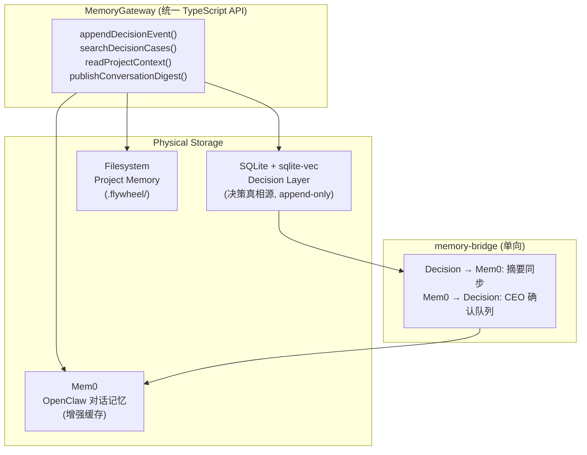

# Decision Layer: Cross-Reference Analysis

两份 deep research（Gemini Pro + ChatGPT Deep Research）对 Decision Layer 的核心方向高度一致，但在细节上各有侧重。以下是综合分析。

## 共识（两边都同意）

| Topic | Consensus |
|-------|-----------|
| **核心框架** | CIPHER/PRELUDE (NeurIPS 2024) — 从 CEO 决策中学习 preference rules |
| **存储** | SQLite (`better-sqlite3`) + `sqlite-vec` 做向量搜索 |
| **本地 embedding** | `@xenova/transformers` (transformers.js) — 零 API 成本 |
| **LLM 选型** | Haiku 做 classification/summarization（便宜、快） |
| **Hard rules** | 在 LLM 之前跑 deterministic guardrails（auth/billing → 强制 escalate） |
| **Progressive autonomy** | Observer → Advisor → Head of Product，逐步扩大自主权 |
| **不用 fine-tuning** | RAG/retrieval 比 fine-tuning 更适合（可删除 bad habits、无 catastrophic forgetting） |
| **架构** | Embedded in orchestrator（不建独立 microservice） |
| **审计** | Append-only 日志，可追溯每个 auto-decision 的依据 |

## 分歧与互补

### 1. Confidence Scoring

| Gemini | ChatGPT | 我们的选择 |
|--------|---------|-----------|
| **Dual-Gate**: vector distance > 0.35 → escalate; else Haiku score > 85 → auto-decide | **Composite**: `min(hard_gate, similarity, model_confidence)` + conformal prediction with reject option | **采用 Gemini 的 Dual-Gate 作为 MVP**，更简单。ChatGPT 的 composite 是 Phase 3 优化方向 |

### 2. Decision Record Schema

| Gemini | ChatGPT |
|--------|---------|
| 简洁：7 fields（id, timestamp, project, category, context, choice, outcome） | 详尽：嵌套结构含 evidence_refs, policy_context, model_context, outcome + followup |

**选择**: ChatGPT 的 schema 更 production-ready。采用其结构，但 Phase 1 只填必填字段，Phase 2+ 逐步丰富。

### 3. Summarization

| Gemini | ChatGPT |
|--------|---------|
| 直接喂 last 50 lines stdout/stderr + git diff 给 Haiku | **分层**: 1) 提取结构化事实 2) 分别总结各 artifact 3) 合成最终 brief |

**选择**: ChatGPT 的分层 pipeline 更省 token、更可控。Phase 2 采用。Phase 1 先用 Gemini 的简单方式。

### 4. Drift Detection

| Gemini | ChatGPT |
|--------|---------|
| 简单：`package.json` hash 变化 → 降低 confidence 30% | 系统化：override rate 监控 + novelty spikes + ADWIN 统计检测 + 自动 tighten thresholds |

**选择**: Phase 1 用 Gemini 的简单方式。Phase 3 加 ChatGPT 的系统化 drift monitoring。

### 5. Kill Switch

| Gemini | ChatGPT |
|--------|---------|
| 未特别强调 | **Day 1 必须有**: `autonomy_mode = MANUAL_ONLY` 命令，灵感来自 trading systems 的 kill switch |

**选择**: 采纳 ChatGPT — kill switch 从 Day 1 就做。简单（1 个 flag），但关键。

### 6. Negative Feedback

| Gemini | ChatGPT |
|--------|---------|
| **Revert 按钮** → `git revert` + 生成 Negative Constraint Rule | **Override as first-class interaction** + event-sourced outcome tracking（`REVERTED` status） |

**选择**: 两者互补。Revert 按钮（Gemini）+ event-sourced outcome（ChatGPT）一起做。

### 7. Cost Estimates

| Gemini | ChatGPT |
|--------|---------|
| ~$0.0005/decision (2000 tokens) | ~$0.002/decision (1100 input + 200 output) |

差异来自 context 量估算不同。实际成本在 $0.001-0.003 之间。**两者都确认：Decision Layer 成本可忽略**。

### 8. Risk Assessment

| Gemini (3 risks) | ChatGPT (6 risks) |
|-------------------|-------------------|
| Silent cascading fails | ✅ + max turns counter |
| Context window bloat | ✅ + hierarchical summarization |
| "Yes Man" drift | ✅ + time decay |
| | **+ Automation bias** (CEO rubber-stamps) |
| | **+ Security misclassification** (small change touches auth) |
| | **+ Inadequate auditability** |

**选择**: ChatGPT 的 risk assessment 更全面，全部采纳。

## Gemini 独有贡献

1. **Time Decay**: 60 天以上的 rules 做 vector distance 衰减 — 防止过时 preference 主导
2. **Cron-based digest**: 本地 cron job 定时汇总 — 实现简单
3. **Build order 更激进**: Phase 1.5 就开始 CIPHER learning

## ChatGPT 独有贡献

1. **Event Sourcing**: 强调 append-only event stream — 可重建"系统当时看到了什么"
2. **Conformal Prediction**: 形式化的 "predict or abstain" 框架 — Phase 3 可用
3. **Per-repo Policy Profiles**: 可编辑的 preference descriptors per repo — Phase 3
4. **Factory.ai's "Safe Autonomy Readiness Policy"**: 自主权应有显式 readiness rubric
5. **Kill Switch from Day 1**: 借鉴 trading systems
6. **Hierarchical Summarization Pipeline**: 更省 token，更可控

## 综合推荐：Build Order

### Phase 1: Observer (Week 1-2)
- SQLite (`better-sqlite3`) + ChatGPT 的 DecisionRecord schema（必填字段）
- Slack integration (Cyrus `slack-event-transport`)
- Haiku 做基本 summarization（Gemini 的简单方式：last 50 lines + diff）
- **Kill switch from Day 1** (ChatGPT)
- Hard rules: auth/billing/secrets paths → 强制 escalate
- Append-only event log（ChatGPT 的 event sourcing）

### Phase 1.5: Learner (Week 3)
- `sqlite-vec` + `@xenova/transformers` (local embeddings)
- CIPHER engine: 每个 manual decision 后 → Haiku 提取 preference rule → 存 embedding
- Time decay on old rules (Gemini)

### Phase 2: Advisor (Week 4-5)
- RAG pipeline: new decision → sqlite-vec top-3 → Haiku confidence score
- **Dual-Gate threshold** (Gemini): distance > 0.35 → escalate; else score > 85 → auto-decide
- Hierarchical summarization pipeline (ChatGPT)
- `[⏪ Revert]` 按钮 + negative constraint rule (Gemini + ChatGPT)
- Digest mode for non-urgent decisions

### Phase 3: Head of Product (Week 6+)
- Composite confidence (`min(hard_gate, similarity, model_confidence)`) (ChatGPT)
- Per-repo policy profiles (ChatGPT)
- Drift monitoring: override rate, novelty spikes, auto-tighten (ChatGPT)
- Expand safe envelope based on accumulated evidence

---

## Codex CLI Review — Memory Architecture Decision

Codex 读完所有 research docs 后给出的独立建议（与 Gemini 有分歧）。

### Codex vs Gemini 分歧

| 问题 | Gemini 建议 | Codex 建议 | **最终决定** |
|------|------------|-----------|-------------|
| sqlite-vec vs Mem0 | 用 Mem0 统一 AI memory | **保留 sqlite-vec** | **Codex — 保留 sqlite-vec** |
| 三层通信 | API-driven 双向 | **单向主从同步** | **Codex — 单向** |
| 统一方案 | Mem0 统一 | **MemoryGateway 逻辑统一、物理分层** | **Codex — MemoryGateway** |

### Codex 核心论点

1. **Decision Layer 的硬约束不适合 Mem0**
   - Structured records + append-only audit log + per-agent isolation = SQLite 事件溯源模型的强项
   - Mem0 适合对话偏好和 auto-recall，不适合决策判定
   - 把审计和聊天记忆混在一起 → 安全边界不清

2. **单向主从同步（非双向）**
   ```
   Project Memory (.flywheel) → Decision Layer (原始上下文输入)
   Decision Layer → Mem0/OpenClaw (只发脱敏摘要)
   Mem0/OpenClaw → Decision Layer (需 CEO 确认后才写入 append-only 事件表)
   ```

3. **MemoryGateway — 逻辑统一、物理分层**
   ```typescript
   // 上层只看到一个接口
   interface MemoryGateway {
     appendDecisionEvent(event: DecisionEvent): void;   // → SQLite
     searchDecisionCases(query: string): DecisionCase[]; // → sqlite-vec
     readProjectContext(path: string): ProjectContext;    // → Filesystem
     publishConversationDigest(digest: Digest): void;    // → Mem0
   }
   ```
   底层 3 个 adapter，各用最合适的存储。上层不关心物理存储差异。

4. **memory-bridge 单向设计**
   - Decision → Mem0：摘要同步（Mem0 知道最近做了什么决策）
   - Mem0 → Decision：**必须经过 CEO 确认队列**，不能直接写入决策库
   - 禁止 Mem0 存储可直接触发自动决策的"硬规则"

5. **落地建议**
   - `.flywheel/teams/<team>/memory/decision.db` — 每团队唯一决策库
   - `memory-bridge` 模块 — 只做单向摘要同步

### 最终 Memory 架构



---

## Sources

- [PRELUDE/CIPHER — NeurIPS 2024](https://arxiv.org/abs/2404.15269)
- [sqlite-vec](https://github.com/asg017/sqlite-vec)
- [Transformers.js](https://huggingface.co/docs/transformers.js)
- [Selective Classification](https://arxiv.org/abs/2212.03363)
- [Anthropic Pricing](https://platform.claude.com/docs/en/about-claude/pricing)
