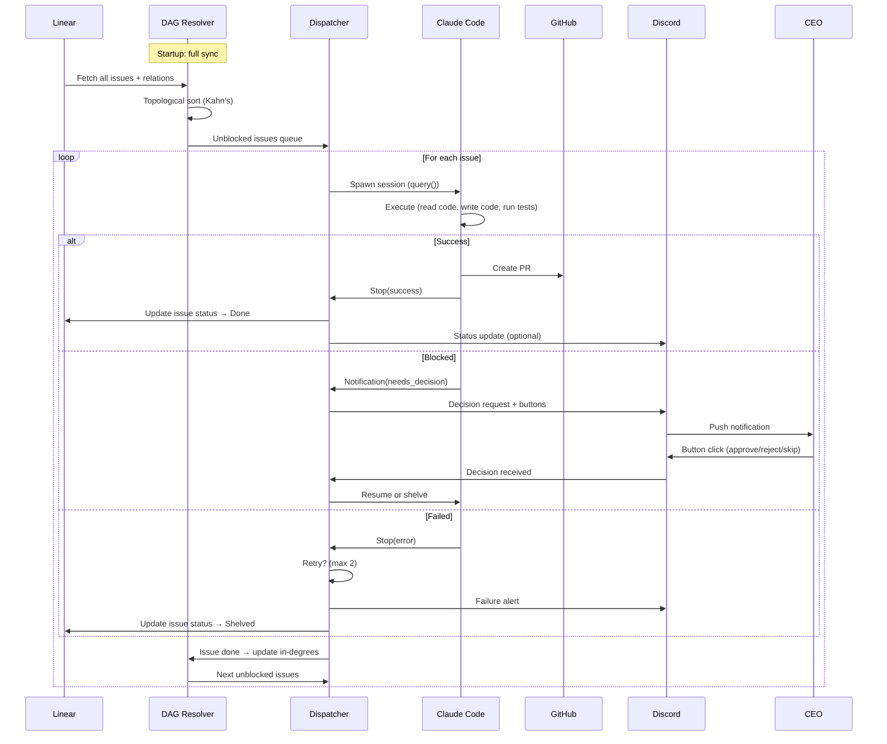

# Research: Flywheel Orchestrator

## Research Question

如何构建一个 TypeScript orchestrator，从 Linear 拉取 unblocked issues，按 dependency DAG 顺序自动执行 Claude Code sessions，auto-create PR，只在需要人决策时通过 Discord 通知？

## Executive Summary

- **Cyrus 是最佳起点** — Apache 2.0 模块化 TypeScript monorepo，clean interfaces (`IIssueTrackerService`, `IAgentRunner`, `IActivitySink`)，Linear + Claude Code 集成已 production-ready
- **核心缺失**: DAG resolver、Discord bot、full-auto loop — 都是增量添加，不需要改 Cyrus 核心架构
- **最重要的约束**: Claude Code Agent SDK 的 `query()` 是 long-running async generator，每个 session 独占一个 process；compaction 在 ~83.5% context window 时触发，可能丢信息
- **建议**: Fork Cyrus → 加 DAG module + Discord module + auto-loop controller。预计 2-3 周 MVP

## 1. Cyrus Source Code Evaluation

### Architecture

Cyrus 是 TypeScript monorepo（Apache 2.0），核心模块：

| Module | Role | 可复用性 |
|--------|------|---------|
| `IIssueTrackerService` | Linear issue CRUD + relation access | **直接用** — 已封装 issue fetch, status update, comment |
| `IAgentRunner` | Claude Code session lifecycle | **直接用** — spawn, monitor, kill sessions |
| `IActivitySink` | Event logging + notification routing | **扩展** — 加 Discord sink |
| Linear integration | OAuth + webhook + issue sync | **直接用** — production-tested |
| GitHub integration | PR creation + status checks | **直接用** |

### 关键发现

- **No DAG resolver** — 但 `IIssueTrackerService` 暴露了 issue relations（blocking/blocked-by），数据可达
- **Session management** — 用 `@anthropic-ai/claude-agent-sdk`，支持 session resume、hooks、budget control
- **Interactive approvals** — 当前通过 Linear comment 做 human-in-the-loop，我们需要改为 Discord
- **Clean interface boundaries** — 加新模块不需要修改现有核心代码

### Verdict: FORK

Cyrus 的架构足够灵活。我们 fork 后增量添加 DAG + Discord + auto-loop。不需要大改。

## 2. Claude Code Agent SDK

### Core API

```typescript
import { query, type SDKMessage } from "@anthropic-ai/claude-agent-sdk";

const messages: AsyncGenerator<SDKMessage> = query({
  prompt: "Implement feature X per the issue description...",
  options: {
    maxTurns: 50,
    maxBudgetUsd: 5.0,
    allowedTools: ["Read", "Write", "Edit", "Bash", "Grep", "Glob"],
    systemPrompt: "You are working on GeoForge3D...",
  },
});

for await (const message of messages) {
  // Handle: assistant, result, progress, notification, etc.
}
```

### Key Capabilities

| Feature | Detail |
|---------|--------|
| Headless mode | `query()` — no terminal UI, pure programmatic |
| Session resume | Pass `sessionId` to continue interrupted work |
| Hooks | 20 event types: `Notification`, `PostToolUse`, `PreToolUse`, `Stop` etc. |
| Tool control | `allowedTools` / `disallowedTools` — restrict agent capabilities |
| Budget | `maxBudgetUsd` — hard cost cap per session |
| Compaction | Auto at ~83.5% context window — external state files mitigate info loss |

### Orchestrator Integration Pattern

```
1. Fetch issue from Linear (title, description, acceptance criteria)
2. Compose system prompt with project CLAUDE.md + issue context
3. query() with budget cap + tool restrictions
4. Stream SDKMessage — watch for Notification (blocked/question) and Stop (done/error)
5. On success: create PR via GitHub API
6. On failure/blocked: notify via Discord, pause issue
7. On budget exceeded: shelve issue, notify
```

### Constraints

- **One session = one process** — no multiplexing within a single query() call
- **Compaction** — 长 session 会丢 context。Anthropic 建议：single-feature-per-session + external `progress.md`
- **No native DAG** — orchestrator 必须自己管 issue ordering

## 3. Linear API — Dependency Graph

### Issue Relations

Linear 原生支持 `blocks` / `blockedBy` 关系：

```typescript
// Via Linear MCP tool
const issue = await linear.getIssue({
  issue: "GEO-42",
  includeRelations: true
});
// issue.relations → [{ type: "blocks", relatedIssue: "GEO-43" }, ...]
```

### DAG Resolution Algorithm

Kahn's algorithm (topological sort)：

```
1. Fetch all issues in project (with relations)
2. Build adjacency list: issue → [issues it blocks]
3. Compute in-degree for each issue
4. Queue all issues with in-degree 0 (no blockers, not done)
5. Process queue: pick next → execute → mark done → decrement blocked issues' in-degree
6. Repeat until queue empty
```

### Rate Limits & Optimization

- **5000 requests/hour** — 足够（一次 full sync ~50 issues = 50 requests）
- **Webhooks available** — 增量更新，不需要每次 full poll
- **Batch strategy**: Full sync on startup → webhook for incremental → periodic full sync as safety net

### MCP vs REST

Linear MCP (32 tools) 可用但更适合 interactive use。Orchestrator 应该直接用 Linear TypeScript SDK (`@linear/sdk`) — type-safe、batch-friendly、webhook support。

## 4. Discord Bot

### Technology Choice

**discord.js v14** — TypeScript-native，最成熟的 Discord library。

### Integration Architecture

Bot 作为 orchestrator process 的一个模块（不是独立 service）：

```typescript
// In orchestrator main process
const discordBot = new DiscordNotifier({
  token: process.env.DISCORD_BOT_TOKEN,
  channels: {
    product: "channel-id-1",    // Product team notifications
    decisions: "channel-id-2",  // Human decision requests
  }
});

// When issue needs human decision
await discordBot.requestDecision({
  issueId: "GEO-42",
  question: "PR has merge conflicts. Resolve or skip?",
  options: ["Resolve", "Skip", "Shelve"],
});
```

### Message Types

| Type | Trigger | Format |
|------|---------|--------|
| **Decision request** | Claude Code blocked/needs approval | Interactive buttons (Approve/Reject/Skip) |
| **Status update** | Issue completed / PR created | Embed with issue link + PR link |
| **Failure alert** | Session error / timeout / budget exceeded | Embed with error detail + retry button |
| **Daily digest** | Scheduled (optional, Phase 2) | Summary of day's activity |

### Phase 1 Scope

- 1 bot, 1 channel (#flywheel)
- Decision request buttons + status updates
- No digest, no multi-channel routing (Phase 2)

## 5. Memory Isolation

### Filesystem-based Architecture (Phase 1)

```
~/.flywheel/
├── teams/
│   ├── product/
│   │   ├── memory/          # Team-isolated memory
│   │   │   ├── state.json   # Current execution state
│   │   │   ├── progress.md  # Running progress log
│   │   │   └── decisions/   # Past human decisions (for learning)
│   │   └── config.yaml      # Team-specific config
│   ├── content/             # (Phase 2)
│   └── marketing/           # (Phase 2)
├── shared/
│   ├── brand.md             # Brand guidelines
│   ├── roadmap.md           # Product roadmap
│   ├── standup/             # Cross-team standup notes
│   └── deps.json            # Cross-team dependency tracker
└── config.yaml              # Global config (Discord token, Linear API key)
```

### Access Control (enforced at orchestrator level)

```
Workers (Dev/QA Orchestrator):  READ/WRITE teams/{own-team}/memory/
Team Leads:                     READ/WRITE teams/{own-team}/memory/ + shared/
CEO (via Discord):              READ all (through bot queries)
```

### Why Filesystem over DB

- **Letta benchmarks**: 74% accuracy on LoCoMo — outperforms specialized memory tools
- **Anthropic pattern**: `progress.md` + `state.json` — proven in production harnesses
- **Git-friendly**: memory files can be version-controlled
- **Zero infrastructure**: no DB to maintain for MVP
- **Claude Code native**: agents already read/write files — memory is just "files in a known location"

## 6. Proposed Data Flow (Greenfield)

### Main Loop



### State Transitions (Issue)

```
Linear:Todo → Queued → Executing → PR_Created → Done
                ↑         ↓
                ← Retry ← Failed → Shelved
                          ↓
                       Blocked → Human decision → Executing / Shelved
```

## 7. Constraints and Non-Negotiables

| Constraint | Evidence | Impact |
|-----------|----------|--------|
| One Claude Code session per process | Agent SDK `query()` design | Sequential execution in Phase 1; parallel = multiple processes |
| Compaction loses context | Anthropic docs: ~83.5% threshold | Must use external state files (progress.md) for long tasks |
| Linear 5000 req/hr | Linear API docs | Not a bottleneck for ~50 issues |
| Discord rate limit: 50 req/sec | discord.js docs | Not a bottleneck for decision-only notifications |
| macOS only (Phase 1) | User decision: local Mac first | VPS migration needs Claude Code CLI installed remotely |
| Budget control critical | $50-100+/day possible | `maxBudgetUsd` per session + daily aggregate cap |

## 8. Recommendations for Planning

### Recommended Approach

**Fork Cyrus** → add 3 modules incrementally:

1. **DAG Module** (~200 LOC) — Kahn's algorithm over Linear issue relations
2. **Discord Module** (~300 LOC) — discord.js v14 bot with button interactions
3. **Auto-Loop Controller** (~150 LOC) — glue: DAG → dispatch → Claude Code → update → next

### Implementation Sequence

```
Week 1: Fork Cyrus, add DAG resolver, test with GeoForge3D Linear data
Week 2: Add Discord bot, wire up decision flow, auto-loop controller
Week 3: End-to-end test (Linear issue → Claude Code → PR → Discord notification)
```

### Verification Steps Plan Must Include

- [ ] DAG correctly resolves GeoForge3D's real dependency graph
- [ ] Claude Code session completes a real issue and creates a PR
- [ ] Discord notification fires on failure/blocked with working buttons
- [ ] Issue status updates back to Linear after completion
- [ ] Budget cap triggers correctly (test with $0.50 cap)
- [ ] Session resume works after interruption

### Risk Areas to Avoid

- **Don't build a UI** — Discord buttons are the UI
- **Don't build multi-team yet** — Phase 1 is Product team only, but directory structure supports isolation
- **Don't optimize for parallel** — sequential first, add parallelism only after MVP works
- **Don't replace Cyrus's Linear integration** — extend it, don't rewrite

## Open Questions for Human

1. **Cyrus fork vs npm dependency**: Fork the repo (full control, can diverge) or use as npm package (cleaner, but locked to their API)?
2. **GeoForge3D test scope**: Which 3-5 Linear issues should be the first test batch? Ideally a mix of simple + medium complexity with some dependency chains.
3. **Budget per issue**: What's the max USD per Claude Code session? ($2? $5? $10?)
