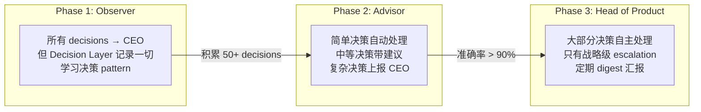
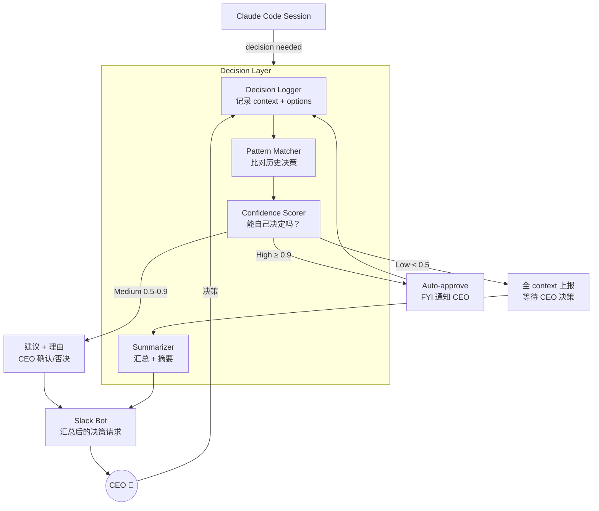
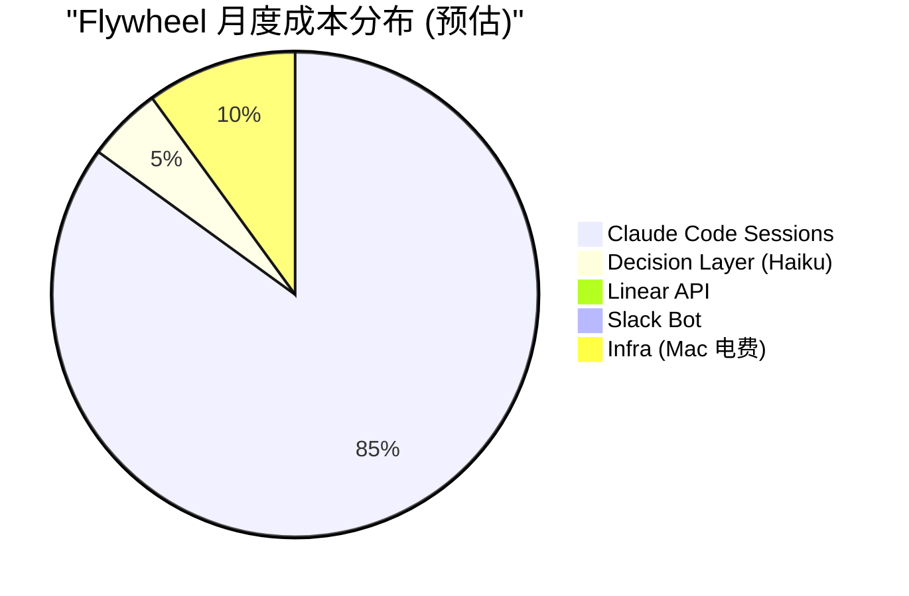

# Research Supplement: Gaps from 001

## 1. Cyrus Deep Evaluation — 到底要改多少？

### Source Code Structure (from GitHub API analysis)

Cyrus 是一个 pnpm monorepo，~280 个文件：

```
ceedaragents/cyrus/
├── apps/
│   ├── cli/           ← CLI 入口 (StartCommand, AuthCommand, etc.)
│   └── f1/            ← F1 test-drive app (assignIssue, startSession, etc.)
│
├── packages/
│   ├── core/          ← 核心抽象层
│   │   ├── CyrusAgentSession.ts
│   │   ├── PersistenceManager.ts
│   │   ├── StreamingPrompt.ts
│   │   ├── issue-tracker/
│   │   │   ├── IIssueTrackerService.ts    ← 关键 interface
│   │   │   ├── IAgentEventTransport.ts    ← 事件传输抽象
│   │   │   └── AgentEvent.ts
│   │   ├── logging/ (ILogger, Logger)
│   │   └── messages/ (IMessageTranslator, types)
│   │
│   ├── claude-runner/     ← Claude Code session 管理
│   ├── codex-runner/      ← OpenAI Codex runner
│   ├── cursor-runner/     ← Cursor runner
│   ├── gemini-runner/     ← Gemini runner
│   ├── simple-agent-runner/ ← 简化 runner
│   │
│   ├── edge-worker/       ← ★ 核心编排层
│   │   ├── EdgeWorker.ts
│   │   ├── AgentSessionManager.ts
│   │   ├── GitService.ts
│   │   ├── PromptBuilder.ts
│   │   ├── RepositoryRouter.ts
│   │   ├── RunnerSelectionService.ts
│   │   ├── ValidationLoopController.ts
│   │   ├── sinks/
│   │   │   ├── IActivitySink.ts          ← 扩展点：加 Discord sink
│   │   │   ├── LinearActivitySink.ts
│   │   │   └── NoopActivitySink.ts
│   │   └── prompts/subroutines/ (20+ .md 模板)
│   │
│   ├── linear-event-transport/   ← Linear webhook + 消息翻译
│   ├── github-event-transport/   ← GitHub webhook + PR 管理
│   ├── slack-event-transport/    ← Slack 集成
│   ├── cloudflare-tunnel-client/ ← webhook tunnel
│   ├── mcp-tools/                ← MCP 工具集成
│   └── config-updater/           ← 配置管理
│
├── skills/            ← AI agent skills (SKILL.md)
├── spec/              ← 架构文档
└── docs/              ← 部署文档
```

### 关键发现

1. **多 runner 支持**: Cyrus 不只支持 Claude Code — 还支持 Codex, Cursor, Gemini。`RunnerSelectionService` 动态选择 runner。这比我们需要的多，但不碍事。

2. **Edge Worker 是核心**: `packages/edge-worker/` 是真正的编排引擎 — 管理 session、构建 prompt、路由请求、验证结果。~50 个文件，是 Cyrus 最大的 package。

3. **Activity Sink 模式完美**: `IActivitySink` 是 notification 的抽象 — 当前只有 `LinearActivitySink` 和 `NoopActivitySink`。加 Discord sink 只需实现这个 interface。

4. **Event Transport 模式也对**: `linear-event-transport`, `github-event-transport`, `slack-event-transport` 各自独立。加 `slack integration (Cyrus 已有 slack-event-transport)` 是增量操作。

5. **确认无 DAG**: 没有任何 dependency resolution 逻辑。Linear 的 issue relations 被读取但不用于排序。

6. **No decision intelligence**: 所有 approval 都是 pass-through（Linear comment → 等人回复 → 继续）。没有学习、没有过滤。

### Fork vs NPM Dependency — 推荐 Fork

| Factor | Fork | NPM Dependency |
|--------|------|----------------|
| 修改 edge-worker 内部逻辑 | ✅ 直接改 | ❌ 无法改 |
| 加 DAG resolver | ✅ 作为新 package | ⚠️ 需要 monkeypatching |
| 加 Decision Layer | ✅ 在 sink 层扩展 | ⚠️ 受限于公开 API |
| 跟上游更新 | ⚠️ 需要 merge | ✅ 自动 |
| 维护成本 | 中 | 低 |

**Verdict**: Fork。我们需要改 edge-worker 的 session 调度逻辑（加 DAG ordering），这不是 plugin 能做的。Fork 后保持 upstream tracking，定期 cherry-pick 有用的更新。

### 改造量估算

| 操作 | 范围 | 预估 |
|------|------|------|
| **不改** (直接复用) | core/, claude-runner/, linear-event-transport/, github-event-transport/, config-updater/ | ~60% codebase |
| **删除** (不需要) | codex-runner/, cursor-runner/, gemini-runner/, slack-event-transport/, cloudflare-tunnel-client/, apps/f1/ | ~20% codebase |
| **修改** | edge-worker/ (加 DAG dispatch, Decision Layer hook) | ~15% codebase |
| **新建** | dag-resolver/, discord-transport/, decision-layer/ | ~5% 新代码 (~800-1200 LOC) |

**结论**: 80% 的 Cyrus 代码不需要碰。我们的工作集中在 3 个新 package + edge-worker 的调度逻辑改造。

---

## 2. Decision Layer — 不是 Bot，是会成长的决策伙伴

### Problem

> "我不想变成一个单纯回答问题的机器。"

如果 Discord bot 只是 pass-through（Claude Code 问什么，转发什么），CEO 还是瓶颈。只是把 "坐在 tmux 前" 换成了 "盯着 Discord"。

### 核心设计：Progressive Autonomy



### Architecture



### Decision Log Schema

每个 decision 记录为结构化 JSON，存在项目 memory 中：

```typescript
interface DecisionRecord {
  id: string;
  timestamp: string;
  issueId: string;              // Linear issue
  category: DecisionCategory;   // 'pr_review' | 'architecture' | 'scope' | 'error_handling' | ...
  context: {
    summary: string;            // 1-2 句概括
    codeChanges?: string;       // 涉及的改动
    testResults?: string;       // 测试结果
    riskLevel: 'low' | 'medium' | 'high';
  };
  options: string[];            // 可选方案
  decision: string;             // CEO 选了哪个
  reasoning?: string;           // CEO 的理由（如果有）
  outcome?: 'success' | 'reverted' | 'modified'; // 决策后续效果
  autoDecided: boolean;         // 是否自动决定的
  confidence?: number;          // 自动决定时的 confidence
}
```

### 学习机制 — CIPHER-inspired

参考 NeurIPS 2024 的 [PRELUDE/CIPHER](https://arxiv.org/abs/2404.15269) 框架：

1. **记录**: 每个 decision 连同 context 存入 decision log
2. **匹配**: 新 decision 来时，找 k 个最相似的历史 decisions（semantic similarity on context）
3. **推断**: 用 LLM (Haiku — cheap) 分析历史 pattern → 推断 CEO 会怎么选
4. **校准**: 定期比对自动决策 vs CEO 实际偏好，调整 confidence threshold

```
Decision 来了: "PR GEO-42 所有测试通过，是否 merge？"
  ↓
搜索历史: 找到 5 个相似 decision
  → 3 次 "测试全过 → CEO 选 approve"
  → 1 次 "测试全过但改了 auth → CEO 选 manual review"
  → 1 次 "测试全过 → CEO 选 approve"
  ↓
推断: 80% 概率 approve (但要检查是否涉及 auth/payment)
  → 不涉及 auth → confidence 0.92 → auto-approve
  → 涉及 auth → confidence 0.4 → escalate to CEO
```

### Key Design Principles

1. **先总结再问**: 不是把 Claude Code 的原始输出转发给 CEO。Decision Layer 会**概括 context、列出选项、给出建议**再发到 Discord。
2. **Batch + Digest**: 非紧急 decisions 可以攒起来，每小时发一个 digest（而不是每个 decision 一条消息）。
3. **Transparent learning**: CEO 可以看到 "我为什么自动做了这个决定" — 可解释性。
4. **Override always available**: CEO 随时可以 override auto-decisions，override 会被记录并用于调整未来行为。

### Token 成本

| 操作 | Model | Tokens/次 | 频率 | 月成本 |
|------|-------|-----------|------|--------|
| Decision classification | Haiku 4.5 | ~500-1000 | ~50/day | ~$2-5 |
| Context summarization | Haiku 4.5 | ~1000-2000 | ~20/day | ~$1-3 |
| Pattern matching (embedding) | Embedding API | ~200 | ~50/day | <$1 |
| **Decision Layer total** | | | | **~$5-10/month** |
| Claude Code sessions (对比) | Sonnet 4.6 | ~50K-200K | ~10/day | **~$100-300/month** |

**结论**: Decision Layer 的 token 成本是 Claude Code sessions 的 ~3%。用 Haiku 做 classification 极其便宜。

---

## 3. Memory Architecture — 每个项目存自己的

### 修正后的模型

之前的设计把 memory 集中在 `~/.flywheel/` — 错了。正确模型：

```
Flywheel (这个 repo)
├── src/                    ← orchestrator code
└── doc/                    ← framework 定义
    └── templates/
        ├── team-config.yaml.template
        └── memory-structure.md

GeoForge3D/ (项目 repo)
├── src/
├── .flywheel/
│   ├── config.yaml         ← 这个项目的 team 配置
│   ├── teams/
│   │   └── product/
│   │       ├── memory/     ← team memory (code decisions, build patterns)
│   │       └── decisions/  ← decision log (for learning)
│   └── shared/
│       └── brand.md        ← 项目级 shared context
└── .claude/memory/         ← Claude Code 的项目 memory（已有机制）

SimpleProject/ (简单项目)
├── src/
└── .flywheel/
    ├── config.yaml          ← 只有 product team
    └── teams/
        └── product/
            ├── memory/
            └── decisions/
```

### Flywheel 的角色

Flywheel 不存其他项目的 memory。它定义：
1. **Memory 目录结构** schema — `.flywheel/` 下该有什么
2. **Team config** format — 怎么定义 teams 和 orchestrators
3. **Decision log** schema — decisions 怎么记录
4. **Orchestrator code** — 读取这些配置、执行任务的程序

### Team 灵活性

```yaml
# GeoForge3D/.flywheel/config.yaml — 完整项目
project: geoforge3d
linear:
  team_id: "TEAM_xxx"
  labels: ["flywheel-ready"]  # 只处理标记过的 issues

teams:
  - name: product
    orchestrators:
      - type: dev
        runner: claude-code
        budget_per_issue: 5.00
      - type: qa
        runner: claude-code
        budget_per_issue: 2.00
  - name: content
    orchestrators:
      - type: writing
        runner: claude-code
        budget_per_issue: 3.00

decision_layer:
  autonomy_level: observer    # observer → advisor → autonomous
  digest_interval: 60         # minutes
  escalation_channel: slack
```

```yaml
# SimpleProject/.flywheel/config.yaml — 简单项目
project: simple-project
linear:
  team_id: "TEAM_yyy"

teams:
  - name: product
    orchestrators:
      - type: dev
        runner: claude-code
        budget_per_issue: 3.00

decision_layer:
  autonomy_level: observer
  escalation_channel: slack
```

**原则**: 不同项目、不同 team 结构。Flywheel 读 config 即可，不硬编码。

---

## 4. Token Cost Model — 钱花在哪里

### 成本构成



### 详细估算 (基于 10 issues/day)

| Component | Model | Cost Driver | Monthly |
|-----------|-------|-------------|---------|
| Claude Code Sessions | Sonnet 4.6 | ~$3-10/issue × 300 issues | $900-3000 |
| Decision Layer | Haiku 4.5 | classification + summarization | $5-10 |
| Slack Bot | N/A | discord.js, no AI | $0 |
| Linear API | N/A | REST calls, free tier | $0 |
| GitHub API | N/A | PR creation, free tier | $0 |
| **Total** | | | **$900-3000** |

### 优化手段

1. **Budget cap per session**: `maxBudgetUsd: 5.00` — 防止 runaway session
2. **Daily aggregate cap**: 每天最多 $X — 超过就停止 dispatch
3. **Issue complexity scoring**: 简单 issue 用 Haiku 而非 Sonnet
4. **Prompt caching**: Agent SDK 自动 cache，repeat context 只花 10% token
5. **在电脑前 vs 不在**:
   - 在电脑前 → orchestrator 仍然跑，但 decisions 直接弹 terminal notification（不经 Discord）
   - 不在电脑前 → decisions 经 Decision Layer 汇总后发 Discord

### "在电脑前" vs "不在电脑前" 模式

```yaml
# Mode: present — CEO 在电脑前
notification:
  channel: terminal      # 本地 notification
  decision_layer: bypass # 直接问，不经 AI 过滤
  batch: false           # 实时推送

# Mode: away — CEO 离开
notification:
  channel: discord
  decision_layer: active  # AI 过滤 + 汇总
  batch: true             # 攒起来每 30-60 min 发一次
```

CEO 可以通过 Discord command 切换模式：`/flywheel mode present` / `/flywheel mode away`

---

## 5. Implementation Phasing — 分几次做完

### Phase 1: Core Loop (Week 1-2)

```
目标: 一个 issue 从 Linear → Claude Code → PR 能跑通
─────────────────────────────────────────────────
1. Fork Cyrus, 清理不需要的 runners
2. 实现 DAG resolver (新 package)
3. 修改 edge-worker 的 dispatch 逻辑 (用 DAG ordering)
4. 端到端测试: 1 个 GeoForge3D issue
```

### Phase 2: Decision Loop (Week 3)

```
目标: Claude Code 遇到问题时能通知 CEO 并等待决策
────────────────────────────────────────────────────
1. 实现 slack integration (Cyrus 已有 slack-event-transport) (新 package)
2. 实现 Decision Logger (记录所有 decisions)
3. Wire up: Claude Code blocked → Discord notification → CEO responds → resume
4. 端到端测试: blocked issue → Discord → resume
```

### Phase 3: Auto-Loop + Memory (Week 4)

```
目标: 连续处理多个 issues，不需要人启动
─────────────────────────────────────────
1. Auto-loop controller: issue done → DAG update → next issue
2. Per-project memory (.flywheel/ structure)
3. Present/Away mode switching
4. 端到端测试: 3-5 个 GeoForge3D issues 连续执行
```

### Phase 4: Decision Intelligence (Week 5-6)

```
目标: Decision Layer 开始学习 CEO 的决策 pattern
────────────────────────────────────────────────
1. Decision classification (Haiku)
2. Pattern matching on historical decisions
3. Confidence scoring + auto-approve
4. Digest mode (batch notifications)
5. CEO dashboard: 查看 auto-decisions + override
```

### Phase 5: Multi-Team (Week 7-8, optional)

```
目标: 支持多个 team（Content, Marketing）
───────────────────────────────────────────
1. Team config per project
2. Memory isolation enforcement
3. Cross-team shared memory
4. Standup room (Team Leads sync)
```

---

## 6. Updated Open Questions

### From 001 (carried over)

1. ~~**Cyrus fork vs npm dependency**~~ → **Resolved: Fork** (see section 1)
2. **GeoForge3D test batch**: 哪 3-5 个 Linear issues 做首批测试？理想：有依赖关系的一组
3. **Budget per issue**: 建议 $5 default，$10 for complex issues — CEO 确认？

### New from 002

4. **Decision Layer Phase 1 scope**: 一开始就做 summarization（不只是 pass-through）？还是先 pass-through，Phase 4 再加 intelligence？
5. **Present/Away mode**: 需要吗？还是永远走 Discord？
6. **Digest frequency**: 多久汇总一次非紧急 decisions？30 min? 1 hour?
7. **Decision confidence threshold**: 自动决策从多高的 confidence 开始？建议 0.95（保守）。
8. **Cyrus upstream tracking**: Fork 后多久 sync 一次上游更新？建议 monthly check。

---

## 7. Notification Channel — Discord → Slack

### Decision: 用 Slack 替代 Discord

| Factor | Discord | Slack | Winner |
|--------|---------|-------|--------|
| Cyrus 集成 | ❌ 需从零建 | ✅ `slack-event-transport` 已有 | Slack |
| OpenClaw 支持 | ✅ | ✅ (via Bolt SDK) | 平 |
| Thread (多 decision 对应) | 能用但非核心 | ✅ 原生强项 | Slack |
| 免费额度 | 无限历史 | 90 天历史 | Discord |

**Rationale**: OpenClaw 同时支持 Discord 和 Slack（[docs](https://docs.openclaw.ai/channels/slack)），所以不存在兼容性问题。Cyrus 已有 `slack-event-transport`，省去从零建 transport 的工作。Slack thread 天然解决多 decision 对应问题。

### Notification Stack

```
Orchestrator (Cyrus fork)
  ↓ decisions (via slack-event-transport)
Decision Layer (Haiku classification + summarization)
  ↓ structured messages
Slack
  ↕ OpenClaw (via Slack Bolt) — LLM 大脑，预处理 + 对话式交互
  ↓
CEO 📱
```

Decision Layer 和 OpenClaw 的分工：
- **Decision Layer**: dev-specific 决策过滤（测试结果分析、PR 评估、issue 分类）
- **OpenClaw**: 通用 AI assistant（对话式交互、跨领域问题、personal preferences）
- 后期可能合并为一层

---

## 8. Multi-Runner Strategy (Phase 2+ research)

### Insight

Cyrus 的 `RunnerSelectionService` 已支持按 issue 类型选择不同 runner：

| Runner | 擅长 | 适用场景 |
|--------|------|---------|
| Claude Code (`claude-runner`) | 推理、规划、multi-step | PM 角色、架构决策、complex issues |
| Codex (`codex-runner`) | 纯编码、速度快 | 明确的 coding tasks |
| Gemini (`gemini-runner`) | 视觉、design | UI/UX 相关 issues |

### Current vs Future

- **Phase 1**: 所有 issues → Claude Code（简单、验证流程）
- **Phase 2+**: Orchestrator 按 issue type/label 分配不同 runner
  - Label `type:coding` → Codex
  - Label `type:design` → Gemini
  - Label `type:planning` 或无 label → Claude Code

### Open Question

现在的做法（Claude Code 内部 delegate to Codex/Gemini）vs orchestrator 直接分配 — 哪个更好？
- 内部 delegate: 更灵活，Claude Code 自己判断
- 直接分配: 更便宜，跳过中间层
- 待 Phase 2 实测比较

---

## 9. Screenshot Capability

### Requirement

Decision Layer 在需要 CEO 做决策时，应能在 local 截图作为 context：
- 打开网页截图（PR diff, test report, deployment preview）
- 文件预览截图
- Terminal output 截图

### Implementation

- 使用 Playwright (headless browser) 截图
- 截图上传到 Slack（Slack 原生支持图片 embed）
- 可选: Claude Code 的 `mcp__plugin_playwright_playwright__browser_take_screenshot` 工具

### Phase

Phase 2-3。Phase 1 先纯文本通知。

---

## Sources

- [Cyrus GitHub](https://github.com/ceedaragents/cyrus)
- [Cyrus Website — Linear Integration Guide](https://www.atcyrus.com/stories/linear-claude-code-integration-guide)
- [PRELUDE/CIPHER — Learning Latent Preference from User Edits (NeurIPS 2024)](https://arxiv.org/abs/2404.15269)
- [Agent SDK Session Management](https://platform.claude.com/docs/en/agent-sdk/sessions)
- [Claude Code Pricing](https://code.claude.com/docs/en/costs)
- [Claude API Pricing](https://platform.claude.com/docs/en/about-claude/pricing)
- [Few-Shot Preference Learning for Human-in-the-Loop RL](https://arxiv.org/abs/2212.03363)
- [OpenClaw — Slack Channel Docs](https://docs.openclaw.ai/channels/slack)
- [OpenClaw GitHub](https://github.com/openclaw/openclaw)
- [OpenClaw — All Chat Channels](https://docs.openclaw.ai/channels)
