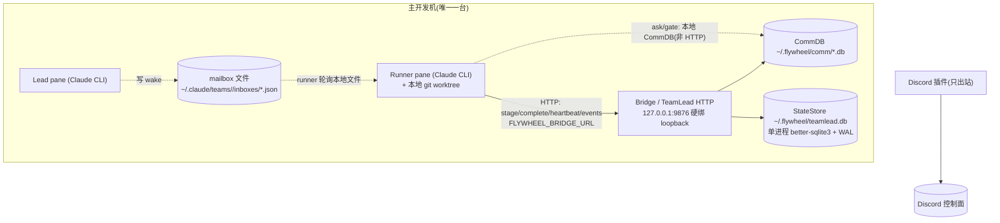
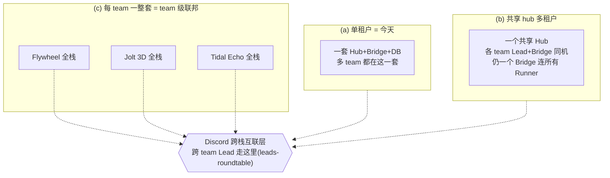
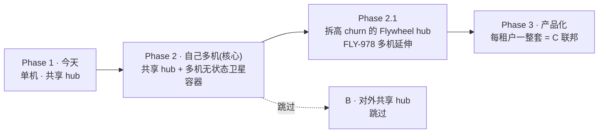
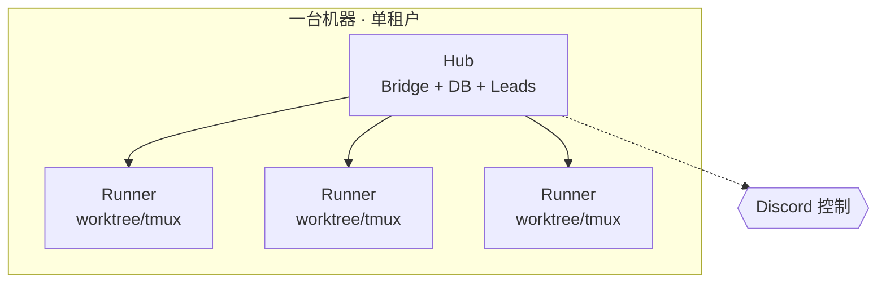
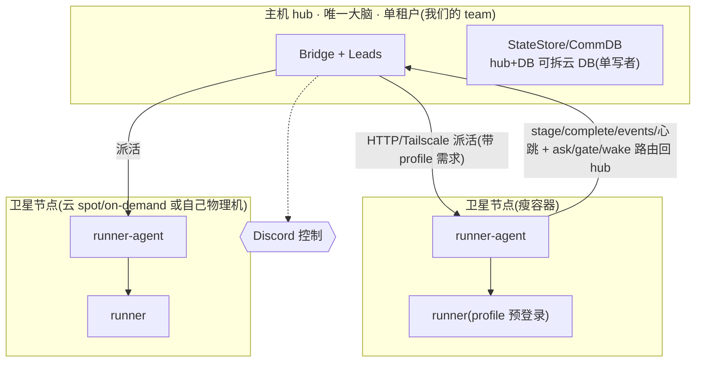
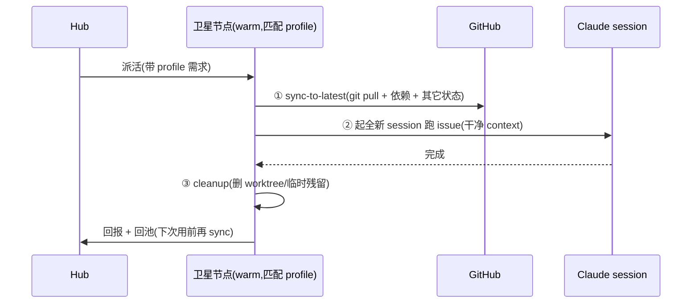
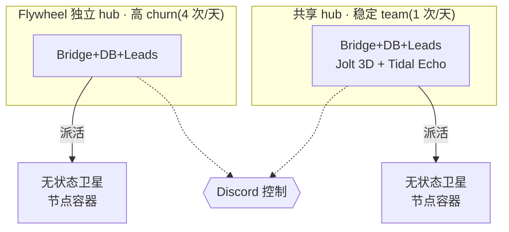
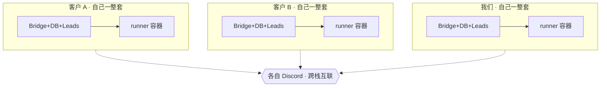

# FLY-1005 多机部署 (multi-machine) — PRD(详细版)

Issue: FLY-1005 (https://linear.app/geoforge3d/issue/FLY-1005/多机部署-multi-machine-runner-分散到多台机器跑-research-prd)
日期: 2026-07-08
基于: product/doc/FLY-1005-multi-machine-runners/{exploration,research,plan}.md(research + 与 Annie 10 轮 co-eval 收敛,v1-v10 全部讨论)

> **本 PRD 目标:详实到 eng 照着能建**(Annie 红线:PRD 要最详细、不是摘要)。把 v1-v10 co-eval 的全部讨论搬进来。凡未定处标 [OPEN Dx];凡不做处入 §12 非目标。中文 body,技术词/命令保留英文。

---

## 0. 目录

1. 命题与背景(含现状架构 3 锚点)
2. 多租户模型 A/B/C(背景)
3. 联邦 vs 非联邦 + C=productization
4. 分阶段路线总览
5. Phase 1 详细(今天)
6. Phase 2 详细(自己多机 · 核心 · 最详)
7. Phase 2.1 详细(拆高 churn 的 Flywheel hub)
8. Phase 3 详细(产品化 = C 联邦)
9. 为什么跳过 B
10. Success Metrics
11. Open Questions
12. 非目标
13. 依赖 / 关联
14. Build-issue 拆分(11 个,每个 scope/验收/依赖)

---

## 1. 命题与背景

### 1.1 命题(Annie 校正)

1005 **不是**「多机值不值得 / 内存怎么治」—— 换大机(纵向 vertical scale)已单独做完(FLY-751/753),且有天花板 + 单点。**1005 = multi-machine 本身:横向扩展(horizontal scale)→ 无上限,并作为「可移植/可部署产品」(FLY-648)的前置。**

- **纵向 vs 横向:** 纵向 = 一台机器堆更大 RAM(有天花板、单点、已做);横向 = 多台机器 + 弹性开云节点(无上限、失败域隔离)= 本 issue。
- **额度澄清:** Claude 额度是 per-账号(同账号无论几台机都是同一 5h/7d 滚动上限);**多机加的是算力/节点,不加额度**。额度到顶是加账号 / codex multi-account fallback(已有),别让多机背这个锅。
- **横向的红利(非命题但真实):** 爆炸半径隔离(一台崩不再全崩)+ 异构/隔离放置(对外 agent 单独节点)。

### 1.2 现状架构:3 个硬单机锚点(codebase 已核)

- **锚点 A — Bridge 硬绑 loopback。** `packages/teamlead/src/config.ts:9,25-28`:`ALLOWED_HOSTS = {127.0.0.1, localhost, ::1}`,非 loopback `TEAMLEAD_HOST` 直接 throw;默认端口 9876。**且不止一处**:`Blueprint.ts:476-499` 的 `resolveBridgeUrl()` 在 host 非 loopback 且无显式 `TEAMLEAD_URL` 时拒绝推导 Bridge URL。→ 另一台机的 runner 现在根本连不到 Bridge。刻意的安全设计(Bridge 有强能力 `/api/actions/*` + 无鉴权 `/actions` dashboard 别名)。
- **锚点 B — StateStore 单进程本地 SQLite。** `StateStore.ts:620,679-690` + `config.ts:103-105`:DB 文件 `~/.flywheel/teamlead.db`,`better-sqlite3` + WAL,由那一个 Bridge 进程独占。fleet 唯一权威状态。CommDB / cipher.db / claims.db / token-usage.db 同为 `~/.flywheel/*` 本地文件。
- **锚点 C — runner 本地 tmux + 本地盘 + 本地文件唤醒。** spawn:`TmuxAdapter.ts:1165,1179` shell `tmux new-session -d`;worktree 本地盘;唤醒:`wake.ts:57-116` `wakeRunnerMailbox` 从本地 CommDB 取身份后写 `~/.claude/teams/<lead>/inboxes/<agent>.json`,runner 轮询本地文件。

### 1.3 已经跨机友好的(好消息)

- **出站控制面已是 HTTP(半 HTTP,重要澄清):** `TmuxAdapter.ts:385-411` 注入 `FLYWHEEL_BRIDGE_URL` + `FLYWHEEL_INGEST_TOKEN`。**已走 HTTP**:`stage`(`stage.ts:171-240`)、`complete`(`complete.ts:147-224`)、heartbeat、`gate` 辅助 best-effort 事件(`gate.ts:276-369`)—— POST 到 Bridge `/events`,鉴权用 `FLYWHEEL_INGEST_TOKEN`。**仍是本地**:`ask` 写本地 CommDB(`ask.ts:22-28`)、`gate` 核心问答轮询本地 CommDB(`gate.ts:97-119,174-193`)、mailbox wake 身份来自本地 CommDB。→ **「改个 URL 就能跨机」是错的**,ask/gate/wake 必须补路由(§6.3 锚点 C)。
- **token 两侧、名字不同(别配错):** hub/Bridge 端从 **`TEAMLEAD_INGEST_TOKEN`** 读 `config.ingestToken`,`/events` 用它做 `tokenAuthMiddleware`(`config.ts:106`、`plugin.ts:1023-1026`);spawned runner 拿**同一密钥**注入成 **`FLYWHEEL_INGEST_TOKEN`**(`Blueprint.ts:1706-1707` → `TmuxAdapter.ts:406-411`)。**hub 只配 `FLYWHEEL_INGEST_TOKEN` 则 `/events` 仍无鉴权。** `/api/*`(含 `/api/actions`)用 **`TEAMLEAD_API_TOKEN`**,且 `tokenAuthMiddleware` 未配 token 时 **no-op 放行**(`plugin.ts:609-618`)。
- **Discord 已解耦:** Bridge 只出站连 Discord,不需要公网入站;每台机器可独立连 Discord。Annie「Discord=集中控制」前提成立。
- **Tailscale 已有先例:** `SlackInteractionServer.ts:17-42` 绑 0.0.0.0 且注释「needs external access via Tailscale Funnel」。
- **transport 有抽象:** `AgentTeamTransportFactory.forBackend(...)` 目前支持 `claude-code` / `codex`(`agent-team-transport/src/AgentTeamTransportFactory.ts:23,81-96`);no-transport 在 `role-adapter-resolver.ts` / `run-dispatcher.ts` 解析。加远程 runner 时决定:新 transport backend / runner-agent adapter / admission 层。
- **heartbeat 已有:** FLY-172 runner heartbeat + orphan reconcile(客户端 `TmuxAdapter.ts:57,592-593`;服务端 `StateStore.ts:3076-3088`、`HeartbeatService.ts`、`event-route.ts:424-437`)。
- **homerail 验证:** homerail(GitHub xiaotianfotos/homerail)= 有状态 `Manager`(hub,默认绑 127.0.0.1,同一 loopback 直觉)+ `Node`(每台起 Docker Worker)+ 无状态 `Worker`(容器,callback URL 回连)。跟本 PRD 的 hub/runner-agent/无状态容器 runner 完全一个套路 = 产品级存在性证明。

---

## 2. 多租户模型 A/B/C(背景)

「team」= 租户(真实例:Flywheel / Jolt 3D(GeoForge3D)/ Tidal Echo / 以后给别人用)。

- **(a) 单租户** = 今天(多 team 概念但全在一套 hub 上);最简单。
- **(b) 共享 hub 多租户** = 各 team 的 Lead+Bridge 跑在同一容器/机器,所有 Runner 共用这个 hub、经它通信(**仍一个 Bridge 连所有 Runner**,Annie 理解正确);省资源但 hub 要做多租户鉴权/隔离、一崩全崩、安全最难。
- **(c) 每 team 自己一套** = 每 team 独立 Bridge+DB+专属 Runner 容器 = **team 级联邦**;隔离最干净、契合 FLY-648。
- **跨 team Lead 通信:** 所有方案 UI 都落 Discord → **Discord 就是跨栈互联层**;C 里各 team 互不直连,跨 team Lead 通信走 **Discord 共享层**(如 leads-roundtable)。

---

## 3. 联邦 vs 非联邦 + C = productization

| | 非联邦(单 hub + 无状态节点) | 联邦(每 team/租户各自完整) |
|---|---|---|
| 本质 | 一个大 fleet 摊在多节点 | N 个独立 fleet,Discord 聚合 |
| 弹性/无上限 scale | ✓ 强(轻量无状态节点、可池化、scale-to-zero) | ✗ 弱(每个是完整重实例,不能跨实例借算力) |
| 隔离 | 节点崩 hub 重派 | ✓ 天然完全隔离 |
| 复杂度 | 要破 3 锚点 + 跨机路由 | ✓ 极简(每台=今天单机,复制即可) |
| 多租户/给别人 | hub 要做多租户(难) | ✓ 天然(每 team 一套=FLY-648) |

**推荐(分层组合,非二选一):**
- **一个 team 内部要 scale → 非联邦(单 hub + 无状态节点)。** 只有它给「一个 fleet 弹性、无上限」= 1005 目标。→ **这是 Phase 2 主线。**
- **跨 team / 多租户 / 给别人用 → 联邦(每 team 一套 = C)。** = Annie 最早直觉、且对;隔离最干净。→ **这是 Phase 3。**
- **⭐ C = 联邦 = productization(FLY-648):容器化 = 让 C 规模化 provision 的手段**(每客户自动开一套容器化完整栈,「容器打包整套环境」正是给别人用更简单的关键)。

---

## 4. 分阶段路线总览

**Container = 贯穿 Phase 2/2.1/3 的 must-have**;Phase 2 的容器化 = Phase 3 产品化的种子,按「谁最需要独立先拆」逐步推进。

---

## 5. Phase 1 详细(今天)

- **形态:** hub(Bridge+DB+Leads)+ 所有 runner 都在这一台机器(worktree/tmux);内部多 team(Flywheel / Jolt 3D / Tidal Echo)共享这一套 hub;Discord 控制。
- **delta:** 起点,没有上一阶段。
- **瓶颈:** 单机容量(内存,每 runner ~1.3-1.4GB,48GB host ~15-22 session 饱和,见 FLY-751/753)+ 单点(一台崩全崩;nightly load 过载 / WindowServer panic)。

---

## 6. Phase 2 详细(自己多机 · 核心 · 最详)

> **原则:hub 是唯一大脑,卫星节点是无状态执行器;所有跨机只走 HTTP over Tailscale;刻意不做跨机 StateStore 强一致(无状态才敢弹性开关节点)。**

### 6.1 拓扑

### 6.2 单 hub(Bridge+DB+Leads · hub+DB 可拆云 · 单写者)

- **hub = 唯一大脑:** Bridge + StateStore + 所有 Leads 留 hub(或若干 Lead,但 state 单一权威)。
- **hub 在不在容器 = 部署选择,非必须:** 云上 hub 放容器最自然(当服务部署、好搬好重启);家里主机可裸进程。关键是 hub 唯一。
- **hub↔hub 通信:** 节点/runner → hub 走 HTTP(现成 `/events`);唤醒(hub→节点)现走文件、要改走网络。**[OPEN] 可选加 WebSocket 做实时 push**(homerail 用 WS 做 Manager↔Worker),省轮询;起步 HTTP 够用。
- **⭐ Hub+DB 一体 vs 分离(单写者不变):** 「不跨机共享 DB」**只指「不做多个 hub 写同一个 DB」**(=分布式一致性大坑:选主/锁/防撞)。**一个 hub + 一个独立/云 DB 仍是单写者、无共识问题** —— Annie「DB 分离」直觉对。
  - 一体(hub 进程内 SQLite,今天):简单、快、无网络往返;但 DB 跟 hub 同生共死、绑那台机、不好备份/接管。
  - 分离(hub + 独立/云 DB):DB 独立存活(hub 崩状态还在)、托管备份、可做 hub 接管(HA)、状态不绑机;代价=多一跳网络延迟 + SQLite→Postgres 迁移 + 多一服务/成本。
  - **建议:Phase 2 起步用一体 SQLite(简单够用),自然子步把 hub+DB 拆成独立/云 DB**(独立存活/备份/接管;也让 hub 更接近无状态、好搬)。单写者不变 → 不碰一致性坑。[OPEN 拆云 DB 时机 + 迁移成本]

### 6.3 要破的 3 个锚点

**锚点 A — Bridge 暴露(3 步 + 安全合同):**
- 3 步:① Bridge 绑/暴露到 Tailscale 内网;② **在 spawn 侧(Bridge/Blueprint/runner-agent)设 `TEAMLEAD_URL`(或直接传 `bridgeUrl`)** → Blueprint.resolveBridgeUrl 算 `ctx.bridgeUrl` → TmuxAdapter 注入 runner 的 `FLYWHEEL_BRIDGE_URL=<hub tailnet>`(runner runtime 不直接读 `TEAMLEAD_URL`);③ 保留本地默认安全兜底(Blueprint 现拒非 loopback 推导)。
- **安全合同(硬要求,不能只靠 loopback 假设):**
  - 多机模式必须 **fail-start** 除非 **hub 端 `TEAMLEAD_INGEST_TOKEN`**(+ 需要时 `TEAMLEAD_API_TOKEN`)已配 —— 现状无 token 时 `tokenAuthMiddleware` no-op 放行(`plugin.ts:609-618`);hub 只配 runner 侧 `FLYWHEEL_INGEST_TOKEN` 无效(`/events` 读 `TEAMLEAD_INGEST_TOKEN`)。
  - 只暴露卫星需要的端点(`/events`/heartbeat + dispatch/wake 收口),经反代 path allowlist;**`/actions` 无鉴权 dashboard + 宽 `/api/*` 保持 loopback-only**(它们当前靠「只在 loopback」才不加 Bearer)。
  - 强能力路由(`/api/actions/*`、close-runner)风险边界要 Codex/安全过(FLY-175 founder-consent 是一层防护);多机模式下考虑进一步收紧到 hub-local 触发。
- **[OPEN D1]** (a) 放宽 loopback + token vs (b) tailnet 反代?倾向 (b)(改动小、Bridge 零改、反代做认证+allowlist),要 spike。

**锚点 B — StateStore 不硬解、绕过:** StateStore/CommDB/audit db 全留 hub,卫星零权威状态;卫星的状态变更全走 HTTP 到 hub → 天然无需跨机 DB。**这是避开分布式一致性泥潭的关键决定。**

**锚点 C — 卫星 spawn + ask/gate/wake 路由回 hub(Phase 2 主要工程量,一等公民):**
- 现状:`ask` 写本地 CommDB、`gate` 轮询本地 CommDB、mailbox wake 身份来自本地 CommDB;卫星默认没有 hub 的 CommDB。
- **[OPEN D6]** 二选一:(a) 卫星的 ask/gate 走 HTTP 到 hub 的 CommDB(runner 侧 CLI 加 --bridge-url 路由 + hub 侧收口;倾向,与出站同姿态,hub 仍唯一 CommDB 权威),或 (b) 给卫星一份可路由 comm 视图。
- **wake:** hub 判目标 runner 在哪台 node → 经 HTTP 发给该 node 的 runner-agent → agent 写卫星本地 inbox 文件。transport 抽象是 seam(forBackend 目前只 claude-code/codex),**新增 remote-http transport 或走 runner-agent adapter**(需 spike 决定)。
- **relay:** Runner↔Lead↔founder 的 relay(FLY-605)同理走 hub。

### 6.4 runner-agent daemon(新增,每卫星一个)

- 一个轻量常驻进程(node/launchd 或容器 entrypoint),启动时向 hub Bridge 注册(node-id + tailnet 地址 + 容量 + 所带 profile)。
- 接 hub dispatch(HTTP)→ 在本地 `tmux new-session` 起 runner(复用 `packages/claude-runner/src/TmuxAdapter.ts` 逻辑,运行在卫星侧)。
- **注入 env:** `FLYWHEEL_BRIDGE_URL=<hub tailnet>` + `FLYWHEEL_INGEST_TOKEN`(hub 端配 `TEAMLEAD_INGEST_TOKEN` 同一密钥)+ `TEAMLEAD_URL`(spawn 侧)。若调 `/api/*` 才需 `TEAMLEAD_API_TOKEN`。
- **职责清单(明确、别藏在四个字里):** 工具链 provision、Claude/Codex 登录态、repo checkout + worktree 创建、tmux/session 生命周期、event/heartbeat 上报、日志可见性、失败清理、**⭐ 状态 sync-to-latest + cleanup(§6.8)**、把 hub 的 wake 路由到本地 inbox。
- 周期上报 load / free-RAM / 当前 runner 数(喂 admission §6.9);复用 heartbeat(FLY-172)。

### 6.5 ⭐ profile 预登录池(按 profile 分池)

- **profile = 该节点预装/预登录的账号+工具集**(Cloud CLI / Chrome / Suno / Linear / GitHub)。
- **不是一个统一大池,而是按 profile 分几个小池。** 项目派活带 profile 需求(「要带 Suno 的 profile」)→ hub 只匹配那类池 → 解决「多数节点不需要 Suno」的浪费。
- **profile = 一个 mapping:每 team lead → 他能指挥哪些 profile。** 派活命中「lead 有权 + 有该 profile 的 warm 节点」。**正交于 B/C**(B 在一个 hub 内按 lead→profile 分派;C 各自 hub 内同样)。

### 6.6 provisioning:预烤登录态 + 瘦容器带浏览器(承 346)

- **provisioning = 预烤登录态(bake):** 每个 profile = 一份预烤好登录态/工具的**镜像/快照**(bake 进 Dockerfile,build 一次 deploy 多次);节点一开机就是「准备好」的、取即用。
- **载体 = container(非 AIO 沙箱):** 沙箱 sandbox = 全套交互开发环境(浏览器+终端+VSCode+Jupyter+MCP,给人/agent 交互用);container = 轻隔离执行单元。**要隔离看容器、要浏览器看 provisioning,两件事分开。**
- **⭐ 要浏览器的活做「瘦容器」就够:** 浏览器 + headless Chrome + 终端,**去掉 IDE/Jupyter**,更轻。「带浏览器 profile」节点 = 预装+预登录 Chrome 的瘦容器;其它活用纯执行 container。**要的是「容器(隔离)+浏览器(provision)」非整套 AIO(FLY-346)。** 346 AIO Sandbox 只在「要全套交互环境」时才上的更重形态。
- **Docker 与否:** 家里 Mac 卫星(Phase 2 起步)可裸跑不用 Docker;云/Linux 节点用容器(Docker 在 macOS 是 Linux VM、重,别在 Mac 硬上;云节点天然容器)。

### 6.7 warm 节点、每 issue 起 fresh session

- **warm 的是节点、不是 session:** warm 池里放的是节点(开好机的实例/容器 + 已登录 claude CLI + runner-agent 注册 + 入 tailnet + 匹配 profile),空转待命。
- **来一个 issue:** hub 挑一个有空位的 warm 节点 → 起一个**全新 Claude Code session**(新 tmux 窗、干净 context)干这个 issue → 做完 **exit**,节点续 warm。
- **不是**挂一个 session 注 context 复用(会串味 + 违背 Flywheel「一 issue 一 session」)。贵的、值得 warm 的是**开节点**(开机+拉镜像+登录+注册 = 分钟);**起 session 很便宜**(秒)。一个节点内可并行多个 session(到其内存上限)。

### 6.8 ⭐ 状态 sync + cleanup(一等硬要求)

N 台机汇同一 GitHub、profile 池复用节点 → 防「过时」:

- **每次起 session 前:节点必须 sync-to-latest** —— git pull 到最新 + 装最新依赖 + 拉其它需要的状态,**绝不拿 outdated 树干活**(否则基于旧代码出错/撞车;呼应 QA fetch-HEAD 纪律 + 防撞车 FLY-1002)。
- **session 结束后:清本地残留** —— 删该 issue 的 worktree/临时文件,别污染下一个 issue。
- **含义:session 结束不能原样立刻复用,每次起前必须先 sync = 「一 issue 一干净 session」的代价 + 正确性来源。**

### 6.9 dispatch / admission + node pool(四步闭环)

- 扩 `RunnerAdmissionController`(`packages/teamlead/src/bridge/runner-admission.ts`,现有 load + 可选 memory-pressure 闸门 `:1-32,109-123,174-220`)成 **per-node**:按各 node 上报 free-RAM + runner 数选最空的;满则排队(治今天单机 swap thrash)。
- **node pool 四步闭环(弹性):触发**(队列积压/节点满过阈值)→ **provision**(调云 API 从镜像开实例;自管物理机则手动加入)→ **入池**(节点 boot + runner-agent 注册 → 加进可用池、开始派活)→ **销毁**(闲置超时 → 收干净 → 关实例省钱)。
- **不是每 issue 开新节点**(冷启动几分钟又贵),是**节点池复用**:issue 先派给池里有空位的节点;只有池满才开新节点;闲了回收。
- **实例选型 = memory-optimized 高 RAM**(fleet 是内存游戏,每 runner ~1.3-1.4GB;别 CPU-optimized);对齐 FLY-559。[OPEN D7 调度/placement + 冷启动预热]

### 6.10 节点来源可选:云 OR 用户自己物理机

- **云节点:** 弹性、无上限;on-demand 稳(不被抢),spot 便宜(~70-90% off)但会被回收。
- **用户自己物理机(开源自管):** **没有「被抢」问题**(自己的机、一直在);代价 = uptime/电费/维护自担、容量固定。
- 两种都接进同一 hub 池;要弹性无上限用云,要省心/隐私用自己的机。

### 6.11 spot 消失兜底

- **spot 为啥消失:** spot(抢占式)= 云商把闲置算力打骨折卖,随时(几十秒~2 分钟甚至无通知)收回(别人付全价/它自己要用);另有网络分区/硬件故障。**这只是 spot 的代价、不是架构注定**(on-demand 不会被抢;自管物理机没这问题)。
- **兜底:** heartbeat(FLY-172)几十秒发现节点没了 → 从 **session-log(FLY-353)重建** runner 状态 → 派到别的节点**无损续跑**;关键/长任务用 on-demand、可容忍中断批量用 spot;有 2 分钟预警时主动 drain(收干净活优雅搬走)。[依赖 FLY-353]

### 6.12 failover

- 卫星死 → heartbeat 超时 → hub 把该 node 的在飞 issue 重新 dispatch 到别的 node。
- **无 session-log 时** = 重跑该 phase(可接受但浪费);**有 FLY-353 session-log 时** = 从日志续跑(无损)。→ **云弹性阶段 session-log 从「可选升级」变「刚需」**(云节点朝生暮死,runner 必须能从 hub 日志无损重启,否则弹性 = 频繁丢 WIP)。

### 6.13 可观测

- 多机后 Discord thread 要标 runner 在**哪台机/节点** + tmux attach 命令(FLY-561)。
- **[OPEN]** cmux GUI 跨机看不到卫星 pane(cmux 桌面 app、不跨机);手机场景靠 `ssh <卫星> + tmux attach`(FLY-561 已指此方向)。统一多机可观测需单独设计。

### 6.14 provision / setup(对齐 FLY-558 / FLY-519)

- 卫星/云节点 provision 比主机轻:node/pnpm/tmux/claude CLI + runner-agent + Tailscale 入网 + `claude login`(per 机登录态)。**不需要** Discord bot / Lead / 全套 launchd。
- 复用 FLY-519 provisioning 脚本(已 done),加一个「卫星子集」模式;这条脚本正是云节点镜像的雏形。

---

## 7. Phase 2.1 详细(拆高 churn 的 Flywheel hub)

- **做什么:** 把 **Flywheel 的 hub(Bridge+Lead)从共享 hub 单独拆出来**,跟稳定 team(Jolt 3D / Tidal Echo)分开;**runner 仍分散**在 Phase 2 的多机卫星池。
- **驱动:** Flywheel 高频改(~4 次/天,用 Flywheel 开发 Flywheel、self-hosting)vs 其他 team 稳(~1 次/天);拆开后 Flywheel 频繁重启**不再逼其他 team 跟着重启** = **FLY-978 decouple-restart 在多机上的延伸**。
- **delta(相比 Phase 2):** 从「所有 team 共享一个 hub」→「高 churn 的 Flywheel 独立 hub,稳定 team 继续共享」。部分解耦、按需推进。
- **踏脚石:** Phase 2(共享 hub)→ Phase 2.1(**先拆最高 churn 的 Flywheel**)→ Phase 3(每 team 各一整套=C),按「谁最需要独立先拆」逐个推进。
- **落地:** 复用 Phase 2 卫星池(runner 不动);新增 = 一个 hub 进程/容器只服务一(组)team + 各自 DB;dispatch 路由到对应 team 的 hub;与 FLY-978(decouple-restart)对齐设计,别重复。

---

## 8. Phase 3 详细(产品化 = C 联邦)

- **做什么:** 把 Phase 2 的**容器化栈打包** → 别人拿「核心镜像 + 自己的 Discord/项目」**自部署跑自己一份** = C(联邦、每租户一整套 Bridge+DB+Leads+runner 容器、硬隔离)= **FLY-648 productization**。
- **delta(相比 Phase 2.1):** 从「内部按 churn 逐个拆 hub」→「每个租户(含外部付费客户)各自一整套」;数据/凭据/爆炸半径硬隔离。
- **跨 team/租户 Lead 通信走各自 Discord 共享层**(如 leads-roundtable),不直连。
- **云弹性 provision** = §6.9 node pool 四步闭环成熟;**secret 分发**:云节点 boot 时从 **AWS Secrets Manager / Vault** 经 tailnet 拉登录态/token、随实例销毁一起没 —— **成熟方案、非难点**(选型是实现细节)。[远期,依赖 FLY-559 云 + FLY-346 容器]
- **成本(粗估,精确需真实报价 + runner-hours):** 物理机(Mac 32-64GB)一次性 ~$1.3k-2.5k、摊 3 年 ≈ $40-70/月/台(always-on);云 on-demand(32GB 内存优化)~$0.2-0.4/hr、always-on ≈ $150-290/月、scale-to-zero 只付活跃小时;云 spot ~$0.07-0.13/hr(会被回收)。**结论:稳定 baseline 物理机更省、突发峰值用云弹性。**[OPEN 成本精算]

---

## 9. 为什么跳过 B

- **区分两件事:** **内部我们的 team 共享一个 hub(Phase 1-2)是现状、低风险、可接受** —— Phase 2.1 在此基础按 churn 逐个拆。**而 B 特指「给外部多个租户共享一个 hub」。**
- **内部不需要独立的 B 建设:** 内部就我们(一个租户逻辑上),Phase 2 单租户多机、Phase 2.1 按 churn 拆,不需要「多租户共享 hub」这个专门形态。
- **对外不能用 B:** 给别人用 = 付费客户,数据/凭据/爆炸半径必须**硬隔离** → 走 C(Phase 3),B 的「共享 hub + 逻辑隔离」不够。
- → **B(对外共享 hub)跳过,只在「专门做 hosted 共享服务」才有意义,不在 1005 主线。**

---

## 10. Success Metrics

- **Phase 2(两台物理机 + Tailscale 真机 E2E):**
  1. hub dispatch → 卫星起 runner → runner 走 HTTP 回报 stage/complete/events 全链通。
  2. 跨机 ask/gate/wake:hub 收到卫星 runner 的 ask/gate、唤醒卫星 idle runner,runner 醒(§6.3 锚点 C)。
  3. admission:卫星满 → 新 dispatch 排队/转另一台,不 swap thrash。
  4. failover:kill 卫星 → hub 察觉 → 重派;(有 353 则验无损续跑)。
  5. 安全:未配 token 时多机模式 fail-start;`/actions` 不可从 tailnet 到达。
  6. profile:带 Suno profile 的活只派到有 Suno 的节点。
  7. sync:节点复用时每 session 前 sync-to-latest、退出 cleanup,无 outdated 撞车。
  8. Discord 集中控制:手机 Discord 能看到并驱动跨机 runner(标了机器)。
- **Phase 2.1:** Flywheel hub 独立后,Flywheel 重启不触发稳定 team 重启(restart 隔离度可观测)。
- **Phase 3:** 从镜像开云节点全自动入池(冷启动计时);弹性 scale up/down;强杀云节点 → session-log 无损重启;别人拿镜像自部署跑通一份;secret 安全分发 + 节点销毁擦除。
- 独立 QA(非实现者自验),对齐项目 auto-QA 政策。

---

## 11. Open Questions

- [OPEN D1] Bridge 暴露:放宽 loopback + token vs tailnet 反代?(倾向反代,spike + Codex 安全过)
- [OPEN D6] 卫星 ask/gate/wake 路由:HTTP 到 hub CommDB vs 节点可路由 comm 视图;wake = 新 remote-http transport vs runner-agent adapter?(Phase 2 主要工程量)
- [OPEN D7] 云调度/placement + 冷启动预热(Phase 3)
- [OPEN] hub+DB 拆云 DB 的时机(Phase 2 子步 vs Phase 2.1);SQLite→Postgres 迁移成本
- [OPEN] 成本精算(云弹性 vs 多买物理机)
- [OPEN] cmux GUI 跨机可观测(FLY-561 方向)
- [OPEN] FLY-353 session-log 排序:先落 353 再多机(failover 第一天无损)vs Phase 2 先上、353 到位再升级(云弹性阶段 353 刚需)
- [OPEN] hub↔节点是否加 WebSocket push(vs 纯 HTTP)
- [OPEN] Claude CLI 登录态跨机/云:临时节点怎么安全拿登录态、销毁擦除

---

## 12. 非目标(明确不做)

- N1 **不做**跨机 StateStore 强一致(Option C);单 hub brain + state 留 hub 绕过(无状态才好弹)。
- N2 **跳过对外 B**(共享 hub 给外部多租户);对外用 C。内部我们的 team 共享 hub 是现状、可接受。
- N3 **不解决额度**(加账号,不是加机器/节点)。
- N4 **不重复**换大机 / 内存优化(FLY-751/753,已单独做完,separate)。
- N5 **不做**树状 Lead 层级(FLY-916,正交纵轴,另走)。
- N6 Phase 2 **不强制**给 Mac 卫星上 Docker(裸跑即可);容器是云/Linux 节点 + Phase 3 打包才必需。

---

## 13. 依赖 / 关联

- **FLY-353** session-log(failover 无损重建;云弹性阶段刚需)· **FLY-346** AIO Sandbox/容器(瘦容器载体)· **FLY-978** decouple-restart(Phase 2.1 本质)· **FLY-555** 多机 epic(本 PRD 收敛它 + 子票 556/557/558/561 改口径)· **FLY-559** 云弹性(Phase 3)· **FLY-519** provisioning(卫星子集/镜像雏形,已 done)· **FLY-172** heartbeat · **FLY-1002** 防撞车(sync 正确性)· **FLY-648** 可移植产品(Phase 3)· **FLY-605** relay(跨机 relay)· **FLY-916** 树(正交纵轴,不阻塞)· **FLY-751/753** 内存容量(纵向,separate)。

---

## 14. Build-issue 拆分(11 个 · 交 Tadashi 建 FLY issue)

> 每个含 scope / 验收 / 依赖。建议 Phase 2 优先、按依赖排序。

### Phase 2(核心,先做)

**BI-1 runner-agent daemon(承 FLY-556)**
- scope:卫星常驻进程;向 hub 注册(node-id + tailnet 地址 + 容量 + profile);接 hub dispatch → 本地 `tmux new-session` 起 runner(复用 TmuxAdapter);注入 `FLYWHEEL_BRIDGE_URL`/`FLYWHEEL_INGEST_TOKEN`/`TEAMLEAD_URL`;上报 load/free-RAM/runner 数 + heartbeat;把 hub wake 路由到本地 inbox。
- 验收:hub 能在卫星起一个 runner 并收到它的 stage/complete/heartbeat;节点注册/注销可见。
- 依赖:BI-2(Bridge 暴露)。

**BI-2 Bridge tailnet 暴露 + 安全合同(D1)**
- scope:Bridge 经 Tailscale 可达(倾向 tailnet 反代 + path allowlist);多机模式 fail-start 除非 hub 端 `TEAMLEAD_INGEST_TOKEN` 已配;`/actions` + 宽 `/api/*` 保持 loopback-only;spawn 侧设 `TEAMLEAD_URL` 让 runner 拿到 hub 的 `FLYWHEEL_BRIDGE_URL`;保留本地默认兜底。
- 验收:另一台机的 runner 能连到 hub `/events`(带 token);未配 token 时 fail-start;`/actions` 从 tailnet 不可达。Codex/安全过审。
- 依赖:无(先做)。

**BI-3 ask/gate/wake/relay 跨机路由到 hub(D6,主要工程量)**
- scope:卫星 runner 的 `ask`/`gate` 问答态从本地 CommDB 改走 HTTP 到 hub CommDB(hub 唯一权威);wake 经 HTTP 发到目标 node 的 runner-agent 写本地 inbox(新增 remote-http transport 或 runner-agent adapter);relay(FLY-605)同理。
- 验收:卫星 runner 发 ask/gate 到 hub、被 hub 唤醒后醒来续跑;跨机 gate/approve 全链通。
- 依赖:BI-1、BI-2。

**BI-4 per-node admission + profile 分池(承 FLY-557)**
- scope:扩 `RunnerAdmissionController` 成 per-node(按 free-RAM + runner 数选节点、满则排队);profile mapping(lead→profiles)+ 按 profile 需求匹配池;memory-optimized 选型。
- 验收:带某 profile 的活只派到有该 profile 的节点;节点满时排队/转机不 swap thrash。
- 依赖:BI-1。

**BI-5 状态 sync-to-latest + cleanup(呼应 FLY-1002)**
- scope:runner-agent 每 session 前 sync-to-latest(git pull + 依赖 + 其它状态);session-exit cleanup(删 worktree/临时残留)。
- 验收:节点复用时不拿 outdated 树干活(注入旧-commit 场景验证会先 sync);exit 后本地无残留污染下一个 issue。
- 依赖:BI-1。

**BI-6 瘦容器镜像 + 预烤 profile(承 FLY-346)**
- scope:瘦容器(浏览器 + headless Chrome + 终端,去 IDE/Jupyter);每 profile 预登录层 bake 进镜像/快照;云/Linux 节点用容器,Mac 卫星可裸跑。
- 验收:一条命令从镜像开一个带某 profile(如 Chrome 预登录)的节点、取即用;要浏览器的活能跑。
- 依赖:BI-1、BI-4。

**BI-7 failover(承 FLY-172;无损续跑挂 FLY-353)**
- scope:heartbeat 超时 → hub 重派该 node 在飞 issue;无 session-log 时重跑该 phase;有 353 时从日志无损续跑;spot 2 分钟预警时 drain。
- 验收:kill 卫星 → hub 察觉 → 重派;(有 353 验无损)。
- 依赖:BI-1;无损续跑依赖 FLY-353。

**BI-8 两台机 + Tailscale 真机 E2E**
- scope:§10 Phase 2 全部验收项的真机 E2E(两台物理机 + Tailscale);独立 QA。
- 验收:§10 Phase 2 的 1-8 项全过。
- 依赖:BI-1~BI-7。

### Phase 2.1

**BI-9 拆 Flywheel hub(承 FLY-978)**
- scope:一个 hub 进程/容器只服务一(组)team + 各自 DB;dispatch 路由到对应 team 的 hub;复用 Phase 2 卫星池(runner 不动);与 FLY-978 decouple-restart 对齐。
- 验收:Flywheel hub 独立后,Flywheel 重启不触发稳定 team(Jolt 3D/Tidal Echo)重启。
- 依赖:BI-1~BI-8(Phase 2 打通)。

### Phase 3(远期,可 backlog)

**BI-10 云节点镜像 + node-pool 弹性(承 FLY-559)**
- scope:node pool 四步闭环(触发→provision 调云 API→入池→销毁);memory-optimized 实例;冷启动预热策略。
- 验收:队列积压自动开云节点、闲置自动回收;冷启动计时达标。
- 依赖:BI-6、FLY-559。

**BI-11 产品化打包(自部署 C)+ secret 分发(承 FLY-648)**
- scope:核心镜像 + 客户自部署一份(每租户一整套 = C);secret 分发(AWS Secrets Manager/Vault,tailnet 拉、销毁擦除)。
- 验收:别人拿镜像 + 自己的 Discord/项目自部署跑通一份;secret 安全分发 + 节点销毁擦除验证。
- 依赖:BI-6、BI-10、FLY-648。
