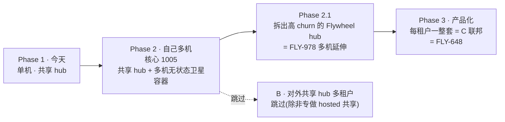
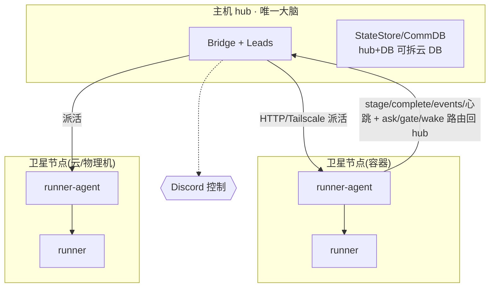
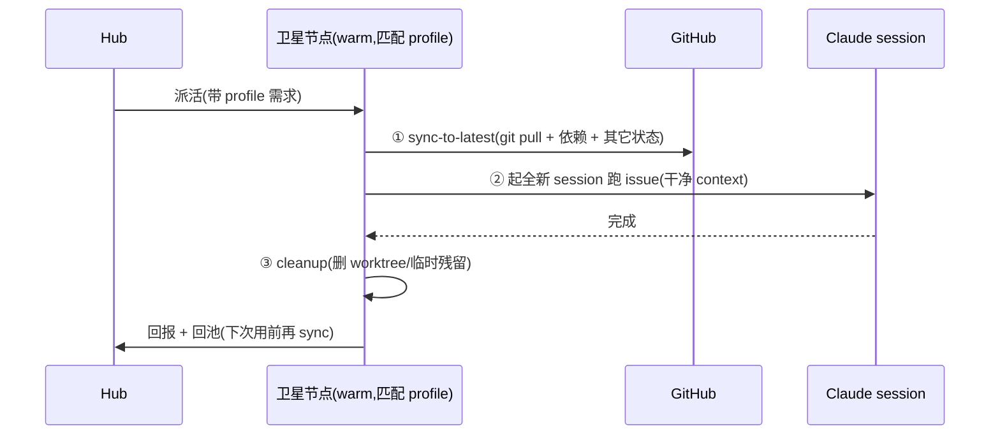

# FLY-1005 多机部署 (multi-machine) — PRD

Issue: FLY-1005 (https://linear.app/geoforge3d/issue/FLY-1005/多机部署-multi-machine-runner-分散到多台机器跑-research-prd)
日期: 2026-07-08
基于: product/doc/FLY-1005-multi-machine-runners/{exploration,research,plan}.md(research + 与 Annie 10 轮 co-eval 收敛)

> 本 PRD 是 research + 10 轮 founder co-eval 收敛后的落地稿,交 Tadashi 拆 eng issue 实现。诚实:凡未定处标 [OPEN];凡不做处入 §7 非目标。

---

## 1. 命题与背景

**命题(Annie 校正):** 1005 不是「多机值不值得 / 内存怎么治」(换大机=纵向已单独做完、有天花板);而是 **multi-machine 本身:横向扩展 → 无上限 horizontal scale,并作为『可移植/可部署产品(FLY-648)』的前置**。

- 纵向(加内存/换大机)有天花板 + 单点;横向(多机 + 可弹性开云节点)无上限 + 失败域隔离。
- **额度不在此列**:Claude 额度 per-账号,多机不加额度(加账号才加)。
- 现状(codebase 已核,详见 research §1)3 个硬单机锚点:① Bridge 硬绑 loopback;② StateStore 单进程本地 SQLite;③ runner 本地 tmux + 本地 worktree + ask/gate/wake 依赖本地 CommDB。**出站 stage/complete/heartbeat/events 已是 HTTP**;Discord 已解耦;Tailscale 已有先例。

---

## 2. 分阶段路线(Phase 1 = 今天)

| Phase | 形态 | delta(相比上一阶段) |
|---|---|---|
| **1 今天** | 一台机器:hub(Bridge+DB+Leads)+ 所有 runner(worktree/tmux);内部多 team(Flywheel / Jolt 3D / Tidal Echo)共享一套 hub | 起点(瓶颈=单机容量+单点) |
| **2 自己多机(核心)** | 共享 hub(我们的 team 仍共用,**hub+DB 可拆云**)+ **多机无状态卫星节点容器**(profile 预登录、每 session sync-to-latest) | runner 从本机 worktree/tmux → 多机无状态容器化卫星;突破单机容量 + 失败域隔离 |
| **2.1 拆 Flywheel hub** | 把高 churn 的 **Flywheel hub 从共享 hub 独立**,稳定 team 继续共享;runner 仍分散 | 从「所有 team 共享一 hub」→「高 churn 的独立、稳定的共享」= **FLY-978 decouple-restart 多机延伸** |
| **3 产品化** | 容器化栈打包 → 别人自部署一份 = **C 联邦(每租户一整套硬隔离)** | 内部逐个拆 → 每租户各自一整套 = FLY-648 |

**跳过 B 的精确理由:** 内部我们的 team 共享一个 hub(Phase 1-2)是**现状、低风险、可接受**(Phase 2.1 在此基础按 churn 逐个拆);**B 特指「给外部多个租户共享一个 hub」** → 对外付费客户数据/凭据/爆炸半径必须硬隔离 = C(Phase 3)。所以**跳过对外 B**,只在专做 hosted 共享服务才有意义。

**Container = 贯穿 Phase 2/2.1/3 的 must-have**(Phase 2 做节点、Phase 3 打包);Phase 2 的容器化 = Phase 3 产品化的种子。

---

## 3. Phase 2 详细设计(核心 1005 · 交 Tadashi)

> 原则:**hub 是唯一大脑,卫星节点是无状态执行器,所有跨机只走 HTTP over Tailscale;刻意不做跨机 StateStore 强一致(无状态才敢弹性开关节点)。** 被 homerail(Manager/Node/Worker + callback URL)产品级验证。

### 3.1 拓扑

### 3.2 要破的 3 个锚点

- **锚点 A — Bridge 暴露(3 步):** ① Bridge 绑/暴露到 Tailscale 内网;② 在 spawn 侧(Bridge/Blueprint/runner-agent)设 `TEAMLEAD_URL`(或传 `bridgeUrl`),让 runner 拿到 `FLYWHEEL_BRIDGE_URL=<hub tailnet>`(Blueprint.resolveBridgeUrl 现拒非 loopback 推导);③ 保留本地默认安全兜底。**安全合同(硬要求):** 多机模式 **fail-start** 除非 **hub 端 `TEAMLEAD_INGEST_TOKEN`**(+ 需要时 `TEAMLEAD_API_TOKEN`)已配(现无 token 时 middleware no-op 放行);经反代 path allowlist 只暴露卫星需要的端点(`/events`/heartbeat + dispatch/wake 收口);**`/actions` 无鉴权 dashboard + 宽 `/api/*` 保持 loopback-only**。[OPEN D1] 放宽 loopback+token vs tailnet 反代——倾向反代,要 spike + Codex 安全过。
- **锚点 B — StateStore 不硬解、绕过:** StateStore/CommDB/audit db 全留 hub,卫星零权威状态 → 天然无需跨机 DB(避开分布式一致性)。Phase 2 自然子步可把 hub 的 DB 拆成独立/云 DB(单写者仍是 hub、无共识问题;独立存活/备份/可接管)。
- **锚点 C — 卫星 spawn + ask/gate/wake 路由回 hub:** 出站 stage/complete/heartbeat/events 已是 HTTP;**但 `ask` 写本地 CommDB、`gate` 轮询本地 CommDB、mailbox wake 身份来自本地 CommDB** —— [OPEN D6] 卫星的 ask/gate/wake 走 (a) HTTP 到 hub CommDB(倾向,同出站姿态)还是 (b) 给节点可路由 comm 视图;wake 可新增 remote-http transport 或走 runner-agent adapter(需 spike)。**这是 Phase 2 真正的工程量所在,一等公民、不低估。**

### 3.3 runner-agent daemon(新增,每卫星一个)

- 向 hub 注册(node-id + tailnet 地址 + 容量 + profile);接 hub dispatch(HTTP)→ 本地 `tmux new-session` 起 runner(复用 `TmuxAdapter`)。
- 注入:`FLYWHEEL_BRIDGE_URL=<hub tailnet>` + `FLYWHEEL_INGEST_TOKEN`(注:hub 端配 `TEAMLEAD_INGEST_TOKEN`,同一密钥;runner 侧叫 `FLYWHEEL_INGEST_TOKEN`)。
- 节点职责清单(明确、别藏在四个字里):工具链 provision、Claude/Codex 登录态、repo checkout + worktree、tmux/session 生命周期、event/heartbeat 上报、日志可见性、失败清理、**⭐ 状态 sync + cleanup(§3.5)**、把 hub 的 wake 路由到本地 inbox。
- 周期上报 load/free-RAM/runner 数(喂 admission)。复用 heartbeat(FLY-172)。

### 3.4 dispatch / admission + ⭐ profile 分池

- 扩 `RunnerAdmissionController`(`packages/teamlead/src/bridge/runner-admission.ts`,现有 load + 可选 memory-pressure 闸门)成 **per-node**:按各 node 上报 free-RAM + runner 数选最空的;满则排队。
- **⭐ profile 分池:** profile = 节点预装/预登录的账号+工具集(Cloud CLI / Chrome / Suno / Linear / GitHub),是一个 **mapping(每 lead → 能指挥哪些 profile)**;派活带 profile 需求 → 命中「有权 + 有该 profile 的 warm 节点」。解决「多数节点不需 Suno」浪费。
- **warm 的是节点、不是 session:** warm 节点 = 开好机 + 已登录 + agent 注册 + 入 tailnet;每 issue 起**全新 session**(干净 context)、做完 exit、节点续 warm(§3.5)。不挂 session 复用(会串味)。
- 实例选型 = **memory-optimized 高 RAM**(每 runner ~1.3-1.4GB,别 CPU-optimized)。

### 3.5 ⭐ 状态 sync + cleanup(一等硬要求)

N 台机汇同一 GitHub、profile 池复用节点 → 时序(node → sync → 跑 → cleanup → 回池):

- **每 session 前必须 sync-to-latest**(git pull + 最新依赖),绝不拿 outdated 树干活(呼应 QA fetch-HEAD + 防撞车 FLY-1002);**session-exit 清本地残留**(worktree/临时文件)不污染下一个 issue。**含义:session 结束不能原样复用,每次起前先 sync = 一 issue 一干净 session 的代价 + 正确性来源。**

### 3.6 容器化 = 轻容器带浏览器 profile(承 346)

- **载体 = container(非 AIO 沙箱):** 沙箱 sandbox = 全套交互开发环境(浏览器+终端+VSCode+Jupyter+MCP,给人/agent 交互用);container = 轻隔离执行单元。**要隔离看容器、要浏览器看 provisioning,两件事分开。**
- **要浏览器的活做「瘦容器」就够:** 浏览器 + headless Chrome + 终端,**去掉 IDE/Jupyter**。接 profile 池:「带浏览器 profile」节点 = 预装+预登录 Chrome 的瘦容器;其它活用纯执行 container。**要的是「容器(隔离)+浏览器(provision)」非整套 AIO(FLY-346)。**
- 每 profile = 一份**预烤登录态镜像/快照**(bake 进 Dockerfile,build 一次 deploy 多次)。家里 Mac 卫星可裸跑不用 Docker;云/Linux 节点用容器。

### 3.7 failover + 节点来源

- **failover:** 卫星死 → heartbeat(FLY-172)超时 → hub 重派到别的 node。**无 session-log 时** = 重跑该 phase;**有 FLY-353 session-log 时** = 从日志无损续跑。
- **节点来源可选:云 OR 用户自己物理机(开源自管)。** 云 = 弹性无上限(on-demand 稳、spot 便宜但会被抢);自管物理机 = **无 spot 消失问题**、uptime 自担。
- **spot 消失兜底:** spot = 云商骨折卖闲置算力、随时(几十秒~2 分钟甚至无通知)收回。兜底 = heartbeat 发现 → session-log(FLY-353)无损重建续跑;关键/长任务用 on-demand、可容忍中断批量用 spot;有预警时 drain。[依赖 FLY-353]

---

## 4. Phase 2.1 详细设计(拆高 churn 的 Flywheel hub)

- **做什么:** 把 **Flywheel 的 hub(Bridge+Lead)从共享 hub 单独拆出来**,跟稳定 team(Jolt 3D / Tidal Echo)分开;**runner 仍分散**在 Phase 2 的多机卫星池。
- **驱动:** Flywheel 高频改(~4 次/天)vs 其他 team 稳(~1 次/天);拆开后 Flywheel 频繁重启**不再逼其他 team 跟着重启** = **FLY-978 decouple-restart 在多机上的延伸**。
- **踏脚石:** Phase 2(共享 hub)→ Phase 2.1(**先拆最高 churn 的 Flywheel**)→ Phase 3(每 team 各一整套=C),按「谁最需要独立先拆」逐个推进。
- **落地:** 复用 Phase 2 的卫星池(runner 不动);新增能力 = 一个 hub 进程/容器只服务一个(或一组)team + 各自 DB;dispatch 路由到对应 team 的 hub。与 FLY-978(decouple-restart)对齐设计,别重复。

---

## 5. Phase 3 概要(产品化 = C 联邦)

- 把 Phase 2 的**容器化栈打包** → 别人拿「核心镜像 + 自己的 Discord/项目」**自部署跑自己一份** = C(联邦、每租户一整套 Bridge+DB+Leads+runner 容器、硬隔离)= **FLY-648 productization**。
- **跨 team/租户 Lead 通信走各自 Discord 共享层**(如 leads-roundtable);不直连。
- 付费客户天然硬隔离(数据/凭据/爆炸半径)。云弹性 provision(node-pool 触发→provision→入池→销毁)+ secret 分发(AWS Secrets Manager / Vault,非难点)在此阶段成熟。[远期,依赖 FLY-559 云 + FLY-346 容器]

---

## 6. Success Metrics

- **Phase 2:** hub dispatch → 卫星起 runner → stage/complete/gate/ask/wake 跨机全链通;admission 满时排队/转机不 swap thrash;kill 卫星 → hub 重派;两台物理机 + Tailscale 真机 E2E 通过;安全:未配 token 时多机模式 fail-start、`/actions` 不可从 tailnet 到达。
- **Phase 2.1:** Flywheel hub 独立后,Flywheel 重启不触发稳定 team 重启(restart 隔离度可观测)。
- **Phase 3:** 从镜像开云节点全自动入池(冷启动计时);弹性 scale up/down;强杀云节点 → session-log 无损重启;别人能拿镜像自部署跑通一份。

---

## 7. 非目标(明确不做)

- N1 **不做**跨机 StateStore 强一致(Option C);单 hub brain + state 留 hub 绕过。
- N2 **跳过对外 B**(共享 hub 给外部多租户);对外用 C。内部我们的 team 共享 hub 是现状、可接受。
- N3 **不解决额度**(加账号,不是加机器)。
- N4 **不重复**换大机/内存优化(FLY-751/753,已单独做)。
- N5 **不做**树状 Lead 层级(FLY-916,正交纵轴)。
- N6 Phase 2 **不强制**给 Mac 卫星上 Docker(裸跑即可);容器是云/Linux 节点 + Phase 3 打包才必需。

---

## 8. Open Questions

- [OPEN D1] Bridge 暴露:放宽 loopback + token vs tailnet 反代?(倾向反代,spike + Codex 安全过;`/api/actions/*` 强能力暴露风险边界)
- [OPEN D6] 卫星 ask/gate/wake 路由:HTTP 到 hub CommDB vs 节点可路由 comm 视图;wake = 新 remote-http transport vs runner-agent adapter?(Phase 2 主要工程量)
- [OPEN D7] 云调度/placement + 冷启动预热(Phase 3)
- [OPEN] hub+DB 拆云 DB 的时机(Phase 2 子步 vs Phase 2.1);SQLite→Postgres 迁移成本
- [OPEN] 成本精算(云 memory-optimized 弹性 vs 多买物理机;§research §3.6 粗估:物理 amortized $40-70/月 vs 云 on-demand $150-290/月 vs spot)
- [OPEN] cmux GUI 跨机可观测(卫星 pane 不在主机 cmux;FLY-561 tmux-attach + 标机器)
- [OPEN] FLY-353 session-log 排序:先落 353 再多机(failover 从第一天无损)vs Phase 2 先上、353 到位再升级(云弹性阶段 353 是刚需)

---

## 9. 依赖 / 关联

- **FLY-353** session-log(failover 无损重建;云弹性阶段刚需)· **FLY-346** AIO Sandbox/容器(瘦容器载体)· **FLY-978** decouple-restart(Phase 2.1 本质)· **FLY-555** 多机 epic(本 PRD 收敛它 + 子票 556/557/558/561 改口径)· **FLY-559** 云弹性(Phase 3)· **FLY-519** provisioning(卫星子集/镜像雏形,已 done)· **FLY-172** heartbeat · **FLY-1002** 防撞车(sync 正确性)· **FLY-648** 可移植产品(Phase 3)· **FLY-916** 树(正交纵轴,不阻塞)。

---

## 10. Build-issue 拆分(eng · 清单交 Tadashi 建 FLY issue)

> Lead 据此建 FLY issue 挂 Tadashi 队列。建议按 Phase 2 优先、依赖排序。

**Phase 2(核心,先做):**
1. **runner-agent daemon** — 卫星常驻:注册 hub / 接 dispatch / 本地 tmux 起 runner / 上报 load+heartbeat / 路由 wake 到本地 inbox。(承 FLY-556)
2. **Bridge tailnet 暴露 + 安全合同** — 反代/绑 tailnet + fail-start-无-token + path allowlist + `/actions` 保 loopback;Codex 安全过审。(D1)
3. **ask/gate/wake 跨机路由到 hub** — CLI + hub 收口 + wake transport(remote-http / runner-agent adapter)。(D6,Phase 2 主要工程量)
4. **per-node admission + profile 分池** — 扩 RunnerAdmissionController per-node + profile mapping(lead→profiles)+ 选池。(承 FLY-557)
5. **状态 sync + cleanup** — runner-agent 每 session 前 sync-to-latest + exit cleanup。(呼应 FLY-1002)
6. **瘦容器镜像 + 预烤 profile** — 浏览器+headless Chrome+终端瘦容器;profile 预登录层 bake;云/物理机节点来源。(承 FLY-346)
7. **failover(基础)** — heartbeat 超时 → 重派;无 session-log 时重跑该 phase。(承 FLY-172;无损续跑挂 FLY-353)
8. **两台机 + Tailscale 真机 E2E** — §6 Phase 2 验收。

**Phase 2.1:**
9. **拆 Flywheel hub** — 一 hub 只服务一(组)team + 各自 DB;dispatch 路由到对应 hub。(承 FLY-978)

**Phase 3(远期,可暂挂 backlog):**
10. **云节点镜像 + node-pool 弹性** — 触发→provision→入池→销毁;memory-optimized。(承 FLY-559)
11. **产品化打包(自部署 C)+ secret 分发** — 核心镜像 + 客户自部署;Secrets Manager/Vault。(承 FLY-648)
