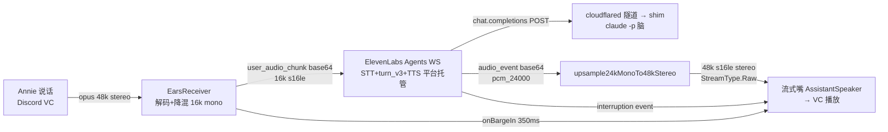

# FLY-1006 /eleven 产品实测 — 调研

Issue: FLY-1006 (https://linear.app/geoforge3d/issue/FLY-1006/voiceelevenv1-eleven-产品实测-elevenlabs-agents-claude-custom-llm-真机)
日期: 2026-07-08
基于: exploration.md

## 0. 调研目标

把 exploration §5 的决策落到可实施的技术事实：M1 网页 rig 的 SDK 契约、
M2 eleven 模式的音频通路每一跳、验证 rig、记账与风险。凡 FLY-980 已真机
取证的事实直接引用不再重验。

## 1. M1 — 真人麦克风 rig

### 1.1 SDK 契约（Context7 对 elevenlabs.io 官方文档核实，2026-07-08）

- 包：`@elevenlabs/client`（浏览器端）。核心调用：

```js
const conversation = await Conversation.startSession({
  signedUrl,                       // 服务端换来的一次性 WS URL
  overrides: {
    agent: { prompt: { prompt }, firstMessage, language },
    tts: { voiceId },              // per-session 切声线（980 V8 已验平台侧生效）
  },
  onConnect, onDisconnect, onError,
  onModeChange,                    // "speaking" | "listening" —— 页面状态灯
});
```

- 麦克风：`navigator.mediaDevices.getUserMedia({audio:true})` 先取权限
  （官方 quickstart 同款）；SDK 自管采集/播放/打断。
- **signed URL 必须服务端换**：`GET /v1/convai/conversation/get_signed_url
  ?agent_id=...`（xi-api-key 头）——spike `lib/eleven.mjs` 已有此函数。
  **key 全程 server-side（D2）**：本地起一个只听 127.0.0.1 的极简 Node 服务
  （无框架 http），页面 fetch `/api/signed-url?lead=tadashi` 拿 URL；key 从
  `~/.flywheel/.env` 读，绝不进页面源码/浏览器存储/repo。
- override 前提：agent 的 `platform_settings.overrides.conversation_config_
  override` 安全位已启用——980 create-agent.mjs 建 agent 时一次设好
  （v6-v8 evidence R3 消除）。

### 1.2 M1 rig 组成（全部复用 + 一页新代码）

| 组件 | 来源 | 说明 |
|------|------|------|
| agent | create-agent.mjs 重建 | 生产配方：custom_llm(workspace secret) + cascade=15 + soft_timeout 3s 垫话 + turn_v3 + flash_v2_5 |
| 脑 | shim.mjs（claude 档，FLY980_RESUME=0） | V8 教训：平台默认不带会话 id，resume 模式两会话会串味——真人多会话场景用 fresh 实例最稳 |
| 隧道 | cloudflared quick tunnel | runbook 同 980 |
| talk 页 | **新增**（单 html + 单 mjs 服务，engineering/spike/FLY-980-eleven/ 内） | Lead 下拉（3 Lead：Eric/Sarah/Alice + persona md）→ startSession(overrides)；状态灯 + 会话计时 + conversation_id 显示 |
| 记账 | usage.mjs | 每 session 前后快照（D6，~177 credits/min 口径） |

M1 度量定位：**体感为主、数据为辅**。页面只记粗粒度时间戳（onModeChange
listening→speaking 翻转即「她说完→agent 出声」的近似），精确延迟归因继续
靠 shim jsonl；不在 M1 重建 980 的打点矩阵。

### 1.3 dashboard 分钟池核查

980 发现：subscription API **无独立分钟池字段**，Agents 会话直接扣
character（credits）池。M1 顺手核 dashboard：登录 elevenlabs.io →
usage/subscription 页面看有无 Agents 分钟独立计数器。执行形态：
Claude-in-Chrome 只读看一眼（若 Annie 的 Chrome 已登录）；未登录则请 Annie
自己瞥一眼截图——**只读观察，不做任何账户变更**。结论落 evidence（两种
结果都有价值：有计数器 = 980 报告更正；没有 = 坐实「credits 单池」）。

## 2. M2 — eleven 模式接进 Discord VC

### 2.1 音频通路（逐跳，全部有现成件）



逐跳事实：

- **入向**：EarsReceiver.onFrame 已产 16kHz mono s16le（§exploration 3.2）
  = WS `user_audio_chunk` 要的格式（980 e2e-session.mjs 同款喂法），
  **持续流式直发**（turn-taking 平台侧 turn_v3 托管，本地不做端点切分）；
  发送侧做 ~100-250ms 缓冲聚包（避免每 20ms 帧一条 WS 消息）。
- **出向**：agent `tts.agent_output_audio_format` 配 **pcm_24000**（官方
  WS AsyncAPI 枚举含 pcm_24000；conversation_initiation_metadata 事件回报
  实际格式，运行时断言核对）→ 现成 `upsample24kMonoTo48kStereo` → 48k
  s16le stereo → **流式嘴**（AssistantSpeaker 或同形 ElevenSpeaker：每个
  agent response 一条 raw PCM 流连续 feed，Codex R1#3）。**StreamType.Raw
  教训直接吃**（9a0a464c：headerless raw PCM 走 Arbitrary 会被 ffmpeg
  probe 误解码成杂音）。
- **打断双保险**：平台 `interruption` 事件（980 V6：barge-in 后 ~660ms 发出、
  且平台会 abort 对 shim 的 in-flight 请求）→ 流式嘴 **flush**（turn 关闭
  + 迟到 chunk 丢弃）;本地 EarsReceiver.onBargeIn（350ms 门限）先行 flush
  快路径。
- **入向 human-gating**：复用 967 的 `makeIsHuman`（members.cache miss 时
  REST 单成员自愈 + boot 时预取 VC 在场成员——GUILD_CREATE 的 voice_states
  不带 member 对象，founder 已在房时永远 resolve 不到的坑已修）。
- **会话 keying**：起始帧 `conversation_config_override`（Lead 声线+persona）
  + `custom_llm_extra_body: {conversation_id}`（980 v10：平台默认不带会话
  辨识字段，此通路已验存在）——shim 侧多会话不串味。

### 2.2 模块形态（对齐 967 assistant/ 结构模板）

`packages/voice-bridge/src/eleven/`（Implement 阶段产物，plan 定明细）：

| 件 | 对应 967 模板 | /eleven 差异 |
|----|---------------|--------------|
| ElevenWs | （967 用 voice-core Gemini backend） | **新写**：get-signed-url REST + WS 客户端（起始帧 override / user_audio_chunk / audio+interruption+transcript 事件），参考 e2e-session.mjs，~200 行级 |
| ElevenSession | AssistantSession 状态机 | 状态机更薄：invoked→live→teardown（v1 无 landing 引擎——转写存档即可，总结/落 Linear 不在本单） |
| ElevenCommand | GeminiCommand | /eleven 命令 + SessionSlot mode "eleven" + deferReply 先应答（9a0a464c 教训） |
| speaker | AssistantSpeaker | **流式嘴**：复用 AssistantSpeaker（每 turn 一条 raw PCM 流；LeadSpeaker 的离散 utterance 队列不适合连续 chunk 流——Codex R1#3）；不需要 TTS 引擎（嘴在平台） |
| wiring/config | wiring.ts / config.ts | 同型；agent_id / lead 声线表 / shim 预检项进 config |

比 /gemini 薄得多的原因：STT、turn-taking、TTS、打断判定全在平台侧；
voice-bridge 只做「音频搬运 + 会话生命周期 + 度量」。BriefingEngine /
read-only tools / landing 全不做（issue 边界 = E2E 三维数据，不是助理功能
对齐——工具通路 980 V7b 已证 shim 内消化路线，产品化归 /eleven 胜出后）。

### 2.3 运维面（v1 诚实边界）

shim + cloudflared + agent 是**会话前置资产**，v1 不由 voice-bridge 拉起：
runbook 三步（起 shim → 起隧道 → patch agent 指到隧道 URL），/eleven 命令
preflight 检查 agent 可达 + shim 健康（本地 /健康探针）+ ELEVENLABS_API_KEY
在位，缺任何一样 **fail-loud 拒开会话**（不静默降级）。隧道 URL 每次随机
——每次实测前 patch agent 是 runbook 固定步骤。

### 2.4 E2E 验证 rig（D5：复用 967 staged venue，不重造）

967 已建全套：`~/.flywheel/qa-fly967-staged/` 隔离 Bridge + staged runner
（bf8369b1：prod-port refusal + SIGTERM 清理）+ sender-bot 推 WAV 注入 VC +
离线波形断言 + **fail-closed verdict**（e55beaf5：任何断言红 = exit 1）。
eleven 模式的机器可验部分（音频进出、打断停播、slot 互斥）套同一 venue 跑；
真人体感部分（M2 验收主体）= Annie 真机进房，与 967 的「Annie 真机 3-strike
kickback」同一验收模式。

### 2.5 度量口径（对比表可比性）

- **延迟双口径**（沿用 980）：speech-end→垫话首音 / speech-end→真答案首音。
  speech-end 锚 = EarsReceiver.onSpeakingEnd（Discord speaking 事件尾）;
  首音锚 = 首个 audio_event 到达（段间隙 >1.5s 分段区分垫话/真答案，980
  同法）；脑侧归因 = shim jsonl（t_req_arrival→t_first_delta）。
- **质量**：user_transcript 事件存档（STT 准确性核对）+ Annie 主观体感
  （懂不懂/像不像/跟不跟手）。
- **成本**：session 前后 subscription 快照 → credits/min，对 ~177 基准。

## 3. 横向对比数据源

| 线 | 延迟 | 成本 | 数据源 |
|----|------|------|--------|
| /glaw（545，Gemini 耳+Claude 脑+edge-tts） | 968 bakeoff 表 | 免费（edge-tts）+ Gemini 耳 | FLY-968 bakeoff.md |
| /gemini（967，纯 Gemini Live） | 797-1017ms；gated×3 ≈$0.68/h | 单 session ~$0.66/h | FLY-968 + FLY-967 真机 |
| /gemini-advanced（997） | pending | pending | FLY-997 产出（未出数据标 pending） |
| /eleven | 980：垫话 ~3s/答案 4-6s（负载夜偏悲观）；**本单补真人+VC 实测** | 订阅池内现金 $0（~177 credits/min ≈ $1.47/h 等值）；脑 $0 | FLY-980 + 本单 M1/M2 |

口径差异表内注明（968 各线是 speech-end→首音；/eleven 因垫话机制必须双口径）。

## 4. 风险表

| # | 风险 | 处置 |
|---|------|------|
| R1 | 真人会话中 shim/隧道断（长会话 cloudflared 波动） | preflight + fail-loud；runbook 含 30 秒重建路径；会话中断如实记录（本身就是产品数据） |
| R2 | 平台 STT 版本漂移（980 见过同词跨日结果不同） | 转写存档每轮留证；结论按当日实测说话 |
| R3 | VC 回声（agent 声音被自己听见） | 结构性无此路：EarsReceiver 只订阅人类成员（isHuman 挡 bot） |
| R4 | #501 merge 时点晚于预期 | M1 不受影响先跑；M2 implement 前置检查 #501 已 merge，未 merge 则 hold 并报 Lead（不 fork 音频面旧版本硬做） |
| R5 | M1 浏览器麦克风权限/设备选择（Annie 本机） | 页面首屏显式 getUserMedia + 设备名显示；FLY-959 教训（mic default device）已在心智 |
| R6 | 慢答案跨轮（980 V5b 实录：上轮答案落进下轮） | v1 接受 + 如实记录体感;产品化前的 stale-answer 丢弃设计归 follow-up |
| R7 | credits 消耗超预期 | 无硬熔断（980 D6' 沿用）但每 session 记账；M1+M2 合计预估 <1.5 万 credits（<10% 月池） |
| R8 | VC 多人同时说话（多 human 混流） | v1 边界：单 founder 会话（与 967 同假设）；多人房间不在本单 |

## 5. 结论

全链每一跳都有已验证的现成件：M1 = 980 rig + 一页 talk 页；M2 = 一个薄的
eleven/ 模块（唯一净新增是 ElevenWs 客户端，参考实现已在 spike 里）。
无未解技术未知数——剩余风险全是运维性/时序性，处置都已定义。可进 plan。
