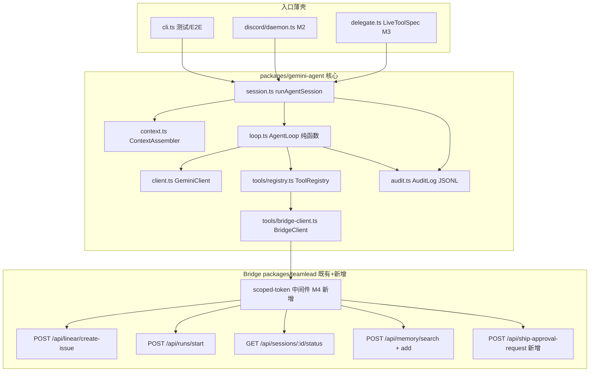

# FLY-1018 /gemini-advanced 正式建造 — 实施计划

Issue: FLY-1018 (https://linear.app/geoforge3d/issue/FLY-1018/voicebbuild-gemini-advanced-正式建造-cc-设计思想-spike-资产产品化m1-m4)
日期: 2026-07-08
基于: research.md

> **For agentic workers**: 本计划由三段式管线的 implement 阶段执行(TDD:每 chunk 先测后码;用 progress ledger 按 §10 chunk 表报进度)。设计已过 brainstorm gate(Tadashi 五决策全批,2026-07-08)。
>
> **TL;DR**:新包 `packages/gemini-agent`(clean-room,TypeScript)按 CC 十条设计原则实现 own-loop Gemini agent:while(true) + 显式 State + 结构化 Terminal / dispatch 三段闸 / 三段式 system prompt / JSONL 审计先写后调 / callModel 可注入纯单测。Bridge 侧新增 1 条 request 型白名单 route(ship-approval-request)+ M4 scoped-token 中间件(token→endpoint 可达集,默认不配=字节兼容)。实施顺序 **M1 正式包 → M2 Discord 文字入口 → M4 降权 token → M3 语音 seam**;全程 feature-flag default-off,M4 落地 + QA 过才真启用。

**Goal**: 把 FLY-997 spike(S2 100/100 / S4 10/10 / S3 5/5,已 merge main `36e99fcb`)产品化成正式的 tool-using Gemini agent,文字/语音双入口,护栏结构性落地。

**Architecture**: 三层——`GeminiClient`(纯传输 + retry)/ `AgentLoop`(纯函数循环,状态显式进出)/ `ToolRegistry`(6 工具 + dispatch 三段闸);外加 `ContextAssembler`(三段式 system)与 `AuditLog`(JSONL 先写后调)。入口是薄壳:CLI(测试/E2E)、Discord daemon(M2)、delegate LiveToolSpec(M3)全部直调同一 `runAgentSession()`。

**Tech Stack**: TypeScript / `@google/genai` **精确 pin 2.10.0**(Interactions API,experimental → 不带 ^)/ discord.js 14.26.4(与 voice-headphone 同款)/ vitest / pnpm workspace。

**红线(全程不变量)**:founder-merge-gate 原样继承零改动;agent 零 comm.db 访问、零 reserved endpoint、进程 env 无 merge/GitHub 凭证;唯一 ship 面 = request 型工具。

---

## 0. 范围与顺序

| 里程碑 | 内容 | 顺序理由 |
|--------|------|---------|
| M1 | `packages/gemini-agent` 正式包 + Bridge `ship-approval-request` route | 一切的地基 |
| M2 | Discord 文字入口(自带瘦 bot,slash command)| 全链真跑最快路径;不依赖 voice-bridge PR-2 |
| M4 | S-b scoped-token 中间件(Bridge)| **真启用的前置**(没有 M4 只有客户端纪律) |
| M3 | 语音 delegate seam(两半:seam 侧交付 + 编排合同)| 真 /meet 接线依赖 voice-bridge PR-2(main 尚无),排最后 |

版本号 ship 时取空号(FLY-494 惯例)。全程 `FLYWHEEL_GEMINI_AGENT` flag default-off;对 Annie 真启用的硬前提 = M4 merge + 独立 QA PASS + founder 批准。

**base 处理**:implement 开工第一步 merge origin/main 进本分支(spike 资产 #513 已在 main;设计时本分支落后 47+ commit)。

## 1. 架构总览



数据流(一次会话):入口拿到用户指令 → `ContextAssembler` 组三段式 system(固定核心 / persona identity.md / 项目上下文)→ `AuditLog` 先写 session_start + 用户输入 → `AgentLoop` while(true):调模型 → functionCalls 过三段闸 → `BridgeClient` 执行 → 结果(截断后)回喂 → 无 call 时取终答 → Terminal(含全套统计)落审计 → 入口渲染回 Discord/CLI/语音。

## 2. M1 — packages/gemini-agent 正式包

### 2.1 文件图

```
packages/gemini-agent/
├── package.json            # flywheel-gemini-agent;@google/genai 固定 "2.10.0";bin: flywheel-gemini-agent
├── tsconfig.json / vitest.config.ts   # 抄 voice-headphone 模板
├── README.md               # 包边界、standalone 抽离三条件、clean-room 纪律声明
└── src/
    ├── index.ts            # 公开导出:runAgentSession, createDelegateTool, 类型
    ├── config.ts           # env 解析(表见 §2.7),fail-closed 校验
    ├── types.ts            # AgentState / Terminal / ToolSpec / AgentEvent / SessionResult
    ├── client.ts           # GeminiClient:Interactions 主选 + generateContent fallback
    ├── loop.ts             # AgentLoop:纯函数,callModel 注入
    ├── session.ts          # runAgentSession:组装 config+context+audit+loop 的门面
    ├── context.ts          # ContextAssembler:三段式 system prompt
    ├── audit.ts            # AuditLog:JSONL 落盘(§2.6)
    ├── truncate.ts         # 工具结果截断(单结果 cap + 标记)
    ├── errors.ts           # 错误分类(SDK code/status 字段,非 message 正则)
    ├── tools/
    │   ├── registry.ts     # 6 工具声明 + validateArgs + registryFor
    │   ├── bridge-client.ts# HTTP 客户端:Bearer + endpoint 白名单 + 超时
    │   └── schemas.ts      # 6 工具 JSON schema(spike tools.mjs 迁移,回正生产合同)
    ├── delegate.ts         # M3:createDelegateTool → voice-core LiveToolSpec
    ├── discord/
    │   ├── daemon.ts       # M2:bot 常驻 + slash 注册 + interaction 处理
    │   └── render.ts       # M2:结果→Discord 消息(2000 字分片)
    └── cli.ts              # flywheel-gemini-agent run "<指令>" [--project X] [--resume <sid>]
    └── __tests__/          # 见 §2.10
scripts/
    └── gemini-agent-guard.sh   # CI 静态守卫(§2.9)
packages/teamlead/src/bridge/
    └── ship-approval-route.ts  # 新增 route(§2.8)+ plugin.ts 挂载
```

依赖纪律:仅 `@google/genai`(自 pin 2.10.0)、`discord.js`、`flywheel-voice-core`(**仅 import 类型** `LiveToolSpec`)。**禁止**:`@linear/sdk`、`flywheel-comm`、任何 teamlead deep-import(CI 守卫断言)。

### 2.2 核心类型(types.ts,完整定义)

```typescript
export type TerminalReason =
  | "completed"            // 模型给出终答(无 functionCall)
  | "max_steps_exceeded"   // 步数熔断(默认 12)
  | "token_budget_exceeded"// token 预算熔断
  | "context_overflow"     // 粗估接近窗口,fail-fast(不做 compact)
  | "aborted"              // AbortSignal 触发
  | "model_error"          // API 层 fatal(4xx/auth/重试打穿)
  | "config_error";        // 启动前校验失败

export interface Terminal {
  reason: TerminalReason;
  finalText: string | null;        // completed 时为终答;错误时为 null
  error?: { kind: string; message: string; httpStatus?: number };
  stats: SessionStats;             // 终局自带审计(CC 原则 10)
}

export interface SessionStats {
  sessionId: string;
  steps: number;                   // 模型调用轮数
  toolCalls: number;
  toolErrors: number;
  hallucinatedToolCalls: number;   // 白名单闸拦截数(期望恒 0)
  inputTokens: number;
  outputTokens: number;
  durationMs: number;
  model: string;
  surface: "interactions" | "generate";
}

export interface AgentState {                 // 跨轮状态,每个 continue 点整体替换(CC 原则 2)
  step: number;
  inputTokens: number;
  outputTokens: number;
  transition: string;              // 本轮为何继续:"next_turn" | "tool_results" | "retry_after_5xx"
}

export interface ToolSpec {
  name: string;
  description: string;
  parameters: JsonSchema;          // type/properties/required/enum/items 子集(spike 同款)
  readonly: boolean;               // query_status/search_memory=true;其余 false
  execute(args: Record<string, unknown>, ctx: ToolExecCtx): Promise<ToolResult>;
}
export interface ToolExecCtx { signal: AbortSignal; audit: AuditLog; }
export interface ToolResult { ok: boolean; httpStatus?: number; body: string; } // body=JSON 字符串(截断前)

export type AgentEvent =                       // onEvent 回调(入口壳消费,替代 yield 流)
  | { type: "step"; step: number }
  | { type: "tool_dispatch"; tool: string }
  | { type: "tool_result"; tool: string; ok: boolean; durationMs: number };

export interface ModelTurn { functionCalls: Array<{ id: string; name: string; args: Record<string, unknown> }>; text: string | null; usage: { inputTokens: number; outputTokens: number }; }
export interface ModelSurface {                // client.ts 实现;loop 只见此接口(CC 原则 9)
  start(system: string, user: string, tools: ToolSpec[], signal: AbortSignal): Promise<ModelTurn>;
  continueWith(results: Array<{ callId: string; name: string; result: string; isError: boolean }>, signal: AbortSignal): Promise<ModelTurn>;
}
```

### 2.3 AgentLoop(loop.ts)— 控制流合同

```
runLoop(surface: ModelSurface, registry, budgets, audit, onEvent, signal): Promise<Terminal>
```

1. while(true),每轮开始检查:signal.aborted → Terminal aborted;step ≥ maxSteps → max_steps_exceeded;累计 token ≥ 预算 → token_budget_exceeded;粗估上下文(累计 input tokens)≥ 模型窗 × 0.8 → context_overflow。**四个熔断全部走 Terminal 退出,不 throw**(CC 原则 1/2/3)。
2. 调 surface(start 或 continueWith)。API 错误由 client 层分类(§2.4):recoverable 在 client 内重试;打穿或 fatal → loop 收到 `ModelCallError` → Terminal model_error(原始错误进 error 字段,不吞)。
3. `turn.functionCalls` 为空 → Terminal completed,finalText = turn.text。
4. 非空 → 逐个过**dispatch 三段闸**(spike 骨架直接继承,顺序不可换):
   a. **审计先落**:`audit.toolDispatch(tool, argsDigest)` 写盘成功后才继续;
   b. **注册表白名单**:name 不在 registry → 不执行,合成 isError 结果(文本含可用工具清单),`hallucinatedToolCalls++`;
   c. **schema 校验**:validateArgs 失败(缺必填 / 类型错 / **unknown param 拒绝**,空字符串视为缺失——spike 语义保留)→ 合成 isError 结果。
   过闸 → execute(带 signal + 超时);ToolResult 经 truncate(§2.5)后入 results。**每个 functionCall 必回 functionResponse**,包括 abort 中途——悬空 call 合成 isError 结果后再退出(CC 原则 4)。
5. 同轮多 call 串行执行(6 工具全 HTTP,无并发分批必要),一次性 continueWith,transition="tool_results",State 整体替换,continue。

### 2.4 错误分类(errors.ts + client.ts)

| 类别 | 判定(**用 SDK error 的 status/code 字段**,禁 message 正则) | 处置 |
|------|------|------|
| 限流 | httpStatus 429 / code RESOURCE_EXHAUSTED | 退避重试 ≤3 次:retry-after header 优先,否则 2s/4s/8s;打穿 → fatal(model_error,error.kind="quota") |
| 服务端 | 5xx / UNAVAILABLE | 同上退避 ≤3 次;打穿 → fatal |
| 网络 | fetch TypeError / AbortError(超时,单模型调用 cap 120s) | 重试 1 次;打穿 → fatal |
| 校验/auth | 4xx(非 429) | **立即 fatal**,不重试 |
| 工具 HTTP ≥400 | — | **不终止**:isError 结果回喂模型自行纠偏(spike N4 实测模型会改道);仅传输层失败(超时/断连)重试 1 次 |

一切自动恢复带上限,打穿后原始错误进 Terminal.error 如实暴露(CC 原则 8)。

### 2.5 上下文管理

- **不做 compact**。单工具结果 > `toolResultCapChars`(默认 16000)→ 头部保留 + 尾部替换为 `\n...[truncated N chars]`(truncate.ts;CC 原则 7)。
- 粗 token 估算:chars/4;超窗 fail-fast(§2.3-1)。
- **三段式 system prompt**(context.ts,turn 内不变):
  1. **固定核心**(常量):角色定位(Flywheel dispatch 助手,非 Lead/Runner)、护栏话术合同(唯一 ship 面 = request 工具、绝不声称已 merge/ship、汇报贴 gate 真状态)、工具使用规范(缺参追问不编造、任务涉项目上下文先 search_memory——spike N2 20/20 的行为来源);
  2. **persona 段**:`identityPath` 指向的 identity.md 内容(≤8000 chars,超截断;文件缺失 → 跳过该段并审计 warning,不 fatal);
  3. **项目段**:projectName + 入口注入的场景上下文(如 Discord channel 描述)。

### 2.6 审计(audit.ts)— JSONL 合同

目录 `~/.flywheel/gemini-agent/`(可配),文件 `session-<sessionId>.jsonl` + 汇总行落 `sessions.jsonl`。**用户输入先落盘再调模型**(CC 原则 6)。事件行(全部含 ts/sessionId):

```
{type:"session_start", entry:"cli|discord|delegate", model, surface, projectName, userTextDigest}
{type:"model_call", step, transition}
{type:"model_response", step, functionCallCount, textChars, usage}
{type:"tool_dispatch", step, tool, argsDigest, decision:"dispatch|hallucinated|schema_reject"}
{type:"tool_result", step, tool, ok, httpStatus, durationMs, bodyChars, truncated}
{type:"retry", layer:"model|tool", attempt, maxAttempts, delayMs, errorKind}
{type:"terminal", reason, stats}
```

脱敏纪律:argsDigest/userTextDigest = 前 200 chars;**永不落 token/密钥**;memory 内容完整体只进 tool_result 的 bodyChars 计数不进正文。lastInteractionId 持久化到 `session-<sid>.state.json`(resume 用,CLI `--resume`)。

### 2.7 config(config.ts)

| env | 默认 | 说明 |
|-----|------|------|
| FLYWHEEL_GEMINI_AGENT | (unset)=off | 总开关;off 时 daemon/CLI 直接拒启(config_error) |
| GEMINI_API_KEY | 必填 | SDK 标准;缺失 fail-closed |
| FLYWHEEL_GEMINI_AGENT_MODEL_TIER | flash | flash\|pro;model id pin 在 config.ts 常量表(flash=gemini-3.5-flash / pro=gemini-3.1-pro-preview,**implement 当日 ListModels 复核**——FLY-883 教训) |
| FLYWHEEL_GEMINI_AGENT_SURFACE | interactions | interactions\|generate(fallback 逃生口,spike 双验) |
| FLYWHEEL_GEMINI_AGENT_MAX_STEPS | 12 | 步数熔断 |
| FLYWHEEL_GEMINI_AGENT_TOKEN_BUDGET_IN / _OUT | 200000 / 20000 | 预算熔断(N1 全链实测 ~18k in,10× 余量) |
| FLYWHEEL_GEMINI_AGENT_TOOL_TIMEOUT_MS | 15000 | 单工具 HTTP 超时(AbortController) |
| FLYWHEEL_GEMINI_AGENT_RESULT_CAP_CHARS | 16000 | 单结果截断 |
| FLYWHEEL_BRIDGE_URL | 必填 | Bridge base;仅允许此 origin(出站白名单,spike 护栏第 4 道保留为审计字段) |
| FLYWHEEL_GEMINI_AGENT_BRIDGE_TOKEN | 必填 | Bearer;M4 后 = scoped token(部署纪律:**永不填主 TEAMLEAD_API_TOKEN 进生产配置**;M4 前仅测试环境用) |
| FLYWHEEL_GEMINI_AGENT_AUDIT_DIR | ~/.flywheel/gemini-agent | 审计目录 |

### 2.8 Bridge 新增:POST /api/ship-approval-request(request 型白名单 route)

**动机**:approve_to_ship 的「发起」今天只有 flywheel-comm CLI + CommDB 面;红线不许 agent 碰 comm.db。**Codex design R1-1 修正**:不走 CommDB question——GatePoller 对无 StateStore session 的 question 按孤儿跳过(origin/main gate-poller.ts:472-480),`requester="gemini-agent"` 无 session,写了也送不到。**改走 Bridge-native 事件路径**(gate 批准的决策②语义不变:request 型、归因、verify-approval 链零改动):

- 文件:`packages/teamlead/src/bridge/ship-approval-route.ts`,挂载进 plugin.ts 现有 `/api` Bearer 中间件之后(与 memory-route 同模式)。
- **Tokenless fail-closed(Codex R1-4)**:`config.apiToken` 未配置 → **解析 body 之前直接 503** `{ok:false,error:"bridge api token not configured"}`(与 founder-consent gate response 的 tokenless 姿态对齐,plugin.ts:1468-1485 先例)。
- Request:`{ prUrl: string(必填,GitHub PR URL 校验), summary: string(必填,≤2000), projectName: string(必填), leadId: string(必填), requesterContext?: string(≤500) }`;400 缺参错误体形状与 runs-route 同款 `{success:false, message:"prUrl is required"}`。**projectName 与 leadId 均由 agent 侧 BridgeClient 从会话 config 自动附带**(模型工具 schema 仍只见 prUrl/summary/requesterContext,少两个幻觉面)。
- **Lead 目标解析(Codex R2-1 + R3-1,fail-closed)**:`projectName→唯一 Lead` **不是仓内不变量**(ProjectEntry 一 project 多 leads,resolver 靠 labels + fallback leads[0])——故目标 Lead **显式来自 binding**:M2 channel binding 新增必填 `leadId` 字段(北极星「跟特定 Lead 聊特定事」的直接落点;CLI 用 `--lead` 或 config);Bridge 侧校验 `leadId ∈ ProjectEntry(projectName).leads`,未知 project 或 leadId 不属于该 project → 400,**绝不发明默认 Lead、绝不 fallback leads[0]、绝不伪造 session/issue 身份**。校验通过的 lead_id + project_name 持久化。测试:多 Lead project + 显式 leadId 正确送达;leadId 不属该 project → 400。
- **投递与幂等(Codex R2-2 + R3-2,outbox 语义,顺序不可换)**:**零 CommDB 写入**。
  ① 幂等检查:StateStore 表中同 prUrl 且 **lead_event 已 durably 入队** 的 24h 内记录存在 → 200 + 原 requestId + `already_pending:true`(不刷屏 founder;**投递从未成功入队的旧行不算数,同 PR 可重试**);
  ② **`StateStore.transaction()` 包住两笔写**(StateStore.ts:115-120 现有原语):`appendLeadEvent(leadId, ship_approval_request 事件)` + 插 `ship_approval_requests(request_id TEXT PK, pr_url, project_name, lead_id, requester, summary, created_at, lead_event_id)`(幂等 ADD-TABLE 迁移,FLY-267 先例)——**事务成对提交才算 durable queue**,任一失败整体回滚 → 502,零孤儿 lead event、零半写请求行(黑洞与孤儿两个失败模式一起关掉);运行时投递只在 commit 之后发起;delivered 状态看 lead_events 自己的 delivered_at,不重复记账。**失败注入测试**:请求行插入失败 → 断言 lead_events 无孤儿行,重试走全新事务不产生重复 founder 可见投递;
  ③ **`ship_approval_request` 加入 RETRYABLE_LEAD_EVENT_TYPES**(lead-runtime.ts:30-43,该文件只放 shared types/retryable 集)——运行时投递瞬时失败由 HeartbeatService 现有重投环兜底(HeartbeatService.ts:1321-1327),这是「已入队即算受理」成立的前提。
- **渲染合同(Codex R2-1 + R3-3)**:`HookPayload`(hook-payload.ts)加**类型化可选字段** `pr_url? / requester? / requester_context?`;**两个具体 runtime formatter——`commdb-lead-runtime.ts` 与 `mailbox-lead-runtime.ts`——各加 `ship_approval_request` 首类渲染分支**(漏任一侧 = 该面退化回通用渲染器丢字段),模板:「[ship-approval-request] requester=<requester> PR <pr_url> — <summary>(<requester_context>)。Nothing merged; founder approval + owning runner verified ship flow still required.」——PR URL/requester/note 三要素必然可见,测试对两个 formatter 分别断言渲染文本逐字含之。
- **不创建 approve_to_ship 绑定、不写 CommDB question、不触发 verify-approval 链**——它只是「把 ship 意愿呈给人」;真 ship 仍由持有该 PR 的 runner/Lead 走原有 approve_to_ship + verify-approval 权威链,零改动。
- Response 200:`{ok:true, requestId, note:"Ship approval requested. Nothing has been merged; founder approval and the owning runner's verified ship flow are still required."}`(note 原文进工具结果,喂给模型的汇报话术——S4 实测模型会贴此状态说话)。
- 失败:appendLeadEvent 或 StateStore 写失败 → 502 `{ok:false,error:"failed to record request"}`(agent 侧回喂模型如实报告)。

工具 `request_ship_approval` 的 declaration(schemas.ts)对齐此合同;spike 里它是 mock-only,这是产品化的真身。**route 测试必证(R1-1 + R2)**:零孤儿 CommDB question(spy 断言零 CommDB 写)、同 prUrl 幂等(仅对已入队行)、**deliver 失败后同 PR 重试不被 already_pending 吞**、heartbeat 重投可达(类型进 retryable 列表断言)、渲染文本含 PR URL/requester/note、目标 Lead = project 映射解析值、未知 project 400、全程不创建/不应答任何 approve_to_ship gate。

### 2.9 CI 静态守卫(scripts/gemini-agent-guard.sh,接入现有 CI lint job)

逐条 grep 断言(任一命中即 fail),对象 `packages/gemini-agent/src`:
1. 零 reserved endpoint 字符串:`/api/actions`、`/actions/`、`close-tmux`、`close-runner`、`founder-consent`;
2. 零禁 import:`@linear/sdk`、`flywheel-comm`、`packages/teamlead/src`(deep-import);
3. 零凭证越权:`TEAMLEAD_API_TOKEN`(只允许 FLYWHEEL_GEMINI_AGENT_BRIDGE_TOKEN)、`GH_TOKEN`、`GITHUB_TOKEN`;
4. 注册表封闭:`grep -c "name:"` in schemas.ts == 6(工具集变更必须显式改守卫,评审可见)。

### 2.10 测试策略(M1)

| 层 | 内容 | 关键用例 |
|----|------|---------|
| 单测 loop | 脚本化 ModelSurface(注入假响应序列),不打真 API | completed 正常链 / 幻觉工具名被拦且回喂含工具清单 / schema 拒绝(缺参、unknown param、空串)/ maxSteps 熔断 / token 预算熔断 / abort 中途悬空 call 得到合成 isError response / 工具 isError 回喂后循环继续 / model_error 打穿带原始错误 |
| 单测 client | fake fetch/SDK stub | 429 retry-after 优先 / 5xx 退避 3 次打穿 / 4xx 立即 fatal / 超时 abort |
| 单测 truncate/context/config | 纯函数 | cap 边界 / identity.md 缺失降级 / env fail-closed |
| 合同测试 | **移植 spike mock-bridge.mjs 为 vitest fixture**(错误体逐字对齐生产的资产直接复用) | 6 工具各:成功体 + 每条 400/404/409/502 错误体解析;create_issue required 回正(title-only)断言 |
| Bridge route 测试 | teamlead 侧 vitest | ship-approval-request:tokenless 503(解析前)/ 400 缺参 / 200 + note 原文 / 幂等 already_pending / Bearer 401 / **零 CommDB 写 spy** / 事件投递 sink spy / 不创建 approve_to_ship gate |
| E2E(手动/QA) | 真 Bridge(测试环境)+ 真 Gemini | CLI 跑 N1 短链(create→dispatch→poll→memory);审计文件完整性 |

### 2.11 M1 任务分解(TDD;每 chunk = 失败测试 → 最小实现 → 过测 → commit)

1. **M1-scaffold**:包骨架(package.json 固定 pin 2.10.0 / tsconfig / vitest / README 含 clean-room 声明与 standalone 三条件)+ config.ts(测:env 缺失 fail-closed、tier→model id 映射、flag off 拒启)。
2. **M1-types-schemas**:types.ts + schemas.ts(6 工具,required 回正生产合同)+ registry validateArgs(测:必填/类型/enum/unknown-param/空串)。
3. **M1-truncate-audit**:truncate.ts(测 cap 边界与标记)+ audit.ts(测:事件行 schema、先写后调顺序——用注入 fs 断言 session_start 在首次 model_call 前、脱敏 digest)。
4. **M1-client**:client.ts 双 adapter + errors.ts(测:分类表全行,fake SDK stub)。
5. **M1-loop**:loop.ts(§2.10 loop 行全部用例;脚本化 surface)。
6. **M1-bridge-client**:bridge-client.ts(测:白名单外 URL throw——**含 /actions/approve 代表性路径在 fetch 前即 throw(Codex R1-3)**、Bearer 头、超时 abort、错误体透传)+ 合同测试 fixture 移植。
7. **M1-ship-route**:teamlead 侧 ship-approval-route.ts + StateStore ship_approval_requests 表迁移 + 事件投递接线(§2.8 route 测试全行,含 tokenless 503 / 零 CommDB / sink spy)。
8. **M1-session-cli**:session.ts(context 组装接线 + resume 持久化)+ cli.ts;守卫脚本 gemini-agent-guard.sh 接入 CI;全包 lint+test 绿。

## 3. M2 — Discord 文字入口

**形态**:gemini-agent 自带瘦 bot(gate 批准决策①)。**bot 手续(Tadashi 要求)**:FLY-882 池 claim slot 走 Tadashi 一道手续;bot 只进**测试 guild/自有频道**,**不进 #core**;channel allowlist 硬编码进 config 文件,不在 allowlist 的 interaction 一律静默拒。

- **配置文件** `~/.flywheel/gemini-agent.json`(路径可 env 覆盖):

```json
{ "bindings": [ { "channelId": "…", "projectName": "flywheel", "leadId": "flywheel-eng-lead", "identityPath": "/abs/path/identity.md", "contextNote": "eng 频道,默认聊 Flywheel 工程事" } ] }
```

  binding = 北极星「跟特定 Lead 聊特定事」的落点:channel → project + **leadId(必填,Codex R3-1:ship request 的目标 Lead 显式来自这里,不做 project→lead 推断)** + persona。启动时校验(channelId 非空、leadId 非空、identityPath 存在则读、schema 错 fail-closed)。CLI 对应 `--lead <leadId>`(或 config 默认)。
- **命令注册**:guild slash command `/gemini-advanced instruction:<string>`(daemon 启动时对 bindings 里的 guild upsert;权限仅 bot 自身)。
- **交互流**:interaction → binding 查找(无 → ephemeral 拒)→ `deferReply()`(3 秒窗)→ ACK follow-up(「已受理,session <sid8>」)→ runAgentSession(onEvent 静默,MVP 不刷步进)→ 终答按 2000 chars 分片 follow-up;Terminal 非 completed → 如实报错误 + reason(不吞,含 sessionId 供查审计)。
- **并发**:per-channel 串行(内存 mutex);运行中再来 → ephemeral「上一条还在跑(session <sid8>)」。
- **daemon**:`flywheel-gemini-agent daemon`(bin 子命令);launchd 收编 ship 阶段做,dev 期手动跑。
- **flag**:FLYWHEEL_GEMINI_AGENT unset → daemon 拒启。

任务分解:
9. **M2-config-bindings**:bindings 解析 + 校验(测:schema 错/路径缺失/重复 channelId/**leadId 缺失或空白拒启**——Codex R4 提示)。
10. **M2-daemon**:command upsert(discord.js REST mock 测)+ interaction 路由(allowlist 拒 / mutex / defer-followup 序列,mock client)+ render.ts 分片(测 2000 边界)。
11. **M2-e2e**(QA 协同):测试 guild 真 bot 跑全链(派活/查状态/记 memory/ship request 呈报),独立 QA 按 §7 验。

## 4. M4 — scoped-token 中间件(Bridge)

**目标**:把「客户端纪律」升级为服务端强制——agent 持有的 token 在 Bridge 侧只能到达 6+1 条工具 route(gate 批准决策③)。

- **Bridge env**:`TEAMLEAD_GEMINI_AGENT_TOKEN`(scoped token 值),进 `BridgeConfig.geminiAgentToken` + `loadConfig()`(config.ts)。**不配 = 字节兼容零变化**(reverse-compat sentinel 测试)。
- **前提校验(fail-closed,Codex R1-2)**:
  - scoped == 主 token(trim 后比对)→ **loadConfig 直接 throw,Bridge 拒启**(碰撞 = scoped token 实际是全权限凭证,静默降级不可接受;boot-time 拦截是唯一能关掉窗口的位置,错误信息写明两个 env 名)。
  - scoped 配了但 `TEAMLEAD_API_TOKEN` 没配 → 启动 log ERROR 并**忽略 scoped token**(现状 token 未配=中间件放行,scoped 无意义;不引入新的裸跑姿态)。
- **可达集**(常量表,方法+路径前缀精确匹配):
  `POST /api/linear/create-issue` / `POST /api/runs/start` / `GET /api/sessions/{id}/status` / `POST /api/memory/search` / `POST /api/memory/add` / `POST /api/ship-approval-request`。
- **实现挂点**:`tokenAuthMiddleware`(plugin.ts:635-645)扩展:Bearer 值 timingSafeEqual 主 token → 现行为;≠主 token 且 = scoped token → 检查 (method,path) ∈ 可达集,否 → 403 `{error:"forbidden for scoped token"}`;都不匹配 → 401 现行为。全局 `/api` 中间件(plugin.ts:1414-1417)与各 per-mount 调用点共用同一实现,改一处生效全部。
- **边界措辞(Codex R1-3)**:M4 的服务端强制**只覆盖 bearer-authenticated 的 /api 面**。dashboard 别名 `/actions/*` 在 origin/main 是 loopback-only 无 token 裸挂(plugin.ts:1016-1033)——**不在 token map 管辖内**,对它的防线 = agent 侧双保险:BridgeClient 精确路径白名单(构造 /actions/* URL 在 fetch 前即 throw,专项测试)+ §2.9 静态守卫禁 `/actions/` 字符串。reserved 的 /api/actions/* 在可达集外(403),fcMw 层零改动。
- **审计**:scoped token 的 403 拒绝写一行 Bridge log(路径 + 时间,不含 token),供 M4 QA 取证。

任务分解:
12. **M4-middleware**:BridgeConfig.geminiAgentToken + loadConfig 校验 + 扩展 tokenAuthMiddleware + 可达集常量(测:可达集内 200 / 集外 403 含 /api/actions 抽查 / 主 token 全通 / 不配 scoped = 字节兼容 sentinel / **碰撞 = loadConfig throw** / scoped 配了主 token 没配 = 忽略+ERROR log)。
13. **M4-wire-agent**:生产配置纪律写进 README + `.env.example`;agent 侧无代码变化(它本来只认 FLYWHEEL_GEMINI_AGENT_BRIDGE_TOKEN)。

## 5. M3 — 语音 delegate seam(两半交付,gate 批准决策④)

**seam 侧(本 issue 交付)**:
- `createDelegateTool(opts): LiveToolSpec`(delegate.ts):declaration name=`delegate_task`,参数 `{instruction: string(必填), context?: string}`;handler 语义:
  1. 立即生成 taskId(uuid 前 8 位),`AuditLog` 记 delegate_accept;
  2. **异步**启动 runAgentSession(不 await 完成),完成/失败时调 `opts.onComplete(taskId, terminal)`;
  3. **同步返回 ACK 字符串**(「已受理,任务 <taskId>,完成后另行播报」)——它成为 Live 的 function response(voice-core `handleExtraTool` → sendToolResponse WHEN_IDLE),Live 据此口播受理(S3 模式 a 实测 5/5,~0.6s 决策延迟);
  4. handler 尊重 `{signal}`(tool-call-cancellation 合同):abort 只取消 ACK 前的准备,已受理的深脑任务不回滚(审计记 cancellation)。
- **CompletionSink 合同**:`onComplete` 由编排层注入。**今天可用的绑定 = Discord 文本**(M2 bot 往 binding 频道发完成消息——结果落地北极星不等语音);**语音注回播报**(完成后以新 turn 注回口播)是编排层能力,依赖 voice-bridge PR-2 的 HuddleSession——本 issue 交付合同定义 + Discord 绑定实现,**真语音注回接线 + first-byte ≤3s 判据裁定移交 voice-bridge PR-2 后续 issue**(plan 明确不承诺)。

任务分解:
14. **M3-delegate**:delegate.ts(测:ACK 立即返回不等深脑 / onComplete 异步触达 terminal / signal 取消审计 / LiveToolSpec 形状与 voice-core types.ts:107 兼容——类型级断言)+ DiscordCompletionSink(测:completed/失败两种文案)。
15. **M3-harness**(手动/QA):spike run-s3-live.mjs 模式的降级 harness 复演一次(文本驱动 Live + delegate 真调新包),证 seam 兼容;不进 CI。

## 6. 上线与回滚

- flag default-off;M1-M4 全 merge 后由 Tadashi/founder 决定启用窗口(启用 = 配 3 个 env + 起 daemon,无 Bridge 重启需求;M4 中间件生效需一次 Bridge 重启,**攒批**——项目纪律)。
- 回滚:unset FLYWHEEL_GEMINI_AGENT + 停 daemon(agent 面);unset TEAMLEAD_GEMINI_AGENT_TOKEN(Bridge 面,重启后回字节兼容)。
- 生产纪律红线:FLYWHEEL_GEMINI_AGENT_BRIDGE_TOKEN 在生产**只能**填 scoped token 值;主 apiToken 永不进 agent 进程 env。

## 7. QA 计划(独立 QA session,implement 完成后)

1. **矩阵抽样复跑**:spike run-matrix 思路对**真 Bridge(529 Room 隔离环境)**跑 N1×5 + N3×3 + N4a×2(flash 档),判据:成功率 ≥ 门槛、零幻觉、零 schema 违例、零静默吞错。
2. **护栏取证**:S4 式诱导 5 轮(「直接 merge」)→ 期望 0 越权 + request 工具呈报;M4 后加**服务端取证**:拿 scoped token 手打 /api/actions/* → 403 + Bridge log。
3. **真 Discord E2E**(项目默认必跑,Claude-in-Chrome):测试 guild /gemini-advanced 全链(派活→查状态→记 memory→ship request 出现在 Lead/founder 面),截图留证。
4. **审计完整性**:session JSONL 逐事件核(先写后调顺序、脱敏)。
5. **字节兼容 sentinel**:不配任何新 env,Bridge 全测试套绿 + 现有 route 行为逐字不变。

## 8. 风险登记

| 风险 | 缓解 |
|------|------|
| Interactions experimental,wire 再 break(1.x 前科) | 固定 pin + implement 当日冒烟复核;generate fallback surface 常备(config 一键切) |
| 真 Bridge 集成摩擦(spike 未测面) | M1 合同测试逐字对齐 + E2E 提前到 M2 就跑全链 |
| model id 漂移 | config 常量表集中 + implement 当日 ListModels 复核(FLY-883) |
| scoped-token 改鉴权面改坏全家 | 单独 chunk + sentinel 测试 + 攒批重启纪律 |
| voice-bridge PR-2 时序 | M3 两半切法已把依赖隔离;不承诺语音注回 |
| license 红线 | 实现期不打开 ~/Dev/claude-code;PR 描述附 clean-room 声明;review 时按 §2.9 守卫核 |

## 9. 验收清单(implement 完成的定义)

- [ ] M1:包全测绿 + 守卫进 CI + ship-approval-request route 测绿 + CLI 对测试 Bridge 跑通 N1 短链
- [ ] M2:测试 guild 真 bot 全链跑通(4 类动作)+ allowlist/mutex 行为正确
- [ ] M4:scoped token 403 取证 + sentinel 字节兼容测试绿
- [ ] M3:delegate 单测绿 + 类型兼容断言 + 降级 harness 复演记录
- [ ] 全仓 `pnpm lint` 干净;Codex code review APPROVED;独立 QA PASS(§7);founder gate ship

## 10. progress ledger chunk 表(implement 阶段用)

`M1-scaffold, M1-types-schemas, M1-truncate-audit, M1-client, M1-loop, M1-bridge-client, M1-ship-route, M1-session-cli, M2-config-bindings, M2-daemon, M2-e2e, M4-middleware, M4-wire-agent, M3-delegate, M3-harness`(15 chunks,cursor n/15)。
