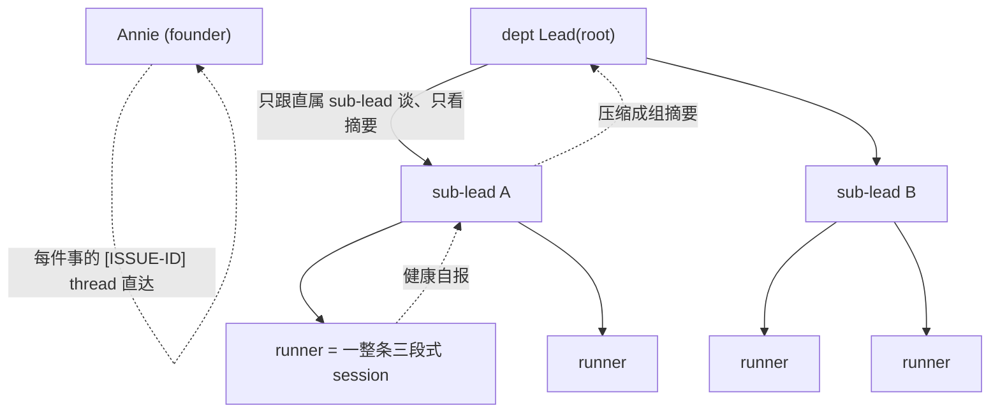
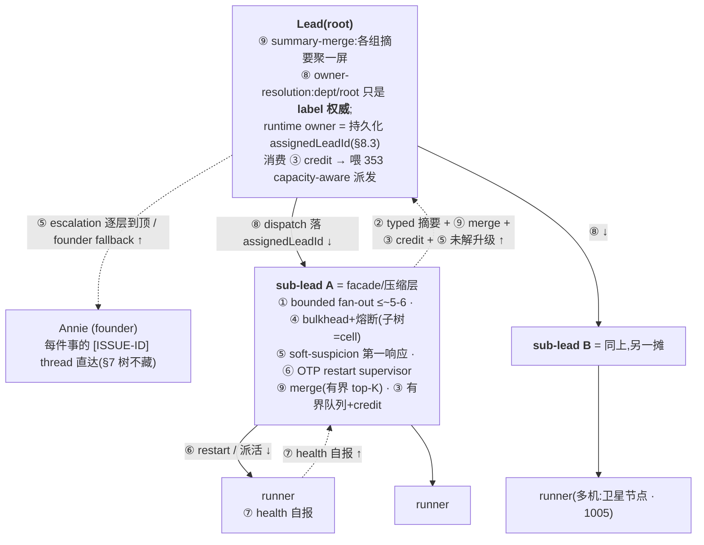
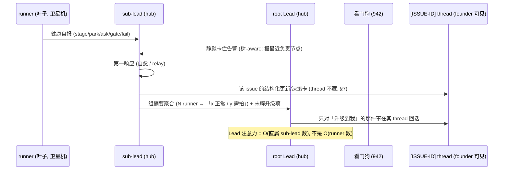

# FLY-1022 树状 Lead 指挥(层级化 runner 管理)— PRD

Issue: FLY-1022 (https://linear.app/geoforge3d/issue/FLY-1022/lead-scaling-one-lead-managing-many-runners-via-a-tree-hierarchical)
日期: 2026-07-08
基于: product/doc/FLY-1022-hierarchical-runner-tree/{exploration.md, research.md, tree-patterns-research.md(grounded 机制调研 + ChatGPT DR 记录), hierarchical-runner-tree-design.html}(Annie co-eval v1 已 GO;§4 概念化 DDIA 段已换成 grounded 机制;§4.1b/§4A 已 fold 真跑的 ChatGPT Deep Research 实质——精确一手引用 URL 待人手导出补,substance 先落地)

> **状态:draft PRD —— build 是 scale-gated 的。** Annie co-eval 后拍板:**PRD 现在写**(把设计 + 接口 + 拆分想清楚),
> **工程实现等两个 gating 条件都满足再启**(§11:看门狗 FLY-942/878/927 落地 + 一层结构稳定跑几天)。本 PRD 只定
> **产品行为 + 机制 + 工程约束 + 拆分**;具体 eng 实现 = **Tadashi**。凡未验证处标 UNKNOWN,不硬编答案。

---

## 1. 背景与问题

一个 Lead 今天**直接、平铺**地带它启动的每一个 runner。research 核过码的瓶颈(`research.md §1`):

- 三个 poller(`GatePoller` / `HeartbeatService` / `RunnerIdleWatchdog`)并行检测 runner 事件,但**全部扇入同一个
  per-Lead 收件箱**、被**一个 Lead 进程一轮一轮**(`LeadInputRouter` SERIAL / FLY-85)消化 → 注意力 ≈ O(1/N)、context ≈ O(N)。
- **带日期的铁证**:idle 轮询被从 30s 全局拉到 ~1h(`stuck-escalation.ts:87-104`,FLY-628),因为「每个误报都要 Lead
  reload 整个 context、烧 token」。
- 准入**不设上限**(`runner-admission.ts`,老的 `maxConcurrentRunners=3` 已退役)→ 没东西挡着一个 Lead 被塞 20+ runner。
- **活证据**:PRD 撰写当晚,产品 Lead 一个人平铺带 ~10 runner、差点漏终端 prompt。

**净问题**:runner 容量(1005 横轴)可以无限涨,但**一个 Lead 的脑(注意力+context+单线程)是有限的**;平铺撑不住。

---

## 2. 北极星 / 目标 / 非目标

**North Star**:**让一个 Lead 能可靠指挥远多于今天(5-6)的 runner —— 通过把「带 runner」分层、Lead 只看压缩后的摘要,
而不牺牲「每件事 founder 都看得见、没人静默卡死」。**

**目标**
- G1 把 Lead 的注意力成本从 **O(runner 数)** 降到 **O(直属 sub-lead 数)**(§4 压缩层)。
- G2 观测**树-aware**:静默失败沿树**层层上报**,不直接顶穿到最上层 Lead(§5,喂回 FLY-942)。
- G3 **每件 issue 照样有自己的 `[ISSUE-ID]` thread 直给 founder** —— 树压缩的是 Lead 的注意力,**不是**隐藏 thread(§7 硬约束)。
- G4 设计**留多层位**(lead→sub-lead→sub-sub-lead),但 **MVP 只落一层 sub-lead**(§3)。
- G5 跟 1005 多机、1020 模板、353 引擎**干净合成、不打架**(§6/§8)。

**非目标(本 PRD 明确不做)**
- N1 **不覆盖 353** 的 capacity-aware 派发 / session-decouple / DAG 编排(§6 划界)。
- N2 **不重造观测检测逻辑** —— 复用 FLY-942/878/927,只让它 tree-aware(§5)。
- N3 **不做**递归任意深树 / sub-lead 自动开 sub-lead / 复杂负载均衡调度 / sub-lead 横向协商 / 跨机自动 rebalance(§10 砍单)。
- N4 **不改** ship / merge 授权 —— 永远 founder-gated(§12)。
- N5 **不拆** runner 内部的三段式 session 成更细节点(§6.节点粒度,防通信爆炸)。

---

## 3. 三个相关但不同的轴:353 / 942 / 1022(§6 澄清)

Annie 明确要求把这三者划清 —— 它们**都在解「一个 Lead / fleet 怎么 scale」,但方向/层面不同,叠着用**:

| 轴 | 它解决的 | 一句话机制 | 归属 |
|---|---|---|---|
| **FLY-353** | **派什么 / 派多少** | **capacity-aware 派发**:Lead 手上满 N 件就不再往它派新活(+ DAG 自动编排) | 353(本 PRD 不碰) |
| **FLY-942** | **谁卡了没人管** | 静默失败**检测**(系统级看门狗)+ Lead=**响应**;事件驱动 + 去重 + 分类 | 942(已 done PR #506;本 PRD 增强它) |
| **FLY-1022(本)** | **一个 Lead 能带几个** | **提高单 Lead 能带的 runner 数**:分 sub-lead / 树状压缩指挥 | 1022 |

**三者互补**:353 控制**流入**(不把 Lead 灌爆);1022 抬高**单 Lead 的容量上限**;942 保证**无论多少 runner 都没人静默卡死**。
1022 的树让 942 有了「层层上报」的结构,让 353 的派发目标从「Lead 直连 runner」变成「Lead→sub-lead→runner」。

> **⭐ 353 vs 1022 精确界(Cass dedup)**:353 = 让一个脑**装更多 + 少手动 assign**(capacity-aware 流控);
> 1022 = 树状**压缩**让一个脑**够得着更多**。**本 PRD 只做 1022 的树;353 的流控/编排只引用、不实现。**

---

## 4. 核心机制:树 = facade / 压缩层 + 树聚合(DDIA)

### 4.1 拓扑与压缩

- **压缩层(树的核心价值)**:Lead 只跟**直属 sub-lead**谈、只看**组摘要**(如「A 组:3 正常 / 1 卡在 X 要你拍」),
  不看每个 runner 的原始细节。Lead 注意力 = O(直属子节点数),而非 O(runner 总数)。
- **为什么能 scale**:只要每个节点的**直属子节点数**保持在「一个脑扛得住」(≈今天的 5-6),总容量随层数**指数级**涨(§4.2)。

### 4.1b ⭐ ChatGPT Deep Research 背书(真跑:8 分钟 / 29 citations / 521 searches)

> 按 Annie 要求真跑了一轮 **ChatGPT Deep Research**(标题『Hierarchical Command Trees for Autonomous Coding Agents』,
> conversation 6a4f1346)。它的 executive 结论**独立**收敛到跟本 PRD **同一套设计判断**(它用了 29 个一手引用、521 次检索),
> = 方向的第三方背书。原文实质:

- **树 = bounded-fan-out 聚合 + 监督层级(supervision hierarchy),不是『加标签的平铺派发』** —— 正是本 PRD §2/§4 的核心 framing。
- **最可借的三处**:① associative tree aggregation(健康/负载/结果摘要上汇,§4.2)· ② high-fan-out 平衡树 + minimal-movement
  hashing(加/分/合/重分配子节点,§4A-6/7)· ③ **backpressure + supervision**(防过载/故障子树污染全局,§4.4/§5)。
- **⭐ 小规模(几十 agent)人在环最该先上的 6 条(= 本 PRD 的 MVP 清单,DR 独立收敛到同一批)**:固定小 fan-out ·
  typed associative summaries · **带显式 credit 的有界队列(bounded queues with explicit credits)** · 子树边界 circuit-breaker + bulkhead ·
  **soft-suspicion-before-declare** 故障检测 · **Erlang 式 restart 策略**。
- **⭐ 此规模下通常过早(= 本 PRD 的 later 清单)**:full gossip membership · heavy virtual-node hashing · LSM 式后台 compaction。

**净意义**:DR 用 29 个一手引用**独立**收敛到跟我 web-research 完全一样的 **MVP-vs-later** 判断 → 方向可信、非我一家之言。
DR 相对我 web-research 新增可落的一条 = **『有界队列 + 显式 credit』**(比『背压』更具体的容量语义,见 §4.4 强化)+ **Erlang/OTP supervision**
的 restart 策略语言(见 §4A-9)。**精确一手引用 URL** 因跨域 iframe 自动导出被挡(FLY-541,Tadashi 修根因中)暂缺,补齐后升级 §4A 的来源;
**substance 已先落地**(本节 + §4A + §5)。

### 4.2 树聚合 = 部分聚合上汇(partial aggregation,不是概念是成熟机制)

> 详见 §4A-1 + grounded 调研 `tree-patterns-research.md §1`(机制 + 权衡 + 来源)。这里只落设计。

- **机制**(抄 Spark `treeAggregate` / MapReduce combiner):叶子(runner)自报健康 → 每层 sub-lead **做部分聚合**、只把**聚合值**往上送 →
  **对数轮**收敛到 root。root Lead 拿到的是「几组摘要」,不是 N 个原始细节。
- **⭐ 权衡(直接约束 §9 schema)**:部分聚合**只对 associative+commutative 的聚合成立**(count/max) → 顶层拿到的**必然是有损摘要**、细节留下层。
  → **§9 的健康摘要 schema 必须是「可结合聚合」**(计数 + 冒泡的少数异常个案),**不能**把每个 runner 的原始 pane 往上堆。
- **容量算术(说明上限,非 MVP 目标)**:1 → 5 → 25 → 125……每层 ×~fan-out。**MVP 只一层(§3):1 Lead → ~5 sub-lead → ~25-30 runner**,已远超今天 5-6。
- **fan-out 上界 = 认知容量**(`research §8` LSM 放大权衡):每 sub-lead 带多少 runner = fan-out;宽=树浅升级跳数少但聚合重、窄=树深。
  我们的 fan-out **被「一个脑扛得住」天然钉在 ≈5-6**(认知瓶颈,不是磁盘),不用调到 128。

### 4.3 借来的成熟机制总览(每条:抄什么 + 权衡 + 来源见 research)

> **⭐ 这张表替换原来那句概念化的「DDIA 参考」** —— 每条都是 DB/分布式里几十年的成熟机制,`tree-patterns-research.md` 有机制+权衡+一手来源。

| 能力 | 借的机制 | MVP? | 权衡(诚实) |
|---|---|---|---|
| 健康/负载往上压 | **部分聚合**(Spark treeAggregate / combiner) | ✅ | 只能 associative 聚合、顶层有损(§4.2) |
| Lead 委派给 sub-lead | **两级调度**(Mesos two-level) | ✅ 一层 | **root 失全局细粒度视图**、跨组抢占难 → 故 MVP 一层、跨组回 root(§4.4) |
| 隔离卡住的子树 | **bulkhead / cell + circuit breaker** | ✅ | 隔离降利用率(可接受,注意力隔离本就是目的)(§4.4) |
| 过载往上传 | **背压 = 容量信号**(Reactive Streams) | ✅ 接 353 | 故意压过载吞吐换不崩;待办必须有界(§4.4) |
| 谁卡了、别误报 | **SWIM-inspired suspect-before-declare(gossip later)** | ✅ 喂回 942(仅 suspect-before-declare) | MVP 检测仍集中式 O(N);SWIM 扩展性保证 = later(§5) |
| 何时加/合并 sub-lead | **B-tree 分裂/合并**(滞回阈值) | ⏸ later | churn/thrash → MVP 手动配置,不自动(§10) |
| runner 分到哪个 sub-lead | **一致性哈希 + vnode** | ⏸ later | 环/vnode 元数据复杂,小规模过度 → MVP 静态分配(§10) |

### 4.4 三条 MVP 就抄的机制,落到设计

- **子树隔离(bulkhead / cell)**:每个 sub-lead 的子树 = 一个**隔舱 / cell**,blast radius = 1/(sub-lead 数)。一个 runner 或整组卡住,
  **隔在该子树内、不级联**到兄弟组或 root。**circuit breaker**:若某 sub-lead **自己**冻住/失联,root **跳闸**它 → 重路由或直接升级 founder,不干等。
- **⭐ 背压 = 353 的容量信号(精确接缝)**:sub-lead 饱和(它那摊到容量)→ **向上发背压** → root / **353 派发器停止往这个子树派新活**。
  **sub-lead 的饱和信号,就是 353 capacity-aware 派发消费的容量信号** —— 1022 的树和 353 的流控**用「背压」这一个机制接上**,不是两套东西。
- **两级委派的已知代价(写清、不装没有)**:委派给 sub-lead = root **失去对单个 runner 的全局细粒度视图**(跨组优先级/抢占难,Mesos 两级的经典代价)。
  → **这正是 MVP 只做一层、跨组协调仍回 root / founder 的原因**。是取舍,不是缺陷。

---

## 4A. Grounded 机制目录(详版 —— 全搬进 PRD,不外链)

> Annie/Lead 要求 PRD 详细、别浓缩(353/1005 都栽在 PRD 太精简)。故把 `tree-patterns-research.md` 的实质**全搬进这里**。
> 9 条机制,每条:**机制 / 权衡(尽量定量)/ 来源 / 映射到我们的树 / MVP-or-later**。ChatGPT DR(29 引用)+ 我 web-research(14 源)**双重印证**。
> **来源标注(Annie 未选 A/B,不再等 —— 次要问题)**:本目录的机制来源 = 我 web-research 的 14 条一手来源(`tree-patterns-research.md §11`)
> + ChatGPT DR 的 executive 结论(§4.1b)。**DR 报告内那 29 条精确 primary-source URL 待补** —— 自动导出被跨域 iframe hit-test 挡
> (FLY-541,Tadashi 修根因中);**substance 与架构不受影响**,URL 属可后补的精确度问题。

**4A-1 · 部分聚合上汇(partial aggregation / tree aggregation)** `MVP`
- **机制**:叶子产局部结果 → 中间层 sub-lead **先做部分聚合、只送聚合值** → **对数轮**收敛到顶。抄 Spark `treeAggregate` / MapReduce combiner / rack combiner(机架层 fan-in)。
- **权衡(定量)**:部分聚合**只对 associative+commutative 聚合成立**(count/max/sum);Spark `treeAggregate` 把 driver 负载从「收 O(partitions) 份」降到「对数轮通信」。顶层拿到的**必然有损**(压掉明细)。
- **来源**:Spark treeReduce/treeAggregate;MapReduce combiner。
- **映射**:sub-lead 把 N runner 压成**可结合聚合**(状态计数 + 冒泡的少数异常)。→ 直接约束 §9 的健康摘要 schema。
- **MVP**:✅。

**4A-2 · 两级调度委派(two-level scheduling)** `MVP(一层)`
- **机制**:拆开「资源分配」与「任务放置」;上层把资源 offer/派给下层独立调度器,下层自定放置。抄 Mesos(首创两级)。
- **权衡**:下层**看不到全局放置选项** → root **失全局细粒度视图、跨组优先级抢占难**;Mesos 在「job 远小于集群 + 短命」时好,gang-schedule 靠囤积会死锁。委派 = 用全局视图换可扩展。
- **来源**:Mesos/Omega/Borg survey (umbrant)。
- **映射**:Lead = 资源管理器,派给 sub-lead(它对它那摊就是「那个 Lead」)。→ **这条代价正是 MVP 只一层、跨组协调回 root/founder 的原因**(取舍,非缺陷)。
- **MVP**:✅(仅一层)。

**4A-3 · 子树故障隔离(bulkhead + circuit breaker + cell)** `MVP`
- **机制**:**隔舱**=资源分独立池,一处失败不耗尽全局、限 blast radius;**熔断**=某依赖反复失败→跳闸停打、防级联、优雅降级;**cell**=blast radius 1/N(可靠性变成可调 scaling 旋钮)。
- **权衡**:隔离**限爆炸半径但降利用率**(被隔开的空闲 slack 不共享)—— 对我们可接受(注意力隔离本就是目的)。
- **来源**:Azure Bulkhead pattern;cell-based / blast radius。
- **映射**:每个 sub-lead 子树 = 一个**隔舱/cell**,一组卡住不级联到兄弟组/root;若某 sub-lead **自己**冻住→root **跳闸**它、重路由或升级 founder。= 「检测+隔离卡住子树」的成熟对应。
- **MVP**:✅。

**4A-4 · 背压 = 容量信号(backpressure + 显式 credit)** `MVP(接 353)`
- **机制**:下游处理不过来→**向上游发信号减速**,不让队列无界膨胀。抄 Reactive Streams(subscriber `request(n)`);**DR 补强:带显式 credit 的有界队列**(sub-lead 显式声明「我还能收 n 个」)。
- **权衡**:背压**故意压过载时吞吐**换不崩;待办**必须有界**(无界缓冲→OOM/级联)。
- **来源**:Reactive Streams;GfG back pressure;DR『bounded queues with explicit credits』。
- **映射**:sub-lead 饱和 → 向上发背压/credit=0 → **root/353 停止往这个子树派新活**。**sub-lead 的 credit,就是 353 capacity-aware 派发消费的容量信号** —— 树与 353 用「背压/credit」一个机制接上,不是两套东西。
- **MVP**:✅。

**4A-5 · 可扩展故障检测(SWIM / gossip)** `MVP(喂回 942)`
- **机制**:outsourced heartbeat + gossip 传播;**检测时延/误报率/每进程消息负载与组大小无关**(传统 heartbeat 是 O(N²));传播时延随成员数**对数**增长;**suspect-before-declare**(先怀疑再宣告)降误报。
- **权衡**:弱一致(失败几轮才传到顶)—— 对异步 + 人在环完全可接受。
- **来源**:SWIM(Das/Gupta/Motivala 2002);DR『soft-suspicion-before-declare』。
- **映射(⭐ MVP 只取 suspect-before-declare,不继承 SWIM 复杂度保证)**:MVP 从 SWIM **只借『先 suspect 再 declare』这一条**给 942
  加软怀疑态(sub-lead 先加一档观察再升级)→ 治 FLY-218/220 误报。**SWIM 的『负载与组大小无关 / 对数传播 / 避免 O(N²)』MVP 不成立** ——
  MVP 检测仍是看门狗集中式 O(N) 扫描;那些扩展性保证要真上 gossip/outsourced-heartbeat(= later『分布式检测』项,§5)。
- **MVP**:✅ 只『suspect-before-declare』喂 942(§5);⏸ gossip 扩展性 = later。

**4A-6 · 何时加/合并 sub-lead(B-tree 分裂/合并)** `later 留位`
- **机制**:节点满→**在中位数分裂**成两个;占用率跌破阈值(underflow)→**合并/借**兄弟;大 fan-out 保持树浅而快。
- **权衡**:分裂/合并有 churn;频繁增删会 thrash → **滞回阈值**(高水位分裂、低水位合并、中间留 gap);Postgres 为并发**不做** underflow 合并(极端取舍案例)。
- **来源**:B-tree (Wikipedia);B+tree underflow merge-or-borrow。
- **映射**:sub-lead = 有容量(≈5-6)的树节点;超容量→分裂(挪一半 runner,中位分割保平衡);两个都低→合并退休一个。**MVP 手动/配置,不自动**(防 thrash + 复杂度)。
- **MVP**:⏸ later(只留 schema 位)。

**4A-7 · runner 分到哪个 sub-lead(一致性哈希 + 虚拟节点)** `later 留位`
- **机制(此处数字是直觉/类比,非我们要兑现的保证 —— Codex R1)**:一致性哈希——加/删一个节点只重映射「一小部分」key(数量级 ~K/N;朴素取模几乎全重映射),
  多 key 时**虚拟节点**能显著抹平负载偏斜(具体偏斜依 key 数 / vnode 数 / 权重 / 哈希质量而定)。
- **权衡**:环 + vnode 的**元数据复杂度**;我们只有一小把 sub-lead(key 极少)时**过度设计**(DR:heavy virtual-node hashing 此规模过早)。
- **来源**:Dynamo consistent hashing + virtual nodes。
- **映射**:**MVP 用简单静态/轮询分配就够**;要动态增删 sub-lead 又不想全体重洗时才上。
- **MVP**:⏸ later。

**4A-8 · 每 sub-lead 该带多宽(fan-out 放大权衡,LSM 视角)** `写进 PRD 取舍`
- **机制/权衡(用作类比,非精确 LSM 建模 —— Codex R1)**:LSM 的 fan-out 直观说明「浅 vs 宽」取舍(fan-out 大→树浅但每层聚合重;
  fan-out 小→树深、跳数多、时延高)。一般:宽(每 sub-lead 带更多 runner)= 树浅、升级跳数少、查任意 runner 状态快,但每 sub-lead 聚合负担重;窄 = 树深、跳数多。
  (LSM leveled/tiered 的精确写/读/空间放大权衡不是本产品决策所需,略。)
- **来源**:RocksDB compaction(leveled/tiered);leveled compaction overview。
- **映射**:每 sub-lead fan-out **上界 = 认知容量 ≈5-6**(人/agent 注意力瓶颈,不是磁盘)→ 我们的 fan-out 天然被认知容量钉住,不用调到 128。
- **MVP**:写进 PRD 的取舍(定 fan-out 默认值 ~5-6)。

**4A-9 · ⭐ 进程监督树(Erlang/OTP supervision tree)** `MVP 策略语言(DR 新增)`
- **机制**:supervisor 监督一组 children,按 **restart strategy**(`one_for_one` 只重启挂的那个 / `one_for_all` 全组一起重启 / `rest_for_one` 重启它及其后的)恢复;**restart intensity** 限流(`max_restarts` / `period`,超了 supervisor 自己「放弃」并上报**它的**父 supervisor);**let-it-crash**(不试图修复坏状态,直接重启到干净态)。
- **权衡**:重启**丢进程内存态**(我们靠 progress.md / FLY-353 session-log 重建工作态,不在本 issue 范围);restart intensity 防「重启风暴」。
- **来源**:Erlang/OTP supervisor 官方文档(DR 引)。
- **映射**:**sub-lead = 它那摊 runner 的 supervisor**;runner 反复失败**超 restart intensity** → sub-lead 停止重试、**上报父级**(逐层,§5)——正好给「子失败该怎么办」一套成熟词汇,呼应 942「失败 3 次问 founder」+ 现有 runner retry。let-it-crash ≈ 我们的「坏 worktree 清掉重派」。
- **MVP**:✅(策略/契约层;具体重启复用现有 runner retry + 942 升级,不新造引擎)。

---

## 4B. 整体架构:9 机制装进树(给 Tadashi 一眼看清「怎么拼」)

> Annie 拍板加这张。目的:把散在 §4A/§5/§8.3/§9 的机制**装进 Lead→sub-lead→runner 树、标清每个在哪一层**,让 Tadashi 一眼看清怎么拼。
> **可建 = research(抄什么,`tree-patterns-research.md`)+ PRD 契约(grounded,§4A/§5/§8.3/§9)+ 这张架构(怎么拼)+ §13 build 拆分。** 产品/机制层,不下实现细节(那是 build 时的活)。
> 视觉版(inline SVG,Apple-light,参 353 风格)见终审卡;此处 Mermaid 等价。

**9 机制装在哪一层(每个标 §ref):**

| # | 机制 | 装在哪一层 | 干什么 |
|---|---|---|---|
| ① | bounded fan-out | **sub-lead** | 每个 sub-lead ≤~5-6 runner(认知容量钉 fan-out,§4A-8) |
| ② | typed 摘要上汇(partial aggregation) | **sub-lead → Lead 边(↑)** | 部分聚合成可结合的 typed 摘要(§4A-1/§4.2) |
| ③ | 有界队列 + credit(backpressure) | **sub-lead → Lead 边(↑)** | 饱和发背压 credit → Lead/353 停派该子树(§4A-4) |
| ④ | circuit-breaker + bulkhead | **sub-lead 子树** | 子树 = cell,隔离卡住;sub 自身冻住则 root 跳闸(§4A-3) |
| ⑤ | soft-suspicion(SWIM-inspired) | **sub-lead(第一响应)→ 逐层** | 先疑再判死 + 层层升级到 founder(§5) |
| ⑥ | OTP restart | **sub-lead → runner 边(↓)** | sub-lead = 它那摊 runner 的 supervisor;超 restart intensity 上报父级(§4A-9) |
| ⑦ | health-rollup | **runner → sub-lead → Lead(↑)** | 叶子自报 → 逐层聚合压缩(§4.2/§9) |
| ⑧ | owner-resolution(assignedLeadId) | **dispatch 边 + 所有事件路由** | label=dept/root 权威;dispatch 落 assignedLeadId;所有 owner-resolve 路径优先 session owner(§8.3,MVP 最硬) |
| ⑨ | summary-merge | **每个父节点(sub-lead + Lead)** | 有界 top-K + droppedCount,任意序 merge 结果一致(§9) |

**一句话拼法**:runner 自报(⑦)→ sub-lead 用 ①④⑤⑥ 管住一摊、用 ②⑨ 压成 typed 摘要、用 ③ 发容量信号 → Lead 用 ⑨ 聚一屏 + ⑧ 保证事件落对节点 + 把 ③ 喂给 353;卡住沿 ⑤ 逐层升到 founder;每件事的 thread 始终直达 founder(§7)。

---

## 5. ⭐ 942 变 tree-aware(依赖 / 增强,喂回 942)

**这是本 PRD 对 942 的增强,不是新观测系统。** 现状(942 PRD)= 看门狗检测到 runner 静默停车 → 报给**那个 dept Lead**。
树落地后,报告落点要改成**沿树走**:

- **检测不变**:仍是 FLY-942/878/927 的系统级看门狗(状态型 + 通信感知 + 可配置阈值,零 token 纯文本比对)。**一行检测逻辑不重写。**
- **⭐ 落点变**:看门狗判定某 runner 静默卡住 → **报给它的直属 sub-lead(最底层),而不是直接顶到 root Lead**。
- **层层上报(escalate)**:sub-lead 是**第一响应人**(942 契约:Lead=响应);它先自愈 / relay。**只有 sub-lead 层解决不了、
  或 sub-lead 自己应答超时**,才升级到它的父节点;逐层向上;最终才到 root Lead / founder(沿用现有 stuck→founder 深层页)。
- **⭐ SWIM-inspired suspect-before-declare(`research §5`)**:sub-lead **先「怀疑」(加一档观察)、确认才「宣告」升级** ——
  不一有静默就顶到上层。直接治 FLY-218/220 的**误报**病(整屏哈希漂移 / 回声导致的假阳)。
- **⭐ MVP 具体状态机(Codex R1 校正:MVP 检测逻辑没换,别继承 SWIM 的复杂度保证)**:
  `suspected_stuck`(看门狗判静默超**可配置阈值**)→ **直属 sub-lead 第一响应**(自愈 / relay)→ **sub-lead 应答超时**(942 §2 的应答时效阈值)
  → 冒泡到 parent → 逐层 → 最终 **founder fallback**(现有 stuck→founder 深层页);全程**持久化去重**(沿用 942)。
- **[later,不在 MVP]** SWIM 的『每进程负载与组大小无关 / 传播对数增长 / 避免 O(N²)』**只有真上 gossip / outsourced-heartbeat 才成立**;
  **MVP 检测仍是看门狗集中式 O(N) 扫描**(`RunnerIdleWatchdog` 串行扫所有 running session,Bridge 侧 O(N))。要那些扩展性保证 = 另立
  『分布式检测(SWIM/gossip)』**later 项**,别在 MVP 宣称。—— 树 MVP 的收益是**注意力压缩 + 分层第一响应**,不是检测负载的复杂度改善。
- **健康摘要走同一条上报路**:sub-lead 周期把「本组健康摘要」聚合上报(§4.2),看门狗的**告警**并进这条摘要流(带类型:
  `✅ 干完等拍` / `🔴 卡住在等谁` / `🟡 已替你决定`,942 §3 的结构化通知)。
- **喂回 942**:这条「树-aware 落点 + 层层升级 + sub-lead 应答时效」作为 **FLY-942/878/927 的一个增强项**记回去
  (看门狗的「升级对象」从「那个 Lead」泛化成「树上最近的负责节点」)。**本 PRD 列需求,实现跟 942 的看门狗实现同步。**

> 依赖方向:**1022 的树把「向谁上报」结构化;942 的看门狗把「谁卡了」检测出来。** 两者必须一起收口 ——
> 这也是 §11 gating 条件把「看门狗落地」列为树 build 前置的原因(树是放大器,必须先有可靠检测)。

---

## 6. 节点粒度:一个节点 = 一整条三段式 session(⭐ 不拆)

- **树上的一个叶子节点 = 一个 runner 跑的一整条 workflow(如三段式 设计→实现→QA)当作<u>一个整体</u>**,
  **不**把三段式内部拆成三个树节点。理由:拆散会**通信爆炸**(每个子阶段都要独立上报/被指挥),正好是 1022 要治的病。
- **跟 FLY-1020 对齐**:1020 定「一个 issue <u>怎么跑</u>(哪套模板/DAG)」;1022 把「跑这条模板的**整条 session**」作为树上一个
  被指挥的单元。**模板(1020)是节点<u>内部</u>怎么编排;树(1022)是节点<u>之间</u>怎么指挥。两层解耦、互不侵入。**
- 含义:sub-lead 管的是「N 条完整 session」,不是「N×3 个子阶段」;它对上汇报的粒度 = 每条 session 一个状态。

---

## 7. ⭐ per-issue thread 保留(硬约束):压注意力 ≠ 藏 thread

**Annie 硬约束:树压缩的是 Lead 的<u>注意力</u>,绝不是隐藏 founder 的可见性。**

- **每件 issue 照样有自己的 `[ISSUE-ID]` thread**(产品体验 spec §2.4 / FLY-270),**直接给 founder 看** —— 树**不藏、不合并、不吞** thread。
- **两条正交的路**:
  - **注意力路(树压缩)**:runner 健康/进展 → sub-lead **聚合成组摘要** → 逐层上到 root Lead。Lead 看的是**摘要**,不被 N 个细节淹。
  - **可见性路(不压缩)**:每件事该进它自己 `[ISSUE-ID]` thread 的更新/决策卡,**照进**(942 §3:结构化通知自动进对应 thread)。
    founder 想看某件事的细节,永远能在那条 thread 里看到全貌。
- **谁把内容写进 thread**:沿用现状 —— runner 发不了 Discord,**由负责的 Lead / sub-lead 写进 thread**(树里改成:该 runner 的
  直属 sub-lead 负责写它那些 issue 的 thread)。**thread 的所有权下放到 sub-lead,但 thread 本身照常一件一条、直达 founder。**

**⭐ 频道 / 权限契约(Codex R1:别让 founder 可见性漂了)**:现状 `chat_threads` 按 `(issue_id, channel_id)` 唯一
(`StateStore.ts`),注册时校验 registering Lead 已配置 + 频道 == 该 Lead 的 `chatChannel`(`chat-thread-register.ts`)。树落地要定死:
- **canonical issue-thread 频道 = root 部门频道,或一个<u>显式配置的、founder 可见的</u> sub-lead 频道 —— 不留隐式**。sub-lead 若用自己的 `chatChannel`,该频道必须 founder 可见,否则可见性会从现有 dept-lead 频道契约漂走。
- **sub-lead 的 bot 在 canonical 频道必须有 send / thread 权限**(分配前校验),否则它 owned 的 thread 写不进去。
- **一件 issue 不得 fork 成 root + sub-lead 两条 founder thread** —— 除非显式升级、且带 cross-link。
- **测试**:注册 / 防重复 / 投递 / archive / sub-lead-owned thread 的 founder 可见性。

---

## 8. 多机放置(与 FLY-1005 合成)+ Lead-as-child 通信

### 8.1 放置(1005 节点池)
- **lead + sub-lead 都跑在 hub 机**(它们是「脑」,需要 hub 的 StateStore/CommDB/mailbox 本地文件);
  **runner 跑在节点池 / 卫星机**(1005 横轴)。
- sub-lead 是**注意力单位**(每一摊 runner 一个),runner 的**部署单位**是 1005 的节点 —— **两者不强绑**:
  一个 sub-lead 那摊 runner 可以分散在多台卫星机上。(倾向:同组 runner 尽量同机以省跨机 relay,但不是硬性;§14 开放。)

### 8.2 Lead-as-child 通信(核心新增角色)
- 现状:`LeadConfig`(`ProjectConfig.ts`)扁平 `leads[]`、零层级字段;通信是 Bridge→单个 `LeadRuntime`(per leadId)。
- **本 PRD 加的是「一个 Lead 能当另一个 Lead 的孩子」这层角色**:sub-lead **向上**汇报组摘要(当另一个 Lead 的 runner-源)+
  **向下**派/带自己那摊 runner。
- schema:`LeadConfig` 加 `parentLeadId?`(可空;root Lead 不设)—— 定义树边;dispatch 多一跳(Bridge 派给 sub-lead 而非直连 runner);
  上报走现有 `LeadRuntime`/CommDB 投给 parent。
- **字节兼容**:`parentLeadId` 不设 = 今天的扁平行为,零变化(default-off,MVP 只给需要的 Lead 挂一层)。

### 8.3 ⭐⭐ Tree-aware owner-resolution 契约(Codex R1 blocker —— 最硬的实现接缝,别低估)

> **`parentLeadId + dispatch 多一跳` 远不够。** Codex 核过码:今天**多条关键路径重新从 issue label 解析 owner Lead**,不是从树。
> 若 sub-lead 成为 runtime owner 但 issue 仍带 root 部门 label,gate/stuck/thread 事件会被跳过或落到 root;若 root 与 sub-lead
> 同部门 label,`DepartmentRegistry` 会把 issue 判成 ambiguous。—— 这条不解决,树在现有 label 路由上根本落不对地方。

**现状(核过码,Codex 确认)**:
- `/api/runs/start` 从 label 自动解析 `leadId`(`runs-route.ts:399-410`)+ 按该 canonical Lead enforce 部门 scope(`:432-465`)。
- `resolveLeadForIssue()` 返回扁平 `leads[]` 里**第一个 label 命中**的 Lead(`ProjectConfig.ts:988-1010`)。
- `GatePoller` 投递调 `matchesLead()`——**又**从 label 重解析,只有 label-derived Lead == 当前迭代 Lead 才投(`lead-scope.ts:51-59`,`gate-poller.ts:1068-1100`)。
- `HeartbeatService` / `RunnerIdleWatchdog` / stuck-escalation / thread / retry-phase-handoff 同理按 label-resolved / leadId 走。

**契约(MVP 必做,写成一个独立 build 前置 = B1.5)**:
1. **持久化 per-session 的 runtime owner**:dispatch 时给每个 session 落 `assignedLeadId`(= 该 runner 的直属 sub-lead)。
   **label = 部门 / root 权威;不再等于 leaf owner。**
2. **所有 owner-resolve 路径改为「优先持久化 session owner、缺失才 fallback 到 label 解析」**:`matchesLead` /
   `RuntimeRegistry.resolveWithLead` / `HeartbeatService` / `RunnerIdleWatchdog` / stuck-escalation / artifact+event 投递 /
   retry+phase handoff / thread 路由。**一处不改,那类事件就漏到 root、树白搭。**
3. **校验 `parentLeadId`**:同 project 内、拒 orphan parent / 环 / 跨部门 parent / 不安全的 root+sub 同 label spawn 组合。
4. **测试**:(a) byte-compat —— 不设 `parentLeadId` = 逐字现状路由;(b) tree —— gate/stuck/idle 事件确实落到**最低负责 sub-lead**。

> **净意义**:这是 1022 真正的实现重心(不是 `parentLeadId` 一个字段)。§13 把它抽成 **B1.5** 排在 B2 前;PRD 明确列全部要改的
> owner-resolve 路径,免得 Tadashi 只改 dispatch 一处、其余照 label 漏到 root。

---

## 9. 数据流 / schema(给 Tadashi 的实现锚点)

- **健康摘要 schema(草案,co-eval / 实现细化)**:`{groupId, subLeadId, counts:{running, parked_ok, needs_founder, stuck}, saturation:{capacity, inUse}, escalations:[{issueId, kind, waitingOn, sinceMs}], droppedEscalationCount}`。
  —— **必须是 associative aggregate**(`research §1`:部分聚合只对可结合函数成立):计数可结合、`saturation` 是背压/容量信号(§4.4 喂 353)、
  `escalations` 是冒泡的少数异常个案。**压掉每 runner 的原始 pane 细节**;顶层拿的是有损摘要,细节留下层。
- **⭐ merge 函数(Codex R1:必须在 PRD 定死,否则 escalations 无界会退回 O(runner 数)、不是压缩层)**:
  - `counts`:按状态**求和**。
  - `saturation`:同时带**总量 + 瓶颈**(`{capacity:Σ, inUse:Σ, tightestFreeRatio:min}`)—— 求和给总容量,min 给「最挤的那组」(背压判定看瓶颈)。
  - `escalations`:**有界 top-K/组**,排序 = severity → `sinceMs`(久的优先)→ 稳定 `issueId`;超出的计入 `droppedEscalationCount`(让 root 知道被截断、可下钻)。
  - **验收:任意分组/任意顺序 merge 出的 root 可见结果一致**(可结合 + 确定性)。
- **确切阈值 / K 值 = §14 开放,Annie co-eval。**
- **升级判定**:sub-lead 应答超时(942 §2 的 Lead 应答时效阈值,可配置)→ 冒泡到 parent;逐层。
- **thread 所有权**:每个 `[ISSUE-ID]` thread 由该 runner 的**直属 sub-lead** owned(写更新/决策卡);root Lead 只在事被升级到它时介入该 thread。

---

## 10. MVP 范围(一层 sub-lead)+ 坚决砍

**MVP(§11 gating 满足后才启)**
- 只**一层 sub-lead**:root Lead → sub-lead → runner(两层指挥树)。
- sub-lead = **同一套 Lead 代码 + 一个精简「sub」角色 prompt**(职责:带一摊 runner + 聚合上报组摘要 + owned 那些 `[ISSUE-ID]` thread + 942 第一响应)。**不新造进程类型。**
- `LeadConfig.parentLeadId` schema + **⭐ tree-aware owner-resolution / 持久化 `assignedLeadId`(§8.3/B1.5,MVP 必做非细节)** + dispatch 多一跳 + 组摘要聚合上报 + 942 树-aware 落点(§5)。
- 每个 runner 的 `[ISSUE-ID]` thread 照常直达 founder(§7)。

**坚决砍(MVP 一律不做)** `later`(有成熟机制、只是现在不上,`research §6/§7`)
- 递归任意深树 / sub-lead 自动再开 sub-lead(只留 schema 位,不实现)。
- **自动加/合并 sub-lead**(机制 = B-tree 分裂/合并 + 滞回阈值,`research §6`)—— MVP 手动/配置,不自动(防 thrash)。
- **runner→sub-lead 动态 rebalance**(机制 = 一致性哈希 + vnode,`research §7`)—— MVP 静态/轮询分配。
- 复杂负载均衡 / 动态调度 / 跨机自动 rebalance。
- sub-lead 之间横向协商。
- runner 三段式内部拆节点(§6,永不做)。

---

## 11. ⭐ Scale-gate 条件(build 何时启)

**PRD 现在写、实现 scale-gated。两个 gating 条件<u>都</u>满足才启 build:**

1. **看门狗落地稳定**:FLY-942 定的观测(FLY-878/927)已实现且在跑 —— 因为**树是放大器**(多层 = 多处藏静默卡死),
   可靠检测是树的**硬前置**。没有它先加层 = 放大风险。
2. **基线(= 当前<u>扁平</u>一 Lead 层,不是本 PRD 的树)稳定跑几天**:当前 fleet 稳定性(FLY-774 家族)+ 单 Lead 平铺已稳定运行数天、基线不抖,再往上加指挥层。

> **⭐ 澄清(Codex R1:『一层』有歧义)**:这里的「一层」= **今天的扁平 root-Lead→runner 基线**,不是本 PRD 的 root→sub-lead→runner MVP。
> 即:先证明扁平基线稳,才建树。

**⭐ 可度量 go/no-go 清单(Codex R1:别只写散文,Tadashi 队列要能判)**——build 前四条全绿 + 证据贴到 Linear:
- FLY-942/878/927 **已 ship 且在生产跑 ≥N 天**(N 待 Annie 定,建议 3-5)。
- **无未决的看门狗误报风暴 / 投递积压超阈值**(claims.db / lead_events 无异常堆积)。
- **扁平 fleet 在当前目标负载下跑 ≥N 天零『静默漏 prompt』/ 零未投递 lead event**。
- 上述证据**附到 FLY-1022 的 Linear issue**;未附齐前,所有 tree build-issue 保持 `scale-gated`、不启。

**触发点(需求侧)**:1005 Phase 2 多机真把 runner 铺开、单 Lead 的 runner 数持续压过「一个脑扛得住」(≈5-6)时,树从「可选」变「需要」。
**在触发点之前**:353(capacity-aware 派发)+ 942(自动检测)先扛近期痛;树先停在「PRD + schema 位」。

> **每个 build-issue 都必须在描述里写明这两个 gating 条件 + 上面的 go/no-go 清单 + 触发点(§13)。** Tadashi 队列里标 `scale-gated`,不早启。

---

## 12. 护栏

- **不自 ship / 不自 merge**:PRD/实现的合入永远 founder-gated(沿用 founder-only-authority)。
- **per-issue thread 不藏**(§7 硬约束)—— 任何压缩不得降低 founder 对单件事的可见性。
- **字节兼容**:`parentLeadId` default-off,不挂 sub-lead 的项目零行为变化。
- **树不放大静默失败**:942 树-aware(§5)是并行硬前置(§11 gating)。

---

## 13. Build-issue 拆分(挂 Tadashi · 全部 scale-gated)

> 每条都标 **`scale-gated:等 FLY-942 看门狗落地 + 一层结构稳定跑几天后再启`**;PRD 写明 gating(§11)。**本 PRD 不 create、不 ship**,
> Honey Lemon QA + Annie 终审后再 create 交 Tadashi。

| # | build-issue(草案) | 内容 | 依赖 |
|---|---|---|---|
| B1 | **Lead-as-child schema + 树边** | `LeadConfig.parentLeadId`(default-off)+ 校验(拒 orphan/环/跨部门/不安全 spawn 组合)+ 树解析;字节兼容 sentinel | 无 |
| **B1.5 ⭐** | **Tree-aware owner-resolution 契约(§8.3,Codex R1 blocker)** | 持久化 per-session `assignedLeadId`;**所有** owner-resolve 路径(matchesLead / RuntimeRegistry / Heartbeat / IdleWatchdog / stuck-escalation / event+artifact 投递 / retry+phase handoff / thread 路由)改「优先 session owner、缺失 fallback label」;byte-compat + tree 路由测试 | B1 |
| B2 | **dispatch 多一跳** | Bridge 把活派给 sub-lead 而非直连 runner(§8.2),dispatch 时落 `assignedLeadId` | B1.5 |
| B3 | **组摘要聚合上报 + 背压 credit** | sub-lead 聚合本组健康 → 投 parent(§4.2/§9 schema + merge 函数,associative aggregate);摘要带 `saturation` credit → 353 消费(§4A-4) | B1.5 |
| B4 | **⭐ 942 树-aware 落点 + 层层升级** | 看门狗报最近负责节点 → sub-lead 第一响应 → 超时逐层冒泡(§5);**与 942 看门狗实现同步** | FLY-942 impl + B1.5 |
| B5 | **thread 所有权下放 sub-lead + 频道契约** | 每 `[ISSUE-ID]` thread 由直属 sub-lead owned、照常直达 founder;canonical 频道显式(root 部门频道 or 显式 founder-可见 sub 频道)+ sub-lead bot 权限校验 + 不 fork 双 thread(§7 频道契约) | B1.5 |
| B6 | **sub-lead 角色 prompt + restart 契约** | 同套 Lead 代码 + 精简「sub」role(带一摊 + 聚合 + owned thread + 942 第一响应 + OTP 式 restart-strategy/intensity 契约,§4A-9) | B1 |
| B7 | (later) 多层递归 / 智能分组 / 多机放置策略 | 只留位,MVP 不做(§10 砍单) | 后续 |

---

## 14. Non-goals 已在 §2;开放问题(co-eval / 实现)

- UNKNOWN **拐点**:sub-lead 自己也有 context 成本 —— 一摊几个 runner 时树才真划算?(需实测基线)
- **摘要 schema 定稿**:§9 草案压什么 / 留什么,Annie 要能一眼看懂哪组出事(co-eval)。
- **树 vs 机器分布对齐**(§8.1):同组 runner 是否强制同机?还是完全正交?
- UNKNOWN **Lead-as-child 通信最小改动点**:在现有 mailbox/CommDB/transport 上的确切落地(待 Tadashi spike)。
- **sub-lead 应答时效阈值**默认值(§5,接 942 §2 可配置阈值)。

---

## 15. 参考

- **⭐ grounded 机制调研**:`product/doc/FLY-1022-hierarchical-runner-tree/tree-patterns-research.md`(每条机制的具体做法 + 权衡 + 一手来源)——
  §4/§5 的设计全部落在它上面。含:部分聚合(Spark treeAggregate / MapReduce combiner)· 两级调度(Mesos/Omega/Borg survey)·
  故障隔离(Azure bulkhead / cell-based blast radius)· 背压(Reactive Streams)· 故障检测(SWIM,Das/Gupta/Motivala 2002)·
  B-tree 分裂合并 · 一致性哈希+vnode(Dynamo)· LSM leveled/tiered 放大权衡(RocksDB)。
- **DDIA**《Designing Data-Intensive Applications》—— 作总纲对照(分区 / 复制 / 背压 / 聚合章节);**具体机制以上面 research 的一手来源为准**。
- FLY-916(origin · Tadashi 树+可观测洞察,已并入本 issue)· FLY-1005(横轴多机 · 节点放置)· FLY-353(capacity-aware 派发 / DAG,划界不覆盖)·
  FLY-1020(节点内部模板,§6 对齐)· FLY-942 + FLY-878/927(看门狗 · §5 增强对象,已 done PR #506)· homerail(Manager/Node/Worker 中间层)·
  产品体验 spec §2.4(per-issue thread)。
