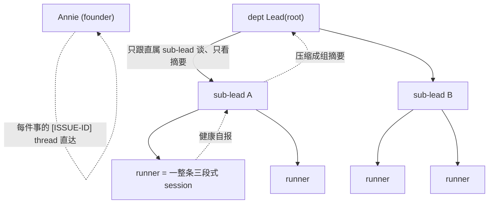
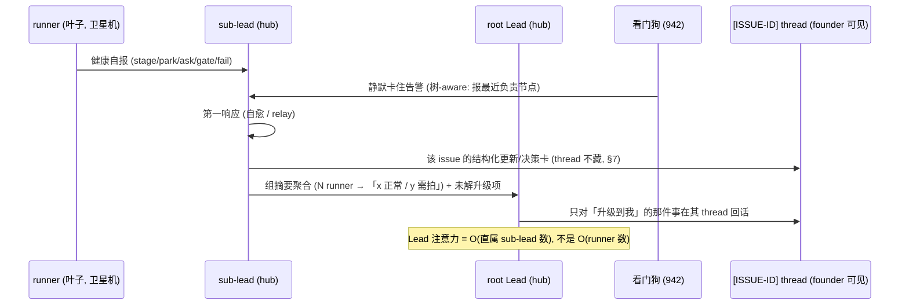

# FLY-1022 树状 Lead 指挥(层级化 runner 管理)— PRD

Issue: FLY-1022 (https://linear.app/geoforge3d/issue/FLY-1022/lead-scaling-one-lead-managing-many-runners-via-a-tree-hierarchical)
日期: 2026-07-08
基于: product/doc/FLY-1022-hierarchical-runner-tree/{exploration.md, research.md, hierarchical-runner-tree-design.html}(Annie co-eval v1 已 GO)

> **状态:draft PRD —— build 是 scale-gated 的。** Annie co-eval 后拍板:**PRD 现在写**(把设计 + 接口 + 拆分想清楚),
> **工程实现等两个 gating 条件都满足再启**(§11:看门狗 FLY-942/878/927 落地 + 一层结构稳定跑几天)。本 PRD 只定
> **产品行为 + 机制 + 工程约束 + 拆分**;具体 eng 实现 = **Tadashi**。凡未验证处标 UNKNOWN,不硬编答案。

---

## 1. 背景与问题

一个 Lead 今天**直接、平铺**地带它启动的每一个 runner。research 核过码的瓶颈(`research.md §1`):

- 三个 poller(`GatePoller` / `HeartbeatService` / `RunnerIdleWatchdog`)并行检测 runner 事件,但**全部扇入同一个
  per-Lead 收件箱**、被**一个 Lead 进程一轮一轮**(`LeadInputRouter` SERIAL / FLY-85)消化 → 注意力 ≈ O(1/N)、context ≈ O(N)。
- **带日期的铁证**:idle 轮询被从 30s 全局拉到 ~1h(`stuck-escalation.ts:87-104`,FLY-628),因为「每个误报都要 Lead
  reload 整个 context、烧 token」。
- 准入**不设上限**(`runner-admission.ts`,老的 `maxConcurrentRunners=3` 已退役)→ 没东西挡着一个 Lead 被塞 20+ runner。
- **活证据**:PRD 撰写当晚,产品 Lead 一个人平铺带 ~10 runner、差点漏终端 prompt。

**净问题**:runner 容量(1005 横轴)可以无限涨,但**一个 Lead 的脑(注意力+context+单线程)是有限的**;平铺撑不住。

---

## 2. 北极星 / 目标 / 非目标

**North Star**:**让一个 Lead 能可靠指挥远多于今天(5-6)的 runner —— 通过把「带 runner」分层、Lead 只看压缩后的摘要,
而不牺牲「每件事 founder 都看得见、没人静默卡死」。**

**目标**
- G1 把 Lead 的注意力成本从 **O(runner 数)** 降到 **O(直属 sub-lead 数)**(§4 压缩层)。
- G2 观测**树-aware**:静默失败沿树**层层上报**,不直接顶穿到最上层 Lead(§5,喂回 FLY-942)。
- G3 **每件 issue 照样有自己的 `[ISSUE-ID]` thread 直给 founder** —— 树压缩的是 Lead 的注意力,**不是**隐藏 thread(§7 硬约束)。
- G4 设计**留多层位**(lead→sub-lead→sub-sub-lead),但 **MVP 只落一层 sub-lead**(§3)。
- G5 跟 1005 多机、1020 模板、353 引擎**干净合成、不打架**(§6/§8)。

**非目标(本 PRD 明确不做)**
- N1 **不覆盖 353** 的 capacity-aware 派发 / session-decouple / DAG 编排(§6 划界)。
- N2 **不重造观测检测逻辑** —— 复用 FLY-942/878/927,只让它 tree-aware(§5)。
- N3 **不做**递归任意深树 / sub-lead 自动开 sub-lead / 复杂负载均衡调度 / sub-lead 横向协商 / 跨机自动 rebalance(§10 砍单)。
- N4 **不改** ship / merge 授权 —— 永远 founder-gated(§12)。
- N5 **不拆** runner 内部的三段式 session 成更细节点(§6.节点粒度,防通信爆炸)。

---

## 3. 三个相关但不同的轴:353 / 942 / 1022(§6 澄清)

Annie 明确要求把这三者划清 —— 它们**都在解「一个 Lead / fleet 怎么 scale」,但方向/层面不同,叠着用**:

| 轴 | 它解决的 | 一句话机制 | 归属 |
|---|---|---|---|
| **FLY-353** | **派什么 / 派多少** | **capacity-aware 派发**:Lead 手上满 N 件就不再往它派新活(+ DAG 自动编排) | 353(本 PRD 不碰) |
| **FLY-942** | **谁卡了没人管** | 静默失败**检测**(系统级看门狗)+ Lead=**响应**;事件驱动 + 去重 + 分类 | 942(已 done PR #506;本 PRD 增强它) |
| **FLY-1022(本)** | **一个 Lead 能带几个** | **提高单 Lead 能带的 runner 数**:分 sub-lead / 树状压缩指挥 | 1022 |

**三者互补**:353 控制**流入**(不把 Lead 灌爆);1022 抬高**单 Lead 的容量上限**;942 保证**无论多少 runner 都没人静默卡死**。
1022 的树让 942 有了「层层上报」的结构,让 353 的派发目标从「Lead 直连 runner」变成「Lead→sub-lead→runner」。

> **⭐ 353 vs 1022 精确界(Cass dedup)**:353 = 让一个脑**装更多 + 少手动 assign**(capacity-aware 流控);
> 1022 = 树状**压缩**让一个脑**够得着更多**。**本 PRD 只做 1022 的树;353 的流控/编排只引用、不实现。**

---

## 4. 核心机制:树 = facade / 压缩层 + 树聚合(DDIA)

### 4.1 拓扑与压缩

- **压缩层(树的核心价值)**:Lead 只跟**直属 sub-lead**谈、只看**组摘要**(如「A 组:3 正常 / 1 卡在 X 要你拍」),
  不看每个 runner 的原始细节。Lead 注意力 = O(直属子节点数),而非 O(runner 总数)。
- **为什么能 scale**:只要每个节点的**直属子节点数**保持在「一个脑扛得住」(≈今天的 5-6),总容量随层数**指数级**涨(§4.2)。

### 4.2 树聚合(classic tree aggregation · DDIA 参考)

- **模式** = 叶子(runner)**自报健康** → 每层父节点(sub-lead)**聚合 + 压缩** → 再上报 → 到 root Lead 时已是「几组摘要」。
  这是经典的**树形聚合 / roll-up**(每层扇出 fan-out ~5,fan-in 聚合)。
- **容量算术(说明设计上限,不是 MVP 目标)**:1(Lead) → 5(sub-lead) → 25(sub-sub-lead) → 125(runner)……
  每加一层,单 Lead 可及的 runner 数 ×~5。**MVP 只一层(§3):1 Lead → 5 sub-lead → ~25-30 runner**,已远超今天的 5-6。
- **eng 参考**:**DDIA(《Designing Data-Intensive Applications》)** —— 层级聚合、扇出/扇入、背压、局部失败不放大全局,
  是 Tadashi 实现聚合/上报层时的对照读物(尤其「聚合树」「fan-out on write vs read」「背压」章节)。

---

## 5. ⭐ 942 变 tree-aware(依赖 / 增强,喂回 942)

**这是本 PRD 对 942 的增强,不是新观测系统。** 现状(942 PRD)= 看门狗检测到 runner 静默停车 → 报给**那个 dept Lead**。
树落地后,报告落点要改成**沿树走**:

- **检测不变**:仍是 FLY-942/878/927 的系统级看门狗(状态型 + 通信感知 + 可配置阈值,零 token 纯文本比对)。**一行检测逻辑不重写。**
- **⭐ 落点变**:看门狗判定某 runner 静默卡住 → **报给它的直属 sub-lead(最底层),而不是直接顶到 root Lead**。
- **层层上报(escalate)**:sub-lead 是**第一响应人**(942 契约:Lead=响应);它先自愈 / relay。**只有 sub-lead 层解决不了、
  或 sub-lead 自己应答超时**,才升级到它的父节点;逐层向上;最终才到 root Lead / founder(沿用现有 stuck→founder 深层页)。
- **健康摘要走同一条上报路**:sub-lead 周期把「本组健康摘要」聚合上报(§4.2),看门狗的**告警**并进这条摘要流(带类型:
  `✅ 干完等拍` / `🔴 卡住在等谁` / `🟡 已替你决定`,942 §3 的结构化通知)。
- **喂回 942**:这条「树-aware 落点 + 层层升级 + sub-lead 应答时效」作为 **FLY-942/878/927 的一个增强项**记回去
  (看门狗的「升级对象」从「那个 Lead」泛化成「树上最近的负责节点」)。**本 PRD 列需求,实现跟 942 的看门狗实现同步。**

> 依赖方向:**1022 的树把「向谁上报」结构化;942 的看门狗把「谁卡了」检测出来。** 两者必须一起收口 ——
> 这也是 §11 gating 条件把「看门狗落地」列为树 build 前置的原因(树是放大器,必须先有可靠检测)。

---

## 6. 节点粒度:一个节点 = 一整条三段式 session(⭐ 不拆)

- **树上的一个叶子节点 = 一个 runner 跑的一整条 workflow(如三段式 设计→实现→QA)当作<u>一个整体</u>**,
  **不**把三段式内部拆成三个树节点。理由:拆散会**通信爆炸**(每个子阶段都要独立上报/被指挥),正好是 1022 要治的病。
- **跟 FLY-1020 对齐**:1020 定「一个 issue <u>怎么跑</u>(哪套模板/DAG)」;1022 把「跑这条模板的**整条 session**」作为树上一个
  被指挥的单元。**模板(1020)是节点<u>内部</u>怎么编排;树(1022)是节点<u>之间</u>怎么指挥。两层解耦、互不侵入。**
- 含义:sub-lead 管的是「N 条完整 session」,不是「N×3 个子阶段」;它对上汇报的粒度 = 每条 session 一个状态。

---

## 7. ⭐ per-issue thread 保留(硬约束):压注意力 ≠ 藏 thread

**Annie 硬约束:树压缩的是 Lead 的<u>注意力</u>,绝不是隐藏 founder 的可见性。**

- **每件 issue 照样有自己的 `[ISSUE-ID]` thread**(产品体验 spec §2.4 / FLY-270),**直接给 founder 看** —— 树**不藏、不合并、不吞** thread。
- **两条正交的路**:
  - **注意力路(树压缩)**:runner 健康/进展 → sub-lead **聚合成组摘要** → 逐层上到 root Lead。Lead 看的是**摘要**,不被 N 个细节淹。
  - **可见性路(不压缩)**:每件事该进它自己 `[ISSUE-ID]` thread 的更新/决策卡,**照进**(942 §3:结构化通知自动进对应 thread)。
    founder 想看某件事的细节,永远能在那条 thread 里看到全貌。
- **谁把内容写进 thread**:沿用现状 —— runner 发不了 Discord,**由负责的 Lead / sub-lead 写进 thread**(树里改成:该 runner 的
  直属 sub-lead 负责写它那些 issue 的 thread)。**thread 的所有权下放到 sub-lead,但 thread 本身照常一件一条、直达 founder。**

---

## 8. 多机放置(与 FLY-1005 合成)+ Lead-as-child 通信

### 8.1 放置(1005 节点池)
- **lead + sub-lead 都跑在 hub 机**(它们是「脑」,需要 hub 的 StateStore/CommDB/mailbox 本地文件);
  **runner 跑在节点池 / 卫星机**(1005 横轴)。
- sub-lead 是**注意力单位**(每一摊 runner 一个),runner 的**部署单位**是 1005 的节点 —— **两者不强绑**:
  一个 sub-lead 那摊 runner 可以分散在多台卫星机上。(倾向:同组 runner 尽量同机以省跨机 relay,但不是硬性;§14 开放。)

### 8.2 Lead-as-child 通信(核心新增角色)
- 现状:`LeadConfig`(`ProjectConfig.ts`)扁平 `leads[]`、零层级字段;通信是 Bridge→单个 `LeadRuntime`(per leadId)。
- **本 PRD 加的是「一个 Lead 能当另一个 Lead 的孩子」这层角色**:sub-lead **向上**汇报组摘要(当另一个 Lead 的 runner-源)+
  **向下**派/带自己那摊 runner。
- **复用同一套 Lead→Runner 机制、只调 schema**(Tadashi 初判「中等改动」):
  - `LeadConfig` 加 `parentLeadId?`(可空;root Lead 不设)—— 定义树边。
  - dispatch 多一跳:Bridge 把活派给 sub-lead(它对它那摊 runner 就是「那个 Lead」),而非直连 runner。
  - 上报:sub-lead 把「组摘要 + 升级项」经现有 `LeadRuntime`/CommDB 机制**投给它的 parent**(parent 把它当一个「runner 源」收)。
- **字节兼容**:`parentLeadId` 不设 = 今天的扁平行为,零变化(default-off,MVP 只给需要的 Lead 挂一层)。

---

## 9. 数据流 / schema(给 Tadashi 的实现锚点)

- **健康摘要 schema(草案,co-eval / 实现细化)**:`{groupId, subLeadId, counts:{running, parked_ok, needs_founder, stuck}, escalations:[{issueId, kind, waitingOn, sinceMs}]}`。
  —— 压掉每 runner 的原始 pane 细节,保留「组计数 + 需要往上的少数个案」。**确切压什么/留什么 = §14 开放,Annie co-eval。**
- **升级判定**:sub-lead 应答超时(942 §2 的 Lead 应答时效阈值,可配置)→ 冒泡到 parent;逐层。
- **thread 所有权**:每个 `[ISSUE-ID]` thread 由该 runner 的**直属 sub-lead** owned(写更新/决策卡);root Lead 只在事被升级到它时介入该 thread。

---

## 10. MVP 范围(一层 sub-lead)+ 坚决砍

**MVP(§11 gating 满足后才启)**
- 只**一层 sub-lead**:root Lead → sub-lead → runner(两层指挥树)。
- sub-lead = **同一套 Lead 代码 + 一个精简「sub」角色 prompt**(职责:带一摊 runner + 聚合上报组摘要 + owned 那些 `[ISSUE-ID]` thread + 942 第一响应)。**不新造进程类型。**
- `LeadConfig.parentLeadId` schema + dispatch 多一跳 + 组摘要聚合上报 + 942 树-aware 落点(§5)。
- 每个 runner 的 `[ISSUE-ID]` thread 照常直达 founder(§7)。

**坚决砍(MVP 一律不做)** `later`
- 递归任意深树 / sub-lead 自动再开 sub-lead(只留 schema 位,不实现)。
- 复杂负载均衡 / 动态调度 / 跨机自动 rebalance。
- sub-lead 之间横向协商。
- runner 三段式内部拆节点(§6,永不做)。
- 自动决定「几个 runner 该配一个 sub-lead」的智能分组(MVP 手动/配置)。

---

## 11. ⭐ Scale-gate 条件(build 何时启)

**PRD 现在写、实现 scale-gated。两个 gating 条件<u>都</u>满足才启 build:**

1. **看门狗落地稳定**:FLY-942 定的观测(FLY-878/927)已实现且在跑 —— 因为**树是放大器**(多层 = 多处藏静默卡死),
   可靠检测是树的**硬前置**。没有它先加层 = 放大风险。
2. **一层结构稳定跑几天**:当前 fleet 稳定性(FLY-774 家族)+ 单 Lead 平铺已稳定运行数天,基线不抖,再往上加指挥层。

**触发点(需求侧)**:1005 Phase 2 多机真把 runner 铺开、单 Lead 的 runner 数持续压过「一个脑扛得住」(≈5-6)时,树从「可选」变「需要」。
**在触发点之前**:353(capacity-aware 派发)+ 942(自动检测)先扛近期痛;树先停在「PRD + schema 位」。

> **每个 build-issue 都必须在描述里写明这两个 gating 条件 + 触发点(§13)。** Tadashi 的队列里它们标 `scale-gated`,不早启。

---

## 12. 护栏

- **不自 ship / 不自 merge**:PRD/实现的合入永远 founder-gated(沿用 founder-only-authority)。
- **per-issue thread 不藏**(§7 硬约束)—— 任何压缩不得降低 founder 对单件事的可见性。
- **字节兼容**:`parentLeadId` default-off,不挂 sub-lead 的项目零行为变化。
- **树不放大静默失败**:942 树-aware(§5)是并行硬前置(§11 gating)。

---

## 13. Build-issue 拆分(挂 Tadashi · 全部 scale-gated)

> 每条都标 **`scale-gated:等 FLY-942 看门狗落地 + 一层结构稳定跑几天后再启`**;PRD 写明 gating(§11)。**本 PRD 不 create、不 ship**,
> Honey Lemon QA + Annie 终审后再 create 交 Tadashi。

| # | build-issue(草案) | 内容 | 依赖 |
|---|---|---|---|
| B1 | **Lead-as-child schema + 树边** | `LeadConfig.parentLeadId`(default-off)+ 校验 + 树解析;字节兼容 sentinel | 无 |
| B2 | **dispatch 多一跳** | Bridge 把活派给 sub-lead 而非直连 runner(§8.2) | B1 |
| B3 | **组摘要聚合上报** | sub-lead 聚合本组健康 → 投 parent(§4.2/§9 schema);经现有 CommDB/LeadRuntime | B1 |
| B4 | **⭐ 942 树-aware 落点 + 层层升级** | 看门狗报最近负责节点 → sub-lead 第一响应 → 超时逐层冒泡(§5);**与 942 看门狗实现同步** | FLY-942 impl |
| B5 | **thread 所有权下放 sub-lead** | 每 `[ISSUE-ID]` thread 由直属 sub-lead owned、照常直达 founder(§7) | B1 |
| B6 | **sub-lead 角色 prompt** | 同套 Lead 代码 + 精简「sub」role(带一摊 + 聚合 + owned thread + 942 第一响应) | B1 |
| B7 | (later) 多层递归 / 智能分组 / 多机放置策略 | 只留位,MVP 不做(§10 砍单) | 后续 |

---

## 14. Non-goals 已在 §2;开放问题(co-eval / 实现)

- UNKNOWN **拐点**:sub-lead 自己也有 context 成本 —— 一摊几个 runner 时树才真划算?(需实测基线)
- **摘要 schema 定稿**:§9 草案压什么 / 留什么,Annie 要能一眼看懂哪组出事(co-eval)。
- **树 vs 机器分布对齐**(§8.1):同组 runner 是否强制同机?还是完全正交?
- UNKNOWN **Lead-as-child 通信最小改动点**:在现有 mailbox/CommDB/transport 上的确切落地(待 Tadashi spike)。
- **sub-lead 应答时效阈值**默认值(§5,接 942 §2 可配置阈值)。

---

## 15. 参考

- **DDIA**《Designing Data-Intensive Applications》(树聚合 / fan-out / 背压 / 局部失败不放大 —— eng 实现聚合上报层的对照)。
- FLY-916(origin · Tadashi 树+可观测洞察,已并入本 issue)· FLY-1005(横轴多机 · 节点放置)· FLY-353(capacity-aware 派发 / DAG,划界不覆盖)·
  FLY-1020(节点内部模板,§6 对齐)· FLY-942 + FLY-878/927(看门狗 · §5 增强对象,已 done PR #506)· homerail(Manager/Node/Worker 中间层)·
  产品体验 spec §2.4(per-issue thread)。
