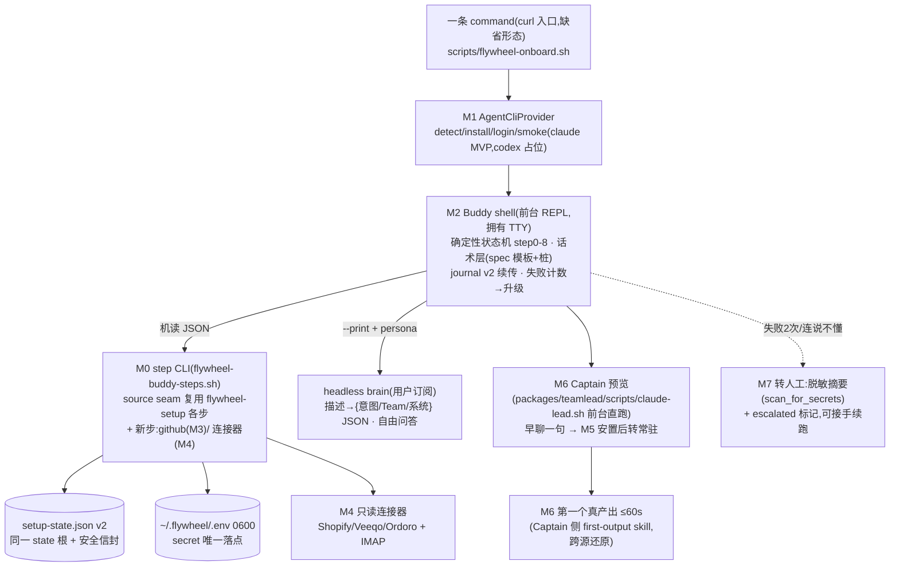

# FLY-1023 Buddy onboarding 全量 build — 实施计划

Issue: FLY-1023 (https://linear.app/geoforge3d/issue/FLY-1023/fly-910-onboarding-buddy-build-single-eng-issue-tadashi-splits-per-prd)
日期: 2026-07-09
基于: research.md

> **形态(gate 已批)**:单一 plan、内部按 BI 里程碑分块(M0..M8 ↔ PRD §12 BI-0..BI-8)、每块独立验收 + 标注可拆点——Tadashi 之后按此自行拆 build sub-issue 派活。依赖序 BI-0→BI-1→(BI-2∥BI-7)→BI-3→BI-5→(BI-4+BI-6)→BI-8;MVP 验收以 PRD §6.7 MVP-minimum 为准。
> **机械层细化知会**:Buddy shell + headless brain 形态(research R2)已以非阻塞 ask 3c2da6d7 知会 Tadashi;gate 批的复用面/state 根/依赖序/红线全部不变。

---

## 0. 方向(已锁,不再开)

- **源头合同 = FLY-910 PRD v3**(Codex APPROVED ×2):§4.5 决策覆盖表、§5 体验红线、§6.7 MVP-minimum vs 目标、§12 拆分。§7 步骤读作目标 UX,验收以 §6.7 为准。
- **底座 = FLY-648(已 merge,PR #477)+ FLY-650 libs,复用不重写**;桥接同一 state 根(`~/.flywheel/setup-state.json` v2),不另起第二 state 根。
- **红线(每个 M 的验收都含)**:不露工程黑话 / secret 不进对话·state·日志·argv·brain 上下文 / 业务系统只读 scope / merge·ship·runner-lifecycle 永远 founder-gated(FLY-175 原样)/ vendor-agnostic seam。
- **MVP 砍常驻三样**(开新 team/自助修/日常自助 = phase-2,§6.5),只留架构可扩位。

## 1. 一句话方案

在 FLY-648 一条 command 向导之上加一层**对话皮 + 大脑**:bootstrap 脚本(curl 入口)先经 `AgentCliProvider` 装好/登录 Claude Code 并起 **Buddy shell**(前台薄 REPL,拥有 TTY、确定性状态机);shell 按 PRD step 0–8 顺序调用**可单步调用的 step CLI**(source seam 复用 flywheel-setup.sh 实现 + 新增 github/连接器步),NLP 部分(大白话→Team/系统推断、自由问答话术)交给 **headless brain**(`claude --print` + persona 注入,用户自己订阅);全程续传落 journal v2,卡住走转人工;最后以 dropship 只读 vertical 交出 ≤60s 的第一个真产出。

## 2. Scope

**In**:M0–M8 全部(§3);hermetic bash 测试 + reverse-compat sentinels;runbook/素材桩;plan 内标注的实现期核验项执行。
**Out(明确不做)**:managed V2 · 收费 · phase-2 常驻三样 · Anna · FLY-915/942 告警 bot · FLY-175 gate 改动 · Discord roles/webhooks · Linear/GitHub OAuth 化 · macOS clean-host 全自动 bring-up · Codex adapter 真实现 · 通用 MCP 连接器框架 · 更多 vertical · 支持队列自动投递(以上均为 §6.7/BI-0(b) 目标层 follow-up,见 §6 拆单表)。

## 3. 里程碑设计(每 M:范围 → 设计 → 验收 → 可拆点)

### M0 · BI-0(a) 底座 closeout:公共地基三件(step CLI 壳 + journal v2 + 授权定案)

**范围**:后续所有 M 的公共机械件;PRD BI-0(a) 四项定案落地。
1. **step CLI 薄壳** `scripts/flywheel-buddy-steps.sh`:`FLYWHEEL_SETUP_SOURCED=1 source flywheel-setup.sh`;子命令 `run <step-id>` / `verify <step-id>` / `status --json` / `state get|set <buddy.key> <value>`(仅非敏感 buddy 键)。stdout = 单行 JSON `{ok, step, evidence?, error_code?, hint?}`;exit 语义:0 成 / 1 败 / 3 需引导(继承 fs_discord_api 的 return 3 约定)。secret 类 `FLYWHEEL_SETUP_ANSWER_*` 注入在该壳内**默认拒绝**(`FLYWHEEL_BUDDY_ALLOW_ANSWER_INJECTION=1` 仅测试开)。
   **stdout 纪律(机械规格,Codex R1#3)**:该壳绕过 `fs_main`,因此必须自己做三件事——① 任何 journal/评估路径之前先 `_fs_bootstrap_jq`(干净 Ubuntu/WSL 在 preflight 前是无 jq 的);② 复刻 `fs_main` 的 identity/engine 初始化(`fs_derive_identity` + state dir 推导 + `setup_engine_init`);③ **stdout 只许最终那一行 JSON**——`fs_log` 现状写 stdout,step CLI 内把被调 step 函数的 stdout/stderr 全部重定向到 stderr(或 0600 日志文件),人读输出永不混入机读通道。每个子命令(`run/verify/status/state`)都配 **stdout 污染 sentinel 测试**(断言 stdout 恰好一行、可 jq 解析)。
2. **journal v2**:`{version:2, steps:{…v1 不变…}, buddy:{cursor, first_task_summary?, team_proposal?, connected_systems[], escalated?}}`;v1→v2 就地幂等升级;同 `_fs_atomic_write_600` 信封;buddy 键白名单校验(拒绝任何形如 token/key/secret 的键名与值模式)。**secret 扫描 API 事实(Codex R1#4)**:`scan_for_secrets` 现状是 **path-only**(`fleet-sanitize.sh:97`,拒缺失路径)——本 M 给 `fleet-sanitize.sh` 加 opt-in 小 helper `scan_string_for_secrets`(单值/字符串形态,复用同一 pattern 集,自带测试,既有函数字节不变);journal buddy 键与 M7 摘要写入前走该 helper(或等价地:候选内容先落 0600 临时文件再以 path 形态扫,实现期二选一、测试锁行为)。
3. **授权定案(记录在案,BI-3 按此建)**:Linear = 安全 token(648 已闭合)· GitHub = gh auth device flow(MVP)· macOS 安置 = guided/manual(648 现状,满足 §6.7)· state = journal v2(本 M)。
4. **provider 合同文件**(仅合同 + 测试夹具,实现在 M1):`scripts/lib/agent-cli-providers/CONTRACT.md` + 函数签名/JSON 输出/exit 语义的合同测试(对 claude.sh 的桩跑)。

**验收**:hermetic —— ① step CLI 对既有 10 步逐一 `run/verify`,与交互模式产物一致(stub API);② v1 journal 读入自动升 v2、重跑幂等;③ **reverse-compat sentinel:flywheel-setup.sh 交互模式(不 source、无新 env)行为逐字不变**(FLY-648 既有测试全绿 + 新增 sentinel);④ buddy 键注入 secret 值被拒。
**依赖**:无。**可拆点:M0 可独立成单**(其余 M 全依赖它)。

### M1 · BI-1 一条 command bootstrap + AgentCliProvider(step 0)

**范围**:`scripts/flywheel-onboard.sh`(curl 入口缺省形态;Annie 拍 npx 时只换分发皮)+ `scripts/lib/agent-cli-providers/claude.sh`(detect/install/login_guide/smoke/start_buddy/resume/repair,合同见 research R4)+ `codex.sh` not-implemented 占位 + model_key 步改造(GUIDED 确认 → provider 编排,evidence 记 `{provider, version}`)。
**设计要点**:bootstrap 顺序 = 网络/OS 检查 → 复用 preflight/platform-deps 装 Node/git/jq/gh → 取仓/onboard 层 → provider detect→install→login_guide(前台,shell 拥有 TTY,CLI 自己弹浏览器 OAuth)→ smoke(`--print` 一次最小调用)→ exec Buddy shell。不收任何 API/Cloud key;API-key 路保留为显式 opt-in(648 现状)。失败分支:装不上→手动链接+续传;登录不弹浏览器→可复制 URL(claude CLI 自带);2 次→转人工(M7 未建时先落摘要文件桩)。
**实现期核验(硬项)**:claude 官方安装命令当前形态;`--print` 会话续接 flag 组合;WSL2 浏览器回环(FLY-648 runbook 已有预写)。**vendor CLI flag 必须真 auth 实测**(家规)。
**验收**:干净环境(hermetic stub + 真机 QA 段)一条命令 → 已登录 claude + Buddy shell 起来说第一句话;无 key 明文;provider 可经 `FLYWHEEL_AGENT_CLI` 切换且 codex 路给诚实 not-implemented;中断重跑从断点续。
**依赖**:M0。**可拆点:M1 可独立成单。**

### M2 · BI-2 Buddy 本体(shell + persona + brain + 续传 + 决策引擎)

**范围**:`scripts/flywheel-buddy.sh`(shell 主体)+ `scripts/buddy/persona.md`(brain 人格注入)+ `scripts/buddy/copy/*.md`(step 0–8 话术模板,正文以 onboarding-buddy-spec 样例起步、终稿=产品层桩)+ brain 调用器(经 provider `start_buddy`;`--print --output-format json --append-system-prompt-file`,0600 tmp 文件,TmuxAdapter 同款纪律)。
**设计要点**:
- **状态机**:PRD step 0–8 → 底层 step id 序列的映射表(shell 内单点定义);每步 = 「话术(模板)→ [需要用户/brain 的交互] → step CLI 调用 → 按 JSON 结果给成功/具体报错话术 → journal 前进」。顺序由 shell 强制,brain 永不决定跳步。
- **决策引擎(brain 任务合同)**:①`parse_first_task`:大白话 → `{intent, team_name, roles[], scope, systems_needed[]}`(JSON schema,校验失败自动重试 ≤2 次,再失败走「给 3 个例子选」分支);②`chat_reply`:自由追问 → 一段话术(persona 注入;温暖同事基调)。两个 prompt 文件 `scripts/buddy/brain-prompts/`。
- **续传**:开场读 journal;有 cursor → 「欢迎回来,咱上次搭到『X』,接着来?」;escalated → 提示已转人工状态。
- **升级计数**:同一步失败 2 次 / 用户输入命中「不懂」类模式 → M7 通道(shell 判定,不靠 brain)。
- **红线机械保证**:secret 只在 step 进程 `fs_ask_secret`(TTY 隐藏读);brain 输入 = 用户可见文本 + 非敏感 evidence 摘要,**结构性无 token**;对客户输出走话术层(黑话词表 lint:Lead/Runner/manifest/launchd/Bridge/repo/token 等不得出现在 copy 模板与 shell 硬编码输出中——测试断言)。
**验收**:hermetic(brain 用 stub 二进制假答)—— ① 全流程干跑(stub step)0→8;② kill 后重跑从 cursor 续、开场是欢迎回来话术;③ `parse_first_task` 对「订单/广告/询价/文案」四样例产出合法 JSON、对「帮我赚钱」走追问→例子分支;④ **secret-scan 通过:journal/日志/brain 输入 transcript 零 token**;⑤ 黑话 lint 绿。
**依赖**:M0(state/step CLI)、M1(provider;开发期可用 stub brain 并行)。**可拆点:M2 可独立成单(与 M7 建议同人/同窗,共用 state contract)。**

### M7 · BI-7 卡住 → 转人工(∥ M2)

**范围**:升级阶梯(M2 的计数触发)→ 脱敏摘要生成器(cursor/已完成步/最后 error_code+hint;**过 `scan_for_secrets`,fleet-sanitize.sh:97**)→ 落 `~/.flywheel/support-summary-<ts>.json`(0600)+ 屏显转人工话术与联系出口(文案/渠道=产品层桩)→ `buddy.escalated=true`(终态可接手:人工修复后清标记、重跑续传)。
**验收**:hermetic —— 任一步注入连续失败 2 次 → 摘要文件生成且 scan_for_secrets 绿、journal 标 escalated、shell 退出话术正确;清标记重跑从原步续;摘要含足够定位信息(步 id/error_code/hint)但无栈、无黑话直出(话术层包装)。
**依赖**:M0(∥ M2,共用 state contract)。**可拆点:可并入 M2 一单,或独立小单。**

### M3 · BI-3 基础工具接入(Discord 复用 + Linear 复用 + GitHub 新建)

**范围**:
- **Discord**:复用 bots/channels 步(C1/C2 seam、频道 find-or-create、读/发探针、founder ID 双路)——Buddy 化只是话术层接管(§8-A 的 4 步引导词 + 每步校验反馈);**roles/webhooks/guild_id 预选 = follow-up,不在本 M**(§6.7)。
- **Linear**:复用 linear 步(token 隐藏录入 + team/label/project find-or-create + 引导 fallback),话术 =「后台小本子……点一下授权就行」按 §7 2b(注:MVP 是贴 key 的安全隐藏录入,话术如实说「贴进安全输入」,**不谎称 OAuth**——话术桩按 MVP 事实写,OAuth 到位后再换词)。
- **GitHub(新 step `github`)**:`gh auth status` 探测 → 前台 `gh auth login`(device/web flow,不贴 token)→ `gh repo create <owner>/<project> --private` → 绑 remote + 首推 skeleton;失败分支(无账号→注册链接+续传;拒绝→PRD 2c 话术重试;组织策略/403→web UI 手建 + 系统校验 remote 可推的引导 fallback);evidence 记 repo full_name(非敏感)。gh 进 platform-deps 依赖面。
**验收**:hermetic(stub gh/API)三样各自:一次授权/录入即接好 + 校验 + 可续传/重试 + 403 引导路;GitHub 步 push 后 `git ls-remote` 校验;token 均 0600 .env、journal 零 secret。真机段:三样真账号各走一遍。
**依赖**:M0、M1(gh 由 preflight 装)。**可拆点:M3 可独立成单;其中 GitHub 子块也可再拆。**

### M5 · BI-5 自动安置(复用为主 + Captain 交接)

**范围**:复用 config/services/finish 步(staging→真 loader 闸→supervisor seam→health check);Buddy 化 = §7 step7 的干净进度话术(✓ 建工作区 ✓ 配好 Captain 和 Crew ✓ 常驻上岗 ✓ 上线自检);**macOS = guided/manual(648 现状,§6.7 认可);linux/WSL2 = systemd 自动**。新增:安置前停 M6 的 Captain 预览进程、安置后 health-check 扩展为「Bridge 2xx + bot online + **Captain 能响应一条内部 ping**」(经 chat 频道探针消息,复用 `_fs_channel_probe` 模式)。

**工作项 M5-a · Lead 启动合同 closeout(Codex R1#2;M6 预览与本 M health-check 共同前置)**:真实 Lead launcher = `packages/teamlead/scripts/claude-lead.sh`(launchd 路经 `scripts/flywheel-lead-wrapper.sh` exec 它;根 scripts/ 下**没有** claude-lead.sh)。它的硬启动门槛逐项列名、在干净客户机上逐项「装齐或有意绕过」并测试(预览态 + 安置后常驻态都要过):
  1. role detection 要求 `~/.flywheel/projects.json` 里有该 project/lead 条目(fail-stop)——预览必须在 config 步产物落地后才可能起;
  2. 要求 `.lead/<lead-id>/identity.md`(或 agent.md)存在——skeleton 步保证生成;
  3. 缺 `~/.flywheel/bin/check-discord-plugin.sh` / `update-discord-plugin.sh` 会 abort,而现有 provision/converge 只安置部分 bin 脚本、且 `converge_flywheel_bin` 修复时点在 Discord 插件检查**之后**——干净机会先撞检查;本工作项把 bin 收敛提前/补齐进安置链(或预览安全模式显式绕过,二选一、测试锁定);
  4. 缺省 mailbox backend 要求 `agent-team-transport` 在 PATH,否则 fail-closed——预览态显式选定 backend(如 `FLYWHEEL_COMM_BACKEND=commdb`)或先安置该 CLI,取舍在本工作项定案并写进合同测试。
**验收**:hermetic(FLY-648 WI-H 同款 temp-HOME 全链 + 隔离断言)——每子步幂等可续传;health-check 三项全绿才 done;**M5-a 合同测试:干净 temp-HOME 上预览态与常驻态各自能把 Lead 带到「bot online + 频道能应答」,或在缺门槛项时给出具体(非黑话)报错**;客户输出零 JSON/栈;darwin 分支零 launchctl 字面(supervisor seam 守卫既有)。真机段:linux/WSL2 全自动、macOS guided 各走通。
**依赖**:M0、M3(config 消费三样接入产物)。**可拆点:M5 可独立成单(M5-a 是其中不可再拆的核心)。**

### M4+M6 · BI-4+BI-6 首个 vertical(dropship 只读连接器 + 早聊 + ≤60s 首产出)

**范围(一个里程碑交付一条真路径)**:
1. **连接器合同 + 4 个探测器**(`scripts/lib/buddy-connectors/{shopify,veeqo,ordoro,imap}.sh`):统一 `{connect(隐藏录密→校验→0600), probe(最小只读探针), pull(最近订单/确认邮件,JSON)}`;Shopify = custom app Admin API token(read_orders);Veeqo/Ordoro = API key;邮箱 = IMAP + app password(只读 SELECT/SEARCH/FETCH)。**只读 scope 铁律**;无连接器 = 诚实路径(记录诉求 + 「先记下让工程看能不能加」话术,PRD 原话);`FLYWHEEL_BUDDY_DEMO=1` 显式 fixture 通道(**仅 QA/demo,生产北极星不算成功**,PRD Codex R2#4)。
2. **JIT 接入(step 6)**:brain `parse_first_task.systems_needed` → 最少必需集 → 一次一个引导(§8-B 话术);每接一个当场 probe;connect 成功即后台预取一次订单+邮件摘要缓存(非敏感字段:单号/状态/时间戳/发件人域,**不缓存邮件正文全文**)。
3. **早聊一句(step 5)**:config 落定后前台直跑 `packages/teamlead/scripts/claude-lead.sh` 起 **Captain 预览进程**(真 Lead 身份、真 bot 上线、welcome-first 话术按用例适配、不硬塞订单)。**预览可行性以 M5-a「Lead 启动合同 closeout」为准**(role detection/identity 文件/bin 脚本/transport backend 四道门槛在 M5-a 逐项闭合,不是一次含糊探针);M5-a 结论若判某门槛在预览时点不可满足 → 诚实降级:早聊挪安置后(PRD 步骤 5 分支允许「不阻塞继续」)。用户不聊不阻塞。**运行时步序(step5 早聊在 step7 安置前)与 build 依赖序(M6 在 M5 之后建)是两个轴——早聊功能建在 M6,但它复用 M5-a 闭合的启动合同,不越序。**
4. **首产出编排(step 8)**:**MVP = Captain 侧 `first-output` skill**(项目 lead skills 内):读连接器 pull(+预取缓存)→ 跨源还原(订单状态 × 确认邮件匹配)→ 一条可信结果 + 下一步选项(§7 step8 样例形态)。**诚实设计决策:MVP 不走真 Runner 派活**——完整 Runner pipeline(onboard/brainstorm/PR)结构性做不到 ≤60s;「让 Crew 去查」是表现层话术,机械上 Captain 自查;真 Crew 派活 = phase-2/目标层(拆单表列 follow-up)。需要未接系统 → 诚实回 step 6 单工具引导,绝不假装有答案。
**验收**:hermetic(stub 各 API):四连接器 connect/probe/pull 合同一致、key 错/权限窄的具体报错话术、诚实路径触发;**≤60s 计时断言**(stub 延迟注入下编排预算:预取缓存命中时 brain 单调用 + 组装 < 60s;未命中并行拉取路径也断言);fixture 通道只在显式 env 下可达。真机段(QA):真 Shopify 店(或 Veeqo)+ 真邮箱走通「今天有没有卡住的单」→ 计时 ≤60s → 结果与后台事实一致。
**依赖(Codex R1#1 修正,与已锁顺序一致)**:**M4(连接器+JIT)依赖 M1、M2、M3;M6(早聊+首产出编排)依赖 M4、M5**(M5-a 的 Lead 启动合同是早聊/首产出的硬前置;首产出跑在安置/health-check 过的 Captain 上)。**可拆点:建议拆两单——M4 与 M6;也可合一单由一人纵向打穿(vertical 完整性优先),但内部实现顺序仍须 M5 产物先行。**

### M8 · BI-8 Discord 4 步素材

**范围**:§8-A 附录对齐的 4 步截图清单 + 15s 短视频分镜脚本(每步一句字幕=对应话术);产出 = `product/doc/FLY-910-non-eng-onboarding/assets-brief.md`(素材制作 brief + 占位路径)+ Buddy 话术层挂接点(copy 模板里的 [截图] 占位引用)。真实截图/视频制作 = 内容侧执行(Tadashi 拆单时可派内容 runner)。
**验收**:brief 覆盖 4 步、与 §2 话术一字对应;copy 模板占位可解析。
**依赖**:M3(流程定稿)。**可拆点:独立小单(可派内容侧)。**

## 4. 测试策略(TDD;实现阶段执行)

- **idiom**:FLY-648/519/650 的 hermetic bash 测试(`scripts/__tests__/flywheel-buddy*.test.sh`):temp-HOME + `FLYWHEEL_SETUP_STATE_DIR` 隔离 + stub 外部二进制(claude/gh/curl 假体)+ 隔离断言(temp home 之外零读写)+ 负例(真 ~/.flywheel 拒碰,复用 live-fleet guard)。
- **RED 起点(每 M 首个失败测试)**:M0 = 「step CLI run preflight 输出合法 JSON」;M1 = 「provider detect 在无 claude 的 stub PATH 返回 not-found JSON」;M2 = 「状态机在空 journal 从 step0 话术开场」;M7 = 「连续两次注入失败生成 secret-free 摘要」;M3 = 「github step 在 stub gh 未登录时走 login 引导」;M5 = 「health-check 三项其一 red 时 finish 不 mark done」;M4/M6 = 「shopify probe 对 401 stub 给精确话术 error_code」。
- **贯穿断言(每 M 验收自带)**:reverse-compat sentinel(flywheel-setup.sh 交互模式逐字不变)· secret-scan(journal/logs/brain transcript/摘要)· 黑话 lint(copy + shell 输出)。
- **真机/QA 段(implement 后、QA 阶段执行)**:① 干净 VM(linux/WSL2)+ macOS 各一次全流程 founder-run;② 真账号连接器(Shopify 或 Veeqo + Gmail app password)——**vendor 全部 flag/endpoint 真 auth 实测**;③ ≤60s 北极星真机计时;④ M5-a Lead 启动合同测试在真机的结论回灌 M6 设计。

## 5. 字节兼容 / 风险

**生产零变化承诺**:不改任何 runtime TS;flywheel-setup.sh 仅函数内部 opt-in 小改(缺省行为 sentinel 锁死);其余全部新增文件。Annie 生产 fleet 无感;不需要 Bridge 重启(Buddy 是客户机产品面)。

| # | 风险 | 缓解 |
|---|---|---|
| 1 | claude CLI flag/安装形态漂移(--print/续接/安装命令) | M1 实现期真机核验清单;provider 层单点吸收;smoke fail-closed |
| 2 | brain JSON 输出不稳定 | schema 校验 + 重试 ≤2 + 结构化兜底分支(3 例子选);brain 永不执行 |
| 3 | ≤60s 依赖外部 API 延迟 | step6 预取缓存 + 并行拉取;计时断言进 hermetic + 真机 |
| 4 | Captain 预览撞 Lead launcher 硬门槛(role detection/identity/bin 脚本/transport) | M5-a 合同 closeout 逐项闭合;诚实降级路径预设(早聊挪安置后) |
| 5 | vendor 自助可得性(Shopify custom app/Gmail app password 政策变化) | 4 连接器互为替补 + 诚实路径;真机段最早验证 |
| 6 | TTY 边角(无 /dev/tty 环境、SSH) | fs_ask_* 既有 fail-loud 语义保留;bootstrap 前置 TTY 检查给人话报错 |
| 7 | 一条 command 形态/命名待 Annie | 入口脚本与分发皮解耦;缺省 curl 形态,换皮零实现改动 |
| 8 | Buddy 层新的 secret 暴露面 | 结构性设计(secret 只在 step 进程)+ 三处 secret-scan 验收 + 注入通道测试专用 flag |

## 6. 里程碑总表(拆单参考)

| M | ↔ PRD | 依赖 | 独立验收 | 拆单建议 |
|---|---|---|---|---|
| M0 地基三件 | BI-0(a) | — | ✅ | 单独一单,最先 |
| M1 bootstrap+provider | BI-1 | M0 | ✅ | 单独一单 |
| M2 Buddy 本体 | BI-2 | M0(M1 可 stub 并行) | ✅ | 与 M7 同窗 |
| M7 转人工 | BI-7 | M0 | ✅ | 并入 M2 或独立小单 |
| M3 三工具接入 | BI-3 | M0,M1 | ✅ | 单独一单(GitHub 可再拆) |
| M5 安置(含 M5-a Lead 启动合同) | BI-5 | M0,M3 | ✅ | 单独一单 |
| M4 连接器+JIT | BI-4 | M1,M2,M3 | ✅ | 可与 M6 合单纵向打穿 |
| M6 早聊+首产出编排 | BI-6 | **M4,M5** | ✅ | 同上;内部顺序 M5 产物先行 |
| M8 素材 | BI-8 | M3 | ✅ | 独立小单(可内容侧) |

**Follow-up(不进首批,§6.7/BI-0(b) 目标层,拆单时另立)**:macOS clean-host 全自动 bring-up · Discord roles/webhooks + guild_id 预选 · Linear/GitHub OAuth · Codex adapter 真实现 · 真 Crew 派活的首产出 · 支持队列自动投递 · 更多 vertical · Gmail API OAuth。

## 7. 交付物

- 新脚本:`scripts/flywheel-onboard.sh` · `scripts/flywheel-buddy.sh` · `scripts/flywheel-buddy-steps.sh` · `scripts/lib/agent-cli-providers/{CONTRACT.md,claude.sh,codex.sh}` · `scripts/lib/buddy-connectors/{shopify,veeqo,ordoro,imap}.sh` · `scripts/buddy/{persona.md,copy/*.md,brain-prompts/*.md}`
- flywheel-setup.sh 的 opt-in 小改(journal v2 + 个别函数可重入化;缺省行为 sentinel 锁)
- Captain 侧 `first-output` skill(项目 lead skills)+ M5-a Lead 启动合同 closeout(`packages/teamlead/scripts/claude-lead.sh` 四道门槛的装齐/绕过定案 + 合同测试)
- 测试:`scripts/__tests__/flywheel-buddy*.test.sh` 全套(hermetic + sentinels + secret-scan + 黑话 lint)
- 文档:runbook 新章(Buddy 路)· `assets-brief.md` · 本文件夹三件套 + progress
- 版本号 tentative:**v1.x(ship 时按当时 held PR 队列 re-version)**

## 8. 实现期核验清单(集中,防散落)

1. claude CLI:官方安装命令 · `--print --output-format json` 会话续接 flag 组合 · `--append-system-prompt-file` 在 --print 模式下生效 —— 真 auth 实测(M1)。
2. gh:device/web flow 子命令形态 · `gh repo create` 行为 —— 真账号实测(M3)。
3. Shopify custom app / Veeqo / Ordoro / Gmail app password:自助可得性 + 只读 scope 面 —— 真账号实测(M4)。
4. `packages/teamlead/scripts/claude-lead.sh` 预览/常驻两态启动门槛(role detection · identity 文件 · ~/.flywheel/bin 脚本 · agent-team-transport backend)—— M5-a 合同测试逐项闭合(非含糊探针)。
5. WSL2:浏览器回环 + gh apt source(FLY-648 runbook 既有项回归)。
