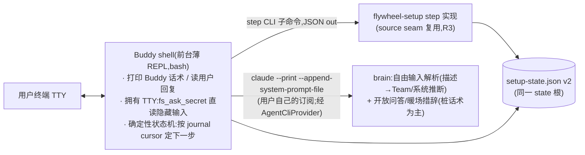

# FLY-1023 Buddy onboarding 全量 build — 调研

Issue: FLY-1023 (https://linear.app/geoforge3d/issue/FLY-1023/fly-910-onboarding-buddy-build-single-eng-issue-tadashi-splits-per-prd)
日期: 2026-07-09
基于: exploration.md

> 目的:把 exploration 的 8 个架构选择落到代码级事实上,给 plan.md 的里程碑分块提供依据。所有 file:line 均为 2026-07-09 本分支实测。

## R0 · 结论速览

1. **复用面比预期还大**:flywheel-setup.sh 自带 source seam(`FLYWHEEL_SETUP_SOURCED`,`flywheel-setup.sh:1253`)+ 三段式 step 约定(`step_run_/step_verify_/step_hydrate_<id>`)+ 自动化答案注入(`FLYWHEEL_SETUP_ANSWER_<KEY>`,`:192`)——step CLI 的抽取切面**天然存在**,不用大改原文件。
2. **关键架构修正(对 exploration Q1 的深化)**:Buddy 的用户面**不能是裸 claude TUI 会话**——① TUI 渲染 tool-call/权限弹窗/ctx% = 满屏工程黑话,直接违反 PRD 红线 1;② TUI 抢占终端 raw-mode,step CLI 的 `fs_ask_secret`(/dev/tty 隐藏读)无法与之共存。**推荐形态 = Buddy shell(前台薄 REPL,拥有 TTY)+ headless brain(claude --print,用户订阅)+ 确定性状态机**。headless 先例已有:`ClaudeCodeAdapter`(`packages/claude-runner/src/ClaudeCodeAdapter.ts:28,89`)。
3. GitHub gh 路 / dropship 连接器 / IMAP 邮箱在 MVP 都可行,但各有「实现期必须真账号实测」项(R5/R6 逐条标注)。

## R1 · 底座复用合同(直接调用,不重写)

| 能力 | 入口(file:line) | 备注 |
|---|---|---|
| step-engine + journal | `setup_main_loop`(`flywheel-setup.sh:153`)· `setup_step_status:121` · `setup_mark_done:134` · `setup_mark_pending:144` | done 步 re-verify;fail-closed;evidence 零 secret |
| journal 安全信封 | `_fs_assert_safe_dir:58` · `_fs_atomic_write_600:79` · `setup_engine_init:89`(并发锁 setup.lock.d) | v2 扩展沿用同信封 |
| 隐藏录密 / 可见问答 | `fs_ask_secret:211` · `fs_ask_value:198` · 自动化注入 `_fs_answer_env:192`(FLYWHEEL_SETUP_ANSWER_<KEY>) | **无 TTY 且无 env 答案 = fail-loud**(`:203,215`)——这是 R2 形态论证的硬依据 |
| secret 落盘 | `fs_env_upsert:227`(原子 0600 ~/.flywheel/.env) | journal 绝不碰 secret |
| Discord REST | `fs_discord_api:486`(curl -K stdin;403→return 3)· `_fs_bot_validate:509` · C1/C2 seam `bot_provision_c1:540`/`c2:575` · 频道 find-or-create + 403 引导(`step_run_channels:676`)· 读/发探针 `_fs_channel_probe:659` · 权限整数真源 `FS_BOT_PERMISSIONS:456` | roles/webhooks 无(目标层) |
| Linear GraphQL | `fs_linear_api:778` · `step_run_linear:810`(key 校验/team/label/project 全 find-or-create + 权限不足引导) | MVP 授权 = 安全 token,已闭合 |
| 配置写入 + 真 loader 闸 | `step_run_config:1050` → `fs_validate_projects:284`(调 `packages/teamlead/src/bin/validate-projects.ts`,与 Bridge 启动同一套校验) | projects.json/host.json/env 三层分离(FLY-650) |
| 服务安装 | `step_run_services:1072` → `provision-fleet-host.sh --only launchd` → `lib/supervisor.sh`(launchd/systemd seam) | darwin = narrated/operator-run(§6.7 认可的 MVP 形态) |
| 健康检查 + Aha | `step_run_finish:1086`(轮询 /api/runs/active + 交接文案桩) | |
| secret 扫描 | `scan_for_secrets`(`scripts/lib/fleet-sanitize.sh:97`) | BI-2/BI-7 验收复用 |
| 诚实告知 + live-fleet guard | `fs_main` 内 NOTICE 块(`:1225`)· 已有 fleet 拒碰(`:1216`) | Buddy 层沿用 |
| persona 注入 | `--append-system-prompt-file`(`TmuxAdapter.ts:742`,0600 tmp 文件防 argv 超长/泄露) | brain 调用采用同 flag |
| headless 调用 | `ClaudeCodeAdapter`:`--print --output-format json`(`ClaudeCodeAdapter.ts:89`) | brain 的现成形态参照 |
| Captain 进程拉起 | launchd 路 `flywheel-lead-wrapper.sh` → `packages/teamlead/scripts/claude-lead.sh`(根 scripts/ 下无此文件);**手动/前台路 = 该 package 路径直跑**(wrapper 头注释 `:10`) | R7「早聊」预览用;真实启动门槛见 plan M5-a |

## R2 · Buddy 运行形态(本 research 最重要结论)

**问题**:PRD 说 Buddy「跑在 agent CLI 上」。最直白的读法 = 起一个 claude 交互 TUI 会话、注入 persona。实测排除:

1. **红线冲突**:Claude Code TUI 渲染 tool 调用、权限对话框、模型/ctx 状态条——对非技术客户就是满屏黑话(PRD 红线 1「绝不露工程黑话」在 UI 层被结构性击穿),且第三方 TUI 文案我们不可控。
2. **TTY 冲突**:红线 2 要求 secret 只走 CLI 隐藏输入。`fs_ask_secret` 从 /dev/tty 读;而 TUI 以 raw-mode 独占键盘输入,子进程再读 /dev/tty = 按键竞争,不可靠。且 agent 经自己的 Bash 工具中转 secret = secret 进对话上下文,红线 2 直接违反。
3. **可靠性**:step 0-8 顺序是产品定死的;交给自由 agent 决定「下一步做什么」引入幻觉跳步风险(exploration 风险 1),还要为此加三层兜底。

**推荐形态(Buddy shell + headless brain)**:

- **step 顺序 = shell 的确定性状态机**(structurally 防跳步);**brain 只做 NLP**:① 步骤 3 大白话 → {意图/Team 提议/需要接的系统}(JSON schema 输出)② 用户自由追问的回应措辞。固定话术优先用 spec 模板(onboarding-buddy-spec.md 每步真话术),brain 兜自由对话。
- **secret 结构性不过 brain**:隐藏读密发生在 shell/step 进程内,brain 的输入里永远没有 token(secret-scan 验收含 brain transcript)。
- **「跑在 agent CLI 上」仍字面成立**:brain 就是用户装的 Claude Code(headless,用户订阅计费);provider seam 换 Codex = 换 brain 后端。
- **phase-2 可扩性**:常驻自助(修问题/开新 team)= 给 brain 提权为带工具 agent 的演进,shell/step CLI/state 合同全部保留——MVP 形态不堵路。
- 对 brainstorm gate 已批方向的关系:属「Buddy 逐步调用 step CLI + persona 注入」的机械层细化(gate 批的复用/state/依赖序全部不变);已另发非阻塞 ask 知会 Tadashi(见 plan §0)。

## R3 · step CLI 抽取切面(exploration Q2 落地)

- **切面已存在**:`flywheel-setup.sh:1253` 的 `if [ -z "${FLYWHEEL_SETUP_SOURCED:-}" ]; then fs_main "$@"; fi`——测试已用它 source 全部函数。新入口 `scripts/flywheel-buddy-steps.sh`(薄壳):`FLYWHEEL_SETUP_SOURCED=1 source flywheel-setup.sh` → 子命令 `run <step-id>` / `verify <step-id>` / `status --json` / `state get|set <buddy-key>`;stdout = 单行 JSON(`{ok, step, evidence?, error_code?, hint?}`),exit code 语义化(0 成/1 败/3 需引导)。
- **原入口零改动**(字节兼容):交互模式、`--until`、`--status` 行为逐字不变;仅当既有函数需要小改(如把个别 step 内联的多子步拆成可重入函数)时,加 opt-in 参数、缺省行为不变 + reverse-compat 测试(FLY-648 R1#3/#4 同款纪律)。
- **GUIDED 步在 Buddy 下的分工**:step 进程自己 `fs_ask_secret`(TTY 隐藏读)——Buddy shell 在调用前打印引导话术(「贴进下面的安全输入」),调用后按 JSON 结果给成功/具体报错话术。`FLYWHEEL_SETUP_ANSWER_<KEY>` 仅供 hermetic 测试,**生产 Buddy 路禁用 secret 类注入**(防 secret 经 env/argv 泄露)。
- **journal v2**:`{version:2, steps:{...不变...}, buddy:{cursor, first_task_summary, team_proposal, connected_systems[], escalated?}}`——同文件、同安全信封、v1 就地升级(补空 buddy 区,幂等);bash 端 jq 读写,**不新建 TS state 类**(MVP 里 TS 层不消费它;审计 G3 的「TS contract」推迟到真有 TS 消费者时)。

## R4 · AgentCliProvider(exploration Q4 落地)

合同(bash 模块,`scripts/lib/agent-cli-providers/<id>.sh`,每函数 JSON out + 语义 exit):

| 函数 | claude MVP 实现要点 | 事实依据 / 风险 |
|---|---|---|
| detect | `command -v claude` + 版本读取 | 现 `step_run_model_key:1036` 的探测升级版 |
| install | 官方安装命令(npm 全局或 native installer;preflight 已保证 Node≥20/brew) | **安装命令的当前官方形态 = 实现期核验项**(vendor CLI 必须真机实测,含 WSL2) |
| login_guide | 前台跑 `claude`(首启进登录流)——shell 拥有 TTY,浏览器 OAuth 由 CLI 自己弹;完成后 smoke 校验 | 复用现 model_key 步的引导文案位;WSL2 浏览器回环 = FLY-648 已知真机验证项 |
| smoke | `claude --print '<一句探针>'` 退出码 + 输出非空(不收 key、花用户订阅一次最小调用) | `--print` 先例 `ClaudeCodeAdapter.ts:89` |
| start_buddy(brain 调用) | `claude --print --output-format json --append-system-prompt-file <persona>`;会话续接用 `--session-id`/resume 族 flag | 注入先例 `TmuxAdapter.ts:742`;**续接 flag 组合 = 实现期真机核验** |
| resume | journal cursor + brain 会话 id(非敏感)恢复 | |
| repair | 登录态失效检测(参照 `packages/teamlead/src/bridge/runner-auth-scan.ts` 的分类思路)→ 重走 login_guide | 检测素材已有,封装为 provider 职责 |

- `codex.sh` = 显式 not-implemented 占位(exit + 说明),注释锚 CLAUDE.md「生产 Codex = windowed TUI」硬规则。provider 选择:`FLYWHEEL_AGENT_CLI`(默认 claude)。
- model_key 步改造:原 GUIDED 确认升级为「provider detect→install→login_guide→smoke」编排,evidence 记 provider id + 版本(非敏感)。原交互路径行为不变(它本来就是引导登录)。

## R5 · GitHub(gh 路;exploration Q6 落地)

- 流程:`gh auth status` 探测 → 未登录则前台 `gh auth login`(选 HTTPS + web/device-code 流,终端出一次性码,浏览器确认——不贴 token,token 由 gh 自管凭证库)→ `gh repo create <owner>/<project> --private` → 绑 remote + 首推(skeleton 已 local git init,`setup-new-project.sh:77`)。
- gh 安装:走 platform-deps(brew/apt 面已有;FLY-648 runbook 已记 WSL2 gh apt source 坑)。
- 新 step:`github`(位于 linear 之后、config 之前),含 403/权限/组织策略失败分支 + 引导 fallback(用户在 web UI 建仓 → 系统校验 remote 可推)。
- **实现期核验项**:gh device-flow 的确切子命令/flag 形态、`gh repo create --source . --push` 在目标 gh 版本的行为、私有仓配额(免费账号可建私有仓,置信高)。

## R6 · dropship vertical 事实核(exploration Q7 落地)

| 系统 | MVP 接入方式 | 只读探测 | 置信 / 实现期核验 |
|---|---|---|---|
| Shopify | **custom app Admin API token**(商家后台 Settings→Apps→Develop apps 自助建,勾 read_orders;token 隐藏录入)——不需要我们有平台 OAuth app、无审核 | GET orders.json?limit=1 | 高(2022 起稳定);**真店实测 = 实现期硬项**;我方 OAuth app = 目标层 |
| Veeqo | API key(x-api-key header,隐藏录入) | GET /orders?page_size=1 | 中;真账号实测 |
| Ordoro | API key/basic(隐藏录入) | GET /order 最小页 | 中;真账号实测 |
| 邮箱(确认邮件) | **IMAP + app password**(Gmail 需 2FA 后生成;隐藏录入;只读 SELECT/SEARCH/FETCH) | 登录 + 按发件人/主题 SEARCH 最近 N 天 | 中高;Gmail app-password 现状 + 常见供应商发件模式 = 实现期核验;Gmail API OAuth(要过 Google 审核的 restricted scope)= 目标层,MVP 不做 |

- 连接器形态:每系统一个薄 bash/Node 探测器,统一合同 `{connect(隐藏录密→校验→0600 落盘), probe(只读探针), pull(拉最近订单/邮件,JSON)}`;**不是通用 MCP 框架**(MVP 只要 dropship 一条真路径;PRD §12 BI-4 的「MCP/连接器 seam」以此合同为 seam)。
- ≤60s 首产出预算:订单拉取与邮件搜索**并行**预取(step 6 连接成功当场拉一次并缓存非敏感摘要),step 8 编排只做「关联 + 结论措辞」(brain 一次调用)。北极星计时从用户问句到 Captain 答复。
- 无连接器诚实路径:命中自适应表之外的系统 → 记录诉求(journal 非敏感)+ 「先记下让工程看能不能加,先用能接的做」话术;fixture 通道仅 `FLYWHEEL_BUDDY_DEMO=1` 显式开启,**生产验收/北极星不算成功**(PRD Codex R2#4)。

## R7 · 「早聊一句」最小可对话 Captain(BI-6 前半)

- 排除「Buddy 代扮 Captain」:身份不诚实,且 Captain persona/记忆不延续。
- **推荐:Captain 预览进程** = 在 step 5(config 已落、bot/频道已通、Linear 已接)后,前台/后台子进程直跑 `packages/teamlead/scripts/claude-lead.sh`(手动路,不装 launchd)——真 Lead 身份、真 bot 上线、能在频道回话;step 7 安置时停预览进程、交给 supervisor 常驻。风险:该 launcher 的硬启动门槛(projects.json role detection、`.lead/<id>/identity.md`、`~/.flywheel/bin` 的 discord-plugin 检查脚本、mailbox backend 的 agent-team-transport)高于 step 5 时点的最小集——**plan 以 M5-a「Lead 启动合同 closeout」逐项闭合**(不满足就诚实降级:早聊挪到安置后,PRD 步骤 5 失败分支本就允许「不阻塞继续」)。
- 648 向导步序(channels→linear→config→services)与 PRD 步序(工具→Team→早聊→JIT→安置)的对齐:step CLI 化后顺序由 Buddy shell 状态机决定,config 步已支持 find-or-create/幂等,提前到 Team 确认后执行(staging 目录机制不变)。

## R8 · 转人工投递面(BI-7)

- MVP:升级触发(同步失败 2 次 / 用户连说不懂——shell 计数,不靠 brain 判断)→ 生成脱敏摘要(cursor、已完成步、最后错误的 error_code/hint;**过 scan_for_secrets**)→ 落 `~/.flywheel/support-summary-<ts>.json` + 屏显「转人工」话术与联系出口(文案/渠道 = 产品层桩)→ journal `buddy.escalated=true`(人工接手 = 修复后清标记重跑,续传天然支持)。
- 自动投递到我方支持队列 = 目标层:客户机器此刻未必接通任何我方基建;分发脚本内嵌 webhook = 滥用面,否。若客户 Discord 已通,可选「发到你自己 server 的支持线程」增强,列目标。

## R9 · 开放决策点(不 gate build)

| 决策 | 缺省(工程推进用) | 谁拍 |
|---|---|---|
| 一条 command 形态(curl 管道 sh vs npx) | curl 管道 sh(command-form-research 推荐;npx 有 Node 鸡生蛋) | Annie(PRD open-q 1) |
| Codex adapter 同-MVP 还是 post-MVP | post-MVP 占位(PRD §12 BI-1 缺省) | Tadashi 拆单时 |
| 早聊预览若启动门槛不满足 | 诚实降级:早聊挪安置后 | 实现期按 plan M5-a Lead 启动合同测试结论 |
| 邮箱供应商范围(MVP 只 Gmail?) | Gmail 优先 + 通用 IMAP 参数兜底 | 实现期 + 产品层 |

## R10 · 下一步

→ plan.md:按 BI-0..BI-8 → M0..M8 里程碑分块(单一 plan、每块独立验收 + 可拆点,gate 已批),织入本调研的合同/形态/核验项。
