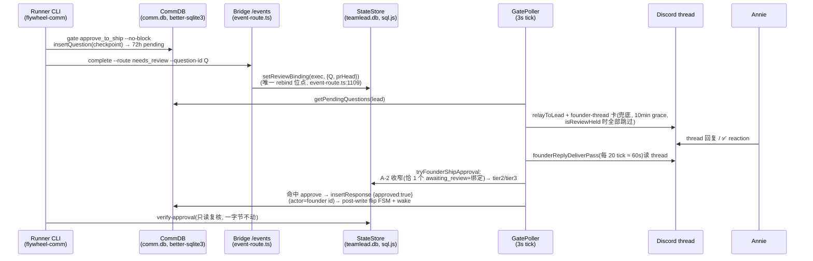

# FLY-1041 Founder 批准绑定故障 — 调研

Issue: FLY-1041 (https://linear.app/geoforge3d/issue/FLY-1041/founder-approval-binding-glitch-thread-reply-wont-bind-to-gate-under)
日期: 2026-07-08
基于: exploration.md

## 1. 绑定链路全景(代码地图)

关键文件(全部实测读过):

| 模块 | 文件 | 与本设计的关系 |
|---|---|---|
| gate 创建 | `flywheel-comm/src/commands/gate.ts` | no-block 插入 question 后**不管退役**(FLY-191 设计如此) |
| completion + rebind | `flywheel-comm/src/commands/complete.ts` → `teamlead/src/bridge/event-route.ts:920-1193` | **唯一** rebind 位点(isReReview 分支 + writeReviewBinding);Fix A 主挂点 |
| in-process sink | `teamlead/src/DirectEventSink.ts:709-737` | **从不写 Phase-2 绑定**(R4 契约,qid-less)→ Fix A 不用动它 |
| marker 重放 | `teamlead/src/bridge/complete-marker-reconciler.ts` | loopback 自 POST `/events` → 收敛到 event-route → Fix A 自动覆盖 |
| 问题收集/relay/卡/nudge | `teamlead/src/bridge/gate-poller.ts:430-560, 1679-1800, 2264-2420` | 兜底 sweeper 挂点(复用既有 eviction 机制);卡的 grace/hold 逻辑在此 |
| founder 回复投递 | `teamlead/src/bridge/founder-reply-deliverer.ts` | matching 集合、ship/nonShip 分支、ambiguous 判定、WAKE-only;Fix B/C/D 主挂点 |
| ship 文本归因 | `approval-signal/founder-ship-approval-{factory,handler}.ts` | A-2 收窄、tier2→tier3、写 response;Fix B/C 挂点 |
| tier2 | `approval-signal/tier2-allowlist.ts` | 整句精确 allowlist + deny token;Fix C 归一化挂点 |
| tier3 | `approval-signal/founder-ship-approval-classifier.ts` + `subscription-claude-classifier-runner.ts` | headless claude -p Haiku、20s 超时、fail-closed;失败 reason 现被丢弃 |
| 卡消息绑定 | `approval-signal/gate-message-binding.ts` | `(questionId, prHeadSha) → gateMessageId` 持久 event、`selectCurrentBinding` fail-closed;reply-to-card 直接复用 |
| ✅ reaction | `approval-signal/founder-reaction-approval-handler.ts` | 已有 `readCurrentBinding` 依赖注入形态,Fix B 照抄 |
| hold 谓词 | `teamlead/src/bridge/auto-qa-held.ts` | `isReviewHeld` = merge_block ∨ (awaiting_review ∧ (codex 未过 ∨ QA 未绿)) |
| 复核 | `flywheel-comm/src/commands/verify-approval.ts` | **零改动**(安全红线) |
| CommDB | `flywheel-comm/src/db.ts` | `getPendingQuestions` 语义、`resolveGate` 语义、幂等 ADD COLUMN 迁移先例(L129-163) |

## 2. exploration §7 待研究项 → 答案

### 2.1 rebind 位点是否只有一处?——是

- `setReviewBinding` 唯一调用点 = `event-route.ts:1109`(HTTP `/events` sink)。
- `DirectEventSink` 按 FLY-191 R4 契约**从不**写 Phase-2 绑定(qid-less 路径,`phase2Bound` 保护)。
- `complete-marker-reconciler`(FLY-172 boot drain)经 loopback HTTP 自 POST `/events` 重放 → 收敛到同一位点。
- **结论**:Fix A 的 retire-on-rebind 只需挂在 event-route 一处(isReReview 分支 + FLY-945 Fix C 的 approved_to_ship→awaiting_review 分支,两处代码位置、同一函数内);sweeper 兜其余(crash 窗口、手工 gate)。

### 2.2 910 的卡为何迟发 2h17m / 新 gate 从未发卡?——codex-HOLD 压制(生产实证)

- `codex_review_record` 实查:`(84cf4790, 245aa676…) status=pending`(始终未 approved)。
- `isReviewHeld` → codex gate 未满足 → **HELD** → GatePoller 跳过 ship gate 的 relay + founder 卡(gate-poller.ts:492-499,FLY-579/827 契约:codex+QA 不绿不打扰 founder)。
- 05:47:41 文本归因写入批准 → status 翻 approved_to_ship → `isReviewHeld` 的 `status !== "awaiting_review"` 短路 → 不再 held → 05:47:52 下一 tick 把**还 pending 的旧 gate** c450a598 发卡。
- **两个设计推论**:
  1. Fix B 的"卡转正"必须尊重 hold —— 卡在 gate 首次**可 surface**(un-held)的 tick 发出,GatePoller 循环天然做到,无需新 timer;
  2. **发现新的不一致**:文本归因路径不查 hold —— held 期间(codex 未过)founder 的批准照样被写入并翻转 FSM,与"held 时不 surface founder"契约矛盾,且製造了"绑上了却 ship 不了"(verify-approval 第 5 步 codex gate 会拒)的 FLY-921 式困惑。Fix B 补上:归因前查 `isReviewHeld`,held → 不写 response,走 Fix C 的 ❓ 回执(告知"code review/QA 还没绿")。

### 2.3 `message_reference` 是否已在批量 GET 返回里?——是

Discord `GET /channels/{id}/messages` 返回的 message 对象:REPLY 类型(type 19)自带 `message_reference: { message_id, channel_id, guild_id }`(发起 reply 时客户端必填 message_id)。`referenced_message`(全文)不保证,但 reply-to-card 只需 `message_reference.message_id` 与已绑 `gateMessageId` 对齐。**无需额外 API 调用**;deliverer 的 `RawDiscordMessage` 接口加一个可选字段即可。

### 2.4 回执 reaction 与入站处理的相互作用?——无

- 加 reaction = `PUT /channels/{cid}/messages/{mid}/reactions/{emoji}/@me`(bot 需 ADD_REACTIONS 权限;与读 reactions 的 ✅ 审批路径同一权限族,生产 bot 已在 thread 内工作)。
- Reaction 不产生 message → RestPoll / founderReplyDeliverPass 只拉 messages → 零入站回环;与 reply-guard / mention-gating 无交集。
- 幂等:PUT 天然幂等;再加 session_events 标记(`founder-ack-<msgId>-<outcome>`)防重复审计。

### 2.5 Tier-3 classifier 失败面?——大,且现在完全不可见

- 一次性 `claude -p <prompt> --model haiku --output-format json`,20s 超时、1MB buffer,任何失败(CLI 缺失/未登录/限流/超时/envelope 错)→ `{ok:false, reason}`。
- `evaluateTextSource` 把 `ok:false` 与"模型判 unclear"**同样折叠成 unclear**,reason 丢弃 → RC-2 无法归因("嗯ship"到底是被判 unclear 还是 spawn 失败,生产已不可考)。
- 本机常态高负载(60+ session),20s 内 spawn+跑完 claude CLI 失败并不罕见 → 归因审计(Fix C)必须把 `runner_failed(reason)` 与 `model_unclear` 分开落档。
- 缓解依赖 Fix B 的确定性通道(✅/reply-to-card),不追加 classifier retry(YAGNI,先拿数据)。

### 2.6 `--report` 迁移半径?——3 个文件 + 1 个幂等迁移

- `flywheel-comm/src/commands/ask.ts`:加 `--report` flag → `insertQuestion(..., {kind:'report'})`。
- `flywheel-comm/src/db.ts`:messages 表幂等 `ADD COLUMN kind TEXT`(先例 L129-163);`insertQuestion` 透传。**不复用 `checkpoint` 列**——GatePoller 对 `checkpoint != null` 走 gate-eviction 分支、`checkpoint === 'question'` 走 lead-pending nudge,语义均不适用于汇报。
- `founder-reply-deliverer.ts` / `gate-poller.ts founderReplyDeliverPass`:组装 thread questions 时排除 `kind === 'report'`(founder 回复候选集);**relayToLead 不变**(汇报仍到 Lead)。
- `edge-worker/src/Blueprint.ts:1344`(LEAD REPORT-BACK 文本):DONE 汇报命令改为带 `--report`。旧 runner / 未标记 ask 行为字节不变(kind NULL)。
- 兼容注意:`ask --report` 在旧 dist 上运行会因未知 flag 报错?——CLI 解析在 index.ts,新 flag 只加不减;生产 runner 调的是主仓 dist(`git pull` 后生效,与 FLY-217 同型:提示词与 CLI 同 PR 落地,pull 前旧提示词+旧 CLI 自洽)。

## 3. 其余机制核实(plan 直接引用)

### 3.1 retire 的正确原语:`resolveGate(oldQid, 0)`,不是默认 TTL

`getPendingQuestions` 的过滤条件是 `NOT EXISTS(response) AND expires_at > now` —— **不看 `resolved_at`**。`resolveGate(qid, 24)` 会把 expires 设到 +24h,问题**依旧 pending**。gate.ts 超时清理用的是 `resolveGate(qid, 0)`(expires=now,立即退出 pending)。Fix A 必须同款 TTL=0。行不删(cleanup prune 到期物理删,c450a598 即如此消失);持久取证靠 session_events 的 `ship_gate_superseded` 审计事件(insertEvent 写 teamlead.db,不受 comm.db prune 影响)。

### 3.2 sweeper 的挂点与防误杀

- GatePoller relay 循环(gate-poller.ts:455 起)本就逐条遍历 pending questions 且已有 per-question eviction 机制(`evictedGateIds` / `evictionRetryAt` / `evictTerminalGateQuestion`)——sweeper 逻辑内联同一循环,**零新 timer**(项目惯例)。
- 判据:`q.checkpoint === 'approve_to_ship' && session.review_question_id && session.review_question_id !== q.id` 且**当前绑定的 question 行存在且 `created_at` 严格晚于 `q.created_at`**(同秒不动,SQLite 1s 分辨率,FLY-191 同源告诫)→ q 已被取代 → retire。
- 防误杀窗口:「新 gate 已 fire、complete 还没到」时 session 仍绑旧 qid,此刻**新** gate 满足 `!== review_question_id`,但绑定行(旧)created_at **早于**新 gate → 判据不成立 → 新 gate 安全。
- 终态 session 的 gate 已有 evictTerminalGateQuestion 处理,不重叠。

### 3.3 卡(founder-thread notify)现状参数

- 兜底触发:`founderThreadGraceMs` 默认 10min、retry 预算 45min、durable 去重 marker `founder-thread-notify-<qid>`、`FLYWHEEL_FOUNDER_THREAD_NOTIFY=0` 总开关。
- Fix B 改法:approve_to_ship 专属 grace 降为 `shipGateCardGraceMs`(新 config/env,默认 ~15s,对齐 `FLYWHEEL_SHIP_GATE_GRACE_MS` 的量级);brainstorm 维持 10min 不动。hold 语义不动(held 不发卡)。
- 卡文案追加明确指引:「回复这条消息或点 ✅ 即批准;其它 thread 闲聊不会被当成批准」。

### 3.4 reply-to-card 的绑定读取

`founder-reaction-approval-handler` 已定义 `readCurrentBinding(executionId, questionId, prHeadSha) → GateMessageBinding | null` 依赖(plugin.ts 组合根从 session_events 读 `ship-gate-msg-binding-*` 事件 + `selectCurrentBinding` fail-closed)。reply-to-card 复用同一 reader:对 founder 消息的 `message_reference.message_id`,在该 thread 各 pending ship gate 的 current binding 里找 `gateMessageId` 相等者 → 命中即确定性目标(仍走 tier2/tier3 判 approve/reject,tier3 prompt 注入「这是对该 ship gate 卡的直接回复」上下文)。找不到绑定 → 回落现有路径(字节兼容)。

### 3.5 节奏与延迟预算

GatePoller tick=3s(plugin.ts:4000);founderReplyDeliverPass 每 20 tick ≈ 60s;ship 回复 grace 15s(FLY-945)。含 Fix C 回执:founder 发批准 → 绑定+✅ 回执典型 ≤ ~75s。可接受(与现状一致,不新增 timer)。

### 3.6 归因审计事件形态(Fix C)

复用 deliverer 的 `audit()`(session_events,execution 维度)。新增 event_type(均带 questionId/msgId):

- `founder_ship_attribution` payload: `{stage: "tier2_approve" | "tier2_downgrade" | "tier3_approve" | "tier3_reject" | "tier3_unclear" | "tier3_runner_failed" | "narrow_zero" | "narrow_multi" | "held_declined" | "reply_to_card_hit", reason?}`
- `founder_ack_reacted` payload: `{msgId, emoji: "✅" | "❓", outcome}`(PUT 失败 → `founder_ack_failed`,best-effort 不阻断)。

### 3.7 回归测试与真机 QA 的既有基建

- 单测先例:`founder-reply-deliverer` / `approval-signal/*` / `event-route` 均有成套 vitest(mock store + mock fetch);tier2 是表驱动测试(边界钉死)。
- 真机:529 Room(`FLYWHEEL_FOUNDER_ATTRIBUTION_GATE` 等 live flag 均可在 QA room 独立 .env 控制,verify-approval §3.5 注明 QA rooms 用法);FLY-605/799 均有"模块驱动真 Discord"配方(memory: reference_fly605_relay_real_discord_e2e / roundtable QA recipe)。

## 4. 风险清单(plan 需逐条对应)

| # | 风险 | 缓解 |
|---|---|---|
| R1 | retire 误杀当前活跃 gate → founder 批准无处可绑(比现状更糟) | 主路径只 retire event-route 拿到的**确切旧 qid**(`existingSession.review_question_id`,rebind 前快照);sweeper 用严格 created_at 比较 + 同秒不动;kill-switch `FLYWHEEL_SHIP_GATE_RETIRE=0` |
| R2 | 跨库无事务(StateStore=sql.js,CommDB=better-sqlite3):rebind 成功、retire 失败 | 顺序 = 先 rebind(权威)后 retire;retire 失败仅 warn,sweeper 下一 tick 幂等补刀 |
| R3 | 卡转正在多 gate 项目里加大 thread 消息量 | 只动 approve_to_ship;每 gate 一张卡(durable marker 去重不变);Fix A 保证同时至多一个可绑 gate |
| R4 | 归因-hold 对齐让"codex 记录卡 pending"类 bug(910 即是)把批准也挡住 | held_declined 走 ❓ 回执 + 审计(founder 立即看到"没绑上+原因",而非静默);hold 本身的卡死问题归 FLY-863/827 既有 reconcile,不在本 issue 扩科 |
| R5 | tier2 归一化把非批准误判成批准 | 只剥离**纯语气前缀**白名单(嗯/嗯嗯/好/好的/哦/行/ok/okk);deny token 检查在剥离**前后各跑一遍**;结构复杂度检查不动;表驱动测试钉边界 |
| R6 | `kind` 列迁移撞并发 ADD COLUMN | 沿用 db.ts L148 先例(吞 duplicate column 错) |
| R7 | ✅ 回执被误读成"已 ship" | 回执语义只表示"批准已绑定,进入 ship 流程";卡文案写明;ship 完成另有既有 thread 通知 |

## 5. 明确不动的面(安全红线,Lead 加固点 1)

- `verify-approval.ts` 全文件、`respond.ts` 的 FLY-175 拒写逻辑、`write-gate-response.ts` 的 expectedCurrentReviewQuestionId 校验、WorkflowFSM 边集 —— **零改动**。
- reply-to-card / ✅ / tier2 归一化都只影响「founder 意图如何被认到某个 gate」;批准效力仍必须走 verify-approval 全链(founder 归因 + pr_head_sha + codex hard gate)。
