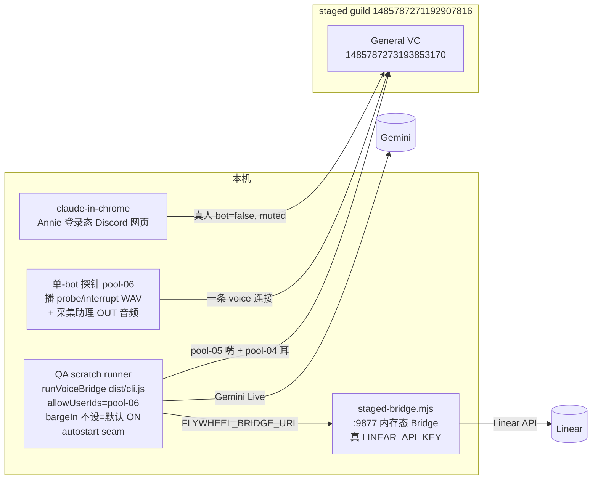

# FLY-1047 /gemini 打断开关 + 开场音真机 QA — 调研
Issue: FLY-1047 (https://linear.app/geoforge3d/issue/FLY-1047/qa-fly-967-gemini-打断开关-开场音真机验证pr-501-6c3ec409)
日期: 2026-07-09
基于: exploration.md

> 全部代码事实核对自父单 worktree `/Users/xiaorongli/Dev/flywheel-FLY-967`(当前正好在目标 head `6c3ec409`,只读);QA 执行时在自己的 detached worktree 重新 checkout 同一 head 再核一遍。

## 1. 被测行为的代码链路(head 6c3ec409)

### 1.1 barge-in 开关(标准 ①②的开关面)

- 配置入口:`packages/voice-bridge/src/assistant/config.ts:123` — `bargeIn: optBoolean(a, "bargeIn") ?? true`(**默认 ON**;R21:非布尔值 fail-fast)。旧键 `localBargeIn` 是另一条本地预停闸,默认 false,v1 未启用,与本单无关。
- 传递:`assistant/wiring.ts:638` `bargeIn: assistant.bargeIn !== false` → voice-core `ConversationOptions` → `GeminiLiveBackend.ts:110` `bargeIn: opts.bargeIn ?? true` → `LiveConnectParams` → `genaiConnector.ts:66-74`:
  - **ON**:整个省略 `realtimeInputConfig` → SDK 默认 `START_OF_ACTIVITY_INTERRUPTS`(server VAD 打断);
  - **OFF**:`config.realtimeInputConfig = { activityHandling: "NO_INTERRUPTION" }`(防音箱回声误掐)。
- 打断事件流(①):server 发 `serverContent.interrupted` → `genaiConnector.ts:154` emit `{type:"interrupted"}` → `GeminiLiveBackend.ts:291` case → `:215` emit **`response-cancelled`**(同时标记本 turn cancelled,后到的 audio/transcript/tool-call 全部按 local-suppression 丢弃)→ `AssistantSession.ts:331-333`:log「**response cancelled (barge-in) — flushing speaker**」+ `speaker.flush()` → `AssistantSpeaker.flush()` 立即停声并击杀死 turn。late audio/transcript/tool-call 在 **voice-core 层就被抑制**(cancelled turn 不再 emit response-audio,也**不发 response-done**)→ QA 断言「flush 后零 post-cancel response-audio/playback」;speaker 的 `dropped` 计数只当机会性诊断(它只在 feed()/endTurn() 路径出现,cancelled turn 可能整段缺席)。
- **本地打断闸是 no-op**:`wiring.ts:208` `onBargeIn: () => {}`(注释:v1 Gemini server VAD is the barge-in main path)。→ ① 没有本地捷径,验的就是全链。

### 1.2 ears 管道与 QA 注入 seam(①的注入前提)

`audio/EarsReceiver.ts`:
- `isHuman` 过滤是**结构性防回声**(bot 的播放永远进不了 Gemini);`allowUserIds` 是显式 QA seam:`admitted(userId) = isHuman(userId) || allow.has(userId)`(`:86-88`)。admit 之后解码/降采样/onFrame 转发**与真人完全同管道**。
- 帧格式:48k stereo opus → decode → downmix → **16kHz mono s16le** → `conv.sendAudio`(wiring `:200-205`)。
- backchannel 闸(350ms)只喂本地 onBargeIn(no-op),不影响帧转发 —— 注入音频从 speaking-start 就开始转发。
- **rig 结论**:tracked 的 `e2e/gemini-staged.mjs` 写死 `allowUserIds: []`,QA 必须用自己的 scratch runner 传 `allowUserIds: ["1523232391349403850"]`(pool-06)。

### 1.3 开场懒开窗(标准 ③)

round-4 修复(`9963d876`)后:response window 在一个 turn 的**第一个模型输出**(audio 或 assistant transcript)上懒打开,与 turn 由谁发起无关(修复前只在 USER transcript 上开窗,sendText 发起的开场 turn 永远不开窗 → 开场 chunk 全被 turn 闸丢掉)。每 turn 恰好开一次,turn-complete 后重新 arm。
- 链路:`AssistantSession.enterLive()`(`:254-260`)→ log「state -> live (source)」→ `conv.sendText(OPENING_PROMPT)` → log「OPENING prompt sent to Gemini」→ 模型首输出 → `response-started` → log「response started」+ `speaker.beginTurn()`(「[assistant-speaker] turn begin」)→ `response-audio`* → 「first response audio from Gemini」/「[assistant-speaker] first audio chunk」→ `response-done` → 「response done (audio chunks this turn: N)」+ `endTurn()`(「turn end — chunks=N bytes=B dropped=D」)。
- 进 live 的两条路:daemon 起后founder已在 VC → `enterLive("initial-check")`;founder 后进 → `enterLive("founder-join")`。两条都合法;rig 采用「Chrome 先进 VC 再起 round」→ initial-check 路径(变量最少,避开 no-show timer)。

### 1.4 founder 在场判定(rig 的「真人」前提)

`bots/discordWiring.ts:496/537/552`:human = `member.user.bot === false`(round-3 修复 `e58059a6`:未解析成员不再默认当 bot)。→ Annie 登录态的 Discord 网页进 VC 即 `founderPresent()=true`;**mute 不影响在场判定**(只看 voice state),这同时是 ② 的静默前提。

## 2. rig 资产与环境合同

### 2.1 交接包 `~/.flywheel/qa-fly967-staged/`(0600,勿打印值)

| 文件 | 用途 |
|------|------|
| `.env.staged` | LINEAR_API_KEY / HUDDLE_EARS_BOT_TOKEN(pool-04)/ HUDDLE_ORCH_BOT_TOKEN(pool-05)/ FLYWHEEL_API_TOKEN(staged 专用 bearer)/ GEMINI_API_KEY |
| `projects.staged.json` | flywheel linear binding + huddle.assistant 块(voiceChannelId = General VC,Annie 批) |
| `interrupt-zh-48k.wav` | ① 的打断素材(2026-07-08 22:36 落盘 = round-5 当轮素材) |
| `fakeaudio-chrome.sh` | 备用 IN-leg(独立 Chrome + WAV 麦克风)— 本单仅 fallback |
| `founder-round.mjs` | 无 autostart 的 daemon 起法参考(`allowUserIds: []`,QA runner 需自带) |
| `README-for-qa.md` | 父单 implement 留的跑法说明(head 写 bf8369b1,已过时 → 必须自建 worktree 重建 dist) |

probe WAV(诱导长回答的问题语料):父会话 scratchpad `/private/tmp/claude-501/-Users-xiaorongli-Dev-flywheel-FLY-967/33ec0374-*/scratchpad/voice-loop/probe-zh-48k.wav` 尚在;session scratchpad 属临时目录,执行时若已被清,用 `say`(中文声)+ `ffmpeg`(→ pcm_s16le 48k stereo)重生成同规格素材。

### 2.2 进程拓扑(全隔离,零生产接触)

- `gemini-staged.mjs` 硬拒 9876 生产端口(Codex R7 守卫)——QA runner 保留同守卫。**注意(design review R1 #3)**:`staged-bridge.mjs` 本身只默认 9877、并不拒 9876(`STAGED_BRIDGE_PORT` 透传)→ QA launcher 必须显式 `STAGED_BRIDGE_PORT=9877` 并前置断言,继承来的 env 不许生效。
- `staged-bridge.mjs` import `../../teamlead/dist/bridge/plugin.js` → **dist 重建范围 = voice-core + voice-bridge + teamlead 三包**。
- pool-06 同 guild 只能一条 voice 连接 → 注入 + 采集合并在一条连接上(player 播、receiver 订阅并行);合并探针不稳则分幕串行(幕一只采集、幕二只注入,证据面等价、少一路交叉证据)。

### 2.3 bot / 身份清单

| 角色 | slot | user id | 进 VC 形态 |
|------|------|---------|-----------|
| 嘴(orchestrator) | pool-05 | 1523230048243417178 | daemon 管理 |
| 耳(Note-taker) | pool-04 | 1523225879180742777 | daemon 管理,常驻 |
| 注入+采集探针 | pool-06 | 1523232391349403850 | QA 脚本,selfMute=false / selfDeaf=false |
| 真人(founder) | Annie 登录态(网页) | — | claude-in-chrome,**muted** |

## 3. 判据锚点表(执行时逐条打勾)

| # | 锚点 | 来源 | 阈值/形态 |
|---|------|------|----------|
| ③-1 | 「state -> live (initial-check)」+「OPENING prompt sent to Gemini」 | daemon log | enterLive 即时 |
| ③-2 | 「response started」+「[assistant-speaker] turn begin」 | daemon log | ≤15s(含模型首响应;S-A1 基线首 chunk 706-1275ms) |
| ③-3 | 「first response audio from Gemini」+「[assistant-speaker] first audio chunk」 | daemon log | 同上 |
| ③-4 | 「turn end — chunks=N bytes=B dropped=D」,N>0 | daemon log | 开场 turn 完整收尾 |
| ③-5 | OUT 采集 WAV STT 转写为可读中文简报/开场白 | 探针 + Gemini STT | 非 GARBLE/静音;WAV 存档 evidence |
| ②-1 | 幕一全程(开场 turn + ≥60s 静默 hold)**零**「response cancelled」 | daemon log | 绝对零 |
| ②-2 | 幕一 turn 以「response done」干净收尾(非 cancelled) | daemon log | — |
| ①-1 | 探针 log 注入时间戳 → 「response cancelled (barge-in) — flushing speaker」 | 双 log 对时 | ≤3s |
| ①-2 | flush 后该 turn 零新 response-audio /「first audio chunk」/ playback 写入 | daemon log | 绝对零。**注意**:cancelled turn 不发 response-done → 「turn end — dropped=D」日志可能整段缺席(endTurn 只在干净收尾时打),dropped 计数仅作机会性诊断,**不是**判据(design review R1 #2) |
| ①-3 | OUT 采集音频在 cancel 点戛止(尾音 ≤1s) | 探针 WAV | 波形/时长佐证 |
| 环境 | 单测独立复证:voice-bridge 131 + voice-core 116 + teamlead 路由 18 全绿;typecheck 干净 | 自己 worktree | 前置门 |

## 4. 风险与边界(诚实声明)

1. **① 经 allowUserIds seam 而非 isHuman 分支**:admit 后管道相同,但物理真人(麦克风底噪、音量、VAD 灵敏度)只有 Annie 真用覆盖 —— 与父单 A8 边界一致,报告注明。
2. **claude-in-chrome 连不上** → 按 issue 硬指令:立刻 escalate Tadashi,不 retry 循环。
3. **venue 冻结**:只进现有 General VC;不建/不改/不删频道、不改权限、不踢人;结束探针与 Chrome 都退出 VC。
4. **Gemini 侧不确定性**:15min 音频时限(轮次控制在 <10min)、preview 模型退役/配额 529(区分「环境失败」vs「PR 行为失败」;环境失败重试一次,再失败报 Tadashi 而非记 FAIL)。
5. **autostart 会建真 Linear kickoff issue**:landing 正常自动关;残留照 FLY-991/992 先例 Cancel 注明测试产物。
6. **生产隔离**:runner 的 URL 守卫硬拒 `:9876`;`staged-bridge.mjs` 本身不拒 → launcher 强制并断言 `STAGED_BRIDGE_PORT=9877`(同 §2.2 / plan 红线 3);不碰生产 StateStore/config/Bridge;`.env.staged` 值不进日志。
7. **机器负载**:rig(3 bot voice 连接 + Gemini Live + Chrome)同跑,开跑前查 load;高载可分幕串行降压。
8. **父单 worktree 只读红线**:不在 `/Users/xiaorongli/Dev/flywheel-FLY-967` 里跑任何东西(它是父单 shared worktree);一切在自己的 detached checkout + scratch 目录。

## 5. 结论

方案 A 可行且全部构件有真机先例;唯一的新组装点 = ① scratch runner 传 allowUserIds、② pool-06 单连接注入+采集合并。判据全部锚在 head 已有的日志行上,零源码改动。→ 进入 plan。
