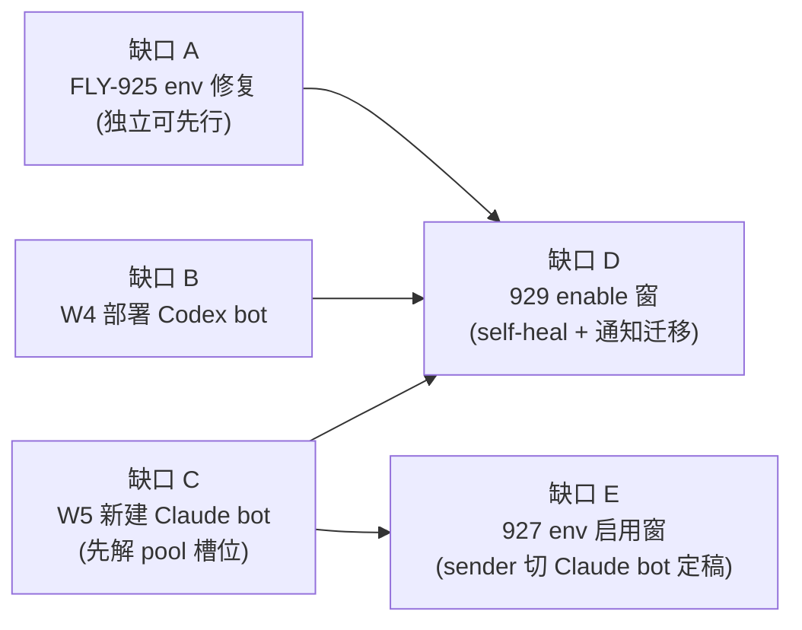

# FLY-1049 FLY-915 alerts 收尾 — 探索(剩余缺口清单)

Issue: FLY-1049 (https://linear.app/geoforge3d/issue/FLY-1049/build-fly-915-alerts-收尾先确认-925928-剩余排除已-ship-的-927929)
日期: 2026-07-09
基于: 无(上游 = FLY-915 PRD `product/doc/FLY-915-infra-alerts-pipeline/prd.md`)

## 0. 任务与方法

FLY-1049 第一步(必做):确认 925 / 928 到底还剩什么没做 —— PRD 要求 vs main 现状 vs 已 ship 的 927/929 覆盖面,产出「剩余缺口清单」报 Tadashi 确认 scope。

审计方法(全部一手证据,非转述):

- 读 FLY-915 PRD 全文(§2-§10,W1-W6 workstream 表)+ FLY-925/927/928/929 四个 issue 原文。
- 读 927/929 的 plan/progress/qa 文档(`engineering/doc/FLY-927-alert-ticket-queue/`、`FLY-929-profile-autoswitch-notify-migration/`)+ FLY-871 C6 部署 runbook。
- 审计 main 代码(PR #492 / #490 的落地面 + env flag 默认值)。
- 审计生产机器态:`~/.flywheel/.env` 变量名清单、launchd job 状态、运行进程、bot 池 `pool.json`、`/tmp` 下两个 launchd job 的失败日志、`~/.flywheel/projects.json`。

## 1. 结论先行

**不是「无剩余、可关」。** 925 完全没修(bug 每晚仍复现,有当晚日志铁证);928 的 W4/W5 都没做(W5 还撞上一个 PRD 之后出现的新障碍:bot 池 6 槽已全占);另外 927/929 虽已 merge,但**运行时全部 dormant**——它们各自的 enable 窗(env 翻转 + 部署 + 真机 QA + Annie GO)一步都没执行,生产的 alert/通知行为至今 = 927 之前的逐字现状。

## 2. 已 ship 的 927/929 实际覆盖了什么(不重复的部分)

| Issue | PR | 覆盖(代码层) | 生产运行时状态 |
|---|---|---|---|
| FLY-927 | #492 | 工单队列/路由/@-target/发送方门禁/速率兜底/消息 schema/Watchdog v2(checkpoint-park + 权威 stage 措辞)/治假冻结,全部代码 + 测试 + `doc/architecture/infra-alerts-spec.md` | **dormant**。5 个开关全未设:`FLYWHEEL_ALERT_ROUTING` / `FLYWHEEL_ALERT_TICKETS` / `FLYWHEEL_ALERT_RATE_PER_MIN` / `FLYWHEEL_ALERT_SENDER_TOKEN_ENV` / `FLYWHEEL_CHECKPOINT_WATCHDOG`(代码确认默认全 OFF = 逐字现状;plan §5 步 1「Ship 全关」→ 步 2-5 配置/重启/权限收紧/QA/Annie 早报确认未执行) |
| FLY-929 | #490 | profile 自动切换 enable 面 + 通知 sender 迁移(reports/restart/standup → Claude Infra Bot)+ 自我健康检查,env-keyed dormant merge + `enable-runbook.md` | **dormant**。`FLYWHEEL_ACCOUNT_SELF_HEAL` / `FLYWHEEL_CLAUDE_PROFILE_BIN` / `CLAUDE_INFRA_BOT_TOKEN` / `FLYWHEEL_NOTIFY_CHANNEL` / `FLYWHEEL_NOTIFY_DIGEST_EXPECT` 全未设;`~/.flywheel/notify-receipts.json` 不存在;Claude 账号池未 provision(`flywheel-claude-profile status` 只有 active profile,无池) |

929 的 enable-runbook 步 0 前置写死:FLY-925 merged + FLY-928 W5 done + FLY-928 W4 done。即整条链的运行时启用都堵在 925 + 928 上 —— 与 Cass 标注「925/928 剩余待确认」完全一致。

## 3. 剩余缺口清单(逐条,附证据)

### 缺口 A · FLY-925(W3a quick-fix)— 完全未做,每晚复现

1. **token report**:每晚 00:30 聚合+渲染都成功,publish 步失败。铁证:`/tmp/flywheel-token-usage-daily.log` 连续多晚(含 2026-07-09 当晚)`{"delivered":false,"error":"FLYWHEEL_BRIDGE_URL (or BRIDGE_URL) environment variable is required"}`;launchd job `com.flywheel.token-usage-daily` 上次退出码 1。`FLYWHEEL_BRIDGE_URL` 不在 `~/.flywheel/.env` 也不在 plist(脚本会 source .env,补进 .env 即生效)。
2. **standup**:每晚 03:00 失败。铁证:`/tmp/flywheel-standup.log` 连续多晚 curl exit 22;launchd job 上次退出码 22。根因与 issue 描述一致:Bridge 多项目 setup 必须 `STANDUP_PROJECT_NAME`(`plugin.ts:3057-3073`,未设 → 启动即「Standup disabled」→ trigger 4xx),该 env 未设。修复需 .env 补 env + **一次 Bridge 重启**(standup 在 Bridge 启动时 resolve)。
3. 验证项(issue 原文要求):次日 token report + standup 真的发出来。

### 缺口 B · FLY-928 W4(部署 Codex Infra Bot)— 物料齐、部署窗未开

- 已有:代码 merged(FLY-871);pool-03 身份已 claim(bot_user_id `1523219324561522831` = .env `FLYWHEEL_INFRA_BOT_USER_ID`);`CODEX_INFRA_BOT_TOKEN` / `FLYWHEEL_INFRA_BOT_CHAT_CHANNEL_ID` 在 .env;`projects.json` 已有 `codex-infra-bot-lead` 条目;launcher `packages/teamlead/scripts/run-codex-infra-bot-tui.sh` + plist 模板 `packages/teamlead/scripts/templates/com.flywheel.lead.flywheel-codex-infra-bot-lead.tui.plist` + persona `.lead/codex-infra-bot-lead/identity.md` 在 repo;wrapper 在 `~/.flywheel/bin/`。
- 缺:**launchd 未装**(LaunchAgents 无对应 plist、launchctl 无 job、无进程在跑 —— ps/tmux 双向查证);`FLYWHEEL_ACCOUNT_SELF_HEAL` 未开(整套 R2/R3 救援机器休眠,C6 runbook 明言);C6 的 verify-windowed-lead / 注入演练 / Annie GO 未走。
- 即:W4 = 执行 C6 部署 runbook(founder-gated 运维窗),几乎零新代码。

### 缺口 C · FLY-928 W5(新建 Claude Infra Bot)— 完全未做 + 一个新障碍

- 代码侧:repo 里**没有任何** claude-infra-bot 资产(无 persona / launcher / plist / projects.json 条目;grep 全仓 0 命中)。FLY-929 只 merge 了「消费侧」(`infra-notify.ts` 等读 `CLAUDE_INFRA_BOT_TOKEN` 当 sender)。要仿 CMP-1 造一套常驻 lead 物料 + 接线(监听 #flywheel-alerts 处理 @ 自己的工单 + 唯一发 #flywheel-notify)。
- **新障碍(PRD 定稿后出现)**:PRD/928 预设 Claude Infra Bot 从 pool-04/05/06 claim,但 bot 池 **6 槽现已全部被占**:pool-04 = huddle-note-taker(Note-taker)、pool-05 = fly545-qa-speaker、pool-06 = huddle-orchestrator(Huddle)(均 2026-07-07 claim,FLY-545 huddle-mode 相关)。→ 需要决定:释放 fly545-qa-speaker(若确属 QA 临时占用)/ 释放 huddle 槽 / Annie 在 Portal 预建新槽。**不能由 Runner 自作主张释放别人的 claim。**
- T3(Claude Infra Bot 命名)仍是占位,Annie 待定(PRD 已明确不 block 开工)。

### 缺口 D · 929 enable 窗(W6 + W3b 激活)— runbook 已写好,一步没走

`enable-runbook.md` 7 步(provision Claude 账号池【需 Annie 在场】→ 写 env → Bridge 重启 → 探活 → FLY-696 §8 真机 QA【绝不弄坏 claude 登录红线】→ 注入演练 → Annie GO + 次日观察)。前置 = 缺口 A + B + C。

### 缺口 E · 927 运行时启用(它自己 plan §5 步 2-5)— 未执行

- 5 个 env 翻转 + 一次 Bridge 重启(927 plan 原文:`FLYWHEEL_ALERT_ROUTING=1`、`FLYWHEEL_ALERT_TICKETS=1`、`FLYWHEEL_ALERT_RATE_PER_MIN=20`、`FLYWHEEL_ALERT_SENDER_TOKEN_ENV=CASS_BOT_TOKEN` 过渡 → 928 后切 Claude Infra Bot、`FLYWHEEL_CHECKPOINT_WATCHDOG=1`)。**【后续修正】**sender 身份终态已两次改写:Q4 裁掉 CASS 过渡态;design R1 再修正为**专用 dispatcher 身份**(绝不用任何 owner bot 的 token,作者≠owner)—— 以 plan.md 头注 + enable-window-runbook.md 步 2 为准。
- ops:告警频道 Discord 权限收紧(只给 infra bot + 发送身份 Send)—— 927 plan 步 3 写明「写进 FLY-928 部署 runbook 交叉引用」,即本来就打算在 928 的窗里做。
- 独立真机 QA(529 Room)+ Annie 早报确认项(D1/D2 裁定 + founder-page 行为变更)。
- **scope 归属待 Tadashi 确认**:「927 已 ship 不要重复」= 不重复实现代码;但它的启用窗至今无主 —— 不启用则整条 915 pipeline 白建(alert 频道行为零变化)。

## 4. 缺口间依赖(执行顺序)

注:E 可在 C 之前用 CASS_BOT_TOKEN 过渡先开(927 plan 原设计),也可并进统一窗一次做;B/D/E 都要 Bridge 重启 → 按「多 PR 攒一次重启」纪律合并成**一个统一 enable 窗**最省。

## 5. 建议的 FLY-1049 实施 scope(供 Tadashi 拍板)

1. **修 925**(config + 验证;.env 补 `FLYWHEEL_BRIDGE_URL` + `STANDUP_PROJECT_NAME`,Bridge 重启搭统一窗)—— 925 是独立 Backlog issue,建议由 1049 承接后把 925 标 Done/duplicate,避免双工。
2. **W5 代码物料**(Claude Infra Bot persona/launcher/plist 模板/projects.json 接线,仿 CMP-1)+ **pool 槽位决定**(需 Tadashi/Annie:释放哪个槽或新建)。
3. **统一 enable 窗 runbook**:把 C6(W4)+ 929 enable-runbook + 927 plan §5 步 2-5 收敛成一份按序清单(一次 Bridge 重启),founder-gated 执行 + 独立真机 QA + Annie GO。
4. 928 同为 Backlog issue,1049 做的就是它的活 → 建议 fold(标 duplicate 或由 Tadashi 收编)。

## 6. 待 Tadashi 确认的问题(design gate)

- Q1:缺口 E(927 启用窗)归 1049 吗?(建议:归,并进统一 enable 窗;否则 915 pipeline 生产零生效)
- Q2:pool 槽位怎么解 —— 释放 fly545-qa-speaker / 动 huddle 槽 / 请 Annie 新建?(Runner 不自决)
- Q3:925 / 928 两个 Backlog issue 的收编方式(fold 进 1049 还是各自关)?
- Q4:sender 门禁过渡态要不要走(先 CASS_BOT_TOKEN 后切 Claude bot),还是等 W5 一步到位?(一步到位 = 少一次重启少一个过渡态,代价是 E 全程等 C)
